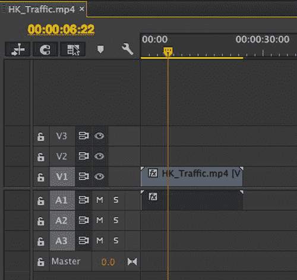
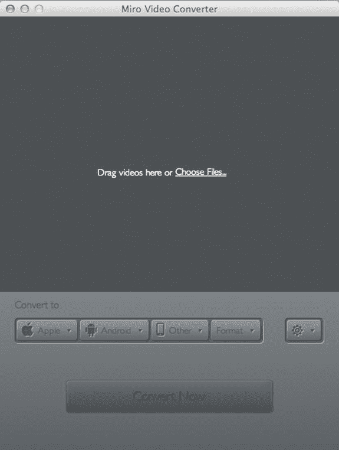
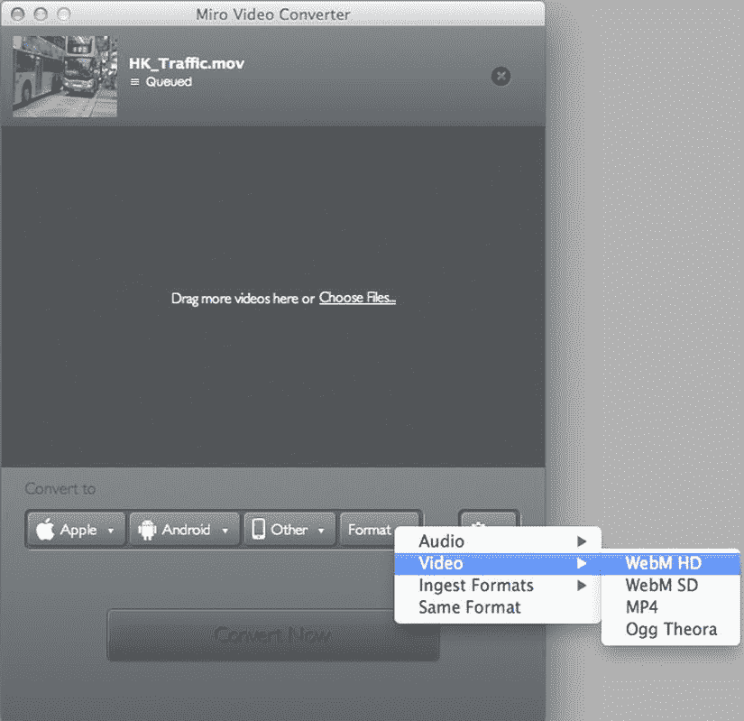
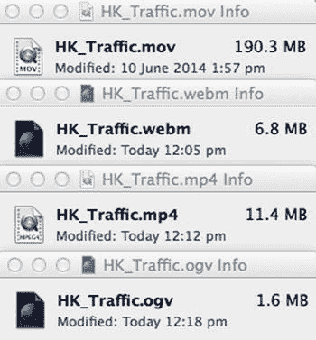
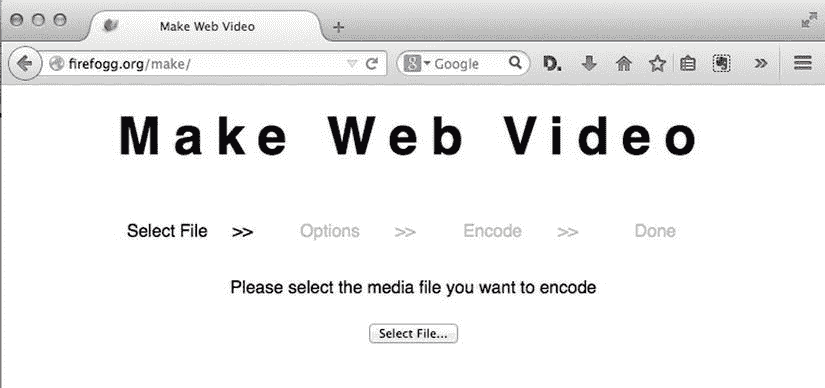
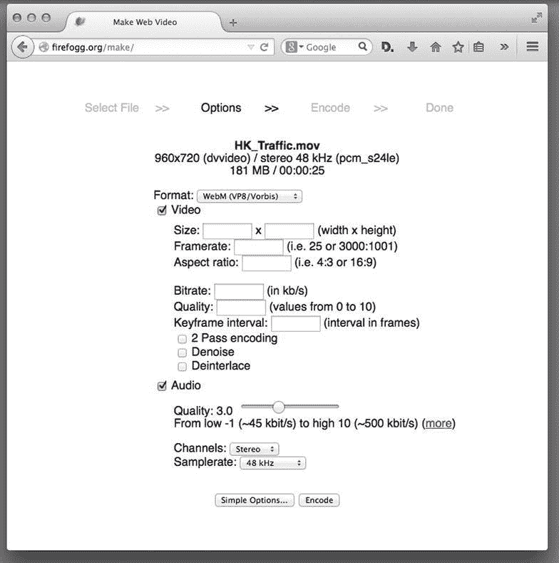
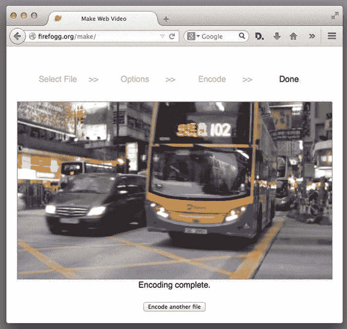
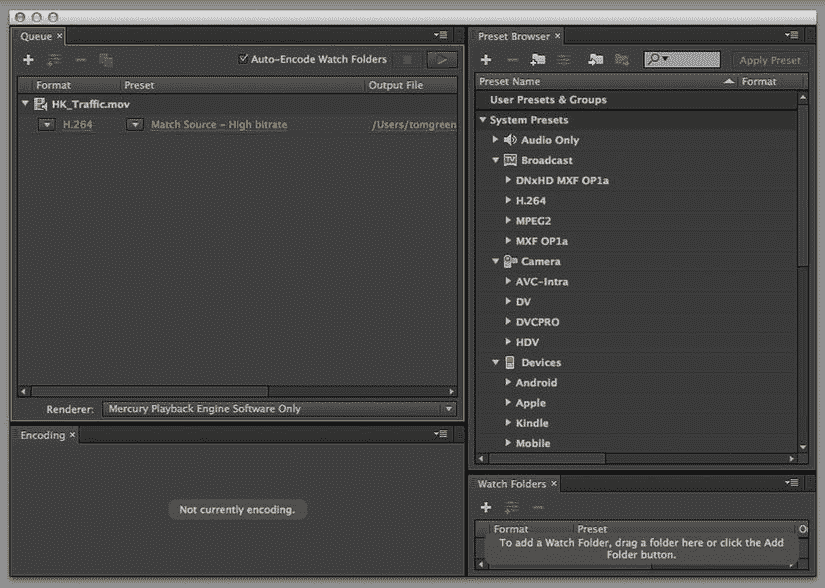
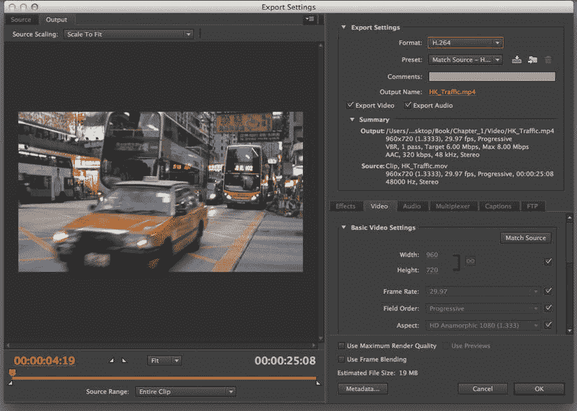

# 一、编码视频

为 HTML5 编码视频的“艺术”在许多方面是一种“黑色艺术”。除了文件格式之外，没有其他标准，从数据速率到音频的其他一切都留给您的最佳判断。因此，你在创建 MPEG4、WebM 和 Ogg 文件时所做的决定是“主观的”而不是“客观的”在播放 HTML5 中的视频和音频内容之前，您需要清楚地了解这些文件是如何创建的，以及您需要做出哪些决定来确保流畅播放。这个过程始于一个相当不和谐的启示:视频不是视频。用来识别视频和音频文件的扩展更像是鞋盒。文件格式——MPEG4、WebM 和 Ogg——是盒子上的名字，盒子里面是视频轨道和音频轨道。带有文件格式标签的盒子称为“容器”

在本章中，您将了解以下内容:

*   容器和编解码器的重要性。
*   用于编码 HTML5 使用的音频和视频文件的音频和视频编解码器。
*   如何使用 Miro 视频转换器创建`.mp4`、`.webm`和`.ogv`文件。
*   如何使用 Firefogg 扩展创建`.webm`和`.ogv`文件？
*   如何使用 Adobe Media Encoder 创建一个`.mp4`文件？
*   FFmpeg 用来对 HTML5 使用的各种音频和视频格式进行编码的命令。

容器

虽然你可能认为视频文件是一个`.mp4`文件，但实际上，它只不过是一种容器格式。它所做的是定义如何存储容器中的内容，而不是在容器中存储什么类型的数据。这是一个需要理解的关键区别。

如果你能够打开标有 MPEG4 的盒子，你会看到一个视频轨道(没有音频)，加上一个或多个音频轨道(没有视频)，这正是你在视频编辑器中编辑视频文件时所看到的，如图[图 1-1](#Fig1) 所示。这些轨迹通常是相互关联的。例如，音频轨道将包含允许它与视频轨道同步的标记。轨道通常包含元数据，例如视频轨道的图像的纵横比或音频轨道中使用的语言。封装轨道的容器还可以保存元数据，如视频作品的标题、文件的封面、导航的章节列表等。



[图 1-1](#_Fig1) 。您可以在视频编辑器中查看视频和音频轨道

此外，视频文件可能包含文本轨道，如字幕或副标题，或包含节目信息的轨道，或包含小缩略图的轨道，以帮助用户在使用快进到慢进控制时找到视频中的特定点。我们称这些轨道为“定时元数据”,稍后会谈到它们。现在，我们将专注于创建包含视频和音频轨道的视频文件。

与视频文件类似，音频文件也由一个容器组成，其中包含内容轨道。通常，创建音频文件和创建视频文件使用相同的容器格式，但是也有一些更简单的容器只用于音频。

通过编码成二进制形式并压缩比特，视频和音频信号被放入容器格式。这个过程称为编码，将二进制数据还原为音频/视频信号的过程称为解码。用于编码和解码的算法是编解码器(编码器/解码器)。我们一会儿会谈到编解码器；首先我们需要理解浏览器支持的容器格式。

视频容器

尽管有很多容器格式，但幸运的是浏览器只支持有限的一组，而且你只需要知道其中的三种。

*   **MPEG4** ，通常包含一个`.mp4`或`.m4v`扩展名。这个容器通常包含一个 H.264 或 H.265 编码的视频轨道和一个 AAC(高级音频编解码器)音频轨道，它基于苹果较旧的`.mov`格式，是智能手机或平板电脑中的摄像机最常用的格式。
*   **Ogg** 使用了`.ogg or .ogv`扩展。正如“引言”中所指出的，Ogg 是一种不受专利限制的开源格式。这个容器保存 Ogg 视频(Theora 编解码器)和 Ogg 音频(Vorbis 或 Opus 编解码器)。所有主要的 Linux 发行版都支持这种格式，并且可以在 Mac 和 Windows 平台上使用在`www.videolan.org/vlc/index.html`免费提供的 VLC 播放器进行播放。
*   **WebM** ，它使用了`.webm`扩展。正如“简介”中所指出的，WebM 是一种专门为 HTML5 视频设计的免版税开源格式。此容器包含 VP8 或 VP9 编码的视频轨道和 Vorbis 或 Opus 编码的音频轨道。除了需要分别安装 Media Foundation 或 Quicktime 组件的 Internet Explorer (IE)和 Safari 之外，许多现代浏览器本身都支持这种格式。

所有支持 Ogg 容器格式的浏览器也支持更现代的 WebM 容器格式。因此，这本书主要关注 WebM，为了完整起见，我们只在本章介绍 Ogg。

 **注**关于视频和浏览器的更多信息，请查看`http://en.wikipedia.org/wiki/HTML5_Video#Browser_support`。

音频容器

大多数视频容器也适用于纯音频文件，但使用不同的 MIME 类型和不同的文件扩展名。HTML5 支持以下音频文件格式:

*   **MPEG4** 只有音频的文件有一个 AAC 编码的音轨和一个`.m4a`扩展名。
*   **仅音频的 Ogg** 文件具有 Vorbis 编码的音轨和`.ogg`或`.oga`扩展名，或者 Opus 编码的音轨和`.opus`扩展名。
*   **WebM** 只有音频的文件有一个 Vorbis 或 Opus 编码的音轨，还有一个`.webm`扩展名。
*   **MP3** 文件包含 MPEG-1 音频第 3 层定义的编解码器，作为数据包序列。虽然 MP3 不是真正的容器格式(例如，它不能包含视频轨道)，但是 MP3 文件具有容器的许多特征，例如 ID3 格式头中的元数据。MP3 音频文件位于扩展名为`.mp3`的文件中。
*   **RIFF WAVE** 文件是音轨的容器，通常是原始 PCM 编码，这意味着音频数据基本上是未压缩的，因此文件更大。RIFF WAVE 文件扩展名为`.wav`。

这五种音频文件格式中的每一种都在一个或多个 Web 浏览器的音频或视频元素中得到支持。因为没有一种格式是所有浏览器都支持的，所以你至少需要选择两种格式来覆盖所有浏览器(比如 Opus 的`.m4a`和`.webm`)。(参见`http://en.wikipedia.org/wiki/HTML5_Audio#Supported_audio_codecs`。)

编解码器

当你在浏览器中观看视频时，有很多你看不到的东西。你的视频播放器实际上同时在做三件事。

*   它打开容器，查看使用了哪些音频和视频格式，以及它们是如何存储在文件中的，以便可以对它们进行“解码”
*   解码视频流并将图像拍摄到屏幕上。
*   解码音频并将数据发送给扬声器。

您可以从中了解到，视频编解码器是一种算法，它对视频轨道进行编码，以使计算机能够解压缩视频中的图像，并将其拍摄到您的屏幕上。视频播放器是实际进行解码和显示的技术。

视频编解码器

有两种类型的视频编解码器:有损和无损。

有损视频是最常见的类型。随着视频被编码，越来越多的信息被丢弃。这个过程称为压缩。压缩从丢弃与人眼视觉感知无关的信息开始。最终结果是文件变得非常小。视频文件越压缩，丢失的信息就越多，视频图像的质量就下降得越多。

同样，压缩一个已经用有损编解码器压缩过的文件也不是一件“好事”如果你曾经压缩过一个`.jpg`图像几次，你会注意到图像的质量下降了，因为 jpg 是一个“有损”的图像压缩器。同样的事情也发生在视频上。因此，当您对视频进行编码时，您应该始终保留原始文件的副本，以防您在稍后阶段需要重新编码。

顾名思义，“无损视频”不会丢失任何信息，产生的文件太大，无法用于在线播放。不过，它们对原始视频文件非常有用，尤其是在创建同一文件的三个版本时。一种常见的无损编解码器`Animation`可通过 QuickTime 获得。

有无数的编解码器在那里都声称做惊人的事情。谢天谢地，说到 HTML5 视频，我们只关心三个:H.264、Theora 和 VP8。

H.264

如果 H.264 是一个主要的犯罪人物，它会有几个别名:`MPEG-4 part 10`或`MPEG-4 AVC`或`MPEG-4 Advanced Video Coding`。不管它是如何为人所知的，这个编解码器的主要目的是使一个单一的编解码器可用于任何东西，从你口袋里的手机(低带宽，低 CPU)到你的台式电脑(高带宽，高 CPU)和几乎任何其他有屏幕的东西。为了实现这种相当广泛的情况，H.264 标准被分成一系列的规范，每个规范都定义了许多可选的特性，这些特性在文件大小和复杂性之间进行了权衡。就我们的目的而言，最常用的配置文件是

*   **基线:**配合 iOS 设备使用。
*   **Main:** 这主要是一个用于标清(SD) (4:3 纵横比)电视广播的历史配置文件。
*   **高:**用于网络、标清和高清(高清)视频发布。

你还应该知道，大多数非 PC 设备，如 iPhones 和 Android 设备，实际上是在一个单独的芯片上进行解码，因为他们的主 CPU 甚至没有强大到足以实时解码。最后，唯一不支持 H.264 标准的浏览器是 Opera。

虽然 H.264 仍然是 MPEG 世界中占主导地位的编解码器，但一种称为 H.265/HEVC (MPEG 高效视频编码)的新编解码器正在兴起。在 H.265 中创建内容的工具可能与创建 H.264 的工具相同，只是生成的文件更小或图像质量更高。

定理〔t0〕

Theora 由 On2 的 VP3 编解码器发展而来，随后由`Xiph.org`在 BSD 风格的许可下发布。所有主要的 Linux 安装和 Firefox 和 Opera 浏览器都支持 Theora，而 IE 和 Safari 以及 iOS 和 Android 设备不支持它。虽然免版税且开源，但它已被 VP8 取代。

vp8 的作用

这是“街区的新成员”从技术上讲，VP8 输出与 H.264 的高姿态是一致的。与 H.264 基线配置文件相比，它在低带宽情况下也能很好地工作。正如“简介”中所指出的，苹果并不大力支持这种编解码器，这也解释了为什么 Safari 或 iOS 设备不支持这种编解码器。但是，您可以通过安装 QuickTime 组件获得支持(参见`https://code.google.com/p/webm/downloads/list`)。类似地，从同一站点安装 Microsoft Media Foundation 组件可以支持 IE。

虽然 VP8 仍然是 WebM 世界中占主导地位的编解码器，但一种称为 VP9 的新编解码器正在出现。它的质量与 H.265 相当，但免版税。由于这两种编解码器几乎同时开始出现，硬件加速编码和解码的新硬件似乎专注于支持这两种编解码器。对于 HTML5 视频内容的用户和发布者来说，这是一个好消息，特别是如果你对 4K 这样的高分辨率视频感兴趣的话。

音频编解码器〔t0〕

没有音频的视频就像看没有金格尔·罗杰斯的弗雷德·阿斯泰尔跳舞。这似乎不太自然。

当音频源被数字化时，这被称为采样，因为声压值每隔几微秒被采样并被转换成数字值。基本上有三个参数会影响音频采样的质量:采样率(即，一秒钟内压力采样的频率)、通道数量(即，我们使用多少个位置对同一信号进行采样)和样本精度(即，我们采样的值有多精确，或者我们使用多少位来存储样本，也称为位深度)。电话质量声音的典型采样率是 8 kHz(即每秒 8，000 次)，而立体声音乐质量是 44.1 kHz 或 48 kHz。典型的信道数量是 2(立体声)，典型的比特深度对于电话质量是 8 比特，对于立体声音乐质量是 16 比特。使用不同的编解码器压缩所得的采样数据，以减少数字化音频的存储或带宽占用。

像视频一样，音频编解码器是编码音频流的算法，像视频编解码器一样，它们有两种风格:有损和无损。由于我们正在处理在线视频，我们希望尽可能地节省带宽，我们只需要关注有损音频编解码器。请注意，RIFF WAVE 格式是未压缩的，除了 IE 之外的所有浏览器都支持，所以如果您需要未压缩的音频，这将是您的选择。对于压缩音频，您只需了解三种编解码器。

在我们开始之前，让我们弄清楚音频。仅仅因为你可以坐在你的客厅里，用六个或更多的环绕立体声扬声器观看视频，并不意味着网络观众也获得了同样的特权。网络上的大多数内容都是单声道或立体声，而你的典型智能手机或移动设备不会给你提供比立体声更多的输出。但是，可以创建具有六个或更多通道的 Ogg Vorbis 和 MPEG AAC 文件，并在您的浏览器中以环绕声播放这些文件，前提是您的环绕声系统实际上可以通过您的操作系统在您的 web 浏览器中使用。有时候，您只是想在网页上添加一个音频文件。在这种情况下，您需要了解的三种音频编解码器是 MP3、Vorbis 和 AAC。

MP3 : MPEG-1 音频层 3

标题可能会令人困惑，但这是无处不在的 MP3 文件的正式名称。

MP3 文件最多可以包含两个声道(单声道或立体声)。MP3 有一个向后兼容的环绕声扩展，可能也适用于您选择的浏览器。MP3 可以不同的比特率编码。对于那些可能第一次遇到术语“比特率”的人来说，它是每秒钟有多少千个 1 和 0 被传输到你的计算机的量度。例如，1 k 比特率意味着每秒钟有 1000 比特(kb)从服务器传输到 MP3 播放器。

对于 MP3 文件，比特率(Kbps)的范围在 32、64、128 和 256 之间，最高可达 320 Kbps。简单地“加大”比特率只不过是加大了文件的大小，而音频质量却略有提高。例如，128 Kbps 的文件听起来比 64 Kbps 的文件好得多。但音频质量在 256 Kbps 时不会翻倍。这个话题的另一个方面是 MP3 文件允许可变比特率。为了理解这一点，考虑一个在文件中间有 5 秒钟静默的音频文件。这个音频段可以应用 32 Kbps 的比特率，一旦乐队开始演奏，比特率就跳到 128 Kbps。

除了 Opera 10.0+以外的所有现代浏览器都支持桌面上的 MP3 格式。对于智能手机，解码器在许多情况下是依赖于设备的；虽然你可以合理地期望播放 MP3 文件，但有一个 Ogg Vorbis 后备也无妨。MPEG 的 MP3 已经被更现代、更高效的 AAC 所取代。

炫风超人

虽然通常被称为 Ogg Vorbis，但严格来说，这是不正确的。Ogg 是容器，Vorbis 是容器中的音轨。当在 WebM 中找到 Vorbis 时，它是一个 WebM 音频文件，但带有 Vorbis 编码的音频轨道。一般来说，Vorbis 比 MP3 具有更高的保真度，并且免版税。Vorbis 编码无需从固定比特率列表中选择，您可以请求编码器选择您需要的比特率。与所有 Ogg 编解码器一样，Safari 和 IE 都不支持开箱即用的 Vorbis，您需要安装额外的组件来解码它们。

高级音频编码

这种格式，通常被称为“AAC”，在 1997 年被苹果公司指定为 iTunes 商店的默认格式时，变得引人注目。AAC 已经被 MPEG 标准化为 MPEG-2 和 MPEG-4。

在许多方面，AAC 是一种比它的 MP3 前身更“健壮”的文件格式。它在相同的比特率下提供更好的声音质量，但它可以编码任何比特率的音频，而无需应用于 MP3 格式的 320 Kbps 减速板。在 MP4 容器中使用时，AAC 出于完全相同的原因拥有多个配置文件，以适应不同的回放条件。

正如你可能已经猜到的，没有一种神奇的容器和编解码器的组合可以在所有浏览器和设备上工作。为了让视频在任何地方都能播放，你至少需要两个视频文件——MP4 和 webm，独立音频需要两个文件——MP3 和 Vorbis。视频稍微复杂一点，尤其是在容器中找到音频的时候。如果您正在制作 WebM 文件，组合是 VP8 和 Vorbis。在 MP4 的情况下，视频编解码器是 H.264，音频任务由 AAC 处理。

编码视频

现在，您已经了解了文件格式及其用途和局限性，让我们将这些知识应用到视频编码中。在我们开始之前，重要的是你要理解为什么我们使用四个不同的软件来创建视频文件。

主要原因是你们很多人读这本书的技巧水平。从对这个主题不熟悉的人到对使用命令行来完成各种任务感到舒服的人，都有。因此，顺序将是 Miro 视频转换器，Firefogg，Adobe 媒体编码器(AME) ，最后是 FFmpeg。唯一的商业产品是 Adobe 的，我们把它包括在内是因为，作为 Creative Cloud 的一部分，AME 有一个重要的安装基础。此外，它还让我们有机会探索 MP4 文件创建的一个重要方面。在对视频文件进行编码时，您还将被要求做出一些基本决定，这些应用中的每一个都为我们提供了讨论所做决定的机会。

最后，除了 FFmpeg 之外，您还需要使用编码器的组合，因为没有一种编码器可以用于所有情况，并且演示的四个应用包含了许多其他产品的共同特性。

我们从一个简单的编码器开始:Miro 视频编码器。具有 GUI(图形用户界面)的替代性开源编码软件包括手刹(`http://handbrake.fr/`)和 VLC ( `www.videolan.org/vlc/index.html`)，这两种软件都有 Linux、Mac 和 PC 版本。

使用 Miro 视频转换器编码

如果你正在寻找一个非常简单，易于使用的编码器，那么米罗是你的。话虽如此，Miro 确实能产生合理质量的输出，但是，由于其过于简单的界面，如果您对最终结果不满意，您可能需要尝试其他应用。

Miro Video Converter 是一个开放源代码、GPL 许可的应用，可用于 Macintosh、Windows 和 Linux 计算机。它是免费的，你可以在`www.mirovideoconverter.com`下载安装程序。

采取以下步骤创建视频的 WebM、MP4 或 Ogg Theora 版本:

1.  Run the Miro Video Converter application. When the application launches, you will see the home screen shown in [Figure 1-2](#Fig2). Next you will need to add your original video file to the converter queue. Do this by dragging the video file to the drop area, or choose the file through the file selector. Once added, it will appear in the drop area with a thumbnail as shown in the top of [Figure 1-3](#Fig3).

    

    [图 1-2](#_Fig2) 。Miro 转换器主屏幕

2.  The plan is to create the WebM version first. To do this, click the Format button and, as shown in [Figure 1-3](#Fig3), select WebM HD from the Video selection. The Convert Now button will turn green and change to read Convert to WebM HD. Click it.

    

    [图 1-3](#_Fig3) 。创建视频的 WebM 版本

3.  当视频被转换时，你会在界面顶部的视频缩略图旁边看到一个进度条。根据视频的大小，这可能是一个相当缓慢的过程，所以请耐心等待。编码器尝试保持原始视频文件的持续时间、分辨率、帧速率、音频采样率以及原始音频文件中使用的音频通道数。
4.  完成后，你会看到一个绿色的复选标记。Miro 将完成的文件放在 Mac 上的一个单独的文件夹中。查找任何转换的最简单方法是点按“显示文件”链接，并将文件移动到项目的视频文件夹中。Miro 还会将格式名称添加到生成的文件名中。请随意移除它。

你可以按照同样的过程来编码 MP4。只需在步骤 2 中从视频菜单中选择 MP4 而不是 WebM HD，并重复相同的过程。如果需要的话，对 Ogg Theora 也是如此。

这是一个展示这些编解码器在压缩方面有多么强大的好地方。在[图 1-4](#Fig4) 中，我们将文件的原始`.mov`版本放在刚刚创建的 WebM、MP4 和 Ogg Theora 版本之上。请注意原始版本和压缩版本之间在文件大小上的显著差异，大约为 180 MB。由于编解码器的有损特性，质量会有轻微的损失，但并不明显。事实上，Miro WebM 和 MP4 编码的质量相当，除了 WebM 将 48 kHz 音频重新采样为 44.1 kHz 之外，它们保留了所有视频参数。Ogg Theora 版本的质量要差得多，因为 Ogg Theora 的默认 Miro 编码设置是次优的。



[图 1-4](#_Fig4) 。文件大小的下降是由于“有损”编解码器

对于你“超级用户”:米罗在引擎盖下使用 FFmpeg。它通过 python 脚本调用 FFmpeg 命令行。如果您想更改 Miro 的默认编码，可以更改 python 脚本(参见`www.xlvisuals.com/index.php?/archives/43-How-to-change-Miro-Video-Converter-3.0-output-quality-for-Ogg-Theora-on-OS-X..html`)。如果您进行这些更改并重新编码 Ogg Theora，这将产生一个 12.4 MB 的文件，其质量与 WebM 和 MP4 文件相当。

如果您在浏览器中打开其中一个文件，它将扩展到浏览器窗口的最大尺寸。如果你的视频分辨率小于你当前的浏览器窗口，这看起来会有点模糊。您需要将浏览器窗口的大小缩小到视频的分辨率，这样图像会变得更清晰。

如前所述，你可以将任何视频文件转换成 WebM、Ogg Theora 和 MP4 格式。您还可以选择为许多 iOS 和 Android 设备准备文件。

在图 1-3 中，你会注意到左边的苹果按钮。点击这个，你就可以准备文件在全系列的苹果 iOS 设备上播放了。文件转换后，Miro 会询问您是否想要将此文件放入 iTunes 资料库。选择权在你。

【MIRO 视频转换器的压缩记分卡

*   原始文件:190.3 MB。
*   WebM: 6.8 MB。
*   MP4: 11.4 MB
*   OGG： 1.6 MB.

用 Firefogg 编码 Ogg 视频

Firefogg 是一个开源的、GPL 许可的 Firefox 扩展，它的唯一目的是将视频文件编码到 WebM 或 Ogg Theora。要使用此扩展，您需要在计算机上安装 Firefox 版或更高版本。要添加扩展，转至`http://firefogg.org/`并遵循安装说明。

按照以下步骤使用 Firefogg 对视频进行编码:

1.  Launch Firefox and point your browser to `http://firefogg.org/make/`. You will see the Make Web Video page shown in [Figure 1-5](#Fig5). Click the Select File … button and navigate to the file to be encoded.

    

    [图 1-5](#_Fig5) 。我们从选择要编码的视频开始

2.  当您选择要编码的文件时，界面会发生变化，向您显示原始文件的规格以及格式和预设的两个弹出菜单。您可以在带有 VP8 和 Vorbis 编解码器的 WebM、带有 VP9 和 Opus 编解码器的 WebM 以及带有 Vorbis 的 Ogg Theora 之间进行选择。还要选择一个适合您的输入文件格式的预设，这通常是为您预先选择的。如果这是您选择适应编码参数的最大限度，那么请随意单击“编码”按钮。它会问你编码文件的名称和存储位置。
3.  In this instance, we want to exert a lot more control over the encoding parameters. Click the Advanced Options button. The interface changes to that shown in [Figure 1-6](#Fig6). It shows you the most important encoding parameters for WebM (VP8/Vorbis) video. This is actually a subset of the FFmpeg encoding parameters, which—as in the case of Miro Video Encoder—is the actual encoding software used under the hood by Firefogg.

    

    [图 1-6](#_Fig6) 。Firefogg 高级选项对话框

    这里提供的选择让您可以绝对控制视频的质量。让我们过一遍。

    *   **格式 :** 给你三个选择。WebM (VP9/Opus)选项为您提供了使用最新版本的 WebM 格式编解码器的机会。WebM (VP8/Vorbis)选择是最常见的格式，最终选择 Ogg (Theora/Vorbis)允许您创建 Ogg Theora 版本的文件。我们选择了奥格(Theora/Vorbis)。
    *   **大小:**你可以改变视频的分辨率，但要记住，改变这个值而不保持长宽比会扭曲最终产品或将其放在信箱里。此外，增加视频的物理尺寸无非是在更多输出像素上拉伸输入像素，因此必须从现有像素创建新像素。这种上采样实际上会通过抗锯齿降低质量，应该避免。我们选择将此视频的大小调整为 50%，并将宽度和高度值更改为 480 x 360。
    *   **帧率 :** 如果您将此部分留空，将使用编码视频的帧率。常见的帧速率是每秒 30 帧(fps)。如果视频中没有太多的运动，将 fps 降低到 15 将不会对播放质量产生明显的影响。我们输入 30 作为值，因为我们的示例视频是道路交通，因此有很多运动。
    *   **长宽比:**如果视频是标清，输入 4:3。如果是高清，输入 16:9。我们的示例视频是 4:3。
    *   **比特率:**在许多方面，这是“橡胶上路”的地方这里没有神奇的数字，但研究表明，美国的平均宽带速度是每秒 6.6 兆比特(Mbps)。不要迷恋这个数字，因为同样的研究显示平均移动宽带速度是 2.7 Mbps。如果您正在传输 HTML5 视频，您可能希望以最小公分母为目标，因此一个好的起点是 2000。即便如此，这种选择也可能是危险的。任何视频的比特率是音频和视频比特率的总和。如果您决定对视频使用 2700 Kbps，对音频使用 700 Kbps，那么您可以很好地保证用户在移动设备上的体验将包括视频的开始和停止。在我们的例子中，因为视频的物理尺寸很小，我们决定对视频轨道使用 1，200 Kbps，这样就为音频轨道留下了足够的带宽。
    *   质量:你可以选择 0 到 10 之间的任何数字。选择会影响文件大小和图像质量。如果视频是用你的智能手机拍摄的，4 到 6 之间的值就可以了。为高质量的工作室制作节省 10 英镑。我们的视频是使用翻转摄像机拍摄的，因此我们选择 6 作为质量设置。
    *   **关键帧间隔 :** 这是两个全质量视频帧之间的时间间隔。中间的所有帧将只是前一个完整视频帧的差异帧，从而提供良好的压缩。然而，当寻找时，不能访问差异帧，因为它们不能自己解码。默认情况下，Firefogg 使用 64 帧作为关键帧间隔，这意味着在 30 fps 的情况下，您基本上可以搜索到 2 秒的分辨率。这对于几乎所有的应用都是可以接受的。将此项留空，让软件使用其默认设置完成工作。
    *   **2 遍编码:**我们总是选择这个选项。此功能也称为“双通道可变比特率编码”，总是可以提高输出质量。它所做的是在第一次通过时搜索视频，寻找帧之间的突变。第二遍执行实际的编码，并确保在发生突变的地方放置高质量的关键帧。这避免了在这些边界上创建差异帧，这显然是低质量的。例如，假设视频主题是一场汽车比赛。赛车会疾驰几秒钟，然后就只剩下观众和一条空赛道了。第一遍捕捉并记录这两个转换。第二个过程将在汽车缩放通过帧后重置关键帧，并允许在运动较少的镜头中使用较低的比特率。
    *   **去噪 :** 该滤波器将尝试消除输入视频中发现的任何伪像。我们不会担心这个选项。
    *   **去隔行扫描 :** 仅当您使用的是为广播准备的剪辑时，才选择此项。我们不会担心这个选项。

    你可能已经注意到，音频选择有点有限。我们的视频只包含街道上的交通噪音和常见的背景街道噪音。考虑到这一点，我们并不十分关心音频质量。仍然必须做出一些选择。

    *   质量:这个滑块有点欺骗性，因为它实际上设置了音频比特率。我们选择的值为 6。如果音频质量至关重要，请选择 10。如果只是不重要的背景噪声，值 1 就可以了。除此之外，只有反复试验才能让你满意。
    *   **频道 :** 你的选择是立体声和单声道。我们选择单声道是因为音频的性质。如果这个文件是专业制作的，并且只用于桌面播放，那么立体声将是合理的选择。还要记住，选择立体声会增加文件大小。
    *   **采样率 :** 这三个选项决定了音频文件的准确性。如果精度是首要考虑因素，那么 48 kHz 或 44.1 kHz 是合理的选择。我们选择 22 千赫，因为我们的音频不是那么重要，以准确复制。
4.  做出选择后，我们单击了“编码”按钮。当它完成两遍时，你会看到进度条两次，视频[图 1-7](#Fig7) 将在 Firefox 浏览器中启动。



[图 1-7](#_Fig7) 。Ogg 视频文件在 Firefox 浏览器中播放

编码 WebM 时，前面的选项几乎是相同的。这是因为这些是任何视频编码器的典型选项。在使用 Firefogg Javascript API(应用编程接口)时，Firefogg 中还有更多的选项可以使用(参见`www.firefogg.org/dev/`)。它允许您通过 Firefogg Firefox 扩展将编码包含在自己的 Web 应用中。

**火雾压缩记分卡**

*   原始文件:190.3 MB。
*   WebM (VP8/Vorbis): 14.4 MB。
*   WebM （VP9.作品）：7.6 MB。
*   Ogg Theora(默认设置):11.4 MB。
*   Ogg Theora(我们自定义编码):4.2 MB。

使用 Adobe Media Encoder CC 编码 MP4 文件

对 MP4 文件进行编码涉及到许多与上例中遇到的比特率、音频质量等相同的决策。虽然有很多产品会对. mp4 进行编码，从视频编辑器到 Miro 的复杂性不等，但它们都非常相似，因为不管是什么产品，你都会被要求做出相同的决定。在本例中，我们使用 Adobe Media Encoder 来展示这些决策。此外，媒体编码器给本章至此概述的过程增加了另一个复杂程度。所以让我们开始吧。

1.  When the Media Encoder launches, drag your video into the queue area on the left, as shown in [Figure 1-8](#Fig8). Over on the right side of the interface are a number of preset encoding options. We tend to ignore them, preferring, instead, to set our own values rather than use ones that may or may not fit our intention.

    

    [图 1-8](#_Fig8) 。要编码的文件被添加到编码队列

2.  When the file appears, click on the “Format” link to open the Export Settings dialog box shown in [Figure 1-9](#Fig9).

    

    [图 1-9](#_Fig9) 。导出设置对话框是神奇的地方

    对话框的左侧允许您设置视频的入点和出点，除此之外别无其他。对话框的右侧是您做出一些基本决定的地方。

3.  The first decision is which codec to use. We clicked the format pop-down and selected the H.264 codec from the list. You don’t need to select a preset but make sure the output name includes the `.mp4` extension.

     **注意**Adobe Media Encoder 创建的任何输出都与源文件放在同一个文件夹中。

4.  如果未选择导出视频和导出音频，请选择它们。不检查这些将会有明显的后果。
5.  点击视频选项卡，编辑基本视频设置。这是我们为 MP4 容器的视频部分设置值的地方。
6.  单击复选框将允许您更改基本视频设置区域中的值。如果确实需要更改物理尺寸，请确保选择了链节，宽度和高度值将按比例更改。
7.  单击“配置文件”旁边的复选标记，如本章前面所指出的，选择用于网络视频的“高”配置文件。如果我们的目标包括 iOS 设备，那么“基线”将是配置文件的选择。

设置比特率

下一个要做的重要决定涉及比特率。如果你点击下拉菜单，你会看到三个选择:CBR(恒定比特率)，VBR(可变比特率)，一个通道，和 VBR，两个通道。您会注意到，当您选择每个选项时，目标比特率区域会发生变化，为两个 VBR 选项增加了一个额外的滑块。那么有什么区别呢？

CBR 编码将设置的数据速率应用于整个视频剪辑。仅当您的片段在整个片段中包含相似的运动层次(想象田野中的一棵树)时，才使用 CBR。

VBR 编码根据压缩器所需的数据，将数据速率下调至您设定的上限。这解释了额外滑块的出现。不像 Ogg Theora 的例子，你可以设置比特率的上限和目标。

当谈到编码 mp4 视频，VBR 2 通行证是黄金标准。这与我们用于 Ogg Theora 的两遍编码相同。

1.  从下拉菜单中选择“VBR，二次通过”。
2.  Set the Target Bitrate to 1.2 and the Maximum Bitrate to 1.5 as shown in [Figure 1-10](#Fig10). Remember, bitrate is the sum of the audio and video bitrates. We know our bandwidth limit is around 2 Mbps so this leaves us ample room for the audio. Also note, the projected file size is now sitting at 4 MB.

    

    [图 1-10](#_Fig10) 。比特率目标是在. mp4 容器中为 H.264 编解码器设置的

3.  忽略关键帧距离设置。让软件来做吧。现在我们可以把注意力转向 mp4 容器中的音轨了。

设置 AAC 编解码器的音频值

mp4 容器使用 H.264 编解码器压缩视频轨道，使用 AAC 音频编解码器压缩容器中的音频轨道。在本例中，我们将对视频中的音轨应用 AAC 编码。事情是这样的。

1.  Click the Audio tab to open the Audio options shown in [Figure 1-11](#Fig11).

    

    [图 1-11](#_Fig11) 。音频编码选项

2.  在格式区域选择 AAC。另外两个选项——杜比数字和 MPEG——不能用于网络。
3.  选择 AAC 作为音频编解码器。虽然有两个其他选项——AAC+版本 1 和 AAC+版本 2——但它们更适用于流式音频和无线电广播。
4.  将采样率降至 32000 Hz。原因是音轨比其他任何东西都更像背景噪音，降低其采样率不会对音频质量产生重大影响。
5.  从通道下拉菜单中选择单声道。
6.  设置音频质量为高，虽然；对于我们剪辑中包含的音频，中等质量设置不会有明显的不同。
7.  将比特率值设置为 64。如果这个视频包含一个立体声音轨，那么 160 到 96 之间的任何值都是适用的。在我们的情况下，这是一个单声道轨道，64 Kbps 是一个很好的目标媒体。还要注意比特率确实会影响文件大小。在我们的例子中，简单地选择 160 Kbps 会增加 1 MB 的文件大小。
8.  高级设置为您提供了两种播放优先级选择。显然，由于我们是通过浏览器运行这个文件，比特率是显而易见的选择。
9.  做出选择后，单击 OK 按钮返回队列。当您到达时，单击绿色的开始队列按钮开始编码过程。当它结束时，你会听到一声蜂鸣。

【ADOBE 媒体编码器的压缩记分卡

*   原始文件:190.3 mb。
*   MP4: 4 MB。

使用 FFmpeg 编码媒体资源

在本章的最后一节，我们将重点介绍如何使用开源命令行工具来执行编码。

我们将使用的工具是 FFmpeg ，这也是许多在线视频发布网站的首选工具，据称包括 YouTube。每个人都可以在每个主要平台上使用这个软件，并且它是独立于供应商的。

从`http://ffmpeg.zeranoe.com/builds/`安装 Windows 版本。在 Mac OS X 上，我们建议使用 Homebrew(确保使用以下命令行选项安装它:`-with-libvorbis`、`–with-libvpx`用于 WebM 支持，以及`–with-theora`用于 Theora 支持)。在 Linux 上，应该有一个为您的发行版构建的包。即使你有一个奇特的平台，你也很可能通过从源代码编译来使它工作。

我们从编码 MPEG-4 H.264 视频开始。

编码 MPEG-4 H.264 的开源工具基本上都使用 x264 编码库，该库是在 GNU GPL 许可下发布的。x264 是功能最全的 H.264 编解码器之一，被广泛认为是速度最快、质量最高的编解码器之一。

让我们假设您有一个来自数码摄像机的视频文件。它可能已经是 MPEG-4 H.264 格式，但让我们假设它是 DV、QuickTime、VOB、AVI、MXF 或任何其他这样的格式。FFmpeg 理解几乎所有的输入格式(假设你安装了正确的解码库)。运行`ffmpeg --formats`将列出所有支持的编解码器格式。

要获得 FFmpeg 中 libx264 编码的所有可能选项，请运行以下命令:

```html
$ ffmpeg -h encoder=libx264
```

在`https://trac.ffmpeg.org/wiki/Encode/H.264`有关于命令行开关的最新信息。

以下是一些重要的命令行开关:

*   -c 开关指定要使用的编解码器。":v "指定视频编解码器，libx264 指定 x264 编码器。“:a”指定音频编解码器，libfaac 指定 aac 编码器。
*   -profile:v 开关指定 H.264 视频配置文件，可以选择基线、主或高。
*   要限制比特率，请使用-b[比特率]开关，其中“:v”表示视频，“:a”表示音频。
*   要指定多遍运行，请使用-pass [number]开关。
*   要指定音频通道的数量，请使用-AC[通道]和采样速率，请使用-ar[速率]。

下面是一个简单的命令行，它使用主概要将输入的`.mov`文件转换成输出的`.mp4`文件:

```html
$ ffmpeg -i input.mov -c:v libx264 -profile:v main -pix_fmt yuv420p -c:a libfaac output.mp4
```

需要指定像素格式，因为 Apple QuickTime 在 H.264 中仅支持 4:2:0 色度子采样的 YUV 平面颜色空间。

下面是两遍编码的例子。第一遍只需要视频作为输入，因为它创建了第二遍输入所需的临时日志文件。

```html
$ ffmpeg -i input.mov -c:v libx264 -profile:v main -b:v 1200k -pass 1 -pix_fmt yuv420p -an temp.mp4
$ ffmpeg -i input.mov -c:v libx264 -profile:v main -b:v 1200k -pass 2 -pix_fmt yuv420p \
-c:a libfaac -b:a 64k -ac 1 -ar 22050 output.mp4
```

**FFMPEG MP4 的压缩记分卡**

*   原始文件:190.3 MB。
*   MP4(编码设置不变):9.5 MB。
*   MP4(第一遍不带音频):3.8 MB。
*   MP4(第二遍):4 MB。

编码 Ogg 理论

Ogg Theora 编码的开源工具基本上使用的是`libtheora`编码库，它是由`Xiph.org`在 BSD 风格许可下发布的。基于 libtheora 编写了几个编码器，其中使用最广泛的是`ffmpeg2theora`和`FFmpeg`。

`ffmpeg2theora`和`FFmpeg`的主要区别在于`ffmpeg2theora`固定使用 Xiph 库进行编码，而`FFmpeg`可以选择编解码器库，包括自己的 Vorbis 实现。`ffmpeg2theora`要担心的选择要少得多。要使用 FFmpeg 对 Ogg Theora 进行编码，请确保使用`libvorbis`和`vorbis encoding library`；否则，您的文件可能不是最佳的。

因为`ffmpeg2theora`是为创建 Ogg Theora 文件而优化的，因此对 Ogg Theora 有更多具体的选项和功能，我们在这里使用它。

以下命令可用于创建带有 Vorbis 音频的 Ogg Theora 视频文件。它将简单地在一个新的 Ogg Theora/Vorbis 编码资源中保留输入视频的宽度、高度和帧速率，以及输入音频的采样率和通道数。

```html
$ ffmpeg2theora -o output.ogv input.mov
```

就像 MPEG H.264 一样，Ogg Theora 也提供了两遍编码的可能性，以提高视频图像的质量。下面是如何用两遍运行`ffmpeg2theora`的方法。

```html
$ ffmpeg2theora -o output.ogv -- two-pass input.mov
```

在`ffmpeg2theora`中有更多的选择。例如，你可以在 Ogg Theora 文件中加入字幕、元数据、提高可看性的索引，甚至可以通过一些内置的过滤器来提高视频质量。请注意，包含索引是默认的`since ffmpeg2theora version 0.27`。索引将极大地提高浏览器的搜索性能。

您可以通过调用来发现所有选项

```html
 $ ffmpeg2theora -h
```

编码 WebM

编码 WebM 的开源工具基本上使用的是`libvpx`编码库，它是在 Google 的 BSD 风格许可下发布的。FFmpeg 有许多用于编码 WebM 的命令行选项。最重要的在这里描述:`https://trac.ffmpeg.org/wiki/Encode/VP8`。

如果您输入以下命令，您应该能够创建一个带有 VP8 视频和 Vorbis 音频的 WebM 文件。它将简单地在新的 WebM 编码资源中保留输入视频的宽度、高度和帧速率，以及输入音频的采样速率和通道数:

```html
$ ffmpeg -i input.mov output.webm.
```

奇怪的是，FFmpeg 试图将 WebM 文件压缩到 200 Kbps 的视频比特率，这导致了非常差的图像质量。

以下是以 1，200 Kbps 为目标的命令行:

```html
$ ffmpeg -i input.mov -b:v 1200k output.webm
```

**FFMPEG WEBM 压缩记分卡**

*   原始文件:190.3 MB。
*   WebM(编码设置不变):1.7 MB。
*   WebM (1200Kbps 比特率):4.2 MB。

使用在线编码服务

虽然您可以自己进行视频编码，甚至使用 FFmpeg 建立自己的自动编码管道，但使用在线编码服务可能更容易。有大量的服务可供选择(如 Zencoder、Encoding.com、HeyWatch、Gomi、PandaStream、uEncode)，并有不同的定价选项。使用在线编码服务是特别有趣的，因为它们会用已经优化的参数为您运行软件，并且成本将与您需要进行的编码量成比例。

编码 MP3 和 Ogg Vorbis 音频文件

您可能已经猜到，编码音频远比编码视频容易。有几个程序可以将音频记录编码成 MP3 容器格式，包括`lame`或`FFmpeg`(顺便说一下，它们使用了与 lame 相同的编码库:`libmp3lame`)。虽然大多数音频编辑软件都能够对 MP3 进行编码，但我们还是使用`FFmpeg`。事情是这样的。

1.  Enter the following command:

    ```html
    $ ffmpeg -i audiofile -acodec libmp3lame -aq 0 audio.mp3
    ```

    `aq`参数表示音频质量，其潜在值在 0 和 255 之间，本例中使用的 0 表示最佳质量。还有其他参数可以更改，如比特率、通道数、音量和采样率。

    要对 Ogg Vorbis 文件进行编码

2.  Enter the following command:

    ```html
    $ ffmpeg -i audiofile -f ogg -acodec libvorbis -ab 192k audio.ogg
    ```

    `ab`参数表示 192 Kbps 的目标音频比特率。还有更多参数可以更改，例如通道数量、音量和采样速率。

3.  你也可以用`oggenc`编码成 Ogg Vorbis。这个命令稍微容易使用，并且有一些特定的 Ogg Vorbis 功能。输入以下命令创建一个目标比特率为 192K 的 Ogg Vorbis 文件:

    ```html
    $ oggenc audiofile -b 192 -o audio.ogg
    ```

`oggenc`命令还提供了多个额外的参数，例如包含了 skeleton——它将创建一个索引来改进文件的搜索功能——一个质量参数`–q –`,其值在`-1`和`10`之间，其中`10`是最好的质量。该命令还包含允许您更改通道、音量、采样率的参数，以及包含元数据的名称-值对的方法。

Oggenc 只接受 raw、wav 或 AIFF 格式的音频输入文件，所以它比 ffmpeg 命令有更多的限制。

摘要

我们不否认这是一个相当“科技含量”的章节。原因很简单:如果你不了解它们的底层技术以及这些文件是如何创建的，你就无法真正在 HTML5 中使用音频和视频文件。我们从解释容器格式开始，然后进入最重要的编解码器。从那里我们开始对视频进行编码。虽然我们向您展示了许多用于视频编码的免费和商业工具，但重点是您在过程的每一步都必须做出的决定。正如我们所指出的，这些决定更多的是主观的，而不是客观的，无论你使用哪种软件来编码视频，你都会做出类似的决定。

在本章的最后，我们从基于 GUI 的编码转向使用命令行工具 FFmpeg 来创建音频和视频文件。同样，您将不得不就许多对音频和视频输出有直接影响的重要因素做出相同的主观决定。

说到输出，现在你知道了文件是如何创建的，让我们用 HTML5 来播放它们。那是下一章的主题。我们在那里见。