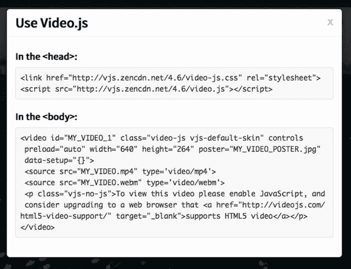
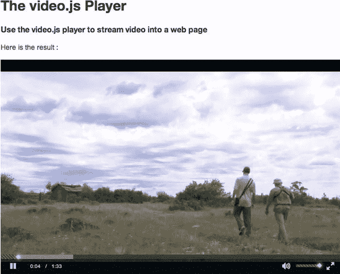

# 三、JavaScript API

随着 HTML5 的兴起，使用 JavaScript 来扩展网页上各种元素的功能也相应增加了。事实上，越来越少看到 HTML5 页面在页眉或文档的其他地方不包含指向 JavaScript 文档或库的链接。在处理 HTML5 视频或音频时也是如此。

JavaScript 是 web 浏览器中用于客户端编程任务的脚本语言。web 浏览器中使用的 JavaScript 是标准化 ECMAScript ( `www.ecma-international.org/publications/standards/Ecma-262.htm`)编程语言的一种方言。JavaScript 程序可以为网页执行从简单到复杂的各种任务，从操作简单的用户界面功能到执行复杂的图像分析程序。JavaScript 克服了 HTML 和 CSS 的限制，提供了充分的灵活性，可以通过编程方式更改文档对象模型(DOM) 中的任何内容。

由于可以在 web 浏览器中关闭 JavaScript 支持，所以解释 HTML 和 CSS 提供了什么而无需进一步编写脚本是很重要的。然而，将 JavaScript 加入其中，会将这些 web 技术转变为应用程序开发的强大平台，我们将会看到媒体元素能做出什么贡献。

在 HTML5 和 CSS3 开发之前的几年里，JavaScript 被用来为 Web 带来许多新特性。在许多人分享共同需求的地方，JavaScript 库和框架如 jQuery、YUI、Dojo 或 MooTools 被创造出来。许多 web 开发人员使用这些框架来简化 web 内容的开发。使用这些库的经验反过来又推动了 HTML5 的几个新特性的引入。因此，我们现在看到 HTML5 中的许多早期框架的功能，以及新框架的发展，使得开发 HTML5 web 应用程序变得更加容易。

由于 JavaScript 在 web 浏览器中执行，因此它只使用用户机器的资源，而不必与 web 服务器交互来更改网页。这对于处理任何类型的用户输入都特别有用，并且使得网页对用户的响应更快，因为网络上的任何交换都不会降低网页的响应速度。因此，在不需要将用户信息保存在服务器上的情况下，使用 JavaScript 最为合适。例如，游戏可以以这样的方式编写，即游戏的逻辑在 web 浏览器中以 JavaScript 执行，并且只有用户获得的高分才需要与 web 服务器进行交互。这当然假设游戏所需的所有资源——图像、音频等。—已经取回。

JavaScript 通过 DOM 与 HTML 接口。DOM 是一个分层的对象结构，它包含了一个 web 页面的所有元素以及它们的属性值和访问函数。它表示 HTML 文档的层次结构，并允许 JavaScript 访问 HTML 对象。webIDL，Web 接口定义语言(`www.w3.org/TR/WebIDL/`)，已经被创建来允许对象暴露给 JavaScript 和 Web 浏览器实现的接口的规范。

原因很简单。HTML 仅仅是一种在页面上放置对象的标记语言。这些对象及其属性由浏览器保存，并通过编程接口公开。IDL 实际上是一种语言，用来描述浏览器持有的这些数据结构，并使 JavaScript 可以对它们进行操作。

WebIDL 是专门为

*   提供 HTML 中经常使用的便利结构，例如 DOM 节点集合、标记列表或名称-值对列表。
*   公开 HTML 元素的内容属性，并允许获取和设置它们的值。
*   解释 HTML 元素属性映射到什么 JavaScript 类型以及如何映射。
*   解释在读取属性值时以及将它们提交给 JavaScript 之前必须对属性值进行的转换(例如，统一资源定位符从相对 URL 到绝对 URL 的解析)。
*   列出元素可能经历的状态以及可能对它们执行的事件。
*   与 HTML 文档的浏览上下文相关。

理解在第 2 章中介绍的 HTML5 元素的属性和在 DOM 中为元素公开的属性之间的区别是很重要的。前者被称为**内容属性**，后者被称为 **IDL 属性。**理解两者区别的最简单的方法是，HTML 标记中使用的属性是**内容属性**，它们的值仅仅是字符串。JavaScript 对象中与它们同名的兄弟是 **IDL 属性**，包含特定 JavaScript 类型的值。例如，字符串值为“1.0”的内容属性作为浮点值为 1.0 的 IDL 属性向 JavaScript 公开。

为了简化对媒体元素的 JavaScript API 的解释，我们将分别查看从内容属性和纯 IDL 属性创建的 IDL 属性。这将有助于更好地理解哪些属性是从 HTML 传入 JavaScript 的，哪些属性是为了允许脚本控制和操作而创建的。

出于本章的目的，我们假设您对 JavaScript 有基本的了解，并且能够遵循 WebIDL 规范。与阅读许多面向对象编程语言中的类定义相比，阅读 WebIDL 相当简单。我们将解释 HTML5 媒体元素为 WebIDL 中的 JavaScript 提供的新引入的接口，并提供一些关于通过使用这些接口 JavaScript 可以实现什么的示例。我们从内容属性开始。

反射内容属性

我们已经在第二章中熟悉了 HTML5 媒体元素的内容属性。它们都直接映射到媒体元素的 IDL 接口。HTML 规范将这种映射称为 IDL 属性中内容属性的“反映”。你可以在媒体元素 JavaScript 对象中看到来自[第二章](2.html)的内容属性的反映。

```html
interface HTMLMediaElement : HTMLElement {
      attribute DOMString src;
      attribute DOMString crossOrigin;
      attribute DOMString preload;
      attribute boolean autoplay;
      attribute boolean loop;
      attribute boolean controls;
      attribute boolean defaultMuted;
    };

    interface HTMLAudioElement : HTMLMediaElement {};

    interface HTMLVideoElement : HTMLMediaElement {
      attribute unsigned long width;
      attribute unsigned long height;
      attribute DOMString poster;
    };

    interface HTMLSourceElement : HTMLElement {
      attribute DOMString src;
      attribute DOMString type;
      attribute DOMString media;
    };
```

如果你仔细查看列表，第 2 章中出现的每个元素和属性都会出现。所有这些属性都可以在 JavaScript 中读取(也称为“get”)和设置。您可以在前面提到的代码块中看到内容属性值被转换成的 JavaScript 类型。

那么这是如何在 HTML5 文档上工作的呢？代码示例将在`http://html5videoguide.net/`发布。清单 3-1 中的代码展示了如何通过 IDL 属性设置和获取一些内容属性的例子:

[***清单 3-1***](#_list1) 。感受媒体元素的内容属性

```html
<video controls autoplay>
  <source src="video/HK_Traffic.mp4" type="video/mp4">
  <source src="video/HK_Traffic.webm" type= "video/webm">
</video>

<script type="text/javascript">
  videos = document.getElementsByTagName("video");
  video = videos[0];
  video.controls = false;
  video.width = ’400’;
  alert(video.autoplay);
</script>
```

我们首先添加一个`video`元素，然后加入控件和自动播放参数。从那里我们简单地添加指向视频的`source`属性，我们就可以开始了。然而，某些视频属性的“工作方式”现在已经脱离了 HTML，转而交给了代码块底部的

在我们的页面中，第一个片段的最终目的地如清单 3-19a 所示。

[***清单 3-19a***](#_list19a) 。使用 JWPlayer

```html
<!DOCTYPE html>
<html>
<head>
<meta charset="UTF-8">
<title>JW Player</title>
<script src="[http://jwpsrv.com/library/V3LeVgEZEeW7FhJtO5t17w.js](http://jwpsrv.com/library/V3LeVgEZEeW7FhJtO5t17w.js)"></script>
</head>
```

您可能已经注意到，当您将播放器指向视频时，它只指向文件的`.mp4`版本。很明显，有问题。如果你想让视频在 Opera 中播放，你必须提供一个`.webm`版本的文件。一旦你将代码粘贴到主体中，下面是你如何修复它。

1.  在代码中。将这一行:`file: ’` `http://html5videoguide.net/BeginningHTML5Video/CH3/video/Vultures.mp4` `’`复制到你的剪贴板上。
2.  将剪贴板的内容粘贴到播放器代码中的`.mp4`行之后，并将文件扩展名改为`.webm`，如[清单 3-19b](#list19b) 所示。

[***清单 3-19b***](#_list19b) 。使用 JWPlayer

```html
<div id=’ playerXYalbMUtktfx ’></div>
<script type=’text/javascript’>
    jwplayer(playerXYalbMUtktfx).setup({
        file: ’video/Vultures.mp4’,
        file: ’video/Vultures.webm’,
        image: ’img/BabyVulture.jpg’,
        title: ’JW Player Exercise’,
        width: ’100%’,
        aspectratio: ’16:9’
    });
</script>
```

当我们在 Opera 中进行浏览器测试时，结果就是你在[图 3-23](#Fig23) 中看到的。


[图 3-23](#_Fig23) 。那个。webm 版出演歌剧

使用视频。JS

如果一个开源的、易于使用的、完全可定制的播放器是你正在寻找的，那么你可能想试试 Video JS。这个播放器是由 Zencoder 的人制作的，旨在吸引从初学者到代码战士的所有 web 技能水平。

尽管这个播放器有很多内幕，我们将只展示一个使用这个播放器的非常简单的例子。由于其开源的性质，视频。通过在`www.videojs.com`下载源文件并将其添加到您的 web 目录中，或者通过在`http://designer.videojs.com`修改 LESS 或 CSS 文件来创建您自己的皮肤，可以很容易地定制 JS。如果你真的想看视频。JS API，你可以在`https://github.com/videojs/video.js/blob/stable/docs/api/vjs.Player.md`找到文档。

以下是如何使用 Video JS 播放视频:

1.  Open a browser and navigate to `www.videojs.com`. The home page, shown in [Figure 3-24](#Fig24), is where the “magic” happens.

    

    [图 3-24](#_Fig24) 。视频。JS 主页是你唯一的一站

    您将创建的播放器位于页面中间。播放按钮位于左上角，它的存在是有原因的:不让它碍事。“嵌入此播放器”按钮旁边的滑块允许您控制此按钮和视频控件的大小。

    底部的三个彩色芯片允许您自定义视频控件的颜色。从左到右，以下是这些颜色的影响:

    *   灰片:改变控件中使用的图标的颜色，包括大的覆盖按钮。
    *   蓝筹:改变进度条和音量条的背景色。
    *   Black Chip:更改播放器控件的背景色。

    这里要小心，因为颜色包含在颜色选择器中，单击色卡即可访问该选择器。这里没有办法实际输入一个十六进制或 RGBA 颜色值。

     **注意**如果你做了错误的颜色选择，你可以通过点击浏览器中的重新加载按钮来重置为默认颜色。

2.  Click the Embed This Player button to open a window (see [Figure 3-25](#Fig25)) that presents you with a template for the embed code.

    

    [图 3-25](#_Fig25) 。Video.js 嵌入代码

3.  复制区域的代码并粘贴到你的 HTML 页面头部。请注意，对播放器设计的任何更改都会导致额外的 CSS 被添加到元素中。
4.  Return to the browser and select the code found in the <body> area. Paste it into the div on the HTML page where the video is to be located.

    代码准备就绪后，您需要对<video>元素的内容做一些修改。在我们的案例中，我们:</video>

    *   将宽度和高度属性值更改为视频的值。
    *   更改了海报值以链接到海报图像的位置。
    *   Changed the source element to link to the `.mp4` and `.webm` versions of the video.

        结果代码如[清单 3-20](#list20) 所示。

        [***清单 3-20***](#_list20) 。嵌入 video.js 播放器

        ```html
        <head>
            <link href="http://vjs.zencdn.net/4.6/video-js.css" rel="stylesheet">
            <script src="http://vjs.zencdn.net/4.6/video.js"></script>
        </head>

        <body>
                <video id="MY_VIDEO_1" class="video-js vjs-default-skin" controls
                       preload="auto" width="683" height="432" poster="img/BabyVulture.jpg"
                       data-setup="{}">
                    <source src="video/Vultures.mp4" type=’video/mp4’/>
                    <source src="video/Vultures.webm" type=’video/webm’/>
                    <p class="vjs-no-js">
                        To view this video please enable JavaScript, and consider upgrading to a web browser that
                        <a href="http://videojs.com/html5-video-support/" target="_blank">supports HTML5 video</a>
                    </p>
                </video>
        </body>
        ```

5.  保存 HTML 文件并在浏览器中打开它。海报框出现，当您点击播放按钮时，视频(参见[图 3-26](#Fig26) )开始播放。



[图 3-26](#_Fig26) 。视频在视频 JS 播放器中播放

 **提示**如果您想将播放按钮移动到视频的中间，将下面的类—`vjs-big-play-centered`—添加到视频元素中。

您可能已经注意到了 JWPlayer 和 Video.js 之间的一个奇怪的区别:Video.js 使用一个原生 HTML5 <video>元素来嵌入所有的控件功能，包括 Flash fallback，而 JWPlayer 使用的是一个</video>

元素。<video>元素方法使得开发者更容易使用我们在本书中已经介绍过的 API 直接操纵 JavaScript 中的视频元素。然而，这种方法有一个缺点，它避开了不支持<video>元素的旧浏览器的 video.js 适配层。因此，任何控制调用都不会对 Flash 后备播放器产生影响。JWPlayer 甚至一开始就不公开 HTML5 API，从而避免了这一点。如果你不在乎老浏览器，那么像 video.js 那样直接使用浏览器 JavaScript API 是很有诱惑力的。</video></video>

自定义播放器

有时，各种浏览器或第三方播放器使用的播放器不符合项目的设计目标。这可能是由于品牌，功能集，甚至只是个人喜好。在这种情况下，构建一个定制的视频播放器是唯一合理的选择。

这是 JavaScript API 的使用真正闪光的地方。它最重要的用例是“滚动你自己的”控件，其样式在所有浏览器上都是一样的。由于这是一个如此常见的用例，我们为您提供了一个如何做到这一点的示例。它包括 HTML 代码的框架、一些 CSS 和控制它所需的 JavaScript 调用。

我们的计划是构建如图 3-27 所示的播放器。你可能会发现我们选择的控件和它们的布局有点不寻常。这是因为我们决定构建一个针对盲人或视力受损用户的播放器，提供他们可能需要的主要按钮。为了更好地使用，这些按钮被故意保持为大的、彩色编码的，并且不在视频中。您可以使用空格键轻松地切换并激活它们。


[图 3-27](#_Fig27) 。使用 JavaScript API 的自定义可访问视频播放器

请注意，在 Safari 中，默认情况下，“tab”是禁用的，不能作为跨页面元素的导航方式，您必须使用 option-tab 来导航。要打开“tab”导航，请打开您的首选项并选中“首选项高级按 tab 突出显示页面上的每个项目。”

播放器由几个界面元素组成。它有一个进度显示(视频下面的栏)，后面显示播放的秒数和视频持续时间。下面是一组按钮。这些按钮允许视频开始播放(播放/暂停切换)、倒退 5 秒、停止播放(并重置为文件开始)、增加 10 个百分点的音量、降低 10 个百分点的音量以及静音/取消静音切换。视频右侧是音量显示，静音时显示为灰色，音量水平以条形高度的百分比显示。

 **注意**如果你真的决定构建自己的视频播放器，做好你的研究，调查已经这样做的网站。请特别注意所使用的控件元素、它们在界面中的位置以及它们的大小。如果你的团队中有一个用户体验专家，当涉及到播放器中各种控制元素的设计和放置时，他或她的输入将是无价的。

我们通过提供 HTML 代码的框架开始实现这个播放器，如清单 3-21a 所示。

[***清单 3-21a***](#_list21a) 。自定义播放器的 HTML 代码

```html
<div id="player">
  <div id="video">
    <video width="400" height="225" poster="img/BabyVulture.jpg">
      <source src="video/Vultures.mp4"  type="video/mp4"/>
      <source src="video/Vultures.webm" type="video/webm"/>
    </video>
    <div id="positionview">
      <div id="transportbar"><div id="position"></div></div>
      <div id="time">
        <span id="curTime">00:00</span>/<span id="duration">00:00</span>
      </div>
    </div>
  </div>

  <div id="volumecontrol">
    <div id="volumebar"><div id="volume"></div></div>
    <div id="vol"></div>
  </div>
  <div style="clear: both;"></div>

  <div id="controls">
    <div><input id="play"    type="image" src="img/0.gif" alt="Play"></div>
    <div><input id="repeat"  type="image" src="img/0.gif" alt="Repeat"></div>
    <div><input id="stop"    type="image" src="img/0.gif" alt="Stop"></div>
    <div><input id="louder"  type="image" src="img/0.gif" alt="Louder"></div>
    <div><input id="quieter" type="image" src="img/0.gif" alt="Quieter"></div>
    <div><input id="mute"    type="image" src="img/0.gif" alt="Mute"></div>
  </div>
</div>
```

一个 id 为 player 的

封装了代码，以便我们稍后可以给它一个样式，将其显示为一个实体。在 *#player* div 里面有三个主 div`: #video, #volumecontrol`和`#controls`。`#video`部分包含视频元素以及走带控制条和时间显示。`#volumecontrol`包含音量条和音量显示。`#controls`包含了所有的按钮。

注意，视频元素没有`@controls`属性，原因很明显，我们有自己的控件。此外，请注意代表按钮的 *<输入>* 元素是如何通过将它们设为“`image`”类型并赋予它们一个`@alt`属性值而变得可访问的。最佳做法是为图像输入元素提供替代文本，以便视力有障碍的用户可以访问它们。由于我们将在 CSS 中提供实际的按钮，我们必须将一个 1 x 1 px 的 gif 占位符放入*<>*元素的`@src`属性中，以确保它们不会显示为不完整的图像。

接下来是造型。在清单 3-21b 中，我们展示了 CSS 的摘录。

[***清单 3-21b***](#_list21b) 。自定义播放器的 CSS 样式

```html
<style type="text/css">
    #player {
      padding: 10px;
      border:    5px solid black;
      border-radius: 15px;
      box-shadow: 10px 10px 5px gray;
      box-sizing: content-box;
      max-width: 455px;
    }
    #positionview {
      width: 400px; height: 40px;
    }
    #transportbar {
      height: 20px;
      width: 300px;
      position: relative;
      float: left;
      border: 2px solid black;
    }
    #position {
      background: #D7BC28;
      height: 20px;
      width: 0px;
    }
    #time {
      position: relative;
      float: right;
    }
    #video {
      position: relative;
      float: left;
      padding: 0;
      margin: 0;
    }
    /* include your own CSS for the volume control here and
       style every button with an offset on buttons.png (we only show one) */
    #controls div input {
      background:url(’img/buttons.png’) no-repeat top left;
      border:none;
      height: 30px;
      width: 30px;
      padding: 5px;
      display: inline-block;
    }
    #controls div #repeat {
      background-position:0 -901px;
    }
    </style>
```

玩家 div 得到了一个漂亮的边框，圆角和一个阴影使其突出。这是“让软件来做工作”这句格言的经典例子如果将其添加为`.jpg`或`.png`图像，则需要下载额外的资源，这通常会降低网页的速度。此外，CSS 设计是自适应的(即，它适应不同的布局大小而不损失质量)。使用图像时情况就不一样了，图像需要缩放到不同的布局尺寸。

对于位置显示，我们有一个外部的 *<分区>* 和一个内部的 *<分区>* ，其中外部的一个提供视频持续时间的框，内部的一个显示当前播放位置。

这些按钮都使用相同的`.png`，其中包括所有正在使用的按钮(这被称为“图像精灵”)。为了显示一个特定的按钮，你在 CSS 中使用一个偏移量和`a` 30 x 30 px 的裁剪区域。使用图像精灵减少了必须下载的资源数量，从而再次加快了网页的显示速度。

最后，我们添加 JavaScript，如清单 3-21c 所示，它增加了功能。我们首先为播放器中的元素创建变量名。

[***清单 3-21c***](#_list21c) 。DOM 元素变量的 JavaScript 设置

```html
<script type="text/javascript">
      var video     = document.getElementsByTagName("video")[0];
      var position  = document.getElementById("position");
      var curTime   = document.getElementById("curTime");
      var duration  = document.getElementById("duration");
      var volume    = document.getElementById("volume");
      var vol       = document.getElementById("vol");
      var play      = document.getElementById("play");
      var repeat    = document.getElementById("repeat");
      var stop      = document.getElementById("stop");
      var louder    = document.getElementById("louder");
      var quieter   = document.getElementById("quieter");
      var mute      = document.getElementById("mute");
```

这样一来，我们开始使用 IDL 属性值(参见[清单 3-21d](#list21d) )来提供持续时间和音量值显示的信息:

[***清单 3-21d***](#_list21d) 。Loadedmetadata、timeupdate 和 volumechange 事件回调以更新持续时间和音量显示

```html
video.addEventListener("loadedmetadata", init, false);
function init(evt) {
  duration.innerHTML = video.duration.toFixed(2);
  vol.innerHTML      = video.volume.toFixed(2);
}

video.addEventListener("timeupdate", curTimeUpdate, false);
function curTimeUpdate(evt) {
  curTime.innerHTML = video.currentTime.toFixed(2);
  position.style.width = 300*video.currentTime/video.duration + "px";
}

video.addEventListener("volumechange", dispVol, false);
function dispVol(evt) {
  vol.innerHTML = video.volume.toFixed(2);
}
```

最后，我们已经准备好使用 JavaScript API 中可用的方法、事件和 IDL 属性(参见清单 3-21e )让各种按钮工作。注意每个按钮都有一个 *onclick* 事件处理程序，它与改变视频状态联系在一起。

[***清单 3-21e***](#_list21e) 。Loadedmetadata、timeupdate 和 volumechange 事件回调以更新持续时间和音量显示

```html
play.addEventListener("click", togglePlay, false);
function togglePlay(evt) {
  if (video.paused == false) {
    video.pause();
    play.style.backgroundPosition = "0 0";
  } else {
    video.play();
    play.style.backgroundPosition = "0 -151px";
  }
}

repeat.addEventListener("click", rewind, false);
function rewind(evt) {
  video.currentTime = video.currentTime - 2.0;
}

stop.addEventListener("click", restart, false);
function restart(evt) {
  video.pause();
  play.style.backgroundPosition = "0 0";
  video.currentTime = 0;
}

louder.addEventListener("click", volInc, false);
function volInc(evt) {
  changeVolume(video.volume + 0.1);
}

quieter.addEventListener("click", volDec, false);
function volDec(evt) {
  changeVolume(video.volume - 0.1);
}

mute.addEventListener("click", toggleMute, false);
function toggleMute(evt) {
  video.muted = !video.muted;
  if (video.muted) {
    volume.className = ’disabled’;
  } else {
    volume.className = ’’;
  }
}

function changeVolume(changeTo) {
  if (video.muted){
    toggleMute();
  }
  if (changeTo > 1.0) {
    changeTo = 1.0;
  } else if (changeTo < 0.0) {
    changeTo = 0.0;
  }
  volume.style.height = 225*changeTo +’px’;
  volume.style.marginTop = 225-(225*changeTo) + ’px’;
  video.volume = changeTo;
  }
</script>
```

花点时间浏览一下代码。您会注意到许多熟悉的 IDL 属性— `video.duration`、`video.volume`、`video.currentTime`、`video.paused`和`video.muted`都在这里用来提供按钮背后的功能。最后，您还会注意到`play()`和`pause()`控制方法。

你刚刚经历的是使这个播放器完全起作用的 JavaScript。CSS 的目的是管理表示。将这两者结合在一起，你就拥有了一套强大的工具，几乎可以创造任何东西。

摘要

这是一个相当长但非常重要的章节。至关重要的是，你们都理解 JavaScript 在这个过程中的位置，以及它的目的是提供功能。

在本章中，我们介绍了以下内容:

*   <video>和

    <audio>元素的 JavaScript API。我们以结构化的方式处理这个问题，从代表 HTML 标记内容属性的 IDL 属性开始，比如`@src`、`@width`和`@height`。然后我们讨论了代表资源特性的 IDL 属性，比如`as @currentSrc`、`@duration`和`@volume`。然后我们查看了回放相关的 IDL 属性，比如`@currentTime`、`@paused`和`@ended`、*。*</audio></video> 
*   媒体资源的状态，包括`networkState`、`readyState`、`played`、`buffered`或`seekable`时间范围。
*   控制方法`load(), play(), pause()`和`canPlayType()`。
*   媒体元素激发的事件列表。有相当数量，包括`loadedmetadata, canplay, playing, pause, seeking, volumechange, durationchange`，和`ended`。
*   定制播放器的第三方解决方案，它们都大量使用了 JavaScript API。
*   JavaScript API 的一个实际用例:运行您自己的自定义控件。

现在，我们手头已经有了在 HTML5 应用程序中成功使用

<audio>和<video>的所有工具。在本章的最后，我们已经开始通过玩家控制界面查看一些可访问性问题。下一章将深入探讨易访问性这一主题，同时也将关注国际化和可用性问题。我们在那里见。</video></audio>