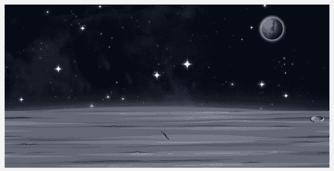
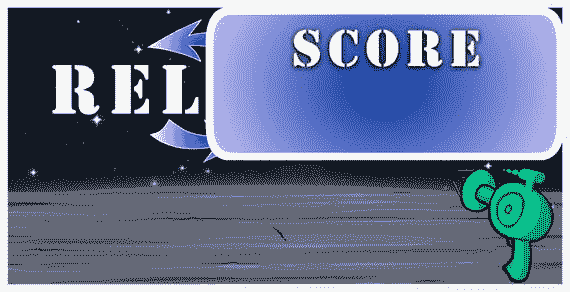

# 3.是时候应用一点 CSS 了

```html
    #tower-of-pisa
        {
           font-style: italic;
        }

```

CSS 代表级联样式表，是一种用于帮助设计网站样式的语言。它可以用来描述页面在颜色、布局和字体方面的外观。

那么为什么我们的游戏需要这个呢？以前，我们把 HTML 想象成我们游戏的骨架或骨骼结构。CSS 代码将成为我们游戏的外观。然而，如果你熟悉构建网站，你可能会想知道 CSS 在 HTML5 游戏开发中实际上扮演了多大的角色。

随着 CSS3 的到来，CSS 中的动画允许浏览器确定哪些元素应该获得 GPU 层，这导致了硬件加速。但是，不要一开始就把所有的动画都转移到 CSS 中。一般来说，让每个元素都有自己的层并不是一个好主意。如果你这样做，那么你的 GPU 将会很快耗尽内存。我相信您会同意，作为开发人员，没有比收到可怕的“内存不足”错误更糟糕的感觉了。

## 从一个快速测试开始

在我们对齐和调整我们的图像之前，让我们从一个简单的测试开始我们的 CSS 文件。这个测试是为了看看我们是否能把整个页面的背景变成红色。通过这样做，我们将确保`default.html`页面与我们的 CSS 页面成功通信。

让我们打开`SZ_master.css`文件。当文件打开时，它应该是完全空白的。键入以下几行:

```html
html {
      height: 100%;
     }
body {
       padding: 0 0 0 0;
       margin: 0;
       user-select: none;
       background-colour: red;
}

```

您现在可以保存并关闭该文件。

从这段代码中可以看出，CSS 文件的语法由三部分组成。

*   `selector`这通常是你想要定义的 HTML `<tag>`。在前面的代码中，我们将`<html>`和`<body>`标记定义为选择器。
*   顾名思义，我们在这里定义我们希望对标签的什么属性应用样式。在我们的`<html>`示例中，我们将 height 属性定义为 style。
*   `value`您希望为属性定义的实际样式。在我们的例子中，我们决定标签的高度是屏幕尺寸的 100%。

有趣的是，您可以通过简单的分组为多个标签指定相同的参数。

在测试之前，我们需要将这个文件链接到我们的`default.html`文件中。重新打开`default.html`文件，键入以下新行(粗体):

```html
<html>
 <head>
  <link href="css/SZ_master.css" rel="stylesheet" />

 </head>
 <body>
  <div id="SZ_maincontent">
   
   
   
   
  </div>
 </body>
</html>

```

保存文件，然后关闭它。回到`My_Work_Files`文件夹，双击`default.html`文件。

您应该会看到与上次相同的屏幕(即四幅图像)，但背景是红色而不是白色。这很好，因为这意味着您成功地将 CSS 文件链接到了主 HTML 页面。


我们已经在`SZ_master.css`文件中介绍了相当多的 CSS 技术。让我们过一遍。

*   这将我们的 HTML 页面的高度设置为 100%。意味着我们的内容应该能够从上到下覆盖可见屏幕。

值得注意的是，我们可以使用属性 min-height 和 max-height 来覆盖 height 属性。

*   `padding` `: 0 0 0 0;`这将清除页面内容周围的一个区域。考虑做一个四边空白，在这里你指定你想要它有多厚。在我们的例子中，我们希望内容覆盖整个页面，所以我们将所有四个边的填充设置为 0。四个 0 分别对应`top`、`right`、`bottom`、`left`。
*   `position` `: fixed;`顾名思义，这是根据浏览器窗口将图像定位到一个固定的位置。所以`top: 0;`意味着距离浏览器顶部 0 像素(像素是一种度量单位)(也就是说，你希望它固定在顶部)。类似地，`bottom: 0;`表示您希望图像放在浏览器窗口的底部。最后，`left: 0;`和`right: 0;`是指放置在浏览器窗口左侧或右侧的图像。
*   `margin` `:0;`边距设置元素周围空白的大小。在我们的例子中，我们不希望屏幕边缘有任何空白。
*   通过使用`user-select`属性，我们可以控制玩家如何与屏幕上的文本元素交互。在这种情况下，它被设置为`none`，这意味着我们不希望用户选择或单击任何文本元素。这样做的原因是，它可能会分散玩实际游戏的注意力(例如，允许用户选择高分的文本)。
*   `background-colour` `: red;`顾名思义，这个设置屏幕的背景颜色。如果你愿意，试着用`yellow`或者你选择的任何颜色来代替`red`这个词。保存文件并刷新浏览器。

我们还在 HTML 文件中添加了另一行代码:

```html
<link href="css/SZ_master.css" rel="stylesheet" />

```

标签是在页面上包含 CSS 文件的标准方式。`href`指定了我们希望包含的 CSS 文件的位置。`rel`标签指定了 HTML 文件和 CSS 文件之间的关系。在这种情况下，CSS 文件充当 HTML 文件的样式表。

## 我们的背景图像

让我们开始修复图像。我们将从背景图像开始。理想情况下，我们希望这个图像填充我们的页面(就像红色背景颜色一样)。

打开`SZ_master.css`文件，输入以下新行(所有新文本以粗体显示):

```html
html {
      height: 100%;
     }
body {
       padding: 0 0 0 0;
       margin: 0;
       user-select: none;
     }

img  {

       max-width: 100%;

       height: auto;

       user-drag: none;

       user-select: none;

       -moz-user-select: none;

       -webkit-user-drag: none;

       -webkit-user-select: none;

       -ms-user-select: none;

     }

#SZ0_0 {

        position: fixed;

        top: 0;

        left: 0;

        min-width: 100%;

        min-height: 100%;

      }

```

保存文件，然后关闭它。回到`My_Work_Files`文件夹，双击`default.html`文件。

请注意，我们已经从`body`标签中移除了`background-colour: red;`。请确保从代码中删除该行。您的文件看起来应该与显示的完全一样。

您可能想知道为什么我们用四种不同的方式对`user-select`属性进行编码。第一种方法是 CSS 中的标准属性(即`user-select`)。然后，我们继续定义由各种渲染引擎提供的厂商前缀属性。这允许针对每个单独的浏览器引擎设置特定的属性，以安全地解决实现之间的不一致。

以下是我们使用的供应商前缀属性:

*   `webkit`对于 Chrome 和 Safari
*   `moz`对于火狐来说
*   `ms`对于 Internet Explorer

历史上，在 W3 最终澄清之前，我们使用这些前缀来实现新的 CSS 特性。因此，随着时间的推移，属性的最终版本将移除前缀。

保存文件，然后关闭它。回到`My_Work_Files`文件夹，双击`default.html`文件。

你的屏幕应该看起来像下面的截图。



您应该首先注意到背景图像现在覆盖了整个屏幕。另外，其他三个图像完全从屏幕上消失了。别担心。它们仍然在那里——在背景图像后面。


添加到 CSS 中的第一个样式是用于标签的。这意味着定义的样式适用于我们添加到页面中的每一幅图像。我相信你会同意这是一个节省大量时间的技术，因为另一种选择是为我们添加的每张图片重复费力的样式。

无论如何，不是每个图像都需要相同的风格。您可以看到第二种样式是专门为一个图像标签编写的，该标签被标识为`#SZ0_0`。

我们放在``标签中的样式是更通用的样式，应该适用于所有图像。然后，我们可以为特定的图像添加单独的样式，并添加更多的样式。我们甚至可以覆盖写在``标签中的样式。

在我们离开这之前，我们为什么把标签叫做`#SZ0_0`？如果回到第 2.3 节，请注意以下几点:

```html


```

该图像被标识为`SZ0_0`。在 CSS 中，您可以通过在 ID 前放置散列符号(`#`)来识别图像。

让我们来看看我们使用的新 CSS 技术。

*   `max-width` `: 100%; height: auto;`我们希望图像伸展到其容器的整个宽度。此外，我们希望代码在应用新宽度时自动确定高度。这确保我们在调整大小时保持图像的纵横比。
*   `user-drag` `: none;`我们不希望用户能够拖动屏幕上的图像。
*   这些是 CSS 扩展，是网络浏览器支持的属性，但还不是官方 CSS 规范的一部分。
*   `top: 0; left: 0;`设置图像的上边缘和左边缘。在这种情况下，我们希望图像始终位于其容器的左上角。
*   顾名思义，我们希望图像的最小宽度和高度是其容器的最大尺寸。

## 我们的其他图像

我们可以开始修复其他三幅图像。首先，这里有一个关于图像和它们应该放在哪里的提示:

*   `SZ_gun`枪的图像应该在屏幕的右下角。
*   `SZ_reload`重新加载按钮应该出现在屏幕的左上角。
*   `SZ_score`得分图像应该出现在屏幕的右上角。

现在打开`SZ_master.css`文件，键入以下新行(所有新文本都以粗体显示):

```html
html {
      height: 100%;
     }
body {
       padding: 0 0 0 0;
       margin: 0;
       user-select: none;
     }
img  {
       max-width: 100%;
       height: auto;
       user-drag: none;
       user-select: none;
       -moz-user-select: none;
       -webkit-user-drag: none;
       -webkit-user-select: none;
       -ms-user-select: none;
     }
#SZ0_0 {
        posi
tion: fixed;
        top: 0;
        left: 0;
        min-width: 100%;
        min-height: 100%;
      }
 #SZ0_1 {

        position: fixed;

        bottom: 0;

        right: 0;

}

 #SZ0_2 {

        position: fixed;

        top: 0;

        left: 0;

}

 #SZ0_3 {

        position: fixed;

        top: 0;

        right: 0;

}

```

保存文件，然后关闭它。

在这段代码中，我们为三幅图像中的每一幅定义了三个属性。但是，请注意，这些属性及其后续值是完全相同的。前面，我提到了这样一个事实，即我们可以通过简单地对多个标签进行分组来为它们指定相同的参数。因此，如果您愿意，可以尝试使用前面的代码，将粗体代码替换为以下代码:

```html
#SZ0_1, #SZ0_2, #SZ0_3 {

        position: fixed;

        top: 0;

        right: 0;

}

```

回到`My_Work_Files`文件夹，双击`default.html`文件。

您的屏幕应该看起来像下面的截图。



虽然你现在可以看到所有四个图像的对齐位置，但它们的大小不太合适；但是，不要担心这个。在下一章，我们将使用 JavaScript 来调整图像的大小。


`position`属性指定用于元素的定位方法的类型(静态、相对、固定或绝对)。然后使用 top、right、bottom 和 left 属性定位元素。但是，除非首先设置了`position`属性，否则这些属性将不起作用。根据位置值的不同，它们的工作方式也不同。

让我们简单看一下四个位置值。

*   `static`元素不受上、右、下、左属性的影响。
*   `relative`表示设置一个相对定位的元素的顶部、右侧、底部和左侧属性，导致它被调整远离其正常位置。
*   `fixed`表示相对于视窗定位，这意味着即使页面滚动，它也总是停留在同一位置。top、right、bottom 和 left 属性用于定位元素。
*   `absolute`表示相对于最近的祖先定位(而不是相对于视口定位，如 fixed)。

在我们的例子中，我们使用了`fixed`和`bottom: 0; right: 0;`。在上一节中，我们设置了图像的左上角；而在这里，我们可以从图像容器的右下角设置图像。

因为我们需要枪总是位于屏幕的右下角，所以在这种情况下使用 bottom-right 属性比使用 top-left 属性更有意义。