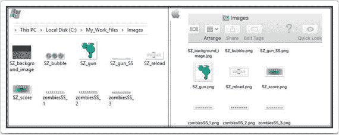
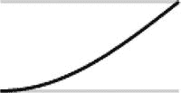
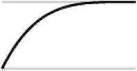
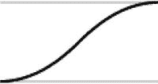

# 六、僵尸在哪里？

“用代码行来衡量编程进度就像用重量来衡量飞机制造进度一样。”

比尔盖茨

让我们回顾一下我们的僵尸在游戏中需要做什么。我们需要六个走向屏幕的僵尸。每个僵尸都有一个精灵表和它的行走动画。当僵尸到达其动画的结尾时，它需要重置到原始位置。

## 创造僵尸:第一部分

首先，我们需要将以下四个 sprite 工作表添加到您的`image`文件夹中:

*   `zombiesSS_1.png`:僵尸行走的科学家
*   `zombiesSS_2.png`:行走的女丧尸
*   `zombiesSS_3.png`:行尸走肉男
*   `SZ_bubble.png`:被困在泡泡里的三只僵尸

转到`My_Work_Files`文件夹的`Raw Images`文件夹中的`images`文件夹。找到名为`zombiesSS_1.png`、`zombiesSS_2.png`、`zombiesSS_3.png`和`SZ_bubble.png`的文件，并将这些文件复制到`Images`文件夹中，现在看起来应该是这样的:



## 创造僵尸:第二部分

在这一节的结尾，你会看到一个僵尸在我们星球的边缘。为此，我们需要从头开始编写僵尸代码。再次，我提前道歉，因为将有相当多的编码。然而，看到自己的僵尸出现在屏幕上的兴奋感值得所有的努力。

打开`SZ_zombie_movement.js`文件，里面应该是完全空白的。键入以下几行:

```html
//let’s create a zombie
function SZ_createZombie(whichOne){

 //create a new div to hold the zombie SS
   var div = document.createElement('div');

 //we need to hard code the CSS styles we want
   div.setAttribute('style','position: fixed; top:0; left:0;')

 //we want to position our zombie exactly at the tip of the planet
   var top_position= $('#SZ0_0').height() * 0.435;

 //Xpos can be anywhere on our x axis
   var left_position = Math.floor(Math.random() * ($('#SZ0_0').width())-(ratio*50)) + (ratio*50);

 //let's position our zombie
   div.style.left = left_position+'px'; div.style.top = top_position+'px';

 //give it an id
   div.id = 'zombie'+whichOne;

 //finally let's add our zombie to the screen
   document.body.appendChild(div);

 //put this new zombie through our SS function
  setup_zombie_SS(whichOne);

}

```

您现在可以保存并关闭该文件。

我们在准则中引入了一些新的元素，在“更多信息”一节中有详细介绍。

在我们进一步编码之前，我们需要将这个新文件链接到我们的`default.html`文件。重新打开`default.html`文件，键入以下新行，以及现有行中的额外文本(所有新文本都以粗体显示):

```html
<html>
 <head>
  <script src="js/jquery.js"></script>
  <script src="js/jquery-ui.js"></script>
  <script src="js/SZ_main.js"></script>
  <script src="js/SZ_setupContent.js"></script>
  <script src="js/SZ_movement.js"></script>
  <script src="js/ss.js"></script>
  <script src="js/SZ_SS.js"></script>
  <script src="js/SZ_touch.js"></script>
  <script src="js/SZ_zombie_movement.js"></script>

  <link href="css/SZ_master.css" rel="stylesheet" />
 </head>
 <body>
  <div id="SZ_maincontent">
   
   <div id="SZ0_1" ></div>
   <div id="SZ0_2" >
    
   </div>
   <div id="SZ0_3" >
    
   </div>
  </div>
 </body>
</html>

```

保存文件，然后关闭它。现在，我们可以继续进一步发展我们的僵尸雪碧表。重新打开`js`文件夹中的`SZ_SS`文件。

键入以下新行(所有新文本都以粗体显示):

```html
//We need a one stop function that will allow us to process sprite sheets
function setup_SpriteSheet(div_name, image_name, no_of_frames, widthx, heightx) {

 //need the ratio of the container's width/height
   var imageOrgRatio =  $(div_name).height() / $(div_name).width() ;

 //need to ensure no trailing decimals
   var ratio2 = Math.round(ratio * 10) / 10;

 //check that the width is completely divisible by the no of frames
   var newDivisible = Math.round((widthx * ratio2) / no_of_frames);

 //the new width will be the number of frames multiplied by our new divisible
   var newWidthx = newDivisible * no_of_frames;

 //also the new height will be our ratio times the height of the div containing our image
   var newHeightx = heightx * ratio2;

 //apply our new width to our CSS
   $(div_name).css('width', (newWidthx));

 //apply our new height to our CSS
   $(div_name).css('height', newHeightx);
//
 //take the image name and apply as a background image to our div
   $(div_name).css('background-image', 'url(' + image_name + ')');

 //finally we need to apply a 

background size remembering we need to multiply width by the no of frames
    $(div_name).css('background-size', newWidthx * no_of_frames + 'px ' + newHeightx + 'px');
}

//setup the Gun
function setup_gun_SS(){
 //first let’s setup our gun SS
   setup_SpriteSheet("#SZ0_1","img/SZ_gun_SS.png",28,150,150);
 //need to access a special function in our js/ss.js file
    $("#SZ0_1").animateSprite({
        fps: 10,
        animations: {
            static: [0],
            reload: [1,2,3,4,5,6,7,8,9,10,11,12,13,14,15,16,17,18,19,20,21,22,23],
            fire: [24,25,26,27,28],
        },
        duration: 50,
        loop: false,
        complete: function () {
            // use complete only when you set animations with 'loop: false'
            //alert("animation End");
            //we need to reset our universal flag    
              canIclick=0;
        }
    });
}

//setup a newly

created

zombie

function setup_zombie_SS(whichOne){

 //let’s identify what type of zombie we should create

   var type_zombie = [1,2,3,1,2,3];

 //let’s setup a speed for each type of zombie

   var speed_zombie = [100,50,150];

 //first let’s setup our zombie SS

   setup_SpriteSheet("#zombie"+whichOne,"img/zombiesSS_"+type_zombie[whichOne-1]+".png",9,20,20);

 //need to access a special function in our js/ss.js file

    $("#zombie"+whichOne).animateSprite({

        fps: 10,

        animations: {

            static: [0,1,2,3,4,5,6,7],

        },

        duration: speed_zombie[type_zombie[whichOne-1]-1],

        loop: true,

        complete: function () {

            // use complete only when you set animations with 'loop: false'

            //alert("animation End");

        }

    });

}

```

保存文件，然后关闭它。

您会注意到，我们一直在重复代码，以便在各种 JavaScript 文件中设置一个 sprite 表。我这样做是为了保持代码线性流动；但是，您可以决定为所有 sprite 工作表操作创建一个文件。

我们现在需要在安装文件中调用这个函数来创建一个僵尸。重新打开`js`文件夹中的`SZ_setupContent`文件，并键入以下新行(所有新文本均以粗体显示):

```html
//main function
  function main_call_setupContent() {
   //need to resize all elements
   //first we set their normal sizes in CSS

   //Gun
    $('#SZ0_1').css('width', 150 * ratio);
    $('#SZ0_1').css('height', 150 * ratio);

   //Reload Button
    $('#SZ0_2').css('width', 200 * ratio);
    $('#SZ0_2').css('height', 90 * ratio);

   //Score
    $('#SZ0_3').css('width', 235 * ratio);
    $('#SZ0_3').css('height', 100 * ratio);

    //Any sprite sheets?
      //Our Gun
        setup_gun_SS();

   //Create a zombie

     SZ_createZombie(1);

}

```

我们现在准备测试！保存所有文件，然后关闭它们。回到你的`My_Work_Files`文件夹，双击`default.html`文件。你应该看到的是行星表面边缘的科学家僵尸。

如果你点击浏览器的刷新按钮(或者，你可以按 F5)，僵尸应该出现在一个不同的位置(但仍然在行星表面的边缘)。继续刷新几次，测试这种行为。

我们现在已经设法在我们的游戏中产生一个僵尸！我们的下一步将是让我们的僵尸向我们走来。


没用吗？以下是需要检查的几个方面:

*   检查您是否在`default.html`中正确链接了`SZ_zombie_movement.js`文件。
*   我们第一次使用数组(参见“更多信息”一节关于什么是数组)。确保您使用的是键盘上 P 键旁边的方括号。
*   最后，确保下面一行代码完全如所示:`setup_SpriteSheet("#zombie"+whichOne,"img/zombiesSS_"+type_zombie[whichOne-1]+".png",9,20,20);`

如果你的代码仍然不工作，那么请不要犹豫，在 Twitter 上给我发消息`@zarrarchishti`。


这一部分有三个令人兴奋的特点。让我们更深入地探索一下。

*   动态创建一个`div`。动态是什么意思？意思是僵尸的`div`是游戏运行时产生的；也就是说，我们没有在`default.html`文件中为僵尸编写一个`div`，因为我们在那里有所有其他的`div`，这样做的主要原因是通过调用一个函数来生成多个僵尸，而不是手动写出每个`div`。
*   数组。如果你在阅读任何计算机语言的传统编码书籍，你会在第一天就接触到数组。然而，我认为现在学习更好，因为你刚刚实际使用了一个，因此你能够更好地理解解释。让我们快速看一下我们的一个数组。我们有一个由六个整数组成的数组，以数字 1 开始，以数字 3 结束。
    *   `var`将数组声明为新元素。
    *   `type_zombie`是数组的名称。
    *   `[ ]`这些括号中的任何内容都是数组的内容，用逗号分隔

我们在编码中使用了几个数学函数。让我们来看看其中的一些。

*   `Math.random()`是一个生成随机数的特殊 JavaScript 函数。这个随机数被用来(通过一些操作)随机放置我们的僵尸。
*   `Math.floor()`是一个基本上向下舍入数字的函数；例如，45.89 将返回 45。顺便说一下，这个函数的反函数(即上舍入)是`Math.ceil()`，所以 45.89 将返回 46。

## 将僵尸移近

为了让僵尸靠近我们，我们将使用 JavaScript。代码将同时做两个动画。首先，它会把僵尸拉下屏幕。第二，僵尸将被缩放，看起来更大。通过一起做这两个动画，我们给出了僵尸向我们走来的错觉。

打开`SZ_zombie_movement.js`文件，输入以下新行(所有新文本以粗体显示):

```html
//let’s create a zombie
function SZ_createZombie(whichOne){

 //create a new div to hold the zombie SS
   var div = document.createElement('div');

 //we need to hard code the CSS styles we want
   div.setAttribute('style','position: fixed; top:0; left:0;')

 //we want to position our zombie exactly at the tip of the planet
   var top_position= $('#SZ0_0').height() * 0.435;

 //Xpos can be anywhere on our x axis
   var left_position = Math.floor(Math.random() * ($('#SZ0_0').width())-(ratio*50)) + (ratio*50);

 //let's position our zombie
   div.style.left = left_position+'px'; div.style.top = top_position+'px';

 //give it an id
   div.id = 'zombie'+whichOne;

 //finally let's add our zombie to the screen
   document.body.appendChild(div);

 //put this new zombie through our SS function
  setup_zombie_SS(whichOne);

 //put this new zombie through our animate function

   SZ_animateZombie(whichOne);

}

//let’s animate

our

zombie towards us

function SZ_animateZombie(whichOne){

    //assign the speed for each of our zombies

    var timex =  [13000,8000,16000,14000,10000,18000];

    //assign a user friendly name for our div

    var $zombiex = $("#zombie"+whichOne);

    //work out the amount the zombie has to come towards us

     var amty =  ($(window).height()*0.7);// -($zombiex.height()*2));//topx);

    //each type of zombie will have their own walking style

     var ZS_ease = ['easeInSine','easeOutQuart','easeInOutQuad','easeInSine','easeOutQuart','easeInOutQuad'];

     //finally we are ready to animate

       $zombiex.animate({

                 //first bring our zombie slowly down the screen

                 left:   amty+ "px",

          },{ easing:ZS_ease[whichOne-1],  duration: timex[whichOne-1],

              step: function(now, fx){

               //at each step we can manipulate the scale of our zombie

                if (fx.prop == "left") {

                   //work out the amount to scale

                    var xx = (fx.pos)*16;

                   //apply the scale

                    $(this).css('transform','scale('+xx+')');

                 }

              }, complete: function () {

                }

            });

}

```

保存此文件，然后关闭它。回到`My_Work_Files`文件夹，双击`default.html`文件。

当屏幕出现时，你应该看到僵尸向你走来！根据你的屏幕分辨率，僵尸可能会越过边缘或在它应该停下来之前停下来。不要担心那个；我们将在第 [8](8.html) 章处理。

接下来，让我们来看看创造游戏所需的所有僵尸。


下面的数组有文本值，但是它们是什么呢？

```html
var ZS_ease = ['easeInSine','easeOutQuart','easeInOutQuad','easeInSine','easeOutQuart','easeInOutQuad'];

```

这些值就是我们用于缓动函数的值。缓动函数指定僵尸随时间变化的速率。最简单和最广泛使用的缓动值是线性缓动值。这是僵尸行走期间以恒定速度移动的地方。然而，那会有点无聊和不现实。

我们有多种放松功能可供选择。以下是我们将使用的方法:

*   For our scientist zombie, `easeInSine` . It starts quite slowly and then accelerates for the rest of the journey. Here is a graph depicting the function:

    

*   For our female zombie, `easeOutQuart` . There is no delay at the start; she begins abruptly and eases off near the end. Here is a graph depicting the function:

    

*   For our male zombie, `easeInOutQuad` . There is a delay both at the start and at the finish. The midway section is fairly average as well. Here is a graph depicting the function:

    

## 创造所有的僵尸

我们将为我们的游戏创造六个僵尸。我们可以想创造多少就创造多少；但是，我们在创建游戏时需要考虑内存问题。如果我们创造了太多的僵尸，游戏可能会耗尽电脑内存。另一方面，如果我们创造的太少，那么游戏可能就不够有挑战性。从本质上来说，这一切都是为了找到游戏和玩家的完美参数。

打开`js`文件夹中的`SZ_setupContent.js`文件。首先，找到以下两行并删除它们:

```html
//Create a zombie
     SZ_createZombie(1);

```

键入以下新行(所有新文本都以粗体显示):

```html
//main function
  function main_call_setupContent() {
   //need to resize all elements
   //first we set their normal sizes in CSS

   //Gun
    $('#SZ0_1').css('width', 150 * ratio);
    $('#SZ0_1').css('height', 150 * ratio);

   //Reload Button
    $('#SZ0_2').css('width', 200 * ratio);
    $('#SZ0_2').css('height', 90 * ratio);

   //Score
    $('#SZ0_3').css('width', 235 * ratio);
    $('#SZ0_3').css('height', 100 * ratio);

    //Any sprite sheets?
      //Our Gun
        setup_gun_SS();

   //Create all our 6 zombies

    for (i = 1; i < 7; i++) {

     //this will get called 6 times

     SZ_createZombie(i);

    }

}

```

保存此文件，然后关闭它。

出于本书的目的，我们决定将僵尸的最大数量保持在六个。然而，为了保证这个函数不会过时，我建议重新访问它，以接受最大僵尸数量作为参数。您可以用这个参数名替换`for loop`中的 7。

回到`My_Work_Files`文件夹，双击`default.html`文件。

当屏幕出现时，你应该会看到所有六个僵尸向屏幕走去。你不仅会看到科学家僵尸，还会看到女性和男性僵尸。我应该注意到他们的速度是相对于我们在第 [1](1.html) 章中讨论的。

我没什么以下顾虑:

*   僵尸互相重叠。
*   枪藏在丧尸后面。
*   鼠标光标在僵尸上时不会变成十字准线。

我在下面的截图中说明了前两点:


在这个阶段不要太担心这些问题。所有这些问题都在第 [8](8.html) 章中解决。接下来，我们将着眼于回收我们的僵尸的生命，以便一旦它完成，该元素准备好为我们的程序再次使用。


在这一节中，我们遇到了一个`for loop`来创造我们的六个僵尸:

```html
for (i = 1; i < 7; i++) {

```

通过使用这个循环，我们消除了六次编写相同代码来创建僵尸的需要。如果是这样的话，那么想象一下，如果我们要创造 100 个僵尸！

如示例所示，如果您想用不同的值反复运行相同的代码，循环是必不可少的。

这里有四种不同的循环，我们可以在游戏中使用:

*   多次循环通过一个代码块
*   `for/in`遍历对象的属性
*   当指定的条件为真时，循环通过代码块
*   当指定的条件为真时，`do/` `while`也循环通过代码块

## 生成僵尸生命周期

正如你所看到的，僵尸一旦到达屏幕，就一直留在屏幕上。最终，如果有僵尸出现在屏幕上，我们会想要结束游戏。现在，我们很乐意让他们回到起点。

打开`SZ_zombie_movement.js`文件，输入以下新行(所有新文本以粗体显示):

```html
//let's create a zombie
function SZ_createZombie(whichOne){

 //create a new div to hold the zombie SS
   var div = document.createElement('div');

 //we need to hard code the CSS styles we want
   div.setAttribute('style','position: fixed; top:0; left:0;')

 //we want to position our zombie exactly at the tip of the planet
   var top_position= $('#SZ0_0').height() * 0.435;

 //Xpos can be anywhere on our x axis
   var left_position = Math.floor(Math.random() * ($('#SZ0_0').width())-(ratio*50)) + (ratio*50);

 //let's position our zombie
   div.style.left = left_position+'px'; div.style.top = top_position+'px';

 //give it an id
   div.id = 'zombie'+whichOne;

 //finally let's add our zombie to the screen
   document.body.appendChild(div);

 //put this new zombie through our SS function
   setup_zombie_SS(whichOne);

 //put this new zombie through our animate function
   SZ_animateZombie

(whichOne);

}

//let’s animate our zombie towards us
function SZ_animateZombie(whichOne){

    //assign the speed for each of our zombies
    var timex =  [13000,8000,16000,14000,10000,18000];

    //assign a user friendly 
name for our div
    var $zombiex = $("#zombie"+whichOne);

    //reset the zombies scale value

     $zombiex.css('transform','scale('+0+')');

    //work out the amount the zombie has to come towards us
     var amty =  ($(window).height()*0.7);// -($zombiex.height()*2));//topx);

    //each type of zombie will have their own walking style
     var ZS_ease = ['easeInSine','easeOutQuart','easeInOutQuad','easeInSine','easeOutQuart','easeInOutQuad'];

     //finally we are ready to animate
       $zombiex.delay(timex[whichOne-1]/3).animate({
                 //first bring our zombie slowly down the screen
                   left:   "+="+1+ "px",
          },{ easing:ZS_ease[whichOne-1],  duration: timex[whichOne-1],

              step: function(now, fx){
               //at each step we can manipulate the scale of our zombie
                if (fx.prop == "left") {
                   //work out the amount to scale
                    var xx = (fx.pos)*16;
               //do a check to see if we should end this animation

                       if(xx>15){

                         //stop all animation

                         $(this).stop();

                         //call a function to reset this zombie

                         SZ_resetZombie(whichOne);

                       } else {

                         //apply the scale
                          $(this).css('transform','scale('+xx+')');
                         }

                 }
              }, complete: function () {
                }
            });
}

//a function to

comp

letely reset our zombie

function SZ_resetZombie(whichOne){

    //assign a user friendly name for our div

     var $zombiex = $("#zombie"+whichOne);

    //we want to position our zombie exactly at the tip of the planet

     var top_position= $('#SZ0_0').height() * 0.435;

    //Xpos can be anywhere on our x axis

     var left_position = Math.floor(Math.random() * ($('#SZ0_0').width())-(ratio*50)) + (ratio*50);

    //let's re-position our zombie

     $zombiex.css({top: top_position+'px', left: left_position+'px'});

    //finally let’s make the zombie come towards the screen again

     SZ_animateZombie(whichOne);

}

```

保存此文件，然后关闭它。

同样，重置僵尸的功能需要面向未来。我建议将僵尸起始位置的所有可能参数放在一个单独的文件中。在此函数中，我们指示代码访问新文件，以获取具有不同方差的可能参数的指令(例如，如果用户处于更高级别，则值可能不同)。

回到`My_Work_Files`文件夹，双击`default.html`文件。

当屏幕出现时，你应该看到僵尸像以前一样出现在屏幕上，但随后消失了。当它们再次出现时，它们应该出现在不同的位置。

在下一章，我们来看看如何射击我们的僵尸。


没用吗？这可能是由于我们在一些现有代码周围添加了几行代码。让我们看看。

最初的代码行是

```html
$zombiex. animate({

```

确保新代码行如下所示:

```html
$zombiex.delay(timex[whichOne-1]/2).animate({

```

最初的代码行是

```html
//apply the scale
                          $(this).css('transform','scale('+xx+')');

```

确保新代码行如下所示:

```html
//do a check to see if we should end this animation
                       if(xx>15){
                         //stop all animation
                         $(this).stop();
                         //call a function to reset this zombie
                         SZ_resetZombie(whichOne);
                       } else {
                         //apply the scale
                          $(this).css('transform','scale('+xx+')');
                         }
                 }

```

如果你的代码仍然不工作，那么请不要犹豫，在 Twitter 上给我发消息`@zarrarchishti`。