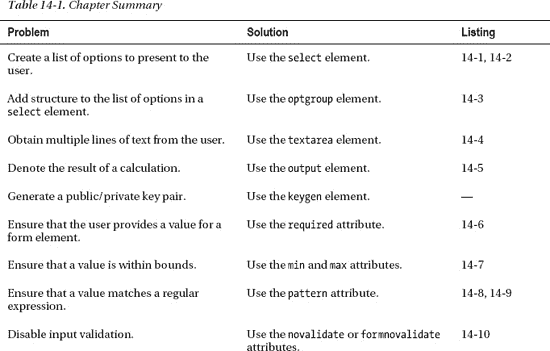
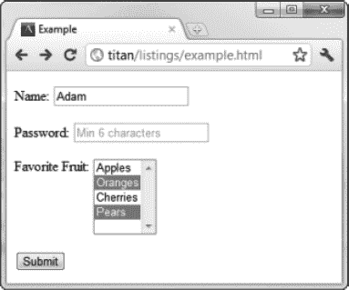
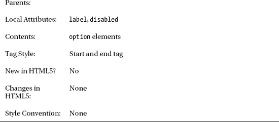
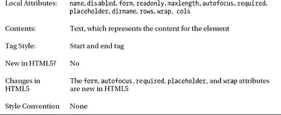
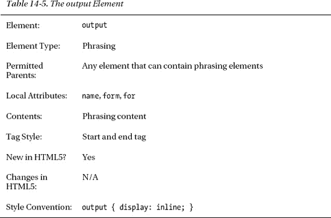
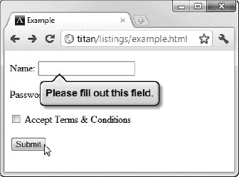
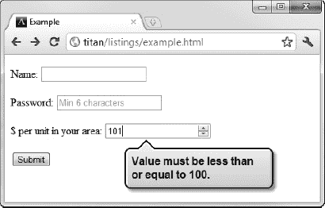
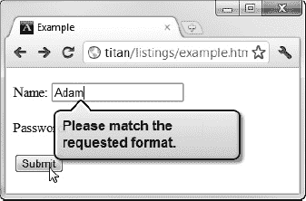

# 十四、其他表单元素和输入验证

在这一章中，我完成了 HTML 表单特性之旅。您还可以在 HTML 表单中使用另外五个元素，我将依次对它们进行描述。我还解释了 HTML5 中引入的新的输入验证特性。这些新特性允许您对用户输入的数据应用约束，并在满足这些约束之前阻止提交表单。表 14-1 对本章进行了总结。

### 使用其他表格元素

在接下来的部分中，我描述了可以在表单中使用的其他五个元素。这些是`select`、`optgroup`、`textarea`、`output`和`keygen`。

#### 创建选项列表

元素让您创建选项列表，用户可以从中进行选择。这是你在[第 13 章](13.html#ch13)中看到的`input`元素的`radiobutton`类型的一个更紧凑的替代，非常适合更大的选项集。[表 14-2](#tab_14_2) 总结了`select`要素。

`name`、`disabled`、`form`、`autofocus`和`required`属性的工作方式与`input`元素相同。`size`属性指定您想要向用户显示多少个选项，当应用`multiple`属性时，用户可以选择多个值。

您使用`option`元素来定义您想要呈现给用户的选项。这与第 12 章中[的`datalist`元素使用的`option`元素相同。清单 14-1](12.html#ch12) 展示了如何使用`select`和`option`元素。

*清单 14-1。使用选择和选项元素*

`<!DOCTYPE HTML>
<html>
    <head>
        <title>Example</title>
        <meta name="author" content="Adam Freeman"/>
        <meta name="description" content="A simple example"/>
        <link rel="shortcut icon" href="favicon.ico" type="image/x-icon" />
    </head>
    <body>        
        <form method="post" action="http://titan:8080/form">
            <input type="hidden" name="recordID" value="1234"/>
            

                <label for="name">
                    Name: <input value="Adam" id="name" name="name"/>
                </label>
            

            

                <label for="password">
                    Password: <input type="password" placeholder="Min 6 characters"
                        id="password" name="password"/>
                </label>
            

            

                <label for="fave">
                    Favorite Fruit:
**                    <select id="fave" name="fave">**
**                        <option value="apples" selected label="Apples">Apples</option>**
**                        <option value="oranges" label="Oranges">Oranges</option>**
**                        <option value="cherries" label="Cherries">Cherries</option>**
**                        <option value="pears" label="Pears">Pears</option>**
**                    </select>**
                </label>
            

            <input type="submit" value="Submit"/>
        </form>
    </body>
</html>`

在[清单 14-1](#list_14_1) 中，我使用了`select`元素并定义了四个`option`元素来表示我想提供给用户的选择。我已经将`selected`属性应用于第一个`option`元素，这样当页面显示时它会被自动选中。在[图 14-1](#fig_14_1) 中可以看到`select`元素的初始外观以及浏览器如何显示`option`元素。

*图 14-1。使用 select 元素为用户预设一个选项列表*

您可以使用`select`元素上的`size`属性向用户显示多个选项，并使用`multiple`属性允许用户选择多个选项，如[清单 14-2](#list_14_2) 所示。

*清单 14-2。在选择元素上使用大小和多个属性*

`<!DOCTYPE HTML>
<html>
    <head>
        <title>Example</title>
        <meta name="author" content="Adam Freeman"/>
        <meta name="description" content="A simple example"/>
        <link rel="shortcut icon" href="favicon.ico" type="image/x-icon" />
    </head>
    <body>        
        <form method="post" action="http://titan:8080/form">
            <input type="hidden" name="recordID" value="1234"/>
            

                <label for="name">
                    Name: <input value="Adam" id="name" name="name"/>
                </label>
            

            

                <label for="password">
                    Password: <input type="password" placeholder="Min 6 characters"
                        id="password" name="password"/>
                </label>
            

            

                <label for="fave" **style="vertical-align:top"**>
                    Favorite Fruit:
                    <select id="fave" name="fave" **size="5" multiple**>
                        <option value="apples" selected label="Apples">Apples</option>
                        <option value="oranges" label="Oranges">Oranges</option>
                        <option value="cherries" label="Cherries">Cherries</option>
                        <option value="pears" label="Pears">Pears</option>
                    </select>
                </label>
            

            <input type="submit" value="Submit"/>
        </form>
    </body>
</html>`

在[清单 14-2](#list_14_2) 中，我应用了`size`和`multiple`属性，这产生了你在[图 14-2](#fig_14_2) 中看到的效果。您可以通过在单击的同时按住 Ctrl 键来选择多个选项。我还应用了一个内联样式(如第 4 章中所述)来改变垂直对齐，这样`label`与`select`元素的顶部对齐(默认情况下，它与底部对齐，这看起来有点奇怪)。

*图 14-2。使用选择元素显示和选择多个项目*

##### 向选择的元素添加结构

您可以通过使用`optgroup`元素向`select`元素添加一些结构。[表 14-3](#tab_14_3) 描述了这个元素。

您使用`optgroup`元素将`option`元素组合在一起。`label`属性允许您为分组的`option`创建标题，而`disabled`属性允许您阻止用户选择包含在`optgroup`中的任何`option`元素。[清单 14-3](#list_14_3) 显示了使用中的`optgroup`元素。

*清单 14-3。使用 optgroup 元素*

`<!DOCTYPE HTML>
<html>
    <head>
        <title>Example</title>
        <meta name="author" content="Adam Freeman"/>
        <meta name="description" content="A simple example"/>
        <link rel="shortcut icon" href="favicon.ico" type="image/x-icon" />
    </head>
    <body>        
        <form method="post" action="http://titan:8080/form">
            <input type="hidden" name="recordID" value="1234"/>
            

                <label for="name">
                    Name: <input value="Adam" id="name" name="name"/>
                </label>
            

            

                <label for="password">
                    Password: <input type="password" placeholder="Min 6 characters"
                        id="password" name="password"/>
                </label>
            

            

                <label for="fave" style="vertical-align:top">
                    Favorite Fruit:
                    <select id="fave" name="fave">
**                        <optgroup label="Top Choices">**
                            <option value="apples" label="Apples">Apples</option>
                            <option value="oranges" label="Oranges">Oranges</option>
**                        </optgroup>**
**                        <optgroup label="Others">**
                            <option value="cherries" label="Cherries">Cherries</option>
                            <option value="pears" label="Pears">Pears</option>
**                        </optgroup>**
                    </select>
                </label>
            

            <input type="submit" value="Submit"/>
        </form>
    </body>
</html>`

在图 14-3 的[中，你可以看到`optgroup`元素是如何将结构添加到`option`元素列表中的。`optgroup`标签纯粹是为了结构；用户不能选择这些值。](#fig_14_3)

*图 14-3。使用 optgroup 元素*

#### 捕获多行文本

元素创建了一个多行文本框，用户可以在其中输入多行文本。[表 14-4](#tab_14_4) 总结了`textarea`要素。

`rows`和`cols`属性指定了`textarea`的尺寸，您可以将`wrap`属性设置为硬或软，以控制如何将换行符添加到用户输入的文本中。其他属性的工作方式与`input`元素上相应属性的工作方式相同，详见[第 12 章](12.html#ch12)和[第 13 章](13.html#ch13)。[清单 14-4](#list_14_4) 显示了使用中的`textarea`元素。

*清单 14-4。使用 textarea 元素*

`<!DOCTYPE HTML>
<html>
    <head>
        <title>Example</title>
        <meta name="author" content="Adam Freeman"/>
        <meta name="description" content="A simple example"/>
        <link rel="shortcut icon" href="favicon.ico" type="image/x-icon" />
    </head>
    <body>        
        <form method="post" action="http://titan:8080/form">
            <input type="hidden" name="recordID" value="1234"/>
            

                <label for="name">
                    Name: <input value="Adam" id="name" name="name"/>
                </label>
            

            

                <label for="password">
                    Password: <input type="password" placeholder="Min 6 characters"
                        id="password" name="password"/>
                </label>
            

            

                <label for="fave" style="vertical-align:top">
                    Favorite Fruit:
                    <select id="fave" name="fave">
                        <optgroup label="Top Choices">
                            <option value="apples" label="Apples">Apples</option>
                            <option value="oranges" label="Oranges">Oranges</option>
                        </optgroup>
                        <optgroup label="Others">                        
                            <option value="cherries" label="Cherries">Cherries</option>
                            <option value="pears" label="Pears">Pears</option>
                        </optgroup>
                    </select>
                </label>
            

            

                **<textarea cols="20" rows="5" wrap="hard" id="story"**
**                    name="story">Tell us why this is your favorite fruit</textarea>**
            

            <input type="submit" value="Submit"/>
        </form>
    </body>
</html>`

在清单 14-4 的[中，我添加了一个宽 20 列、高 5 行的`textarea`。你可以在](#list_14_4)[图 14-4](#fig_14_4) 中看到浏览器是如何显示的。

*图 14-4。使用 textarea 元素*

属性控制提交表单时如何在文本中插入换行符。如果将`wrap`属性设置为 hard，内容将插入换行符，这样提交的文本中没有一行的字符数超过`cols`属性的值。

#### 表示计算的结果

`output`元素表示计算的结果。表 14-5 总结了这一要素。

清单 14-5 展示了使用中的`output`元素。

*清单 14-5。使用输出元件*

`<!DOCTYPE HTML>
<html>
    <head>
        <title>Example</title>
        <meta name="author" content="Adam Freeman"/>
        <meta name="description" content="A simple example"/>
        <link rel="shortcut icon" href="favicon.ico" type="image/x-icon" />
    </head>
    <body>           
        <form onsubmit="return false"
            oninput="res.value = quant.valueAsNumber * price.valueAsNumber">
            <fieldset>
                <legend>Price Calculator</legend>
                <input type="number" placeholder="Quantity" id="quant" name="quant"/> x
                <input type="number" placeholder="Price" id="price" name="price"/> =
**                <output for="quant name" name="res"/>**
            </fieldset>
        </form>
    </body>
</html>`

在[清单 14-5](#list_14_5) 中，我使用 JavaScript 事件系统创建了一个简单的计算器(你可以在第 30 章中了解更多关于事件的信息)。有两个`number`类型的`input`元素，当用户输入时，`input`元素的值相乘，结果显示在`output`元素中。你可以在[图 14-5](#fig_14_5) 中看到这是如何出现在浏览器中的。

*图 14-5。使用输出元件*

#### 创建公钥/私钥对

您使用`keygen`元素来生成一对公共/私有密钥。这是公钥加密的一个重要功能，它支撑着 web 安全，包括客户端证书和 SSL。提交表单时，会创建一对新的密钥。公钥被发送到服务器，私钥由浏览器保留并添加到用户的密钥库中。[表 14-6](#tab_14_6) 总结了`keygen`要素。

`name`、`disabled`、`form`和`autofocus`属性的作用就像它们对`input`元素的作用一样，如[第 12 章](12.html#ch12)所述。属性`keytype`指定了将用于生成密钥对的算法，但是唯一支持的值是`RSA`。`challenge`属性指定了一个质询短语，它与公钥一起被发送到服务器。

浏览器对该元素的支持是不完整的，那些支持该元素的浏览器以不同的方式向用户呈现它。我的建议是在支持得到改善之前避免使用这个元素。

### 使用输入验证

当您请求用户输入时，您会冒接收到您无法使用的数据的风险。这可能是因为用户犯了一个错误，或者你没有清楚地传达你想要的那种回应。

HTML5 引入了对*输入验证*的支持，在这里您可以向浏览器提供一些关于您需要的数据类型的基本信息。在提交表单之前，浏览器使用这些信息来检查用户是否输入了可用的数据。如果数据有问题，系统会提示用户更正问题，在问题解决之前，用户不能提交表单。

在浏览器中执行验证并不是一个新想法，但是在 HTML5 之前，你必须使用 JavaScript 库，比如优秀的 jQuery 验证插件。HTML5 具有内置的验证支持当然很方便，但是正如您将看到的，这种支持是初级的，并且在不同浏览器之间不一致。

在浏览器中进行输入验证的好处是用户可以立即得到关于问题的反馈。如果没有这个特性，用户必须提交表单，等待服务器响应，然后处理报告的任何问题。在低性能网络和过度使用的服务器上，这可能是一个缓慢而令人沮丧的过程。

 **注意**浏览器中的输入验证是对服务器验证的补充，而不是替代。您不能指望用户使用正确支持输入验证的浏览器，恶意用户编写一个脚本将输入直接发送到您的服务器，而不进行任何形式的验证，这是一件小事。

您通过属性来管理输入验证。表 14-7 显示了哪些元素(和输入类型)支持不同的验证属性。

#### 确保用户提供一个值

最简单的输入验证是确保用户提供一个值。您可以使用`required`属性来实现这一点。在提供值之前，用户不能提交表单，尽管对值没有限制。[清单 14-6](#list_14_6) 显示了正在使用的`required`属性。

*清单 14-6。使用所需的属性*

`<!DOCTYPE HTML>
<html>
    <head>
        <title>Example</title>
        <meta name="author" content="Adam Freeman"/>
        <meta name="description" content="A simple example"/>
        <link rel="shortcut icon" href="favicon.ico" type="image/x-icon" />
    </head>
    <body>        
        <form method="post" action="http://titan:8080/form">
            <input type="hidden" name="recordID" value="1234"/>
            

                <label for="name">
                    Name:
                    <input type="text" **required** id="name" name="name"/>
                </label>
            

            

                <label for="password">
                    Password: <input type="password" **required**
                        placeholder="Min 6 characters" id="password" name="password"/>
                </label>
            
            
            

                <label for="accept">
                    <input type="checkbox" **required** id="accept" name="accept"/>
                   Accept Terms & Conditions
                </label>
            
            
            <input type="submit" value="Submit"/>
        </form>
    </body>
</html>`

在清单 14-6 的[中，我将`required`属性应用于三种类型的`input`元素。用户只有在提供了所有三个值之后才能提交表单。对于`text`和`password`类型，这意味着用户必须在文本框中输入文本，并且必须勾选`checkbox`类型的文本框。](#list_14_6)

 **提示**用`value`属性设置的初始值将满足`required`验证属性。如果你想强迫用户输入一个值，考虑使用`placeholder`属性。关于`value`和`placeholder`属性的详细信息，参见[第 12 章](12.html#ch12)。

每个支持输入验证的浏览器的方式略有不同，但效果是一样的:当用户单击按钮提交表单时，第一个具有`required`属性但没有值的元素会被标记出来以引起用户的注意。然后，用户可以更正遗漏并再次提交表单。如果有其他遗漏，则标记下一个问题元素。这个过程一直持续到用户为所有具有`required`属性的元素提供了一个值。你可以在[图 14-6](#fig_14_6) 中看到谷歌 Chrome 如何吸引用户对某个问题的注意力。

*图 14-6。谷歌浏览器将用户的注意力吸引到一个必填字段*

HTML5 输入验证支持是相当基本的，尤其是如果您习惯于通过 jQuery 等库获得更丰富的功能。例如，每个问题依次突出显示给用户，这意味着如果一个表单中有多个问题，用户被迫通过重复提交表单并一次解决一个问题来进行逐步发现的旅程。没有所有验证错误的摘要，并且您无法控制验证错误警告的外观。

#### 确保值在界限内

使用`min`和`max`属性来确保数值和日期值在特定的范围内。[清单 14-7](#list_14_7) 显示了这些应用于`input`元素的`number`类型的属性。

*清单 14-7。使用最小和最大属性*

`<!DOCTYPE HTML>
<html>
    <head>
        <title>Example</title>
        <meta name="author" content="Adam Freeman"/>
        <meta name="description" content="A simple example"/>
        <link rel="shortcut icon" href="favicon.ico" type="image/x-icon" />
    </head>
    <body>        
        <form method="post" action="http://titan:8080/form">
            <input type="hidden" name="recordID" value="1234"/>
            

                <label for="name">
                    Name:
                    <input type="text" id="name" name="name"/>
                </label>
            

            

                <label for="password">
                    Password: <input type="password"
                        placeholder="Min 6 characters" id="password" name="password"/>
                </label>
            
            
            

                <label for="price">
                    $ per unit in your area:
**                    <input type="number" min="0" max="100"**
**                           value="1" id="price" name="price"/>**
                </label>
            
            
            <input type="submit" value="Submit"/>
        </form>
    </body>
</html>`

您不需要同时应用这两个属性。如果您只应用了`max`属性，那么您将为该值创建一个上限，如果您只应用了`min`属性，那么您将创建一个下限。应用这两个值时，可以约束上限值和下限值来创建一个范围。`min`和`max`值包含在内，这意味着如果您指定`max`值为`100`，那么直到*并包括* `100`的任何值都是允许的。

你可以在[图 14-7](#fig_14_7) 中看到浏览器如何报告一个范围验证错误。

*图 14-7。一个范围验证错误*

 **提示**`min`和`max`属性只有在用户提供值时才会生效。如果文本框为空，浏览器将允许用户提交表单。由于这个原因，`mix`和`max`属性经常与`required`属性一起使用，如前一节所述。

#### 确保一个值匹配一个模式

属性确保一个值匹配一个正则表达式。[清单 14-8](#list_14_8) 显示了正在使用的`pattern`属性。

*清单 14-8。使用模式属性*

`<!DOCTYPE HTML>
<html>
    <head>
        <title>Example</title>
        <meta name="author" content="Adam Freeman"/>
        <meta name="description" content="A simple example"/>
        <link rel="shortcut icon" href="favicon.ico" type="image/x-icon" />
    </head>
    <body>        
        <form method="post" action="http://titan:8080/form">
            <input type="hidden" name="recordID" value="1234"/>
            

                <label for="name">
                    Name:
                    <input type="text" id="name" name="name" **pattern="^.* .*$"**/>
                </label>
            

            

                <label for="password">
                    Password: <input type="password"
                        placeholder="Min 6 characters" id="password" name="password"/>
                </label>
            
                      
            <input type="submit" value="Submit"/>
        </form>
    </body>
</html>`

在清单 14-8 中，我应用了一个简单的模式来确保用户输入两个名字，用空格分开。这不是验证值是名称的明智方法，因为它忽略了名称的所有区域差异，但它确实提供了一个合适的验证支持示例。您可以在[图 14-8](#fig_14_8) 中看到浏览器如何显示模式验证错误。

*图 14-8。模式验证错误*

 **提示**`pattern`属性只在用户提供一个值时产生验证。如果文本框为空，浏览器将允许用户提交表单。因此，该属性通常与本章前面描述的`required`属性一起使用。

#### 确保值是电子邮件地址或 URL

我在第 13 章的[中描述的`input`元素的`email`和`url`类型分别确保用户输入了有效的电子邮件地址或完全合格的 URL(嗯，差不多——浏览器对`email`类型的支持相当不错，但`url`类型有些粗略)。](13.html#ch13)

我们可以将`pattern`属性与这些类型的`input`元素结合起来，进一步限制用户可以输入的值；例如，将电子邮件地址限制在特定的域中。[清单 14-9](#list_14_9) 提供了一个演示。

*清单 14-9。使用带有电子邮件输入元素类型*的模式属性

`<!DOCTYPE HTML>
<html>
    <head>
        <title>Example</title>
        <meta name="author" content="Adam Freeman"/>
        <meta name="description" content="A simple example"/>
        <link rel="shortcut icon" href="favicon.ico" type="image/x-icon" />
    </head>
    <body>        
        <form method="post" action="http://titan:8080/form">
            <input type="hidden" name="recordID" value="1234"/>
            

                <label for="name">
                    Name:
                    <input type="text" id="name" name="name" pattern="^.* .*$"/>
                </label>
            

            

                <label for="password">
                    Password: <input type="password"
                        placeholder="Min 6 characters" id="password" name="password"/>
                </label>
            

            

                <label for="email">
                    Email: **<input type="email" placeholder="user@mydomain.com" required**
**                        pattern=".*@mydomain.com$" id="email" name="email"/>**
                </label>
            
                        
            <input type="submit" value="Submit"/>
        </form>
    </body>
</html>`

在清单 14-9 中，我使用了三个验证特性。元素的类型确保用户输入有效的电子邮件地址。`required`属性确保用户提供一个值。`pattern`属性确保用户输入属于特定域的电子邮件地址(`mydomain.com`)。使用`email` `input`类型和`pattern`属性似乎是多余的，但是`input`元素仍然负责确保`@`字符之前的所有内容作为电子邮件地址是有效的。

### 禁用输入验证

有时，您希望允许用户在不验证内容的情况下提交表单。一个很好的例子是当用户需要通过一个不完整的过程保存进度时。您希望用户能够保存他们输入的任何内容，以便他们可以在以后继续该过程。如果在保存进度之前必须纠正所有错误，这将是一个令人沮丧的过程。

您可以不经过验证就提交表单，方法是将`novalidate`属性应用于`form`元素，或者将`formnovalidate`属性应用于可以提交表单的`button`和`input`元素的类型。清单 14-10 显示了如何禁用表单验证。

*清单 14-10。禁用输入验证*

`<!DOCTYPE HTML>
<html>
    <head>
        <title>Example</title>
        <meta name="author" content="Adam Freeman"/>
        <meta name="description" content="A simple example"/>
        <link rel="shortcut icon" href="favicon.ico" type="image/x-icon" />
    </head>
    <body>        
        <form method="post" action="http://titan:8080/form">
            <input type="hidden" name="recordID" value="1234"/>
            

                <label for="name">
                    Name:
                    <input type="text" id="name" name="name" pattern="^.* .*$"/>
                </label>
            

            

                <label for="password">
                    Password: <input type="password"
                        placeholder="Min 6 characters" id="password" name="password"/>
                </label>
            

            

                <label for="email">
                    Email: <input type="email" placeholder="user@mydomain.com" required
                        pattern=".*@mydomain.com$" id="email" name="email"/>
                </label>
            
                        
            <input type="submit" value="Submit"/>
**            <input type="submit" value="Save" formnovalidate/>**
        </form>
    </body>
</html>`

在这个例子中，我在 HTML 文档中添加了一个 input 元素，它将提交表单而不进行验证，允许用户保存进度(当然，假设在服务器上实现了一个相应的特性，它将接受来自浏览器的值而不进行进一步的验证)。

### 总结

在这一章中，我向您展示了可以在表单中使用的其他元素，并且演示了 HTML5 中引入的新的输入验证特性。