# 三十五、使用画布元素——第一部分

在前一章中，我提到了(并简单地讲述了)大多数 web 应用开发人员和设计人员对 Adobe Flash 的爱恨情仇。这种憎恨来自于缺乏稳定性和安全性，因为 Adobe 最近被指责软件质量差。对 Flash 的喜爱来自于它无处不在的安装方式，以及它可以用来制作丰富内容的方式。

作为 Flash 的原生替代，HTML5 定义了`canvas`元素。如果你读过任何关于 HTML5 中新功能的描述，那么`canvas`很可能是最先提到的特性之一，并且可能被描述为 Flash 杀手。

通常情况下，炒作和现实并不匹配。canvas 元素是我们使用 JavaScript 配置和驱动的绘图表面。它很灵活，相对容易使用，并且它提供了足够的功能，可以取代 Flash 来获得一些丰富的内容。但是称`canvas`元素为闪存杀手(甚至是闪存替代品)还为时过早，因为在`canvas`取而代之之前还有一段时间。

这是关于 canvas 元素的两章中的第一章。在这一章中，我将向您展示如何设置 canvas 元素，并介绍我们在 JavaScript 中用来与 canvas 交互的对象。我还向您展示了对基本形状的支持，如何使用纯色和渐变，以及如何在画布上绘制图像。下一章将向你展示如何绘制更复杂的形状，以及如何应用效果和变换。表 35-1 对本章进行了总结。

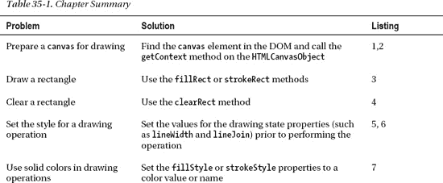

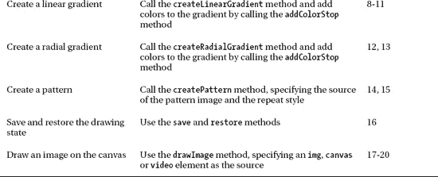

### 画布元素入门

`canvas`元素非常简单，因为它的所有功能都通过一个 JavaScript 对象公开，所以元素本身只有两个属性，如[表 35-2](#tab_35_2) 所示。

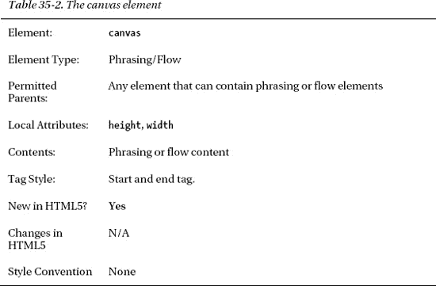

如果浏览器不支持元素本身，`canvas`元素的内容被用作后备。清单 35-1 显示了`canvas`元素和一些简单的回退内容。

*清单 35-1。使用具有基本回退内容的画布元素*

`<!DOCTYPE HTML>
<html>
    <head>
        <title>Example</title>
        
    </head>
    <body>
        **<canvas width="500" height="200">**
            **Your browser doesn't support the <code>canvas</code> element**
        **</canvas>**
    </body>
</html>`

正如您可能想象的那样，`width`和`height`属性指定了屏幕上元素的大小。你可以在[图 35-1](#fig_35_1) 中看到浏览器是如何显示这个例子的(当然，尽管在这一点上没什么可看的)。

 **提示**我在这个例子中对 canvas 元素应用了一个样式来设置边框。否则将无法在浏览器窗口中看到`canvas`。我将在这一章的所有例子中显示一个边界，所以我描述的操作与画布坐标的关系总是很清楚的。

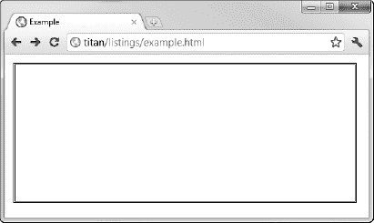

*图 35-1。将画布元素添加到 HTML 文档*

### 获取画布上下文

为了在一个`canvas`元素上绘图，我们需要得到一个上下文对象，这是一个为特定风格的图形公开绘图功能的对象。在我们的例子中，我们将使用用于执行二维操作的`2d`上下文。一些浏览器提供了对实验性 3D 环境的支持，但这仍处于早期阶段。

我们通过表示 DOM 中的`canvas`元素的对象获得一个上下文。这个物体`HTMLCanvasElement`在[表 35-3](#tab_35_3) 中有描述。

关键方法是`getContext`——为了获得二维上下文对象，我们请求将`2d`参数传递给该方法。一旦我们有了背景，我们就可以开始画了。[清单 35-2](#list_35_2) 提供了一个演示。

*清单 35-2。获取画布的二维上下文对象*

`<!DOCTYPE HTML>
<html>
    <head>
        <title>Example</title>
        
    </head>
    <body>
        <canvas id="canvas" width="500" height="100">
            Your browser doesn't support the <code>canvas</code> element
        </canvas>
        
    </body>
</html>`

我已经强调了清单中的关键陈述。我使用`document`对象在 DOM 中查找代表`canvas`元素的对象，并使用参数`2d`调用`getContext`方法。你会在这一章的所有例子中看到这种说法，或者一种近似的说法。

一旦我有了上下文对象，我就可以开始画了。在这个例子中，我调用了`fillRect`方法，它在画布上绘制了一个填充的矩形。你可以在[图 35-2](#fig_35_2) 中看到(简单的)效果。

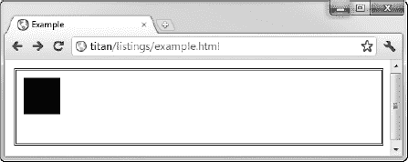

*图 35-2。获取一个上下文对象并执行简单的绘图操作*

### 绘制矩形

让我们从对矩形的`canvas`支持开始。表 35-4 描述了相关的方法，所有这些方法都应用于上下文对象(而不是画布本身)。

提示我们可以画出更复杂的形状，但我不会告诉你怎么做，直到[第 36 章](36.html#ch36)。我们可以使用矩形来探索画布的一些特性，而不会陷入其他形状如何工作的困境。

这三种方法都有四个参数。前两个(`x`和`y`如表中所示)是 canvas 元素左上角的偏移量。`w`和`h`参数指定要绘制的矩形的宽度和高度。清单 35-3 展示了`fillRect`和`strokeRect`方法的使用。

*清单 35-3。使用 fillRect 和 strokeRect 方法*

`<!DOCTYPE HTML>
<html>
    <head>
        <title>Example</title>
        
    </head>
    <body>
        <canvas id="canvas" width="500" height="140">
            Your browser doesn't support the <code>canvas</code> element
        </canvas>
        
    </body>
</html>`

本例中的脚本使用`fillRect`和`strokeRect`方法创建一系列填充和未填充的矩形。你可以在[图 35-3](#fig_35_3) 中看到结果。

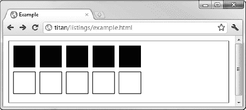

*图 35-3。绘制填充和未填充的矩形*

我这样写脚本是为了强调`canvas`元素的编程性质。我使用了一个 JavaScript `for`循环来绘制这些矩形。我可以使用 10 个单独的语句，每个语句都有特定的坐标参数，但是`canvas`的一个好处是我们不需要这样做。如果你没有编程背景，你可能很难理解这方面的内容。

方法删除指定矩形中的任何内容。清单 35-4 提供了一个演示。

*清单 35-4。使用 clearRect 方法*

`<!DOCTYPE HTML>
<html>
    <head>
        <title>Example</title>
        
    </head>
    <body>
        <canvas id="canvas" width="500" height="140">
            Your browser doesn't support the <code>canvas</code> element
        </canvas>
        
    </body>
</html>`

在这个例子中，我使用了`clearRect`方法来清除画布上已经被`fillRect`方法绘制过的区域。你可以在[图 35-4](#fig_35_4) 中看到效果。

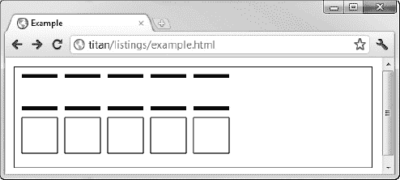

*图 35-4。使用 clearRect 方法*

### 设置画布的绘制状态

绘图操作由*绘图状态*配置。这是一组指定从线宽到填充颜色的所有内容的属性。当我们绘制一个形状时，将使用绘制状态下的当前设置。[清单 35-5](#list_35_5) 提供了一个使用`lineWIdth`属性的演示，该属性是绘图状态的一部分，设置用于形状的线条宽度，例如由`strokeRect`方法产生的形状。

*清单 35-5。执行操作前设置绘图状态*

`<!DOCTYPE HTML>
<html>
    <head>
        <title>Example</title>
        
    </head>
    <body>
        <canvas id="canvas" width="500" height="70">
            Your browser doesn't support the <code>canvas</code> element
        </canvas>
        
    </body>
</html>`

当我使用`strokeRect`方法时，`lineWidth`属性的当前值用于绘制矩形。在这个例子中，我将属性值设置为 2、4，最后是 6 个像素，这样可以使矩形的线条变得更粗。请注意，我没有更改对`strokeRect`的最后两次调用之间的值。我这样做是为了证明绘制状态属性的值在绘制操作之间不会改变，如图 35-5 中的[所示。](#fig_35_5)

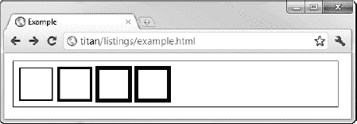

*图 35-5。在绘图操作之间改变绘图状态值*

[表 35-5](#tab_35_5) 显示了基本的绘图状态属性。在我们研究更高级的特性时，还会遇到其他一些属性。

#### 设置线条连接样式

属性决定了如何绘制相互连接的线条。有三个值:`round`、`bevel`和`miter`。默认值为`miter`。清单 35-6 显示了使用中的三种风格。

*清单 35-6。设置 lineJoin 属性*

`<!DOCTYPE HTML>
<html>
    <head>
        <title>Example</title>
        
    </head>
    <body>
        <canvas id="canvas" width="500" height="140">
            Your browser doesn't support the <code>canvas</code> element
        </canvas>
        
    </body>
</html>`

在这个例子中，我使用了`lineWidth`属性，这样`strokeRect`方法就可以用非常粗的线条绘制矩形，然后依次使用每个`lineJoin`样式值。你可以在[图 35-6](#fig_35_6) 中看到结果。

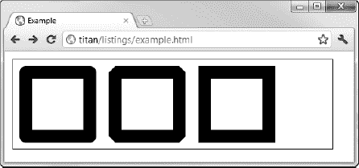

*图 35-6。lineJoin 属性*

#### 设置填充&笔画样式

当我们使用`fillStyle`或`strokeStyle`属性设置样式时，我们可以使用我在[第 35 章](#ch35) - [第 4 章](04.html#ch4)中描述的 CSS 颜色值，使用名称或颜色模型来指定颜色。清单 35-7 提供了一个例子。

*清单 35-7。使用 fillStyle 和 strokeStyle 属性设置颜色*

`<!DOCTYPE HTML>
<html>
    <head>
        <title>Example</title>
        ` `    </head>
    <body>
        <canvas id="canvas" width="500" height="140">
            Your browser doesn't support the <code>canvas</code> element
        </canvas>
        
    </body>
</html>`

在这个例子中，我使用 CSS 颜色名称和`rgb`模型定义了两个颜色数组。然后我将这些颜色分配给调用`fillRect`和`strokeRect`方法的`for`循环中的`fillStyle`和`strokeStyle`属性。在[图 35-7](#fig_35_7) 中可以看到效果。

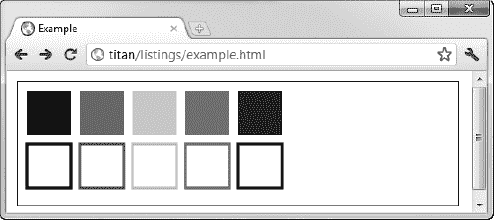

*图 35-7。使用 CSS 颜色设置填充和笔画样式*

如果是这样，你可以从`apress.com`免费获得这本书的所有代码示例。

#### 使用渐变

我们也可以使用渐变而不是纯色来设置填充和笔画样式。渐变是两种或多种颜色之间的渐变。`canvas`元素支持两种渐变:线性和径向，使用[表 35-6](#tab_35_6) 中描述的方法。

这两种方法都返回一个`CanvasGradient`对象，该对象定义了[表 35-7](#tab_35_7) 中所示的方法。这些参数描述渐变所使用的直线或圆，这将在下面的示例中进行解释。

##### 使用线性渐变

*线性渐变*是我们沿着一条线指定我们想要的颜色。[清单 35-8](#list_35_8) 展示了我们如何创建一个简单的线性渐变。

*清单 35-8。创建线性渐变*

`<!DOCTYPE HTML>
<html>
    <head>
        <title>Example</title>
        
    </head>
    <body>` `        <canvas id="canvas" width="500" height="140">
            Your browser doesn't support the <code>canvas</code> element
        </canvas>
        
    </body>
</html>`

当我们使用`createLinearGradient`方法时，我们提供四个值作为画布上一行的开始和结束坐标。在这个例子中，我用坐标描述了一条从点`0`、`0`开始到`500`、`140`结束的直线。这些点对应于画布的左上角和右下角，如图[图 35-8](#fig_35_8) 所示。

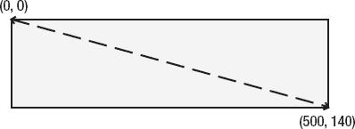

*图 35-8。线性渐变线*

这条线代表渐变。我们现在可以在由`createLinearGradient`方法返回的`CanvasGradient`上使用`addColorStop`方法，沿着渐变线添加颜色，就像这样:

`grad.addColorStop(0, "red");
grad.addColorStop(0.5, "white");
grad.addColorStop(1, "black");`

`addColorStop`方法的第一个参数是我们想要应用颜色的行的位置，我们使用第二个参数来指定。线的起点(本例中的坐标`0, 0`由值`0`表示，线的终点由值`1`表示。在这个例子中，我已经告诉`canvas`我想要线条开始的颜色`red`，线条中间的颜色`white`，线条结尾的颜色`black`。然后画布会计算出如何在这些点的颜色之间逐渐过渡。我们可以指定尽可能多的色标(但是如果我们忘乎所以，我们最终会得到看起来像彩虹的东西)。

一旦我们定义了渐变并添加了色标，我们就可以分配`CanvasGradient`对象来设置`fillStyle`或`strokeStyle`属性，如下所示:

`ctx.fillStyle = grad;`

最后，我们可以画一个形状。在本例中，我画了一个实心矩形，如下所示:

`ctx.fillRect(0, 0, 500, 140);`

这个矩形填充了画布，显示了整个渐变，正如你在[图 35-9](#fig_35_9) 中看到的。

*图 35-9。在填充的矩形中使用线性渐变*

您可以看到颜色沿着渐变线变化。左上角有纯红，线中间有纯白，右下角有纯黑，颜色在这两点之间逐渐偏移。

##### 使用较小形状的线性渐变

当我们定义渐变线时，我们是相对于画布来做的，而不是我们所画的形状。这一开始会引起一些混乱。清单 35-9 包含了我的意思的演示。

*清单 35-9。使用不填充画布形状的渐变*

`<!DOCTYPE HTML>
<html>
    <head>
        <title>Example</title>
        
    </head>
    <body>
        <canvas id="canvas" width="500" height="140">
            Your browser doesn't support the <code>canvas</code> element
        </canvas>
        
    </body>
</html>`

本例中的变化只是使矩形变小。你可以在[图 35-10](#fig_35_10) 中看到结果。

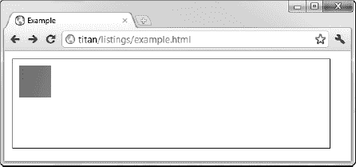

*图 35-10。渐变中缺少渐变*

这就是我所说的与画布相关的渐变线。我在一个纯红的区域画了一个矩形。(事实上，如果我们能够放大得足够近，我们可能能够检测到向白色的微小渐变，但总体外观是纯色的。)思考这个问题的最佳方式是，当我们绘制一个形状时，我们允许部分底层渐变显示出来，这意味着我们必须考虑渐变线如何与我们要曝光的区域相关联。清单 35-10 展示了我们如何将渐变线作为一个形状的目标。

*清单 35-10。使渐变线匹配期望的形状*

`<!DOCTYPE HTML>
<html>
    <head>
        <title>Example</title>
        
    </head>
    <body>
        <canvas id="canvas" width="500" height="140">
            Your browser doesn't support the <code>canvas</code> element
        </canvas>
        
    </body>
</html>`

在这个例子中，我设置了渐变线，使它开始和停止在我想用我的小矩形显示的区域内。然而，我绘制了矩形来显示渐变的所有的*，这样你就可以看到变化的效果，如图[图 11](#fig_35_11) 所示。*

*图 35-11。移动和缩短渐变线的效果*

你可以看到渐变是如何转移到我要用小矩形曝光的区域的。最后一步是匹配矩形和渐变，如清单 35-11 所示。

*清单 35-11。将形状与渐变匹配*

`<!DOCTYPE HTML>
<html>
    <head>
        <title>Example</title>
        
    </head>
    <body>
        <canvas id="canvas" width="500" height="140">
            Your browser doesn't support the <code>canvas</code> element
        </canvas>
        
    </body>
</html>`

 **提示**注意，我在`createLinearGradient`方法中用作参数的数值不同于我在`fillRect`方法中使用的参数。`createLinearGradient`值表示画布中的一对坐标，而`fillRect`值表示相对于单个坐标的矩形的宽度和高度。如果发现渐变和形状不对齐，这很可能是问题的原因。

现在形状和渐变完美对齐，如图[图 35-12](#fig_35_12) 所示。当然，我们并不总是希望它们完全对齐。为了获得不同的效果，我们可能想要曝光一个特定的更大梯度的区域。无论目标是什么，理解渐变和我们使用的形状之间的关系是很重要的。

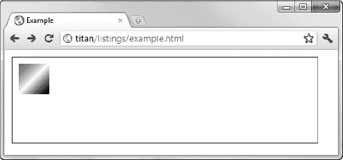

*图 35-12。对齐形状和渐变*

#### 使用径向渐变

我们用两个圆来定义径向梯度。渐变的开始由第一个圆定义，渐变的结束由第二个圆定义，我们在它们之间添加颜色停止。清单 35-12 提供了一个例子。

*清单 35-12。使用径向渐变*

`<!DOCTYPE HTML>
<html>
    <head>
        <title>Example</title>
        
    </head>
    <body>
        <canvas id="canvas" width="500" height="140">
            Your browser doesn't support the <code>canvas</code> element
        </canvas>
        
    </body>
</html>`

`createRadialGradient`方法的六个参数代表:

*   起点圆中心的坐标(第一个和第二个参数)
*   起始圆的半径(第三个参数)
*   终点圆中心的坐标(第四个和第五个参数)
*   终点圆的半径(第六个参数)

示例中的值给出了开始和结束圆，如图 35-13 中的[所示。注意，我们可以指定画布之外的渐变(对于线性渐变也是如此)。](#fig_35_13)

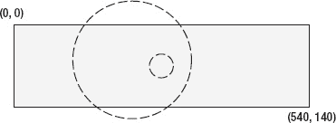

*图 35-13。起点和终点呈放射状渐变*

在这个例子中，开始圆是较小的一个，被结束圆包围。当我们在这个渐变上添加色标时，它们被放置在开始圆的边缘(色标值`0.0`)和结束圆的边缘(色标值`1.0`)之间的线上。

 **提示**指定圆时要小心，不要让一个圆包含另一个圆。浏览器之间在如何导出渐变方面存在一些不一致，结果也很混乱。

因为我们能够指定两个圆的位置，所以圆边缘之间的距离可以变化，颜色之间的渐变率也将变化。你可以在[图 35-14](#fig_35_14) 中看到效果。

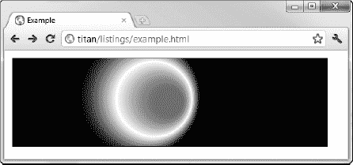

*图 35-14。使用径向梯度*

图中显示了整个渐变，但同样的规则也适用于渐变与绘图形状的关系。[清单 35-13](#list_35_13) 创建了一对显示渐变分段的小图形。

*清单 35-13。使用带有径向渐变的较小形状*

`<!DOCTYPE HTML>
<html>
    <head>
        <title>Example</title>
        
    </head>
    <body>
        <canvas id="canvas" width="500" height="140">
            Your browser doesn't support the <code>canvas</code> element
        </canvas>
        
    </body>
</html>`

注意，我可以对`fillStyle`和`strokeStyle`属性使用渐变，使我们能够对线条和实心形状使用渐变，如图[图 35-15](#fig_35_15) 所示。

*图 35-15。为填充和描边使用径向渐变*

#### 使用模式

除了纯色和渐变，我们还可以创建*图案*。我们使用由 canvas 上下文对象定义的`createPattern`方法来实现这一点。2D 绘图上下文定义了对三种模式的支持——图像、视频和画布——但是只有图像模式被实现(而且只有 Firefox 和 Opera 实现)。在我写这篇文章时，其他浏览器忽略了这种模式类型。).

为了使用图像模式，我们将一个`HTMLImageElement`对象作为第一个参数传递给`createPattern`方法。第二个参数是重复样式，它必须是[表 35-8](#tab_35_8) 中显示的值之一。

T2】

清单 35-14 显示了我们如何创建和使用一个图像模式。

*清单 35-14。使用图像模式*

`<!DOCTYPE HTML>
<html>
    <head>
        <title>Example</title>
        
    </head>
    <body>
        <canvas id="canvas" width="500" height="140">
            Your browser doesn't support the <code>canvas</code> element
        </canvas>
        
        
    </body>
</html>`

本例中的文档包含一个`img`元素，用户看不到它，因为我已经应用了`hidden`属性(在[第 4 章](04.html#ch4)中描述)。在脚本中，我使用 DOM 来定位表示作为`createPattern`方法第一个参数的`img`元素的`HTMLImageElement`对象。对于第二个参数，我使用了`repeat`值，这导致图像在两个方向上重复。最后，我将模式设置为`fillStyle`属性的值，并使用`fillRect`方法绘制一个与画布大小相同的填充矩形。你可以在图 35-16 中看到结果。

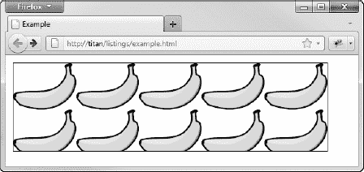

*图 35-16。创建图像模式*

模式是从`img`元素的当前状态复制的，这意味着如果我们使用 JavaScript 和 DOM 来改变`img`元素的`src`属性值，模式不会改变。

与渐变一样，图案应用于整个画布，我们决定图案的哪些部分由我们绘制的形状显示。[清单 35-15](#list_35_15) 展示了如何将该模式用于较小的填充和笔画形状。

*清单 35-15。使用带有图像图案的较小形状*

`<!DOCTYPE HTML>
<html>
    <head>
        <title>Example</title>
        
    </head>
    <body>
        <canvas id="canvas" width="500" height="140">
            Your browser doesn't support the <code>canvas</code> element
        </canvas>
        
        ` `    </body>
</html>`

你可以在[图 35-17](#fig_35_17) 中看到结果。

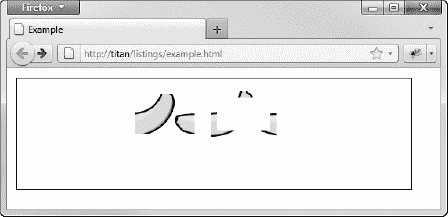

*图 35-17。使用带有图像图案的较小形状*

### 保存和恢复绘图状态

我们可以保存绘图状态，并在以后使用[表 35-9](#tab_35_9) 中描述的方法返回。

保存的绘图状态存储在后进先出(LIFO)堆栈中，因此我们使用`save`方法保存的最后一个状态是由`restore`方法恢复的第一个状态。[清单 35-16](#list_35_16) 展示了这些正在使用的方法。

*清单 35-16。保存和恢复状态*

`<!DOCTYPE HTML>
<html>
    <head>
        <title>Example</title>
        
    </head>
    <body>` `        <canvas id="canvas" width="500" height="140" preload="auto">
            Your browser doesn't support the <code>canvas</code> element
        </canvas>
        

            <button>Save</button>
            <button>Restore</button>
        

        
    </body>
</html>`

在这个例子中，我定义了一个包含 CSS 颜色名称和线性渐变的数组。当按下`Save`按钮时，使用`save`方法保存当前绘图状态。按下`Restore`按钮，恢复之前的绘图状态。在任一按钮按下后，调用`draw`函数，该函数使用`fillRect`方法绘制填充矩形。因为`fillStyle`属性是绘图状态的一部分，所以当按钮被按下时，该属性在数组中被提前和延迟，并被保存和恢复。在[图 35-18](#fig_35_18) 中可以看到效果。

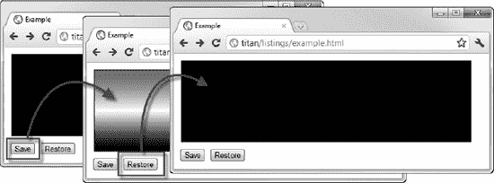

*图 35-18。保存和恢复绘图状态*

画布的内容不会被保存或恢复；仅保存或恢复绘图状态的特性值。这包括我们在本章已经看到的属性，比如`lineWidth`、`fillStyle`和`strokeStyle`，以及一些我在[第 36 章](36.html#ch36)中描述的附加属性。

### 绘制图像

我们可以使用`drawImage`方法在画布上绘制图像。这个方法需要三个、五个或九个参数。第一个参数总是图像的来源，它可以是表示一个`img`、`video,`或另一个`canvas`元素的 DOM 对象。清单 35-17 给出了一个例子，使用一个`img`元素作为源。

*清单 35-17。使用 drawImage 方法*

`<!DOCTYPE HTML>
<html>
    <head>
        <title>Example</title>
        
    </head>
    <body>
        <canvas id="canvas" width="500" height="140" preload="auto">
            Your browser doesn't support the <code>canvas</code> element
        </canvas>
        ****
        
    </body>
</html>`

当使用三个参数时，第二个和第三个参数给出了画布上应该绘制图像的坐标。图像以其固有的宽度和高度绘制。当使用五个参数时，附加参数指定应该绘制图像的宽度和高度，覆盖固有大小。

使用九个参数时:

*   第二个和第三个参数是源图像的偏移量。
*   第四个和第五个参数是将要使用的源图像区域的宽度和高度。
*   第六个和第七个参数指定画布坐标，在该坐标处将绘制所选区域的左上角。
*   第八个和第九个参数指定所选区域的宽度和高度。

你可以在[图 35-19](#fig_35_19) 中看到这些参数的效果。

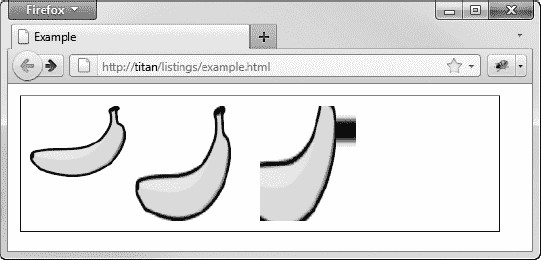

*图 35-19。绘制图像*

#### 使用视频图像

我们可以使用一个`video`元素作为`drawImage`方法的图像源。当我们这样做的时候，我们拍一张视频的快照。[清单 35-18](#list_35_18) 提供了一个演示。

*清单 35-18。使用视频作为 drawImage 元素的来源*

`<!DOCTYPE HTML>
<html>
    <head>
        <title>Example</title>
        
    </head>
    <body>
        <video id="vid" src="timessquare.webm" controls preload="auto"
            width="360" height="240">
            Video cannot be displayed
        </video>
        

            <button id="pressme">Snapshot</button>
        
        
        <canvas id="canvas" width="360" height="240">
            Your browser doesn't support the <code>canvas</code> element
        </canvas>
        
    </body>
</html>`

在这个例子中，我有一个`video`元素、一个`button,`元素和一个`canvas`元素。当按钮被按下时，当前视频帧被用于使用`drawImage`方法绘制画布。你可以在[图 35-20](#fig_35_20) 中看到结果。

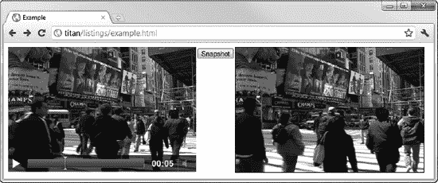

*图 35-20。使用视频作为画布绘制图像方法的来源*

如果你发现自己在看 HTML5 演示，你会经常看到用来绘制视频的画布。这是使用我刚刚向你展示的技术，结合一个定时器(如第 27 章中描述的那样)来完成的。[清单 35-19](#list_35_19) 展示了如何把这些放在一起。这不是我特别喜欢的技巧。如果您想知道原因，只需观察显示这种类型文档的机器上的 CPU 负载。

*清单 35-19。使用画布显示和绘制视频*

`<!DOCTYPE HTML>
<html>
    <head>
        <title>Example</title>
        
    </head>
    <body>
        <video id="vid" hidden src="timessquare.webm" preload="auto"
            width="360" height="240" autoplay></video>
        <canvas id="canvas" width="360" height="240">
            Your browser doesn't support the <code>canvas</code> element
        </canvas>
        
    </body>
</html>`

在这个例子中，有一个我已经应用了`hidden`属性的`video`元素，所以它对用户是不可见的。我使用了两个定时器——第一个每 25 毫秒触发一次，绘制当前视频帧，然后绘制一个描边矩形。第二个计时器每隔 100 毫秒触发一次，并更改用于矩形的值。效果是矩形改变尺寸并叠加在视频图像上。你可以在[图 35-21](#fig_35_21) 中感受到这种效果，尽管为了充分理解所发生的事情，你应该将示例文档加载到浏览器中。

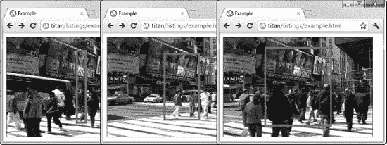

*图 35-21。使用计时器在画布上重新创建覆盖的视频*

像这样使用视频元素时，我们不能使用内置控件。我使用了`autoplay`属性来保持例子的简单，但是一个更有用的解决方案是实现自定义控件，如第 34 章所示。

#### 使用画布图像

我们可以使用一个画布的内容作为另一个画布上的`drawImage`方法的源，如清单 35-20 所示。

*清单 35-20。使用画布作为 drawImage 方法的来源*

`<!DOCTYPE HTML>
<html>
    <head>
        <title>Example</title>
        
    </head>
    <body>
        <video id="vid" hidden src="timessquare.webm" preload="auto"
            width="360" height="240" autoplay></video>
        **<canvas id="canvas" width="360" height="240">**
            **Your browser doesn't support the <code>canvas</code> element**
        **</canvas>**
        

            <button id="pressme">Press Me</button>
        

        **<canvas id="canvas2" width="360" height="240">**
            **Your browser doesn't support the <code>canvas</code> element**
        <**/canvas>**
        
    </body>
</html>`

在这个例子中，我添加了第二个`canvas`元素和一个`button`。当按钮被按下时，我使用代表原始`canvas`的`HTMLCanvasElement`对象作为第一个参数，调用第二个`canvas`的上下文对象上的`drawImage`方法。实质上，按下按钮会获取左侧画布的快照，并将其显示在右侧画布上。我们复制画布上的一切，包括红色覆盖的矩形。我们可以执行进一步的绘制操作，这就是为什么我在第二个画布上绘制了一个粗黑边框作为快照的一部分。在[图 22](#fig_35_22) 中可以看到效果。

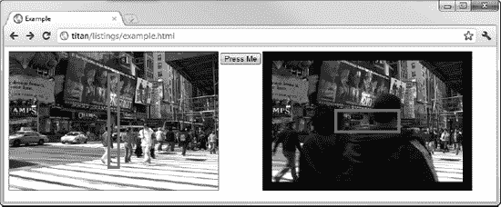

*图 35-22。使用一个画布作为另一个画布上 drawImage 方法的源*

### 总结

在这一章中，我已经介绍了`canvas`元素，展示了如何绘制基本形状，如何配置、保存和恢复绘制状态，以及如何在绘制操作中使用纯色和渐变。我还展示了如何使用`img`、`video,`或其他`canvas`元素的内容作为图像源来绘制图像。在[第 36 章](36.html#ch36)，我将展示如何绘制更复杂的形状，以及如何应用效果和变换。