# 四、掌握表单

在第 2 章中，我们看了一下 web 表单的新特性。现在是时候更深入地关注它们了。好吧，说实话，如果在许多圈子里，甚至是与 web 相关的圈子里，人们兴奋地这么说，很可能会对 web 表单兴奋的荒谬性嗤之以鼻。在过去，表单一直被归入 web 开发中令人不快的角落，是那些对单选按钮组、文本输入宽度和充满选项的下拉菜单的挑剔感兴趣的人的领域。性感的设计和丰富的互动性哪里去了？但也许更重要的是，应该有的表单输入类型都在哪里，而不是需要用 JavaScript 拼凑起来？表单标记已经伴随我们很多年了，至少早在 HTML 2 规范中就出现了，从那以后没有任何显著的变化。如果知道 HTML5 照亮了它们，它们已经成长为一套有能力处理输入的 HTML，那将是一种解脱。添加了一组新的表单输入类型、表单元素和属性，以及与 JavaScript 和 CSS 接口的新方法。有了 HTML5，许多以前必须通过其他方式构建的功能现在都免费提供了。这太令人兴奋了！

本章开始时，我研究了可用的表单标记，分析了 HTML5 中添加到表单的新特性(有很多)，如何最好地使用不同类型的表单控件，以及如何用简单的结构化标记增强可用性和可访问性。我们将剖析一个完整的表单，然后以关于 web 表单可用性和相关问题的一些大的想法结束。

### 表单标记刷新程序

本质上，表单非常简单——它们允许用户在一端输入一些数据，然后将数据发送到另一端，由表单处理程序处理。一个**表单处理程序**通常意味着一个处理输入表单数据的脚本，它是用服务器端编程语言或框架如 PHP、Python 或 ASP.NET 编写的。可以把表单想象成 HTML 中的数据中介，位于您和网页服务器之间。

表单由一个`form`元素组成，该元素围绕任意数量的“表单控件”(用于收集输入的表单 HTML 元素)以及任何其他正文标记(如段落和其他流内容)建立一个容器(但是，不允许将一个表单嵌套在另一个表单中)。在所有输入表单控件的下面，都有一个按钮，用于提交表单，将输入的数据发送到服务器。表单可以使用两种不同的方法发送数据:GET 和 POST。这些方法之间最明显的区别是，当使用 GET 方法时，来自表单提交的数据出现在网站的地址 URL 中。例如，使用 GET 方法提交的表单的 URL 可能如下所示:

`handle_form.php?name=Anselm+Bradford&age=31.`

这可能是提交图 4-1 中的表格的结果。

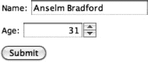

***图 4-1。**收集用户输入的简单网络表单*

对于此表单，HTML 可能如下所示:

`<form method="get" action="handle_form.php">
     
<label>Name: <input name="name" /></label>

     
<label>Age: <input type="number" name="age" /></label>

     
<button type="submit">Submit</button>

</form>`

这个例子使用 PHP 脚本来处理表单，但是也可以使用很多其他的服务器端语言，比如 ASP.NET、Python 等等。对于 PHP，有三个“超全局”变量允许它访问表单中提交的数据。变量`$_GET`和`$_POST`分别访问通过 get 和 POST 方法提交的表单数据，而`$_REQUEST`充当所有提交数据的容器，不管提交的方法是什么。例如，为了回显(在 web 浏览器中显示)在前面的表单中提交的值，可以使用下面的 PHP 代码:

`

<?php
if (isset($_REQUEST["name"]) && isset($_REQUEST["age"])){
     echo "Name: " . $_REQUEST["name"] . " ";
     echo "Age: " . $_REQUEST["age"];
}
?>

`

 **注**这只是一个简单的例子，用来显示提交的内容；在生产环境中，需要对表单输入进行筛选，以确保没有恶意代码作为表单字段数据的一部分提交。例如，对于更新数据库的表单，SQL 命令可以输入到表单中，如果没有编写服务器端脚本来过滤掉这类命令，恶意用户可能会删除数据库中的数据，甚至更糟！

#### 剖析表单元素

暂时忽略其他元素，`form`元素非常简单，只作为一个具有少量属性的容器存在。除了前面显示的`method`和`action`属性之外，`form`元素还有以下属性(以及[第 2 章](2.html#ch2)中列出的全局属性):`accept-charset`、`autocomplete`、`enctype`、`name`、`novalidate`和`target`。在 HTML5 中，一个属性`accept`被扔进了废弃的垃圾箱，而两个属性`autocomplete`和`novalidate`是新的。下面是一个完整构造的`form`元素的例子:

`<form action="handle_form.php" method="post" target="_blank" accept-charset="UTF-8"
enctype="multipart/form-data" autocomplete="off" novalidate>`

虽然这会使用所有属性(不包括全局属性)，但没有必要输入所有或任何属性，因为它们都是可选的。通常，至少会指定`action`和`method`(如前面的例子)属性。在下一节中，我们将讨论这些属性的作用，这样您就可以自己决定需要哪些属性。

#### 表格元素属性

以下部分详细描述了每个表单属性。

**动作属性**

`action`属性告诉用户代理(web 浏览器)在提交表单时应该对表单内容做什么(使用 submit 按钮，这是一个表单控件元素，我们将在后面讨论)。和前面的例子一样，可以指定一个服务器端脚本来处理提交的表单数据。如果省略，表单将重定向到提交表单的同一个 URL。

**方法属性**

`method`属性是表单被设置为使用 GET(默认)或 POST 的地方。一般的经验法则是，如果表单提交正在主动修改数据(比如以某种方式更新服务器端数据库)或者包含敏感信息(比如密码)，您的表单应该使用 **POST** 。另一方面，如果表单提交是被动的，比如搜索引擎的数据库查询，那么使用 **GET** 。为什么？让数据在页面的 URL 中可见(使用 GET)将允许页面被书签标记，这对于搜索查询很有用，而不在 URL 中(使用 POST)则为敏感数据提供了更好的安全性。此外，GET 更适合于少量数据，因为它有大小限制，因为 URL 只能有这么长(实际长度因 web 浏览器而异)。

**接受字符集属性**

`accept-charset`属性允许您指定服务器可以在提交的表单数据中处理哪些字符编码。如果没有指定(通常的情况)，则使用页面的字符集(应该在 head 部分使用`meta`元素设置和/或在服务器的 HTTP 响应头中发送)。如果可以接受多个字符集，则该属性可以是以空格分隔的值列表；但是，为了避免字符显示不正确的问题，在处理编码时，请始终使用 UTF-8。UTF 8 支持世界上所有的主要语言。

**enctype 属性**

`enctype`属性用于指定发送表单数据时如何编码。它有三个可能的值:`application/x-www-form-urlencoded`、`multipart/form-data`和`text/plain`。在大多数情况下，可以省略它，因为它将默认为提到的第一个值，这将以 URL 安全的方式对数据进行编码。这通常是区分不明确的表单数据和其他信息所必需的。例如，如果某些表单数据中有一个正斜杠(实线),那么如果它以未编码状态放在网页的 URL 中，就会出现问题，因为正斜杠意味着移动到 web 服务器上的新目录。相反，正斜杠将被作为`%2F`发送，这是在 UTF-8 字符集中分配给正斜杠的十六进制值。即使使用 POST 方法发送数据，这种格式也有助于从发送到 web 服务器的其他信息中挑选出表单数据。

更改该属性的时机是在使用文件输入元素(用于上传文件，这将在后面描述)时，在这种情况下，该属性应该包含一个值`multipart/form-data`，它允许表单处理二进制数据。最后一个值`text/plain`，发送未编码的表单数据。通常不应该使用这个值，因为它很难挑选出表单数据。它主要是由于历史原因而可用的。

**目标属性**

`target`属性的工作方式类似于链接上的`target`属性(`a`元素),它告诉浏览器在哪里打开在`action`属性中指定的 URL。值`_blank`将在新窗口中打开表单提交结果，`_self`将在同一窗口中打开表单提交结果，`_parent`将在父浏览上下文中打开表单提交结果。例如，`iframe`元素可以用来将一个带有表单的 HTML 页面嵌入到另一个 HTML 页面中，该页面被认为是嵌套的 HTML 页面的父浏览上下文。最后，如果表单嵌套了几页深(例如，使用多个`iframe`),那么`_top`的值将加载最顶层的页面。

**姓名属性**

下一个属性`name`，用于向脚本标识表单。它本质上是赋予表单的唯一 ID，用于在页面上使用的所有表单中识别它。在 JavaScript 中，可以通过`document.forms`属性访问表单，该属性包含对页面上所有表单的引用。例如，对于具有属性`name="contactform"`的表单，可以使用 JavaScript `document.forms.contactform`来访问它。如果您不太熟悉 JavaScript，只需知道您也可以使用`id`(甚至`class`)属性来访问表单，这可能是从 JavaScript 与表单交互的更好途径。

**自动完成和更新属性**

最后，最后两个属性`autocomplete`和`novalidate`将在后面详细讨论，但简单地说，它们分别告诉浏览器是否自动填充表单中记住的值以及是否验证表单的输入。

### 收集输入

`form`元素只是数据收集元素的容器，称为**表单控件**，它们是`input`、`select`和`textarea`元素。这些工作的细节将在适当的时候进行说明，但是首先要注意它们都使用的一个属性:T4 属性。与出现在`form`元素上的`name`属性不同，这个属性在这个上下文中具有更重要的作用。所有向表单处理程序传递数据的表单控件都必须有一个`name`属性；否则，当提交表单时，它们不会传递它们的值。除了表单控件被组合在一起的情况，例如单选按钮的情况，`name`属性值应该是唯一的，这样就可以从其余的表单输入值中挑选出一个特定的值。例如，下面的表单片段显示了两个输入字段:

`…
     <input name="firstname" type="text" value="Anselm" />
     <input name="lastname" type="text" value="Bradford" />
…`

这里的名称/值对是*名字/安瑟伦*和*姓氏/布拉德福德*(这些值是使用`value`属性的默认设置，但是可以通过用户输入的数据进行更改)。如前所述，如果表单是使用 GET 方法提交的(并且 web 页面文件名是`handle_form.php`)，那么页面的 URL 应该是这样的:

`handle_form.php?firstname=Anselm&lastname=Bradford`

这显示了 URL 中的`name`属性及其相关值。

一般来说，一个表单的真正核心是变形元素`input`。我称之为变形，因为`input`元素在 HTML 元素中相当独特，它可以呈现许多不同的外观和行为，这取决于它的`type`属性中的值。`type`属性将一组关键字中的一个作为它的值。例如，前面的示例将带有`type="text"`的两个表单控件的输入类型都设置为文本输入。HTML5 中的可用类型列表大幅增加，如[表 4-1](#tab_4_1) 所示。每种输入类型的外观将由 web 浏览器决定(可能会因浏览器而异),但可以用 CSS 进行样式化。

 **注意**如果在`input`元素上没有指定`type`属性，或者如果使用了您的首选 web 浏览器尚不支持的类型，输入类型将变成单行文本输入字段。

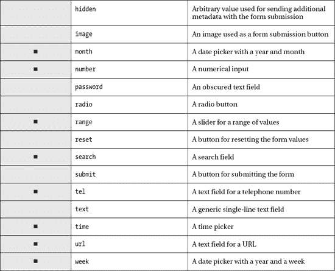

#### 原始输入类型

传统上，`input`有一小组可能的类型:`text`、`password`、`file`、`checkbox`、`radio`、`hidden`、`button`、`reset`、`submit`和`image`。为了让您熟悉不同的类型，我们将简要地浏览一下最初的类型，然后更深入地介绍新的类型。

 **注意**当我在接下来的章节中介绍输入类型时，我提供了许多表单输入字段的截屏。如果您在这里看到的与您自己首选的 web 浏览器中显示的不完全匹配，请不要感到惊讶。有些字段可能看起来不同，有些功能可能略有不同，或者有些可能根本不支持。浏览器对 HTML5 规范中新的表单元素和其他特性的支持正在迅速改善。然而，这里的目标并不是向您展示使用哪种浏览器来查找特定的表单输入字段；更确切地说，它是向你展示最新的网络浏览器有什么可能，以及我们希望在仍在追赶的浏览器的未来迭代中有什么可期待的。这是未来的路，无论是通过 Safari、Chrome、Opera、Firefox 还是 Internet Explorer 来展示。

##### 文本输入

不出所料，使用了一个`text`输入来收集输入的文本。这是`input`使用的默认类型，也可能是您遇到的最常见的输入。这是一个单行控件，通常以带有内嵌边框的矩形框的形式出现，如图[图 4-2](#fig_4_2) 所示。

***图 4-2。**显示输入到输入中的一些内容的文本输入*

输入字符串的允许长度可以通过添加一个`maxlength`属性来指定，该属性采用一个等于允许的最大字符数的数值。当用户试图插入超过允许数量的字符时，没有提供直接的反馈机制——表单控件只是停止接受额外的字符，并且如果这样的字符串被粘贴到控件中，将截断过长的字符串。如果您想提醒用户空间已经用完，您需要使用 JavaScript。

 **注意**`maxlength`属性不是万无一失的；例如，可以通过 JavaScript 将更长的文本添加到文本输入中，这些文本将被提交给服务器而不会被截断。为了限制完全确定提交的文本长度，也需要在服务器上检查长度。

您还可以包含一个`value`属性来预设文本控件的内容:

`<input type="text" name="data" value="Default text" />`

页面加载时，`value`属性中输入的文本会出现在文本字段中，如图 4-2 中的[所示。](#fig_4_2)

 **注意**使用`value`属性是一种包含默认数据的方法，如果用户在提交表单之前没有更新输入的值，就会提交默认数据。`value`属性传统上也是提示用户在文本字段中输入内容的方式。这是一个非常普遍的需求，事实上 HTML5 已经为这种“占位符”文本添加了一个属性。但是现在不要担心这个特性，因为它将在本章的后面介绍！

##### 密码输入

一个`password`输入几乎等同于一个文本输入；功能上唯一的区别是字符输入在输入时被屏蔽，通常是被一系列的点屏蔽，如图[图 4-3](#fig_4_3) 所示。它与文本输入共享相同的可能属性；唯一的区别是`type`属性被设置为`type="password"`。

***图 4-3。**显示正在输入文本的密码输入*

这种类型的输入不是很安全——如果您的表单使用了`GET`方法，表单数据仍然会以纯文本的形式传输，并且会在 URL 中可见。这种视觉屏蔽实际上只是为了防止任何人越过你的肩膀看到输入内容(例如，当你在公共场所登录银行网站时)。

##### 文件输入

一个`file`输入通常采用某种浏览按钮的形式，以及一个显示已选择文件信息的区域。浏览器之间的外观差别很大，比其他常见的输入类型更大，如图 4-4 所示。

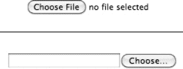

***图 4-4。**两种不同网络浏览器中文件输入控件的外观，谷歌 Chrome(上)和 Opera(下)*

文件输入控件允许您在本地网络上浏览文件，以便将其上传到网站。一旦你选择了文件，文件就会以某种方式显示，这取决于网络浏览器，如图[图 4-5](#fig_4_5) 所示。

***图 4-5。**文件输入控件在两种不同网络浏览器中的外观:Google Chrome(上)显示文件名，Opera(下)显示文件路径。*

如前所述，为了让表单成功发送二进制数据，比如上传文件时，将相关表单上的`enctype`属性设置为`enctype="multipart/form-data"`。这将正确格式化表单数据，以便服务器端脚本可以处理该文件。

 **注意**在 PHP 中，有一个名为`$_FILES`的全局变量，可以用来访问上传的文件。你可以在`[http://php.net/manual/en/features.file-upload.php](http://php.net/manual/en/features.file-upload.php)`找到用 PHP 处理上传文件的信息。

默认情况下，一次只能上传一个文件；然而，通过向文件输入控件添加布尔`multiple`属性，可以选择多个文件进行上传:

`<input type="file" name="filedata" multiple />`

如果没有该属性，在操作系统的文件浏览器中一次只能选择一个文件；但是，包含此属性后，可以按住 Command 键(Mac)或 Control 键(Windows)来选择多个文件。同样，文件输入控件的外观会因浏览器而异，但它可能看起来像[图 4-6](#fig_4_6) 。

***图 4-6。**选择多个文件后 Safari 中文件输入控件的外观*

 **注意**不幸的是，当代的 HTML 特性通常都是这种情况，在可预见的将来，不要指望 Internet Explorer 会支持`multiple`属性。但是，如果使用另一个主要的 web 浏览器，它在 Windows 上也可以工作。

`file`输入包含一个`accept`属性，理论上可以用来限制上传文件的类型；然而，在实践中，它纯粹是咨询性的，可能会被忽略。它接受一个逗号分隔的 MIME 类型列表，该列表与可接受的文件类型有关，例如看起来像`accept="image/gif,image/jpeg,image/jpg"`。这将通知浏览器服务器只接受 GIF 和 JPEG 图像。即使浏览器注意到了这个属性，在生产环境中，您也需要使用服务器端过滤器来检查提交的文件实际上是正确的类型，因为这种客户端检查很容易被绕过。

##### 检查框

这是一个我们熟悉的老复选框，我们喜欢用来收集或真或假的输入。除了文本输入，这是您可能遇到的最常见的输入类型之一。一个`checkbox`输入通常采用一个方形框的形式，可以被选中或取消选中，但是使用 JavaScript，可以设置第三种“不确定”状态，看起来既不在真也不在假的条件下，如图 4-7 所示。

***图 4-7。**三个复选框:一个未选中，一个未选中，一个处于不确定状态*

不确定状态是通过`checkbox`元素上的布尔`indeterminate`属性设置的，如下所示:

`function init() {
          document.getElementById("option3").indeterminate = true;
}
window.onload = init;`

这段代码将被放在一个脚本中(或者放在页面上的一个`script`元素中，或者最好放在一个外部文件中),并将影响下面的 HTML 片段:

`<input type="checkbox" name="option3" id="option3" />`

要将复选框设置为选中状态，需要添加一个布尔属性`checked`。只有被选中的复选框的数据才会与表单一起提交。`value`属性可以用来设置提交表单时发送的值，但也可以省略，在这种情况下，默认值将是文本“on”[图 4-7](#fig_4_7) 中的复选框可能如下所示:

`<input type="checkbox" name="option1" id="option1" />
<input type="checkbox" name="option2" id="option2" checked />
<input type="checkbox" name="option3" id="option3" />`

当这些作为表单的一部分提交时，web 页面的 URL 将被附加上 querystring `?option2=on`(如果使用 GET 方法)。

##### 单选按钮

像复选框一样，单选按钮可能你以前也遇到过。它们可能不太常见，但仍然在网络上广泛流行。一个`radio`输入有两种状态，选择或不选择，如图[图 4-8](#fig_4_8) 所示。

***图 4-8。**两个单选按钮，一个选中，一个未选中*

您使用单选按钮来指示只能从几个选项中选择一个选项，即一个**单选按钮组**。

为了向用户代理表明一个单选按钮是组的一部分，您为每个单选输入元素的`name`属性赋予一个相同的值。当呈现表单时，如果输入与另一个输入共享一个名称值，用户代理将不允许选择多个单选输入。以下是前面示例的标记:

`<input type="radio" name="example" value="first" />
<input type="radio" name="example" value="second" checked />`

正如您在前面的代码中看到的，单选按钮的状态可以像复选框一样，用`checked`属性进行预设。

 **注意**现实世界中的表单也会包含表单标签，但是我们将在“用字段集和标签添加结构”一节中讨论这些

##### 添加隐藏输入

`hidden`输入类型用于将用户看不到的额外数据包含在表单中，但与表单数据的其余部分一起提交。这里有一个例子:

`<input type="hidden" name="hiddenValue" value="42" />`

当包含该输入的表单被提交时，值`hiddenValue=42`将出现在 URL 中(如果使用`GET`方法),并将与表单中的其他数据一起被传递到服务器端。

 **注意**`hidden`输入有时与`file`输入类型一起使用，告诉服务器可接受上传的最大文件大小。例如，一个表单可能包含以下输入，告诉服务器脚本文件上传应该限制在最大 20 千字节(大约)的文件大小:

`<input type="hidden" name="MAX_FILE_SIZE" value="20000" />`.

##### 按钮、提交、重置和图像输入

`button`输入类型与`button`元素有很多重叠(将在本章后面讨论)，在这两者之间，`button`元素可能是更好的选择。两者都创建了一个带有文本标签的可点击按钮，但是本质的区别在于`button`元素可以在它的标签中使用 HTML 元素，而`button`输入类型只能使用纯文本(参见本章后面的“使用按钮和图像提交表单”一节中的例子)，这使得它不够灵活。`submit`和`reset`类型也创建按钮，具有提交表单(将数据发送到服务器)的额外能力，并在单击时将表单值重置为默认值。与`button`输入一样，`button`也可用于这些任务。简而言之，如果它看起来像一个按钮，请使用`button`元素！

最后一种类型`image`，用于使用图像代替提交按钮；这将在后面的“使用按钮和图像提交表单”一节中讨论。

#### 新的输入类型

正如你在[表 4-1](#tab_4_1) 中看到的，`input`元素有很多种新类型。有些是比较通用的，比如数字的输入，而有些是非常具体的，比如创建一个颜色选择器。

 **注意**许多表单元素还没有在现代 web 浏览器中实现。Opera 和 Google Chrome 似乎领先一步，但对于那些不支持新类型的应用，输入字段将会退回到默认状态——基本的文本输入。与其他 HTML5 特性一样，您可以使用 Modernizr ( `[http://www.modernizr.com](http://www.modernizr.com)`)来检测对新输入类型的支持。要添加对旧 web 浏览器中缺少的功能的支持，可以使用 html5Widgets 之类的脚本，这是一个 JavaScript poly fill——这意味着它在不支持表单功能的浏览器中使用 JavaScript 来填充缺少的表单功能。下载 html5Widgets 脚本并在`[https://github.com/zoltan-dulac/html5Widgets](https://github.com/zoltan-dulac/html5Widgets)`找到实现细节。

##### 颜色选择器

`color`输入类型创建了一个**颜色选择器**(也称为**颜色井**)，可用于选择颜色，如图[图 4-9](#fig_4_9) 所示。提交表单时，颜色值作为 URL 编码的十六进制值 [1](#CH-04-FN-1) 发送。例如，黑色(默认)将作为`%23000000`发送，其中“`%23`是散列符号(#)的 URL 编码，这意味着`%23000000`是颜色值`#000000`(这是在例如 CSS 代码中遇到颜色的更常见方式)。

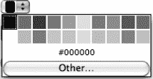

***图 4-9。**用颜色输入类型创建的弹出颜色选择器，如 Opera web 浏览器*所示

这个特定的输入可能看起来相当深奥，您甚至可能会问自己什么时候真正需要它。这里有一个例子可以让你了解如何使用它:一个包含“按颜色搜索”功能的搜索引擎，可能是汽车经销商搜索表单的一部分，允许用户在搜索新车时包含首选颜色:

`
<label>Preferred color: <input type="color" name="carcolor" /></label>
[2](#CH-04-FN-2)`

虽然您可能不会经常使用这种输入，但是当您需要它时，拥有它无疑是非常宝贵的。在一天结束的时候，能够给一个表单添加一些颜色是多么酷啊，实际上，表单经常是一个平淡无奇的文本输入域的海洋。

##### 日期和时间输入

日期/时间控件是需要收集特定日期和时间的输入的网站的常见要求，例如机票预订网站或酒店住宿预订系统。为了满足这一需求，HTML5 增加了相当多的与选择特定日期和时间值及范围相关的输入。`date`、`time`、`datetime`、`datetime-local`、`month`和`week`输入类型创建了更细粒度或更粗粒度的收集时间和日期信息的方法。这些表单控件通常具有一个数字步进器和/或看起来像标准下拉列表的东西([图 4-10](#fig_4_10) )。目前最复杂的实现是在 Opera 中，当点击选择想要的日期时会产生一个弹出日历控件(图 4-11 )。

__________

1 URL 编码是指将特殊字符转换成代码，通过网站 URL 地址安全传输。

正如在前面的例子中提到的，我们将在后面讨论标签元素。

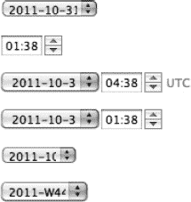

***图 4-10。**Opera 网络浏览器中显示的所有不同的日期和时间相关输入。从上到下:`date`、`time`、`datetime`、`datetime-local`、`month`、`week`。*

***图 4-11。**弹出一个日期/时间控件，显示 Opera 中自带的日历控件*

这些输入类型可能比任何其他控件都更能显示 web 表单的新增功能有多少可能是免费的。图 4-11 中的[日历控件由 web 浏览器提供，只有一行 HTML，这通常需要大量的 JavaScript、CSS 和 HTML 来创建。在撰写本文时，Opera 是唯一一个本地提供日历控件的浏览器，所以 JavaScript/CSS/HTML 解决方案仍然是大多数当代 web 浏览器需要的途径。不幸的是，如果可能的话，利用浏览器本身提供的功能，一旦这些输入类型获得了更广泛的支持，您的页面就可以过渡到本身提供的界面。我们只能希望其他 web 浏览器能很快跟上，但与此同时，jQueryUI (](#fig_4_11) `[http://jqueryui.com](http://jqueryui.com)`)这样的项目可以与 Modernizr ( `[http://modernizr.com](http://modernizr.com)`)结合使用，以便在不支持日期/时间输入时提供后备。jQueryUI 包含了一个名为 datepicker ( `[http://jqueryui.com/demos/datepicker/](http://jqueryui.com/demos/datepicker/)`)的日历控件，它产生的日历控件与图 4-11 中的[非常相似，但是由于它不是一个本地控件，如果控件是表单输入的一个关键部分，那么需要处理 JavaScript 被禁用的情况。](#fig_4_11)

为了用日期/时间预设输入，可以为`value`属性提供一个设置初始值的文本字符串。[表 4-2](#tab_4_2) 显示了每个日期/时间输入类型的文本字符串的格式。

T2】

注意[表 4-2](#tab_4_2) 中`datetime`和`datetime-local`的区别。`datetime`中的 *Z* 表示输入的日期和时间被发送到服务器，并期望它们处于 UTC 时区(例如，在英国)。这为时间提供了一个公共时区，这可能更容易使用，但这意味着服务器、客户端或用户需要偏移这个时区才能到达他们自己的时区。另一种类型`datetime-local`不包含时区值，所以数据应该是访问者提交表单时所在时区的数据。

[表 4-2](#tab_4_2) 中的相同文本字符串格式也可用于`min`和`max`属性，这些属性可用于创建具有最小和/或最大允许日期/时间值的日期范围。此外，可以添加属性`step`来设置日期/时间字段可以移动的量。例如，对于涉及时间的输入类型(`time`、`datetime`和`datetime-local`)，有一个 60 秒的默认步长，这意味着每单击一次控件以增加值，将向前(或向后)移动 1 分钟。对于包含时间的输入类型，`step`属性以秒表示，因此通过添加`step="120"`，，默认值将变为 2 分钟(60 秒乘以 2)而不是 1 分钟。`date`、`week`和`month`输入类型具有更大的测量单位，默认步长值分别为 1 天、1 周和 1 个月。例如，下面的代码片段将提供一个控件，该控件允许选择每隔一周(通过将步长设置为 2 周),并且将限于(北半球)夏季的日期:

`<input type="week" name="event" step="2" min="2011-W25" max="2011-W38" />`

##### 数字输入:数字和范围

`number`输入类型做了您所期望的事情——它处理数字输入。在支持的浏览器中，外观是类似于`time`输入类型的步进控件([图 4-12](#fig_4_12) )。与日期/时间控件一样，`min`和`max`属性可用于将可能的数字范围限制在一个范围内。此外，`step`属性可以用来增加或减少一定数量的值(默认为 1)。如果`min`和/或`step`属性设置为十进制值，则可以使用小数值。

***图 4-12。**正在输入数值的数字输入类型*

在显示数字的实际值不是最重要的情况下，有`range`输入类型([图 4-13](#fig_4_13) )，它显示一个在最小值和最大值之间的可拖动滑块(默认为 0 和 100)。也可以在该类型上设置`min`、`max`和`step`属性。

***图 4-13。**默认情况下，范围不显示当前值。*

##### 搜索输入

`search`输入类型是 HTML5 中新增的最简单的类型。根据浏览器的不同，它可能与常规的文本输入类型控件没有区别。那么，它为什么会在那里？这是主要出于语义原因而添加的。将表单输入类型设置为`search`会将该字段与页面上的其他文本字段分开。在将来，这可以用于应用搜索字段所期望的功能或行为。例如，Safari 目前在搜索栏的右侧添加了一个 x 按钮，可以清除在栏中键入的任何文本([图 4-14](#fig_4_14) )。这与工具栏中内置的 web 搜索栏的行为是一致的。

***图 4-14。** Safari 在搜索输入类型上默认提供了一个清除搜索的按钮。*

##### 个人详细信息:电子邮件、电话和网站 URL 输入

像`search`输入类型一样，最后三种输入类型——`email`、`tel`和`url`——只是附加了额外语义的文本字段。它们甚至看起来像普通的文本输入框([图 4-2](#fig_4_2) )，但是在表面之下，它们有一种特殊的品质，可以节省你在页面上摆弄脚本的大量时间。它们是展示 HTML5 中一个新特性——内置表单验证——的很好的例子！让我们来看下一个。

### 验证和提交表单

我在讨论`form`元素时顺便提到，有一个名为`novalidate`的属性可以添加到`form`中，以绕过许多验证规则，否则这些规则将在输入中被检查。这就像把表格拨回到过去一样。如果你想这么做的话，我只是提到它的存在，但是让我们看看这些验证规则是关于什么的。

取`email`输入类型；它提供了语义上的含义，即无论输入什么文本，都将采用有效的电子邮件地址的形式。这是提交表单时 web 浏览器可以检查的内容。如果输入的值不是一个格式正确的电子邮件地址，浏览器会抛出一个错误信息，告诉用户输入一个正确的值([图 4-15](#fig_4_15) )。

***图 4-15。**提交表单时，在`email`输入类型字段中输入的无效文本会产生验证错误。*

对于不支持新的 HTML5 客户端验证的浏览器，可以包含一个由 Weston Ruter 编写的名为`webforms2.js`的 JavaScript 来提供支持。这个脚本可以在`[https://github.com/westonruter/webforms2](https://github.com/westonruter/webforms2)`下载。

 **注意**在服务器端仔细检查从表单接收的输入也是一个很好的经验法则。这里显示的客户端验证行为主要是为了提高表单的可用性。它们为用户提供了一些即时反馈，告诉他们输入了错误的信息类型，而不需要您使用 JavaScript 或其他方式自己创建该功能。当在服务器端处理数据时，您会希望再次检查以确保提交了正确类型的信息。谁知道呢，也许用户从某个不支持客户端验证的不知名的 web 浏览器访问了您的表单，躲过了所有的浏览器嗅探检查，并在将电子邮件地址输入表单时设法破坏了它。这些事情会发生，所以在服务器上仔细检查提交的数据。

默认情况下,`email`输入类型只支持输入一个电子邮件地址，如果在该字段中添加了多个电子邮件地址，验证将会失败。然而，如果布尔属性`multiple`被添加到输入字段，这是可以改变的。然后，它将允许在单个字段中输入逗号分隔的电子邮件地址列表。

如果在字段中输入了错误的信息，输入类型`url`也会抱怨。输入的任何格式错误的 URL 地址都会引发类似于[图 4-15](#fig_4_15) 的验证错误。此外，它会在需要时添加`http://`来完成一个完整的 URL 地址。

`tel`输入类型稍微宽松一些，因为它不寻找特定的格式，但是如果输入了非数字字符，它会报错。由于电话的号码格式在世界各地都不相同，所以对号码的格式不可能有严格的要求。为了细化这种输入类型，使*能够*验证特定的电话号码格式，有一个属性就是为了这个目的。这个属性称为`pattern`属性，它将一个**正则表达式(regex) [3](#CH-04-FN-3)** 作为值，并根据它是否匹配 regex 来验证字段中的输入。正则表达式这一主题超出了本书的范围，但作为一个简单的例子，下面的代码片段将电话字段的输入限制为 NNN-NNN-NNNN 格式，其中第一个数字是 2 到 9 之间的数字，其余数字是 0 到 9 之间的数字 [4](#CH-04-FN-4) :

`<input type="tel" name="usphone" pattern="^[2-9]\d{2}-\d{3}-\d{4}$" />`

肯定是神秘的寻找！如果你想知道正则表达式是如何工作的，在网上快速搜索一下*正则表达式*，你会找到大量的资源。对于一些方便的、预构建的正则表达式模式来匹配从信用卡号到纬度和经度的一切，请查看`[http://html5pattern.com](http://html5pattern.com)`，它还包括一个测试平台，您可以在其中开发和测试自己的模式。

 **注意**`pattern`属性不只是在电话输入类型上找到的；它存在于所有基于文本的输入类型中。那些是`text`、`search`、`url`、`tel`、`email`和`password`。

#### 制作所需输入

一种更简单的验证形式(双关语)是要求在提交表单之前，至少给某些字段和表单控件赋予某种值。这就是布尔属性`required`可以被利用的地方。通过将此属性添加到表单控件:

`
<input type="text" name="example" required />
`

如果在该字段中没有输入任何内容，将出现一个错误弹出窗口([图 4-16](#fig_4_16) )。

***图 4-16。**显示必填字段未填写的验证错误*

#### 使用按钮和图像提交表单

提交按钮用于将所有的表单数据提交到表单的`action`属性中指定的文件(如果没有指定`action`属性，则提交到表单本身)。正如本章前面提到的，`button`元素是一个比`input`元素更灵活的创建按钮的选项。例如，比较下面的 HTML 代码片段中的两行代码，它产生了图 4-17 中的[按钮:](#fig_4_17)

__________

正则表达式是一种非常简洁的语法，用于匹配符合特定模式的文本。

理想情况下，正则表达式在构建时应该考虑到某些方面的灵活性，但在需要的地方要严格。这个简单的例子并不完全理想，因为它需要数字之间的破折号。最好是一个正则表达式，只要有适当的数字序列，它就可以处理任何破折号或没有破折号的组合。

`
<input type="submit"/>

<button type="submit"><strong><em>Submit!</em></strong></button>
` 

*图 4-17**。**两个提交按钮，一个用`input`元素创建(顶部)，另一个用`button`元素创建(底部)*

由于`button`元素不是一个自结束元素，它允许 HTML 被包含在创建它的标签的文本中，这提供了更好的标签样式的可能性。

如果`type`属性被设置为`type="reset"`，则创建一个重置按钮。重置按钮输入将同一表单中的所有表单控件重置为其初始值。包含重置按钮曾经是一种常见的做法，但后来变得不流行了，因为用户意外重置表单而不是提交表单的风险很高。如果没有任何撤消功能，重置按钮几乎没有什么用处，即使有也应该谨慎使用。

 **注意**拜托，我们都做过这样的事情:到达一个表单的末尾，切换到我们认为是提交的按钮，按下回车键，绝望地看着所有的表单数据迅速消失。如果你曾经想过在一个表单上包含一个重置按钮，试着回忆一下过去你有多少次填写了一个表单，到达了末尾，然后想，“实际上，我想我会把它们都删除掉，不用麻烦了。”没错。

`button`元素的提交类型不与`input`元素重叠的一个用例是，如果您想使用一个图像作为提交按钮，在这种情况下，需要使用一个具有`image`的`type`属性和一个附加的`src`属性的`input`。虽然可以在按钮内部使用图像(如图 4-17 中的[，但是使用图像输入控件会使整个图像成为按钮，而不需要浏览器添加任何额外的 UI 元素。`src`属性指向镜像文件在服务器上的位置，就像`img`一样。同样像`img`一样，出于可访问性的原因，记得包含一个描述图像用途的`alt`属性。](#fig_4_17)

使用图像作为提交按钮也会将 x 和 y 坐标作为值发送(图像中您所单击位置的 x 和 y 坐标)；这适用于图像提交与服务器端图像映射结合使用的情况。如果你的图像有一个`name`属性，那么它也会和坐标一起被发送。例如，如果您的表单使用了`GET`方法，图像提交按钮如下所示:

`<input type="image" name="imagesubmit"/>`

将像这样传递值:

`handle_form.php?imagesubmit.x=10&imagesubmit.y=20`

如果你没有用这些值做任何事情，不要担心它们。当它们与表单数据的其余部分一起提交时，它们不会造成任何损害。如果您真的想阻止它们在 URL 中出现，那么您可以将表单的属性从`GET`更改为`POST`，这将对用户隐藏所有的值。

### 其他常用输入元素属性

虽然不是表单控件功能的核心，但有几个属性值得注意。首先，有许多属性可以用来覆盖特定元素上的表单行为。[表 4-3](#tab_4_3) 列出了这些属性，从它们的名称可以看出，它们将覆盖父表单元素的属性中设置的特定值(如有必要，请参考表单元素属性的讨论)。

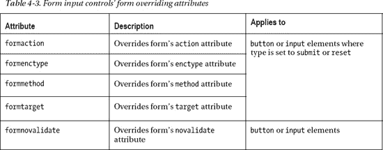

每个表单控件元素(`button`、`input`等等)还有一个名为`form`的属性，它可以用来将一个表单控件元素与一个不同于它在 HTML 结构中所包含的表单关联起来。如果通过一些示例代码来查看，这一点可能会更清楚:

`<form id="form1">
     
<button type="submit">Submit!</button>

</form>
<form id="form2">
     
<input name="example" form="form1 form2" />

     
<button type="submit">Submit!</button>

</form>`

在这种情况下，名为`example`的`input`元素的`form`属性被设置为值`form1 form2`，这意味着它被视为包含 form1 和 form2。当提交任一表单时，`example`输入控件也将被提交。这样，`form`属性可以用来模拟一个嵌套的表单，即使 HTML 中不允许这种结构。还可以在提交按钮上设置`form`属性，这样一个提交按钮可以提交另一个表单。例如，如果您在页面的页眉和页脚中有一个搜索字段，并且希望两个搜索输入都提交到同一个表单，那么可以使用这个特性。页眉和页脚提交控件可以与同一个表单相关联，而不是将整个页面内容放在表单中(这将阻止在页面上创建其他表单)。

 **注**同其他当代形式特征一样，歌剧在这一点上是领先群雄的。一定要在你的首选浏览器中测试这个特性，但是如果它还没有实现也不要惊讶！

#### 提供占位符文本

可以对一个表单做一些小事情，使它变得更加完美和可用。这是一件这样的事情。您可以在表单中添加文本来提示它们的用途(地址、电话号码等)，而不是在表单中设置空白文本字段。传统上，这是通过在`input`元素上设置`value`属性来完成的。这种方法的问题是，最初添加的文本可能会被删除，这对于实际上只是一个提示而不是一个可编辑的功能来说没有意义。这个问题已经在 HTML5 中用`placeholder`属性解决了。当文本字段为空时，添加到该属性的文本将出现在文本字段中。[图 4-18](#fig_4_18) 显示了这个样子。

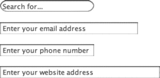

*图 4-18**。**四个不同的基于文本的输入字段(`search`、`email`、`tel`和`url`，添加了占位符文本*

#### 将输入设为只读

`readonly`属性可用于防止输入控件中的内容从其初始值被修改。如果通过 JavaScript 更新表单字段值而不允许用户更改该值，这可能会很有用，如果该值是以某种方式计算的结果，则可能会这样做。这是一个布尔属性，所以您可以简单地将它添加到元素中:

`<input type="text" value="You can't delete this" readonly />`

#### 自动完成和自动对焦

自动完成是 web 浏览器的一项功能，用于帮助自动填写表单上的详细信息。如果有人在填写姓名、地址、电话号码等。，在不同的表单上重复(例如，在电子商务网站上创建帐户时)，自动完成功能可以存储这些值，然后将它们填充到将来要填写的类似表单中。这是在 web 浏览器应用中设置的首选项。与这个特性相协调的是`autocomplete`属性，它允许浏览器的自动完成特性对表单中的单个元素或整个表单关闭。对于接收敏感数据或其他表单永远不需要的字段，可以这样做。该属性的值为`on`或`off`，如下所示:

`<form method="post" autocomplete="off">`

这将关闭本示例表单中所有表单控件的自动完成功能。

`autofocus`属性足够简单；它是一个布尔属性，当添加到一个表单控件中时，当页面加载时，焦点会立即跳转到指定的元素。这意味着用户可以立即开始输入，而不需要事先单击第一个(或任何一个)元素。它由`button`、`input`、`keygen`、`select`和`textarea`支撑。只有当页面上没有其他用户想首先点击的输入时，添加这个属性才是一个好主意。

#### 使用数据列表

大多数输入类型都包含一个名为`list` [5](#CH-04-FN-5) 的属性，它与一个新元素`datalist`一起工作。此元素定义了在表单控件输入中输入数据时可用的选项列表。`datalist`元素本身并不显示在网页上，而是向表单中其他元素的`list`属性提供数据。举个例子，让我们从一个在线工作申请的表单中截取一个片段。可能会有一个文本输入字段，要求输入期望的工资范围，如下所示:

`
<input type="text" name="salary" placeholder="Enter desired salary" />
`

用户可以输入任何金额，但提供一个常用值列表供用户选择会有所帮助。例如，可能会显示以下值:

40,000+

60,000+

80,000+

100,000+

120,000+

这些可以表示为数据列表，如下所示:

`<datalist id="salaries">
     <option value="40,000+" />
     <option value="60,000+" />
     <option value="80,000+" />
     <option value="100,000+" />
     <option value="120,000+" />
</datalist>`

然后，文本输入字段可以通过将其`list`属性设置为数据列表的 ID 来使用该列表:

`
<input type="text" name="salary" placeholder="Enter desired salary" list="salaries" />
`

结果是当用户开始在字段中输入一个值时，数据列表中的相关匹配就会弹出，如图[图 4-19](#fig_4_19) 所示。

__________

5 排除的有`password`、`checkbox`、`radio`、`file`、`hidden`、`image`、`button`、`submit`、`reset`。

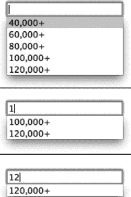

***图 4-19。**显示数据列表如何与文本输入字段相关联的三个面板。当将焦点放在文本输入字段中时，会出现关联的数据列表，并且随着字母的键入，列表会缩小到匹配的选项。*

### 其他表单控件

毫无疑问,`input`元素是一个大而通用的元素，但它不是唯一的表单控件。我们已经谈到了`button`，但还有`select`(和`option`)和`textarea`。然而，这些对 HTML5 来说并不陌生。增加的是`datalist`，这在之前的章节中已经介绍过了；`progress`；`meter`(又称规)；`output`；还有`keygen`。让我们从旧的到新的，看看每个还没有被覆盖的控件。

#### 菜单

`select`元素是一个容器元素，允许任意数量的`option`和`optgroup`元素。通常显示为下拉列表，如图[图 4-20](#fig_4_20) 所示。

***图 4-20。** A `select`菜单*

这个元素有两个其他地方没有涉及的特定属性，`disabled`和`size`。 [6](#CH-04-FN-6) 它也可能使用`multiple`属性(在本章前面的`file`输入部分首次提出)。可以添加布尔`disabled`属性来禁用(灰显)用户与菜单的交互。`size`和`multiple`属性是相关的。如果添加了布尔`multiple`属性，`select`菜单通常会显示为一个可滚动的列表框，允许用户通过按住 Command 键(Mac)或 Control 键(Windows)并单击多个项目来进行多项选择。接受数值的`size`属性决定显示多少行选项。[图 4-21](#fig_4_21) 显示了一个列表菜单的例子。

__________

6 它还拥有[第二章](2.html#ch2)中涉及的全局属性以及本章前面涉及的`name`、`required`、`autofocus`和`form`属性。

***图 4-21。**一个列表菜单，用添加了`multiple`属性的`select`元素创建*

`select`中的每一行都包含在一个`option`元素中，如下所示:

`<select name="cheesemenu">
     <option>Cheddar</option>
     <option>Stilton</option>
     <option>Brie</option>
</select>`

 **注意**前面显示的`datalist`元素也使用了`option`元素，但是用自结束标记对它们进行了格式化，并对列表数据使用了`value`属性。

`option`元素有四个特定的属性:`disabled`、`selected`、`value`和`label`。像`select`上的`disabled`属性一样，这是一个布尔属性，它阻止用户选择菜单中的特定项目。布尔`selected`属性用于向用户代理指示最初应该选择特定的`option`；没有它，浏览器可能什么都不显示(只是一个空白的选择框)或者显示它遇到的第一个`option`。例如，默认选择第二个选项，添加`selected`，如下所示:

`<select name="cheesemenu">
     <option>Cheddar</option>
     <option selected>Stilton</option>
     <option>Brie</option>
</select>`

多个`option`元素可以设置`selected`属性，但前提是`select`添加了`multiple`属性。

##### 添加不同的值

`value`属性用于允许提交不同于特定`option`内容的值。如果省略了`value`属性，那么内容被用作值。例如，给定以下菜单:

`<select name="cheesemenu">
     <option value="ch01">Cheddar</option>
     <option value="ch02">Stilton</option>
     <option>Brie</option>
</select>`

如果选择了第一个或第二个选项，它们将分别提交值`ch01`和`ch02`。如果选择第三个选项，它将使用内容“Brie”作为其值，因为没有指定的`value`属性。当您向用户显示的内容与您要提交给服务器的内容不同时，这种行为非常有用。例如，如果您正在为一个电子商务网站构建一个表单，您可能会有一个产品下拉菜单。您可能希望向用户显示产品的名称，但是某种类型的产品编号对您来说在服务器端进行管理要容易得多。因此，在添加每个产品名称的同时，您可以将产品编号作为一个值添加到列表中的每个`option`中。名称会显示给用户，但是在选择产品并提交表单后，产品编号会提交给服务器。

 **注意**在实践中，所有的选项都应该一致地使用或者不使用`value`属性。

##### 添加速记标签

最后，我们来看一下`label`属性。该属性被设计为接受一个短值来代替显示一个`option`的内容。`label`属性可以用来提供一个可选的显示标签，同时仍然保留传递给服务器的值的原始内容。这方面的代码如下所示:

`<select name="cheesemenu">
     <option>Cheddar</option>
     <option>Stilton</option>
     <option>Brie</option>
     <option label="All">All of the cheeses in all of the worlds</option>
</select>`

##### 添加菜单结构

为了帮助为你的菜单提供结构，你可以使用`optgroup`元素来分组相似的`option`元素。因此，不用下面的标记:

`<select name="cheesemenu">
     <option>- - - English cheeses - - -</option>
     <option value="cheddar">Cheddar</option>
     <option value="stilton">Stilton</option>
     <option>- - -French cheeses- - -</option>
     <option value="brie">Brie</option>
</select>`

你可以用这个:

`<select name="cheesemenu">
     <optgroup label="English cheeses">
          <option value="cheddar">Cheddar</option>
          <option value="stilton">Stilton</option>
     </optgroup>
     <optgroup label="French cheeses">
          <option value="brie">Brie</option>
     </optgroup>
</select>`

前面的标记将如[图 4-22](#fig_4_22) 所示。

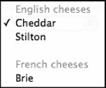

*图 4-22**。**一个由多个`optgroup`元素*组成的`select`菜单

`optgroup`元素是为正确的作业使用正确标签的一个明显例子。使用`optgroup`元素划分`option`元素的一个好处是`optgroup`标签不能被选择，它的值也不能作为数据提交，而在前一个例子中，页面作者要么不得不忍受错误的提交，要么提供一个客户端或服务器端的验证器来确保这样的划分符没有被提交。另外，`optgroup`元素有一个布尔`disabled`属性，如果需要的话，可以用来禁用整组`option`元素。

#### 文本框

`textarea`元素在某些方面类似于 text `input`元素，但是它允许多行输入，而不是只有一行。它使用一对属性`cols`和 r `ows`来控制它的大小，而不是使用一个`value`属性来预设任何文本内容，而是使用元素本身的内容。它是一个容器元素，而不是一个自结束的空元素。

下面的代码创建了一个 20 列宽 5 行高的`textarea`(如果输入超出了可视区域，就会出现滚动条)。

`<textarea cols="20" rows="5">Type your content here</textarea>`

尽管`textarea`元素是内容的容器，但是使用新的`placeholder`属性并将元素中的内容留空会更好地格式化前面的代码，如下所示:

`<textarea cols="20" rows="5" placeholder="Type your content here"></textarea>`

[图 4-23](#fig_4_23) 显示了结果。

***图 4-23。** A `textarea` 20 列宽 5 行高，添加了占位符文本*

`textarea`元素包含一个在别处没有提到的属性:`wrap`。此属性用于指示是否应该在文本框的可用区域中文本换行的位置向提交的文本区域数据添加换行符。这个属性的值可以是`hard`或`soft`。第一个是`hard`，意思是在提交的表单数据中，在文本区域中提交的文本换行的地方添加换行符。在这种状态下提交表单后，您会在 URL 中看到 URL 编码的换行符，看起来像`%0D%0A`(如果使用`GET`方法)。另一方面，`soft`值意味着虽然文本可以在屏幕上换行，但提交的数据将在没有任何换行符的情况下发送，该换行符指示文本在文本区域中的换行位置。这是默认行为。

文本区域控件也可以使用`maxlength`属性来限制可以输入的字符数量；这类似于`maxlength`属性在单行文本输入控件上的工作方式，同样的注意事项也适用(也就是说，如果数据长度非常重要，请在服务器端仔细检查长度)。

#### 显示进度

这是 HTML5 规范中的一个新元素，非常简洁！从根本上来说，这很简单:展示一个人在一个多阶段的过程中走了多远。例如，一个表单可能分布在多个页面上，这个元素用于指示用户在页面总数中的哪一页。这个元素叫什么？`progress`！它是这样工作的:有两个属性，`max`和`value`。`max`属性是任务中的最大步骤数，而`value`是用户正在进行的当前步骤。

让我们看一个例子:

`<progress max="3" value="1">Step 1 of 3</progress>`

这定义了处于三个步骤的第一步。在支持该元素的浏览器中，显示可能类似于[图 4-24](#fig_4_24) 。

***图 4-24。**在支持的网络浏览器中呈现的`progress`元素*

 **注意**对于那些不支持该元素的浏览器，在元素的标签之间放置一些有意义的文本是很重要的，因为这将在不支持进度元素的情况下显示([图 4-25](#fig_4_25) )。

***图 4-25。**在不支持`progress`元素的 web 浏览器中，元素标签之间的文本内容将被显示。*

#### 显示仪表

`meter`元素([图 4-26](#fig_4_26) )可能看起来与`progress`元素([图 4-26](#fig_4_26) )相同，但是有一个重要的示意性区别。`progress`元素用于显示任务中步骤的进度，而`meter`元素用于显示一个量表——即一个已知范围内的特定值。它可以用来显示还有多少硬盘空间或还有多少库存。

***图 4-26。**谷歌浏览器中出现的`meter`元素*

`min`和`max`属性设置范围的最小值和最大值，而`value`属性设置仪表在范围中的位置。该元素还具有许多属性，用于示意性目的，以确定特定值在设定范围内的含义。`optimum`、`low`和`high`属性允许将范围分割成区域。这可被网络浏览器用来根据数值在范围内的位置显示不同的量规，如图 4-27 中的[所示。](#fig_4_27)

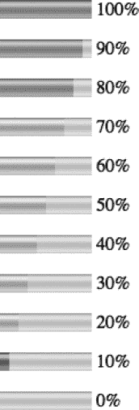

***图 4-27。**一个`meter`元素通过高低范围减少数值*

前面仪表的代码如下:

`

<meter min="0" low="20" high="80" optimum="90" max="100" value="100">Space left: </meter> 100%

<meter min="0" low="20" high="80" optimum="90" max="100" value="90">Space left: </meter> 90%` `

<meter min="0" low="20" high="80" optimum="90" max="100" value="80">Space left: </meter> 80%

<meter min="0" low="20" high="80" optimum="90" max="100" value="70">Space left: </meter> 70%

<meter min="0" low="20" high="80" optimum="90" max="100" value="60">Space left: </meter> 60%

<meter min="0" low="20" high="80" optimum="90" max="100" value="50">Space left: </meter> 50%

<meter min="0" low="20" high="80" optimum="90" max="100" value="40">Space left: </meter> 40%

<meter min="0" low="20" high="80" optimum="90" max="100" value="30">Space left: </meter> 30%

<meter min="0" low="20" high="80" optimum="90" max="100" value="20">Space left: </meter> 20%

<meter min="0" low="20" high="80" optimum="90" max="100" value="10">Space left: </meter> 10%

<meter min="0" low="20" high="80" optimum="90" max="100" value="0">Space left: </meter> 0%

`

注意，和`progress`元素一样，一些描述性的文本内容被放置在`meter`元素的标签之间。此内容将在不支持该元素的 web 浏览器中显示。

#### 显示计算的输出

`output`元素用于显示计算结果。它在很大程度上是一个语义元素，因为输出看起来像页面上的纯文本。

除了全局属性和`form`和`name`属性(前面已经讨论过了)，`output`元素还有一个属性:`for`。这个属性应该包含一个元素的 id 列表，这些元素将进入这个`output`元素正在显示的计算中:

`<input id="inputa" type="number"> +
<input id="inputb" type="number"> =
<output id="resultfld" name="result" for="inputa inputb"></output>`

典型的用例是显示脚本生成的计算结果。下面的脚本将在每次两个数字输入改变时更新`output`元素的值:

`var inputa;
var inputb;
var resultfld;
function init(){
     inputa = document.getElementById("inputa");
     inputb = document.getElementById("inputb");
     resultfld = document.getElementById("resultfld");
     inputa.oninput = updateResult;
     inputb.oninput = updateResult;
}
function updateResult(){
     resultfld.value = Number(inputa.value)+Number(inputb.value);
}
window.onload = init;`

#### 密钥生成器

`keygen`元素用于生成一个私有和公共密钥，其公共端在表单提交时被发送到服务器。元素本身看起来相当神秘，因为默认情况下它是一个数字下拉列表，仅此而已。这些数字是加密算法中使用的密钥的位数。数字越大，密钥越难破解。这个元素的预期用例是，服务器将生成一个证书并发送给客户机，以便在两者之间建立可信的安全通信。web 页面和 web 服务器之间加密通信的加密技术超出了本书的范围，除非您已经对加密技术有所了解，否则您不会使用这个元素。 [7](#CH-04-FN-7) 即使你对密码学有所了解，也不要过于依赖当前形式的这种元素。它很有可能在未来改变方向(毕竟 HTML 规范仍处于草案阶段)。例如，微软的代表已经声明他们无意支持`keygen` ( `keygen`最初是由 Internet Explorer 的竞争对手 Netscape 开发的，所以微软从不同的方向着手实现加密)。当前对元素进行标准化的方法使得所使用的实际算法是可选的，以便元素本身可以被支持(为了向后兼容)，但是加密组件可以被省略。微软是否在这些条款下实现该元素还有待观察。除非你别无选择，否则你最好暂时不要管`keygen`，直到尘埃落定。

这种的分歧导致了`video`元素中的视频编解码器没有标准化，正如你将在[第 5 章](5.html#ch5)中看到的，这意味着需要提供不止一个视频文件来兼容所有主流浏览器。

__________

IBM 出版了一本关于公钥加密的初级读本，你可能想看一看以熟悉其中的概念:【www.ibm.com/developerworks/web/library/s-pki.html】T2。

### 添加带有字段集和标签的结构

元素允许 web 作者将表单控件分成主题链接的部分，使用户更容易地处理表单，同时也增强了辅助设备的可访问性。大多数浏览器会显示一个带有简单边框的`fieldset`。例如，下面的标记显示了如图[图 4-28](#fig_4_28) 所示的结果:

`<fieldset>
     

     <select name="cheesemenu">
          <option>Cheddar</option>
          <option>Stilton</option>
          <option>Brie</option>
     </select>
     

     <button type="submit">Submit!</button>
     

</fieldset>` 

***图 4-28。**一个`fieldset`* 的通常渲染的例子

要识别每个`fieldset`，必须使用`legend`元素:

`<fieldset>
     <legend>Cheeses of the world</legend>
     

     <select name="cheesemenu">
          <option>Cheddar</option>
          <option>Stilton</option>
          <option>Brie</option>
     </select>
     

     <button type="submit">Submit!</button>  
     

</fieldset>`

该表单现在看起来类似于图 4-29 。

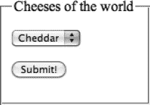

***图 4-29。**一个`fieldset`带一个`legend`带一个*

最后要提到的表单元素`label`，也增加了可用性和可访问性。该元素用于在文本标签和表单控件之间建立关联。当标签和表单控件相互关联时，可以单击其中任何一个来与控件进行交互。例如，与复选框相关联的标签意味着可以单击该标签，然后它会选择该复选框。有两种方法可以在标记中创建这样的可点击标签。第一种也是更好的方法是将表单控件包含在一个`label`中。这里有一个例子:

`<label>Favorite cheese: <input type="text" name="ch" /></label>`

在前面的例子中，单击标签中的“Favorite cheese:”文本会使嵌套的`input`获得焦点，在这种情况下，这意味着用户可以开始在文本字段中键入内容。另一个解决方案是使用`for`属性:

`<label for="favcheese">Favorite cheese: </label> <input type="text" id="favcheese" name="ch" />`

使用`for`属性的好处是表单控件不需要出现在`label`内部。属性`for`中的值是关联表单控件的 ID，这意味着两者是关联的，即使它们位于标记中不同的位置。这可能是有用的；然而，由于这种属性的手动配对，使用`for`属性可能会很费力。除非万不得已，否则我不建议使用它。一个用例是表单出现在表格中，标签出现在一列，表单控件出现在另一列。

 **注意**切记表格仅用于按行和列排列表格数据，不应用于布局；这包括使用一张桌子的唯一目的是美观地布置一个形式！为此，请改用 CSS。

### 把所有这些放在一起

还记得*市按*吗？上一章虚构的报纸网站？让我们看一下收集新闻提示的站点表单，这样我们就可以看到所有这些表单控件集合在一起。

#### 第 1 页，收集用户详细信息

该表格分为两页，第一页用于在网站上注册举报人，第二页用于记录他们的新举报。表单的首页看起来像[图 4-30](#fig_4_30) 。

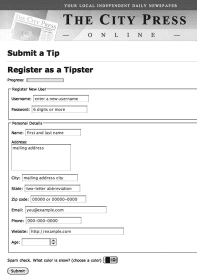

***图 4-30。**第一张表格在*市按*“提交小费”表格*

要创建这个表单，首先我们需要一个`form`元素。我们将设置两个属性:`action`，它将转到我们的第二个表单页面，以及`method`。我们需要哪种方法？GET 还是 POST？嗯，用户将提交数据，这些数据很可能最终会存储在数据库中，所以这是一个主动修改数据的提交。所以，我们用 POST。此外，如果表单上出现密码输入字段，这应该是使用 POST 的一个很大的提示，它确实出现了。好，这是我们的开始形式:

`<form action="form2.php" method="post">` `</form>`

接下来，虽然表单跨两个页面，但是有三个步骤来处理表单，因为在数据提交后会有一个确认页面，所以我们应该添加一个`progress`元素来显示:

`<form action="form2.php" method="post">
     
Progress: <progress value="0" max="2">1/3</progress>

</form>`

请注意，`value`属性被设置为零，`max`被设置为二，但是替代内容文本是“1/3”这是因为我们将有三个步骤要完成:第一个表单、第二个表单和第二个表单提交后的确认页面。因此可选文本将会是 1/3，2/3，3/3，而`value`属性将会是 0，1，2。

接下来，我们看到我们需要用户创建一个用户名和密码(假设在完成这个过程后，他们能够在其他地方登录)，我们可以将它们分成自己的字段集。图例用于向字段集添加标题，文本和密码输入字段设置为必填。此外，占位符文本也被添加到两者中。一个正则表达式模式被添加到密码字段，以便它只接受六个字符或更长的密码。

`…
<fieldset>
     <legend>Register New User</legend>
     
<label>Username: <input type="text" name="username" placeholder="enter a new username"
     required/></label>

     
<label>Password: <input type="password" name="password" placeholder="6 digits or more"
     pattern="^.{6,}" required/></label>

</fieldset>
…`

在此之下，我们为个人详细信息区域添加了另一个字段集。第一个字段是一个通用文本输入字段，用于收集举报人的姓名。添加占位符文本，提示要输入的信息的格式:

`…
<fieldset>
     <legend>Personal Details</legend>
     
<label>Name: <input type="text" name="name" placeholder="first and last name"
     /></label>

…`

姓名输入之后是一个文本区域，用于收集举报人的邮件地址，之后是单行文本输入，用于收集城市名称。对于地址输入，我们可以使用`label`的`for`属性在标签和文本区域之间放置一个换行符。在这种情况下不需要`for`属性，但是您可能会发现这是一种更干净的方法，因为它防止在`label`的标签中包含额外的 HTML 元素:

`…
     
<label for="address">Address:</label> 
     <textarea id="address" name="address" cols="20" rows="5" placeholder="mailing
     address"></textarea>

     
<label>City: <input type="text" name="city" placeholder="mailing address city"
     /></label>

…`

接下来是状态字段。这里的一个选项是使用`select`元素创建一个下拉列表，其中填充了所有 50 个州。当我们确信只有美国人才会填写这个表格时，这可能是最好的选择。但是，假设我们不确定用户一定来自美国。在这种情况下，另一种方法是有一个常规的文本输入字段，但将其属性设置为包含州名(或缩写)的数据列表。就在开始表单元素的下面，为此添加了一个新的`datalist`元素:

`<form action="form2.php" method="post">
<datalist id="statelist">
     <option value="AL" />
     <option value="AK" />
     <option value="AZ" />
     <option value="AR" />
     <option value="CA" />
     <option value="CO" />
     <option value="DE" />
…`

然后回到个人详细信息字段集，添加州的文本输入。还添加了邮政编码输入字段:

`…
     
<label>State: <input type="text" name="states" list="statelist" placeholder="two-
     letter abbreviation" /></label>

     
<label>Zip code: <input type="text" name="name"
     placeholder="00000 or 00000-0000" /></label>

…`

接下来是这个集合中唯一的必填字段，即电子邮件地址字段。占位符文本会提醒用户输入有效的电子邮件地址，但是表单的自动验证也会发现任何不一致之处:

`…
     
<label>Email: <input type="email" name="name" placeholder="you@example.com"
required/></label>

…`

接下来，添加可选的电话和网站输入字段:

`…
     
<label>Phone: <input type="tel" placeholder="000-000-0000" /></label>

     
<label>Website: <input type="url" placeholder="http://example.com" /></label>

…`

最后，在这个字段集中，可选的年龄字段被添加为数字输入字段。`min`和`max`属性被设置为真实的年龄范围，在上端有一些填充。结束 fieldset 标记结束该组:

`…
     
<label>Age: <input type="number" name="age" min="0" max="150" /></label>

</fieldset>`

接下来，一个必需的颜色选择器输入被用作对自动垃圾邮件机器人的简单检查，自动垃圾邮件机器人可能无法为“雪”选择正确的颜色。遗憾的是，`pattern`属性在`color`输入类型上不可用，所以这需要在服务器端用 JavaScript 进行检查。我们假设正在服务器上检查它:

`…
     
<label>Spam check. What color is snow? (choose a color)
     <input type="color" name="captcha" required/></label>

…`

最后，在结束的`form`标签之前添加一个提交按钮，完成这个表单:

`…
     <button type="submit" name="tipform1">Submit</button>
</form>`

#### 第 2 页，采集评论

在填写完表单并点击提交后，用户会在第二页上看到第二个表单，如图 4-31 所示。

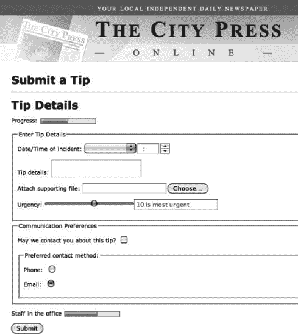

***图 4-31。**第二张表单上的城市按“提交小费”表单*

像第一个页面一样，`form`元素是用`action`和`method`属性创建的。此外，因为表单上有一个文件输入字段，所以我们将`enctype`属性设置为`multipart/form-data`，这样就可以发送二进制数据。接下来，添加一个`progress`元素，并在第一个表单上出现的元素的基础上递增:

`<form action="complete.php" method="post" enctype="multipart/form-data">
     
Progress: <progress value="1" max="2">2/3</progress>

</form>`

接下来，为提示详细信息区域创建一个字段集和图例。为新闻事件的当地日期和时间添加了日期/时间输入字段。一个`textarea`元素用于收集提示细节，一个文件输入用于允许在必要时附加一个支持文件:

`…
<fieldset>
     <legend>Enter Tip Details</legend>
     
<label>Date/Time of incident: <input type="datetime-local" /></label>

     
<label>Tip details: <textarea></textarea></label>

     
<label>Attach supporting file:  <input type="file" /></label>

…`

接下来，添加一个范围输入类型作为提示的“重要性”滑块。然后关闭该字段集。滑块旁边是一个只读文本输入栏，其中包含占位符文本，表示滑块上的值越大表示“越紧急”:

`…
     
<label>Urgency: <input type="range" name="range" id="range" min="1" max="10" /><input
id="rvalue" placeholder="more urgent" readonly /></label>
</fieldset>
…`

使用 JavaScript，我们将使只读文本输入中的值在滑块移动时动态更新。我们将设置占位符文本，以指示滑块上的高数字表示“最紧急”，并在移动滑块时将文本输入更新为滑块的值。JavaScript 被添加到文档头的`script`元素中:

`…

…`

 **注意**记住，在生产环境中，你可能希望将你的脚本转移到一个外部文件中，因为这样可以更好地组织你的标记和脚本。

为关于提示的“通信首选项”创建一个新的字段集。提供复选框来指示是否可以联系用户。如果是这样，那么另一个字段集嵌套在第一个字段集中，其中两个单选按钮允许用户选择他们喜欢的联系方式。默认选择“电子邮件”(带有`checked`属性):

`…
<fieldset>
     <legend>Communication Preferences</legend>
     
<label>May we contact you about this tip? <input type="checkbox" /></label>

     <fieldset>
          <legend>Preferred contact method:</legend>
          
<label> Phone: <input type="radio" name="contactpref" /></label>

          
<label> Email: <input type="radio" name="contactpref" checked /></label>

     </fieldset>
</fieldset>
…`

接下来，一个`meter`给出了该报目前人员配备情况的一些指标，10 个员工中有 6 个在办公室。我们不会推测这个度量工具更新的频率，但是在这里使用它是一个合适的元素，因为员工数量是一个已知的量。

最后，像最后一个表单一样，提交按钮出现在最后，表单关闭:

`…
     
<label>Staff in the office
     <meter min="0" value="6" low="2" optimal="9" high="8" max="10" >6/10</meter>
     </label>

     <button type="submit" name="tipform2">Submit</button>
</form>`

#### 第 3 页，提供确认

提交第二个表单会将用户带到确认页面，在这里,`progress`元素被更新到它的最终位置，并给出一条简短的感谢消息:

`<form>
     
Progress: <progress value="2" max="2">2/2</progress>

     
The tip was successfully received. Thank you!

</form>`

结果页面看起来像[图 4-32](#fig_4_32) 。

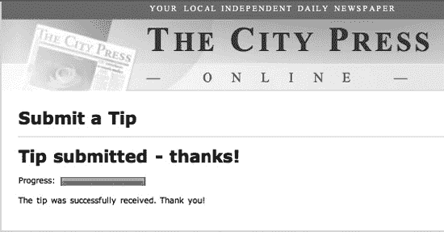

***图 4-32。**第三页也是最后一页致谢*

### 表单可用性

创建一个表单很容易，但是创建一个真正*好的*表单要难得多。 *City Press* 提示表单显示了创建简单表单时需要考虑的所有选项和输入变量。表单变得越复杂，就越像是一个应用而不是网页，所以你需要认真考虑可用性。即使是在城市媒体的提示表单中，也可以添加更多来使其更加有用。例如，可以将`title`属性添加到所有输入字段中，以便在用户将光标悬停在这些字段上时(或使用屏幕阅读器)提示这些字段所期望的内容。然而，事情比这更严重。如果你的表单处于公众开始给你钱的时候，你需要严格地测试你的表单，观察人们使用它并记录他们的反应(即使你的观众只是办公室另一边的几个同事)，并确保它尽可能地工作。

对表单可用性主题的详尽讨论已经超出了本书的范围，但是下面几节中概述的指南应该足以帮助你避免一些常见的表单可用性问题。除了这一章中的信息，我推荐你阅读史蒂夫·克鲁格的经典之作*不要让我思考:网站可用性的常识方法*(New Riders 出版社，2000)。

#### 将正确的输入用于正确的工作

因此，您知道所有的输入类型，但是在给定的情况下，哪种输入类型更合适呢？其中一些是显而易见的——`file`输入只有一个目的，没有其他类型的输入可以代替它——但是，例如，复选框和单选按钮呢？一个好的经验法则是，如果你有两个或更多选项的列表，用户*必须*选择一个而*只能*选择一个，使用单选按钮。选择一个单选按钮应该会取消选择属于同一命名组的任何其他单选按钮。但是如果列表包含许多选项，可以考虑使用一个`select`菜单。您将无法选择多个选项，并且您将节省一些空间(以“可发现性”为代价)。

另一方面，当有几个选择时，就使用复选框，用户可以把它们都留为空白，也可以选择任意多个。选中一个复选框不会取消选择该组中的任何其他复选框。与一系列复选框相对应的菜单是一个带有`multiple` 属性的`select`菜单，但是复选框通常更容易使用，因为它们不需要用户理解使用什么键盘/鼠标组合来选择/取消选择选项，所以您可能希望尽可能避免多选列表。

当只有一个用户可以打开或关闭的选项时，也应该使用复选框，比如同意订阅时事通讯。您不会在这里使用单选按钮，因为单选按钮只能通过选择另一个来取消选择。

还记得使用标签、字段集和图例来帮助提高可用性和可访问性。

#### 保持简洁明了

只收集你需要的信息，仅此而已。你真的需要知道我是先生还是女士吗？你真的需要我的传真号码吗？我的职业？我的年薪？质疑表单中每个字段的存在，如果是必填字段，再次质疑它是否需要。你的营销人员可能喜欢收集大量网站访问者的个人数据，但是你的表单越长，越多不相关的用户开始感觉到它，他们放弃它的风险就越高。

#### 不要让我思考，不要让我工作，也不要试图欺骗我

尽可能使您的表单易于完成。如果在任何时候，用户不得不暂停几秒钟，试图找出哪里出了问题，或者你的意思是什么，那么这几秒钟他可能只是想“哦，算了”，然后去做三明治。因此，例如，如果您的表单包含必填字段，请考虑将这些字段的样式设计得更突出(当然，还要添加`required`属性，这样表单验证就会生效)。从一开始就明确*必须*填写的字段。如果这是大多数字段，请考虑在可选字段旁边添加文本“可选”。

如果您需要某种格式的数据，不要依赖用户以这种格式输入数据——这是服务器上的表单处理程序应该处理的事情。例如，如果用户需要输入信用卡号码，如果她愿意，让她填写 1234 5678 9012 3456(这是她信用卡上的格式)，1234567890123456，或 1234-5678-9012-3456——在合理范围内对用户有效的任何数字。灵活使用`pattern`属性可以允许表单输入的灵活性，但仍然可以验证关键信息和基本格式(比如检查输入的数字是否正确)。记住，计算机应该为用户节省时间。如果你愿意，可以提供一个首选格式的指南，但也要考虑到备选条目的可能性。

如果用户*犯了一个服务器端代码无法解决的错误，那么用一个清晰、有意义、适当的错误消息让他知道——越快越好。使用内置的表单验证，并提供 JavaScript 和/或服务器生成的验证和错误消息作为备份。表单越复杂，出错的地方就越多，所以测试，测试，测试，确保没有无意义的错误信息。*

#### 请记住，互联网是全球性的

如果您的表单不针对任何一个国家，请尽量不要填写“州”和“邮政编码”，当然，如果您包含这些字段，也不要强制填写。同样与前一点相关的是，不要试图限制用户数据的格式，除非你完全确定它的格式。

 **注意**与表单国际化相关的一个即将出现的属性是`dirname`属性，它是在`textarea`、`text`输入和`search`输入元素上指定的。还记得表单数据是如何作为键/值对提交的吗？该属性创建一个发送到服务器的键，该键以输入到表单控件中的文本的方向性作为其值。这将显示为`ltr`(从左到右)或`rtl`(从右到左)。但是，不要指望这个属性今天还能工作，因为它还没有被主流浏览器实现。关于它的更多信息和代码示例可在`[http://dev.w3.org/html5/spec/common-input-element-attributes.html#attr-input-dirname](http://dev.w3.org/html5/spec/common-input-element-attributes.html#attr-input-dirname)`获得。

#### 需要时提供后备

本章中的很多内容都是新的，可能并不适用于所有的浏览器。幸运的是，当不支持特定的输入类型时，输入类型通常会退化为常规的文本字段。但是，如果您设计了 HTML5 规范中所有丰富的控件，但没有考虑它在旧浏览器中的外观，这仍然会对表单的可用性产生严重影响。调查像 Modernizr ( `[http://modernizr.com](http://modernizr.com)`)、jQueryUI ( `[http://jqueryui.com](http://jqueryui.com)`)和 webforms2 ( `[http://code.google.com/p/webforms2/](http://code.google.com/p/webforms2/)`)这样的项目，因为这些项目将帮助您将“polyfills”实现到您的站点中，这意味着它们(通过 JavaScript)提供了您期望在浏览器中本机可用的功能。

### 总结

创建表单相当容易——只需插入几个`input`标签，添加一点文本，点击最后的提交按钮，然后您就可以早点回家了——但是创建可用的、可访问的、符合逻辑的表单要困难得多。思考你的表单内容的意义。哪些原理图元素适合用作输入？这些都不是应该留到最后一刻的事情。你的表单可能是你的网站最重要的部分，特别是如果它是一个允许人们输入信用卡信息的表单，所以它应该是一个简单易用的模型。它不应该让人们心烦意乱，激怒他们，或者打消他们的念头——这么说似乎很奇怪，但我这辈子见过一些可怕的形式就是这样做的。最后，要准备好面对现实，为了创建最终可用的表单，您必须求助于 JavaScript 或服务器端代码(或者两者都用)来帮助您为用户提供现代 web 表单的预期特性。