# 二、HTML5 元素

虽然 HTML5 规范比以前的版本复杂得多，但像那些版本一样，它包括新元素的定义和旧元素的废弃。在这一章中，我将把重点放在 HTML5 规范的元素部分。

我将首先展示最佳实践是如何对 HTML 的发展做出贡献的。然后，我将介绍 HTML5 规范中包含的许多新标签:用于创建新部分、内容分组、语义标记、嵌入内容、新交互内容和表单的标签。我还将介绍 web 表单的新特性:新的表单属性、字段属性和输入类型。最后，我将介绍 HTML5 中已被否决的元素。

HTML 的功能、语义和演变

HTML5 代表了该语言进化路线的最新发展。在网络之初，这种演变主要是由浏览器制造商推动的，他们都想在网络上创建自己的专有空间，以区别于他们的竞争对手。不幸的是，这导致了现在被称为“浏览器战争”的网络分裂

第一个标准就是为了对抗这种分裂而诞生的。通过为所有的浏览器制造商提供一个共同的基础，他们使得开发者能够编写独立于平台的 HTML 代码。

更重要的是，随着标准的进一步发展，一组最佳实践也随之发展，以帮助开发人员利用符合标准的优势。这些实践中最重要的两个可能是功能和语义标记分离的概念。

**功能* 的分离决定了我们应该根据每个工具的长处来使用它们。它通常被总结为“表示与内容的分离”，但它比这更深入:使用 HTML 表示内容，使用 CSS 表示表示，使用 JavaScript 表示功能。*

 *将 HTML 从 CSS 和 JavaScript 中分离出来，允许这三种语言独立发展，也使得开发人员可以更容易地升级，甚至在以后完全改变技术，而不必完全重做所有三种语言的代码。

*语义* *标记* 的核心思想是使用正确的标签来标记由内容决定的给定部分或数据段。在某种程度上，这是功能分离的更深层次的应用:为工作使用正确的标签。因此段落应该用`<p>`标记，无序列表用`<ul>`，列表项用`<li>`等等。今天，这种最佳实践已经成为 web 开发人员的第二天性，但并不总是这样。常见的是，标签只用于默认样式提供的缩进或空白，这使得标记非常混乱。

这些最佳实践的问题是，除了在 Web 上构建简单的信息文档之外，它们几乎没有什么帮助。如果你想做复杂的布局，HTML 没有必要的语义。如果你想用 web 技术来构建功能，HTML 开始显示出它缺乏语义。

这种缺乏的一个主要症状是像`<div>`和`<span>`这样的无意义标签的泛滥。因为这些标签只表示节(`<div>`表示块级节，`<span>`表示内联节)，所以它们可以安全地用于包含任何内容。这种无意义的标签导致了新词“div-itis”的产生，或者更常见的“divitis”

HTML5 的主要目的之一就是解决这些缺点。HTML5 为文档的不同部分指定了几个新的标签，新的语义标签，以及用于提高交互性和扩展表单功能的标签。

部分

维持价

**好的**

所有主流浏览器都支持至少后两个版本的 section 元素。

WHATWG 生活水平:`http://www.whatwg.org/specs/web-apps/current-work/multipage/sections.html#sections`

W3C 候选人推荐:`http://www.w3.org/TR/html5/sections.html#sections`

HTML5 包括一组新标签，旨在解决以前版本的 HTML 中缺乏结构化标签的问题。标记即使是中等复杂程度的文档也暴露了原始 HTML 标记集中的几个弱点，这些弱点导致将无意义的标记用于许多常见目的，如导航部分、文档页眉和文档页脚。

新标签如下:

*   一篇文章是一个页面中一组完整、独立的内容。从概念上讲，一篇文章可以被分发或重用。有效文章的示例包括大型杂志中的一篇杂志文章、一篇博客文章、用户界面中可重用的小部件或任何其他自包含的内容集。
*   旁白是表示侧边栏的一种方式:一组独立于周围内容并与之相切的内容。例子包括引用、侧边栏，甚至是大文档中的广告部分。
*   导航部分是指向其他文章或其他文档的主要导航链接。它通常不用于次要链接的集合，例如经常被归入页脚的链接(在这种特定情况下，`<footer>`标记被认为在语义上是足够的)。
*   `<footer>`这个名副其实的标签代表了包含 section 元素的页脚(`<body>`、`<article>`等等)。).页脚通常包含有关包含节元素的信息，如版权信息、联系信息以及支持文档和站点地图的链接。
*   `<header>``<header>`标签将当前包含的 section 元素的一组介绍性标签(`<body>`、`<article>`等)组合在一起。).标题可以包含导航、搜索表单，甚至是文档的目录和内部链接。
*   标签用于将主题相似的内容组合在一起，通常带有某种标题。

在引入这些标签之前，这些部分通常是用相关 CSS 类的`<div>`标签标记的，如清单 2-1 中的[所示。](#list1)

***[清单 2-1](#_list1)*** 。带有无意义标签 0073 的旧标记

```html
<!DOCTYPE HTML>
<html>
  <head>
    <title>The HTML5 Programmer’s Reference</title>
    <style>
body {
  margin: 0;
  padding: 0;
}
.page {
  background-color: #C3DBE8;
}
.header {
  background-color: #DDDDDD;
}
.header li {
  display: inline-block;
  border: 1px solid black;
  border-radius: 5px;
  padding: 0 5px;
}
.footer {
  background-color: #DDDDDD;
}
    </style>
  </head>
  <body>
    <div class="page">
      <div class="header">
        <h1>Lorem Ipsum Dolor Sit Amet</h1>
        <div class="navigation">
          <ul>
            <li>one</li>
            <li>two</li>
            <li>three</li>
          </ul>
        </div>
      </div>
      <div class="section">
        <h2>Section Header</h2
        <p>Lorem ipsum dolor sit amet, consectetur adipiscing elit.
          Proin congue leo ut nut tincidunt, sed hendrerit justo
          tincidunt. Mauris vel dui luctus, blandit felis sit amet,
          mollis enim. Nam tristique cursus urna, id vestibulum
          tellus condimentum vulputate. Aenean ut lectus adipiscing,
          molestie nibh vitae, dictum mauris. Donec lacinia odio
          sit amet odio luctus, non ultrices dui rutrum. Cras
          volutpat tellus at dolor rutrum, non ornare nisi
          consectetur. Pellentesque sit amet urna convallis, auctor
          tortor pretium, dictum odio. Mauris aliquet odio vel
          congue fringilla. Mauris pellentesque egestas lorem.</p>
      </div>
      <div class="aside">
        <h2>Aside Header</h2>
        <p>Vivamus hendrerit nisl nec imperdiet bibendum. Nullam
          imperdiet turpis vitae tortor laoreet ultrices. Etiam
          vel dignissim orci, a faucibus dui. Pellentesque
          tincidunt neque sed sapien consequat dignissim.</p>
      </div>
      <div class="footer">
        <div class="address">
          Sisko’s Creole Kitchen, 127 Main Street,
          New Orleans LA 70112
        </div>
      </div>
    </div>
  </body>
</html>
```

[清单 2-1](#list1) 将你的内容分成一个单独的“页面”，包含在一个应用了类`"page"`的`<div>`标签中。在这个页面中，你有一个带有导航的页眉、一个部分、一个旁白和一个页脚。您还对标记应用了一些基本样式，以更好地说明页眉和页脚部分，并使导航元素看起来更像按钮，而不是简单的无序列表。

这是您可能已经习惯看到的那种标记，除了它在很大程度上依赖于无意义的`<div>`标签这一事实之外，它没有任何问题。然而，有了新的 HTML5 标签，你可以去掉所有的`<div>`标签，用语义标签代替它们，就像你在[清单 2-2](#list2) 中做的那样。

***[清单 2-2](#_list2)*** 。带有 HTML5 语义标签的新热点标记

```html
<!DOCTYPE HTML>
<html>
  <head>
    <title>The HTML5 Programmer’s Reference</title>
    <style>
body {
  margin: 0;
  padding: 0;
}
.page, article {
  background-color: #C3DBE8;
}
.header, header {
  background-color: #DDDDDD;
}
.header li, header li {
  display: inline-block;
  border: 1px solid black;
  border-radius: 5px;
  padding: 0 5px;
}
.footer, footer {
  background-color: #DDDDDD;
}
    </style>
  </head>
  <body>
    <article>
      <header>
        <h1>Lorem Ipsum Dolor Sit Amet</h1>
        <nav>
          <ul>
            <li>one</li>
            <li>two</li>
            <li>three</li>
          </ul>
        </nav>>
      </header>
      <section>
        <h2>Section Header</h2>
        <p>Lorem ipsum dolor sit amet, consectetur adipiscing elit.
          Proin congue leo ut nut tincidunt, sed hendrerit justo
          tincidunt. Mauris vel dui luctus, blandit felis sit amet,
          mollis enim. Nam tristique cursus urna, id vestibulum
          tellus condimentum vulputate. Aenean ut lectus adipiscing,
          molestie nibh vitae, dictum mauris. Donec lacinia odio
          sit amet odio luctus, non ultrices dui rutrum. Cras
          volutpat tellus at dolor rutrum, non ornare nisi
          consectetur. Pellentesque sit amet urna convallis, auctor
          tortor pretium, dictum odio. Mauris aliquet odio vel
          congue fringilla. Mauris pellentesque egestas lorem.</p>
      </section>
      <aside>
        <h2>Aside Header</h2>
        <p>Vivamus hendrerit nisl nec imperdiet bibendum. Nullam
          imperdiet turpis vitae tortor laoreet ultrices. Etiam
          vel dignissim orci, a faucibus dui. Pellentesque
          tincidunt neque sed sapien consequat dignissim.</p>
      </aside>
      <footer>
        <address>
          Sisko’s Creole Kitchen, 127 Main Street,
          New Orleans LA 70112
        </address>
      </footer>
    </article>
  </body>
</html>
```

您已经用相关的语义 HTML5 标签替换了所有无意义的 div。您还更新了样式表，因此新标签将与应用于您移除的`<div>`标签的旧类共享相同的样式。

浏览器对这两个例子的渲染略有不同。不同浏览器之间的区别是不同的:Internet Explorer 10 的变化最小，唯一的区别是包含在`<address>`标签中的文本自动以斜体显示。Chrome 和 Firefox 的差别更大，如图 2-1 中的[所示。](#Fig1)

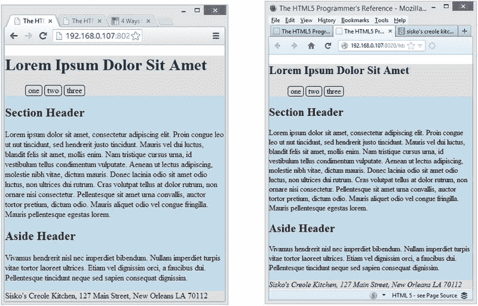

[图 2-1](#_Fig1) 。Chrome 渲染的[清单 2-1](#list1) 截图(左)和 Firefox 渲染的[清单 2-2](#list2) 截图(右)

正如你所看到的，在两种浏览器中，`<header>`标签中的`<h1>`标签的字体较小，而且它们都以斜体显示`<address>`标签中的文本，就像 Internet Explorer 一样。如果您正在迁移到新的语义标签，请确保考虑到这些差异。

分组

维持价

**好的**

所有主流浏览器至少支持最近两个版本的`<figure>`和`<figcaption>`特性。Internet Explorer 本身不支持`<main>`标签，但其他浏览器支持。

WHATWG 生活水平:`http://www.whatwg.org/specs/web-apps/current-work/multipage/grouping-content.html#grouping-content`

W3C 候选人推荐:`http://www.w3.org/TR/html5/grouping-content.html#grouping-content`

HTML5 为分组内容定义了一些新标签。这些标签与 HTML5 Section 标签的不同之处在于，它们将给定的一组数据定义为特定类型的数据，而 Section 标签为文档提供结构。新标签如下:

*   `<figure>`该标签用于将一组独立于主文档流的内容组合在一起，但从文档流内部引用。图形的例子包括插图、屏幕截图和代码片段。
*   `<figcaption>`该标签用于为`<figure>`标签提供标题。标题是可选的。
*   在 W3C 和 WHATWG 规范中,`<main>`标签的定义是不同的。根据 W3C 的规定,`<main>`标签应该用来将文档或应用程序中与主题或功能相关的主要内容组合在一起。根据 WHATWG 的说法，`<main>`标签没有内在含义，而是代表其内容。W3C 的 bugbase: `https://www.w3.org/Bugs/Public/show_bug.cgi?id=21553`中的 Bug 21553 详细解释了这种差异的原因。

新的分组标签使用起来很简单，如清单 2-3 所示。

***[清单 2-3](#_list3)*** 。使用新的 HTML5 分组标签

```html
<!DOCTYPE HTML>
<html>
  <head>
    <title>The HTML5 Programmer’s Reference</title>
    <style>
figure figcaption {
  font-style: italic;
}

figure pre {
  line-height: 1.6em;
  font-size: 11px;
  padding: 1em 0.5em 0.0em 0.9em;
  border: 1px solid #bebab0;
  border-left: 11px solid #ccc;
  margin: 0.3 0 1.7em 0.3em;
  overflow: auto;
  max-height: 500px;
  position: relative;
  background: #faf8f0;
}
    </style>
  </head>
  <body>
    <main>
      <article>
        <h1>Main, Figure and Figcaption</h1>
        <h2>Best Things Ever</h2>
        <p>Vivamus hendrerit nisl nec imperdiet bibendum. Nullam
          imperdiet turpis vitae tortor laoreet ultrices. Etiam
          vel dignissim orci, a faucibus dui. Pellentesque
          tincidunt neque sed sapien consequat dignissim.</p>
          <figure>
            <figcaption>Using Figure and Figcaption for Code Samples</figcaption>
            <pre>
[sample code here]
            </pre>
          </figure>
          <p>More content about Main, Figure and Figcaption...</p>
      </article>
    </main>
  </body>
</html>
```

这个示例使用`<main>`来表示示例文档的主要部分，使用`<figure>`和`<figcaption>`来定义代码示例区域。你还在代码区域及其标题上应用了一些简单的 CSS 样式，使其从文档的其余部分中更加突出，如图 2-2 所示。

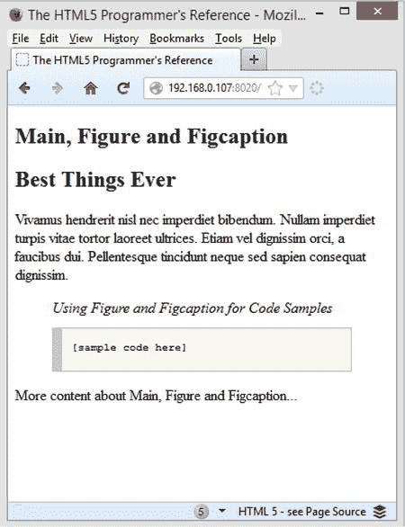

[图 2-2](#_Fig2) 。火狐渲染的[清单 2-3](#list3) 截图

在这个截图中，你可以看到浏览器对`<figure>`标签应用了一些默认的边距，这在不同的浏览器中是相当一致的。

语义学

维持价

**混合**

任何浏览器都很少支持`<bdi>`、`<data>`、`<ruby>`、`<rt>`、`<rp>`或`<time>`。

对`<mark>`的支持很好(至少可以追溯到主流浏览器的两个版本),对`<wbr>`的支持非常好(可以追溯到主流浏览器的最早版本)。

WHATWG 生活水平:`http://www.whatwg.org/specs/web-apps/current-work/multipage/text-level-semantics.html#text-level-semantics`

W3C 候选人推荐:`http://www.w3.org/TR/html5/text-level-semantics.html#text-level-semantics`

HTML5 包括几个新的语义标签，旨在帮助澄清内容类型。

*   `<bdi>`双向隔离元素用于隔离可能以不同于周围文本的方向呈现的文本的行内范围。
*   `<data>``<data>`标签用于将机器可读数据与其包含的内容相关联。它提供了用数据 002E 标注内容的语义方式
*   此标签用于标记文档中的事件，如搜索结果。
*   `<ruby>`、`<rp>`和`<rt>`这些标签用于拼音注释，用于显示东亚字符的发音。有关红宝石注释的详细信息，请参见`http://www.w3.org/TR/ruby/`和 `http://en.wikipedia.org/wiki/Ruby_character`。
*   `<time>``<time>`标签与`<data>`相似，它提供了一种将数据(在本例中，具体是日期/时间数据)与所包含的内容相关联的方法。
*   `<wbr>`断字机会标签用于指示文档流中的一个位置，在该位置浏览器可以启动一个换行符，尽管其内部规则可能不会这样做。它对双向排序没有影响，如果浏览器确实在标签处开始换行，则不使用连字符。

不幸的是，对这些标签的支持相当少。`<data>`和`<time>`标签，以及 Ruby 注释标签，即使在最现代的浏览器中也没有得到广泛的支持。

然而,`<mark>`标签得到了很好的支持，并且和其他内联标签一样易于使用。[清单 2-4](#list4) 显示了一个非常简单的使用`<mark>`标记来突出显示文档中的某些单词。

***[清单 2-4](#_list4)*** 。在文档中标记单词

```html
<!DOCTYPE HTML>
<html>
  <head>
    <title>The HTML5 Programmer’s Reference</title>
    <style>
mark {
  background-color: #E3DA5D;
}
    </style>
  </head>
  <body>
    <article>
      <h1>Using the &lt;mark&gt; tag</h1>
      <p>Vivamus hendrerit nisl nec imperdiet <mark>bibendum</mark>. Nullam
        imperdiet turpis vitae tortor laoreet ultrices. Etiam
        vel dignissim orci, a faucibus dui. Pellentesque
        tincidunt <mark>neque</mark> sed sapien consequat dignissim.</p>
    </article>
  </body>
</html>
```

本例在所有浏览器中呈现相同的效果([图 2-3](#Fig3) )。

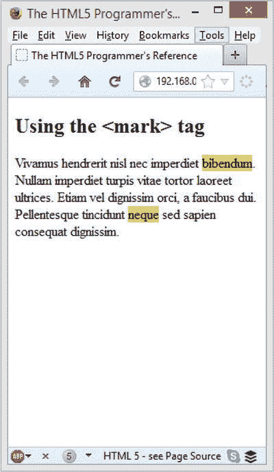

[图 2-3](#_Fig3) 。火狐渲染的[清单 2-4](#list4) 截图

`<wbr>`标签可能是所有 HTML5 标签中支持最广泛的标签之一。这是一个在所有浏览器中都可用的非标准标签，它是由 HTML5 引入标准的。它用于在长词中提供断词建议，这在特定情况下很有用。[清单 2-5](#list5) 显示了一个简单的例子，在插入`<wbr>`标签之前有很长的单词:

***[清单 2-5](#_list5)*** 。文档中的长单词

```html
<!DOCTYPE HTML>
<html>
  <head>
    <title>The HTML5 Programmer’s Reference</title>
    <style>
.larger {
  font-size: 2em;
}
    </style>
  </head>
  <body>
    <article>
      <h1>Using the &lt;wbr&gt; tag</h1>
      <p>Here are some long words in a slightly larger font size to demonstrate
        how useful the &lt;wbr&gt; tag can be.</p>
      <p class="larger">Supercalifragilisticexpialidocious and antidisestablishmentarianism,
        also pneumonoultramicroscopicsilicovolcanoconiosis.</p>
    </article>
  </body>
</html>
```

如[图 2-4](#Fig4) 所示，[清单 2-5](#list5) 在所有现代浏览器中呈现出你所期望的效果。

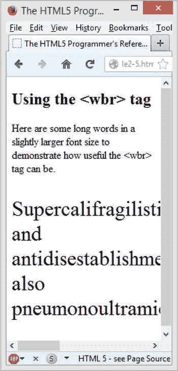

[图 2-4](#_Fig4) 。Firefox 中[清单 2-5](#list5) 的渲染

你可以很容易地使用一些`<wbr>`标签来帮助浏览器决定在哪里打断那些长单词，如清单 2-6 中的[所示。](#list6)

***[清单 2-6](#_list6)*** 。建议在大词中换行

```html
<!DOCTYPE HTML>
<html>
  <head>
    <title>The HTML5 Programmer’s Reference</title>
    <style>
.larger {
  font-size: 2em;
}
    </style>
  </head>
  <body>
    <article>
      <h1>Using the &lt;wbr&gt; tag</h1>
      <p>Here are some long words in a slightly larger font size to demonstrate
        how useful the &lt;wbr&gt; tag can be.</p>
      <p class="larger">Supercali<wbr>fragilistic<wbr>expialidocious and
        antidis<wbr>establishment<wbr>arianism.</p>
    </article>
  </body>
</html>
```

如果需要的话，浏览器可以根据我们的建议断词([图 2-5](#Fig5) )。


[图 2-5](#_Fig5) 。在不同的浏览器宽度下渲染[清单 2-6](#list6)

如你所见，如果需要的话，浏览器现在可以使用我们的断词建议。如果您在屏幕空间非常宝贵的狭窄布局上工作，例如在移动设备上，这可能特别有用。

音频和视频内容

维持价

**好的**

所有现代浏览器都支持至少后两个版本的音频和视频元素，但请参阅以下有关格式支持的信息。

WHATWG 生活水平:`http://www.whatwg.org/specs/web-apps/current-work/multipage/edits.html#embedded-content`

W3C 候选人推荐:`www.w3.org/TR/html5/embedded-content-0.html#embedded-content-0`

以前版本的 HTML 最大的缺点之一是它们不能方便地在网页上包含多媒体内容。HTML5 有专门解决这个问题的新标签。有了这些新标签，在网页上包含多媒体内容就像包含静态图像一样简单。更好的是，所有现代浏览器都非常好地支持这些功能。

在 HTML5 之前，如果你想在网页中嵌入一个视频，你需要一个第三方插件，它能够播放你想要的内容，还能调节音量、快进或快退内容等等。通过 HTML5，浏览器制造商已经将这些功能内置到他们的软件中。这些功能包括控制回放的用户界面和播放各种音频和视频编码媒体格式的能力。

一个不幸的复杂情况是，音频和视频都可以用许多不同的格式编码，而这些格式中的许多都有专利障碍，使得浏览器制造商不愿意支持它们。因此，尽管所有现代浏览器都支持多媒体标签，但有些浏览器支持的格式与其他浏览器不同。有关何种浏览器支持何种格式的详细信息，请参见第 7 章。

另一个复杂因素来自与多媒体的互动。例如，用户经常想要跳过内容，根据需要前进或后退。支持这样的交互功能需要服务器能够对这些用户交互做出反应，并根据需要提供部分内容。简单的 web 服务器通常没有这种能力，尽管它们中的许多可以配置成这样。有关配置多媒体服务器的更多信息，请参见第 7 章。

嵌入的音频内容

有了 HTML5 `<audio>`标签，你可以将音频内容嵌入到你的网页中，就像包含图像一样简单。像任何 HTML 标签一样，`<audio>`标签有几个可以设置的属性:

*   `autoplay`:这是一个布尔标志，当设置为(任何值，甚至`false`)时，将使浏览器立即开始播放音频内容，而不需要停下来进行缓冲。
*   `controls`:如果设置了此属性，浏览器将显示音频播放器的默认用户界面控件(音量控件、进度条/滑动条等)。).
*   `loop`:如果设置了该属性，浏览器将循环播放指定文件。
*   `muted`:该属性指定默认静音播放。
*   `preload`:该属性用于向浏览器提供如何为指定内容提供最佳用户体验的提示。可以取三个值:`none`、`metadata`和`auto`。`none`值指定作者想要最小化音频内容的下载，可能因为内容是可选的，或者因为服务器资源是有限的。`metadata`值指定作者推荐下载音频内容的元数据(持续时间、曲目列表、标签等。)和可能的前几帧内容。`auto`值指定浏览器可以把用户的需求放在第一位，而不会给服务器带来风险。这意味着浏览器可以开始缓冲内容、下载所有元数据等等。请注意，这些值可以在页面加载后更改。例如，如果您有一个包含许多`<audio>`标签的页面，每个标签的`preload`都被设置为`none`以防止淹没服务器，当用户选择他们想要听到的`<audio>`标签时，您可以动态地将其`preload`值更改为`auto`以提供更好的用户体验。这使您能够平衡用户体验和可用资源。
*   `src`:这个属性指定内容的来源，就像一个``标签一样。如果需要的话，可以省略这个属性，而在`<audio>`标签中包含一个或多个`<source>`标签。

`<audio>`标签不是自动关闭的，因此需要一个关闭标签。请注意，由于较旧的浏览器不支持`<audio>`标记，因此包含在其中的任何内容都将在这些浏览器中显示，从而提供了一种在较旧的浏览器中提供替代内容的向后兼容方式。

音频标签非常容易使用，如[清单 2-7](#list7) 所示。

***[清单 2-7](#_list7)*** 。在网页中嵌入音频内容

```html
<!DOCTYPE HTML>
<html>
  <head>
    <title>The HTML5 Programmer’s Reference</title>
  </head>
  <body>
    <article>
      <h1>Using the &lt;audio&gt; tag</h1>
      <audio controls="controls" src="../media/windows-rolled-down.mp3">
      </audio>
    </article>
  </body>
</html>
```

 **注意**本节的例子使用音频文件。您应该根据需要替换您自己的文件。

清单 2-7 选择显示本地玩家的控件来演示它们默认的样子。每个浏览器的原生播放器看起来略有不同，功能也略有不同([图 2-6](#Fig6) )。

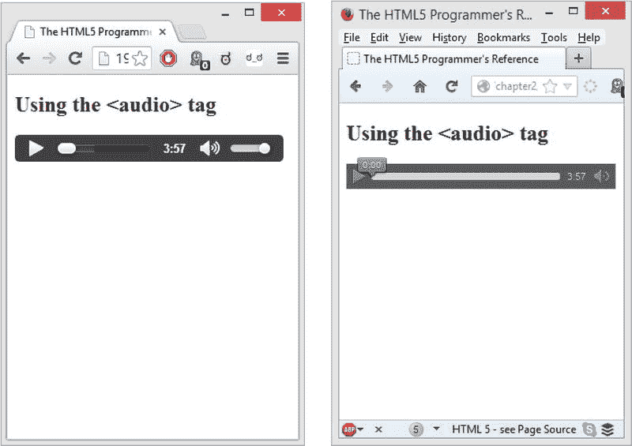

[图 2-6](#_Fig6) 。[清单 2-7](#list7) 以 Chrome(左)和 Firefox(右)呈现

Chrome 的默认音频播放器有一个音量滑块，而 Firefox 的播放器有一个指示当前播放时间的工具提示。设计播放器的样式是不可能的，所以如果你想在所有浏览器上有一致的外观和感觉，你必须构建自己的播放器——这实际上很容易做到，因为 HTML5 还指定了一个 JavaScript API 来处理`<audio>`标签。有关该 API 的详细信息，请参见第 7 章。

 **提示**在 Chrome 中，音频和视频播放器被实现为使用新的 Shadow DOM 规范的 web 组件。使用 Shadow DOM API可以直接访问播放器的组件并设置样式。例如，播放器的背景是一个阴影`<div>`，它可以用 CSS 选择器`audio::-webkit-media-controls-panel`选择，并且它的外观(例如背景颜色)可以根据需要改变。同样，音量条是一个带有选择器`audio::-webkit-media-controls-volume-slider`的`<input type="range">`标签。不幸的是，在撰写本文时，Chrome 和 Opera 是仅有的两种支持影子 DOM 规范的浏览器。其他浏览器也可能使用 Shadow DOM 实现其播放器，当它们完全支持该规范时，它们的播放器也可能变得可访问，从而允许 web 开发人员控制播放器的外观，而不必从头开始构建自己的播放器。

嵌入式视频内容

HTML5 `<video>`标签支持浏览器中的基本视频功能。它的功能类似于`<audio>`标签，并且有一组类似的可以设置的属性:

*   `autoplay`:这是一个布尔标志，当它被设置(设置为任何值，甚至是`false`)时，将使浏览器立即开始播放视频内容，而不需要停下来进行缓冲。
*   `controls`:如果设置了该属性，浏览器将显示视频播放器的默认用户界面控件(音量控件、进度条/滑动条等)。).
*   `height`:该属性可用于指定视频播放器的高度，以像素为单位。
*   `loop`:如果设置了该属性，浏览器将循环播放指定文件。
*   `muted`:该属性指定默认静音播放。
*   `poster`:该属性可用于指定视频播放前海报显示的 URL。如果没有指定海报，那么一旦加载，播放器将默认显示视频的第一帧。
*   `preload`:该属性用于给浏览器提供一个提示，如何为指定的内容提供最佳的用户体验。可以取三个值:`none`、`metadata`和`auto`。`none`值指定作者希望最小化视频内容的下载，可能是因为内容是可选的，或者是因为服务器资源有限。`metadata`值指定作者推荐下载视频内容的元数据(持续时间、曲目列表、标签等。)和可能的前几帧内容。`auto`值指定浏览器可以把用户的需求放在第一位，而不会给服务器带来风险。这意味着浏览器可以开始缓冲内容、下载所有元数据等等。请注意，这些值可以在页面加载后更改。例如，如果您有一个包含许多`<video>`标签的页面，每个标签都将`preload`设置为`none`以防止淹没服务器，当用户选择他们想要查看的`<video>`标签时，您可以动态地将其`preload`值更改为`auto`以提供更好的用户体验。这使您能够平衡用户体验和可用资源。
*   `src`:这个属性指定内容的来源，就像一个``标签一样。如果需要的话，可以省略这个属性，而在`<video>`标签中包含一个或多个`<source>`标签。
*   `width`:该属性可用于指定视频播放器的宽度，以像素为单位。

标签`<video>`和标签`<audio>`一样容易使用，如[清单 2-8](#list8) 所示。

***[清单 2-8](#_list8)*** 。在网页中嵌入视频内容

```html
<!DOCTYPE html>
<html>
  <head>
    <title>The HTML5 Programmer’s Reference</title>
  </head>
  <body>
    <article>
      <h1>Using the &lt;video&gt; tag</h1>
      <video controls="controls" src="../media/podcast.m4v">
      </video>
    </article>
  </body>
</html>
```

 **注意**本节的例子使用的是视频文件。您应该根据需要替换您自己的文件。

和`<audio>`标签一样，每个浏览器提供了稍微不同的视频播放器，如图 2-7 中的[所示。](#Fig7)

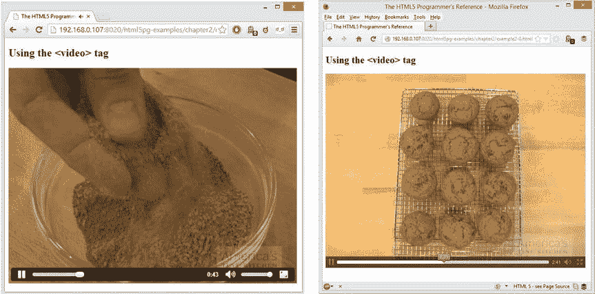

[图 2-7](#_Fig7) 。[清单 2-8](#list8) 以 Chrome(左)和 Firefox(右)呈现

和以前一样，这两种浏览器的视频播放器界面略有不同。如果你想改变播放器的外观和它的控制，你必须自己构建。

指定多个来源

`<audio>`和`<video>`标签都有一个 `src`属性，但是您可以放弃该属性，在`<audio>`或`<video>`标签中包含一个或多个`<source>`标签。您甚至可以为同一个文件指定不同的编码，从而避开浏览器在编码支持方面的任何限制。浏览器将沿着`<source>`标签列表向下，并播放它支持的第一个文件。

`<source>`标签有两个属性:

*   `src`:音频文件的 URL。
*   `type`:音频文件的 MIME 类型，带有可选的编解码器参数，根据 RFC 4281 指定。

举个例子，假设你有一个我们想要提供的视频。你有两种不同的格式:Ogg Vorbis 和 MP4。使用两个`<source>`标签，如清单 2-9 中的[所示。](#list9)

***[清单 2-9](#_list9)*** 。为多媒体指定多个源

```html
<video controls>
  <source src="../media/video-1.mp4" type="video/mp4">
  <source src="../media/video-1.ogv" type="video/ogg">
</video>
```

通过使用“类型”属性中的可选编解码器参数，您可以非常精确地了解音频和视频的编码。例如，如果你有一个 H.264 视频(profile 3)和低复杂度的 AAC 音频都包含在一个 MP4 容器中，你可以指定如清单 2-10 所示的编解码器:

***[清单 2-10](#_list10)*** 。为视频源指定音频和视频编解码器

```html
<source src="../media/video-1.mp4" type="video/mp4, codecs=’ avc1.4D401E, mp4a.40.2’">
```

这对于为您的视频提供尽可能高质量的编码，同时允许大多数浏览器访问它，而不管编码支持限制，特别有用。

互动元素

维持价

**不支持**

除了实验版本，现代浏览器不支持交互元素。

WHATWG 生活水平:`http://www.whatwg.org/specs/web-apps/current-work/multipage/interactive-elements.html#interactive-elements`

W3C 候选人推荐:`http://www.w3.org/TR/html5/interactive-elements.html`

HTML5 包括一组新的交互式元素，旨在提供一些可以在网页和应用程序中使用的预构建用户界面元素。不幸的是，大多数浏览器还不支持这些特性，但是随着时间的推移，支持程度可能会提高。

对话

最令人兴奋的新特性之一是`<dialog>`标签，它提供了轻松创建弹出对话框的能力。包含在`<dialog>`标签中的任何内容都不会呈现在文档中，直到您调用其显示方法之一:

*   `show`:调用这个方法将打开一个标准的弹出对话框。
*   `showModal`:调用这个方法将打开一个模态对话框，对话框后面的页面是灰色的。

此外，每个对话框在关闭时都会调度一个`close`事件。

清单 2-11 是一个简单的例子，演示了如何使用`<dialog>`标签。在撰写本文时，唯一支持`<dialog>`标签的浏览器是 Chrome，即使这样，你也必须在`chrome://flags`中激活实验性的网络平台功能。如果您启用了这些特性，这个例子将会运行得很好。

***[清单 2-11](#_list11)*** 。网络对话

```html
<!DOCTYPE HTML>
<html>
  <head>
    <title>The HTML5 Programmer’s Reference</title>
    <style>
li {
  display: inline-block;
  background-color: #A9DCF5;
  border-radius: 4px;
  padding: 2px 10px;
  cursor: pointer;
}
    </style>
  </head>
  <body>
    <article>
      <h1>Using the &lt;dialog&gt; tag</h1>
      <ul>
        <li id="open-dialog">Open Dialog</li>
        <li id="open-modal">Open Modal</li>
      </ul>
      <dialog id="dialog">
        <p>Hello World!</p>
        <button id="close-dialog">Okay</button>
      </dialog>
    </article>
    <script>
var myDialog = document.getElementById(’dialog’),
    openDialog = document.getElementById(’open-dialog’),
    openModal = document.getElementById(’open-modal’),
    closeDialog = document.getElementById(’close-dialog’),
    status = document.getElementById(’status’);

closeDialog.addEventListener(’click’, function(event) {
  myDialog.close();
}, false);

openDialog.addEventListener(’click’, function(event) {
  myDialog.show();
}, false);

openModal.addEventListener(’click’, function(event) {
  myDialog.showModal();
}, false);

myDialog.addEventListener(’close’, function(event) {
  alert(’A close event was dispatched.’);
}, false);
    </script>
  </body>
</html>
```

这将呈现一个非常简单的对话框，如图 2-8 所示。


[图 2-8](#_Fig8) 。[清单 2-11](#list11) 产生的对话框

每当您关闭其中一个对话框时，close 事件将被触发，产生一个警告，内容为“close 事件已被调度”

这是对话框的默认外观。可以很容易地用 CSS 对它们进行样式化，使它们更有吸引力，当然它们可以包含任何内容，包括图像、表单域等等。您还可以为模式实例设置背景样式；它是一个伪元素，可以使用对话框选择器上的`::backdrop`来访问。

例如，在[清单 2-12](#list12) 中，如果你在你的样式表中添加几个简单的 CSS 指令，你会有一个更吸引人的对话框。

***[清单 2-12](#_list12)*** 。网络对话框的 CSS 样式

```html
dialog {
  text-align: center;
  padding: 1.5em;
  margin: 1em auto;
  border: 0;
  border-radius: 8px;
  box-shadow: 0 2px 10px #111;
}

dialog::backdrop {
  background-color: rgba(187, 217, 242, 0.8);
}
```

这些样式将改变对话框和模态背景的外观(图 2-9 )。

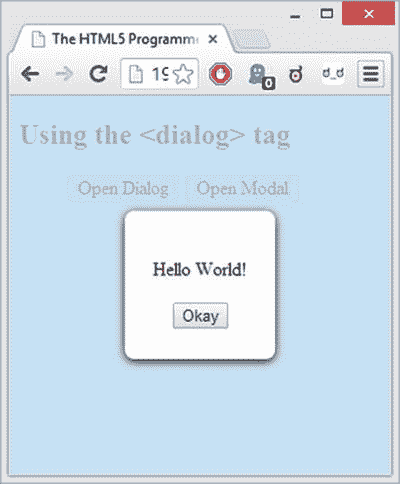

[图 2-9](#_Fig9) 。应用 CSS 样式的 Web 对话框(模式状态)

虽然目前只有 Chrome 支持`<dialog>`标签，但是在`https://github.com/GoogleChrome/dialog-polyfill`有一个 polyfill 可以提供其他浏览器中的大部分功能。

 **提示** *Polyfill* 是一个术语，指在浏览器中启用或复制不支持的功能的库。polyfill 的另一个术语是*垫片*。

逐步解密

一个常见的 UI 特性是*渐进式披露*:你提供一个简单的条目列表，当用户点击一个条目时，下面的空间就会展开，显示更多的信息。这些小部件根据使用的框架有不同的名称(例如，jQuery UI 将它们称为 *accordions* )。HTML5 使用`<summary>`和`<details>`标签包含了这个特性的定义。`<details>`标签包含了所有需要的内容，包括一个`<summary>`标签，它应该只包含内容的简短摘要。一个`<details>`标签的默认呈现是只显示前面有一个小三角形的`<summary>`标签的内容。然后，用户可以点击摘要上的任何地方，其余的内容就会显示出来。您可以通过赋予给定的`<details>`标签 open 属性来指定该标签在打开状态下呈现。

目前，Chrome、Opera 和 Safari 是唯一支持`<details>`和`<summary>`标签的浏览器。火狐将会支持这些标签，你可以在`https://bugzilla.mozilla.org/show_bug.cgi?id=591737`的 bug 591737 中查看它们的支持状态。Internet Explorer 中的支持状态未知。

标签使用起来很简单，如清单 2-13 所示。

***[清单 2-13](#_list13)*** 。逐步解密

```html
<!DOCTYPE HTML>
<html>
  <head>
    <title>The HTML5 Programmer’s Reference</title>
  </head>
  <body>
    <article>
      <h1>Using the &lt;summary&gt; and &lt;details&gt; tags</h1>
      <details>
        <summary>Item 1</summary>
        <p>Lorem ipsum dolor sit amet, consectetur adipiscing elit. Phasellus
          accumsan orci nec justo rhoncus facilisis. Integer pellentesque
          ipsum vitae semper lacinia. Quisque non nisl rutrum, porta est at,
          ultrices neque. Aenean consequat, lacus vulputate vestibulum
          faucibus, turpis magna mollis quam, a congue neque lorem at
          justo.</p>
      </details>
      <details>
        <summary>Item 2</summary>
        <p>Lorem ipsum dolor sit amet, consectetur adipiscing elit. Phasellus
          accumsan orci nec justo rhoncus facilisis. Integer pellentesque
          ipsum vitae semper lacinia. Quisque non nisl rutrum, porta est at,
          ultrices neque. Aenean consequat, lacus vulputate vestibulum
          faucibus, turpis magna mollis quam, a congue neque lorem at
          justo.</p>
      </details>
      <details open>
        <summary>Item 3--this one will be open by default</summary>
        <p>Lorem ipsum dolor sit amet, consectetur adipiscing elit. Phasellus
          accumsan orci nec justo rhoncus facilisis. Integer pellentesque
          ipsum vitae semper lacinia. Quisque non nisl rutrum, porta est at,
          ultrices neque. Aenean consequat, lacus vulputate vestibulum
          faucibus, turpis magna mollis quam, a congue neque lorem at
          justo.</p>
      </details>
      <details>
        <summary>Item 3</summary>
        <p>Lorem ipsum dolor sit amet, consectetur adipiscing elit. Phasellus
          accumsan orci nec justo rhoncus facilisis. Integer pellentesque
          ipsum vitae semper lacinia. Quisque non nisl rutrum, porta est at,
          ultrices neque. Aenean consequat, lacus vulputate vestibulum
          faucibus, turpis magna mollis quam, a congue neque lorem at
          justo.</p>
      </details>
    </article>
  </body>
</html>
```

在 Chrome 中，这个例子渲染得很好，如图 2-10 所示。

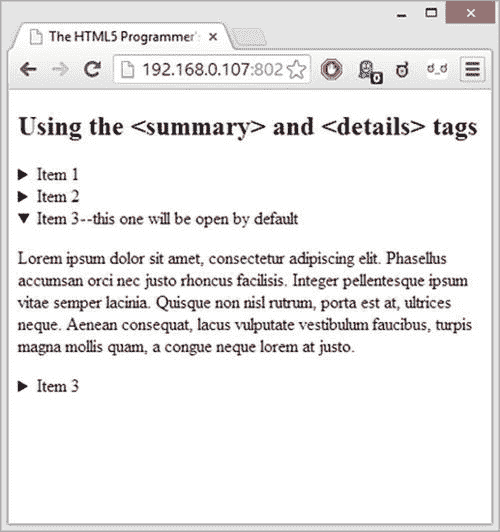

[图 2-10](#_Fig10) 。[清单 2-13 用 Chrome 渲染的](#list13)

单击关闭的项目会显示其隐藏的内容，单击打开的项目会隐藏其内容。

形式

表单在 HTML5 中得到了显著的改进。该规范包括表单的新标签(如数据列表、进度表和日期选择器)以及现有表单标签的新属性。这些新功能旨在使表单对用户更具交互性，并且更易于构建和维护。

新表单元素

维持价

**混合**

最近两个版本的主流浏览器都很好地支持这些特性。然而，Internet Explorer 不支持`<meter>`标签。

WHATWG 生活水平:`http://www.whatwg.org/specs/web-apps/current-work/multipage/forms.html#forms`

W3C 候选人推荐:`http://www.w3.org/TR/html5/forms.html#forms`

HTML5 有一些新的表单元素，它们是专门为实现过去几年发展起来的通用用户界面模式而设计的。具体来说，这些新标签实现了自动完成功能和进度条。

数据列表

第一个新标记实现了一个常见的自动完成功能:当您开始在表单域中键入内容时，会出现一个下拉列表，其中包含与已经键入的内容相匹配的选项。随着您继续键入，列表会变得更加具体，并且您可以随时使用箭头键来选择其中一个选项。这种自动完成字段通常被称为*数据列表*(有时也称为*组合框*)，HTML5 有一个新的`<datalist>`标签来实现这个用户界面元素。

实际上，`<datalist>`标签包含`<option>`标签，数据列表中的每一项都有一个标签。`<datalist>`元素本身不在页面中呈现，可以出现在文档结构中的任何地方。创建后，数据列表必须与输入字段相关联才能使用。给`<datalist>`标签一个唯一的`id`属性。要将其与一个`<input>`元素相关联，将该元素的 list 属性设置为惟一的`id`。这告诉浏览器使用`<input>`元素呈现指定的数据列表，如[清单 2-14](#list14) 所示。

***[清单 2-14](#_list14)*** 。数据列表

```html
<!DOCTYPE html>
<html>
  <head>
    <title>The HTML5 Programmer’s Reference</title>
  </head>
  <body>
    <!-- Note the datalist can be anywhere -->
    <datalist id="browsers">
      <option value="Chrome">
      <option value="Firefox">
      <option value="Internet Explorer">
      <option value="Opera">
      <option value="Safari">
    </datalist>
    <article>
      <h1>Using the &lt;datalist&gt; tag</h1>
      <input list="browsers" />
    </article>
  </body>
</html>
```

与其他 HTML5 用户界面元素一样，每个浏览器呈现的数据列表略有不同([图 2-11](#Fig11) )。

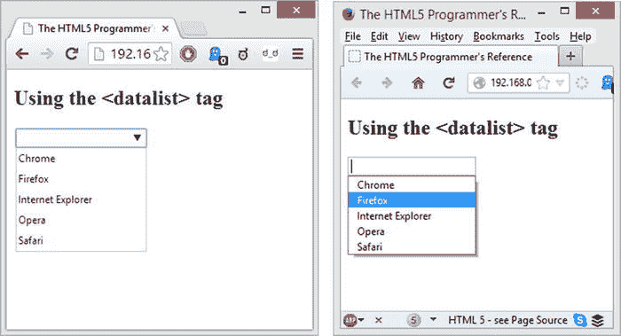

[图 2-11](#_Fig11) 。[清单 2-14](#list14) 在 Chrome(左)和 Firefox(右)中呈现

可以看到，Chrome 在输入栏的右侧提供了下拉箭头提示，表示输入栏是数据列表，Firefox 在下拉菜单上有轻微的阴影。不同浏览器之间的列表功能保持不变。

米

新的`<meter>`标签提供了一个简单的仪表栏或仪表视觉元素。此条旨在模拟已知范围内的测量值，或整体的分数值(例如，卷、磁盘使用情况等)。).它不应该用于显示进度(例如，在下载中)；为此使用新的`<progress>`标签。

`<meter>`标签具有以下属性:

*   `value`:要显示的当前值。如果指定，该值必须在最小值和最大值之间。如果没有设置值，或者值不正确，浏览器将默认为 0。如果已指定，但该值大于 max 属性，则该值将被设置为 max 属性的值。如果该值小于 min 属性，则该值将被设置为 min 属性的值。
*   `min`:范围的最小值。如果未指定，则默认为 0。
*   `max`:范围的最大值。必须大于 min 属性的值(如果指定)。默认为 1。

也可以在测量范围内指定子范围。可以有`low`范围、`high`范围和`optimum`范围。`low`范围从`min`值到指定值，而`high`范围从`high`值到`max`值。通过使用`optimum`属性在范围内指定一个数字，可以将`low`范围或`high`范围指定为`optimum`范围。

*   `low`:低量程的最高值。当 value 属性在`low`范围内时，默认情况下，条将呈现黄色。
*   `high`:`high`范围的最小值，从该值到`max`属性的值。当`value`属性在`high`范围内时，默认情况下，条会呈现黄色。
*   `optimum`:表示范围的最佳值。该值必须在范围的`min`和`max`值之间。如果使用了`low`和`high`范围，在其中一个范围内指定一个`optimum`值将指示这些范围中的哪一个是优选的。当该值在首选范围内时，该条将呈现绿色。当它在另一个范围内时，它将呈现红色。

创建这些计量器很简单，只需在文档中添加一个`<meter>`标签，如[清单 2-15](#list15) 所示。

***[清单 2-15](#_list15)*** 。米条

```html
<!DOCTYPE html>
<html>
  <head>
    <title>The HTML5 Programmer’s Reference</title>
  </head>
  <body>
    <article>
      <h1>Using the &lt;meter&gt; tag</h1>
      <p>Simple meter from 1 to 100, value set to 25:<br>
        <meter min="1" max="100" value="25"></meter>
      </p>
      <p>Simple meter from 1 to 100, low range from 1 to 25, high range from
         75 to 100, value set to 90:<br>
        <meter min="1" max="100" low="25" high="75" value="90"></meter>
      </p>
      <p>Simple meter from 1 to 100, low range from 1 to 25, high range from
         75 to 100, value set to 10:<br>
        <meter min="1" max="100" low="25" high="75" value="10"></meter>
      </p>
      <p>Simple meter from 1 to 100, low range from 1 to 25, high range from
         75 to 100, optimum set to 10, value set to 10:<br>
        <meter min="1" max="100" low="25" high="75" optimum="10" value="10"></meter>
      </p>
      <p>Simple meter from 1 to 100, low range from 1 to 25, high range from
         75 to 100, optimum set to 10, value set to 10:<br>
        <meter min="1" max="100" low="25" high="75" optimum="10" value="90"></meter>
      </p>
    </article>
  </body>
</html>
```

这些仪表在不同的浏览器中呈现得相当一致([图 2-12](#Fig12) )。


[图 2-12](#_Fig12) 。[清单 2-15](#list15) 在 Chrome(左)和 Firefox(右)中呈现

输出

新的`<output>`标签提供了一种在表单中指定计算输出或其他用户操作的方式。它没有任何特殊的功能；相反，它提供了一个语义标签来标记这类内容。

清单 2-16 中显示了一个简单的例子。

***[清单 2-16](#_list16)*** 。表单中的计算输出

```html
<!DOCTYPE html>
<html>
  <head>
    <title>The HTML5 Programmer’s Reference</title>
  </head>
  <body>
    <article>
      <h1>Using the &lt;output&gt; tag</h1>
      <form id="mainform" onsubmit="return false">
        <label for="input-number">Temperature</label>
        <input name="input-number" id="input-number" type="number" step="any"><br>
        <input type="radio" name="convert-choice" id="radio-ftoc" checked value="ftoc">
        <label for="radio-ftoc">Convert Fahrenheit to Celcius</label><br>
        <input type="radio" name="convert-choice" id="radio-ctof" value="ctof">
        <label for="radio-ctof">Convert Celcius to Fahrenheit</label><br>
        Result:
        <output name="output-target" for="input-number" id="output-target"></output>
      </form>
    </article>
    <script>
var myForm = document.getElementById(’mainform’);
var converter = {
  ctof: function(degreesC) {
    return (((degreesC * 9) / 5) + 32);
  },
  ftoc: function(degreesF) {
    return (((degreesF - 32) * 5) / 9);
  }
};
myForm.addEventListener(’input’, function() {
  var inputNumber = document.getElementById(’input-number’),
      outputTarget = document.getElementById(’output-target’);
  var sel = document.querySelector(’input[name=convert-choice]:checked’).value;
  outputTarget.value = converter[sel](parseInt(inputNumber.value));
}, false);
    </script>
  </body>
</html>.
```

这是一个简单的例子，但是您使用了一些巧妙的技巧。

*   您创建了一个 converter 对象，它有两个方法，`ctof`(将摄氏温度转换为华氏温度)和`ftoc`(将华氏温度转换为摄氏温度)。
*   您将单选按钮的值属性之一设置为`ctof`，将另一个设置为`ftoc`。
*   您使用选择器`input[name=convert-choice]:checked`来获取选中的单选按钮，然后获取其值(ctof 或 ftoc)。
*   然后，只需使用查询结果，就可以直接访问 converter 对象的正确方法。

 **提示** JavaScript 也受一个标准——ECMA-262——控制，它明确定义了两种访问对象成员的方法:点符号或括号符号。所以`objectName.identifierName`在功能上等同于`objectName[<identifierName string>]`，即使所讨论的对象不是数组。有关详细信息，请参见`http://www.ecma-international.org/ecma-262/5.1/`的 ECMA-262 中的第 11.2.1 节“属性访问器”。

图 2-13 显示了用 Chrome 渲染的[清单 2-16](#list16) 。


[图 2-13](#_Fig13) 。[清单 2-16 用 Chrome 渲染的](#list16)

进步

HTML5 定义了一个新的`<progress>`标签，在文档中呈现为一个进度条。它用于指示任务的进度或完成情况，并向用户提供已经完成的工作量和剩余工作量的概念。它不应该用于可视化已知范围内的测量—为此，使用`<meter>`标签。

`<progress>`标签具有以下属性:

*   `max`:活动的最大值。该值必须是有效的正浮点数。如果没有指定`max`，最大值默认为 1。
*   `value`:进度的当前值。该值必须是介于 0 和`max`(如果指定)或 1(如果未指定`max`)之间的有效浮点数。如果没有指定`value`,那么进度条被认为是不确定的，这意味着它正在建模的活动正在进行，但是没有给出需要多长时间才能完成的指示。

清单 2-17 提供了一个进度条的简单演示。

***[清单 2-17](#_list17)*** 。进度条

```html
<!DOCTYPE html>
<html>
  <head>
    <title>The HTML5 Programmer’s Reference</title>
  </head>
  <body>
    <article>
      <h1>Using the &lt;progress&gt; tag</h1>
      <p>Downloading file1<br>
        <progress max="100" value="10">10/100</progress> 10%</p>
      <p>Downloading file2<br>
        <progress max="100" value="50" orient="vertical">50/100</progress> 50%</p>
    </article>
  </body>
</html>
```

如[图 2-14](#Fig14) 所示，进度条在不同的浏览器中呈现不同的效果。


[图 2-14](#_Fig14) 。[清单 2-17](#list17) 在 Chrome(左)、Internet Explorer(中)和 Windows 8 上的 Firefox(右)中呈现

在 MacOS 上渲染时，这些示例看起来也会有所不同。幸运的是，这些酒吧很容易设计。Firefox 和 Internet Explorer 可以直接访问元素的样式，而在 Chrome 中，你必须选择伪元素来更改它们。通过在你的 CSS 中添加一些简单的指令，如清单 2-18 所示，你可以让工具条在所有浏览器中看起来都一样。

***[清单 2-18](#_list18)*** 。进度条的 CSS 规则

```html
progress {
  color: #0063a6;
  font-size: .6em;
  line-height: 1.5em;
  text-indent: .5em;
  width: 15em;
  height: 1.8em;
  border: 1px solid #0063a6;
  background-color: #fff;
}
::-webkit-progress-bar {
  background-color: #fff;
}
::-webkit-progress-value {
  background-color: #0063a6;
}
```

正如你在图 2-15 中看到的，这些条现在在不同的浏览器中呈现相同的效果。


[图 2-15](#_Fig15) 。应用 CSS 规则的进度条

一个稍微实际一点的例子是定时器。使用`<progress>`标签，你可以指示某个分配的时间——例如十秒——正在过去，如清单 2-19 中的[所示。](#list19)

***[清单 2-19](#_list19)*** 。十秒钟计时器

```html
<!DOCTYPE html>
<html>
  <head>
    <title>The HTML5 Programmer’s Reference</title>
    <style>
progress {
  color: #0063a6;
  font-size: .6em;
  line-height: 1.5em;
  text-indent: .5em;
  width: 15em;
  height: 1.8em;
  border: 1px solid #0063a6;
  background-color: #fff;
}
::-webkit-progress-bar {
  background-color: #fff;
}
::-webkit-progress-value {
  background-color: #0063a6;
}
    </style>
  </head>
  <body>
    <article>
      <h1>Using the &lt;progress&gt; tag</h1>
      <h2>Ten Second Timer</h2>
      <p><progress max="10" value="0" id="myProgress">0</progress></p>
    </article>
    <script>
var progress = 0;
var myProgress = document.getElementById("myProgress");
var myTimer = setInterval(function() {
  myProgress.value = ++progress;
  if (progress > 10) {
    clearInterval(myTimer);
  }
}, 1000);
    </script>
  </body>
</html>
```

这个例子使用 DOM 方法`setInterval()`每秒运行一个函数来更新进度条的值。当进度条已满时，它用`clearInterval()`方法取消计时器。

新表单元素属性

HTML5 规范为表单元素提供了一些有用的新属性。同样，这些新属性是专门为解决以前版本的 HTML 表单中的缺点而设计的，并添加了通常需要的功能，到目前为止，这些功能都必须使用 JavaScript 来构建。

自动完成

所有的浏览器都提供了存储表单数据以备后用的功能。这对移动设备特别有帮助，因为它减少了打字。`autocomplete`属性允许您指定哪些`<input>`元素可以自动完成，哪些应该总是手动填充。`autocomplete`属性可以取两个值:`on`(允许自动完成；这是默认设置)或`off`(不允许自动完成)。

清单 2-20 是一个简单的例子，有两个表单域，一个允许自动完成，另一个不允许。

***[清单 2-20](#_list20)*** 。控制表单中的自动完成

```html
<!DOCTYPE html>
<html>
  <head>
    <title>The HTML5 Programmer’s Reference</title>
  </head>
  <body>
    <article>
      <h1>Using the autocomplete attribute</h1>
      <form id="test-form" action="#" method="post">
        <p><label for="input-auto">This input allows autocomplete:</label><br>
        <input autocomplete="on" id="input-auto" name="input-auto"></p>
        <p><label for="input-noauto">This input does not allow autocomplete:</label><br>
        <input autocomplete="off" id="input-noauto" name="input-noauto"></p>
        <p><input type="submit"></p>
      </form>
    </article>
  </body>
</html>
```

几乎在每个浏览器中，您都应该能够填写表单字段并单击提交按钮。然后，重新加载页面。双击第一个表单域，您应该会看到一个包含您之前输入的值的下拉框([图 2-16](#Fig16) )。


[图 2-16](#_Fig16) 。[清单 2-20](#list20) 用 Chrome(左)和 Firefox(右)呈现

请注意，您必须在浏览器中启用自动填充功能。大多数浏览器在默认情况下会启用它，但出于安全考虑，许多人会将其关闭。如果用户在其浏览器中禁用了该功能，autocomplete 属性将不起作用。

浏览器使用许多线索来确定哪些表单字段应该用什么数据自动完成:字段的名称和 ID、`<form>`标签的`action`和`method`属性，等等。这个过程是相当不标准的，并且进入了“魔术”的领域 2012 年，谷歌提议对`autocomplete`属性进行扩展，以帮助标准化流程。在这个提议中，他们提出了一个具有从`address-line1`到`postal-code`再到`url`的一系列值的`autocompletetype`属性。你可以在`http://wiki.whatwg.org/wiki/Autocompletetype`阅读他们的完整提案。那个提议从未被完全采纳，但其中的一些部分最终进入了新的自动填充规范，你可以在`https://html.spec.whatwg.org/multipage/forms.html#autofill`查看。

自（动）调焦装置

`autofocus`属性允许您指定页面加载时哪个表单字段应该有焦点。因为它是排他的，所以只能在给定页面上的一个表单字段上设置`autofocus`，当页面加载完成时，焦点将转到该元素。您不能在类型为`hidden`的表单元素上设置`autofocus`。自动对焦可以设置为任何`<input>`、`<button>`或`<textarea>`字段。

如果你在页面加载时给清单 2-20 中的第二个字段添加一个`autofocus`属性，它将被聚焦，如清单 2-21 中的[所示。](#list21)

***[清单 2-21](#_list21)*** 。自动聚焦输入场

```html
<!DOCTYPE html>
<html>
  <head>
    <title>The HTML5 Programmer’s Reference</title>
  </head>
  <body>
    <article>
      <h1>Using the autofocus attribute</h1>
      <form id="test-form" action="#" method="post">
        <p><label for="input-auto">This input allows autocomplete:</label><br>
        <input autocomplete="on" id="input-auto" name="input-auto"></p>
        <p><label for="input-noauto">This input does not allow autocomplete:</label><br>
        <input autocomplete="off" id="input-noauto" name="input-noauto" autofocus="autofocus"></p>
        <p><input type="submit"></p>
      </form>
    </article>
  </body>
</html>
```

当页面加载完成后，第二个输入字段将被选中并准备接收输入，如图[图 2-17](#Fig17) 所示。

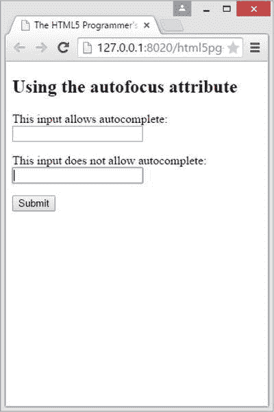

[图 2-17](#_Fig17) 。[清单 2-21 用 Chrome 渲染的](#list21)

当然，只要用户单击浏览器中的其他地方，该字段就会失去焦点，除非用户再次单击该字段，否则它不会返回。自动对焦只发生在页面加载时。

占位符

表单的另一个常见设计特征是在`<input>`字段中的占位符文本。占位符文本有助于提供有关该字段用途的更多信息，当用户开始键入时，它会消失。HTML5 包括一个新的`placeholder`属性，可以应用于`<input>`和`<textarea>`字段。为属性指定的值用作字段内的占位符文本。

清单 2-22 是一个简单的表单示例，用户可以在其中编写和发送电子邮件。

***[清单 2-22](#_list22)*** 。占位符文本

```html
<!DOCTYPE html>
<html>
  <head>
    <title>The HTML5 Programmer’s Reference</title>
  </head>
  <body>
    <article>
      <h1>Using the placeholder attribute</h1>
      <p><label for="message-title">Title:</label><br>
        <input placeholder="title of message" id="message-title"></p>
      <p><label for="message-body">Body:</label><br>
        <textarea placeholder="body of message" id="message-body"></textarea></p>
      <p><input type="submit" value="Send Email"></p>
    </article>
  </body>
</html>
```

在现代浏览器中，占位符文本在表单字段内将显示为灰色文本([图 2-18](#Fig18) )。

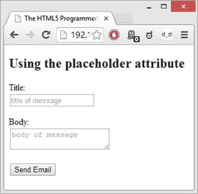

[图 2-18](#_Fig18) 。[清单 2-22 用 Chrome 渲染的](#list22)

一旦用户开始在字段中输入，占位符文本就会消失，如图 2-19 所示。

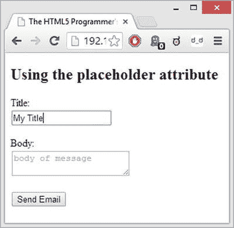

[图 2-19](#_Fig19) 。[清单 2-22 用户输入后的](#list22)

注意，这个例子仍然包括`<label>`标签。占位符文本是一个很好的设计概念，但是它不应该取代`<label>`标签，后者是表单可访问性的重要组成部分。您通常不需要这两个标签——正如您在示例中看到的，这些标签有些多余。在这种情况下，你可以简单地用 CSS 隐藏`<label>`标签，如[清单 2-23](#list23) 所示。

***[清单 2-23](#_list23)*** 。用 CSS 隐藏标签

```html
label: {
  display: none;
}
```

这个简单的 CSS 使得图 2-20 中的表单看起来更好。

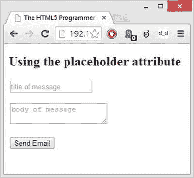

[图 2-20](#_Fig20) 。[清单 2-23 用 Chrome 渲染的](#list23)

新输入类型

HTML5 规范还包括了`input`元素的`type`属性的新值。您可能很熟悉使用这个属性来创建复选框和单选按钮:

```html
<input type="checkbox">
<input type="radio">
```

HTML5 增加了几个新类型，为输入字段增加了新的用户界面功能，从颜色和日期选择器到搜索框。不幸的是，不同的浏览器对这些新输入类型的支持大不相同。

对于桌面浏览器，Chrome 的支持最好，Firefox 和 Internet Explorer 都远远落后。不幸的是，这限制了它们在桌面应用程序中的用途。

在移动浏览器上支持更好。大多数新的输入类型将使用设备的特殊键盘和输入工具。例如，当类型为`tel`的输入字段在 Safari Mobile 中处于活动状态时，手机将显示电话键盘。这使得移动用户更容易输入电话号码。

尽管这些新类型现在没有得到广泛支持，但对它们的支持正在增长，特别是在移动设备上。考虑到使用特定键盘进行移动输入的好处，使用这些输入类型是一个好习惯，即使它们没有得到广泛支持。

新的输入类型如下:

*   `color`:允许用户选择颜色。在 Chrome desktop 中，这将显示一个色卡，当单击它时，会显示主机操作系统的颜色选择器用户界面小部件。没有其他浏览器支持此元素。
*   `date`、`datetime`、`datetime-local`、`month`、`time`、`week`:这些输入类型允许用户输入日期和时间。在 Chrome 桌面中，这些显示 Chrome 内置的日历和时间选择小部件。在移动设备上，这些显示日期和时间选择器(在 iOS 上，它们以微调器的形式出现)。
*   `email`:表示用于收集电子邮件地址的输入字段。在移动设备上，这种类型在激活时会显示一个互联网地址友好的键盘。在 iOS 上，这种键盘采用常规键盘的形式，带有@键和. com 键。
*   `number`:该输入类型指定用户将输入一个数字。在 Chrome 和 Firefox 桌面上，这种输入类型将显示一个简单的增加/减少小部件。在移动设备上，这种输入类型将显示字母数字键盘的数字页。
*   `range`:显示滑块小工具。这是桌面和移动设备上所有浏览器都广泛支持的唯一输入类型。
*   `search`:表示该字段为搜索字段。搜索字段和常规输入字段的主要区别在于，搜索字段包含“清除”功能，通常实现为输入字段边缘的×按钮。在 Chrome 和 Internet Explorer 桌面上，这显示了一个简单的搜索栏，右边有一个清除按钮。
*   `tel`:表示该字段将用于输入电话号码。在移动设备上，这种类型的输入字段将在激活时显示电话号码键盘。
*   `url`:表示该字段将用于输入一个 URL，很可能是一个网址。在移动设备上，这将显示一个互联网地址友好的键盘，而活跃。

如果你想测试这些输入字段，[清单 2-24](#list24) 有完整的输入字段，你可以把它们加载到任何浏览器中。

***[清单 2-24](#_list24)*** 。演示了新的输入类型

```html
<!DOCTYPE html>
<html>
  <head>
    <title>The HTML5 Programmer’s Reference</title>
    <meta name="viewport" content="width=device-width, user-scalable=no">
    <style>
input {
  display: block;
  margin-bottom: 20px;
}
    </style>
  </head>
  <body>
    <article>
      <h1>New HTML5 Input Types</h1>
      <form id="mainform" onsubmit="return false">
        <label>type=color</label>
        <input type="color">
        <label>type=date</label>
        <input type="date">
        <label>type=datetime</label>
        <input type="datetime">
        <label>type=datetime-local</label>
        <input type="datetime-local">
        <label>type=email</label>
        <input type="email">
        <label>type=month</label>
        <input type="month">
        <label>type=number</label>
        <input type="number">
        <label>type=range</label>
        <input type="range">
        <label>type=search</label>
        <input type="search">
        <label>type=tel</label>
        <input type="tel">
        <label>type=time</label>
        <input type="time">
        <label>type=url</label>
        <input type="url">
        <label>type=week</label>
        <input type="week">
      </form>
    </article>
  </body>
</html>
```

Chrome 是这个例子中最有趣的浏览器。它为几种类型生成了一些非常有用的小部件，如图 2-21 所示。


[图 2-21](#_Fig21) 。Chrome 桌面中呈现的颜色、日期和搜索输入类型

不推荐使用的元素和过时的参数

HTML5 已经正式否决了几个元素。其中一些已经被新的标签所取代，或者被 CSS 特性所取代，而另一些则不再需要。

*   `<applet>`:用`<embed>`或`<object>`代替。
*   `<acronym>`:用`<abbr>`代替。
*   `<frame>`、`<frameset>`和`<noframes>`:框架集在 HTML5 中已经完全被弃用。相反，可以考虑使用 iframes 或服务器端技术。
*   `<strike>`:使用`<s>`，除非标记是为了编辑，在这种情况下使用`<del>`。
*   `<basefont>`、`<big>`、`<blink>`、`<center>`、`<font>`、`<marquee>`、`<multicol>`、`<nobr>`、`<spacer>`、`<tt>`:使用合适的元素或 CSS 来代替。对于`<tt>`元素，使用`<kbd>`(表示键盘输入)、`<var>`(表示变量)、`<code>`(表示计算机代码)或`<samp>`(表示样本输出)。在`<big>`元素的情况下，如果内容是标题，使用 header 标签，使用`<strong>`元素表示强调或重要性，使用`<mark>`元素突出显示引用。

此外，HTML5 已经废弃了现有元素的许多参数。同样，这些参数中的许多已经被 CSS 或其他特性所取代，而其他参数则是早期版本的 HTML 或 XHTML 的遗留物。

*   属性`background`、`datasrc`、`datafld`和`dataformats`已从所有适用的标签中被弃用。在背景的情况下，使用 CSS 将背景应用于元素。
*   `<a>` : `charset`、`coords`、`methods`、`name`、`rev`(使用`rel`的反义词)、`shape`(使用`area`的影像地图)、`urn`。
*   `<body>` : `alink`，`bgcolor`，`link`，`marginbottom`，`marginheight`，`marginleft`，`marginright`，`margintop`，`marginwidth`，`text`，`vlink`。
*   `<br>` : `clear`。
*   `<caption>` : `align`。
*   `<col>` : `align`，`char`，`charoff`，`valign`，`width`。
*   `<div>` : `align`。
*   `<dl>` : `compact`。
*   `<hr>` : `align`，`color`，`noshade`，`size`，`width`。
*   所有表头标签:`align`。
*   `<iframe>` : `align`，`allowtransparency`，`frameborder`，`hspace`，`longdesc`，`marginheight`，`marginwidth`，`scrolling`，`vspace`。
*   `` : `align`，`border`，`datasrc`，`hspace`，`longdesc`，`lowsrc`，`name`，`vspace`。
*   `<input>` : `align`，`hspace`，`ismap`，`usemap`，`vspace`。
*   `<legend>` : `align`。
*   `<link>` : `charset`，`methods`，`rev`，`target`，`urn`。
*   `<menu>` : `compact`。
*   `<object>` : `align`、`archive`、`border`、`classid`、`code`、`codebase`、`codetype`(使用数据和类型属性以及`<param>`元素)、`declare`、`hspace`、`standby`、`vspace`。
*   `<ol>` : `compact`。
*   `<option>` : `name`(用`id`代替)。
*   `<p>` : `align`。
*   `<param>` : `type`和`valuetype`(使用名称和值属性)。
*   `<pre>` : `width`。
*   `<script>` : `event`，`for`，`language`。
*   `<table>` : `align`，`bgcolor`，`border`，`bordercolor`，`cellpadding`，`cellspacing`，`frame`，`rules`，`summary`，`width`。
*   `<tbody>` : `align`，`char`，`charoff`，`valign`。
*   `<td>` : `abbr`，`align`，`axis`，`bgcolor`，`char`，`charoff`，`height`，`nowrap`，`scope`，`valign`，`width`。
*   `<tfoot>` : `align`，`char`，`charoff`，`valign`。
*   `<th>` : `align`，`bgcolor`，`char`，`charoff`，`height`，`nowrap`，`valign`，`width`。
*   `<thead>` : `align`，`char`，`charoff`，`valign`。
*   `<tr>` : `align`，`bgcolor`，`char`，`charoff`，`valign`。
*   `<ul>` : `compact`和`type`。

尽管浏览器仍然可以在 HTML5 文档中呈现这些标签并识别这些属性，但是您不应该使用它们。任何验证器也应该抛出错误。

摘要

在这一章中，我已经介绍了 HTML5 规范的元素部分的重点:

*   我讨论了 HTML 的发展如何受到语义的影响。
*   我简要介绍了 HTML5 为节、分组和语义引入的新标签。这些标签进一步扩展了语言处理复杂文档和布局的能力。
*   我探索了 HTML5 新的多媒体特性，并演示了`<audio>`和`<video>`标签的基本用法。
*   然后，我向您展示了 HTML5 指定的新交互元素:对话框和渐进式披露。不幸的是，这些功能还没有得到很好的支持，但这应该会改变久而久之。
*   我回顾了 HTML5 引入的表单更改，其中一些在移动环境中特别有用。
*   最后，我查看了 HTML5 中不赞成使用的标签和属性。

在下一章，你将深入 HTML5 指定的 JavaScript APIs。*