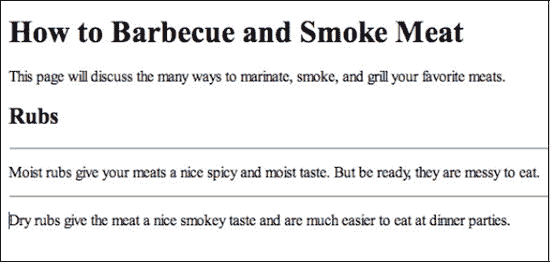
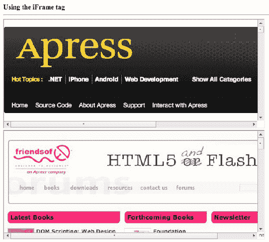
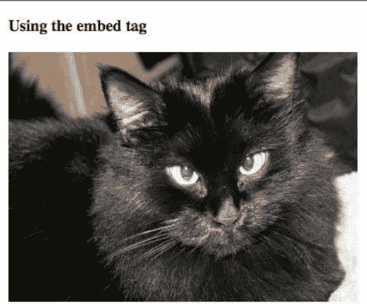

# 二、HTML5 标记

在第 1 章中，我们探索了许多与 HTML5 相关的新结构标签。通过使用附加的结构标签，您可以更详细、更准确地描述文档的各个部分。您还了解了许多与标记相关的属性。这些属性中有些是特定于特定标签的，有些是所有标签的全局属性。

本章回顾了你可能在 HTML 早期版本中使用过的许多标签。但是，你会看到这些熟悉的标签在 HTML5 中得到了极大的增强。在本章中，你还将学习 HTML5 如何帮助你把你的应用程序与外界联系起来，更重要的是，与多媒体联系起来。这里我们试着解决几个问题。

### 解决方案 2-1:在 HTML5 中使用< hr >标签

在以前的 HTML 版本中，`
`标签被严格用于在页面上创建水平线。在 HTML5 中，它在语义上发生了变化。

乍一看，`
`标签看起来在 HTML5 中做的事情和它在以前的 HTML 版本中做的完全一样。然而，HTML 的目的是描述文档的各个部分。之前，`
`标签画了一条水平线。虽然这一行很方便，但除了一条水平线之外，它实际上并不能描述文档的一部分。

W3C 在语义上改变了`
`标签的功能。官方说法是，它的目的现在是定义“一个部分的结束和另一个部分的开始。”这里是混乱开始的地方:正如在第一章的[中所讨论的，HTML5 有一个叫做`<section>`的新标签，它被设计用来分隔部分。这是开发者之间持续争论的主题。在撰写本文时，大家一致认为或许可以使用`
`标签来分隔一个部分中的主题。由于 HTML5 仍然是一项正在进行中的工作，而且很可能会持续很长时间，也许会有一个更最终的定义。](01.html#ch1)

#### 涉及到什么

让我们假设你有几个段落，你想用一条水平线分开。你可能希望它看起来像图 2-1 中的简单例子。

**图 2-1。**使用`
`标签

如果你正在挠头，想知道有什么不同，你并不孤单。很多开发者都在做完全一样的事情。虽然[图 2-1](#fig_2_1) 看起来和以前的 HTML 版本有相同的功能，但它实际上在语义上将湿摩擦和干摩擦的主题分开了。在[图 2-1](#fig_2_1) 中，我们也使用它将描述从标题“摩擦”中分离出来

#### 如何建造它

图 2-1 中[所示的例子由以下代码完成:](#fig_2_1)

`<!DOCTYPE html>
   <html>
      <head>
         <title>Using the 
 tag</title>
      </head>
      <body>
         <h1>How to Barbecue and Smoke Meat</h1>
         This page will discuss the many ways to marinate, smoke, and grill your favorite
 meats.
         <h2>Rubs</h2>
         

         Moist rubs give your meats a nice spicy and moist taste. But be ready, they are
 messy to eat.
         

         Dry rubs give the meat a nice smokey taste and are much easier to eat at dinner
 parties.
      </body>
   </html>`

根据 W3C，应该用`
`标签而不是`
`标签来分隔各个部分。在这个例子中，为了符合 HTML5 标准，没有使用`
`标签。当然，`
`标签仍然可以用来分隔一个节中的段落。

#### 专家提示

为了适应`
`标签的新语义定义，您可以使用 CSS 来改变`
`标签产生的内容。请注意以下示例:

`hr
{
     height: 15px;
     background: url('decorative.gif');
     no-repeat 50% 50%;
}`

但是，您需要对此保持谨慎。截至本文撰写之时，Safari 和 Firefox 将用上述代码中显示的图形替换水平线；但是 Internet Explorer 会用水平线包围图形。

### 解决方案 2-2:使用< iFrame >标签

您可以使用`<iframe>`标签在浏览器中创建一个浏览器，并从其他来源打开文档。这可以在图 2-2 中的[所示的例子中看到。](#fig_2_2)

**图 2-2。**使用`<iFrame>`标签打开两个外部网站

在[图 2-2](#fig_2_2) 中，使用两个`<iFrame>`标签打开了两个独立的网站。这个标签的重要性增加了，因为 HTML5 不支持 scrolling、frameborder 和 marginheight 属性，而所有这些属性在以前的 HTML 版本中都是受支持的。

#### 涉及到什么

HTML5 中`<iFrame>`标签的一个建议规范是`seamless`属性。这允许外部源代码被合并到宿主文档中，没有边框或滚动条。这意味着外部源看起来就像是宿主文档的一部分。不幸的是，在撰写本文时，还没有浏览器支持`seamless`属性。

#### 如何建造它

以下代码用于创建图 2-2 中[所示的示例:](#fig_2_2)

`<!DOCTYPE html >
   <html>
      <head>
         <title>Using the <iFrame> tag</title>
      </head>
      <body>
         <strong>Using the iFrame tag</strong>

         <iframe src="http://www.apress.com/" width="600" height="250" seamless></iframe> 
         <iframe src="http://www.friendsofed.com/" width="600" height="250" seamless
 ></iframe> 
      </body>
   </html>`

请注意，上面的代码中使用了`seamless`属性，但是，您仍然可以看到滚动条和边框。这意味着浏览器不支持使用`seamless`属性。

#### 专家提示

当从外部来源引入任何类型的内容时，安全性可能是一个因素。在 HTML5 中，`<iFrame>`标签周围有一个沙箱来帮助提高安全性。沙箱的属性包括以下内容:

*   *allow-scripts* :阻止或允许执行某些脚本内容，包括 JavaScript。
*   *允许-表单*:允许或阻止表单提交。
*   *allow-same-origin* :强制外部文档的内容源自同一原点。因此，页面不能从一个原点接收数据，然后将数据写入不同的原点。
*   *允许-顶层导航*:允许或阻止导航到顶层浏览内容。

### 解决方案 2-3:在页面中嵌入媒体

与上一节中的`<iFrame>`标签一样，`<embed>`标签用于将外部内容嵌入到主机网页中。然而，这里的重点是媒体，如照片，视频，声音和，尽管所有的谣言相反，Flash 内容。例如，在[图 2-3](#fig_2_3) 中，你会得到以下结果(假设一张照片是从外部来源带入的):

**图 2-3。**使用`<embed>`标签

#### 涉及到什么

虽然您可能认为可以用``标签做同样的事情，但是您可以使用`<embed>`标签将各种媒体引入网页。例如，您可以引入视频、声音文件等等。然而，在处理视频时，事情在这个时候有点转变。

在撰写本文时，反对使用 Adobe Flash Player 等浏览器插件的趋势似乎越来越明显。许多移动技术目前不支持这些插件。例如，最常用的 Flash 视频格式之一是 FLV。这需要使用前面提到的 Adobe Flash Player。标签似乎指向一个可能的解决方案；然而，有一个警告。视频有多种风格——FLV、MOV、H.264 等等。每种 MIME 类型(文件扩展名)都需要有人获取原始视频并对其进行编码。这意味着将其包装在一个称为编解码器(压缩解压缩)的特殊容器中。此外，观看视频的人需要在他们的计算机上安装视频编解码器的副本。对于 Flash 视频，编解码器包含在 Flash 播放器中。

在撰写本文时，有两种编解码器支持 HTML5 视频:H.264 和 Theora。记住这一点，在撰写本文时，还有以下浏览器支持:

*   Firefox 3.5 及以上版本只支持 Theora 的 HTML5，不支持 H.264。
*   Internet Explorer 9 仅支持 H.264 的 HTML5 视频，不支持 Theora。
*   Safari 3 及以上版本只支持 H.264 而不支持 Theora 的 HTML5 视频。
*   Chrome 3 及以上版本同时支持 H.264 和 Theora 的 HTML5 视频。
*   Opera 10.5 只支持 Theora 的 HTML5 视频，不支持 H.264。

#### 如何建造它

以下代码用于创建图 2-3 中[所示的示例:](#fig_2_3)

`<!DOCTYPE html>
<html>
   <head>
      <title>Using the embed tag </title>
   </head>
   <body>
      
<strong>Using the embed tag</strong>

      <embed type="jpg" src="002.jpg" height="250" width="350" />
   </body>
</html>`

区分这个标签的是`type`属性。您可能会将`type`属性与像`<input>`这样的标签联系起来。然而，在 HTML5 中，属性的使用比标签更加一致。在大多数情况下，媒体的 MIME 类型(文件扩展名)用作类型。但是，您很快就会看到，还有一种识别视频类型的替代方法。

另一个独特的属性是`src`。这可以是连接到源所需的任何 URL。

#### 专家提示

如上图所示，不同的浏览器支持不同的 HTML5 视频编码。因此，可能有必要对任何给定的视频进行两种编码:一种用于 H.264，一种用于 Theora。在`<embed>`标签中，您使用`type`属性来标识要打开的编码视频。

当对视频使用`type`属性时，视频的类型可以用语法`video/type`来标识。例如，对于 QuickTime 视频，将类型标识为`type = "video/Quicktime"`。

### 解决方案 2-4:使用<区域>标签

虽然您可能在以前的 HTML 版本中使用过`<area>`标记，但是在 HTML5 中实现的版本提供了一些新的有趣的可能性。让我们先来看看在 HTML5 中使用`<area>`标签的一些基础知识。

#### 涉及到什么

`<area>`标签用于使用图像映射创建超链接。换句话说，它将一个现有的图形分成几个部分，每个部分都有自己独特的超链接。然而，HTML5 看待链接的方式与以前的 HTML 版本略有不同。它将链接分为三类:

*   *超链接*:允许用户导航到给定的资源。
*   *外部资源*:链接到被自动处理以扩充当前文档的资源。
*   *注释*:对外部资源中使用的自动资源的修改；他们还可以修改超链接的工作方式。

在以前的 HTML 版本中，`rel`属性用于显示当前资源和它所链接的资源之间的关系。例如，请注意以下内容:

`rel = "stylesheet"`

这表明资源链接到的文档是一个样式表。虽然这听起来不多，但它可能对搜索引擎理解网站内各种文档的关系有巨大的影响。

虽然`rel`属性不是新的，但是 HTML5 扩展了关系定义。

[表 2.1](#tab_2_1) 显示了撰写本文时`<area>`标签与外部文档的关系。由于本规范处于过渡阶段，表中提供的信息可能会发生变化。然而，你会惊讶地发现，现在的参考值代表了如此多样的关系，如家庭，职业，甚至浪漫。

**表 2-1** 。与`<area>`标签引用文件的关系

<colgroup><col align="left" valign="top" width="20%"> <col align="left" valign="top" width="15%"> <col align="left" valign="top" width="60%"></colgroup> 
| **相对值** | **与<区>标签**一起使用 | **描述** |
| :-- | :-- | :-- |
| 相识 | 是 | 这表明在参考文档中表示的人是在当前文档中表示的人的熟人。 |
| 交替的 | 是 | 用于指定引用的文档将与指定的介质一起使用。在 HTML5 中，媒体属性现在可以和`<area>`标签一起使用。这在以前的 HTML 版本中是不正确的。 |
| 档案 | 是 | 一份有历史意义的文件的链接。 |
| 作者 | 是 | 这表明引用的文档提供了关于作者的附加信息。 |
| 书签 | 是 | 这表明引用的文档是宿主文档的祖先。 |
| 儿童 | 是 | 这表明引用文档中表示的人员是当前文档中表示的人员的子代。 |
| 同事 | 是 | 这表明引用文档中所代表的人员与当前文档中所代表的人员具有职业关系。 |
| 接触 | 是 | 联系方式。 |
| 同居者 | 是 | 这表示引用文档中表示的人与当前文档中表示的人共享一个地址。 |
| 同事 | 是 | 这表明引用文档中代表的人员是当前文档中代表的人员的同事。 |
| 迷恋 | 是 | 这表明在参考文献中描述的人对在当前文献中描述的人有浪漫的兴趣。 |
| 日期 | 是 | 这表明引用文档中表示的人员正在与当前文档中表示的人员约会。 |
| 外部 | 是 | 这表明引用的文档不是宿主文档所在站点的一部分。 |
| 第一 | 是 | 这表示引用的文档是一系列文档中的第一个文档。 |
| 朋友 | 是 | 这表明引用文档中所代表的人是当前文档中所代表的人的朋友。 |
| 帮助 | 是 | 这表明引用的文档是上下文相关的帮助。 |
| 图标 | 不 | 这将导入一个图标来表示引用的文档。 |
| 指数 | 是 | 指向索引或目录的链接。 |
| 家族 | 是 | 这表明参考文档中所代表的人是当前文档中所代表的人的家庭成员或大家庭成员。 |
| 最后的 | 是 | 这表示引用的文档是一系列文档中的最后一个文档。 |
| 许可证 | 是 | 这是指向当前文档许可信息的链接。 |
| 我 | 是 | 这表示当前文档和链接的文档都代表您。 |
| 遇见 | 是 | 这表明当前文档中的人和引用文档中的人已经实际相遇。 |
| 沉思 | 是 | 这表明引用文档中所代表的人给了当前文档中所代表的人灵感。 |
| 然后 | 是 | 这表示引用的文档是引用的一系列文档中的下一个文档。 |
| 邻居 | 是 | 这表明引用文档中表示的人是当前文档中表示的人的邻居。 |
| nofollow(无跟踪) | 是 | 这意味着引用的文档没有得到宿主文档作者的认可，而是被用作引用或关系。 |
| 诺弗罗 | 是 | 这意味着 HTTP 头不使用超链接中的 referrer 属性。 |
| 父母 | 是 | 这表明引用文档中表示的人员是当前文档中表示的人员的父代。 |
| pingback | 不 | 允许引用的服务器 ping 回当前文档。 |
| 预取 | 是 | 允许预取引用的文档。 |
| 上一个 | 是 | 与下一个引用一样，这表示这是对一系列文档的引用，并且这是前一个文档。 |
| 搜索 | 是 | 此链接指向一个工具，该工具可以对当前或引用的文档执行搜索。 |
| 补充报道 | 是 | 这将在浏览器中将引用的文档显示为侧栏。 |
| 兄弟 | 是 | 这表明引用文档中所代表的人是当前文档中所代表的人的兄弟或姐妹。 |
| 配偶 | 是 | 这表明引用文档中代表的人员是当前文档中代表的人员的配偶。 |
| 爱人 | 是 | 这表明参考文献中所描述的人是当前文献中所描述的人的亲密爱人。 |
| 样式表 | 不 | 这表明引用的文档是样式表。 |
| 标签 | 是 | 这表示引用文档中的标签适用于当前文档。 |

在[表 2-1](#tab_2_1) 中列出的所有`rel`环节中:

*   超链接是用熟人、候补、档案、作者、书签、孩子、同事、联系人、共同居民、同事、迷恋、日期、外部、第一、朋友、帮助、索引、亲属、许可证、我、met、muse、邻居、下一个、父母、上一个、搜索、侧边栏、兄弟姐妹、配偶、爱人和标签值创建的。
*   通过预取引用外部资源。
*   注释由 nofollow 和 noreferrer 使用。

同样，从 HTML5 开始，`<area>`标签可以使用 media 属性来指示链接的目标媒体。在以前的 HTML 版本中，您不能在`<area>`标签中使用 media 属性。为了保持一致，HTML5 现在允许使用它。

#### 如何建造它

有许多不同的方式来使用`<area>`标签。下面的例子就是这样一种方式。请注意，此示例仅用于演示，并不代表工作现场。

`<!DOCTYPE html >
<html>
   <head>
      <title> Example For Area Tag href attribute </title>
   </head>
   <body>
      
      <map name="usamap">
         <area  coords="20, 80, 122, 230"  href="http://www.friendsofed.html" shape="rect"
  hreflang="en" rel="license" media="screen" />
         <area  coords="123, 82, 288, 160"  href="http://www.apress.html" shape="rect"
  hreflang="en" rel="license" media="print"/>
     </map>
   </body>
</html>`

`<area>`标签与`<map>`标签一起使用。注意``标签中的`usemap`属性。在`<map>`标签的`name`属性中使用了相同的标识符。这将图像与图像映射相关联。

媒体属性用于显示链接与哪个媒体相关联。如前所述，在`<area>`标签中使用该属性是 HTML5 的新功能。

#### 专家提示

当使用`<area>`标签时，结合使用`hreflang`属性和`href`属性是一个很好的实践。这将指示目标文档或资源的语言。

### 总结

在这一章中，我们看了 HTML5 标记如何赋予传统的 HTML 标签新的功能。我们还研究了如何使用标签如`<iFrame>`和`<area>`将 HTML5 文档链接到外部世界。

在下一章，你将看到 HTML5 如何使用 DOM API 模型。在这个过程中，我们会重温您在本章和第 1 章中学到的一些概念。但是，您将在更复杂的环境中看到它们。