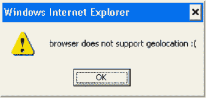
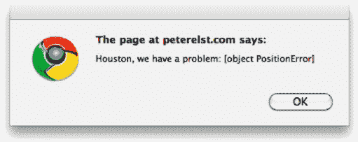
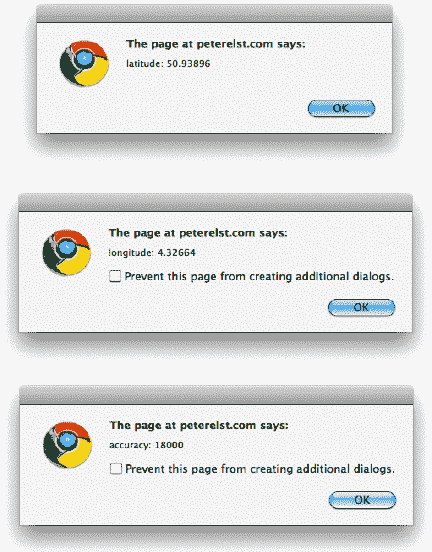
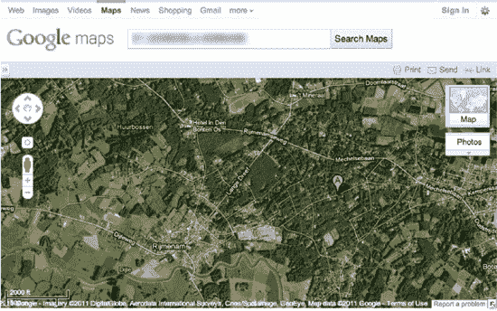
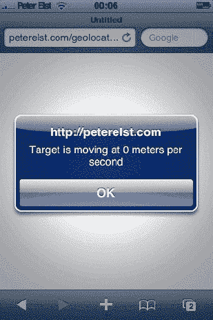
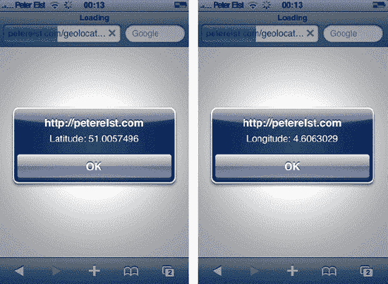

# 十、HTML5 地理定位 API

如果一个 web 应用知道你在哪里，那不是很好吗？想象一下，能够搜索特定于您当前位置的信息—最近的餐馆在哪里，您的哪些朋友在附近，您所在城镇的交通状况如何…

这都是可能的，并且是使用 HTML5 地理定位 API 添加的相对简单的特性。位置感知应用是一个热门话题，在不久的将来，它们将结束你必须手动指定当前位置的局面。

当你想到这个特性时，一个经常出现的问题就是隐私。您可能不总是希望应用知道您的位置，并可能与公众共享它。幸运的是，该特性的实现方式是，用户需要允许在每个域和每个会话的基础上明确共享他们的位置。用户还可以选择总是允许或总是拒绝共享位置。

请记住，地理定位通常是 HTML5 项目中的一个可选功能，如果用户不允许您获取他们的位置，您将需要执行错误处理。

桌面和移动设备对地理定位 API 有相对较好的支持，正如你在[表 10-1](#t1001) 中看到的。就像所有与技术相关的事情一样，这只会变得更好。

### 了解地理定位 API

浏览器找到你的大概位置的能力看起来就像魔术一样，但是有一些秘密的因素使得这成为可能。

首先，有用户的 IP 地址。这表明用户在哪个国家和地区通过他或她的服务提供商连接到互联网。这一切都是通过浏览器在幕后发生的，但了解这在技术上是如何工作的可能会很有趣。

每个国家、地区和城市都被分配了一定的 IP 范围。每当用户连接到互联网时，他们会得到一个与其位置相匹配的 IP 地址。有些服务在国家、地区和城市级别维护定期更新的知识产权范围数据库。

更准确地说，浏览器会收集你附近的 Wi-Fi 信号信息。这包括私有网络和公共网络。提供这项服务的公司会对这些 Wi-Fi 信号进行索引和地理定位。

发送到该服务的 Wi-Fi 信号信息包括 MAC 地址(无线路由器的唯一标识符)、信号强度、SSID(无线网络的名称)以及自上次检测以来的毫秒数。它为用户检测到的每个无线信号都这样做。

如果使用的服务已经索引了这个特定的位置，它可以给出更精确的位置，直到你所在的街区和街道。

这种 Wi-Fi 信号地理定位也发生在幕后，它完全取决于你所在区域的覆盖情况。如果你在像旧金山或纽约这样的大城市的中心，你通常会比在偏僻的地方旅行时更接近你的位置。

基于 IP 的地理定位是一种总是有效的解决方案，但是不能给出最好的结果。如果用户连接到公司 VPN 或在代理服务器上，它也可能给出错误的结果。

所有浏览器都使用这两种方法的组合来给出它们能够收集的最准确的位置。

与在台式机和笔记本电脑上使用浏览器相比，移动设备和智能手机是另一回事。移动设备和智能手机通常内置专用的 GPS，正如我们在本章后面所讨论的，可以使用这个 GPS 来请求用户的精确位置。

在下面的解决方案中，我们将展示如何使用 HTML5 地理定位 API。

### 解决方案 10-1:使用导航器对象

在这个解决方案中，我们看一下 navigator 对象，以及它如何参与确定用户浏览器中的地理位置 API 支持。

#### 涉及到什么

如果您使用过 JavaScript，您可能知道 navigator 对象并不完全是新的；您可以使用它来查找浏览器语言、用户代理、安装的插件等等。新的是它现在拥有的地理位置对象，它允许您使用地理位置 API 来获取用户的位置。

#### 如何建造它

自然，在使用地理定位 API 时，您首先要做的是检测它是否受用户浏览器的支持。幸运的是，这并不难。

`<!DOCTYPE html>
<html>
<head></head>
<body>
  
</body>
</html>`

你真的不可能得到比这更基本的检测了。该代码检查导航器对象是否定义了地理位置。在本章的后面，您将看到检测特定浏览器是否支持地理位置 API 的其他方法。

如果你使用的是当前的浏览器(你可能正在阅读一本关于开发 HTML5 的书)，你会看到一个警告框，显示“`browser supports geolocation :),`”，如图[图 10-1](#fig_10_1) 所示。如果你在一个不支持地理定位的浏览器中测试这个，你会看到弹出的警告框说“`browser does not support geolocation :(`”(见[图 10-2](#fig_10_2) )。

**图 10-1。**显示浏览器支持地理定位 API 的警告框

**图 10-2。**浏览器不支持显示地理定位 API 的警告框

在不支持地理位置 API 的真实情况下，您可能会提示用户指定他们的位置，或者退回到显示非特定于位置的信息。

在`navigator.geolocation`对象内部有以下三种方法:

*   `getCurrentPosition()`尝试异步获取用户的当前位置。
*   `watchPosition()`每隔一段时间开始监控用户的位置。
*   `clearWatch()`停止监控用户的位置。

我们将在解决方案 10-2 中更详细地讨论这些方法。现在，您已经通过检测浏览器是否支持地理位置 API 迈出了第一步。

### 解决方案 10-2:获取当前位置

在这个解决方案中，您将使用 API 调用、结果和错误处理程序来访问用户的地理位置。

#### 涉及到什么

一旦确定用户的浏览器支持地理定位 API，就可以尝试获取当前位置。重要的是要记住，仅仅让浏览器支持地理定位是不够的；用户还必须明确允许该信息可用。

只要您请求用户的位置，就会出现一个通知，除非用户已经指定始终允许对您的站点进行地理位置检测，否则用户需要单击一个允许按钮。

因为用户需要与浏览器交互，并且确定位置可能需要几秒钟，所以获取当前位置的方法调用是异步完成的。当成功获得用户的位置时，将调用一个给定的函数，传入坐标。当获取用户位置失败时，将调用一个给定的函数，并传递错误细节。

#### 如何建造它

在解决方案 10-1 中，您看到了如何在用户浏览器中进行基本的地理定位功能检测。现在您知道它是否受支持，您可以触发方法来获取当前位置。这真的再简单不过了:

`<!DOCTYPE html>
<html>
<head></head>
<body>
  
</body>
</html>`

*注意:为了跨浏览器可靠地测试地理定位功能，您可能需要将文件上传到在线资源，或者在本地服务器上测试它们。在本地查看您的页面时，安全限制并不总是允许访问地理位置 API。*

在现代浏览器中运行这段代码将会提示用户选择是共享还是拒绝访问他们的位置(见[图 10-3](#fig_10_3) )。

**图 10-3。**谷歌 Chrome 浏览器提示地理位置访问

如果用户同意分享他们的位置，浏览器将施展魔法，调用第一个函数，该函数被指定为调用`getCurrentPosition`的参数，在我们的例子中，该函数被称为“successGeo”。如果用户不允许他们的位置被共享，或者在试图获取他们的位置时出错，第二个函数将被调用，在我们的例子中称为“failGeo”。

现在让我们实现这些功能。

`<!DOCTYPE html>
<html>
<head></head>
<body>
  
</body>
</html>`

当您在支持地理定位的浏览器上运行此代码时，它会提示您共享您的位置或拒绝访问。当您同意分享您的位置时，您通常会看到(除非在查找您的位置时出现错误)一个警告框，显示“我们找到了宝藏”并显示位置对象实例(参见[图 10-4](#fig_10_4) )。

**图 10-4。**获得地理位置访问权限后，显示位置对象实例的警告框

如果您拒绝访问地理定位，您将会看到一个警告框“休斯顿，我们有一个问题”和 PositionError 实例(见[图 10-5](#fig_10_5) )。

**图 10-5。**显示拒绝地理定位访问后的 PositionError 实例的警告框

在解答 10-3 和 10-4 中，你会学到更多关于这个位置对象的知识，以及你可以用它做什么。您还将学习 PositionError 对象及其包含的信息。

#### 专家提示

我们一直使用的`getCurrentPosition`方法有第三个可选参数，允许您设置一些额外的选项。可用的三个选项是:

*   `enableHighAccuracy`是一个布尔设置，允许您使用精确的 GPS 检测(如果可用)。
*   `maximumAge`指定位置检测需要发生的最近时间(毫秒)。
*   `timeout`指定获取用户位置的尝试需要超时的时间(毫秒)。

特别是智能手机和平板电脑现在可以使用 GPS 硬件来提供非常准确的位置信息。如果您的站点针对这些设备之一，您可以通过在第三个参数对象中指定它来尝试启用高准确性:

`navigator.geolocation.getCurrentPosition(successGeo, failGeo, {enableHighAccuracy: true});`

重要的是要注意，如果不可用，将`enableHighAccuracy`设置为 true 不会自动降低精度。这意味着它可能会触发错误函数，然后您可以将`enableHighAccuracy`设置为 false 来重试。

具有 GPS 硬件的移动设备将允许用户指定是否使用高精度位置检测。即使当 GPS 关闭时，这些设备中的大多数仍然能够使用其他机制来获得最精确的位置。

获取用户的地理位置可能需要几秒钟的时间(尤其是在启用高精度的情况下)，因此浏览器通常会缓存结果。您可以使用`maximumAge`属性来确保检测到的位置是新的，并且不超过 X 毫秒:

`navigator.geolocation.getCurrentPosition(successGeo, failGeo, {maximumAge: 60000});`

上面的代码在第三个参数中使用了`maximumAge`属性，以确保在不超过 60 秒的时间内检测到用户的位置。

为了确保用户在你的网站或应用上有一个好的体验，你会希望确保他们不会在等待位置确定的时候被卡住。启用高精度后，有时可能需要一点时间(GPS 试图锁定卫星，等等)。在这种情况下，最好使用超时属性。

`navigator.geolocation.getCurrentPosition(successGeo, failGeo, {enableHighAccuracy: true,
 timeout: 5000});`

上面的代码行将尝试获取高精度的位置信息，并将超时设置为 5 秒。如果网络返回位置的时间超过 5 秒，它将触发错误功能，您可以采用不同的方式处理它，要么尝试获得精度不高的位置，要么退回到用户输入。

### 解决方案 10-3:使用位置对象

在这个解决方案中，我们将查看当用户允许地理位置访问时返回的位置对象，以及如何使用它来获取位置信息。

#### 涉及到什么

此时，我们已经检测到用户有地理位置支持，我们已经触发了`getCurrentPosition`方法，并且用户已经同意共享他或她的位置。接下来发生的是，在幕后，浏览器(或者在某些情况下，GPS 硬件)检测用户的位置，并将其作为参数返回给指定的 success 函数。

在这个解决方案中，您将看到在这个位置对象中获得的信息。

#### 如何建造它

这里我们来看看当用户同意共享位置信息，并且浏览器成功检索到地理位置时，我们得到了什么信息。

在解决方案 10-2 中，你看到了一个非常简单的成功函数，它会被触发并显示一个警告框。现在是时候对确定的位置数据做一些更有意义的事情了。

首先，您需要知道以下哪些属性包含在这个 position 参数中:

*   `timestamp`返回检测到位置的时间。
*   `coords.latitude`返回检测位置的纬度，以度为单位。
*   `coords.longitude`返回检测位置的经度，以度为单位。
*   `coords.accuracy`返回位置的精确度，以米为单位。
*   `coords.altitude`返回可用的高度。
*   `coords.altitudeAccuracy`返回可用的高度精度，以米为单位。
*   `coords.speed`返回速度(基于之前检测到的位置)，单位为米/秒。
*   `coords.heading`返回从正北顺时针方向的角度，以度为单位。

这就是事情变得有点棘手的地方。这八个属性中只有三个保证在所有实现地理定位 API 的浏览器和设备上指定:`coords.latitude`、`coords.longitude,`和`coords.accuracy`。任何其他属性都可能不受支持并报告为 null。让我们在代码中尝试一下，看看会返回什么位置。

`<!DOCTYPE html>
<html>
<head></head>
<body>
  
</body>
</html>`

运行这段代码并允许浏览器获取你的位置将触发三个警报:一个显示纬度，一个显示经度，一个显示以米为单位的精度(见[图 10-6](#fig_10_6) )。当成功功能被触发时，这三个属性在任何情况下都不应该被定义。

**图 10-6。**显示纬度、经度和精度值的警告框

在后面的解决方案中，您将会看到此职位信息的更高级的用途。但是现在，您已经了解了如何获取用户的经度和纬度位置，以及这些信息的精确度。

#### 专家提示

如果您正在使用您的网站或应用，并希望快速显示纬度和经度对应的内容，您只需将此数据传递给 Google maps 的查询字符串:

`function successGeo(position) {
document.location = 'http://maps.google.com/maps?q='+position.coords.latitude+','
+position.coords.longitude;
}`

当用于`getCurrentPosition`调用时，上述函数会将浏览器重定向到谷歌地图，检测到的纬度和经度显示在地图上(见[图 10-7](#fig_10_7) )。

**图 10-7。**谷歌地图显示检测到的地理位置

虽然这对于简单的测试很有用，但是您通常会希望使用 Google Maps API 并为您的站点获取一个令牌，以获得一个位置地图的干净实现。

### 解决方案 10-4:处理位置错误

在这个解决方案中，我们来看看使用地理定位 API 时的位置错误，你将得到什么样的错误信息，以及如何解决它。

#### 涉及到什么

不幸的是，你不能总是指望事情进展顺利。在使用地理位置 API 时，会出现用户不允许位置共享或者出现技术故障导致检测无法工作的情况。这可能是因为当您请求高精度位置数据时 GPS 硬件未启用、浏览器使用的位置数据库有问题、网络连接缓慢或其他问题。

捕捉这样的错误并透明地处理它们很重要，这样用户就不会有不良的 Web 体验。在这个解决方案中，我们查看发生错误时获得的信息。

#### 如何建造它

如果在获取用户位置时出现错误，我们知道这不是因为浏览器不支持地理位置 API(参见解决方案 10-1)，而是因为用户不允许共享或存在技术问题。

让我们首先看看返回给错误处理函数代码的`PositionError`实例中有哪些信息，错误处理函数代码是一个表示发生的特定错误的数字。

*消息*指明错误的文本消息。

出于实际原因，您总是希望检查`PositionError`实例的 code 属性。不同浏览器的错误信息字符串可能不同。

可能会返回以下错误代码:

*   *0:* 未知错误，获取位置时出错。
*   *1:* 用户不允许共享他或她的位置。
*   *2:* 找不到位置，网络不通，或者 GPS 不可用。
*   *3:* 超时，因为获取用户位置花费了太长时间。

现在您已经知道了这些错误代码，您可以在代码示例中使用它们:

`<!DOCTYPE html>
<html>
<head></head>
<body>
  
</body>
</html>`

在支持地理定位的浏览器中运行上述代码将提示用户是否要共享他们的位置。在这种情况下，单击“deny”，这将触发`failGeo`函数并传入一个错误代码为 1 的`PositionError`对象的实例。你应该会看到一个警告框显示“你没有让我看到你的位置，我们不再是朋友了吗？”(参见[图 10-8](#fig_10_8) 。)

**图 10-8。**警告框，显示用户拒绝地理定位访问后的消息

在实际实现中，当用户不允许共享他们的位置时，您可以在屏幕上显示一条消息，解释为什么您的站点想要使用它，允许他们改变主意和/或退回到不依赖于特定位置数据的版本。

如果在`enableHighAccuracy`设置为 true 时得到错误代码 2，您可能希望将其更改为 false，并再次尝试获取位置信息。如果您收到此错误并且没有请求高精度，则可能是网络中断，您可能希望在 X 秒后再次尝试调用`getCurrentPosition`。

如果在使用高精度时出现超时错误代码 3，您可以将其设置为 false 并重试，或者让用户指定他们的位置。

在您的站点或应用中实现地理定位时，良好的错误处理对于良好的用户体验至关重要。

### 解决方案 10-5:跟踪用户位置

在这个解决方案中，我们着眼于随着时间的推移监控用户的位置，以及如何在项目中实现这一点。

#### 涉及到什么

能够找到用户的当前位置当然很好，但是如果他们在移动呢？这种情况主要适用于使用地理定位 API 的移动站点或应用。

您可以使用一种叫做`watchPosition`的方法，它的工作方式与我们之前讨论的`getCurrentPosition`方法非常相似，而不必不断地轮询变化。

在本解决方案中，我们将了解如何开始和停止监控位置变化。

#### 如何建造它

当考虑跟踪一个四处移动的用户的位置时，您可能会预期必须每隔一段时间设置一个函数调用来定期检查`currentPosition`并将其与前一个进行比较。实际上比这要简单。地理定位 API 中的`watchPosition`方法将为您处理这些。使用这种方法，设备将计算出最佳轮询时间，并将每次的位置传递给 success 函数。

只需调整您已经拥有的代码，就可以开始监控用户的位置，而不是只获取一次:

`<!DOCTYPE html>
<html>
<head></head>
<body>
  
</body>
</html>`

你可以从上面看到，这里并没有发生很大的变化；`watchPosition`方法的实现与`getCurrentPosition`相同。第一个参数是必需的，它在成功检索到位置信息时调用函数；第二个参数在发生错误时调用，并传递有关错误的信息；第三个参数允许您指定选项，如高精度、超时和以毫秒为单位的位置最大缓存。

有一点不同的是，调用`watchPosition`方法返回一个数字；在本例中，我们将它存储在一个名为`watchID`的变量中。当你想停止监视用户的位置时，你可以调用`clearWatch`方法并传入那个号码:

`navigator.geolocation.clearWatch(watchID);`

测试这个例子有点困难。一种方法是把这个页面放到网上，加载到你的智能手机上，跳上你的自行车或汽车。在设备确定的时间间隔内，当它发现你的位置发生变化时，它会调用函数并传入数据。

当你在监控用户的位置时，该设备将参考之前的时间戳和位置，并可以确定你的大致行驶速度。显然，当使用高精度 GPS 定位或者你在某个位置数据库精度特别好的地方时，这是最好的。

运行上面的示例代码，你会看到警告框出现，告诉你移动的速度(见[图 10-9](#fig_10_9) )。

**图 10-9。**iPhone 上的提醒框，显示行驶速度

有了这样的例子，你真的开始看到浏览器中地理定位的力量，特别是如果你考虑引入其他人的位置。能够看到你的社交网络中的哪些朋友在附近，或者跟踪你在城市中的行走路线，这些功能现在在任何网站或应用中都相对容易实现。

#### 专家提示

在测试地理位置监控时，您可能会发现有些设备的轮询速度对于您的特定用例来说有点太快了。在这种情况下，您可以放入一个条件语句和一个何时运行代码的阈值。

使用所谓的哈弗辛公式，您可以计算两个给定纬度和经度对之间的距离:

`<!DOCTYPE html>
<html>
<head></head>
<body>
  
</body>
</html>`

上面的代码使用一个公式来检查最后记录的位置和当前位置之间的距离是否大于一个给定值，在这个例子中是 1 千米。如果函数被调用，而用户没有充分移动，那么条件语句中的任何代码都会被跳过。

当您想要在路径点之间具有最小距离时，在地图上绘制位置时，此代码片段特别有用。

### 解决方案 10-6:使用 geo.js 开源库

在本解决方案中，我们将了解开源的`geo.js`库，它如何在使用非标准 API 的设备上用于地理定位支持，以及您如何随着时间的推移模拟位置监控。

#### 涉及到什么

到目前为止，我们只关注实现 W3C 地理定位 API 的现代浏览器。在它被广泛使用之前(或者制造商喜欢用他们自己的方式)，还有其他的 API 在使用。

开源的 geo.js 框架(`http://code.google.com/p/geo-location-javascript`)是抽象所有这些 API 的简单方法；它还允许您添加对旧的黑莓、诺基亚、webOS 和其他移动设备的支持。

#### 如何建造它

使用 geo.js 库需要做的第一件事是下载它。您可以在以下网址找到代码:`http://code.google.com/p/geo-location-javascript`。除了这个外部 geo.js 文件中的链接之外，您会注意到一切看起来都非常类似于标准的 HTML5 地理位置 API。

`<!DOCTYPE html>
<html>
<head>

</head>
<body>
  ` `</body>
</html>`

你发现区别了吗？这并不容易发现，因为它本质上与我们一直使用的实现完全相同，只是 geo.js 在幕后负责所有特定于平台的代码。

在你之前引用`navigator.geolocation,`的地方，你现在可以写`geo_position_js`。唯一需要开始的是调用 geo.js 的`init`方法。这也将让您知道地理定位对于特定的浏览器和平台是否可用。

当在支持地理定位的设备和平台上运行这段代码时，将调用`successGeo`函数，您将看到显示用户纬度和经度的警告框(参见[图 10-10](#fig_10_10) )。

**图 10-10。**使用`geo.js`在 iPhone 上显示经度和纬度警告框

#### 专家提示

除了支持额外的浏览器和平台，`geo.js`对于测试跟踪位置正在移动的用户的代码也是一个非常有用的特性。我们在解决方案 10-5 中讨论了随着时间的推移跟踪用户的位置，尽管肯定有比开车到处测试应用更简单的方法。(更不用说在你的手应该放在方向盘上的时候编码的风险了！)

在`geo.js`中，您可以使用`geo_position_js_simulator`并将一组位置和持续时间传递给它的`init`方法。

`var locations = new Array();
locations.push({ coords:{latitude:41.399856290690956,longitude:2.1961069107055664},
duration:5000 });
locations.push({ coords:{latitude:41.400634242252046,longitude:2.1971797943115234},
duration:5000 });
locations.push({ coords:{latitude:41.40124586762545,longitude:2.197995185852051},
duration:5000 });
locations.push({ coords:{latitude:41.401921867919995,longitude:2.1977806091308594},
duration:2000 });
locations.push({ coords:{latitude:41.402533481174856,longitude:2.197566032409668},
duration:5000 });

geo_position_js_simulator.init(locations);`

你可以看到，我们没有调用`geo_position_js`，而是使用`geo_position_js_simulator`来调用`init`方法。数组中的每个条目都是一个对象，包含经纬度坐标以及位置的持续时间。

然后`geo_position_js_ simulator`将使用这个模拟位置和计时信息来回放和模拟用户移动。一旦您完成了应用的测试，您就可以切换回使用来自浏览器的常规代码和实际位置数据。这不是很棒吗？

### 总结

在本章中，您了解了 HTML5 地理定位 API——它在技术上是如何工作的，以及最终用户的体验。您已经体验了检测对 API 的支持、获取当前位置和处理坐标的解决方案。当然，我们还讨论了如何处理您可能遇到的错误；当用户决定不共享位置信息时以及当存在网络或其他技术问题时。

从那以后，您已经看到了如何为用户实现位置跟踪，以及如何计算最小阈值。最后，我们讨论了如何使用`geo.js`库为在使用非标准实现的设备上进行地理定位提供额外的支持。