# 四、语义化 Web 开发工具

从半结构化数据中提取和操作 RDF 以及编写客户端应用程序来处理 RDF 数据是常见的任务，使用软件工具可以使这些任务变得更加简单和高效。Web 设计人员和搜索引擎优化(SEO)专家通常会生成机器可读的注释，或者将现有的结构化数据转换为不同的序列化。虽然可以在任何文本编辑器中编辑网站标记，但在处理语义注释时，需要一些高级功能，因此高级文本编辑器是一个基本工具。标注器可用于语义标注 web 页面，RDFizers 可用于将文本、HTML 和 XML 文档转换成 RDF。用 Java、JRuby、Clojure、Scala、Python 和其他编程语言编写语义 Web 应用程序的应用程序开发人员经常使用集成开发环境，其中许多环境支持语义软件库的集成。本体编辑器在本体工程中被广泛部署和使用，其中许多也支持推理。关联数据软件工具对于提取关联数据、可视化关联数据互连以及导出和发布关联数据非常有用。语义 web 浏览器可以显示从网页中提取的结构化数据，根据智能手机上的地理空间数据生成地图，并提供传统 Web 浏览器中不具备的高级导航和交互功能。

## 高级文本编辑器

与微软 word 或 OpenOffice.org Writer 等文字处理软件相比，纯文本编辑器不能用于文档格式化，但它们适用于创建和修改网页。然而，基本的文本编辑器对于网页设计来说并不方便，因为它们缺少一些重要的特性。例如，它们中的许多不能正确处理控制字符和空白。最广为人知的例子就是 Windows 下的记事本和 Linux 下的 vi。写字板等高级文本编辑器提供文本格式和其他附加功能。一些高级文本编辑器也是源代码编辑器，带有专门为网页设计师和软件工程师设计的附加工具。虽然不适合结构化数据转换或 LOD 处理，但高级文本编辑器是每个语义 Web 开发人员工具箱中的基本程序，因为它具有如下高级功能:

*   全面的字符编码支持，包括完整的 Unicode 支持
*   空白字符支持
*   控制字符支持，例如，CR+LF (Windows)、LF only (UNIX)和 Apple (CR only)换行
*   带标签的多文件编辑
*   用于语法突出显示的可定制颜色模式(HTML、CSS、XML、 [1](#Fn1) 脚本等)
*   退回/重做
*   强制自动换行
*   加行号
*   自动缩进
*   标签对和元素嵌套指南
*   操作系统集成(将应用程序添加到右击菜单)

所选择的编辑器应该至少与您的一个浏览器集成为默认的源代码编辑器，您可以使用该编辑器通过热键(通常是 Ctrl+U)打开当前呈现的 web 文档。文本编辑器还有一些附加的功能，这些功能并不重要，但是很有用。

*   自定义颜色和字体设置
*   可定制的工具栏
*   拼写检查器
*   模板
*   书签
*   完全支持拖放
*   内置 FTP 客户端或与 FTP 客户端集成
*   转换(大写、小写、颠倒大小写和首字母大写)
*   国际版本(对某些开发人员来说可能比较方便)
*   支持在远东亚洲语言中使用的双字节字符系统(DBCS)，如中文或日语(如果需要)
*   浏览器预览(启动默认或选定的 web 浏览器进行调试和测试)

一些最著名的高级文本编辑器是 Windows 的 EditPlus 和 NotePad++(免费、开源)，Linux 的 BlueFish [ [2](#Sec51) 和 Komodo Edit [ [3](#Sec51) ，Mac OS 的 BBEdit [ [4](#Sec51) 和 TextWrangler [ [5](#Sec51) ]。一个全面的跨平台编辑器是 Arachnophilia，它适用于 Windows、Linux、Unix、FreeBSD 和 Mac OS [ [6](#Sec51) ]。

作为一个例子，让我们看看 Notepad++的主要特性。这是一个多文件编辑器，具有方便的文件管理器选项。Notepad++只需一次单击即可保存多个文件，打开最近编辑过的文件，并为每个打开的文件提供选项卡。它有一个完全可定制的界面，具有高级功能，如线条标记、打开和关闭标签对的指南、折叠或显示当前编辑的 DOM 树级别的结构化指南以及语法高亮显示(见图 [4-1](#Fig1) )。

图 4-1。

Syntax highlighting and tag pair guides in Notepad++

语法高亮支持多种编程和 web 开发语言，从 HTML 到 XML，从 PHP 到 Ruby。有几个预定义的颜色主题可供选择，或者您可以根据自己的喜好创建新的主题。不同的文档组件(缩进参考线、标记、标记、空白、标签对、活动和非活动标签等)可以单独设置样式。记事本++可以改变文件的文字方向。它还支持各种字符编码，可以添加和删除字节顺序标记，支持大端和小端 Unicode 文件，并将文件从一种编码转换为另一种编码。 [2](#Fn2) 应用程序中打开的文档可以在任何安装的浏览器中预览。

Notepad++还提供了高级的文本转换功能，例如转义某些字符、将小写字符转换为大写字符(反之亦然)、搜索匹配字符串、将十进制数字转换为十六进制数字、插入当前日期和时间、对列表进行升序或降序排序、自动将前导空格转换为制表符等等。Notepad++也支持宏，可以多次运行。特性列表可以通过额外的插件来扩展，例如 Base64 编码和解码的 MIME 工具。

## 语义标注器和转换器

虽然所有机器可读的元数据注释都有可用的模板，而且您也可以从头开始手动编写它们，但是您可以使用软件工具来评估您的代码，提供您的标记的人类可读部分的预览，以及提取 RDF 三元组，生成您的结构化数据的 RDF 图，和/或将注释转换为其他格式，这可能非常方便，因为有大量的 RDF 序列化。

### RDFa 播放

RDFa Play 是一个实时的 RDFa 1.1 编辑器、数据可视化器和调试器，可在 [`http://rdfa.info/play/`](http://rdfa.info/play/) 获得。它接受原始 RDFa 输入，为人类可读的数据生成实时预览，并从三元组生成一个图(参见图 [4-2](#Fig2) )。如果修改代码，RDFa Play 会重新生成浏览器预览和图形。

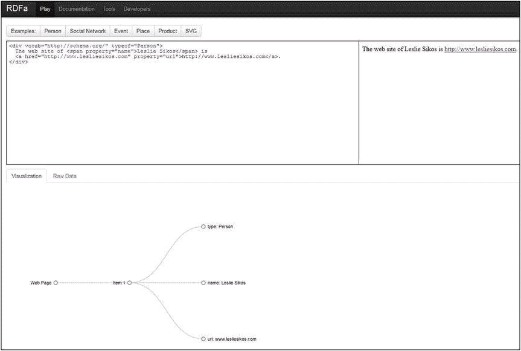

图 4-2。

Live browser preview and graph in RDFa Play

RDFa Play 提供了使用 schema.org 的人员、事件和地点的 RDFa 注释示例，用 FOAF 表示的个人数据，用 GoodRelations 表示的产品描述，以及用 SVG 表示的 Dublin Core 元数据。

### RDFa 1.1 蒸馏器和解析器

W3C 的 RDFa 1.1 Distiller 和 Parser at [`http://www.w3.org/2012/pyRdfa/`](http://www.w3.org/2012/pyRdfa/) 处理包含 RDFa 的 HTML 标记，并将三元组转换为 Turtle、RDF/XML、JSON-LD 或 N-Triples。RDFa 1.1 Distiller 和 Parser 是用 Python 编写的，由 RDFLib ( [`https://rdflib.readthedocs.org`](https://rdflib.readthedocs.org/) )提供支持。它接受在线 RDFa 代码片段、上传的文件以及复制和粘贴的 RDFa 注释。文件上传和直接输入支持的主机语言有 HTML5+RDFa、XHTML+RDFa、SVG+RDFa、Atom+RDFa 和 XML+RDFa。

### RDF 蒸馏器

位于 [`http://rdf.greggkellogg.net/distiller`](http://rdf.greggkellogg.net/distiller) 的 RDF Distiller 将 RDF 图、阅读器和编写器集成到 Ruby 项目中。distiller 可以用来在不同的 RDF 序列化之间转换数据。web 界面提供了一个表单，该表单通过 URI 接收用户输入，或者作为 JSON、JSON-LD、HTML5 微数据、N3、N-Quads、N-Triples、RDFa、RDF/XML、TRiG、TRiX 或 Turtle 中的直接输入，并将代码转换为任何格式(参见图 [4-3](#Fig3) )。

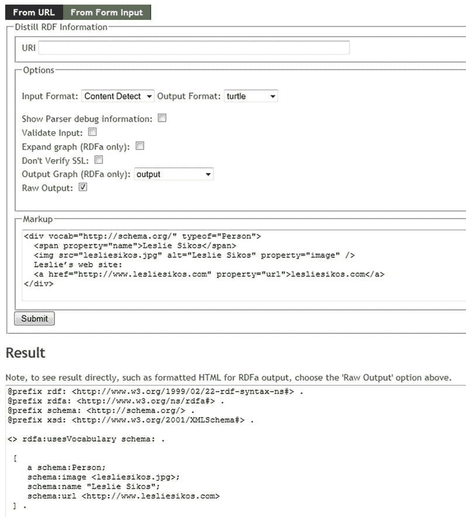

图 4-3。

RDFa to Turtle conversion in RDF Distiller

Distiller 可以自动检测输入格式，也可以从下拉列表中明确选择。

### DBpedia 聚焦

DBpedia Spotlight 是一个用纯文本[ [7](#Sec51) ]注释 DBpedia 概念的工具。它有三个基本功能:注释、消歧和标记候选项。DBpedia Spotlight 的 web 应用程序通过 DBpedia 资源注释可视化用户输入(参见图 [4-4](#Fig4) )。

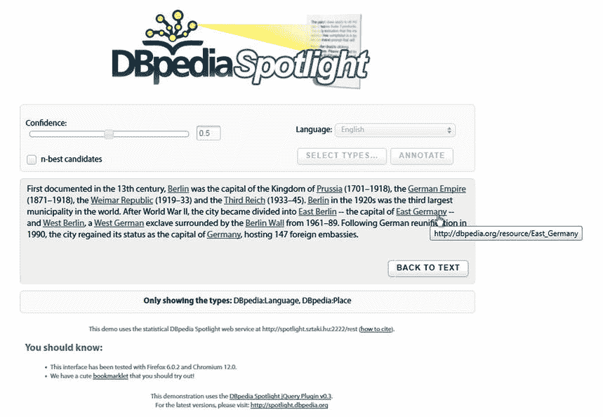

图 4-4。

Annotation with DBpedia Spotlight

RESTful 的、基于 SOAP 的 web API 公开了注释和消除实体歧义的功能。注释 Java/Scala API 公开了执行注释或消除歧义的底层逻辑。索引 Java/Scala API 执行必要的数据处理，以启用所使用的注释或歧义消除算法。

### 谷歌结构化数据测试工具

位于 [`http://www.google.com/webmasters/tools/richsnippets`](http://www.google.com/webmasters/tools/richsnippets) 的 Google 结构化数据测试工具适用于机器可读的元数据测试，包括微格式、RDFa 和 HTML5 微数据注释在线或通过直接输入。直接输入的代码长度限制为 1500 个字符。该工具提供了谷歌在搜索引擎结果页面(SERPs)上对你的网站的预览，以及提取的结构化数据，如项目、类型和属性(见图 [4-5](#Fig5) )。

图 4-5。

Triples extracted by the Google Structured Data Testing Tool

该工具可以识别不完整的三元组，并在缺少任何强制属性时提供简短的解释。Google 结构化数据测试工具也指出了不属于用于对象的词汇表的属性。

Note

如果特定对象类型的某些属性缺失，Google 不会在搜索引擎结果页面上使用机器可读的元数据注释。例如，只有当你不仅提供了`name`，而且还提供了以下三个属性中的至少两个时，一个 hCard 描述才会被 Google 使用:`organization`、`location`或`role`，而代码有效性即使你省略了它们也是可以实现的。

该工具为应用程序、作者、事件、音乐、人、产品、产品报价、食谱和评论提供了机器可读的元数据示例；但是，您必须登录您的 Google 帐户来检索示例的 HTML 标记。所有其他功能无需登录即可使用。

## RDFizers

那些将应用程序和网站数据转换成 RDF 的软件工具被称为 RDFizers。它们可以用于一次性迁移工作，或者作为语义 Web 软件工具(如 OpenLink Data Explorer)的中间件组件来实现。RDFizers 通常以软件库的形式提供。

### 阿帕奇 Any23

Apache any To Triples(any 23)是一个 Java 库、RESTful web 服务和命令行工具，可在 [`https://any23.apache.org`](https://any23.apache.org/) 获得。Any23 从各种 Web 文档中提取结构化数据，包括 RDF 序列化，如 RDF/XML、Turtle、Notation 3 和 RDFa 微格式，如 Adr、Geo、hCalendar、hCard、hListing、hRecipe、hReview、License、XFN 和 SpeciesHTML5 微数据；JSON-LD；CSV(例如，从 Microsoft Excel 导出的逗号分隔值)；以及诸如 Dublin Core、DOAP、FOAF、GeoNames、开放图形协议、schema.org 和 vCard 等词汇。Any23 也可以用于数据转换，如 Turtle 到 N-Triples。

Apache Any23 可以执行代码质量保证的验证。如果检测到不正确的 HTML 元素嵌套，它会自动修复 DOM 结构。Any23 不仅可以识别结构化标记元素，还可以识别`meta`标签和 RDFa 注释。例如，如果一个 RDFa 注释缺少前缀映射，RDFa 解析器将会发现它脱离了上下文，并且不能处理它。为了解决这个问题，Apache Any23 提供了`Validator`类来实现一个`Rule`先决条件，当匹配时，将触发`Fix`方法来纠正代码。

由于其全面的特性，Any23 在主要的语义 Web 应用程序中实现，如 Sindice。

### 文本工程通用架构(GATE)

由谢菲尔德大学开发的开源文本处理器工具文本工程通用架构(GATE)使用自然语言处理(NLP)方法从文本文件[ [8](#Sec51) ]生成 RDF。GATE 的本体插件提供了一个 API 来操作 OWL-Lite 本体，可以序列化为 RDF 和 RDFS。如果使用 OWL-DL 本体，通常会显示 OWL-Lite 支持的限制的子类，但不会显示其他限制的子类。类似地，普通的 RDF/RDFS 文件也不会正确显示，因为 API 无法表示 RDF 中允许但 OWL-Lite 中不允许的许多结构。

### OpenRefine

OpenRefine 是一个工具，用于探索大型数据集，清理数据并将数据从一种格式转换为另一种格式，协调和匹配数据，用 web 服务扩展数据，并将数据链接到 LOD 数据库[ [9](#Sec51) ]。使用 OpenRefine，您可以使用正则表达式对数据进行筛选和分区，对全文字段使用命名实体提取来自动识别主题，以及使用通用 Refine 表达式语言执行高级数据操作。

## 本体编辑器

本体编辑器是专门为本体工程设计的软件工具。它们涵盖了本体开发所有主要阶段的共同任务，即它们

*   确定领域和范围。本体将覆盖的知识领域是什么？潜在的实施领域是什么？它打算回答什么类型的问题？
*   考虑重用。评估相似知识领域的其他本体。
*   列举重要术语。为所选的知识领域创建一个全面的术语列表，而不关注类层次结构、属性、重叠术语或关系。
*   定义类和类层次结构。
*   定义属性和属性的特征。定义属性类型，包括简单的属性和与类、域和范围的关系，以及通用、存在和基数限制。
*   创造个体。

### 受保护的

斯坦福大学的 Protégé是应用最广泛的开源本体编辑器和知识管理工具集，可以从 [`http://protege.stanford.edu`](http://protege.stanford.edu/) 下载。它支持诸如 HermiT 和 FaCT++等推理器来验证本体的一致性，以及各种其他插件。Protégé最初是作为一个学习健康系统开发的，用于将原始生物医学数据转换为机器可读数据以进行决策，现在适用于建模、本体驱动的应用程序开发和协作本体工程。本体可以以多种格式导出，比如 RDFS 和各种 OWL 语法。

虽然可以通过图形用户界面(GUI)在 Protégé中创建本体，但该软件是基于 Java 的，因此当它被执行时，它会在一个单独的窗口中打开 GUI 后面的命令行(参见图 [4-6](#Fig6) )。在 Protégé中创建的本体可以通过 Protégé-OWL API 从 Java 程序中访问。

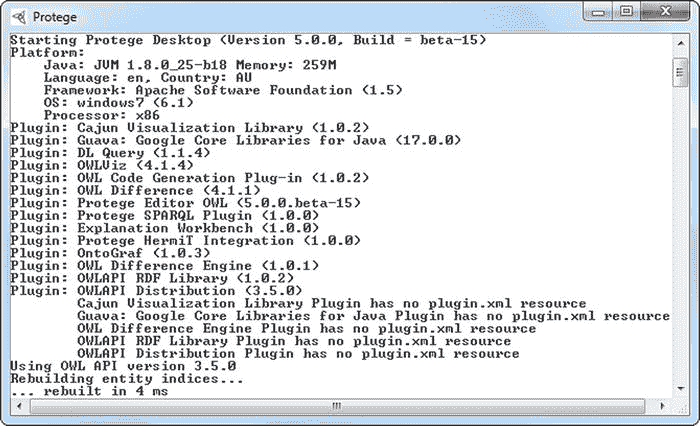

图 4-6。

Protégé’s command line

Protégé的 GUI 具有主菜单、地址栏和基于选项卡的编辑器(见图 [4-7](#Fig7) )。

图 4-7。

Protégé’s Graphical User Interface

在文件菜单中，您可以创建一个新的空本体，或者从离线或在线`.owl`文件中打开一个本体。本体可以保存为多种格式，包括 RDF/XML、OWL/XML、OWL 函数语法、曼彻斯特语法、OBO(开放生物医学本体格式)、KRSS2(知识表示系统规范 v2)、Latex 或 Turtle。可以从该菜单下载 Protégé可用的各种插件，也可以更新已安装的插件。

在文件➤首选项下，您可以处理隐藏的注释 uri。为了更容易地自动生成本体的类、属性和个体的唯一标识符，您可以为特定的本体设置或修改实体 URIs 的结构。一旦你设置了本体的基本 URI，本体的所有片段标识符都将以这个地址开始，以后可以随时修改(在文件➤首选项中的新本体标签)。如果在创建本体之后必须更改地址结构，这将非常有用，因为开发人员不必逐个手动更改成百上千个地址。默认的基本 URI 可以是您选择的 web 地址，并且路径可以选择性地包括实际的年、月和日。基本 URI 通常以`#`结尾，但如果需要的话，这可以更改为`/`或:(“文件➤”首选项中的“新实体”选项卡)。但是，数字符号是默认设置，因为它创建有效的片段标识符。您可以将实体 URIs 的结尾设置为任意名称，这是默认选择。如果要使用自动生成的标识符，可以设置实体标签，包括自定义 URIs 和全局唯一的前缀或后缀。

OWLViz 是一个默认安装的 Protégé插件，支持 OWL 本体的类层次结构的图形化表示，以及以树结构表示的类之间的导航(文件➤首选项中的 OWLViz 选项卡)。OWLViz 使得断言的类层次结构和推断的类层次结构的比较成为可能。默认情况下，Protégé会在程序启动时自动检查插件更新，这也可以禁用(“文件”“➤”偏好设置中的“插件”标签)。默认的插件存储库设置为 GitHub，可以更改。“文件➤”首选项中的“推理器”选项卡可以显示或隐藏类、对象属性、数据属性和对象推理，或者通过设置预计算任务(如启动推理器时要完成的分类或实现)来初始化推理器。通过设置自动扩展深度限制(默认值为`3`)和自动扩展子计数限制(默认值为`50`)，可以在文件➤首选项中的树首选项下自动扩展树层次结构。默认情况下，自动树扩展是禁用的。通过单击文件➤首选项右下角的重置首选项…按钮，可以恢复在任何选项卡上意外执行的更改。

核心功能和视图通过选项卡提供。Active Ontology 选项卡显示一般的本体元数据，如标题、创建者、描述，以及重用的本体和关于本体度量的统计数据，如公理、类、对象属性、个体等的数量。Protégé还显示在打开的本体中使用的所有前缀。Protégé具有一个用于实体、类、对象属性、数据属性、注释属性和个人的专用选项卡。类层次结构显示为树形结构，其中每个节点可以单独打开或关闭。选定的实体、类或属性详细信息显示在单独的面板中。类描述提供了关于等价类、子类、类公理、成员等的信息。，以及更改值或添加新值的选项。Protégé中的类是`Thing`的子类，默认情况下是重叠的。可以从“工具”菜单创建类层次结构。对象或数据类型属性可以有子属性或相反的属性。这些属性可以是功能性的、传递性的、对称的、非对称的、自反的或非自反的。Protégé自动更新逆属性(比如一个家族关系本体中的`hasChild`和`isSonOf`)。

“对象特性”和“数据特性”选项卡也有一个“特性”面板。对于对象属性，“特征”面板具有用于`Functional`、`Inverse functional`、`Transitive`、`Symmetric`、`Asymmetric`、`Reflexive`和`Irreflexive`属性的复选框。Individuals 选项卡不仅显示了类层次结构，还显示了成员列表和属性断言。OntoGraf 选项卡提供了本体任何部分的可视化表示(见图 [4-8](#Fig8) )。当您将鼠标悬停在图形的任何部分时，Protégé会显示片段标识符，以及子类/超类(如果有)。

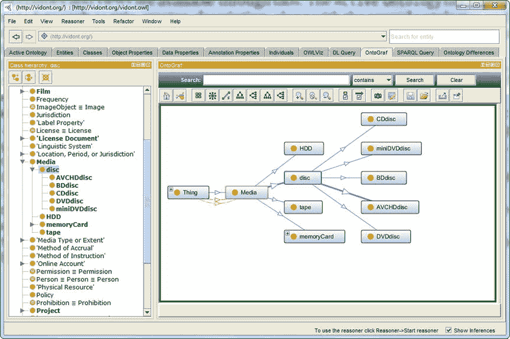

图 4-8。

Graph visualization in Protégé

SPARQL 查询选项卡提供了执行 SPARQL 查询的界面。Protégé枚举前缀，提供可编辑的`SELECT`查询模板，您可以修改或删除该模板，并添加任意查询。

Protégé在 [`http://webprotege.stanford.edu`](http://webprotege.stanford.edu/) 也有网络版，有协作支持。

### 语义工程

Altova 的 SemanticWorks 是一个可视化语义 Web 编辑器，具有图形化的 RDF 和 RDFS 编辑器以及图形化的 OWL 编辑器，支持 OWL-Lite、OWL-Full 和 OWL-DL 方言[ [10](#Sec51) ]。SemanticWorks 提供了语法和格式检查选项，以及与错误直接链接的本体语义评估。根据所使用的序列化，上下文相关的输入帮助器显示有效输入选项的列表。SemanticWorks 可以生成 RDF/XML 和 N-Triples 格式的代码，并将 RDF/XML 转换为 N-Triples，反之亦然。该程序具有 RDF 和 OWL 图的打印选项。可以使用智能快捷方式定义新的类实例。实例、属性和类被组织在选项卡上，并且类似于软件工程环境，属性和属性值也可以通过单独的子窗口来操作。当编辑大型、复杂的图表时，当图表的当前显示部分被指示为红色矩形时，Overview 子窗口非常有用。您可以随时在图和代码视图之间切换。

### 顶辫作曲家

TopQuadrant 的 TopBraid Composer 是一个用于数据建模和语义数据处理的图形化开发工具。免费标准版支持 RDF、RDFS、OWL 和 SPARQL 等标准，还支持可视化编辑和查询，以及数据转换[ [11](#Sec51) ]。商业 Maestro 版提供了一个模型驱动的应用程序开发环境[ [12](#Sec51) ]。Composer 还是一个 RDFizer，它可以将 Excel 电子表格转换成 RDF 模式的实例。

TopBraid Composer 可以打开以 RDF/XML 或 Turtle 序列化的本体，将 RDFa 数据源、RSS 或 Atom 新闻提要以及电子邮件导入 RDF。它可以连接到 SPARQL 端点以及 RDBMS 源，导入制表符分隔的电子表格文件和 Excel 电子表格、在线 RDF 和 OWL 文件、UML 文件、XML 模式和 XML 目录。向导将指导您创建新项目，例如分面项目资源、来自 CSV 文件的项目、JavaScript 项目、静态 web 项目以及 XML 编辑和验证。您可以使用 RDFa 和 HTML5 微数据注释创建标记文件，并开发语义 web 应用程序和到耶拿 SDB 数据库、耶拿 TDB 数据库、Oracle 数据库和 Sesame 2 存储库的 RDF/OWL 文件连接。图形用户界面具有用于类、可视化表示(图表和图形)和源代码、属性、文件系统导航、导入和“篮子”的面板(参见图 [4-9](#Fig9) )。

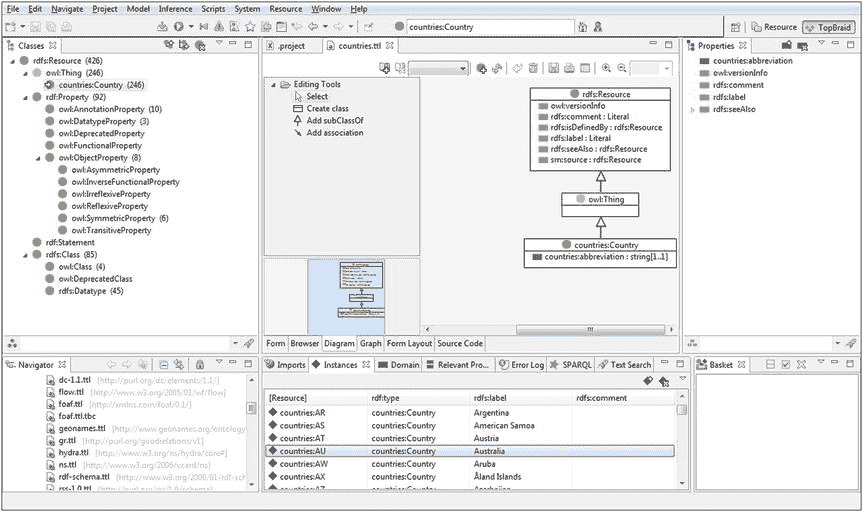

图 4-9。

Ontology editing with TopBraid Composer Maestro

在 Classes 面板上，您可以在以树状结构表示的本体中导航，创建和删除类，创建子类和兄弟类，按名称空间对组件进行分组，以及按名称进行搜索。除了属性操作，属性面板还集成了 GoogleMaps。在 Imports 面板上，可以显示资源及其`rdf:type`、`rdfs:label`和`rdfs:comment`值(如果提供的话)，以及规则、实例、错误、SPARQL 查询和文本搜索。在“暂存架”面板上，您可以从文本文件加载内容，也可以将内容保存到文本文件。添加选定的资源；添加匹配的属性；添加子类、子属性、实例、个体和取消引用资源。并执行批处理操作。

### 阿帕哈奇·斯坦布尔

Apache Stanbol 是一个语义数据建模器和全面的本体管理器[ [13](#Sec51) ]。

它包括一个内容管理系统，支持语义 web 服务和 Web 应用程序功能，如标签提取、搜索字段中的文本完成和基于提取的实体的电子邮件路由。Stanbol 组件的功能可以通过 RESTful web 服务 API 获得。RESTful 服务返回 RDF、JSON 和 JSON-LD 格式的结果。Apache Stanbol 可以作为一个独立的应用程序(打包成一个 runnable JAR)运行，也可以作为一个 web 应用程序(打包成`.war`)运行，部署在 servlet 容器中，比如 Apache Tomcat。它兼容 Apache 框架，如 Solr(用于语义搜索)、Tika(用于元数据提取)和 Jena(用于存储)。

Stanbol 有一个内置的 RDFizer，它处理 POST 请求中发送的传统 web 内容，内容类型在 Content-type 头中指定，并向其中添加语义信息(“RDF 增强”)，以 Accept 头中指定的格式序列化。

Stanbol 还提供了一个推理器组件，它实现了一个通用的 API，并通过基于 OWLApi 和 Jena 的抽象服务支持不同的推理器和配置，实现了 Jena RDFS、OWL、OWLMini 和 HermiT。推理器模块可以执行一致性检查，如果数据一致，则返回 HTTP 状态 200，如果不一致，则返回 204。推理机也可以用于分类，换句话说，物化所有推断出的`rdf:type`语句。语义丰富具体化了所有推断的陈述。

Apache Stanbol 本体管理器通过互连不同本体中表示的看似不相关的知识、本体库、中央本体储存库以及常见的本体工程任务(如推理和规则执行)来支持多个本体网络。Stanbol 还可以存储和缓存语义信息，并通过其持久性服务使其可搜索。

### 流畅的编辑器

Fluent 编辑器是一个本体编辑器，可以处理 RDF、OWL、SWRL 文件[ [14](#Sec51) ]。Fluent Editor 使用一种专有的表示语言和与语义网标准兼容的查询语言。这个工具是为管理复杂的本体而设计的。它有一个推理器窗口、一个查询 SPARQL 窗口、一个 XML 预览窗口、一个分类树视图和一个注释窗口。Fluent Editor 有两种类型的插件:Protégé互操作性插件，它支持向 Protégé导出数据和从 protégé导入数据；R 语言插件，它支持使用 R 和 rOntorion 开发分析模型，以及使用 R 语言开发 Fluent Editor 的插件。

## 本体分析工具

存在用于本体映射的软件工具和通用本体编辑器不支持的特定本体工程任务，例如语义相似性估计。

### 拉远

ZOOMA 是一个应用程序，使用映射库[ [15](#Sec51) ]来发现最佳的本体映射和文本值到本体术语的自动映射。ZOOMA 可以重用数据库中已经断言的映射，探索最适合多个映射的映射，通过记录上下文信息导出更好的映射，并建议新的术语。可以自动处理通常观察到的值。

ZOOMA 会自动找到所有最佳映射，每次一个文本值映射到同一组术语。当使用映射存储库时，它可以检测错误，换句话说，它可以找到所有可能不正确的文本值到本体术语的映射。ZOOMA 还可以根据输入值提出新的术语映射；然而，选择最佳映射需要人工评估和评价。ZOOMA 可以很容易地用作软件库，例如，在 Apache Maven 项目中。

### 语义度量库

语义度量库(Semantic Measures Library，SML)是一个用于语义度量分析的 Java 库，例如通过使用本体来定义术语或概念之间的距离来估计语义相似性和相关度[ [16](#Sec51) ]。SML 的功能也可以通过一套名为 SML 工具包的命令行工具来访问。该库支持 RDF 和 RDFS、OWL 本体、WordNet(一个词汇数据库)、医学主题词(MeSH，一个用于生命科学出版的受控词汇)、基因本体等等。

## 推理者

推理机从现有的本体中获得新的事实，并检查本体的完整性。由于为描述逻辑推理实现的算法不同，各种软件工具在推理特性、实际可用性和性能方面是不同的。不是所有的推理机都能评估所有可能的推论，所以它们的健全性和完备性各不相同。一些本体支持将本体与规则相结合的规则。推理机的一个共同特征是 ABOX 推理，个体的推理包括实例检查、合取查询回答和一致性检查。高级推理器支持 OWL API，这是一个使用 OWL 推理进行应用程序开发的标准接口。高级推理机的另一个特性是 OWLLink 支持，利用实现中立的协议与 OWL 2 推理机进行交互。

### 隐士

HermiT 是最流行的 OWL 2 推理机之一，可用于确定本体一致性，识别类之间的关系，并执行进一步的任务[ [17](#Sec51) ]。HermiT 使用自己的算法，称为“hypertableau”演算，来检查 OWL 本体的一致性，并识别类之间的包含关系。隐士可以通过命令行或者在 Java 应用程序中被用作门徒插件(见图 [4-10](#Fig10) )。最新的 Protégé版本带有预装的隐士插件。从命令行，您可以执行分类、查询和其他常见的推理任务。至于 Java 应用程序，HermiT 支持来自 OWL API 的 OWLReasoner 接口，提供对 OWL API 对象的访问，比如本体和类表达式。

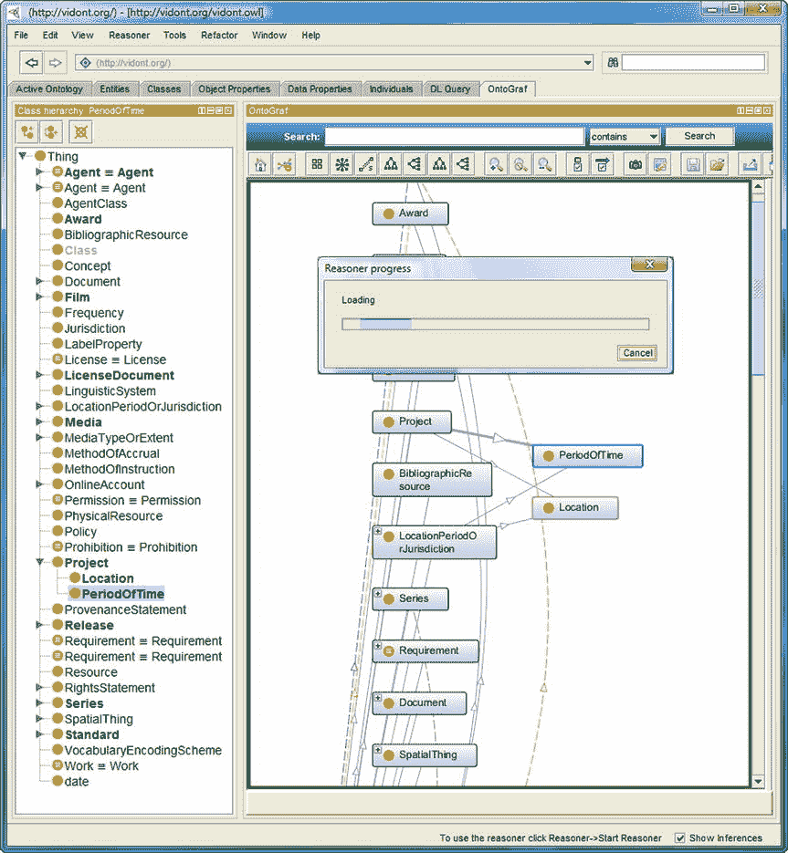

图 4-10。

The HermiT reasoner running in Protégé

### 小球

Clark & Parsia 的 Pellet 是一个 OWL 2 DL 推理器，可以在 Protégé、Jena、TopBraid Composer 中使用，也可以通过 OWL API 接口[ [18](#Sec51) ]在 Java 程序中使用。它基于 tableau 算法将复杂的语句分解成更小更简单的片段来检测矛盾，并支持表达性描述逻辑。Pellet 支持不同的增量推理，包括增量一致性检查和增量分类，其中更新(添加或删除)可以被处理并应用于本体，而不必从头执行所有的推理步骤。佩莱也支持用 SWRL 规则进行推理。它提供合取查询应答，并支持 SPARQL 查询。Pellet 通过 Jena 和 OWL API 推理本体。Pellet 也支持 bug 的解释。

### 事实++

FaCT++是一个基于 tableaux 的 OWL 2 DL 推理机 [3](#Fn3) [ [19](#Sec51) 。它可以用作描述逻辑分类器和模态逻辑可满足性测试。它为可表达的描述逻辑实现了一个可靠和完整的 tableau 算法。FaCT++可以作为一个独立的工具、一个被保护的插件来使用，并且可以通过 OWL API 在应用程序中使用。

### 比赛者

Racer(重命名为 ABox 和概念表达式推理器)是一个用于构建基于本体的应用程序的服务器端推理器，可通过 Java 和公共 Lisp API[[20](#Sec51)]获得。Racer 不仅提供了标准的推理机制，还提供了逻辑推理。它为描述逻辑 SRIQ (D) 实现了高度优化的 tableau 演算。Racer 支持 RDF 数据描述和 OWL 2 本体的一致性检查，可以同时打开多个本体进行本体合并。它可以找到由本体的公理归纳出的隐含子类关系，并找到属性、类或实例的同义词。Racer 可以通过 SPARQL 查询从 OWL/RDF 文档中检索信息，还支持增量查询。它支持事实优化技术以及对数量限制和 ABoxes 的优化。

## 应用开发框架

软件库中收集了最常见的编程任务，因此您不必编写经常使用的代码。例如，在语义 Web 应用程序中，一个常见的任务是将 RDF 文件从一种序列化转换为另一种序列化，这可以通过 Apache Jena 等工具轻松完成。这种软件库可以在各种环境中使用，例如通过命令行或作为集成开发环境(IDE)如 Eclipse 或 NetBeans 的插件。

### 耶那

Apache Jena 是一个开源的语义网和链接数据应用开发框架，支持以 RDF [ [21](#Sec51) ]编写的结构化数据的存储、检索和分析。

Jena 的核心 RDF API 有专门的方法来提取 RDF 语句的主语、宾语和谓语，比如返回语句的`Resource`的`getSubject()`、`RDFNode`的`getObject()`和返回语句的`Property`的`getPredicate()`。使用 Jena RDF API，您可以轻松地创建和操作 RDF 图，这些图在 Jena 中被称为模型，由`Model`接口表示。例如，使用 RDF API 描述一个人，首先定义对象的 URI 或主题和字符串(参见清单 [4-1](#FPar2) ，然后使用`createDefaultModel()`方法创建一个空的、基于内存的`Model`(参见清单 [4-2](#FPar3) )。

Listing 4-1\. Constant Declaration in Jena

`static String personWebsite  = "`[`http://www.lesliesikos.com`](http://www.lesliesikos.com/)T2】

`static String personName = "Leslie Sikos";`

Listing 4-2\. Creating a Memory-Based Model

`Model model = ModelFactory.createDefaultModel();`

将使用`Model`创建资源(参见清单 [4-3](#FPar4) )。

Listing 4-3\. Creating a Resource

`Resource lesliesikos = model.createResource(personWebsite);`

最后，使用`addProperty`向资源添加一个属性(参见清单 [4-4](#FPar5) )。

Listing 4-4\. Adding Property to a Resource

`lesliesikos.addProperty(FOAF.Name, personName);`

为了从 RDF 图(Jena 模型)中检索语句，可以使用`listStatements()`方法(参见清单 [4-5](#FPar6) )。

Listing 4-5\. Extracting RDF Triples

`StmtIterator iter = model.listStatements();`

如果您需要更多的细节，您可以列出 RDF 图中所有的谓词、主题和对象，如清单 [4-6](#FPar7) 所示。

Listing 4-6\. Listing All Triple Components Individually

`while (iter.hasNext()) {`

`Statement stmt      = iter.nextStatement();`

`Resource  subject   = stmt.getSubject();`

`Property  predicate = stmt.getPredicate();`

`RDFNode   object    = stmt.getObject();`

`System.out.print(subject.toString());`

`System.out.print(" " + predicate.toString() + " ");`

`if (object instanceof Resource) {`

`System.out.print(object.toString());`

`} else {`

`System.out.print(" \"" + object.toString() + "\"");`

`}`

`System.out.println(" .");`

`}`

Jena 支持 SPARQL 查询，包括通过 JDBC 驱动程序框架的 SPARQL。事实上，它可以使用 Fuseki 通过 HTTP 提供 RDF 数据，fuse ki 是一个 SPARQL 服务器，提供 REST 风格的 SPARQL HTTP 更新、SPARQL 查询和 SPARQL 更新[ [22](#Sec51) ]。Jena 规则引擎和其他推理算法可以从 RDF 模型中导出结果。推理 API 提供了扩展和检查 triplestore 内容的推理。你不仅可以使用内置的 OWL 和 RDFS 推理器，还可以配置自己的推理规则。Jena 本体 API 可以处理数据模型、RDFS 和 OWL，包括对 OWL 1.1 特性的部分支持。Jena 有自己的高性能 triplestore 组件，称为 TDB，它将三元组直接存储到磁盘，并可以从 Java 虚拟机直接访问。SQL DB 使用关系数据库为 Jena 提供了一个持久的 triplestore，即一个用于 RDF 数据存储和查询的 SQL 数据库。Jena 支持高级文本和空间搜索。Jena 可以集成到 Eclipse 中，Eclipse 是 Java 开发人员常用的软件开发环境。

### 芝麻

Sesame 是一个用于 RDF 数据分析和 SPARQL 查询的开源框架[ [23](#Sec51) ]。Sesame 框架实现的方法与其他语义框架的不同之处在于，它具有可扩展的接口，并且存储引擎与查询接口相分离。Alibaba 是一个芝麻 API，用于将 Java 类映射到本体，并从本体生成 Java 源文件，使得从 Java 直接利用 RSS、FOAF 和 Dublin Core 成为可能。Sesame 将其 RDF triplestore 作为 Java web 应用程序(`.war`)提供，可以很容易地部署到 Apache Tomcat 或 Eclipse Jetty 等应用服务器上。它支持基于内存(MemoryStore)和基于磁盘(NativeStore)的存储。RDF triplestore 提供了一个 SPARQL 查询端点。Sesame 可以集成到 Eclipse 和 Apache Maven 等软件开发环境中。

存储库 API 提供了数据文件上传、查询、提取和操作的方法。它的一个实现 SailRepository 将调用转换为您选择的 SAIL 实现，而另一个实现 HTTPRepository 通过 HTTP 提供与 Sesame 服务器的透明客户端-服务器通信。Sesame 最顶层的组件 HTTP 服务器拥有 Java servlets，用于通过 HTTP 访问 Sesame 存储库。使用 Sesame 的存储库 API，您可以直接从您的应用程序创建一个本地存储库，能够存储、查询和修改 RDF 数据(参见清单 [4-7](#FPar8) )。

Listing 4-7\. Creating a Basic Local Repository in Sesame

`import org.openrdf.repository.Repository;`

`import org.openrdf.repository.sail.SailRepository;`

`import org.openrdf.sail.memory.MemoryStore;`

`…`

`Repository repo = new SailRepository(new MemoryStore());`

`repo.initialize();`

这个存储库将使用主内存来存储数据，这是目前最快的 RDF 存储库类型。但是，创建的存储库是易变的，这意味着当对象被垃圾收集或程序执行完成时，内容会丢失。对于持久存储，您需要将数据保存到一个文件中(参见清单 [4-8](#FPar9) )。

Listing 4-8\. Creating a Local Repository with File Storage in Sesame

`import org.openrdf.repository.Repository;`

`import org.openrdf.repository.sail.SailRepository;`

`import org.openrdf.sail.nativerdf.NativeStore;`

`…`

`File dataDir = new File("/path/to/datadir/");`

`Repository repo = new SailRepository(new NativeStore(dataDir));`

`repo.initialize();`

要创建一个具有 RDF 模式推理的存储库，您必须创建一个`Repository`对象，方法是将一个引用传递给适当的`Sail`对象(参见清单 [4-9](#FPar10) )。

Listing 4-9\. Creating a Repository with RDF Schema Inferencing

`import org.openrdf.repository.Repository;`

`import org.openrdf.repository.sail.SailRepository;`

`import org.openrdf.sail.memory.MemoryStore;`

`import org.openrdf.sail.inferencer.fc.ForwardChainingRDFSInferencer;`

`…`

`Repository repo = new SailRepository(`

`new ForwardChainingRDFSInferencer(`

`new MemoryStore()));`

`repo.initialize();`

如果你使用远程 Sesame 服务器而不是本地的，远程连接必须通过初始化`RemoteRepositoryManager`来建立(参见清单 [4-10](#FPar11) )。

Listing 4-10\. Initializing a `RemoteRepositoryManager`

`import org.openrdf.repository.manager.RemoteRepositoryManager;`

`…`

`String serverUrl = "http://localhost:8080/openrdf-sesame";`

`RemoteRepositoryManager manager = new RemoteRepositoryManager(serverUrl);`

`manager.initialize();`

存储和推理层 API (SAIL)将存储和推理分开。SAIL API 主要由 triplestore 开发人员使用。RIO API 代表“RDF I/O”，包含用于 RDF 序列化的解析器和写入器。解析器可以将 RDF 文件转换成语句，而编写器可以将语句转换成 RDF 文件。RIO API 可以独立于所有其他的 Sesame 组件使用。

RDF 模型 API 定义了 RDF 构建块的表示，如语句、URIs、空白节点、文字、图形和模型。RDF 语句由`org.openrdf.model.Statement`接口表示，其中每个语句都有一个主语、谓语、宾语和(可选的)上下文。其中每一项都是一个`org.openrdf.model.Value`，涵盖了`org.openrdf.model.Resource`和`org.openrdf.model.Literal`。每个资源代表一个 RDF 值，它或者是一个空节点(`org.openrdf.model.BNode`)或者是一个 URI ( `org.openrdf.model.URI`)。文字表示 RDF 文字值，如字符串、日期和整数。可以使用`org.openrdf.model.ValueFactory`创建新的三元组和值(参见清单 [4-11](#FPar12) )。

Listing 4-11\. Using a Default `ValueFactory` Implementation

`ValueFactory factory = ValueFactoryImpl.getInstance();`

一旦获得了 ValueFactory，就可以创建新的 URIs、文本和三元组(参见清单 [4-12](#FPar13) )。

Listing 4-12\. Adding URIs, Literals, and Triples to a `ValueFactory` Implementation

`URI webstand = factory.createURI("`[`http://yourbookdataset.com/webstand`](http://yourbookdataset.com/webstand)T2】

`URI title = factory.createURI("`[`http://yourbookdataset.com/title`](http://yourbookdataset.com/title)T2】

`Literal webstandsTitle = factory.createLiteral("Web Standards");`

`Statement titleStatement = factory.createStatement(webstand, title, webstandsTitle);`

Graph API 将 RDF 图表示为 Java 对象。`org.openrdf.model.Graph`类处理来自 Java 代码的 RDF 图。可以通过两种方式创建图:通过向图中添加语句以编程方式编写图，或者使用构造查询创建图。空图可以通过创建一个`GraphImpl`对象来获得(参见清单 [4-13](#FPar14) )。

Listing 4-13\. Creating an Empty Graph

`Graph myGraph = new org.openrdf.model.impl.GraphImpl();`

接下来，RDF 语句组件(主谓宾)必须使用`ValueFactory`对象来创建(参见清单 [4-14](#FPar15) )。这使图准备好支持三元组，并将`WebDesignBook`主语、`Title`谓语和`Web Standards`宾语添加到图中。

Listing 4-14\. Adding Triple Support to a Graph

`ValueFactory myFactory = myGraph.getValueFactory();`

`String namespace = "``http://www.foo.com/bar#`T2】

`URI mySubject = myFactory.createURI(namespace, "WebDesignBook");`

`URI myPredicate = myFactory.createURI(namespace, "Title");`

`Literal myObject = myFactory.createLiteral("Web Standards");`

`myGraph.add(mySubject, myPredicate, myObject);`

另一种选择是直接使用 URIs 来添加属性(参见清单 [4-15](#FPar16) )。

Listing 4-15\. Using URIs Directly to Add Triples to a Graph

`URI bookClass = myFactory.createURI(namespace, "Book");`

`URI rdfType = myFactory.createURI(org.openrdf.vocabulary.RDF.TYPE);`

`mySubject.addProperty(rdfType, bookClass);`

## 集成开发环境

集成开发环境(ide)为高效的语义 Web 应用程序开发提供了一个接口，包括一个源代码编辑器，其中突出显示了各种编程语言(如 Java 和 Python)的语法。ide 有向导和内置的应用程序来简化软件开发、文件处理程序和其他工具来支持部署、运行和测试应用程序。ide 由运行时系统、工作台和其他特性组成，比如远程调试器或数据建模器。

### 黯然失色

Eclipse 是 Java 开发人员最受欢迎的 IDE 之一，它提供了基本的工具，如 Java IDE、CVS 客户端、Git 客户端、XML 编辑器和 Apache Maven 集成[ [24](#Sec51) ]。

Eclipse 是使用 Apache Jena 和 Sesame 的流行 ide 之一。Eclipse 的安装可以按如下方式完成:

A prerequisite of Eclipse is the Java Development Kit (JDK). Download it from [`http://www.oracle.com/technetwork/java/javase/downloads/`](http://www.oracle.com/technetwork/java/javase/downloads/) and install it (Figure [4-11](#Fig11)).

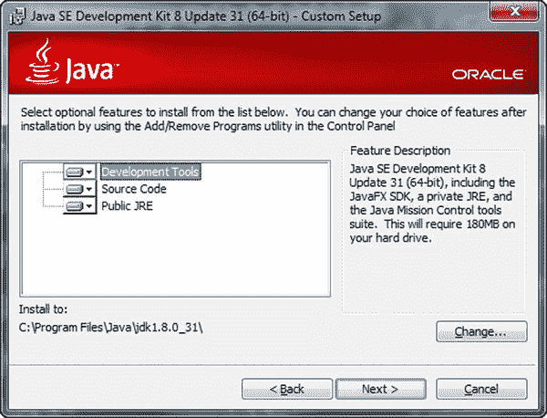

图 4-11。

Installing the Java Development Kit for Eclipse   Caution

Java 开发工具包不同于 Java 运行时环境(JRE)，也称为 Java 虚拟机(JVM)，它是一种在您的计算机上运行 Java 程序的安全计算环境。

Visit [`http://www.eclipse.org`](http://www.eclipse.org/) and download the installer. Eclipse is available for Windows, Linux, and Mac OS X. The Windows binary is distributed as a ZIP archive, the Linux and the Apple installers as gzipped TAR archives.   Extract the installation files and execute `eclipse.exe`.   You have to specify a folder for Eclipse project files. If you want to use the same path every time you launch Eclipse, you can set the folder to the default Eclipse project folder.  

#### 在 Eclipse 中设置 Apache Jena

一旦安装了 Eclipse，就可以设置 Apache Jena 了。

Go to [`http://jena.apache.org/download/`](http://jena.apache.org/download/) , select a download mirror, and download the binary distribution suitable for your platform `(.zip` or `.tar.gz`).   Extract the Jena files from the archive.   In Eclipse, select File ➤ New ➤ Java Project.   Right-click the name of the newly created project and select Properties (or select File ➤ Properties).   Select Java Build Path and click the Libraries tab.   Click Add Library… on the right.   Select User Library as the library type (see Figure [4-12](#Fig12)).

图 4-12。

Load the Apache Jena software library to Eclipse   Click the Next ➤ button on the bottom.   Click User Libraries… on the right.   Click the New… button.   Add a name to your library, such as JenaLib.   Click the Add external JARs… button on the right.   Browse to your Jena directory (`apache-jena-versionNumber`) and go to the `lib` subdirectory.   Select all the `.jar` files (for example, with Ctrl+A) and click Open (see Figure [4-13](#Fig13)).

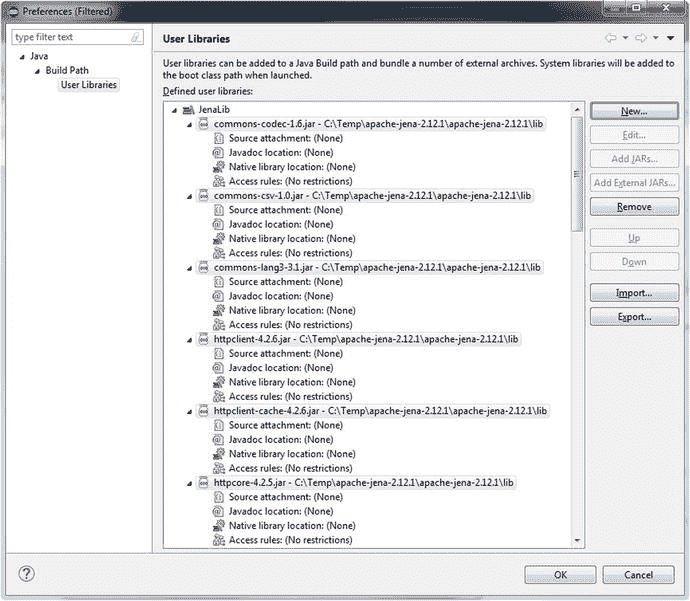

图 4-13。

Apache Jena to be added to the Eclipse project   Click OK.   Click Finish.   Once you click OK, the Jena software library will be added to your Eclipse project.  

为了查看 Jena 库的运行情况，让我们创建一个 Java 程序来将 RDF/XML 序列化的 FOAF 文件转换成 Turtle！

In the Package Explorer, right-click src and select New ➤ Package and create a package.   Click the package name and select New ➤ File.   Specify a file name and click Finish.   Add the file content (type in directly or copy-paste it). If you don’t have a FOAF file yet, create one manually in RDF/XML serialization or generate one using FOAF-a-matic at [`http://www.ldodds.com/foaf/foaf-a-matic.html`](http://www.ldodds.com/foaf/foaf-a-matic.html) . The asterisk (`*`) in front of the file name on the file’s tab indicates that the file has been changed. When you save the file with File ➤ Save or Ctrl+S, the character disappears. Save the file as, for example, `foaf.rdf`.   Note

如果您有 Windows-1252 不支持的字符，Eclipse 会为您提供用 UTF-8 编码保存文件的选项，以避免字符丢失。

Right-click the package and select New ➤ Class and add a name such as `Main` (creates `Main.java`).   Write the code to open the FOAF file and convert it to Turtle serialization using Apache Jena. Import the model (`com.hp.hpl.jena.rdf.model.Model`) and the File Manager of Jena (`com.hp.hpl.jena.util.FileManager`). Using the File Manager, load the model (`FileManager.get().loadModel()`) and write the RDF content out to the standard output (the console) in Turtle using `System.out` (see Listing [4-16](#FPar19)).   Listing 4-16\. Loading and Converting an RDF File Using Jena

`package JenaPackage;`

`import com.hp.hpl.jena.rdf.model.Model;`

`import com.hp.hpl.jena.util.FileManager;`

`public class Main {`

`public static void main(String args[])`

`{`

`FileManager.get().addLocatorClassLoader(Main.class.getClassLoader());`

`Model model = FileManager.get().loadModel("C:/develop/eclipse/workspace/` 

`jenaapp/src/jenapackage/foaf.rdf");`

`model.write(System.out,"TURTLE");`

`}`

`}`

Run the program by clicking the Run button on the top toolbar (white triangle in green circle) or Run under the Run menu. The Console shows the output in Turtle (see Figure [4-14](#Fig14)).

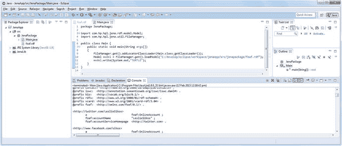

图 4-14。

Using Apache Jena to convert RDF/XML to Turtle  

#### 在 Eclipse 中设置 Sesame

一旦安装了 Eclipse，就可以将 Sesame 添加到您的环境中，类似于 Jena。

Go to [`http://sourceforge.net/projects/sesame/`](http://sourceforge.net/projects/sesame/) and download the binary distribution.   Extract the Sesame files from the archive.   In Eclipse, select File ➤ New ➤ Java Project.   Right-click the name of the newly created project and select Properties (or select File ➤ Properties).   Select Java Build Path and click the Libraries tab.   Click Add Library… on the right.   Select User Library as the library type.   Click the Next > button on the bottom.   Click User Libraries… on the right.   Click the New… button.   Add a name to your library, such as JenaLib.   Click the Add external JARs… button on the right.   Browse to your Sesame directory (`openrdf-sesame-version``Number`) and go to the `lib` subdirectory.   Select all the `.jar` files (for example, with Ctrl+A) and click Open (see Figure [4-15](#Fig15)).

图 4-15。

Adding Sesame to Eclipse   Click OK.   Click Finish.   Once you click OK, the Sesame software library will be added to your Eclipse project.  

要查看 Sesame 库的运行情况，让我们创建一个 Java 程序，初始化一个存储库，并向该存储库添加数据和从中检索数据！

Create a new Java class. To make it easier to write our code, on the New Java Class window, tick the checkbox `public static void main(String[] args)` under Which method stubs would you like to create?   To store RDF data, we first have to create a repository. While there are many different types of repositories, for our example, we need a simple local repository with fast in-memory store (see Listing [4-17](#FPar20)).   Listing 4-17\. Creating a Local Repository in Sesame

`Repository rep = new SailRepository(new MemoryStore());`

然而，要使用这段代码，我们必须手动编写一些`import`语句(参见清单 [4-18](#FPar21) )。

Listing 4-18\. Import Packages from the Sesame Library

`import org.openrdf.repository.Repository;`

`import org.openrdf.repository.sail.SailRepository;`

`import org.openrdf.sail.memory.MemoryStore;`

或者，您可以使用 Ctrl+Shift+O 热键强制自动解析缺失的导入。

Initialize the repository by calling the `rep.initialize()` method.   Add data to the repository. You can add triples directly from Java or load them from external files. In this example, we add some statements directly. To do so, we need a namespace to be used for creating new URIs and a `ValueFactory` for creating `URI`, `BNode`, and `Literal` objects (see Listing [4-19](#FPar22)).   Listing 4-19\. Adding Data to the Repository

`String namespace = "http://example.com/";`

`ValueFactory f = rep.getValueFactory();`

Create a new URI through an identifier for the person `Leslie` (see Listing [4-20](#FPar23)).   Listing 4-20\. Creating a URI

`URI leslie = f.createURI(namespace, "leslie");`

To add data to the repository, you have to open a `RepositoryConnection` (Listing [4-21](#FPar24)).   Listing 4-21\. Opening a Connection

`RepositoryConnection conn = rep.getConnection();`

To ensure that any connection is open only when needed, create a `try-finally` code block (see Listing [4-22](#FPar25)). The `try` clause holds the tasks to be performed during a connection, while the `finally` clause is used to close the connection when it is not needed anymore or if something goes wrong.   Listing 4-22\. A `try-finally` Block

`try {`

`}`

`finally {`

`conn.close();`

`}`

In the `try` clause, add triples to the repository (see Listing [4-23](#FPar26)).   Listing 4-23\. Adding RDF Statements to a Sesame Repository

`conn.add(leslie, RDF.TYPE, FOAF.PERSON);`

`conn.add(leslie, RDFS.LABEL, f.createLiteral("Leslie", XMLSchema.STRING));`

第一个三元组将`Leslie`描述为一个`Person`，第二个三元组将 Leslie 的名字描述为一个字符串。

Note

经常使用的名称空间(RDF，RDFS，FOAF 等。)在 Sesame 中预定义为常量。

Retrieve the data from our repository using the `getStatements` method (see Listing [4-24](#FPar28)), which has four arguments.   Listing 4-24\. Data Retrieval from a Repository

`RepositoryResult<Statement> statements = conn.getStatements(null, null, null,` 

`true);`

前三个参数表示要匹配的主语、谓语和宾语。在这种情况下，我们希望检索所有的三元组。前三个参数将是`null`。最后一个参数是布尔值，用于指示是否应该包括由推理器推理的那些语句。在这个例子中，我们没有使用任何推理器，所以第四个值对输出没有任何影响。

或者，也可以使用 SPARQL 查询从存储库中提取数据。

Convert the result to a Sesame Model (see Listing [4-25](#FPar29)), which is a Java Collection.   Listing 4-25\. Converting the Result to a Model

`Model model = Iterations.addAll(statements, new LinkedHashModel());`

To provide a neat output, we need some namespace abbreviations, so that the output won’t include full URIs. Again, we can use the predefined constants for the RDF, RDFS, XMLSchema, and FOAF namespaces (see Listing [4-26](#FPar30)).   Listing 4-26\. Namespace Declaration

`model.setNamespace("rdf", RDF.NAMESPACE);`

`model.setNamespace("rdfs", RDFS.NAMESPACE);`

`model.setNamespace("xsd", XMLSchema.NAMESPACE);`

`model.setNamespace("foaf", FOAF.NAMESPACE);`

`model.setNamespace("ex", namespace);`

Display the output in Turtle on the Console, using the Sesame toolkit Rio (“RDF I/O”) (see Listing [4-27](#FPar31)).   Listing 4-27\. Sending the Output to the Console

`Rio.write(model, System.out, RDFFormat.TURTLE);`

最终的代码应该如清单 [4-28](#FPar32) 所示。

Listing 4-28\. A Complete Sesame Code Example

`package sesamePackage;`

`import info.aduna.iteration.Iterations;`

`import org.openrdf.model.Statement;`

`import org.openrdf.model.URI;`

`import org.openrdf.model.Model;`

`import org.openrdf.model.ValueFactory;`

`import org.openrdf.model.impl.LinkedHashModel;`

`import org.openrdf.model.vocabulary.FOAF;`

`import org.openrdf.model.vocabulary.RDF;`

`import org.openrdf.model.vocabulary.RDFS;`

`import org.openrdf.model.vocabulary.XMLSchema;`

`import org.openrdf.repository.Repository;`

`import org.openrdf.repository.RepositoryConnection;`

`import org.openrdf.repository.RepositoryException;`

`import org.openrdf.repository.RepositoryResult;`

`import org.openrdf.repository.sail.SailRepository;`

`import org.openrdf.sail.memory.MemoryStore;`

`import org.openrdf.rio.RDFFormat;`

`import org.openrdf.rio.RDFHandlerException;`

`import org.openrdf.rio.Rio;`

`public class SesameApp {`

`public static void main(String[] args) throws RepositoryException, RDFHandlerException {`

`Repository rep = new SailRepository(new MemoryStore());`

`rep.initialize();`

`String namespace = "`[`http://example.com/`](http://example.com/)T2】

`ValueFactory f = rep.getValueFactory();`

`URI leslie = f.createURI(namespace, "leslie");`

`RepositoryConnection conn = rep.getConnection();`

`try {`

`conn.add(leslie, RDF.TYPE, FOAF.PERSON);`

`conn.add(leslie, RDFS.LABEL, f.createLiteral("Leslie", XMLSchema.STRING));`

`RepositoryResult<Statement> statements = conn.getStatements(null,  null,  null,  true);`

`Model model = Iterations.addAll(statements, new LinkedHashModel());`

`model.setNamespace("rdf", RDF.NAMESPACE);`

`model.setNamespace("rdfs", RDFS.NAMESPACE);`

`model.setNamespace("xsd", XMLSchema.NAMESPACE);`

`model.setNamespace("foaf", FOAF.NAMESPACE);`

`model.setNamespace("ex", namespace);`

`Rio.write(model,  System.out, RDFFormat.TURTLE);`

`}`

`finally {`

`conn.close();`

`}`

`}`

`}`

最后，您可以运行应用程序。存储在存储库中的数据和从存储库中检索的数据显示在控制台上(参见图 [4-16](#Fig16) )。

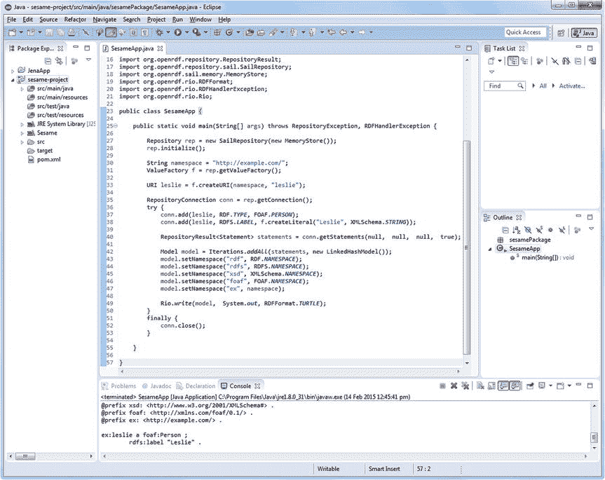

图 4-16。

Using Sesame to store and retrieve RDF triples

### 开发工具

NetBeans 是另一个流行的 Java 集成开发环境。

NetBeans 由 Apache Ant 提供支持，支持 Apache Maven、重构、版本控制等。IDE 的所有功能都是通过模块提供的。

#### 在 NetBeans 中设置 Apache Jena

在 NetBeans 中集成 Apache Jena 类似于我们讨论的 Eclipse 的安装。

Go to [`http://jena.apache.org/download/`](http://jena.apache.org/download/) , select a download mirror, and download the binary distribution suitable for your platform (`.zip` or `.tar.gz`).   Extract the Jena files from the archive.   In NetBeans, select File ➤ New Project ➤ JavaWeb.   Give a name to the project and select servers.   Select File ➤ Project Properties.   Select the Libraries category and select Add JAR/Folder.   Select the required files.   When the files are listed, verify and click OK.  

要在您的项目中使用 Jena，您必须导入所需的包，如前几节所述。

如果您在 NetBeans 中使用 Apache Maven 集成，也可以按如下方式启动 Jena 项目:

Select File ➤ New Project ➤ Maven ➤ Java Application.   Add a name to the project and additional information, such as location, then click Finish.   Once NetBeans has created a new Maven project and opened it, right-click Dependencies and choose Add Dependency….   Declare the Group ID, such as `org.apache.jena`, the Artifact ID, such as `jena-core`, and the version of your Jena integration.   Open the `Dependencies` directory and check the dependencies.   Note

通过右键单击依赖项并选择下载声明的依赖项，可以强制下载声明的依赖项。

### 立方体网络

CubicWeb 是用 Python [ [26](#Sec51) ]编写的面向对象的语义 Web 应用框架。它支持 RDF 和 OWL，具有半自动 XHTML/XML/JSON/text 生成功能，以及一种类似于 SPARQL 的专有查询语言。CubicWeb 支持 SQL 数据库和 LDAP 目录。快速应用程序开发由称为“立方体”的可重用组件库提供支持，包括常见任务的数据模型和视图。例如，`file`多维数据集包含了`file`实体类型、图库视图功能和一个文件导入工具。如果你构建一个博客应用程序，你创建一个新的立方体，比如`mycube`，并重用`blog`立方体(见图 [4-17](#Fig17) )。

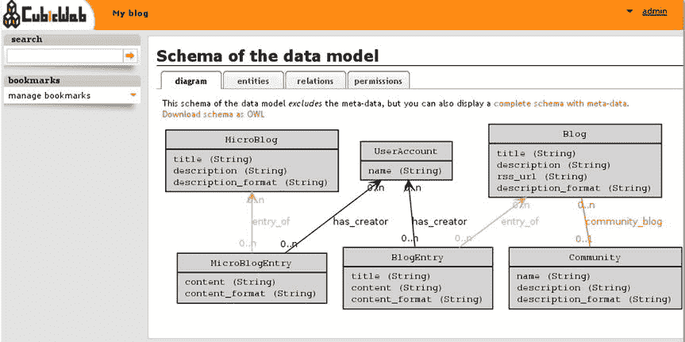

图 4-17。

Visualization of the data model in CubicWeb

当您开发新的 web 应用程序时，您创建一个新的多维数据集，从现有多维数据集中选择构建块，在多维数据集的架构中创建类定义，并创建实例。这些立方体有一个标准的文件夹结构来存储 Python 脚本、样式表、JavaScript 文件和翻译文件。

## 链接数据软件

### 辛迪克

Sindice 是最受欢迎的关联数据平台之一。Sindice 收集、处理和整合来自 RDF、RDFa、微格式和 HTML5 微数据的链接数据[ [27](#Sec51) ]。Sindice 的组件之一是位于 [`http://inspector.sindice.com`](http://inspector.sindice.com/) 的 Sindice Web Data Inspector，这是一个全面的语义数据提取工具。该工具可用于从 URI 或直接输入提供的标记、RDF/XML、Turtle 或 N3 文档中提取 RDF 三元组。Sindice Web Data Inspector 可用于检索语义数据(Inspect 按钮)，组合语义数据提取和验证(Inspect + Validate 按钮)，或本体分析和推理(见图 [4-18](#Fig18) )。

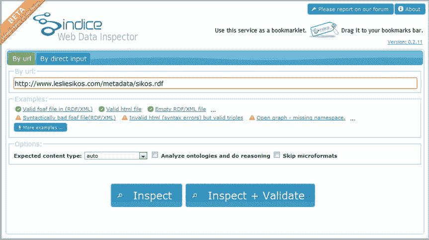

图 4-18。

Comprehensive options on the start screen of Sindice Web Data Inspector

因此，该工具提供了从文件中检索到的主谓宾三元组的完整列表。输出格式也可以更改为 N-triples 或 RDF/XML。

Note

出于可用性原因，Sindice Web Data Inspector 最多只显示 1，000 个三元组。

“适马”选项是机器可读元数据的一个很好的例子。软件工具可以从正确编写的语义文档中提取结构化数据，并任意显示。这是语义网的真正本质！

Sindice Web Data Inspector 的一个有用特性是可以从语义文档中生成一个可伸缩的图形。该图不仅显示了三元组，还提供了文件中使用的本体和词汇的快速总结。

Sindice Web Data Inspector 还有一个带有两个不同选项的验证功能。第一个称为“RDF 语法验证”，根据 W3C 规范执行 RDF 语法验证。第二个选项是“学究式验证器”，它对提取的三元组进行验证。在有效文档的情况下，两个验证器都给出结果“有效文档”

### 阿帕契·土拨鼠

Apache Marmotta 是一个链接数据服务器、SPARQL 服务器和链接数据开发环境[ [28](#Sec51) ]。Marmotta 通过 HTTP 内容协商为人类可读和机器可读的读写数据访问提供了一个链接数据平台(LDP)。

Marmotta 具有用于 LD 应用程序开发的模块和库。模块化服务器架构使得仅实现所需的功能成为可能。例如，如果您的项目不需要推理，您可以排除推理器模块。Marmotta 为常见的 LD 任务提供了一组链接数据库，例如访问 LD 资源和查询链接数据(通过一种简单的 LD 查询语言 LDPath)。triplestore 与服务器分离，因此可以独立使用。Apache Marmotta 平台被实现为一个 Java web 应用程序，并被部署为一个`.war`文件。它是一个使用上下文和依赖注入(CDI)的面向服务的架构，CDI 是 Java web 应用程序开发的一组服务。Marmotta 核心是 Apache Marmotta 的基础组件，它提供链接数据访问、RDF 导入和导出功能以及管理界面。Marmotta Core 联合了服务和依赖注入、三元组存储、系统配置和日志记录。

作为一个 SPARQL 服务器，Marmotta 通过 HTTP Web 服务提供了一个公共的 SPARQL 1.1 查询和更新端点以及对 SPARQL 1.1 的全面支持。Marmotta 在 KiWi triplestore 中提供了一个快速的本机 SPARQL 实现，这是一个高性能、高可伸缩的事务性 triplestore 后端，用于 OpenRDF Sesame，构建在 MySQL、PostgreSQL 或 H2 等关系数据库之上。为了使 SPARQL 查询更容易，Apache Marmotta 提供了 Squebi，一个轻量级用户界面。除了 KiWi，Marmotta 默认的 triplestore 后端，你还可以选择 Sesame Native(基于 Sesame Native RDF 后端)，BigData(基于 BigData 集群化的 triplestore)，或者 Titan(基于 Titan 图数据库)。Marmotta Reasoner 是一个可选模块，是 KiWi triplestore 的基于规则的推理机。它在 RDF 三元组上实现了 datalog 风格的规则。Marmotta Loader 是一个命令行工具，用于将各种格式的 RDF 数据加载到不同的 triplestores 中。它支持 RDF 序列化，也可以导入目录、分割文件、gzip 和 bzip2 压缩文件，以及 Tar 和 zip 存档。

Marmotta 软件库不仅可以用作 Marmotta 平台的组件，还可以用作独立的轻量级 Java 库。Apache Marmotta LDClient 库是一个灵活的模块化 RDFizer，适用于链接数据项目，通过不同的协议和数据提供者检索远程链接数据资源[ [29](#Sec51) ]。Marmotta 的模块支持 RDF/XML、Turtle、N3、JSON-LD、RDFa、XML、HTML，可以处理 Freebase、脸书、YouTube、Vimeo、MediaWiki 内容。该软件库可通过 Java 的`ServiceLoader`类进行扩展，为 RDF、RDFa、脸书、YouTube 和 Wikipedia 等传统数据源提供定制包装器，并为映射 XML 和 JSON 等其他格式提供基类。另一个库 Marmotta LDCache 可以像在本地一样访问远程链接的数据资源。它支持诸如脸书图这样的遗留数据源的包装。LDCache 提供了一个本地 triplecache。另一个可选的库是 Marmotta LDPath，这是一种不如 SPARQL 表达能力强的查询语言，但专门为查询云中的链接数据而设计。LDPath 具有基于路径的导航功能，它从资源开始，沿着链接前进。

Note

如果使用 SPARQL 查询，建议使用 LDPath 而不是 LDCache。

LDPath 包含一个大型函数库，可以集成到您自己的应用程序中。LDPath 可以与 LDCache 和 LDClient 一起使用，并支持后端，如 Jena 和 Sesame。

### sameAs.org

因为互连是链接开放数据云中的基础，所以您通常会定义描述 RDF 中表示的相同对象的资源。例如，你参考你居住城市的机器可读定义，指向它在 DBpedia、GeoNames 和 Freebase 上的资源页面。因为寻找等效的资源页可能很耗时，你可能会发现 [`www.sameas.org`](http://www.sameas.org/) 的工具很有用，它可以在不同的数据集上寻找等效的资源页(见图 [4-19](#Fig19) )。

图 4-19。

sameAs finds equivalent resource definitions from different LOD datasets

### 卡利马科斯

Callimachus [4](#Fn4) 是一个集成的链接数据应用开发环境，用于图形存储、可视化、RDFa 模板化、使用 XSLT 和 XProc 进行数据处理、SPARQL 查询和链接开放数据发布[ [30](#Sec51) ]。它适用于标准化元数据和组合来自不同系统的数据，以及组合企业数据和来自 Web 的开放数据。

Callimachus 扩展了 RDFa 语法，允许在属性中使用变量和 URIs。Callimachus 进一步扩展了 RDFa 语法，引入了允许在属性值或文本节点中替换值的表达式。Callimachus 将属性转换成图形模式。空白节点和空属性内容被视为通配符。带有通配符或变量的图形模式可以选择在结果中加入合作伙伴。

### 新词

新语是一个免费开源的词汇发布平台[ [31](#Sec51) ]。它作为一个 Drupal 插件发布，支持 RDF 和 RDFS，部分支持 OWL。新词可以导入用 RDF/XML、RDFa、Turtle 或 OWL 编写的离线和在线文件(见图 [4-20](#Fig20) )。新词的表单域具有客户端验证输入是否正确的功能。新词显示了术语之间的双向关系。您可以在 Turtle 中将任意三元组添加到任何词汇表的 RDF 输出中。

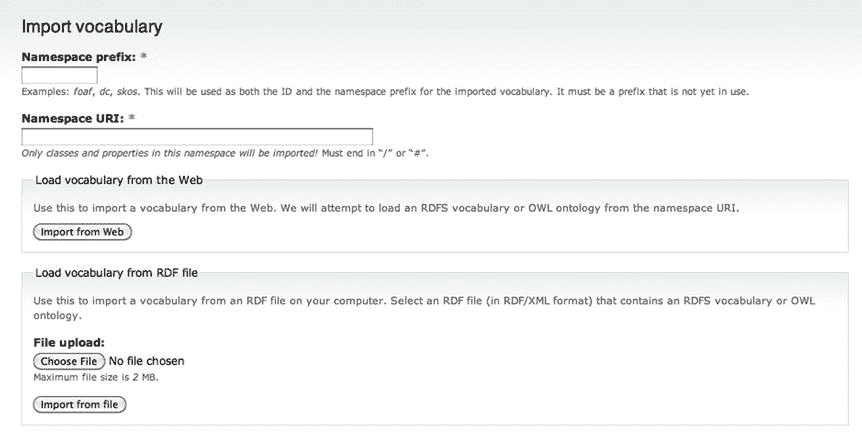

图 4-20。

Neologism can import vocabulary and ontology files written in any of the mainstream RDF serializations

### LODStats

LODStats 是一个用 Python 编写的可扩展框架，用于高性能数据集分析[ [32](#Sec51) ]。它收集统计数据集特征，如类使用计数、类层次结构深度、属性层次结构深度、不同实体等。LODStates 非常强大，其开发人员将该框架与 CKAN(LOD 云元数据注册中心)集成在一起，以生成关于 LOD 云的及时而全面的统计数据。

## 语义 Web 浏览器

语义 Web 浏览器是浏览工具，用于探索和可视化 RDF 数据集，并通过链接数据进行增强，例如 DBpedia 中的机器可读定义或 GeoData 中的地理空间信息。语义 web 浏览器提供了不同于传统 Web 浏览器的探索、导航和交互功能。它们不仅显示人类可读的注释，还显示机器可读的注释和提取的 RDF 三元组。传统的浏览器使用超链接在文档之间导航，而语义 Web 浏览器提供了用键入的链接向前和向后导航的机制。语义 Web 浏览器支持基于分面的(分面的)浏览，方法是处理称为分面的离散过滤器属性列表，逐步细化对信息集合的搜索，并将结果可视化(例如从地理空间数据生成地图)。语义 Web 浏览器也支持旋转，即数据的维度方向。例如，旋转最初聚合的`Book`、`Publisher`和`Date`会产生`Publisher`、`Date`和`Book`。语义 Web 浏览器可以将非链接数据转换为链接数据，并创建到相关 URIs 的链接。它们提供文本搜索和/或 SPARQL 查询，并支持第 3 章中讨论的五星数据部署方案，用于数据消费、生成、聚合、扩充和重新解释。

### 制表机

制表器是 W3C 的语义 web 浏览器和编辑器，可作为 Web 应用程序和 Firefox 插件在 [`http://www.w3.org/2005/ajar/tab`](http://www.w3.org/2005/ajar/tab) 使用。它可以以各种可视化格式显示链接的数据。制表器包含一个用 JavaScript 编写的 RDF 存储。该工具有两种模式:探索模式和查询模式。在浏览模式下，它显示一个谓词-对象对表，其中可能还包含嵌套属性。浏览选项之一是大纲模式，用户可以通过打开树结构的分支来浏览资源。Outliner 模式解决了 RDF 可视化工具(如 IsaViz)使用的圆形和箭头图的局限性，这些图对于具有许多节点和许多不同属性的大量数据来说效率很低。在 Outliner 模式下，当在链接数据图中搜索与给定字段匹配的子图时，用户还可以通过选择多个字段并按 Find All 按钮来执行图匹配查询。实例在每个类的专用窗格中列出。制表器还可以显示检索打开的文档、可读内容和 RDF 所涉及的网络活动。

当用作编辑器时，制表器支持大纲模式下的三个编辑选项:对象修改、用现有谓词添加新对象以及向现有主语添加新的谓词-对象对。要修改包含文字值的单元格，请在单元格高亮显示时单击一次(或按 Enter ),以便该字段变得可编辑。编辑完成后，你只需按回车键。如果谓词-对象对的对象不是一个文字值，而是一个 URI 标识符，您可以通过名称或拖放来选择它。制表器总是尽可能尝试显示名称而不是 URI(例如，文本描述而不是`rdfs:label`或`dc:title`)。当谓词不存在时，可以通过单击表末尾左侧显示的蓝色加号来向属性或对象表添加新的事实。当添加新对时，将会出现一个谓词的自动完成框，同时可以像往常一样选择对象。

当您查询子图模式时，会生成一个表。插入新行会创建一个与查询匹配的新子图。编辑单元格值时，会删除一条语句，并在同一文档中插入另一条语句。

### 大理石

Marbles 是一个服务器端应用程序和链接数据引擎，用于语义数据检索和存储。作为一个语义 Web 浏览器，它显示彩色的“弹珠”来指示数据来源和数据源之间的关系。Marbles 也可以用作 SPARQL 端点，支持`SELECT`、`CONSTRUCT`和`DESCRIBE`查询。一旦你从 [`http://sourceforge.net/projects/marbles/files/`](http://sourceforge.net/projects/marbles/files/) 下载了`.war`文件，你就可以把它放到一个 J2EE 的 web 容器里，比如 Tomcat，来自动安装 Marbles。对于手动安装，调用源代码发行版上的`ant install`和`remove`任务，然后调用根目录下的 servlet。其中，弹珠是在 DBpedia Mobile 中实现的。

### OpenLink 数据浏览器(ODE)

OpenLink Data Explorer (ODE，最初是 OpenLink RDF Browser)是一个利用结构化数据的浏览器扩展。ODE 在标准视图菜单中增加了两个选项，都在主菜单和上下文菜单中(见图 [4-21](#Fig21) )。

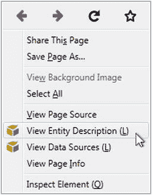

图 4-21。

ODE options in the context menu

数据浏览器可用于 Internet Explorer、Firefox、Safari、Google Chrome 和 Opera ( [`http://ode.openlinksw.com/#Download`](http://ode.openlinksw.com/#Download) )。让我们为 Firefox 安装附加软件吧！

Go to [`http://s3.amazonaws.com/opldownload/ajax-tools/ode/1.1/firefox3.0/ode.xpi`](http://s3.amazonaws.com/opldownload/ajax-tools/ode/1.1/firefox3.0/ode.xpi) .   Depending on your security settings, Firefox might prevent automatic installation. Click Allow to download the add-on.   The Software Installation pop-up asks for permission to proceed (“Install add-ons from authors whom you trust.”) Click Install Now.   Restart Firefox.  

安装后，该插件就可以从视图菜单和上下文菜单中使用了。“查看实体描述”选项提供当前页面的结构化描述。查看数据源为从当前页面检索的结构化数据提供原始数据显示选项(参见图 [4-22](#Fig22) )。

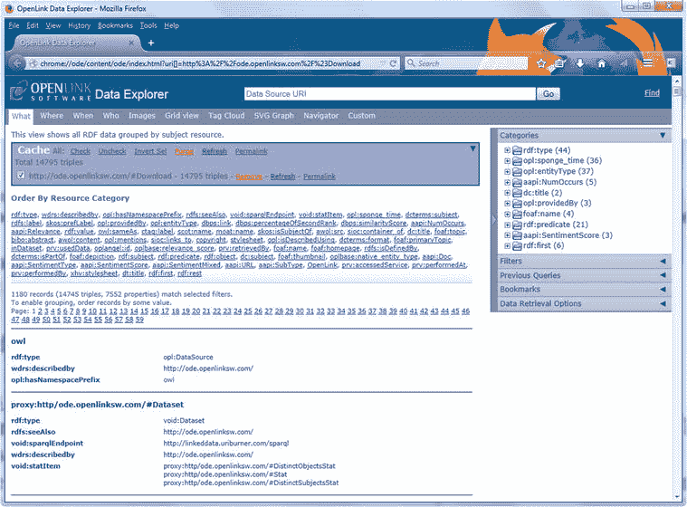

图 4-22。

Result screen of View Data Sources

插件的设置可通过工具➤ OpenLink 数据浏览器➤选项获得。首先，您可以选择查看器。默认的是 OpenLink 数据浏览器，但是您也可以选择 Zitgist 数据查看器、Marbles、DISCO、制表器或自定义查看器。对于链接数据访问，有一个 RDFizer 服务、一个 SPARQL 端点，您还可以定义 HTTP 头。RDFizer 和 SPARQL 端点的默认主机是`linkeddata.uriburner.com`，可以任意修改。RDFizer 是 Virtuoso Sponger ( [`http://virtuoso.openlinksw.com/dataspace/doc/dav/wiki/Main/VirtSponger`](http://virtuoso.openlinksw.com/dataspace/doc/dav/wiki/Main/VirtSponger) )，是 Virtuoso 的 SPARQL 处理器和代理 Web 服务的一个组件。海绵支持 RDFa，GRDDL，亚马逊网络服务，易贝网络服务，免费基础网络服务，脸书网络服务，雅虎！财务、XBRL 实例文档、文档对象标识符(DOI)、RSS 和 Atom 提要、MP3 音乐文件的 ID3 标签、vCard、微格式、Flickr 和 Del.icio.us 内容。

OpenLink Data Explorer 处理 RDF、Turtle 和 Notation3 MIME 数据。MIME 数据的默认查看器是 Virtuoso Describe，但是您也可以选择 Virtuoso About 或 Virtuoso ODE(带或不带 SSL)。

### DBpedia Mobile

DBpedia Mobile 是一个用于移动设备的位置感知 DBpedia 客户端应用程序，提供地图视图和支持 GPS 的启动器应用程序[ [33](#Sec51) ]。根据移动设备的 GPS 位置，DBpedia Mobile 会显示一张地图，其中包含从 DBpedia 数据集中提取的附近位置的信息。覆盖了大约 30 万个地理位置。DBpedia Mobile 由 Marbles 链接数据浏览器的渲染引擎和 SPARQL 功能提供支持。地图渲染后，您可以浏览关于该位置的其他信息，并直接转到 DBpedia、GeoNames、Flickr 和其他数据集。

### 伊萨维兹

作为一个 RDF 的可视化创作工具，IsaViz 将数据表示为一个圆形箭头图，它显示了彼此相关的“事物”(见图 [4-23](#Fig23) ) [ [34](#Sec51) )。这在分析数据结构时很有用。在 IsaViz 图上，当大量“事物”通过相同的属性联系在一起时，您可以看到聚类。

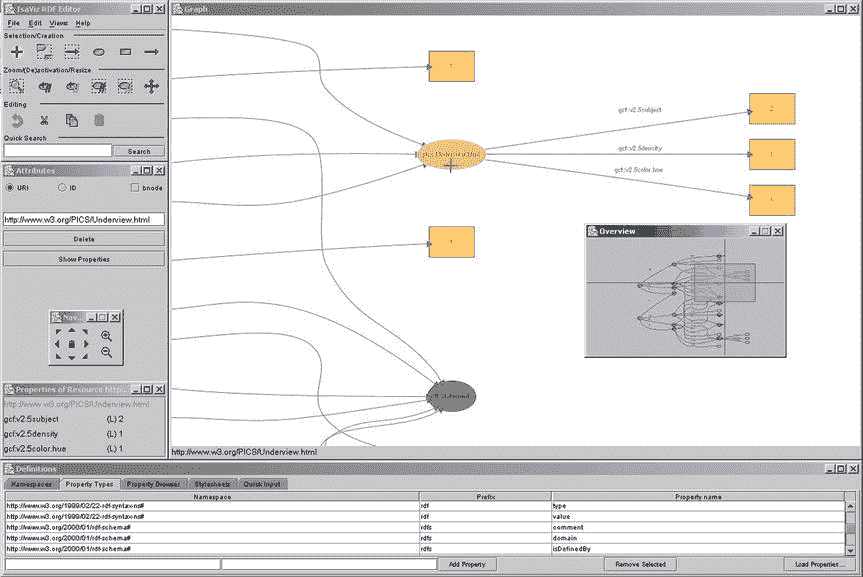

图 4-23。

An RDF graph in IsaViz

### RelFinder

RelFinder (Relationship Finder)可以用来可视化、过滤和分析对象之间的大量关系。它适用于知识表示和知识发现。RelFinder 提供了对数据集的标准 SPARQL 访问。在 [`http://www.visualdataweb.org/relfinder/relfinder.php`](http://www.visualdataweb.org/relfinder/relfinder.php) 有在线版本，可以根据选择的对象及其关系生成有向图(见图 [4-24](#Fig24) )。

图 4-24。

Visualizing connections with RelFinder

## 摘要

在本章中，您已经熟悉了常用的软件工具，这些工具可以生成、存储、提取和可视化 RDF 数据。您了解了如何为您的 web 站点生成 RDFa 注释，以及如何使用 Google 结构化数据测试工具测试 RDFa 和微数据注释。您看到了如何设置集成开发环境，使用软件库来编写语义 Web 应用程序，以及在存储库中存储 RDF 数据和从存储库中检索 RDF 数据的示例。您知道用于导入、编辑和序列化数据集的最流行的链接数据平台。

下一章将向您介绍语义 Web 服务标准，包括服务使用的协议、接口和语言，如位置感知应用程序和语义电子商务门户。

## 参考

Ho, D. et al. (2014) Notepad++. Don Ho. [`http://notepad-plus-plus.org`](http://notepad-plus-plus.org/) . Accessed 31 March 2015.   Sessink, O. (2014) BlueFish. The Bluefish Project Team. [`http://bluefish.openoffice.nl/`](http://bluefish.openoffice.nl/) . Accessed 4 November 2014.   ActiveState Software (2014) Komodo. ActiveState Software. [`www.activestate.com/komodo-ide`](http://www.activestate.com/komodo-ide) . Accessed 4 November 2014.   Bare Bones Software (2014) BBEdit. Bare Bones Software, Inc. [`www.barebones.com/products/bbedit/`](http://www.barebones.com/products/bbedit/) . Accessed 4 November 2014.   Bare Bones Software (2014) TextWrangler. Bare Bones Software, Inc. [`www.barebones.com/products/textwrangler/index.html`](http://www.barebones.com/products/textwrangler/index.html) . Accessed 4 November 2014   Lutus, P. (2014) Arachnophilia. [`www.arachnoid.com/arachnophilia/`](http://www.arachnoid.com/arachnophilia/) . Accessed 4 November 2014.   GitHub (2015) DBpedia Spotlight. [`https://github.com/dbpedia-spotlight/dbpedia-spotlight`](https://github.com/dbpedia-spotlight/dbpedia-spotlight) . Accessed 31 March 2015.   The GATE project team (2015) GATE. [`https://gate.ac.uk`](https://gate.ac.uk/) . Accessed 31 March 2015.   The OpenRefine community (2015) OpenRefine. [`http://openrefine.org`](http://openrefine.org/) . Accessed 31 March 2015.   Altova (2012) Altova SemanticWorks 2012 User and Reference Manual. [`www.altova.com/documents/SemanticWorks.pdf`](http://www.altova.com/documents/SemanticWorks.pdf) . Accessed 31 March 2015.   TopQuadrant (2015) TopBraid Composer Standard Edition. [`www.topquadrant.com/tools/modeling-topbraid-composer-standard-edition/`](http://www.topquadrant.com/tools/modeling-topbraid-composer-standard-edition/) . Accessed 31 March 2015.   TopQuadrant (2015) TopBraid Composer Maestro Edition. [`www.topquadrant.com/tools/ide-topbraid-composer-maestro-edition/`](http://www.topquadrant.com/tools/ide-topbraid-composer-maestro-edition/) . Accessed 31 March 2015.   The Apache Software Foundation (2015) Apache Stanbol. [`http://stanbol.apache.org`](http://stanbol.apache.org/) . Accessed 31 March 2015.   Fluent Editor. [`www.cognitum.eu/semantics/FluentEditor/`](http://www.cognitum.eu/semantics/FluentEditor/) . Accessed 15 April 2015.   The European Bioinformatics Institute (2015) ZOOMA. [`www.ebi.ac.uk/fgpt/zooma/`](http://www.ebi.ac.uk/fgpt/zooma/) . Accessed 31 March 2015.   Harispe, S. (2014) Semantic Measures Library & ToolKit. [`www.semantic-measures-library.org`](http://www.semantic-measures-library.org/) . Accessed 29 March 2015.   Motik, B., Shearer, R., Glimm, B., Stoilos, G., Horrocks, I. (2013) HermiT OWL Reasoner. [`http://hermit-reasoner.com`](http://hermit-reasoner.com/) . Accessed 31 March 2015.   Clark & Parsia (2015) Pellet: OWL 2 Reasoner for Java. [`http://clarkparsia.com/pellet/`](http://clarkparsia.com/pellet/) . Accessed 31 March 2015.   Tsarkov, D., Horrocks, I. (2007) FaCT++. [`http://owl.man.ac.uk/factplusplus/`](http://owl.man.ac.uk/factplusplus/) . Accessed 31 March 2015.   University of Luebec (2015) Racer. [`www.ifis.uni-luebeck.de/index.php?id=385`](http://www.ifis.uni-luebeck.de/index.php?id=385) . Accessed 31 March 2015.   The Apache Software Foundation (2015) Apache Jena. [`http://jena.apache.org`](http://jena.apache.org/) . Accessed 31 March 2015.   The Apache Software Foundation (2015) Apache Jena Fuseki. [`http://jena.apache.org/documentation/fuseki2/`](http://jena.apache.org/documentation/fuseki2/) . Accessed 31 March 2015.   Broekstra, J., Ansell, P., Visser, D., Leigh, J., Kampman, A., Schwarte, A. et al. (2015) Sesame. [`http://rdf4j.org`](http://rdf4j.org/) . Accessed 31 March 2015.   The Eclipse Foundation (2015) Eclipse. [`www.eclipse.org`](http://www.eclipse.org/) . Accessed 31 March 2015.   Oracle Corporation (2015) NetBeans IDE. [`https://netbeans.org`](https://netbeans.org/) . Accessed 31 March 2015.   Logilab (2015) CubicWeb Semantic Web Framework. [`www.cubicweb.org`](http://www.cubicweb.org/) . Accessed 31 March 2015.   Digital Enterprise Research Institute (2015) Sindice—The Semantic Web index. [`http://sindice.com`](http://sindice.com/) . Accessed 31 March 2015.   The Apache Software Foundation (2015) Apache Marmotta. [`http://marmotta.apache.org`](http://marmotta.apache.org/) . Accessed 31 March 2015.   The Apache Software Foundation (2015) [`http://marmotta.apache.org/ldclient/`](http://marmotta.apache.org/ldclient/) . Accessed 31 March 2015.   3 Round Stones (2015) Callimachus—Data-driven applications made easy. [`http://callimachusproject.org`](http://callimachusproject.org/) . Accessed 31 March 2015.   National University of Ireland (2011) Neologism—Easy Vocabulary Publishing. [`http://neologism.deri.ie/`](http://neologism.deri.ie/) . Accessed 31 March 2015.   Auer, S., Ermilov, I., Lehmann, J., Martin, M. (2015) LODStats. [`http://aksw.org/Projects/LODStats.html`](http://aksw.org/Projects/LODStats.html) . Accessed 1 April 2015.   Bizer, C. (2008) DBpedia Mobile. [`http://wiki.dbpedia.org/DBpediaMobile`](http://wiki.dbpedia.org/DBpediaMobile) . Accessed 31 March 2015.   Pietriga, E. (2007) IsaViz: A Visual Authoring Tool for RDF. [`www.w3.org/2001/11/IsaViz/`](http://www.w3.org/2001/11/IsaViz/) . Accessed 31 March 2015.   Footnotes [1](#Fn1_source)

在 Windows 系统上，用于语法突出显示的文件格式取决于文件扩展名，因此默认情况下，扩展名为`.rdf`的整个 RDF/XML 文件可能是白色的，而同一编辑器中的同一文件在另存为`.xml`时会被语法突出显示。

  [2](#Fn2_source)

对于那些可以合理地转换为另一种更高级的编码而不牺牲特殊字符的编码(例如，ANSI 到 UTF-8)，应该使用此功能。

  [3](#Fn3_source)

FaCT++部分支持 OWL 2 键约束和数据类型。

  [4](#Fn4_source)

以卡利马科斯命名(310/305？–公元前 240 年)，他是“目录学之父”，在古老的亚历山大图书馆工作。