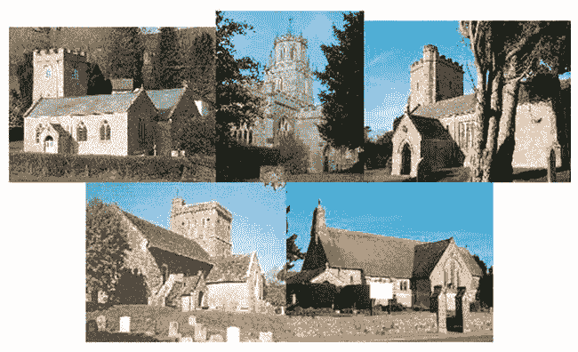
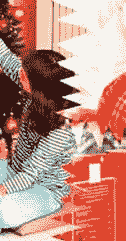
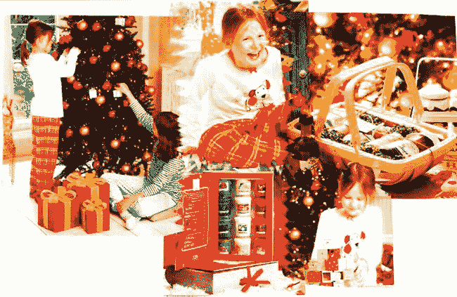
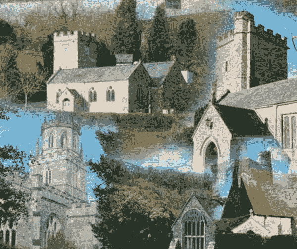
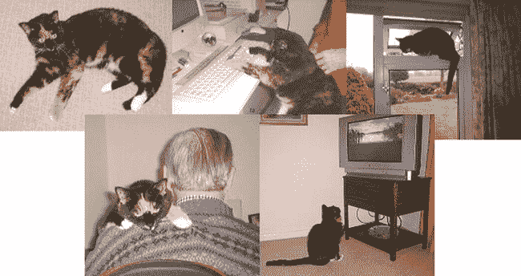

# 九、创建拼贴画和画廊

静态拼贴和图库是显示多幅图像的流行方式(除了在[第二章](02.html#ch2)中描述的翻转图库)。拼贴画更具装饰性，通常没有标题。画廊图像通常需要标题；这些可以使用 CSS 或者使用新的 HTML5 `<figure>`标签来添加。然而，最后一种方法需要使用一些 JavaScript 来使 IE 7 和 IE 8 能够理解`<figure>`标签。

在 1998 年推出 CSS 之前，图片组排列在一个表格中。这导致了大量的 HTML 标记。表格现在已经被弃用，CSS 被用来轻松地创建图片的行和列，而 HTML 标记要少得多。网页设计者自然倾向于立即想到代码或图形软件来创建拼贴画。一些低技术含量的方法是可用的，它们在某些场合是有用的。本章从其中的两种方法开始。

### 制作一个纸糊拼贴画，然后扫描它

一些客户给了我一堆从他们的贸易小册子上剪下的东西，并让我用它们做一个拼贴画放在他们的主页上。

这可能会相当混乱，因为它涉及到纸、剪刀和浆糊。与其他布局相当死板的技术相比，这种方法允许以有趣的方式排列图像。

当混乱的部分完成后，剪贴拼贴被扫描，生成的图像保存在你的网站文件夹中。使用图像处理包用颜色填充空白的角落空间，以匹配您的网页的背景颜色。或者，您可以将其保存为带有透明背景的`.gif`或`.png`文件。

### 使用文字处理器

客户有时会在文字处理器上设计拼贴画，然后把文件交给我。我可以向他们索要原始图片，然后根据这些图片创作拼贴画，但他们可能会感到不快，因为这暗示着他们的作品不够好。

文字处理器似乎不太可能是制作拼贴画的方式；但是，如果您熟悉在页面上插入和排列图像，这个过程会很容易。尽可能避免使用桌子；但是如果您应该使用表格，请在边框和底纹选项中选择无。

图 9-1 说明了这样一个事实，即使用文字处理器创建的拼贴画不必局限于一个矩形。本章中使用的教堂照片由威廉·卢埃林善意许可。

***图 9-1。**用微软 Word 制作的拼贴画*

文字处理器方法如下:

1.  将图像插入文字处理文档，并将其排列成拼贴画。
2.  使用 Shift+单击选择图片的**组**。
3.  将该组复制并粘贴到 Microsoft Paint 或其他画图程序中。
4.  将群组保存为`.tif`文件，并根据需要进行编辑。
5.  将其导出为压缩的`.jpg`文件或`.png`文件。

这在白色背景下效果最好。如果放在纯色背景上，在将拼贴画插入网页之前，必须用背景色填充构成图 9-1 中拼贴画四个角的矩形空间。

你可以下载一个 MS Word 拼贴模板，但是我个人觉得这些模板限制太多了一点。试试`[http://www.microsoft.com/canada/home/memories-and-crafts/articles/-photo-collage.aspx](http://www.microsoft.com/canada/home/memories-and-crafts/articles/create-a-digital-photo-collage.aspx)`的模板。

### 使用 CSS 在页面上定位不同的图像

可以使用 HTML 和 CSS 构建一个拼贴来定位图像(见[图 9-2](#fig_9_2) )。

***图 9-2。**图像间有小缝隙的拼贴画*

大多数拼贴软件只会产生一个长方形的拼贴。要制作出像图 9-2 那样的布局，最好的方法是使用 CSS2 和一些`
`(见[清单 9-2a](#list_9_2a) 和 [9-2b](#list_9_2b) )。这个项目有小间隙，一些业主更喜欢这样，因为每个图像都被清晰地定义。

***清单 9-2a** 。创建一个图像之间的默认间隙拼贴(collage-churches-gaps.html)*

`<!doctype html>
<html lang=en>
<head>
<title>Collage of five churches-with gaps</title>
<meta charset=utf-8>
        *meta details go here*
<link rel="stylesheet" type="text/css" href="churches-style1.css">
</head>
<body>

 

    
    
    
     ** **
    
    

</body>
</html>`

除了 Opera 之外，所有主要浏览器中的图像排列良好且一致；在 Opera 中，图像的下一行与上一行重叠大约三个像素。注意换行` `；插入它是为了将两个图像向下推，以创建第二行图像。

***清单 9-2b。【collage-churches-gaps.html】[清单 9-2a](#list_9_2a)***的 CSS 样式表

`body { width:960px; min-width:780px; margin:auto;
}
img { border:0; margin:0; padding:0;
}
#container { text-align:center; margin:10px auto 0 auto;
}
#collage { margin:0 auto 0 auto; text-align:center;
}`

#### 消除差距

尽管没有边界或空白，但在图 9-2 的[中，每幅图像之间都有两个像素的间隙。一些客户更喜欢这样，但是那些希望图片相互对接的客户怎么办呢？在 IE 6、IE 7 和 IE 8 中，以及除 Opera 之外的所有其他浏览器中，使用负边距可以很好地缩小差距。下一个项目，](#fig_9_2)[清单 9-3](#list_9_3a) ，展示了使用负边距作为一种精确定位图像的方式，从而消除了空白。

[图 9-3](#fig_9_3) 显示了同样的拼贴画，通过使用 CSS 标记来闭合缝隙。

***图 9-3。**使用负边距消除图像之间的间隙*

这链接到一个不同的样式表(`churches-style2.css`)，它包含闭合间隙的负边距(以粗体显示)。标记还包含一个 IE 条件(见清单 9-3a )。

***清单 9-3** a .使用负边距消除间隙(collage-churches.html)*

`<!doctype html>
<html lang=en>
<head>
<title>Collage of five churches-with no gaps</title>
<meta charset=utf-8>
        *meta details go here*
<link rel="stylesheet" type="text/css" href="churches-style2.css">
        <!--[if IE]>
        <link rel="stylesheet" type="text/css" href="collage-ie.css">
        <![endif]-->
</head>
<body>

 

    
    
    
** **
    
    

</body>
</html>`

***清单 9-3b。**清单 9-3a[的样式表(churches-style2.css)](#list_9_3a)*

`/*position body and table at horizontal centre of screen*/
body {width:960px; font-family:"times new roman"; font-size:medium; 
color:navy; margin:auto; min-width:780px;

}

img { border:0; margin:0; padding:0;

}

#container { text-align:center; margin:10px auto 0 auto;

}

#collage { margin:0 auto 0 auto; text-align:center;

}

#collage img { **margin-top: -3px; margin-bottom:-2px; margin-left:-2px;** 
**margin-right:-2px;**

}`

在 IE 6、IE 7 和 IE 8 中，图像的底部行现在与顶部行重叠一个像素，因此 IE 条件位于 HTML5 标记的头部。IE 的条件样式表是`collage-ie.css`，它只包含一行，如下所示:

`                #collage img { margin:-2px; }`

IE 6、IE 7、IE 8、Mozilla Firefox、Safari 和 Chrome 现在可以无重叠地对接在一起。在 Opera 中，底行与顶行重叠三个像素。因为 Opera 在浏览器市场的份额非常小，所以这个解决方案是一个合理的妥协。

### 合并图像

一个客户可能会要求我模糊单个图像的边缘，以制作一幅图片相互融合的拼贴画。我觉得这给人一种整体混乱的感觉，但客户永远是对的。花几个小时修饰边缘并试图重叠它们不是我的乐趣所在，尤其是最终结果可能会让客户失望。如果客户坚持合并图像，有三种解决方案:

1.  如果客户希望使用其销售手册中的合并拼贴画，扫描手册图像并在网页上使用。
2.  用纸粘贴，然后扫描结果。然而，这看起来并不专业；示例如图[图 9-4](#fig_9_4) 和[图 9-5](#fig_9_5) 所示。
3.  使用专有软件。

***图 9-4。**裁剪出比最终图像应该大的图像。把它们大致摆好。*

如[图 9-4](#fig_9_4) 所示，在边缘重叠的地方，将其中一个图像的边缘切割成弯曲的形状或制作一个锯齿边缘。将所有图像粘贴在一起，扫描组装好的拼贴画。然后，在绘画程序中使用克隆画笔(或模糊工具)，柔化锯齿或曲线的边缘。

最终结果应该类似于图 9-5 。

***图 9-5。**使用纸张、粘贴和扫描合并图像*

图 9-5 是一个糟糕的例子，因为它有复杂的图像和花哨的颜色。如果你使用不那么杂乱的照片，选择柔和的颜色，合并后的图像就不会那么杂乱。

### 使用专有软件

一些绘画/照片处理程序允许将几幅图像合并成一幅大图像；然而，我发现这个过程比 MS Word 方法或 CSS 方法更费时，也更受限制。

我在本节中介绍的程序并不直观，所以请准备好花一些时间来探索它们。所有的程序产生一个矩形拼贴画。如果您需要像[图 9-3](#fig_9_3) 、 [9-4](#fig_9_4) 和 [9-5](#fig_9_5) 这样的非矩形图像，请使用 MS Word 方法或 CSS 方法，放弃模糊邻接区域的所有希望。

##### 微软贴牌

微软自动拼贴程序产生类似于图 9-6 所示的拼贴画。对于 Windows XP，Vista 和 Windows 7，30 天免费试用版是有用的，但它是带水印的。售价 20 美元(英国 18 英镑)。

***图 9-6。**使用微软自动拼贴的拼贴画*

该程序适合拼贴风格的横幅标题，但该软件有以下两个缺点:

1.  拼贴画中使用的最少图片数量是七张。对于打印的拼贴画来说，这可能是可以接受的，但是在电脑屏幕上，超过六张图片看起来就像蔬菜店里的爆炸。
2.  放置照片需要大量的反复试验。

要下载 Microsoft AutoCollage，请转到`[http://explore.live.com/windows-live-photo-gallery](http://explore.live.com/windows-live-photo-gallery)`。选择一种语言，然后单击“立即下载”按钮。双击下载的文件`wlsetup-web.exe`安装程序。打开程序，在菜单栏的右侧找到标有 Extras 的项目。单击向下的小箭头并选择自动充值 2008。将打开一个网页；单击立即下载。在左侧面板上，单击下载 30 天试用版。主页上的一个视频解释了如何使用该软件，但评论不是很清晰。

 **提示**在使用任何这些程序或项目之前，准备好将图像的副本放在一个新的文件夹中，这样你就可以很容易地找到它们。

##### 形状拼贴

形状拼贴的免费试用版有局限性，但您可能希望研究它。如果您掌握了试用版并发现它很有用，则可以以合理的价格获得完整版。网站位于`[http://www.shapecollage.com](http://www.shapecollage.com)`。

 **提示**Shape Collage 的免费试用版水印严重。在撰写本文时，无水印的 Pro 版本价格约为 75 美元。形状拼贴也适用于 iPhone 和 iPad。

##### Picasa 3.0

Picasa 3.0 是制作各种拼贴格式的免费软件；但是它不支持如图[图 9-6](#fig_9_6) 所示的合并图片。这个程序的工具栏很不寻常，因为它位于屏幕的底部。在工具栏上，您可以找到拼贴图标。

Picasa 最大的秘密是如何保存完成的拼贴画。奇怪的是，你不用保存图像。当您单击创建拼贴时，它会自动将其保存在 Picasa 项目文件夹中。Picasa 3.0 只为偶数张照片制作拼贴画，完成的拼贴画始终是一个长方形。

##### 其他资源

以下程序提供了类似的功能:

> *   Photo visit (`[http://www.photovisi.com](http://www.photovisi.com)`): Free of charge. Some color changes may occur when using this program.
> *   Smilebox (`[http://smilebox.com](http://smilebox.com)`): Free of charge. Mute your speakers before the interview to avoid disco-style noise.
> *   IFoxSoft photo collage [http://`www.ifoxsoft.com`](http://www.ifoxsoft.com) ): Free trial, then 26 dollars (23.50 pounds).
> *   Phoix ( [http://`www.photomix.com`](http://www.photomix.com) ): Free trial, then 29 dollars (26 UK).
> *   Picture collage maker ( [http://`www.picturecollagesoftware.com`](http://www.picturecollagesoftware.com) ): Free trial, then 30 dollars (27 UK).

### 使用图形程序创建拼贴画

大多数图形包可以创建一个拼贴画，但是很难找到说明，这个过程有时会比使用 HTML5 或 CSS 花费更长的时间(例如清单 9-3a 和 T2 b)。然而，更微妙的效果往往可以通过使用图形包来实现；图像可以移动到其他图像的后面或前面，允许重叠。此外，通过降低每层的不透明度，重叠的图像可以相互融合，并且每个图像可以具有模糊的边缘以增强融合。下一个项目告诉你如何用 GIMP，一个免费的图形程序制作基本的拼贴画。最终结果如图[图 9-7](#fig_9_7) 所示。

***图 9-7。**用 GIMP 创建的拼贴画*

#### 用 GIMP 创建拼贴画

对于这个项目，准备好图片，把它们放在一个新的文件夹里，这样你就可以很容易地找到它们。对于[图 9-7](#fig_9_7) ，这五张图片的尺寸被调整为 200 像素宽。顶行中的三幅图片将给出 600 像素的水平总数。因此，拼贴需要一个至少 600 像素宽(3 × 200)和大约 400 像素高(2 × 200)的背景层。注意，在 GIMP 中,“单词对话”是按照欧洲的方式拼写的。这些阶段如下:

1.  打开 GIMP，点击 Windows 可停靠对话框图层。这将把层对话面板放在屏幕上。点击文件新建。
2.  在下一个对话框中，单击横向图标，选择 640 像素宽× 400 像素高，然后单击确定。在工具箱面板上，单击交叉的双箭头选择“移动”。
3.  在菜单上，单击文件打开作为新层打开。导航到文件夹，按住 Ctrl 键选择图像，同时单击所有图像。然后点击打开按钮，自动将它们全部复制到新图层。
4.  现在你会看到层对话框面板中列出的层。第一幅图像将出现在图像窗口中。您可以将图像移动到窗格的左侧和顶部。单击“层”对话框中的下一层。一个虚线框将出现在第一个图像的顶部。向右滑动虚线矩形，您将看到下一个图像出现。
5.  点击图层对话框中的下一个图层，将生成的虚线矩形从上一个图像移开。现在，您将在顶行看到三个可见图像。对剩下的两个图像重复此操作，并将它们移动到顶行下面的位置。
6.  从现在开始，要滑动图像，首先你需要在图层对话框面板中点击它的图层。您将能够滑动它们，并选择是重叠它们还是保持它们彼此相邻。如果它们重叠，并且您希望切换重叠的图像，使其位于另一个图像之上，请在“层”对话框中单击该图像的层。在“层”对话框中，单击绿色向上箭头(或绿色向下箭头，如果您希望将其移动到另一个图像下方)。
7.  你现在可以保存拼贴画了。在另存为对话框面板中点击文件另存为，在面板顶部输入文件名。一定要给它加上一个后缀，比如`.png`。
8.  导航到要存储拼贴画的文件夹，然后单击“保存”按钮。将出现一个导出对话框；确保选中“合并可见层”单选按钮。单击导出按钮。
9.  在下一个 PNG 对话框中，接受默认设置并单击保存。

 **提示**你可以在`[www.gimp.org/downloads/](http://www.gimp.org/downloads/)` *下载 GIMP 及其图解手册。*我还推荐阅读《GIMP 入门:从新手到专业人士》一书，作者是 Akkana Peck (Apress，2008)。

### 带标题的图片库

标题可以极大地增强图片库的效果；添加的文本可以提供关于图片的有用信息，并提供更有趣的网页。[图 9-8](#fig_9_8) 显示了一个设置为图库的页面。每张图片都有说明。尽管字幕很少，信息也不丰富，但它们起到了演示技术的作用。

***图 9-8** 。使用 CSS2 给图片添加标题的图片画廊*

我要感谢肖像艺术家安·罗·琼斯，她友好地允许我使用她令人印象深刻的肖像照片，以及我为她设计的网页的一部分。在`[http://www.annroejones-artist.co.uk](http://www.annroejones-artist.co.uk)`访问她的网站。

第 1 章描述了 HTML5 是如何让图片拥有标题的，无论图片被移动到哪里，标题都会附着在图片上。这也可以通过在没有语义标签的 HTML5 页面中使用 CSS2 来实现，如下一个项目所示。这意味着 IE 7 和 IE 8 的用户可以查看图库，网页设计师不必将 Remy Sharp 的 JavaScript 片段插入代码，如[清单 9-8a](#list_9_8a) 所示。

 **提示**此时，HTML5 纯粹主义者会惊恐地喘息。不要害怕。我在[清单 9-8c](#list_9_8c) 中展示了一个纯 HTML5 版本。无论是使用[列表 9-8a](#list_9_8a) 和[列表 9-8b](#list_9_8b) 还是[列表 9-8c](#list_9_8c) 和[列表 9-8d](#list_9_8d) ，拼贴画的外观都是一样的。

***清单 9-8a。【portraits.html】显示带字幕的图片集(T2)***

`<!doctype html>
<html lang=en>
<head>
<title>Gallery pictures with attached captions</title>
<meta charset=utf-8>
        *meta details go here*
<head>
<link rel="stylesheet" type="text/css" href="portraits.css" />
</head>
<body>

  <h1>Ann L Roe &nbsp;SWAc</h1>

<!--start of left column-->
  <ul id="menu">
     <li class="btn"><a title="Portrait Paintings" href="portraits.html">Portraits</a></li>
     <li class="btn"><a title="Commissions" href="commissions.html" >Commissions</a></li>
     <li class="btn"><a title="Prints" href="prints.html">Prints</a></li>
     <li class="btn"><a title="Latest" href="latest.html">Latest News</a></li>
     <li class="btn"><a title="About Ann" href="about.html">About Ann</a></li>
     <li class="btn"><a title="Return to Home Page" href="index.html">Home Page</a></li>
  </ul>

        <h3><b>SOME PORTRAITS BY ANN ROE (JONES) SWAc</b></h3>

  

    
    
Professor Robert Clements OBE

  

  

    
    
Dr Alan Cotton
   

  

   
   
Reuben

  

&nbsp;

  

   
   
Xanthe Mosely

  

  
` `   
   
Megan

  

&nbsp;

<b>All of Ann&#39;s portraits are painted  in oils on canvas.</b>

For information on commissioning a portrait, click the &#39;Commissions
&#39; button 

Click the &#39;Contact Ann&#39; button to request more detailed information.

  

 
     *Footer goes here*

</body>
</html>`

***清单 9-8b。**清单 9-8a[的 CSS 样式表](#list_9_8a)*

`body { min-width:980px; font-family:"times new roman"; font-size:medium; 
color:black; margin:auto; max-width:1000px;
}
#hdr { width:100%; margin:auto; height:60px; text-align:center;
}
/* use display:inline to remove IE6 double margin bug from side menu*/
#leftcol { float:left; margin-left:0; width :135px; display:inline; padding:0; zoom:1;
}
img { border:none;
}
#midcol-portraits {margin-left:175px; margin-right:15px; zoom:1;
}
div .figure { float:left; margin-right:5px; display:inline;
}
.figure p { font-size:80%; height: 15px; margin:0 auto 0 auto; text-align:center; 
width:200px;
}
#gallery img { margin-right:20px; margin-top:5px;
}
#aside { float:left; width:260px;
}
#ftr {clear:both; text-align:center;
}
/* set side menu position */
ul#menu { float:left; margin-left:0; width:120px;
}
/* set general side button styles */
li.btn { margin-bottom: 4px; text-align: center; list-style:none;
}
/* set general anchor styles */
li.btn a { display: block; color: white; background:#D20B0D; font-weight: bold; 
text-decoration: none
}` `/* specify state styles */
/* mouseout (default) */
li.btn a { background: #D20B0D;  border: 4px outset #FFAAAA;
}
/* mouseover */
li.btn a:hover { background: maroon;   border: 4px outset maroon;
}
/* onmousedown */
li.btn a:active { background:#AECBFF;  border: 4px inset #AECBFF;
}
h1 {font-size:300%; font-weight:bold; color:#D20B0D; margin-top:0; margin-bottom:0; 
font-family:"Calligraph421 BT"; font-style:italic; text-align:center;
}
span.swac {font-size:x-large; font-weight:bold; color:#D20B0D; font-style:italic; 
text-align:center;
}
h3,h4 { margin-top:0; margin-bottom:0;
}
h2 {font-size:x-large; font-weight:bold; margin-top:0; margin-bottom:0;
}`

#### 对于 HTML5 纯粹主义者来说

现在对于纯 HTML5。[清单 9-8c](#list_9_8c) 使用语义标签和 JavaScript 片段，允许 IE 8 用户查看页面。包含 HTML5 标题；这些使用标签`<figure>`和`<figcaption>`。

***清单 9-8c。**使用 HTML5 标签显示带有标题的图片画廊(肖像-html 5-标题)*

`<!doctype html>
<html lang=en>
<head>
<title>Gallery pictures with HTML5 attached captions</title>
<meta charset=utf-8>
        meta details go here
<link rel="stylesheet" type="text/css" href="portraits-html5-captions.css">
        <!--Add conditional Javascript-->
        <!--[if lte IE 8]>
        <![endif]-->
</head>
<body>

<header>
  <h1>Ann L Roe &nbsp;SWAc</h1>
</header>
<!--start of left column-->
<nav>
  <ul>
        <li><a title="Portrait Paintings" href="portraits.html">Portraits</a></li>
        <li><a title="Commissions" href="commissions.html" >Commissions</a></li>
        <li><a title="Prints" href="prints.html">Prints</a></li>
        <li><a title="Latest" href="latest.html">Latest News</a></li>
        <li><a title="About Ann" href="about.html">About Ann</a></li>
        <li><a title="Return to Home Page" href="index.html">Home Page</a></li>` `  </ul>
</nav>

        <h3><b>SOME PORTRAITS BY ANN ROE (JONES) SWAc</b></h3>

        

        <figure>
        
        <figcaption> 
Professor Robert Clements OBE
</figcaption>
        </figure>
        

        

        <figure>
        
        <figcaption> 
Dr Alan Cotton
</figcaption>
        </figure>
        

        

        <figure>
        
        <figcaption> 
Reuben
</figcaption>
        </figure>
        

                
&nbsp;

        

        <figure>
        
        <figcaption> 
Xanthe Mosely
</figcaption>
        </figure>
        

        

        <figure>
        
        <figcaption> 
Megan
</figcaption>
        </figure>
        

<aside>
        
&nbsp;

        
<b>All of Ann&#39;s portraits are painted  in oils on canvas.</b>

        
For information on commissioning a portrait, click the &#39; 
        Commissions&#39; button 

        
Click the &#39;Contact Ann&#39; button to request more detailed information.

</aside>

  
<footer> Footer goes here
</footer>

</body>
</html>`

清单 9-8d 展示了 HTML5 图库的 CSS。

***清单 9-8d。**清单 9-8c 的 CSS 样式表*

`/*set attributes for consistent appearance in all browsers*/
p, ul, li, h1, h2 { margin:0; padding:0;
}
img { border:0;
}
/*add display attributes for the semantic tags*/
header, footer, section, article, nav { display:block;
}
#wrapper{min-width:980px; font-family:"times new roman"; font-size:medium; color:black; 
margin:auto; max-width:1000px;
}
header {width:100%; margin:auto; height:60px; text-align:center;
}
#midcol-portraits {margin-left:165px; margin-right:15px; zoom:1;
}
div .figure { float:left; margin-right:5px; display:inline;
}
.figure p { font-size:80%; height: 15px; margin:0 auto 0 auto; text-align:center; width:200px;
}
#gallery img { margin-right:20px; margin-top:5px;
}
aside { float:left; width:260px;
}
footer {clear:both; text-align:center;}
/* set side menu position */
nav {float:left; margin-left:0; width :135px; padding:0; zoom:1;}
/* set general side button styles */
nav ul li{ margin-bottom: 4px; text-align: center; list-style:none;  }
/* set general anchor styles */
nav ul li a { color: white; background:#D20B0D; font-weight: bold; text-decoration: none }
/* specify state styles */
/* mouseout (default) */
nav li a { background: #D20B0D;  border: 4px outset #FFAAAA; display:block; }
/* mouseover */
nav li a:hover  { background: maroon;   border: 4px outset maroon;}
/* onmousedown */
nav li a:active { background:#AECBFF;  border: 4px inset #AECBFF }
h1 {font-size:300%; font-weight:bold; color:#D20B0D; margin-top:0; margin-bottom:0; 
font-family:"Calligraph421 BT"; font-style:italic; text-align:center;
}
span.swac {font-size:x-large; font-weight:bold; color:#D20B0D; 
font-family:"Calligraph421 BT"; font-style:italic; text-align:center;
}
h3,h4 { margin-top:0; margin-bottom:0;}
h2 {font-size:x-large; font-weight:bold; margin-top:0; margin-bottom:0;}`

### 总结

在这一章中，你发现了几种创建拼贴画的方法和两种制作带标题图片库的方法。你可能想探索给图库图片添加阴影的可能性，这是你在第 8 章中学到的技巧。或者也许你可以尝试在[第二章](02.html#ch2)中描述的翻转图库。现在，您有几种方法来呈现图像集合。

在下一章，你将学习如何在网站上添加 PayPal 支付系统。