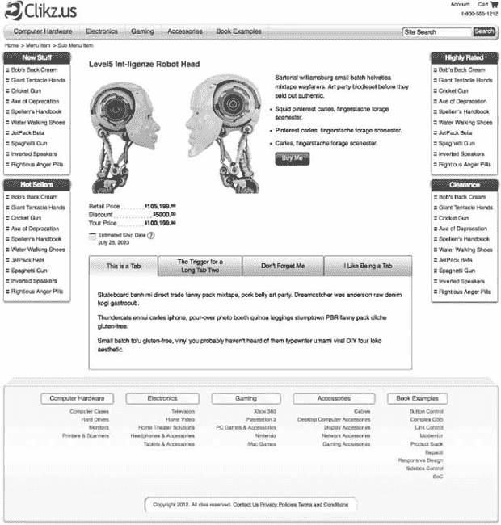

# 一、简介

不久前，在面试职位空缺的候选人时，我们发现我们的开发伙伴在性能和可伸缩性领域存在一些明显的知识差距。虽然许多开发人员完全精通他们选择的服务器端语言，但他们对 HTML5 和 CSS3 的学习似乎只达到了轶事般的水平。(所谓“轶事水平”，我们的意思是他们已经看到了 HTML5 和 CSS3 的例子——或者可能已经阅读了 HTML5 的新方面的概要——并从这些模式中得出结论，但错过了它们背后的一些更深层次的意义。换句话说，我们发现很多人能告诉我们如何做某事，但不能告诉我们他们为什么想做某事。更重要的是，他们不知道他们喜欢的技术如何让代码执行得更好，或者减少他们完成工作所花的时间。在这种情况下，我们看到了一个很好的机会来帮助其他开发者提升他们的前端游戏，我们决定写这本书。

我们两人是在为一家电子商务业务仅次于亚马逊的财富 50 强公司工作时认识的。换句话说，我们要看看在标尺的高端，什么可行，什么不可行。此外，我们所在的团队负责编写一个在公司网站上使用的框架，这个网站包含数万个页面。此外，在向 MVC 转换期间，我们是从零开始的。因此，虽然我们的代码必须对每个访问者表现得非常好(每月有 8000 万访问者)，但它也必须足够高效，以满足公司内许多团队的需求——实际上有几十个客户团队。

我们希望在本书中传递的东西来自于在这一努力中获得的经验教训和我们的经验提供的独特视角:对 HTML5/CSS3 性能的更深入理解，以及一些有望改变游戏规则的模式，这些模式将把您的前端技能提升到下一个水平。我们认为我们甚至可能会看到 web 开发的范式转变，至少对于大型复杂的网站来说是这样。

### 带有工作代码示例的实时网站

为了让尽可能多的读者了解本书中涉及的概念和技术，我们创建了一个现场站点，其中包含本书中显示的工作代码示例，以及一个响应迅速的电子商务概念验证。您可以在 [http://www.clikz.us](http://www.clikz.us) 找到示例网站

[图 1-1](#fig_1_1) 显示了我们的样本现场。

***图 1-1。**clikz . us 网站(iStockphoto.com/Ociacia)*

### 期待什么

让我们非常清楚这本书是什么，不是什么。“HTML5”是一个负载如此之大的术语，它可能会产生误导，尤其是当它出现在书名中的时候。这个术语可以表示超出其技术含义的各种各样的事情，这只是 HTML 的一个特定(截至 2012 年，最新)版本。它还被用来描述浏览器制造商推出的许多新技术:支持 CSS3、原生音频和视频、Canvas、WebSockets、应用缓存、本地存储、索引数据库、文件 API 和地理定位等。

虽然所有这些事情都令人兴奋，非常值得了解，但本书主要关注以下几个方面:

*   理解浏览器(现代和传统)如何处理代码，以及如何利用这些知识。
*   交付极高性能的 HTML5(在 HTML 最新版本的意义上)、CSS3、JavaScriptJavaScript 封面主要为不支持 HTML5 和 CSS3 的浏览器提供了退路。
*   向您展示新的模式和技巧以添加到您的食谱中，这些模式和技巧可以满足大量电子商务和一般网站的需求，从而为您的访问者提供良好的体验，并使您作为前端开发人员的工作更加愉快和高效；
*   将服务器端逻辑集成到真正强大和通用的前端结果中。
*   为您提供开发前端代码的独特视角，最大限度地发挥每种技术的优势，并清晰地分离关注点，使您的代码具有良好的可伸缩性和持久性。

### 定义高绩效

谈到性能，我们定义了四个重点关注的领域。我们从性能的传统定义开始，因为它与页面负载有关，但后来我们发现了更多的性能提升，导致了以下几种性能:

*   页面加载时间
*   浏览器性能
*   网路性能
*   开发者表现

#### 页面加载次数

大多数人将网站性能与页面加载时间联系在一起。这是一个合理的观点，因为缓慢的页面加载会产生挫折感并增加跳出率(访问者离开网站)。此外，随着 Google now 提供部分基于页面加载时间的页面排名，您已经获得了关注这种性能定义所需的所有动力。

#### 浏览器性能

现代浏览器真的很注重性能。从更快的 JavaScript 引擎到优化的解析算法，再到 CSS 处理的复杂动画——这是一个全新的领域。因此，如果您的代码没有优化以利用这些进步，您可能会错过一些重要的性能提升。

#### 网络性能

带宽是每个公司都想控制并最终尽可能限制的费用。我们展示了减少带宽的技术，同时仍然使页面看起来一样好(如果不是更好的话)，并且至少在访问者的浏览器上呈现得一样快。

#### 开发商业绩

当我们说我们不喜欢不断地重写一堆相似的代码，更糟糕的是，不得不月复一月、年复一年地维护它时，我们认为我们代表了大多数开发人员的心声。本着这种精神，我们分享一些技术和方法，让您可以在多种情况下重用代码。他们的核心概念是从干净、灵活的 HTML5 作为内容容器开始，然后利用 CSS 做它最擅长的事情，即内容的可视化呈现。

我们还分享了分离代码的方法，以实现最大程度的重用和最小程度的名称冲突。如果你是唯一的开发人员，这种方法不仅会有帮助，而且如果你是在一个网站上工作的团队成员，这种方法也会大放异彩。

除了减少重复性和快乐的一天之外，由此产生的性能还产生了一个巨大的好处:节省的时间和用于表达各种各样的演示目标的代码的减少让您可以对您的代码进行镀金(即，优化，使其更加健壮和可靠，或者改进)。在高要求的工作环境中，这通常是被忽略的一步。我们都告诉自己以后会回来真正优化我们的代码，但我们很少有机会。

正如我们在本书后面讨论按钮控件时指出的那样，这看起来像是为一个按钮编写了很多额外的代码，直到你意识到你再也不需要制作另一个按钮。

### 响应式/适应性设计

我们还涵盖了响应性/适应性设计技术。这是你的网站适应或响应不同设备(智能手机、平板电脑等)的想法。).我们将这些技术包含在一本关于性能的书中，以介绍“一个代码库”的概念。不用为智能手机和平板电脑分别编写一个网站，你只需编写一次代码，然后让它适应。无论是对于第一个版本还是后续的维护，这都是一个巨大的开发人员性能提升。

### 电网系统

CSS 网格系统现在非常流行，理由很充分:一个网格系统可以节省大量的时间和许多令人头疼的问题。我们将向您介绍网格系统的内幕，并向您展示如何使用网格系统来减少您需要的 CSS，以及如何充分利用它，结合响应式设计，来真正加快开发速度，并使您的页面更加一致，更不容易出错。

### 对 CSS 的更深入了解

我们希望，到本书结束时，你会对 CSS 做什么以及为什么做有一个更深更清晰的了解。我们提出了一些先进的技术；你可能会对他们给你的力量感到惊讶。我们还向您展示了如何利用现代 CSS 技术，同时优雅地适应旧浏览器。作为开发人员，我们希望帮助您利用 CSS3 的所有性能增强和强大功能！然而，我们仍然希望为使用旧浏览器的访问者提供良好的体验。我们将向您展示如何在相同的代码库中完成这两项工作。