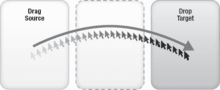
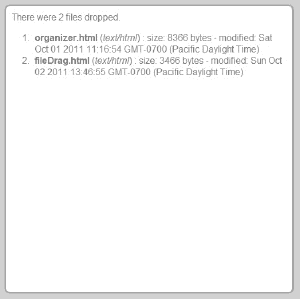
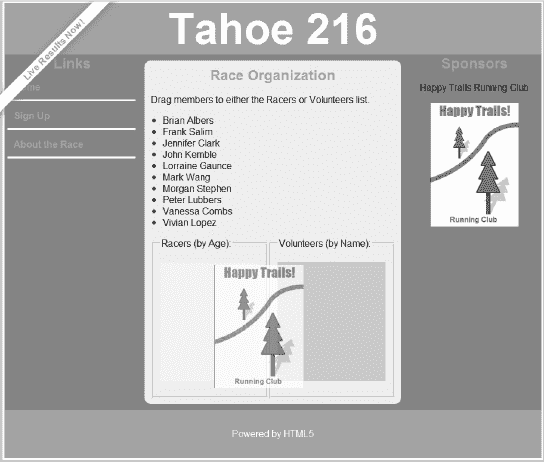

## C H A P T E R 9

## 使用 HTML5 拖放

自最初的苹果麦金塔电脑问世以来，传统的拖放操作一直很受用户欢迎。但是今天的计算机和移动设备有更复杂的拖放行为。拖放用于文件管理、传输数据、绘制图表和许多其他操作，在这些操作中，用手势移动对象比用键盘命令更自然。在街上问开发人员拖放包含什么，你可能会得到无数不同的答案，取决于他们最喜欢的程序和当前的工作任务。问非技术用户关于拖拽的问题，他们可能会茫然地盯着你；这个特性现在已经在计算机中根深蒂固，以至于不再经常被点名。

然而，HTML 在其存在的许多年中并没有将拖放作为核心特性。虽然一些开发人员已经使用内置功能来处理低级鼠标事件，作为破解原始拖放功能的一种方式，但与桌面应用程序中已经存在了几十年的拖放功能相比，这些努力就相形见绌了。随着一组精心设计的拖放功能的出现，HTML 应用程序向与桌面应用程序的功能相匹配又迈进了一步。

### 网络拖放:故事到此为止

你可能已经在网上看到过拖放的例子，并且想知道这些是不是 HTML5 拖放的用法。答案？可能不会。

原因是 HTML 和 DOM 从 DOM 事件的早期就已经公开了低级的鼠标事件，这对于有创造力的开发人员来说已经足够制作一个基本的拖放功能了。当与 CSS 定位结合使用时，通过创建复杂的 JavaScript 库和对 DOM 事件的深入了解，可以近似一个拖放系统。

例如，通过处理以下 DOM 事件，如果您编写了一组逻辑步骤(和一些注意事项)，就有可能在网页中移动项目:

*   `mousedown`:用户正在开始一些鼠标操作。(是拖还是只是点？)
*   `mousemove`:如果鼠标还没有抬起，移动操作开始。(是拖还是选？)
*   `mouseover`:鼠标已经移动到一个元素上。(是我想顺道拜访的人之一吗？)
*   鼠标留下了一个元素，它将不再是一个可以放置的地方。(我需要画反馈吗？)
*   `mouseup`:鼠标已经释放，可能触发了拖放操作。(根据起点，是否应在此位置完成卸货？)

虽然使用低级事件来建模一个粗糙的拖放系统是可能的，但是它有一些明显的缺点。首先，处理鼠标事件所需的逻辑比您想象的要复杂，因为每个列出的事件都有许多必须考虑的边缘情况。尽管有些人在之前的名单中，但现实是他们中有足够多的人值得拥有自己的一章。在这些事件中，CSS 必须小心地更新，以向用户提供关于在任何特定位置拖放的可能性的反馈。

然而，一个更严重的缺点是，这种特定的拖放实现依赖于对系统的完全控制。如果你试图将你的应用程序内容和其他内容混合在同一个页面中，当不同的开发者开始利用事件来达到他们自己的目的时，事情很快就会失控。类似地，如果您试图从别人的代码中拖放内容，您可能会遇到麻烦，除非这两个代码库事先仔细协调。此外，即席拖放不与用户的桌面交互，也不跨窗口工作。

新的 HTML5 拖放 API 旨在解决这些限制，借鉴了其他用户界面框架中提供的拖放方式。

 **注意**即使实现得当，也要注意拖放在任何应用程序中的局限性。如果拖动行为被覆盖，使用拖动手势导航的移动设备可能无法正常工作。此外，拖放会干扰拖动选择。小心谨慎、适当地使用它。

### html 5 拖放概述

如果您在 Java 或 Microsoft MFC 等编程技术中使用过拖放 API，那么您很幸运。新的 HTML5 拖放 API 严格按照这些环境的概念建模。开始很容易，但是掌握新的功能意味着您需要熟悉一组新的 DOM 事件，尽管这次是在更高的抽象层次上。

#### 大局

学习新 API 最简单的方法是将它映射到您已经熟悉的概念上。如果你正在阅读一本关于 pro HTML5 编程的书，我们将大胆假设你在日常计算中对使用拖放很有经验。尽管如此，我们可以从一些主要概念的标准术语开始。

如图[图 9-1](#fig_9_1) 所示，当你(作为用户)开始一个拖放操作时，你是通过点击拖动指针开始的。开始拖动的项目或区域被称为**拖动源**。当您释放指针并完成操作时，您最终瞄准的区域或项目被称为**拖放目标**。当鼠标在页面上移动时，您可能会在实际释放鼠标之前遍历一系列拖放目标。

***图 9-1。**拖动源和放下目标*

目前为止，一切顺利。但是简单地按住鼠标并把它移动到应用程序的另一部分并不构成拖放。相反，是操作过程中的反馈促成了成功的交互。考虑你自己在过去的经历中对拖放的使用；最直观的是系统不断更新，让你知道如果你在这个时间点释放会发生什么:

*   光标是否表明当前位置是有效的放置目标，或者它是否用“禁止”光标指示器暗示拒绝？
*   光标是否向用户暗示操作将是移动、链接或复制，例如光标上的“加号”指示符？
*   如果你现在释放鼠标，你所悬停的区域或目标是否会以任何方式改变它的外观，以表明它当前被选择为拖放？

为了在 HTML 拖放操作过程中向用户提供类似的反馈，浏览器将在单次拖动过程中发出一系列事件。这证明是非常方便的，因为在这些事件中，我们将完全有权力改变页面元素的 DOM 和样式，以给出用户期望的反馈类型。

除了拖放源和拖放目标之外，新 API 中还有一个关键概念需要学习:数据传输。该规范将数据传输描述为一组对象，用于公开拖放操作背后的拖动数据存储。然而，把数据传输看作是拖放的中央控制可能更容易。操作类型(例如，移动、复制或链接)、拖动过程中用作反馈的图像以及数据本身的检索都在这里进行管理。

关于数据本身，完成拖放的数据传输机制直接解决了前面描述的旧的专门拖放技术的一个限制。数据传输机制的工作方式类似于网络协议协商，而不是强制所有的拖放源和拖放目标知道彼此。在这种情况下，协商是通过多用途互联网邮件交换(MIME)类型执行的。

 **注意** MIME 类型与用于在电子邮件中附加文件的类型相同。它们是在所有类型的网络流量中普遍使用的互联网标准，在 HTML5 中非常常见。简而言之，MIME 类型是标准化的文本字符串，用于对未知内容的类型进行分类，例如“text/plain”表示纯文本，“image/png”表示 png 图像。

使用 MIME 类型的目的是允许源和目标协商哪种格式最适合放置目标的需要。如[图 9-2](#fig_9_2) 所示，在拖动启动期间，dataTransfer 对象加载了代表所有合理类型或“风格”的数据，通过这些数据可以进行传输。然后，当 drop 完成时，drop 处理程序代码可以扫描可用的数据类型，并决定哪种 MIME 类型格式最适合它的需要。

例如，假设网页中的列表项代表一个人。有许多不同的方式来表示一个人的数据；有些是标准的，有些不是。当拖动开始于一个特定的人的列表项时，拖动开始处理程序可以声明这个人的数据有几种格式，如[表 9-1](#tab_9_1) 所示。

当放下完成时，放下处理程序可以查询可用数据类型的列表。从提供的列表中，处理程序可以选择最合适的类型。文本列表放置目标可以选择获取文本/普通“味道”的数据来检索人员的姓名，而更高级的控件可以选择检索并显示人员的 PNG 图像作为放置的结果。而且，如果源和目标在非标准类型上协调一致，目标也可以检索下落时人的年龄。

***图 9-2** 。数据“风味”的拖放谈判*

正是这个协商过程允许拖放源和拖放目标分离。只要拖动源以多种 MIME 类型提供数据，拖放目标就可以选择最适合其操作的格式，即使这两种格式来自不同的开发人员。在本章的后面部分，我们将探索如何使用更不寻常的 MIME 类型，比如文件。

#### 要记住的事件

既然我们已经探索了拖放 API 的关键概念，那么让我们把重点放在可以在整个过程中使用的事件上。正如您将看到的，这些事件在比以前用来模拟拖放系统的鼠标事件更高的层次上操作。但是，拖放事件扩展了 DOM 鼠标事件。因此，如果需要的话，您仍然可以访问低级别的鼠标信息，比如坐标

##### 传播与预防

但是在我们关注拖放本身之前，让我们回顾一下自从浏览器对 DOM Level 3 事件进行标准化以来就存在的两个 DOM 事件函数:stopPropagation 和 preventDefault 函数。

考虑页面中的一个元素嵌套在另一个元素中的情况。我们将它们分别称为子元素和父元素。子元素占据了父元素的部分可视空间，但不是全部。尽管在我们的例子中我们只提到了两个元素，但实际上一个网页通常有许多嵌套层次。

当用户在孩子身上点击鼠标时，哪个元素应该实际接收事件:孩子，父母，还是两者？如果两者都有，按什么顺序？这个问题的答案是由万维网联盟(W3C)在 DOM events 规范中确定的。在称为“事件捕获”的过程中，事件从父节点开始，通过中介，向下传递到最具体的子节点一旦孩子访问了事件，事件通过一个称为“事件冒泡”的过程流回元素层次结构这两个流一起允许开发人员以最适合其页面架构的方式捕捉和处理事件。只有实际注册了处理程序的元素才会处理事件，这使系统保持轻量级。总体方法是来自多个浏览器厂商的不同行为的折衷，并且与其他本地开发框架一致，其中一些是捕获的，一些是冒泡的。

但是，任何时候处理程序都可以对事件调用 stopPropagation 函数，这将阻止它进一步向下遍历事件捕获链或向上遍历冒泡阶段。

 **注意**微软在`[http://ie.microsoft.com/testdrive/HTML5/ComparingEventModels](http://ie.microsoft.com/testdrive/HTML5/ComparingEventModels)`提供了一个很棒的事件模型互动演示

浏览器对于如何处理一些事件也有默认的实现。例如，当用户单击页面链接时，默认行为是将浏览器导航到该链接指定的目的地。开发人员可以通过拦截处理程序中的事件并对其调用 preventDefault 来防止这种情况。这允许代码重写某些内置事件的默认行为。这也是开发人员在事件处理程序中取消拖放操作的方式。

在我们的拖放 API 示例中，`stopPropagation`和`preventDefault`都很方便。

##### 拖放事件流

当用户在 HTML5 浏览器中启动拖放操作时，一系列事件在开始时触发，并在整个操作过程中持续。我们将在这里依次检查它们。

###### 拖启动

当用户开始在页面中的元素上拖动时，dragstart 事件在该元素上触发。换句话说，一旦鼠标按下，用户移动鼠标，就会启动`dragstart`。dragstart 事件非常重要，因为它是唯一一个可以使用`setData`调用在`dataTransfer`上设置数据的事件。这意味着在一个`dragStart`处理程序中，需要设置可能的数据类型，以便在拖放结束时可以查询它们，如前所述。

**拦截！**

**Brian 说**:“如果你想知道为什么数据类型只能在`dragStart`事件期间设置，实际上有一个很好的理由。

因为拖放被设计成跨窗口和跨各种来源的内容工作，如果`drag`事件监听器能够在拖动经过它们时插入或替换数据，这将是一个安全风险。想象一下，插入了事件监听器的恶意代码段查询并替换了经过的任何拖动的拖动数据。这将歪曲拖动源的意图，因此禁止在开始后进行任何数据替换。"

###### 拖动

拖动事件可以被认为是拖动操作的连续事件。当用户在页面上移动鼠标光标时，在拖动*源*上重复调用`drag`事件。在操作过程中，拖动事件将每秒触发几次。虽然拖动反馈的视觉效果可以在`drag`事件中修改，但是`dataTransfer`上的数据是禁止的。

###### 拖曳器

当拖动进入页面上的新元素时，会在该元素上触发一个`dragenter`事件。此事件是根据元素是否可以接收放下来设置放下反馈的好时机。

###### 休假

相反，每当用户将拖动移出先前调用`dragenter`的元素时，浏览器将触发一个`dragleave`事件。此时可以恢复拖放反馈，因为鼠标不再位于该目标上方。

###### 疏浚

在拖动操作过程中，当鼠标移动到一个元素上时，会频繁地调用`dragover`事件。与在拖动源上调用的对应拖动事件不同，此事件在鼠标的当前目标上调用。

###### 下降

当用户释放鼠标时，在当前鼠标目标上调用`drop`事件。基于`dataTransfer`对象的结果，这是处理拖放的代码应该执行的地方。

###### 承载

链中的最后一个事件`dragend`在拖动源上触发，表示拖动完成。它特别适合清理拖动过程中使用的`state`,因为不管拖放是否完成都会调用它。

总之，有很多方法可以拦截拖放操作并采取行动。拖拽事件链总结在[图 9-3](#fig_9_3) 中。

***图 9-3。**拖放事件流*

#### 拖参

既然您已经看到了在拖放操作中可以触发的不同事件，您可能想知道如何将 web 应用程序中的元素标记为可拖动的。那很简单！

除了少数元素(如文本控件)之外，页面中的元素在默认情况下是不可拖动的。然而，为了将特定元素标记为可拖动的，您需要做的就是添加一个属性:draggable。

`
`

只需添加该属性，就可以让浏览器触发上述事件。然后，您只需要添加事件处理程序来管理它们。

#### 转移和控制

在进入我们的例子之前，让我们更详细地评估一下`dataTransfer`对象。每个拖放事件都可以进行数据传输，如清单 9-1 所示。

***清单 9-1。**正在检索数据传输对象*

`Function handleDrag(evt) {
    var transfer = evt.dataTransfer;
    // …
}`

如[清单 9-1](#list_9_1) 中所述，`dataTransfer`用于在源和目标之间的协商过程中获取和设置实际的丢弃数据。这是使用下列函数和属性完成的:

*   `setData(format, data)`:在 dragStart 过程中调用该函数，可以注册一个 MIME 类型格式的传输项目。
*   `getData(format)`:该功能允许检索给定类型的注册数据项。
*   `types`:该属性返回所有当前注册格式的数组。
*   `items`:这个属性返回一个所有项目及其相关格式的列表。
*   `files`:该属性返回任何与放置相关的文件。这将在后面的章节中详细讨论。
*   `clearData()`:不带参数调用此函数，清除所有注册数据。用格式参数调用它只会移除该特定的注册。

拖动操作期间，还有两个函数可用于改变反馈:

*   `setDragImage(element, x, y)`:告诉浏览器使用现有的图像元素作为拖动图像，该图像将显示在光标旁边，向用户提示拖动操作的效果。如果提供了 x 和 y 坐标，那么这些坐标将被视为鼠标的放置点。
*   通过用提供的页面元素调用这个函数，你告诉浏览器把这个元素绘制成一个拖动反馈图像。

最后一组属性允许开发者设置和/或查询所允许的拖动操作的类型:

*   `effectAllowed`:将该属性设置为 none、copy、copyLink、copyMove、Link、linkMove、Move 或 all 中的一个，告诉浏览器只允许用户执行此处列出的操作类型。例如，如果设置了复制，则只允许复制操作，而移动或链接操作将被阻止。
*   `dropEffect`:该属性可用于确定当前正在进行哪种类型的操作，或者设置为强制特定的操作类型。操作类型包括复制、链接和移动。或者，可以设置值 none 来防止在该时间点发生任何丢弃。

总之，这些操作提供了对拖放的精细控制。现在，让我们看看他们的行动。

### 使用拖放功能构建应用程序

使用我们已经学过的概念，我们将在 Happy Trails Running Club 的主题中构建一个简单的拖放页面。该页面允许俱乐部比赛组织者将俱乐部成员拖入两个列表之一:赛车手和志愿者。为了将他们划分到不同的组别，参赛者将按照他们的年龄进行分类。另一方面，志愿者只按他们的名字排序，因为当他们不参加比赛时，他们的年龄并不重要。

列表的排序是自动完成的。应用程序本身将显示反馈，指示成员在两个列表中的适当放置区域，如图 9-4 所示。

***图 9-4。**显示分类成列表的参赛者的示例页面*

本示例的所有代码都包含在 code/draganddrop 目录中的本书示例中。我们将浏览页面并解释它在实践中是如何工作的。

首先，让我们看看页面的标记。在顶部，我们已经声明了我们俱乐部成员的数据(参见清单 9-2 )。

***清单 9-2。**显示可拖动成员姓名和年龄的标记*

`
Drag members to either the Racers or Volunteers list.

<ul id="members">
  <li draggable="true" data-age="38">Brian Albers</li>
  <li draggable="true" data-age="25">Frank Salim</li>
  <li draggable="true" data-age="47">Jennifer Clark</li>
  <li draggable="true" data-age="18">John Kemble</li>
  <li draggable="true" data-age="20">Lorraine Gaunce</li>
  <li draggable="true" data-age="30">Mark Wang</li>
  <li draggable="true" data-age="41">Morgan Stephen</li>
  <li draggable="true" data-age="39">Peter Lubbers</li>`
`  <li draggable="true" data-age="33">Vanessa Combs</li>
  <li draggable="true" data-age="54">Vivian Lopez</li>
</ul>`

如您所见，每个成员列表元素都被标记为`draggable`。这告诉浏览器让拖动在它们中的每一个上开始。接下来您会注意到，给定成员的年龄被编码为一个数据属性。`data` -符号是在 HTML 元素上存储非标准属性的标准方式。

我们的下一部分包含目标列表(见[清单 9-3](#list_9_3) )。

***清单 9-3。**下拉列表目标的标记*

`

<fieldset id="racersField">
<legend>Racers (by Age):</legend>
<ul id="racers"></ul>
</fieldset>

<fieldset id="volunteersField">
<legend>Volunteers (by Name):</legend>
<ul id="volunteers"></ul>
</fieldset>

`

被标识为`racers`和`volunteers`的无序列表是我们的成员将被插入的最终目的地。围绕它们的`fieldsets`在功能上相当于城堡周围的护城河。当用户拖入`fieldset`时，我们将知道他们已经退出了包含的列表，我们将相应地更新我们的视觉反馈。

说到反馈，我们的页面中有一些 CSS 样式值得注意(见[清单 9-4](#list_9_4) )。

***清单 9-4。**拖放演示的样式*

`#members li {
    cursor: move;
}

.highlighted {
    background-color: yellow;
}

.validtarget {
    background-color: lightblue;
}`

首先，我们确保源列表中的每个成员都显示一个移动光标。这给用户一个提示，即项目是可拖动的。

接下来，我们定义两个样式类:`highlighted`和`validtarget`。这些用于在拖放过程中绘制列表的背景颜色。在整个拖动过程中，`validtarget`背景将显示在我们的目的地列表中，以提示它们是有效的拖放目标。当用户实际上在目标列表上移动一个成员时，它将改变为`highlighted`样式，表明用户实际上在一个放置目标上。

为了跟踪页面上的状态，我们将声明几个变量(见清单 9-5 )。

***清单 9-5。**清单项目申报*

`    // these arrays hold the names of the members who are
    // chosen to be racers and volunteers, respectively
    var racers = [];
    var volunteers = [];

    // these variables store references to the visible
    // elements for displaying who is a racer or volunteer
    var racersList;
    var volunteersList;`

前两个变量将作为内部数组，用来记录哪些成员在参赛者和志愿者列表中。后两个变量只是用来方便地引用无序列表，这些列表包含了各个列表中成员的可视化显示。

现在，让我们设置所有的页面项目来处理拖放(见[清单 9-6](#list_9_6) )。

***清单 9-6。**事件处理程序注册*

`    function loadDemo() {

       racersList = document.getElementById("racers");
       volunteersList = document.getElementById("volunteers");

       // our target lists get handlers for drag enter, leave, and drop
       var lists = [racersList, volunteersList];
       [].forEach.call(lists, function(list) {
           list.addEventListener("dragenter", handleDragEnter, false);
           list.addEventListener("dragleave", handleDragLeave, false);
           list.addEventListener("drop", handleDrop, false);
       });

       // each target list gets a particular dragover handler
       racersList.addEventListener("dragover", handleDragOverRacers, false);
       volunteersList.addEventListener("dragover", handleDragOverVolunteers, false);

       // the fieldsets around our lists serve as buffers for resetting
       // the style during drag over
       var fieldsets = document.querySelectorAll("#racersField, #volunteersField");
       [].forEach.call(fieldsets, function(fieldset) {
           fieldset.addEventListener("dragover", handleDragOverOuter, false);
       });

       // each draggable member gets a handler for drag start and end
       var members = document.querySelectorAll("#members li");
       [].forEach.call(members, function(member) {
           member.addEventListener("dragstart", handleDragStart, false);
           member.addEventListener("dragend", handleDragEnd, false);`
`       });

    }

    window.addEventListener("load", loadDemo, false);`

当窗口最初加载时，我们调用一个`loadDemo`函数来设置所有的拖放事件处理程序。它们中的大多数不需要事件捕获，我们将相应地设置捕获参数。`racersList`和`volunteersList`都将收到`dragenter, dragleave`和`drop`事件的处理程序，因为这些事件是针对投放目标的。每个列表都将接收一个单独的拖拽事件监听器，因为这将允许我们基于用户当前拖拽的目标轻松地更新拖拽反馈。

如前所述，我们还在目标列表周围的字段集上添加了`dragover`处理程序。我们为什么要这样做？当一个拖拽退出我们的目标列表时，让`detect`变得更容易。虽然我们很容易检测到用户在我们的列表上拖动了一个项目，但是确定用户何时将项目*从我们的列表中拖出*就不那么容易了。这是因为当一个项目被拖出我们的列表*和*时，dragleave 事件都会被触发。实质上，当您从父元素拖动到它包含的一个子元素上时，拖动将退出父元素并进入子元素。虽然这提供了很多信息，但实际上很难知道拖动何时离开父元素的外部边界。因此，我们将使用一个通知，通知我们正在拖动列表周围的元素*，通知我们已经退出列表。稍后将提供更多相关信息。*

**往出口走**

Brian 说:“拖放规范的一个更反直觉的方面是事件的顺序。虽然您可能认为被拖动的项目会在进入另一个目标之前退出一个目标，但是您错了！

在从元素 A 拖动到元素 B 的过程中，事件的触发顺序是在元素 A 上触发`dragleave`事件之前在元素 B 上触发`dragenter`事件。这保持了与 HTML 鼠标事件规范的一致性，但这是设计中比较奇怪的方面之一。可以肯定的是，未来还会有更多这样的怪癖。"

我们的最后一组处理程序在我们的初始列表中注册每个`draggable`俱乐部成员的`dragstart`和`dragend`监听器。我们将使用它们来初始化和清理任何拖动。您可能会注意到，我们没有为`drag`事件添加处理程序，该事件会在拖动源上定期触发。因为我们不会更新被拖动项目的外观，所以在我们的例子中没有必要。

现在，我们将根据事件处理程序通常触发的顺序，依次检查实际的事件处理程序(见[清单 9-7](#list_9_7) )。

***清单 9-7。** dragstart 事件处理程序*

`    // called at the beginning of any drag
    function handleDragStart(evt) {

        // our drag only allows copy operations
        evt.effectAllowed = "copy";

        // the target of a drag start is one of our members
        // the data for a member is either their name or age
        evt.dataTransfer.setData("text/plain", evt.target.textContent);
        evt.dataTransfer.setData("text/html", evt.target.dataset.age);

        // highlight the potential drop targets
        racersList.className = "validtarget";
        volunteersList.className = "validtarget";

        return true;
    }`

在用户开始操作的`draggable`项上调用`dragstart`的处理程序。它是一个有点特殊的处理程序，因为它设置了整个流程的功能。首先，我们设置了`effectAllowed`，它告诉浏览器从这个元素拖动时只允许复制——不允许移动或链接。

接下来，我们预加载所有可能的数据类型，这些数据可能会在成功放下后被请求。自然，我们希望支持元素的文本版本，所以我们设置 MIME 类型`text/plain`来返回节点`draggable`中的文本(即俱乐部成员的名字)。

对于我们的第二种数据风格，我们希望 drop 操作传输关于拖动源的另一种类型的数据；在我们的例子中，是俱乐部成员的年龄。不幸的是，由于缺陷，并不是所有的浏览器都支持用户定义的 MIME 类型，比如`application/x-age`，这是最适合这种任意风格的。相反，我们将重用另一种普遍支持的 MIME 格式——`text/html`——暂时代表一种时代风格。希望 WebKit 浏览器将很快解决这个限制。

不要忘记`dragstart`处理器是唯一可以设置数据传输值的处理器。为了防止恶意代码在拖动过程中更改数据，在其他处理程序中尝试这样做将会失败。

我们在 start 处理程序中的最后一个动作纯粹是为了演示。我们将改变潜在拖放目标列表的背景颜色，给用户一个可能的提示。我们的下一个处理程序将在被拖动的项目进入和离开页面元素时处理事件(见[清单 9-8](#list_9_8) )。

***清单 9-8。** dragenter 和 dragleave 事件处理程序*

`    // stop propagation and prevent default drag behavior
    // to show that our target lists are valid drop targets
    function handleDragEnter(evt) {
        evt.stopPropagation();
        evt.preventDefault();
        return false;
    }

    function handleDragLeave(evt) {`
`        return false;
    }`

我们的演示不使用`dragleave`事件，我们处理它纯粹是为了说明的目的。

然而，`dragenter`事件可以通过在有效的放置目标上触发时调用`preventDefault`来处理和取消。这通知浏览器当前目标是有效的放下目标，因为*默认*行为是假设任何目标都不是有效的放下目标。

接下来，我们将看看拖拽处理程序(见[清单 9-9](#list_9_9) )。回想一下，每当拖动鼠标悬停在相关元素上时，这些按钮就会定时触发。

***清单 9-9。**外集装箱拖拽搬运机*

`    // for better drop feedback, we use an event for dragging
    // over the surrounding control as a flag to turn off
    // drop highlighting
    function handleDragOverOuter(evt) {

        // due to Mozilla firing drag over events to
        // parents from nested children, we check the id
        // before handling
        if (evt.target.id == "racersField")
          racersList.className = "validtarget";

        else if (evt.target.id == "volunteersField")
          volunteersList.className = "validtarget";

        evt.stopPropagation();
        return false;
    }`

我们的三个`dragover`处理程序中的第一个将仅用于调整拖动反馈。回想一下，当一个拖拽体离开了一个目标时，很难检测到，比如我们想要的参赛者和志愿者名单。因此，我们在列表周围的字段集上使用拖动移动来表示拖动已经离开了列表附近。这允许我们相应地关闭列表上的拖放高亮显示。

请注意，如果用户停留在字段集区域，我们列出的简单代码将重复更改 CSS `className`。出于优化的目的，最好只改变一次`className`,因为这可能会导致浏览器做更多不必要的工作。

最后，我们停止将事件传播到页面中的任何其他处理程序。我们不希望任何其他处理程序覆盖我们的逻辑。在接下来的两个`dragover`处理程序中，我们采用不同的方法(见[清单 9-10](#list_9_10) )。

***清单 9-10。**目标列表拖拽处理程序*

`    // if the user drags over our list, show
    // that it allows copy and highlight for better feedback
    function handleDragOverRacers(evt) {
        evt.dataTransfer.dropEffect = "copy";
        evt.stopPropagation();
        evt.preventDefault();

        racersList.className = "highlighted";
        return false;`
`    }

    function handleDragOverVolunteers(evt) {
        evt.dataTransfer.dropEffect = "copy";
        evt.stopPropagation();
        evt.preventDefault();

        volunteersList.className = "highlighted";
        return false;
    }`

这两个处理程序虽然有些冗长，但还是完整地列出来，以阐明我们的演示。第一个处理参赛者列表中的拖拽事件，第二个处理志愿者列表中的`dragover`事件。

我们采取的第一个动作是设置`dropEffect`来表明在这个节点上只允许复制，不允许移动或链接。这是一个很好的实践，尽管我们最初的`dragstart`处理程序已经将拖放操作限制为只复制。

接下来，我们阻止其他处理程序访问该事件并取消它。取消拖拽事件有一个重要的功能:它告诉浏览器默认操作——不是允许在这里拖拽——是无效的。本质上，我们是在告诉浏览器，它不应该不允许拖放；因此，下降是允许的。虽然这看起来似乎违背直觉，但回想一下,`preventDefault`是用来告诉浏览器不要为一个事件做正常的内置操作。例如，在点击一个链接时调用`preventDefault`会告诉浏览器不要导航到该链接的引用。规范设计者本可以为这个`dragover`创建一个新的事件或 API，但是他们选择保留已经在整个 HTML 中使用的 API 模式。

每当用户拖动我们的列表时，我们还会通过`highlighted` CSS 类将背景颜色改为黄色来给用户视觉反馈。拖放的主要工作是在 drop 处理程序中完成的，我们接下来将在清单 9-11 中研究它。

***清单 9-11。**目标列表的删除处理器*

`    // when the user drops on a target list, transfer the data
    function handleDrop(evt) {
        evt.preventDefault();
        evt.stopPropagation();

        var dropTarget = evt.target;

        // use the text flavor to get the name of the dragged item
        var text  = evt.dataTransfer.getData("text/plain");

        var group = volunteers;
        var list  = volunteersList;

        // if the drop target list was the racer list, grab an extra
        // flavor of data representing the member age and prepend it
        if ((dropTarget.id != "volunteers") &&
            (dropTarget.parentNode.id != "volunteers")) {
            text = evt.dataTransfer.getData("text/html") + ": " + text;
            group = racers;
            list  = racersList;`
`        }

        // for simplicity, fully clear the old list and reset it
        if (group.indexOf(text) == -1) {
            group.push(text);
            group.sort();

            // remove all old children
            while (list.hasChildNodes()) {
                list.removeChild(list.lastChild);
            }

            // push in all new children
            [].forEach.call(group, function(person) {
                var newChild = document.createElement("li");
                newChild.textContent = person;
                list.appendChild(newChild);
            });
        }

        return false;
    }`

同样，我们从防止默认的放下行为和防止控件传播到其他处理程序开始。默认的放置事件取决于放置元素的位置和类型。例如，拖放从另一个源拖入的图像会在浏览器窗口中显示该图像，默认情况下，将链接拖放到窗口中会导航到该图像。我们希望在演示中完全控制拖放行为，所以我们取消了任何默认行为。

回想一下，我们的演示展示了如何从拖放的元素中检索在`dragstart`中设置的多种数据类型。在这里，我们可以看到检索是如何完成的。默认情况下，我们使用 text/plain MIME 格式获取代表俱乐部成员姓名的纯文本数据。如果用户进入志愿者列表，这就足够了。

然而，如果用户将俱乐部成员放入赛车列表，我们需要额外的步骤来获取俱乐部成员的年龄，这是我们之前在`dragstart`期间使用文本/html 风格设置的。我们将它添加到俱乐部成员的名字前面，以在参赛者列表中显示年龄和姓名。

我们的最后一个代码块是一个简单但未经优化的例程，用于清除目标列表中所有以前的成员，添加新成员(如果他还不存在)，排序，并重新填充列表。最终结果是一个排序列表，包含旧成员和新删除的成员(如果他以前不存在)。

不管用户是否完成了拖放，我们都需要一个 dragend 处理程序来清理(见[清单 9-12](#list_9_12) )。

***清单 9-12。**用于清理的拖拉装卸机*

`    // make sure to clean up any drag operation
    function handleDragEnd(evt) {

        // restore the potential drop target styles
        racersList.className = null;
        volunteersList.className = null;
        return false;
    }`

在拖动结束时会调用一个`dragend`处理程序，不管拖放是否真的发生。如果用户取消了拖动或完成了拖动，仍会调用`dragend`处理程序。这给了我们一个很好的地方来清理我们在过程开始时改变的任何状态。毫不奇怪，我们将列表的 CSS 类重置为默认的非样式状态。

**分享就是关爱**

Brian 说:“如果你想知道拖放功能是否值得所有的事件处理程序代码，不要忘记 API 的一个关键好处:跨窗口甚至跨浏览器共享拖拽。

因为 HTML5 拖放的设计是为了反映桌面功能而构建的，所以它也支持跨应用程序共享就不足为奇了。您可以通过在多个浏览器窗口中加载我们的示例，并将成员从一个源列表拖到另一个窗口的参赛者和志愿者列表中来进行尝试。虽然我们简单的突出显示反馈不是为这种情况设计的，但是实际的拖放功能可以跨窗口工作，甚至跨浏览器工作，如果它们支持 API 的话。“我们的拖放示例很简单，但它展示了 API 的全部功能。

#### 进入空投区

如果你认为处理所有的拖放事件很复杂，你并不孤单。该规范的作者设计了一种替代的、简化的机制来支持放下事件:dropzone 属性。

dropzone 为开发人员提供了一种简洁的方式来注册元素是否愿意接受拖放，而无需编写冗长的事件处理程序。该属性由几个空格分隔的模式组成，当提供这些模式时，允许浏览器自动为您连接拖放行为(见[表 9-2](#tab_9_2) )。

借用我们的示例应用程序，racers 列表元素可以被指定为具有以下属性:

`<ul id="racers" dropzone=”copy s:text/plain s:text/html” ondrop=”handleDrop(event)”>`

这提供了一种快速的方式来告诉浏览器，支持纯文本或 HTML 数据格式的元素的复制操作可以从我们的列表中删除。

在撰写本文时，`dropzone`还不被大多数主流浏览器厂商支持，但对它的支持很可能即将到来。

### 处理文件的拖放

如果您曾经想要一种更简单的方式将文件添加到您的 web 应用程序中，或者您想知道一些最新的网站如何允许您将文件直接拖动到页面中并上传它们，答案就是 HTML5 文件 API。尽管整个 W3C 文件 API 的大小和状态超出了本次讨论的范围，但是许多浏览器已经支持该标准的一个子集，它允许将文件拖入应用程序中。

 **注意**W3C 文件 API 在`[www.w3.org/TR/FileAPI](http://www.w3.org/TR/FileAPI)`在线文档化。

File API 包含异步读取网页中的文件、在跟踪进程的同时将文件上传到服务器以及将文件转换为页面元素的功能。然而，拖放等附属规范使用了文件 API 的一个子集，这也是我们在本章中关注的地方。

回想一下，我们已经在本章中两次提到了文件拖放。首先，`dataTransfer`对象包含一个名为`files`的属性，如果合适的话，该属性将包含一个附加到拖动的文件列表。例如，如果用户将一个或一组文件从桌面拖到应用程序的网页中，浏览器将在`dataTransfer.files`对象有值的地方触发拖放事件。此外，支持前面提到的 dropzone 属性的浏览器通过使用`f` : MIME 类型前缀，允许特定 MIME 类型的文件有效地拖放到元素上。

 **注意**目前 Safari 浏览器只支持对文件的拖放操作。在页面内启动的拖动将触发大多数拖放事件，但只有当拖动类型为文件时，才会发生拖放事件。

通常，在大多数拖放事件中，您无法访问这些文件，因为出于安全原因，它们受到保护。尽管有些浏览器可能允许您在拖动事件期间访问文件列表，但没有浏览器允许您访问文件数据。此外，在拖动源元素处触发的`dragstart, drag`和 dragend 事件不会在文件拖放中触发，因为源是文件系统本身。

文件列表中的文件项支持以下属性:

*   **名称**:带扩展名的完整文件名
*   **类型**:文件的 MIME 类型
*   **size** :文件的大小，以字节为单位
*   **lastModifiedDate** :最后一次修改文件内容的时间戳

让我们看一个简单的文件拖放的例子，我们将展示任何被拖放到页面上的文件的特征，如图 9-5 所示。该代码包含在本书附带的 fileDrag.html 示例中。

***图 9-5。**显示丢失文件特征的演示页面*

我们演示的 HTML 实际上非常简单(见清单 9-13 )。

***清单 9-13。**文件拖放演示的标记*

`<body>

</body>`

页面中只有两个元素。放置文件的放置目标和状态显示区域。

和上一个例子一样，我们将在页面加载期间注册拖放事件处理程序(参见[清单 9-14](#list_9_14) )。

***清单 9-14。**文件拖放演示的加载和初始化代码*

`    var droptarget;

    // set the status text in our display
    function setStatus(text) {
        document.getElementById("status").innerHTML = text;
    }

    // ...

    function loadDemo() {

        droptarget = document.getElementById("droptarget");
        droptarget.className = "validtarget";

        droptarget.addEventListener("dragenter", handleDragEnter, false);
        droptarget.addEventListener("dragover", handleDragOver, false);
        droptarget.addEventListener("dragleave", handleDragLeave, false);
        droptarget.addEventListener("drop", handleDrop, false);

        setStatus("Drag files into this area.");
    }

    window.addEventListener("load", loadDemo, false);`

这一次，放置目标接收所有的事件处理程序。只需要处理程序的子集，我们可以忽略在拖动源发生的事件。

当用户拖动文件到我们的拖放目标时，我们将显示我们所知道的关于拖放候选对象的信息(见[清单 9-15](#list_9_15) )。

***清单 9-15。**文件拖放进入处理程序*

`    // handle drag events in the drop target
    function handleDragEnter(evt) {

        // if the browser supports accessing the file
        // list during drag, we display the file count
        var files = evt.dataTransfer.files;

        if (files)
            setStatus("There are " + evt.dataTransfer.files.length +
                " files in this drag.");
        else
            setStatus("There are unknown items in this drag.");

        droptarget.className = "highlighted";

        evt.stopPropagation();
        evt.preventDefault();`

`        return false;
    }`

虽然有些浏览器允许在拖动过程中访问`dataTransfer`文件，但我们会处理禁止访问该信息的情况。当计数已知时，我们将在状态中显示它。

处理`dragover`和`dragleave`事件很简单(参见[清单 9-16](#list_9_16) )。

***清单 9-16。**文件删除拖拽和拖拽离开处理程序*

`    // preventing the default dragover behavior
    // is necessary for successful drops
    function handleDragOver(evt) {
        evt.stopPropagation();
        evt.preventDefault();

        return false;
    }

    // reset the text and status when drags leave
    function handleDragLeave(evt) {
        setStatus("Drag files into this area.");

        droptarget.className = "validtarget";

        return false;
    }`

和往常一样，我们必须取消`dragover`事件，以允许拖放由我们自己的代码处理，而不是浏览器的默认行为，通常是内联显示。对于一个`dragleave`，我们只设置状态文本和样式来表示鼠标离开时拖放不再有效。我们的大部分工作是在 drop handler 中完成的(见[清单 9-17](#list_9_17) )。

***清单 9-17。**文件删除处理器*

`    // handle the drop of files
    function handleDrop(evt) {
        // cancel the event to prevent viewing the file
        evt.preventDefault();
        evt.stopPropagation();

        var filelist = evt.dataTransfer.files;

        var message = "There were " + filelist.length + " files dropped.";

        // show a detail list for each file in the drag
        message += "<ol>";

        [].forEach.call(filelist, function(file) {
            message += "<li>";
            message += "<strong>" + file.name + "</strong> ";
            message += "(<em>" + file.type + "</em>) : ";`
`            message += "size: " + file.size + " bytes - ";
            message += "modified: " + file.lastModifiedDate;
            message += "</li>";
        });

        message += "</ol>";

        setStatus(message);
        droptarget.className = "validtarget";

        return false;
    }`

如前所述，有必要使用`preventDefault`取消事件，这样浏览器的默认丢弃代码就不会被触发。

然后，因为我们在拖放处理程序中比在拖动过程中能访问更多的数据，所以我们可以检查附加到`dataTransfer`的`files`并发现被拖放文件的特征。在我们的例子中，我们将仅仅显示文件的属性，但是通过充分使用 HTML5 文件 API，您可以读入本地显示的内容，或者将它们上传到支持您的应用程序的服务器。

### 实用的临时演员

有时有些技术不适合我们的常规例子，但仍然适用于许多类型的 HTML5 应用程序。在这里，我们向您呈现一个简短、普通、实用的附加内容。

#### 定制拖动显示

通常，浏览器将默认拖动操作的可视光标指示器。图像或链接会随着光标移动(有时为了实际查看会缩小尺寸)，或者被拖动元素的重影图像会悬停在拖动位置。

但是，如果您需要更改默认的拖动图像显示，API 为您提供了一个简单的 API 来实现这一点。只可能在 dragstart 处理程序中更改拖动图像——同样是出于安全考虑——但是您可以通过简单地将表示光标外观的元素传递给`dataTransfer`来轻松实现。

`        var dragImage = document.getElementById("happyTrails");
        evt.dataTransfer.setDragImage(dragImage, 5, 10);`

注意传递给`setDragImage`调用的偏移坐标。这些 x 和 y 坐标告诉浏览器将图像中的哪个像素用作鼠标光标下的点。例如，通过分别为 x 和 y 传入值 5 和 10，图像将被定位成光标距离左边 5 个像素和顶部 10 个像素，如图 9-6 中的[所示。](#fig_9_6)

***图 9-6。**演示页面，拖动图像设置为快乐小径标志*

然而，拖动图像不必是图像。任何元素都可以设置为拖动图像；如果它不是一个图像，浏览器将创建一个可视的快照来作为光标显示。

### 总结

拖放 API 可能很难掌握。它涉及到许多事件的正确处理，如果你的拖放目标布局很复杂，其中的一些可能很难管理。但是，如果您正在寻找跨窗口或浏览器的拖动操作，甚至与桌面交互，您将需要学习 API 的微妙之处。从设计上来说，它结合了本机应用程序拖放功能，同时还能在必须保护数据免受第三方代码攻击的环境的安全限制内工作。

有关使用拖放文件作为应用程序数据的更多信息，请务必查看 W3C 文件 API。在下一章中，我们将研究 Web Workers API，它将允许您在主页之外生成后台脚本，以加快执行速度并改善用户体验。