## 二十

## **警报**

本章讨论创建**警报**的设计模式。警告通过将重要信息从内容中分离出来，向读者指出这些信息。警报有两种基本类型:**动态**和**静态**。本章中的前三个设计模式是动态警告，它在用户与文档交互时动态显示信息。本章中的其余警报是静态警报，它们总是显示在文档中。警报设计模式是一个 HTML 模式，它基本上是一个标题，后跟警报消息。Alert 之后的设计模式将它与其他设计模式相结合，演示了如何将现有的设计模式结合起来创建新的设计模式。

### 章节大纲

*   **JavaScript Alert** 展示了如何基于事件动态弹出警报。
*   **工具提示提示**展示了如何创建一个工具提示来向用户显示额外的信息。
*   **弹出警告**展示了如何弹出警告，向用户显示额外的信息。
*   **Alert** 显示了警报的基本 HTML 结构。
*   **Inline Alert** 展示了如何使用 Inline 元素制作一个警告。
*   **悬挂提醒**展示了如何通过使用不需要额外标记的悬挂缩进，将提醒的标题移动到左侧，将内容移动到右侧。
*   **图形警告**展示了如何将警告的标题移动到左侧，将内容移动到右侧，并用图像替换标题。
*   **运行警报**显示如何将警报标题运行到内容的第一行。
*   **浮动警告**展示了如何将警告浮动到内容的左侧或右侧，标题在左侧，内容在右侧。
*   **左边距警告**展示了如何使用绝对定位将警告移动到左边距。
*   **右边距警告**展示了如何使用绝对定位将警告移动到右边距。
*   **表单验证**展示了如何本地验证 HTML5 表单，并在用户输入错误时提醒用户。

### JavaScript 预警

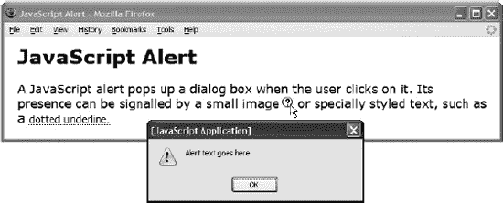

#### HTML

`<h1>JavaScript Alert</h1>

A JavaScript alert pops up a dialog box when the user clicks it.
  Its presence can be signalled by a small image****

  or specially styled text, such as a
**  <em class="alert" onclick="alert('Alert text goes here.');">**
   dotted underline**.</em>**

`

#### CSS

`*.alert-image { **cursor:pointer;** margin-left:3px; }

*.alert { **cursor:pointer; border-bottom:1px dotted;**
  font-style:normal; font-size:0.8em; }`

#### JavaScript 预警

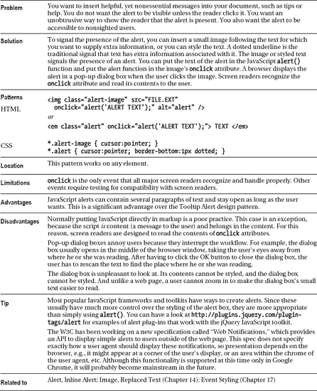

### 工具提示警告

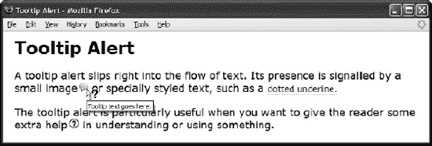

#### HTML

`<h1>Tooltip Alert</h1>

A tooltip alert slips right into the flow of text. It is usually signalled
  by a small image****

  or some type of text decoration, such as a
  **<em class="texttip" title="Tooltip text goes here.">**
  dotted underline**.</em>**

`

#### CSS

`*.tooltip-image { **cursor:help;** margin-left:3px; }

*.tooltip { **cursor:help; border-bottom:1px dotted;**
  font-style:normal; font-size:0.8em; }`

#### 工具提示警告

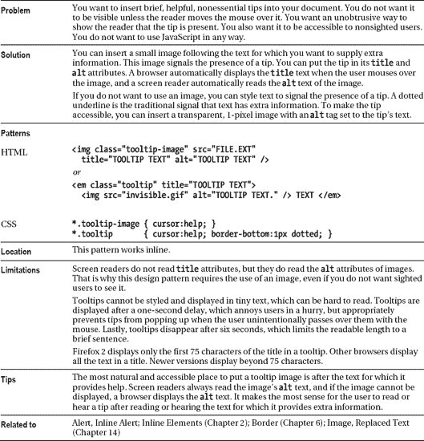

### 弹出预警

#### HTML

`<h1>Popup Alert</h1>

  
A pop-up can show tips and help.
    
    Pop-up help goes here.
     
    A pop-up can show the definition of a
    <dfn **class="popup-trigger" id="pt2"**>word.
    Pop-up definition goes here.</dfn>
     
    A pop-up can preview the target of a
    <a **class="popup-trigger" id="pt3"**
      href="http://www.cssdesignpatterns.com">link
      </a>.

`

#### CSS

`*.popup-trigger { **position:relative;** }

*.popup { **position:absolute;** left:0; top:1em; z-index:1;
  padding:5px; text-align:center; }

*.popup-trigger *.popup { **visibility:hidden;** }

/* Nonessential rules are not shown */`

#### 弹出预警

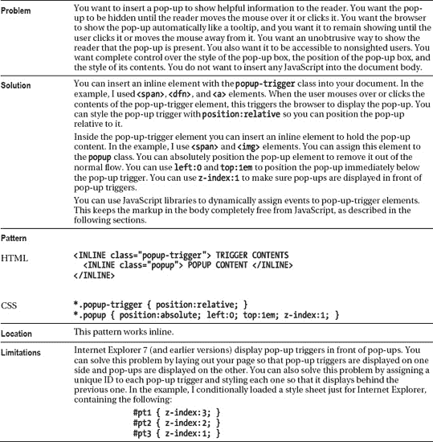

### 弹出预警

#### HTML 标题

`<head>
  <!-- only script elements are shown -->

  
  
  
  
  
</head>`

#### 页. js

`function **initPage**() {
  **assignEvent**( 'click', '*.popup-trigger',
    applyToDescendants, '*.popup', toggleVisibility );

  **assignEvent**( 'mouseover', '*.popup-trigger',
    applyToDescendants, '*.popup', showElement );

  **assignEvent**( 'mouseout', '*.popup-trigger',
    applyToDescendants, '*.popup', hideElement );
}

addEvent(window, 'unload', purgeAllEvents);
**addEvent(window, 'load', initPage);**

//The functions addEvent() and assignEvents() are in chdp.js.
//Full documentation for each function is found in the source code.`

#### 弹出预警

### 预警

#### HTML

`<h1>Alert</h1>

Text above the alert.

**
**
  **<h3>**Alert Heading</h3>
  **
**This is the content of the alert. It contains important information
    you want to point out to the reader.
  

Text below the alert.
`

#### CSS

`*.alert { margin:40px;
  padding-left:20px; padding-right:20px;
  border-top:1px solid black; border-bottom:1px solid black;
  background-color:gold; }
*.alert h3 { font-size:1.3em; }
*.alert p { letter-spacing:1.5px; line-height:1.5em; }
*.alert.tip h3 { text-transform:uppercase; }`

#### 预警

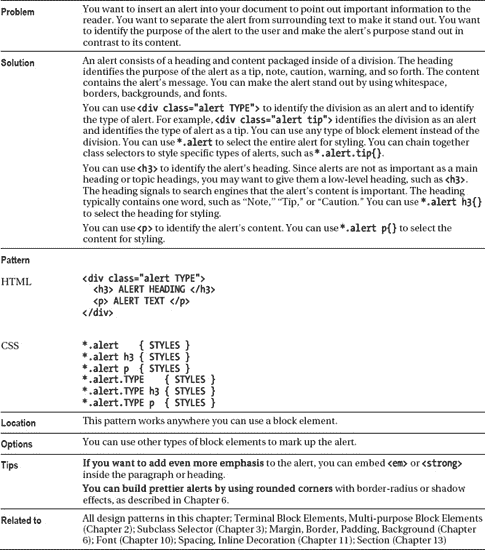

### 行内预警

#### HTML

`<h1>Inline Alert</h1>

An inline alert slips right into the flow of text.
  As such it can be broken across lines.

**  **
**    <strong class="heading">**Alert: </strong>
**    <em class="content">**brief message. </em>
  

  You can keep the alert's message brief and you can use
  <code>white-space:nowrap</code> to prevent it from breaking across lines.
  It is also important to make the line height large enough to prevent the
  alert's padding and border from overlapping neighboring lines. 
`

#### CSS

`*.alert { white-space:nowrap; line-height:2.3em;
  margin:0 20px; padding:8px 20px 5px 20px;
  border-top:1px solid black; border-bottom:1px solid black;
  background-color:gold; }

*.alert *.heading { font-weight:bold; font-size:1.3em; }

*.alert *.content { letter-spacing:1.5px; font-style:normal; }

*.alert.tip *.heading { text-transform:uppercase; }`

#### 行内预警

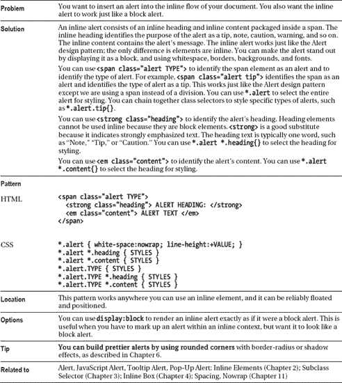

### 悬挂警戒

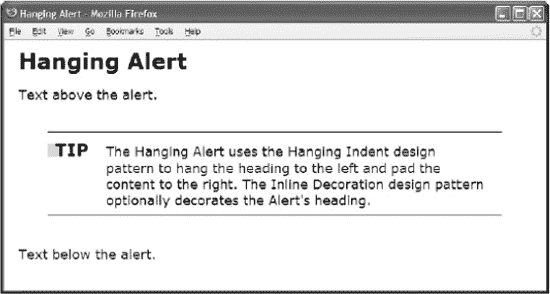

#### HTML

`<h1>Hanging Alert</h1>

Text above the alert.

**
**
**  <h3>&nbsp;Tip</h3>**
  **
**The Hanging Alert uses the Hanging Indent design pattern to hang the
    heading to the left and pad the content to the right. The Inline Decoration
    design pattern optionally decorates the Alert's heading.

Text below the alert.
`

#### CSS

`***.alert** { padding-right:20px; padding-top:10px; padding-bottom:10px;
  border-top:1px solid black; border-bottom:1px solid black; margin:40px; }

***.alert h3** { **display:inline;** font-size:1.3em; text-transform:uppercase; }

***.alert.tip { text-indent:-80px; padding-left:80px; }**
*.alert.note { text-indent:-110px; padding-left:110px; }
*.alert.caution { text-indent:-160px; padding-left:160px; }

***.alert.tip p { display:inline; margin-left:18px; }**
*.alert.note p { display:inline; margin-left:20px; }
*.alert.caution p { display:inline; margin-left:20px; }

***.alert *.decoration** { border-left:15px solid gold; margin-right:-10px;
  font-size:0.7em; vertical-align:2px; }`

#### 悬挂警戒

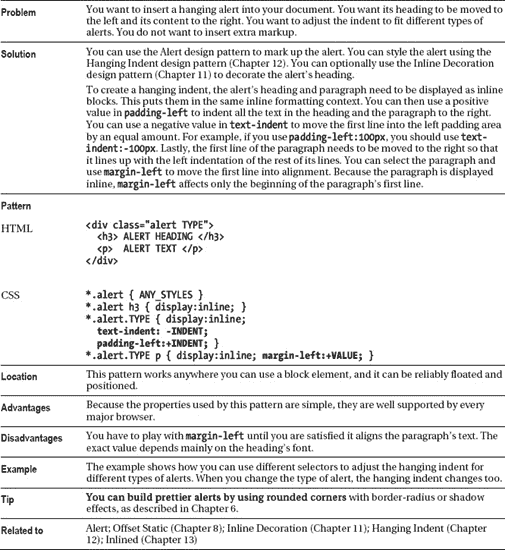

### 图形预警

#### HTML

`<h1>Graphical Alert</h1>

Text above the alert.

**  
**
    **<h3><em>**Tip</em>****</h3>
    **
**The Graphical Alert design pattern combines the Left Marginal design pattern
      and the Text Replacement design pattern to display a graphic
      on top of the heading.

Text below the alert.
`

#### CSS

`*.alert { position:relative; margin:20px 0 20px 120px; }
*.alert h3 { margin:10px 0; font-weight:bold; font-size:1.3em;
  text-transform:uppercase; }
*.alert p { margin:10px 0; }

*.alert.tip p { color:green; border:4px ridge green; padding:20px; }

*.alert.tip h3 { position:absolute; left:-100px; top:-15px;
  width:71px; height:117px; padding:0; overflow:hidden; }

*.alert.tip h3 em { position:absolute; left:20px; top:25px; }

*.alert.tip span { position:absolute; left:0; top:0; margin:0;
  width:71px; height:117px; background:url("tip.jpg") no-repeat; }`

#### 图形预警

### 磨合预警

#### HTML

`<h1>Run-In Alert</h1>

Text above the alert.

**
**
  **<h3>**&nbsp;Caution</h3>
  **
**The Run-In Alert runs the alert's heading into the text using
    <code>display:inline</code> on both the heading and the paragraph.

Text below the alert.
`

#### CSS

`***.alert** { padding-right:20px; padding-top:10px; padding-bottom:10px;
  border-top:1px solid black; border-bottom:1px solid black; margin:40px; }

***.alert h3** { **display:inline;** font-size:1.3em; text-transform:uppercase; }

***.alert p** { **display:inline;** margin-left:10px; letter-spacing:-0.8px }

*.alert.caution { color:red;
  border-top:3px double red; border-bottom:3px double red; }

*.alert *.decoration { border-left:15px solid gold;
  margin-right:-11px; font-size:0.7em; vertical-align:2px; }`

#### 磨合预警

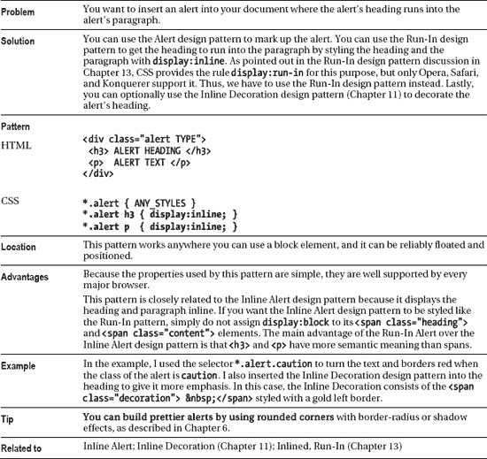

### 浮动预警

#### HTML

`<h1>Floating Alert</h1>

Text above the alert.

**
**
  **<h3>**&nbsp;Note</h3>
  **
**The Floating Alert design pattern floats the entire alert. Internally it also
    floats the alert's heading to the left and its paragraph to the right.

Text below the alert.

Notice how the alert is removed from the flow. Also notice how the browser
  automatically shrinks the right margin of this text so that it does not
  collide with the left margin of the floated alert.
`

#### CSS

`*.alert { float:right; width:350px; margin-left:20px;
  border-top:1px solid black; border-bottom:1px solid black; }

***.alert h3** { **float:left; width:50px; margin:10px 0;**
  font-size:1.3em; text-transform:uppercase; }

***.alert p** { **float:right; width:250px; margin:10px 0;** }

*.alert.note { color:blue;
  border-top:2px groove blue; border-bottom:2px ridge blue; }

*.alert *.decoration { border-left:15px solid gold;
  margin-right:-11px; font-size:0.7em; vertical-align:2px; }`

#### 浮动预警

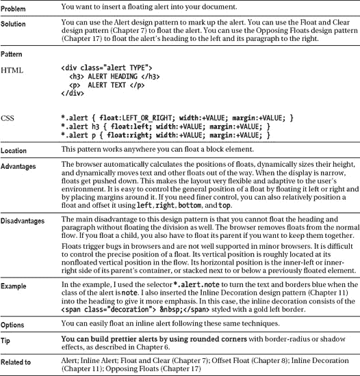

### 左边界警戒

#### HTML

`<h1>Left Marginal Alert</h1>

**
**
  
Text above the alert.

**  
**
    **<h3>**&nbsp;Tip</h3>
    **
**The Left Marginal Alert design pattern moves the entire alert into the
       left margin. Inside the alert itself, its heading is absolutely positioned
       to the left and its paragraph to the right.

  

  
Text below the alert.

  
Notice how the alert is removed from the flow and moves into the margin.
    Unlike the Floating Alert, you have to size the right or left margin
    to make room for the marginal alert.

`

#### CSS

`***.main { position:relative; margin-left:400px; }**
***.alert { position:absolute; width:350px; left:-400px; height:190px;**
  border-top:1px solid black; border-bottom:1px solid black; }
***.alert h3 { position:absolute; left:0; top:15px; margin:0;**
  font-size:1.3em; text-transform:uppercase; }
***.alert p { position:absolute; left:80px; top:15px; margin:0; }**
*.alert.tip { color:green;
  border-top:4px groove green; border-bottom:4px ridge green; }
*.alert *.decoration { border-left:15px solid gold;
  margin-right:-11px; font-size:0.7em; vertical-align:2px; }`

#### 左边界警戒

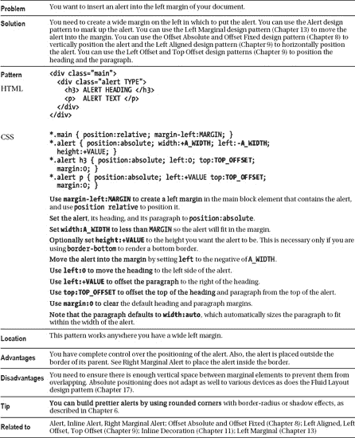

### 右旁注

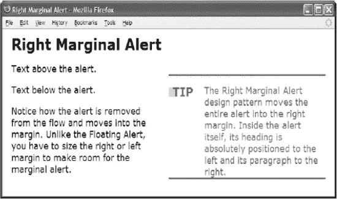

#### HTML

`**
**
  
Text above the alert.

**  
**
    **<h3>**&nbsp;Tip</h3>
    **
**The Right Marginal Alert design pattern moves the entire alert into the
       right margin. Inside the alert itself, its heading is absolutely positioned
       to the left and its paragraph to the right.

  

  
Text below the alert.

  
Notice how the alert is removed from the flow and moves into the margin.
    Unlike the Floating Alert, you have to size the right or left margin
    to make room for the marginal alert.

`

#### CSS

`***.main { position:relative; padding-right:400px; }**
***.alert { position:absolute; width:350px; right:0; height:190px;**
  border-top:1px solid black; border-bottom:1px solid black; }
***.alert h3 { position:absolute; left:0; top:15px; margin:0;**
  font-size:1.3em; text-transform:uppercase; }

***.alert p { position:absolute; left:80px; top:15px; margin:0; }**
*.alert.tip { color:green;
  border-top:4px groove green; border-bottom:4px ridge green; }
***.alert *.decoration** { border-left:15px solid gold;
  margin-right:-11px; font-size:0.7em; vertical-align:2px; }`

#### 右旁注

### 表单验证

#### HTML

`<h1>Form Validation</h1>

Please fill in form:

  <form method="post">
    <label>Email: <input type="email" required></label>
    <label>URL: <input type="url" required></label>
    <label>Number: <input type="number" max="100" min="0" step="2" required></label>
    <input type="submit" value="Submit"></form>
  </form>`

#### CSS

`input {margin-right: 10px;}`

#### 表单验证

