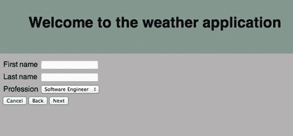
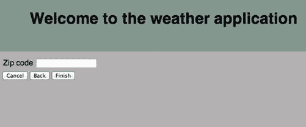
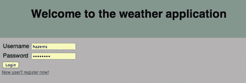
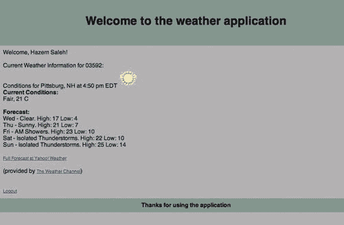
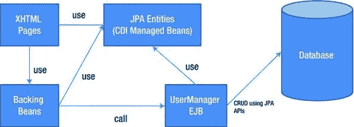

第十章


创建基本的 JSF 2.2 应用程序

在本章中，您将详细了解如何在 Java EE 7 环境中创建一个基本的 JSF 2.2 应用程序。这个应用程序将向你展示如何在 Java EE 7 环境中设计和开发你的 JSF 应用程序。该应用程序利用 JSF 2.2 创建页面和处理页面流，CDI(上下文和依赖注入)进行 bean 管理，EJB 3.2 进行事务处理，JPA 2.1 进行数据持久化。

结构化天气应用程序

基本应用是关于显示保存在他/她的简档中的用户地点的天气信息的应用。在天气应用程序中，用户需要首先在应用程序中注册。为了在应用程序中注册，用户需要在由三个页面组成的流程中输入他/她的信息。如图[图 10-1](#Fig1) 所示，在第一页中，用户必须输入他/她的首选用户名、密码和电子邮件。


[图 10-1](#_Fig1) 。天气应用注册(首页)

如果用户输入空用户名、密码或电子邮件，将显示必填字段消息，并且当用户输入无效格式的电子邮件时，将显示无效电子邮件格式消息。

在第一页输入信息后，用户进入流程的第二页，用户输入他/她的名字、姓氏和职业，如图[图 10-2](#Fig2) 所示。



[图 10-2](#_Fig2) 。天气应用注册(第二页)

最后，在注册流程的最后一页，用户在最后一页输入他/她的邮政编码，如[图 10-3](#Fig3) 所示，然后点击“完成”按钮。



[图 10-3](#_Fig3) 。天气应用注册(第三页)

在应用程序中注册后，用户将能够使用他/她的用户名和密码登录应用程序，如[图 10-4](#Fig4) 所示。



[图 10-4](#_Fig4) 。天气应用登录页面

登录应用程序后，如[图 10-5](#Fig5) 所示，用户将被转到天气屏幕，在该屏幕中，用户将能够了解他在注册最终页面中输入的地方的天气信息。



[图 10-5](#_Fig5) 。天气应用主页

现在，在浏览完天气应用程序的页面后，让我们看看如何构建它。[图 10-6](#Fig6) 显示了天气应用的结构。



[图 10-6](#_Fig6) 。天气应用结构

如上图所示，该应用程序具有以下结构:

1.  **XHTML 页面:** 这些表示天气应用程序页面。它使用 JSF 表达式语言(EL)来使用支持 bean 和受管 bean。
2.  **Backing bean:**这些是普通的托管 bean，它们在概念上与 UI 页面相关，并且不是应用程序模型的一部分。Backing beans 是集中处理页面操作的理想选择。在天气应用程序中，backing beans 主要获取托管 bean 的实例，这些实例携带用户输入的数据，然后调用 UserManager EJB 来执行所需的操作。
3.  **用户经理 EJB:** 为了执行不同的业务操作，backing beans 调用用户经理 EJB。用户管理器 EJB 是一个无状态会话 EJB*，它使用 JPA 实体和 JPA EntityManager 来执行所需的数据库操作。
4.  **JPA 实体(CDI 托管 bean):**JPA 实体表示映射到数据库表的数据类。在 weather 应用程序中，JPA 实体被用作应用程序的 CDI 托管 beanss，这些 bean 使用 EL 与 XHTML 页面绑定在一起。

注意，为了简单起见，应用程序使用 Oracle Java DB。Java DB 是 Oracle 支持的 Apache Derby 开源数据库的发行版。它通过 JDBC 和 Java EE APIs 支持标准 ANSI/ISO SQL，并包含在 JDK 中。

 **注意**要知道 JPA 可以不用 EJBs 然而，在 JPA 应用程序中使用 EJB 有一个很大的优势，那就是通过 EJB 容器隐式地处理应用程序事务(容器管理的事务)。尽管天气应用程序是一个基本的 JSF 2.2 应用程序，但我们坚持引入包含 JPA 的 EJB，以便向您展示这些技术如何在 JSF 2.2 应用程序中协同工作。

在接下来的部分中，我们将深入应用程序组件的细节。

 **注意**需要注意的是，深入 EJB 和 JPA 的细节超出了本书的范围。为了了解学习它们的能力，我们推荐你阅读 Oracle Java EE 教程:[http://docs.oracle.com/javaee/7/tutorial/doc/](http://docs.oracle.com/javaee/7/tutorial/doc/)。

构建 JSF 页面

天气应用程序有以下 XHTML 页面:

1.  主页(home.xhtml):表示应用的登录页面，如图[图 10-4](#Fig4) 所示。
2.  注册页面(/registration/*。xhtml):它们表示包含注册流程的页面；注册页面包括以下页面:
    *   a.registration.xhtml 页面，表示[图 10-1](#Fig1) 所示流程中的第一个注册页面。
    *   b.extraInfo.xhtml 页面，表示[图 10-2](#Fig2) 所示流程中的第二个注册页面。
    *   c.final.xhtml 页面，表示[图 10-3](#Fig3) 所示流程中的最终注册页面。
3.  天气页面(/protected/weather.xhtml)，代表[图 10-5](#Fig5) 所示的天气页面。

清单 10-1 显示了 home.xhtml 页面代码。

[***清单 10-1。***](#_list1) 首页 XHTML 代码

```html
<?xml version='1.0' encoding='UTF-8' ?>
<!DOCTYPE html>
<html FontName">http://www.w3.org/1999/xhtml"
      xmlns:ui="http://java.sun.com/jsf/facelets"
      xmlns:h="http://java.sun.com/jsf/html">

<ui:composition template="/WEB-INF/templates/main.xhtml">
    <ui:define name="title">
        #{bundle['application.loginpage.title']}
    </ui:define>
    <ui:define name="content">
        <h:form>
            <h:panelGrid columns="3">
                <h:outputText value="#{bundle['user.id']}"></h:outputText>
                <h:inputText id="userID"
                             value="#{appUser.id}"
                             required="true"
                             requiredMessage="#{bundle['user.id.validation']}">
                </h:inputText>
                <h:message for="userID" styleClass="errorMessage"/>

                <h:outputText value="#{bundle['user.password']}"></h:outputText>
                <h:inputSecret id="password"
                               value="#{appUser.password}"
                               required="true"
                               requiredMessage="#{bundle['user.password.validation']}">
                </h:inputSecret>
                <h:message for="password" styleClass="errorMessage"/>
            </h:panelGrid>

            <h:commandButton value="#{bundle['application.login']}" action="#{loginBacking.login}"/> <br/>
            <h:link value="#{bundle['application.loginpage.register']}" outcome="registration"/>
            <br/><br/>
            <h:messages styleClass="errorMessage"/>
        </h:form>
    </ui:define>
</ui:composition>

</html>
```

如前面的代码所示，天气应用程序的主页包含用户名 InputText 和密码 InputSecret。login CommandButton 调用 LoginBacking bean 的 login 方法，registration 链接导航到“registration”流(将在下一节中详细说明)。[清单 10-2](#list2) 显示了 LoginBacking bean。

[***清单 10-2。***](#_list2) 登录备份豆

```html
package com.jsfprohtml5.weather.backing;

import com.jsfprohtml5.weather.model.AppUser;
import com.jsfprohtml5.weather.model.UserManagerLocal;
import java.util.logging.Level;
import java.util.logging.Logger;
import javax.ejb.EJB;
import javax.enterprise.context.RequestScoped;
import javax.faces.application.FacesMessage;
import javax.inject.Named;

@Named
@RequestScoped
public class LoginBacking extends BaseBacking {

    @EJB
    private UserManagerLocal userManager;

    public String login() {
        AppUser currentAppUser = (AppUser) evaluateEL("#{appUser}", AppUser.class);

        try {
            AppUser appUser = userManager.getUser(currentAppUser.getId(), currentAppUser.getPassword());

            if (appUser == null) {
                getContext().addMessage(null, new FacesMessage(INVALID_USERNAME_OR_PASSWORD));
                return null;
            }

            //Set Necessary user information
            currentAppUser.setEmail(appUser.getEmail());
            currentAppUser.setFirstName(appUser.getFirstName());
            currentAppUser.setLastName(appUser.getLastName());
            currentAppUser.setZipCode(appUser.getZipCode());
            currentAppUser.setProfession(appUser.getProfession());
        } catch (Exception ex) {
            Logger.getLogger(LoginBacking.class.getName()).log(Level.SEVERE, null, ex);
            getContext().addMessage(null, new FacesMessage(SYSTEM_ERROR));
            return null;
        }

        return "/protected/weather";
    }

    ...
}
```

LoginBacking bean 是处理登录操作的后备 bean。它调用用户管理器 EJB，以便知道用户是否使用 getUser()方法在系统中注册(用户管理器 EJB 将在“应用程序后端”一节中详细说明)。为了获取与用户名和密码字段绑定的 AppUser 的 CDI 托管 bean 实例，调用 evaluateEL()方法来计算#{appUser}表达式。evaluateEL()方法位于 base backing bean (BaseBacking)类中。

如果 getUser()方法返回 null，这意味着用户没有使用输入的用户名和密码组合在系统中注册，并且为用户显示无效的用户名或密码消息。如果用户名和密码组合有效，则在#{appUser}托管 bean 实例(appUser 既是请求范围的 CDI 托管 bean，也是 JPA 实体类，将在“应用程序后端”一节中详细说明)中检索和设置用户信息，并将页面转发到天气页面。

 **注意** @EJB 注释可以用来注释 bean 的实例变量，以指定对 EJB 的依赖。Application Server 使用依赖注入，通过引用它所依赖的 EJB，自动初始化带注释的变量。这个初始化发生在调用 bean 的任何业务方法之前和设置 bean 的 EJBContext 之后。

如[图 10-7](#Fig7) 所示，所有天气应用程序的后台 beans 都从 BaseBacking 类扩展而来。


[图 10-7](#_Fig7) 。天气应用程序的支持 beans

清单 10-3 显示了 BaseBacking 类的代码。

[***清单 10-3。***T5】base backing Bean 类](#_list3)

```html
package com.jsfprohtml5.weather.backing;

import java.util.Map;
import javax.faces.context.FacesContext;
import javax.servlet.http.HttpSession;

public class BaseBacking {

    protected FacesContext getContext() {
        return FacesContext.getCurrentInstance();
    }

    protected Map getRequestMap() {
        return getContext().getExternalContext().getRequestMap();
    }

    protected HttpSession getSession() {
        return (HttpSession) getContext().getExternalContext().getSession(false);
    }

    protected Object evaluateEL(String elExpression, Class beanClazz) {
        return getContext().getApplication().evaluateExpressionGet(getContext(), elExpression, beanClazz);
    }

    ...
}
```

BaseBacking class 是一个基类，它包含获取 JSF Faces 上下文、获取 HTTP 会话、获取 HTTP 请求映射和评估 JSF 表达式的快捷方式。清单 10-4 显示了 weather.xhtml 页面代码。

[***清单 10-4。***](#_list4) 天气主页

```html
<?xml version='1.0' encoding='UTF-8' ?>
<!DOCTYPE html>
<html FontName">http://www.w3.org/1999/xhtml"
      xmlns:ui="http://java.sun.com/jsf/facelets"
      xmlns:h="http://java.sun.com/jsf/html"
      xmlns:mashup="http://code.google.com/p/mashups4jsf/">

<ui:composition template="/WEB-INF/templates/main.xhtml">
    <ui:define name="title">
        #{bundle['application.weatherpage.title']}
    </ui:define>
    <ui:define name="content">
        <h:form>
            #{bundle['application.welcome']}, #{appUser.firstName} #{appUser.lastName}! <br/><br/>

            #{bundle['application.weatherpage.currentInfo']} for #{appUser.zipCode}:
            <mashup:yahooWeather temperatureType="c" locationCode="#{appUser.zipCode}"/> <br/><br/>

            <h:commandLink value="#{bundle['application.weatherpage.logout']}"
                           action="#{weatherBacking.logout}"></h:commandLink> <br/><br/>
        </h:form>
    </ui:define>
</ui:composition>

</html>
```

天气页面向用户和 Yahoo！使用 Mashups4JSF 库的 yahooWeather 组件([http://code.google.com/p/mashups4jsf/](http://code.google.com/p/mashups4jsf/))来检索天气信息。

 **注意** Mashups4JSF 是一个开源项目，旨在集成 Mashup 服务和 JavaServer Faces 应用程序。使用 Mashups4JSF，JSF 开发人员将能够通过使用简单的标记来构建丰富的定制 Mashups。Mashups4JSF 还允许通过用@Feed 注释对应用程序域类进行注释，将 Java 企业应用程序数据作为 Mashup feeds 导出。更多信息请查看项目主页:[http://code.google.com/p/mashups4jsf/](http://code.google.com/p/mashups4jsf/)。

yahooWeather 组件使您能够查看世界上特定位置的当前天气状况(使用 Yahoo！引擎盖下的天气服务)使用其邮政编码。它有两个主要属性，如[表 10-1](#Tab1) 所示。

[表 10-1](#_Tab1) 。Mashups4JSF yahooWeather 组件

| 

组件属性

 | 

描述

 |
| --- | --- |
| 位置代码 | 该位置的邮政编码 |
| 温度类型 | 以华氏(`f`)或摄氏(`c`)为单位的温度。默认是`c`。 |

为了在我们的 JSF 应用程序中配置 Mashups4JSF，我们需要向您的 web 应用程序的 lib 文件夹添加两个 jar:

*   Mashups4JSF 1.0.0 核心 jar。
*   罗马 0.9 jar。

如果我们的应用程序是一个 Maven 应用程序，我们需要将这些 jar 添加到应用程序的 pom.xml 中，如清单 10-5 所示。

[***清单 10-5。***](#_list5)POM . XML 中的 Mashups4JSF 依赖

```html
<project ...>
    ...
    <dependencies>
        ...
        <dependency>
            <groupId>com.googlecode.mashups4jsf</groupId>
            <artifactId>mashups4jsf-core</artifactId>
            <version>1.0.0</version>
        </dependency>
        <dependency>
            <groupId>rome</groupId>
            <artifactId>rome</artifactId>
            <version>0.9</version>
        </dependency>
    </dependencies>

    <repositories>
        ...
        <repository>
            <id>googlecode.com</id>
            <url>[http://mashups4jsf.googlecode.com/svn/trunk/mashups4jsf-repo</url](http://mashups4jsf.googlecode.com/svn/trunk/mashups4jsf-repo</url) >
        </repository>
    </repositories>
</project>
```

将 Mashups4JSF jars 添加到应用程序的依赖项之后，我们可以将它包含在 XHTML 页面中，如下所示:

```html
<html FontName">http://www.w3.org/1999/xhtml"
      xmlns:ui="http://java.sun.com/jsf/facelets"
      xmlns:h="http://java.sun.com/jsf/html"
      xmlns:mashup="http://code.google.com/p/mashups4jsf/">
```

天气页面有一个 logout CommandLink，其操作与 WeatherBacking bean 类的 logout 方法绑定在一起。清单 10-6 显示了 WeatherBacking bean 类。

[***清单 10-6。***](#_list6) 逆风豆类

```html
package com.jsfprohtml5.weather.backing;
import javax.enterprise.context.RequestScoped;
import javax.inject.Named;

@Named
@RequestScoped
public class WeatherBacking extends BaseBacking {
    public String logout() {
        getSession().invalidate();

        return "/home.xhtml?faces-redirect=true";
    }
}
```

在 logout()方法中，会话被无效，用户被转到主页。请注意，所有应用程序页面都使用/WEB-INF/templates 文件夹下的 main.xhtml 模板。清单 10-7 显示了 main.xhtml 模板页面。

[***清单 10-7。***](#_list7) main.xhtml 模板页面

```html
<?xml version='1.0' encoding='UTF-8' ?>
<!DOCTYPE html>
<html FontName">http://www.w3.org/1999/xhtml"
      xmlns:ui="http://java.sun.com/jsf/facelets"
      xmlns:h="http://java.sun.com/jsf/html">

<h:head>
  <title><ui:insert name="title">#{bundle['application.defaultpage.title']}</ui:insert></title>
  <link href="#{request.contextPath}/css/main.css" rel="stylesheet" type="text/css"/>
</h:head>

<h:body>
    <div id="container">
        <div id="header">
            <ui:insert name="header">
                <h1>#{bundle['application.defaultpage.header.content']}</h1>
            </ui:insert>
        </div>

        <div id="content">
            <ui:insert name="content">
                #{bundle['application.defaultpage.body.content']}
            </ui:insert>
        </div>

        <div id="footer">
            <ui:insert name="footer">
                #{bundle['application.defaultpage.footer.content']}
            </ui:insert>
        </div>
    </div>
</h:body>
</html>
```

该模板使用 main.css 样式文件，它有三个主要部分:页眉、页脚和内容。应用程序中的不同页面(主页、天气和注册页面)应该替换这些内容。应用程序的文本在 messages.properties 文件中具体化，如清单 10-8 中的[所示。](#list8)

[***清单 10-8。***](#_list8) messages.properties 文件

```html
user.id = Username
user.password = Password
user.email = Email
user.fname = First name
user.lname = Last name
user.profession = Profession
user.zipCode = Zip code

user.id.validation = You need to enter a username
user.password.validation = You need to enter a password
user.email.validation = You need to enter an email
user.email.invalid = Invalid Email
user.fname.validation = You need to enter first name
user.lname.validation = You need to enter last name
user.zipCode.validation = You need to enter zip code

user.profession.profession1 = Software Engineer
user.profession.profession2 = Project Manager
user.profession.profession3 = Other

application.next = Next
application.back = Back
application.cancel = Cancel
application.finish = Finish

application.login = Login
application.loginpage.title = Login page
application.loginpage.register = New user? register now!

application.welcome = Welcome
application.weatherpage.title = Weather page
application.weatherpage.logout = Logout
application.weatherpage.currentInfo = Current Weather Information

application.register = Register
application.register.title = Registration page
application.register.return = Back to home

application.defaultpage.title = Default Title
application.defaultpage.header.content = Welcome to the weather application
application.defaultpage.body.content = Your content here ...
application.defaultpage.footer.content = Thanks for using the application
```

模板的 main.css 文件用于处理外观和布局，如[清单 10-9](#list9) 所示。

[***清单 10-9。***](#_list9) main.css 样式文件

```html
h1, p, body, html {
    margin:0;
    padding:0;
    font-family: sans-serif;
}

body {
    background-color: #B3B1B2;
}

#container {
    width:100%;
}

a {
    font-size: 12px;
}

#header {
    background-color: #84978F;
    padding: 50px;
}

#header h1 {
    margin-bottom: 0px;
    text-align: center;
}

#content {
    float: left;
    margin: 10px;
    height: 400px;
    width: 100%;
}

#footer {
    clear:both;    /*No floating elements are allowed on left or right*/
    background-color: #84978F;
    text-align:center;
    font-weight: bold;
    padding: 10px;
}

.errorMessage {
    font-size: 12px;
    color: red;
    font-family: sans-serif;
}
```

为了保护天气页面，它被放在一个名为("/protected ")的自定义文件夹中，并创建了一个自定义 JSF 相位监听器来保护页面，如清单 10-10 中的[所示。](#list10)

[***清单 10-10。***](#_list10) 授权监听器类

```html
package com.jsfprohtml5.weather.util;

import javax.faces.application.NavigationHandler;
import javax.faces.context.FacesContext;
import javax.faces.event.PhaseEvent;
import javax.faces.event.PhaseId;
import javax.faces.event.PhaseListener;

public class AuthorizationListener implements PhaseListener {

    @Override
    public void afterPhase(PhaseEvent event) {
        FacesContext context = event.getFacesContext();
        NavigationHandler navigationHandler = context.getApplication().getNavigationHandler();

        String currentPage = context.getViewRoot().getViewId();

        boolean isProtectedPage = currentPage.contains("/protected/");

        //Restrict access to protected pages ...
        if (isProtectedPage) {
            navigationHandler.handleNavigation(context, null, "/home?faces-redirect=true");
        }
    }

    @Override
    public void beforePhase(PhaseEvent event) {
        //Nothing ...
    }

    @Override
    public PhaseId getPhaseId() {
        return PhaseId.RESTORE_VIEW;
    }
}
```

AuthorizationListener 阶段侦听器禁止任何用户直接访问受保护文件夹中的页面。

在下一节中，我们将浏览注册页面，以了解如何利用 JSF 2.2 Faces 流在我们的天气应用程序中实现注册流行为。

利用面流

正如您从第 5 章中了解到的，JSF 2.2 中引入了 Faces Flow 来支持 JSF 应用程序中的流管理。过去，为了在 JSF 应用程序中实现流，JSF 开发人员要么使用额外的框架，如 Spring Web Flow 或 ADF Task Flows，要么使用 HTTP 会话手动实现。使用 HTTP 会话手动实现它不是一种有效的实现方式，因为 JSF 开发人员必须在流完成或退出后处理会话清理。

在 JSF Faces Flow 中，开发人员可以在一组相关页面(或视图或节点)上定义 流，并定义好入口点和出口点。在天气应用程序中，我们将流页面打包在单个目录(/registration)中，以方便遵守 JSF 流公约规则，这些规则如下:

1.  流目录中的每个 XHTML 文件都充当流的视图节点。
2.  流的开始节点是视图，其名称与流的名称(registration.xhtml)相同。
3.  流目录中页面之间的导航被视为流内的导航。
4.  导航到流程目录之外的视图被认为是流程的出口。

最后，为了定义 Faces 流，您应该在 Faces 配置文件(faces-config.xml)中声明它，如清单 10-11 所示。

[***清单 10-11。***](#_list11) 在 Faces 配置文件 中定义 Faces 流

```html
<?xml version='1.0' encoding='UTF-8'?>
<faces-config version="2.2"
    FontName">http://xmlns.jcp.org/xml/ns/javaee"
    xmlns:xsi="http://www.w3.org/2001/XMLSchema-instance"
    xsi:schemaLocation="http://xmlns.jcp.org/xml/ns/javaeehttp://xmlns.jcp.org/xml/ns/javaee/web-facesconfig_2_2.xsd">

    <flow-definition id="registration">
        <flow-return id="flowReturn">
            <from-outcome>/home</from-outcome>
        </flow-return>
    </flow-definition>

    ...
</faces-config>
```

为了定义流，您使用<flow-definition>标签来指定流的 ID。<flow-return>标记代表流返回，它必须有一个<from-outcome>元素；在我们的天气应用程序中，流返回 ID 是“flow return ”,当返回结果“/home ”(表示主页)时，流返回。现在，让我们浏览一下注册页面。[清单 10-12](#list12) 显示了 registration.xhtml 页面。</from-outcome></flow-return></flow-definition>

[***清单 10-12。***](#_list12) registration.xhtml 页面

```html
<?xml version='1.0' encoding='UTF-8' ?>
<!DOCTYPE html>
<html FontName">http://www.w3.org/1999/xhtml"
      xmlns:ui="http://java.sun.com/jsf/facelets"
      xmlns:h="http://java.sun.com/jsf/html"
      xmlns:f="http://java.sun.com/jsf/core">

<ui:composition template="/WEB-INF/templates/main.xhtml">
    <ui:define name="title">
        #{bundle['application.register.title']}
    </ui:define>
    <ui:define name="content">
        <h:form>
            <h:panelGrid columns="3">
                <h:outputText value="#{bundle['user.id']}"></h:outputText>
                <h:inputText id="userID"
                             value="#{flowScope.id}"
                             required="true"
                             requiredMessage="#{bundle['user.id.validation']}">
                </h:inputText>
                <h:message for="userID" styleClass="errorMessage"/>

                <h:outputText value="#{bundle['user.password']}"></h:outputText>
                <h:inputSecret id="password"
                               value="#{flowScope.password}"
                               required="true"
                               requiredMessage="#{bundle['user.password.validation']}">
                </h:inputSecret>
                <h:message for="password" styleClass="errorMessage"/>

                <h:outputText value="#{bundle['user.email']}"></h:outputText>
                <h:inputText id="email"
                             value="#{flowScope.email}"
                             required="true"
                             requiredMessage="#{bundle['user.email.validation']}"
                             validatorMessage="#{bundle['user.email.invalid']}">

                    <f:validateRegex pattern="[\w\.-]*[a-zA-Z0-9_]@[\w\.-]*[a-zA-Z0-9]\.[a-zA-Z][a-zA-Z\.]*[a-zA-Z]"/>
                </h:inputText>
                <h:message for="email" styleClass="errorMessage"/>
            </h:panelGrid>

            <h:commandButton value="#{bundle['application.cancel']}" action="flowReturn"
                             immediate="true"/>
            <h:commandButton value="#{bundle['application.next']}" action="extraInfo"/> <br/>
        </h:form>
    </ui:define>
</ui:composition>

</html>
```

使用#{flowScope} EL 对象，我们可以将对象存储在流作用域中，它相当于 facesContext.getApplication()。getFlowHandler()。getCurrentFlowScope() API。表达式#{flowScope.id}、#{flowScope.password}和#{flowScope.email}与用户 id、密码和电子邮件输入字段绑定。另一个需要注意的重要事情是“cancel”command button 的动作，它被设置为注册流返回 ID(“flow return”)；这意味着当点击“取消”命令按钮时，用户将被转到主页。[清单 10-13](#list13) 显示了注册流程(extraInfo.xhtml)页面中的第二页。

[***清单 10-13。***](#_list13) extraInfo.xhtml 页面

```html
<?xml version='1.0' encoding='UTF-8' ?>
<!DOCTYPE html>
<html FontName">http://www.w3.org/1999/xhtml"
      xmlns:ui="http://java.sun.com/jsf/facelets"
      xmlns:h="http://java.sun.com/jsf/html"
      xmlns:f="http://java.sun.com/jsf/core">

<ui:composition template="/WEB-INF/templates/main.xhtml">
    <ui:define name="title">
        #{bundle['application.register.title']}
    </ui:define>
    <ui:define name="content">
        <h:form>
            <h:panelGrid columns="3">
                <h:outputText value="#{bundle['user.fname']}"></h:outputText>
                <h:inputText id="fname"
                             value="#{flowScope.fname}"
                             required="true"
                             requiredMessage="#{bundle['user.fname.validation']}">
                </h:inputText>
                <h:message for="fname" styleClass="errorMessage"/>

                <h:outputText value="#{bundle['user.lname']}"></h:outputText>
                <h:inputText id="lname"
                               value="#{flowScope.lname}"
                               required="true"
                               requiredMessage="#{bundle['user.lname.validation']}">
                </h:inputText>
                <h:message for="lname" styleClass="errorMessage"/>

                <h:outputText value="#{bundle['user.profession']}"></h:outputText>
                <h:selectOneMenu id="profession"
                                 value="#{flowScope.profession}">

                    <f:selectItem itemLabel="#{bundle['user.profession.profession1']}" itemValue="SE"/>
                    <f:selectItem itemLabel="#{bundle['user.profession.profession2']}" itemValue="PM"/>
                    <f:selectItem itemLabel="#{bundle['user.profession.profession3']}" itemValue="OT"/>
                </h:selectOneMenu>
                <h:message for="profession" styleClass="errorMessage"/>
            </h:panelGrid>

            <h:commandButton value="#{bundle['application.cancel']}" action="flowReturn"
                             immediate="true" />
            <h:commandButton value="#{bundle['application.back']}" action="registration"
                              immediate="true" />
            <h:commandButton value="#{bundle['application.next']}" action="final"/> <br/>
        </h:form>
    </ui:define>
</ui:composition>

</html>
```

表达式#{flowScope.fname}、#{flowScope.lname}和#{flowScope.profession}与用户名、姓和职业输入字段绑定。需要注意的一点是，只要用户在流页面之间导航，流数据就是活动的；这意味着如果用户单击 back 按钮转到初始注册，那么他将能够看到他之前在初始页面中输入的数据。清单 10-14 显示了注册流程(final.xhtml)页面的最后一页。

[***清单 10-14。***T5】final . XHTML 页面](#_list14)

```html
<?xml version='1.0' encoding='UTF-8' ?>
<!DOCTYPE html>
<html FontName">http://www.w3.org/1999/xhtml"
      xmlns:ui="http://java.sun.com/jsf/facelets"
      xmlns:h="http://java.sun.com/jsf/html">

<ui:composition template="/WEB-INF/templates/main.xhtml">
    <ui:define name="title">
        #{bundle['application.register.title']}
    </ui:define>
    <ui:define name="content">
        <h:form prependId="false">
            <h:panelGrid columns="3">
                <h:outputText value="#{bundle['user.zipCode']}"></h:outputText>
                <h:inputText id="woeid"
                             value="#{flowScope.zipCode}"
                             required="true"
                             requiredMessage="#{bundle['user.zipCode.validation']}">
                </h:inputText>
                <h:message for="woeid" styleClass="errorMessage"/>
            </h:panelGrid>

            <h:commandButton value="#{bundle['application.cancel']}"
                             immediate="true" action="flowReturn" />
            <h:commandButton value="#{bundle['application.back']}" immediate="true" action="extraInfo"/>
            <h:commandButton value="#{bundle['application.finish']}" action="#{registrationBacking.register}"/> <br/>
            <h:messages styleClass="errorMessage"/>
        </h:form>
    </ui:define>
</ui:composition>

</html>
```

最后，#{flowScope.zipCode}与用户邮政编码输入文本绑定。当用户单击“Finish”命令按钮时，将调用 RegistrationBacking bean 的 register()方法在应用程序中注册用户。[清单 10-15](#list15) 显示了注册支持 bean。

[***清单 10-15。***](#_list15) 注册后台 Bean 类

```html
package com.jsfprohtml5.weather.backing;

import com.jsfprohtml5.weather.model.AppUser;
import com.jsfprohtml5.weather.model.UserExistsException;
import com.jsfprohtml5.weather.model.UserManagerLocal;
import java.util.Map;
import java.util.logging.Level;
import java.util.logging.Logger;
import javax.ejb.EJB;
import javax.enterprise.context.RequestScoped;
import javax.faces.application.FacesMessage;
import javax.faces.context.FacesContext;
import javax.inject.Named;

@Named
@RequestScoped
public class RegistrationBacking extends BaseBacking {

    @EJB
    private UserManagerLocal userManager;

    public String register() {
        FacesContext context = FacesContext.getCurrentInstance();
        Map<Object, Object> flowScope = context.getApplication().getFlowHandler().getCurrentFlowScope();

        AppUser appUser = new AppUser();

        appUser.setId((String) flowScope.get("id"));
        appUser.setPassword((String) flowScope.get("password"));
        appUser.setEmail((String) flowScope.get("email"));

        appUser.setFirstName((String) flowScope.get("fname"));
        appUser.setLastName((String) flowScope.get("lname"));
        appUser.setProfession((String) flowScope.get("profession"));

        appUser.setZipCode((String) flowScope.get("zipCode"));

        try {
            userManager.registerUser(appUser);
        } catch (UserExistsException ex) {
            Logger.getLogger(RegistrationBacking.class.getName()).log(Level.SEVERE, null, ex);
            context.addMessage(null, new FacesMessage(USERNAME_ALREADY_EXISTS));
            return null;
        } catch (Exception ex) {
            Logger.getLogger(RegistrationBacking.class.getName()).log(Level.SEVERE, null, ex);
            context.addMessage(null, new FacesMessage(SYSTEM_ERROR));
            return null;
        }

        return "flowReturn";
    }

    ...
}
```

RegistrationBacking bean 是一个处理用户注册的 Backing bean。为了获得流数据，使用 context.getApplication()检索流范围。getFlowHandler()。getCurrentFlowScope() API。AppUser JPA 实体类用来自流范围的用户数据进行实例化和传播，然后传递给 UserManager EJB 的 regiserUser()方法。如果注册成功，则返回注册流程，并将用户转到主页。

AppUser JPA 实体类将在下一节中说明。

构成受管 bean(JPA 实体 bean)

在天气应用程序中，我们有一个单独的托管 bean(和 JPA 实体类),它是 AppUser 类。清单 10-16 显示了 AppUser 类。

[***清单 10-16。***](#_list16) AppUser 实体类

```html
package com.jsfprohtml5.weather.model;

import java.io.Serializable;
import javax.enterprise.context.RequestScoped;
import javax.inject.Named;
import javax.persistence.Column;
import javax.persistence.Entity;
import javax.persistence.Id;
import javax.persistence.Table;
import javax.validation.constraints.NotNull;
import javax.validation.constraints.Size;

@Entity
@Table(name = "APP_USER")
@Named
@RequestScoped
public class AppUser implements Serializable {
    private static final long serialVersionUID = 134523456789194332L;

    @Id
    @NotNull
    @Size(min = 1, max = 64)
    @Column(name = "ID")
    private String id;

    @NotNull
    @Size(min = 1, max = 32)
    @Column(name = "FIRST_NAME")
    private String firstName;

    @NotNull
    @Size(min = 1, max = 32)
    @Column(name = "LAST_NAME")
    private String lastName;

    @NotNull
    @Size(min = 1, max = 32)
    @Column(name = "PASSWORD")
    private String password;

    @NotNull
    @Size(min = 1, max = 32)
    @Column(name = "PROFESSION")
    private String profession;

    @NotNull
    @Size(max = 64)
    @Column(name = "EMAIL")
    private String email;

    @NotNull
    @Size(max = 32)
    @Column(name = "ZIP_CODE")
    private String zipCode;

    public AppUser() {
    }
    public AppUser(String id) {
        this.id = id;
    }
    public AppUser(String id, String firstName, String lastName, String password, String profession, String zipCode) {
        this.id = id;
        this.firstName = firstName;
        this.lastName = lastName;
        this.password = password;
        this.profession = profession;
        this.zipCode = zipCode;
    }

    public String getId() {
        return id;
    }
    public void setId(String id) {
        this.id = id;
    }

    public String getFirstName() {
        return firstName;
    }
    public void setFirstName(String firstName) {
        this.firstName = firstName;
    }

    public String getLastName() {
        return lastName;
    }
    public void setLastName(String lastName) {
        this.lastName = lastName;
    }

    public String getPassword() {
        return password;
    }
    public void setPassword(String password) {
        this.password = password;
    }

    public String getProfession() {
        return profession;
    }
    public void setProfession(String profession) {
        this.profession = profession;
    }

    public String getEmail() {
        return email;
    }
    public void setEmail(String email) {
        this.email = email;
    }

    public String getZipCode() {
        return zipCode;
    }
    public void setZipCode(String zipCode) {
        this.zipCode = zipCode;
    }

    @Override
    public String toString() {
        return "ID = " + id;
    }

    @Override
    public int hashCode() {
        int hash = 0;
        hash += (id != null ? id.hashCode() : 0);
        return hash;
    }

    @Override
    public boolean equals(Object object) {
        if (!(object instanceof AppUser)) {
            return false;
        }
        AppUser other = (AppUser) object;
        if ((this.id == null && other.id != null) || (this.id != null && !this.id.equals(other.id))) {
            return false;
        }
        return true;
    }
}
```

AppUser 是一个 JPA 实体类。@Entity 批注用于将类标记为实体类；@Table 注释用于显式设置 JPA 实体映射到的表名。@Named 和@RequestScoped 都用于在请求范围内将 AppUser 类声明为 CDI 托管 bean。如果我们研究 AppUser 类属性，我们会发现以下 JPA 注释:

*   @Id 注释用于将类属性标记为唯一标识符。
*   @Column 注释用于显式设置 JPA 类属性映射到的列名。

在下一节中，我们将看到如何配置 JPA 持久性单元并创建用户管理器 EJB。

应用程序后端(EJB 3.2 + JPA 2.1)

现在我们来看关于应用后端的部分，它使用 EJB 3.2 和 JPA 2.1，它们是 Java EE 7 平台的一部分。在上一节中，我们已经看到了应用程序的单个 JPA 实体(AppUser)类，但是我们不知道如何使用实体 bean 来执行不同的数据库操作。为了执行数据库操作，我们需要定义 persistence.xml 文件，如清单 10-17 所示。

[***清单 10-17。***T5】persistence . XML 文件](#_list17)

```html
<?xml version="1.0" encoding="UTF-8"?>
<persistence version="2.1" FontName">http://xmlns.jcp.org/xml/ns/persistence"
xmlns:xsi="http://www.w3.org/2001/XMLSchema-instance"
xsi:schemaLocation="http://xmlns.jcp.org/xml/ns/persistence
http://xmlns.jcp.org/xml/ns/persistence/persistence_2_1.xsd">

     <persistence-unit name="weatherUnit" transaction-type="JTA">
        <provider>org.eclipse.persistence.jpa.PersistenceProvider</provider>
        <jta-data-source>jdbc/weatherDB</jta-data-source>
     </persistence-unit>
</persistence>
```

在 persistence.xml 文件中(在/resources/META-INF 下)，定义了持久性单元名称“weatherUnit”，事务类型设置为“JTA”(Java 事务 API)。在持久性单元内部，我们定义了 JPA provider 类(org . eclipse . persistence . JPA . persistence provider)和 <jta-data-source>to be (jdbc/weatherDB)。<jta-data-source>元素表示 JDBC 数据源的 JNDI 名称。[清单 10-18](#list18) 显示了用户管理器本地 EJB 接口。</jta-data-source></jta-data-source>

[***清单 10-18。***](#_list18) UserManager 本地 EJB 接口

```html
package com.jsfprohtml5.weather.model;

import javax.ejb.Local;

@Local
public interface UserManagerLocal {
    public AppUser getUser(String userID, String password);
    public void registerUser(AppUser user) throws UserExistsException;
}
```

用户管理器 EJB 实现了用户管理器本地接口，如清单 10-19 所示。

[***清单 10-19。***](#_list19) 用户经理 EJB

```html
package com.jsfprohtml5.weather.model;

import java.util.List;
import javax.ejb.Stateless;
import javax.persistence.EntityManager;
import javax.persistence.PersistenceContext;
import javax.persistence.Query;

@Stateless
public class UserManager implements UserManagerLocal {

    @PersistenceContext(unitName = "weatherUnit")
    EntityManager em;

    @Override
    public AppUser getUser(String userID, String password) {
        Query query = em.createQuery("select appUser from AppUser appUser where "
                    + "appUser.id = :id and appUser.password = :password");

        query.setParameter("id", userID);
        query.setParameter("password", password);

        List<AppUser> result = query.getResultList();

        if (result != null && result.size() > 0) {
            return result.get(0);
        }

        return null;
    }

    @Override
    public void registerUser(AppUser appUser) throws UserExistsException {
        Query query = em.createQuery("select appUser from AppUser appUser where "
                    + "appUser.id = :id");

        query.setParameter("id", appUser.getId());

        List<AppUser> result = query.getResultList();

        if (result != null && result.size() > 0) {
            throw new UserExistsException();
        }

        em.persist(appUser);
    }
}
```

@Stateless annotation 将 UserManager 类定义为无状态会话 EJB。@PersistenceContext 注释用于注入容器管理的实体管理器实例。使用注入的实体管理器实例，我们将能够执行数据库操作。在用户管理器 EJB 中，有两种主要方法:

1.  getUser()方法，，该方法使用用户名和密码从数据库中检索用户。如果用户不存在，则返回 null。
2.  registerUser()方法，该方法执行以下操作:

*   如果用户 ID 已经存在，它将抛出 UserExistsException。
*   如果用户 ID 不存在，那么用户将被保存在数据库中。

[清单 10-20](#list20) 显示了用户存在异常类。

[***清单 10-20。***](#_list20)userixsexception 类

```html
package com.jsfprohtml5.weather.model;

public class UserExistsException extends Exception {
}
```

UserExistsException 是一个简单的自定义异常，它扩展了 Exception 类。

天气应用程序是在 GlassFish 版下开发的。清单 10-21 显示了定义应用程序数据源的 glassfish-resources.xml。

[***清单 10-21。***](#_list21) 天气应用 glassfish-resources.xml 文件

```html
<?xml version="1.0" encoding="UTF-8"?>
<!DOCTYPE resources PUBLIC "-//GlassFish.org//DTD GlassFish Application Server 3.1 Resource
Definitions//EN" "http://glassfish.org/dtds/glassfish-resources_1_5.dtd">
<resources>
    <jdbc-connection-pool ...>
        <property name="serverName" value="localhost"/>
        <property name="portNumber" value="1527"/>
        <property name="databaseName" value="weatherDB"/>
        <property name="User" value="weather"/>
        <property name="Password" value="password"/>
        <property name="URL" value="jdbc:derby://localhost:1527/weatherDB"/>
        <property name="driverClass" value="org.apache.derby.jdbc.ClientDriver"/>
    </jdbc-connection-pool>
    <jdbc-resource enabled="true" jndi-name="jdbc/weatherDB" object-type="user" pool-name="derby_net_weatherDB_weatherPool"/>
</resources>
```

为了在 glassfish 4 中添加 glassfish-resources.xml 的已定义资源，您需要通过从服务器的 bin 目录运行以下命令来启动 GlassFish 服务器。

```html
> asadmin start-domain
```

服务器启动后，您可以使用 asadmin add-resources 命令，如下所示，以便在服务器中添加已定义的资源。

```html
> asadmin add-resources <<full path>>/glassfish-resources.xml
```

运行前面的命令后，资源将被添加到您的 GlassFish 服务器中。最后[清单 10-22](#list22) 显示了我们在 weatherDB 中的单个 APP_USER 表。

[***清单 10-22。***](#_list22)APP _ 用户表 DDL 脚本

```html
CREATE TABLE APP_USER (
    ID VARCHAR(64) PRIMARY KEY,
    FIRST_NAME VARCHAR(32),
    LAST_NAME VARCHAR(32),
    PASSWORD VARCHAR(32),
    PROFESSION VARCHAR(32),
    EMAIL VARCHAR(64),
    ZIP_CODE VARCHAR(32)
);
```

weatherDB 是一个 JavaDB Derby 数据库；它包含在(src/main/database)目录下的应用程序源代码中，供您参考。为了在 GlassFish 服务器中安装数据库，如果 GlassFish 服务器正在运行，请按如下方式停止它:

```html
> asadmin stop-domain domain1
```

我们在这里假设您的 GlassFish 域名是(domain1)。停止服务器后，还要停止 GlassFish Java DB，如下所示:

```html
> asadmin stop-database
```

停止服务器和 Java DB 后，将位于(src/main/database)目录下的 weatherDB 目录复制到您的([GlassFish server]/GlassFish/databases)目录，然后启动服务器和 Java DB。Java DB 可以使用以下命令启动:

```html
> asadmin start-database
```

启动服务器和 Java DB 后，您可以在 GlassFish 服务器中部署天气应用程序并开始使用它。

 **注意**天气应用程序是一个 Maven web 项目，因此为了构建它，您可以使用 mvn clean install 命令，然后在您的 GlassFish 4 服务器中部署输出 war 文件(weather-1.0-SNAPSHOT.war)。请注意，输出 war 文件将位于目标目录下。为了正确运行 Maven 命令，请确保 JAVA_HOME 指向安装在您的操作系统中的 Java 7 目录。

摘要

在本章中，你详细地学习了如何在 Java EE 7 环境中创建一个基本的 JSF 2.2 应用程序。你了解了如何构建 JSF 2.2 应用程序。您学习了如何利用 JSF 2.2 Faces 流来处理公共页面之间的流。最后，您了解了如何利用不同的 Java EE 7 技术(CDI、JPA 2.1 和 EJB 3.2)来促进 JSF 应用程序中的 bean 管理、事务管理和持久性。