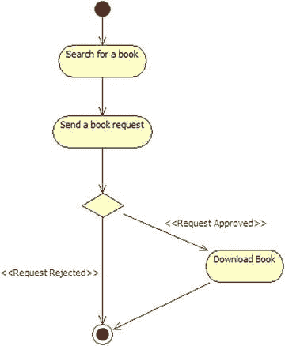
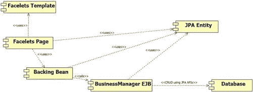
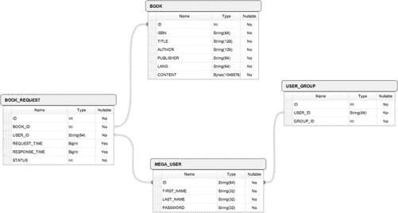
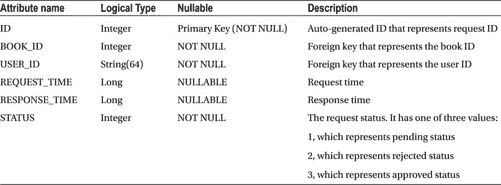

第十三章


应用全部:大型应用程序

在这一章中，我们将在一个我们称之为 Mega App 的示例应用程序中应用我们在前面章节中学到的大部分知识。我们将从应用规范和线框开始，在了解应用需求后，我们将开发应用架构，包括数据模型、后端服务、前端模板、应用安全性(包括身份验证、授权和错误处理)。我们将看到如何使用 Java EE 7 技术实现这个架构。Mega App 应用程序利用了许多 Java EE 7 技术:它使用 JSF 2.2 在 Twitter Bootstrap 的帮助下处理用户界面交互，使用 EJB 3.2 处理事务，使用 JPA 2.1 处理持久性，使用 CDI 1.1 处理 bean 管理，使用 Java Bean 验证处理模型验证。在本章中，您将学习如何在 Java EE 7 空间中为 JSF 2.2 应用程序创建合适的应用程序架构和实现。

大型应用规范

Mega App 是一个在线图书馆应用程序，允许其用户搜索书籍。从搜索中获得可用图书后，用户可以从搜索结果中请求一本或多本图书的副本。在后台，应用程序管理员可以批准或拒绝对图书的请求。如果一本书(或更多)的请求被批准，那么 Mega App 用户将能够从他/她的批准的书列表中下载批准的书。[图 13-1](#Fig1) 从应用用户的角度展示了大型应用预订请求流。



[图 13-1](#_Fig1) 。大型应用程序预订请求流程

Mega App 应用程序有两个角色:

*   应用程序用户
*   应用程序管理员

图 [13-2](#Fig2) 显示了应用用户和应用管理员的用例图。


[图 13-2](#_Fig2) 。大型应用程序用例图

如用例图所示，应用程序用户可以执行以下操作:

*   在应用程序中注册。
*   搜书。
*   发送订购书籍的请求。
*   下载批准的书籍。

应用程序管理员可以执行以下操作:

*   添加图书。
*   删除图书。
*   批准图书申请。
*   拒绝图书请求。
*   搜书。
*   下载书籍。
*   在应用程序中注册用户。
*   查看所有用户。
*   删除用户。

 **注意**理解一个角色(或一个参与者)可以在系统中包括一个或多个用户是很重要的。这意味着在 Mega App 中，我们可以有许多应用程序用户和应用程序管理员。

大型应用程序线框

现在，让我们浏览一下应用程序线框，以便对应用程序规范有一个清晰的理解。我们将举例说明应用程序中的每个参与者(应用程序用户和应用程序管理员)可以与之交互的应用程序页面。首先，为了访问应用程序页面，用户需要使用注册页面注册自己。[图 13-3](#Fig3) 显示了注册页面。


[图 13-3](#_Fig3) 。注册页面

为了进行注册，用户必须提供以下信息:

*   登录名，对于应用程序中的每个用户都必须是唯一的。
*   两个相同的密码。
*   用户的名字。
*   用户的姓氏。

如果用户输入正确的信息，应用程序将通知用户他/她的帐户已成功创建。注册成功后，用户应该能够登录到系统。[图 13-4](#Fig4) 显示 Mega App 登录页面。


[图 13-4](#_Fig4) 。登录页面

登录应用程序后，应用程序用户被引入主页，如图[图 13-5](#Fig5) 所示。


[图 13-5](#_Fig5) 。应用程序用户主页

如页面所示，用户可以使用侧菜单进行如下操作:

*   搜书。
*   查看待定请求。
*   查看批准的请求。
*   查看被拒绝的请求。
*   注销。

用户可以通过输入准确的书名或只输入书名的一部分来按书名搜索书籍。当用户输入书名并点击“搜索书籍”按钮时，搜索表将被结果填充。对于搜索结果中的每本书，应用程序用户都可以选择请求图书副本。一旦用户请求图书副本，管理员用户将能够在他/她的待定请求收件箱中看到用户请求，如图[图 13-6](#Fig6) 所示。


[图 13-6](#_Fig6) 。应用程序管理员待定请求收件箱

如上图所示，管理员用户可以对应用用户的待处理请求执行以下操作:

*   批准用户请求。
*   拒绝用户请求。
*   下载用户希望拥有副本的图书。

除此之外，管理员用户在侧面菜单中还有以下操作:

*   搜书。
*   查看待定请求。
*   查看批准的请求。
*   查看被拒绝的请求。
*   加一本书。
*   查看用户。
*   注销。

管理员操作的细节将在接下来的几段中说明。

一旦应用程序管理员批准了图书请求，应用程序用户将能够在他/她的批准请求收件箱中看到他/她的请求，如图[图 13-7](#Fig7) 所示。


[图 13-7](#_Fig7) 。应用程序用户的已批准图书请求

在批准的请求收件箱中，应用程序用户可以下载图书副本。如果应用程序管理员拒绝了用户的预订请求，那么用户将在其“查看拒绝的请求”收件箱中看到他/她的拒绝请求。应用程序用户的“查看待定请求”收件箱显示了他/她当前的待定图书请求，这些请求尚未被应用程序管理员批准或拒绝。

现在，让我们转到管理员用户的页面:管理员用户成功登录后，管理员用户可以按书名(或部分书名)搜索图书，如图[图 13-8](#Fig8) 所示。


[图 13-8](#_Fig8) 。应用程序管理员主页

管理员用户可以搜索图书，以便下载或从应用程序中删除它们。管理员用户的待处理请求收件箱已在[图 13-6](#Fig6) 中说明。在这个收件箱中，管理员用户可以批准或拒绝图书请求，也可以下载请求的图书。

[图 13-9](#Fig9) 显示了管理员用户的批准请求收件箱。


[图 13-9](#_Fig9) 。管理员用户的批准请求收件箱

管理员用户的“批准的请求收件箱”包括所有批准的图书请求列表。管理员用户也有一个被拒绝的请求收件箱，其中包含所有被拒绝的图书请求。批准或拒绝的图书申请信息如下:

*   书名。
*   响应时间。
*   请求时间。
*   请求所有者。
*   可以对请求执行的可用操作。

管理员用户可以添加图书，如[图 13-10](#Fig10) 所示。


[图 13-10](#_Fig10) 。管理员添加图书页面

管理员可以通过输入以下图书信息来添加图书:

*   图书 ISBN。
*   书名。
*   图书作者。
*   发布者名称。
*   书籍语言。
*   书籍内容(简单地表示一个 PDF 文件)。

一旦创建了图书，就可以在图书搜索页面上找到它。最后，管理员用户可以查看应用程序的所有用户，如图[图 13-11](#Fig11) 所示。


[图 13-11](#_Fig11) 。管理员用户的用户管理页面

管理员用户可以查看应用程序的所有用户，也可以删除其中的任何用户。

大型应用架构

Mega App 应用程序利用了以下 Java EE 7 技术:

*   用于处理用户界面交互的 JSF 2.2。
*   用于事务处理的 EJB 3.2。
*   用于数据持久性的 JPA 2.1。
*   用于 bean 管理的 CDI 1.1。
*   Bean Validation 1.1 用于处理模型验证。

为了拥有俏皮的 HTML5/CSS3 用户界面，Mega App 使用了 Twitter Bootstrap 库:[http://getbootstrap.com](http://getbootstrap.com)。Twitter Bootstrap 是一个轻量级的 HTML5/CSS3 库，包含漂亮的排版、表单、按钮、导航和其他界面组件的设计模板，以及可选的 JavaScript 扩展。

为了简单起见，Mega App 使用 Oracle Java DB。Java DB 是 Oracle 支持的 Apache Derby 开源数据库的发行版。它通过 JDBC 和 Java EE APIs 支持标准 ANSI/ISO SQL，并包含在 JDK 中。[图 13-12](#Fig12) 显示了 Mega App 应用程序的高级组件。



[图 13-12](#_Fig12) 。Mega App 高级组件

如上图所示，应用程序具有以下高级组件:

1.  Facelets 页面:它们代表大型应用程序页面。他们通过 JSF 表达式语言(EL)使用支持 bean 和 JPA beans(使用 CDI 管理)。他们还利用应用程序 Facelets 模板。
2.  Facelets 模板:它们代表应用程序页面使用的模板。在 Mega App 中，有两个模板(一个用于公共页面，另一个用于受保护页面)。
3.  Backing Beans:它们是普通的托管 bean，在概念上与 UI 页面相关，不是应用程序模型的一部分。backing bean 是集中处理页面动作的理想选择(有时 backing bean 被称为控制器类)。在 Mega App 中，backing beans 主要使用 JPA CDI 托管 bean 来调用业务管理器(服务)EJB，以便执行所需的操作。
4.  业务管理器 EJB:为了执行业务操作，支持 beans 调用业务管理器 EJB。业务管理器 EJB 是无状态会话 EJB，它使用 JPA 实体和 JPA EntityManager 来执行所需的数据库操作。在 Mega App 中，我们有以下业务管理器 EJB:
    *   图书管理员 EJB，处理图书管理操作，如注册图书、更新图书、删除图书、获取图书信息。。。等等)。
    *   图书请求经理 EJB 处理图书请求流程操作(sendBookRequest、approveBookRequest 和 viewRequests)。
    *   大用户经理 EJB 负责处理大应用用户管理操作(获取大用户、检索大用户、注册大用户、删除大用户)。
5.  JPA 实体(CDI 托管 bean):JPA 实体表示映射到数据库表的数据类。在 Mega App 中，JPA 实体被用作应用程序的 CDI 托管 beanss，这些 bean 使用 EL 与 Facelets 页面绑定在一起。

构建数据模型

先从创建 Mega App 的数据模型开始。[图 13-13](#Fig13) 显示了 Mega App 逻辑数据模型。



[图 13-13](#_Fig13) 。大型应用程序逻辑数据模型

如图所示，Mega App 数据模型包含四个实体:

1.  BOOK Entity: BOOK entity is responsible for storing the book data. It has the attributes shown in [Table 13-1](#Tab1).

    [表 13-1](#_Tab1) 。图书实体属性

    

    图书实体与 BOOK_REQUEST 的关系类型是“一对多”，即一本书可以有 0 个或多个图书请求。

2.  BOOK_REQUEST Entity:  BOOK_REQUEST entity is responsible for storing the requests for the book that are performed by the application users. It has the attributes shown in [Table 13-2](#Tab2).

    [表 13-2](#_Tab2) 。预订 _ 请求表

    

3.  USER Entity:  USER entity is responsible for storing the Mega App users. It has the following attributes as shown in [Table 13-3](#Tab3).

    [表 13-3](#_Tab3) 。大型用户实体

    

    用户实体与 BOOK_REQUEST 的关系类型是“一对多”，即一个用户可以执行 0 个或多个图书请求。

    用户实体与 USER_GROUP 的关系类型是“一对多”，即一个用户可以属于 0 个或多个组。

     **注意**Mega App 代码确保用户始终是一个群组中的成员。

4.  USER_GROUP Entity:  USER_GROUP entity is responsible for storing the Mega App user groups. It has the attributes shown in [Table 13-4](#Tab4).

    [表 13-4](#_Tab4) 。用户组实体

    

清单 13-1 显示了 Java DB 逻辑数据模型的等效 SQL DDL(数据定义语言)脚本。

[***清单 13-1。***](#_list1) Mega App SQL DDL 脚本

```html
-- Create Table: USER_GROUP
--------------------------------------------------------------------------------
CREATE TABLE USER_GROUP
(        ID INTEGER NOT NULL PRIMARY KEY GENERATED ALWAYS AS IDENTITY (START WITH 1, INCREMENT BY 1)
        , USER_ID VARCHAR(64)
        , "GROUP_ID" INTEGER
);

-- Create Table: BOOK
--------------------------------------------------------------------------------
CREATE TABLE BOOK
(
        ID INTEGER NOT NULL PRIMARY KEY GENERATED ALWAYS AS IDENTITY (START WITH 1, INCREMENT BY 1)
        ,ISBN VARCHAR(64) NOT NULL
        ,TITLE VARCHAR(128) NOT NULL
        ,AUTHOR VARCHAR(128) NOT NULL
        ,PUBLISHER VARCHAR(64) NOT NULL
        ,LANG VARCHAR(64) NOT NULL
        ,CONTENT blob(1M) NOT NULL
);

-- Create Table: MEGA_USER
--------------------------------------------------------------------------------
CREATE TABLE MEGA_USER
(
        ID VARCHAR(64) NOT NULL PRIMARY KEY
        ,FIRST_NAME VARCHAR(32) NOT NULL
        ,LAST_NAME VARCHAR(32) NOT NULL
        ,PASSWORD VARCHAR(32) NOT NULL
);

-- Create Table: BOOK_REQUEST
--------------------------------------------------------------------------------
CREATE TABLE BOOK_REQUEST
(
        ID INTEGER NOT NULL PRIMARY KEY GENERATED ALWAYS AS IDENTITY (START WITH 1, INCREMENT BY 1)
        ,BOOK_ID INTEGER NOT NULL
        ,USER_ID VARCHAR(64) NOT NULL
        ,REQUEST_TIME BIGINT
        ,RESPONSE_TIME BIGINT
        ,STATUS INTEGER NOT NULL
);

-- Create Foreign Key: BOOK_REQUEST.USER_ID -> MEGA_USER.ID
ALTER TABLE BOOK_REQUEST ADD CONSTRAINT FK_BOOK_REQUEST_USER_ID_MEGA_USER_ID FOREIGN KEY (USER_ID) REFERENCES MEGA_USER(ID);

-- Create Foreign Key: BOOK_REQUEST.BOOK_ID -> BOOK.ID
ALTER TABLE BOOK_REQUEST ADD CONSTRAINT FK_BOOK_REQUEST_BOOK_ID_BOOK_ID FOREIGN KEY (BOOK_ID) REFERENCES BOOK(ID);

-- Create Foreign Key: USER_GROUP.USER_ID -> MEGA_USER.ID
ALTER TABLE USER_GROUP ADD CONSTRAINT FK_USER_GROUP_USER_ID FOREIGN KEY (USER_ID) REFERENCES MEGA_USER(ID);
```

构建服务层(EJB)

创建数据模型后，我们需要定义将从 JSF 支持 beans 中使用的应用程序 API(服务)。Mega App 利用 EJB 技术为客户端提供应用服务(JSF 支持 beans)。在 Mega App 中，我们有以下三个业务管理器EJB:

*   图书经理 EJB。
*   图书需求经理 EJB。
*   超级用户经理 EJB。

图书管理员 EJB 负责处理图书管理操作，包括

*   登记新书。
*   更新图书信息。
*   移除书籍。
*   获取图书信息。
*   获取图书内容。
*   获取所有书籍。

图书需求经理 EJB 负责处理图书需求流程操作，包括

*   应用程序用户发送图书请求。
*   批准应用程序管理员的图书请求。
*   拒绝应用程序管理员的图书请求。
*   应用程序管理员删除图书。

用户经理 EJB 负责处理用户管理操作，包括

*   注册大型应用程序用户。
*   获取大量应用程序用户信息。
*   移除大型应用程序用户。
*   找回百万应用用户。

清单 13-2 显示了 persistence.xml 文件(位于/resources/META-INF 下)。persistence.xml 文件使用 JPA 2.1 版，它定义了使用“JTA”事务类型的“megaAppUnit”持久性单元。使用“JTA”事务类型意味着容器将为您处理 EntityManager 的创建和跟踪，并且您可以使用@PersistenceContext 注释获得它的实例。JTA 数据源设置为 jdbc/mega 数据源，使用它我们将能够访问 Mega App 数据库。

[***清单 13-2。***T5】persistence . XML 文件](#_list2)

```html
<?xml version="1.0" encoding="UTF-8"?>
<persistence version="2.1" FontName">http://xmlns.jcp.org/xml/ns/persistence"
             xmlns:xsi="http://www.w3.org/2001/XMLSchema-instance"
             xsi:schemaLocation="http://xmlns.jcp.org/xml/ns/persistence
http://xmlns.jcp.org/xml/ns/persistence/persistence_2_1.xsd">

  <persistence-unit name="megaAppUnit" transaction-type="JTA">
    <jta-data-source>jdbc/mega</jta-data-source>
    <exclude-unlisted-classes>false</exclude-unlisted-classes>
    <properties/>
  </persistence-unit>
</persistence>
```

 **注意**值得注意的是，在 Java EE 7 中，大部分部署描述符名称空间都从前缀[http://java.sun.com](http://java.sun.com)改为[http://xmlns.jcp.org](http://xmlns.jcp.org)。

[清单 13-3](#list3) 显示了图书管理器 EJB 的 EJB 接口，使用@Local 注释将其定义为 EJB 本地接口。

[***清单 13-3。***](#_list3) EJB 地方接口的编书人 EJB

```html
package com.jsfprohtml5.megaapp.service;

import com.jsfprohtml5.megaapp.model.Book;
import com.jsfprohtml5.megaapp.service.exception.BookAlreadyExists;
import com.jsfprohtml5.megaapp.service.exception.BookNotFound;
import java.util.List;
import javax.ejb.Local;

@Local
public interface BookManagerLocal {
    public Book getBookInformation(Integer bookID) throws BookNotFound;
    public Book registerBook(Book book) throws BookAlreadyExists;
    public Book updateBook(Book book) throws BookNotFound;
    public void removeBook(Integer bookID) throws BookNotFound;
    public byte[] getBookContent(Integer bookID) throws BookNotFound;
    public List<Book> getAllBooks(Book book);
}
```

 **提示**当 EJB 客户端运行在 EJB 本身的同一个 JVM 中时，使用@Local 注释是合适的。@Local 批注比@Remote 批注更有效，因为它不需要参数编组、传输和取消编组。

清单 13-4 显示了 BookManager EJB 类的 registerBook 和 updateBook 方法。

[***清单 13-4。***](#_list4) 图书管理员 EJB 登记和更新图书的方法

```html
package com.jsfprohtml5.megaapp.service;

import com.jsfprohtml5.megaapp.model.Book;
import com.jsfprohtml5.megaapp.service.exception.BookAlreadyExists;
import com.jsfprohtml5.megaapp.service.exception.BookNotFound;
import java.util.ArrayList;
import java.util.List;
import java.util.logging.Level;
import java.util.logging.Logger;
import javax.ejb.Stateless;
import javax.persistence.EntityManager;
import javax.persistence.NoResultException;
import javax.persistence.PersistenceContext;
import javax.persistence.Query;

@Stateless
public class BookManager implements BookManagerLocal {

    @PersistenceContext(unitName = "megaAppUnit")
    EntityManager em;

    //Other interface methods ...

    @Override
    public Book registerBook(Book book) throws BookAlreadyExists {
        Query query = em.createQuery("select book from Book book where "
                    + "book.isbn = :isbn");

        query.setParameter("isbn", book.getIsbn());

        try {
            query.getSingleResult();
            throw new BookAlreadyExists();
        } catch (NoResultException exception) {
            Logger.getLogger(BookManager.class.getName()).log(Level.FINER, "No similar books found");
        }

        em.persist(book);
        em.flush();

        return book;
    }

    @Override
    public Book updateBook(Book book) throws BookNotFound {
        Book updatableBook = em.find(Book.class, book.getId());

        if (updatableBook == null) {
            throw new BookNotFound();
        }

        mergeBookAttrs(book, updatableBook);

        em.merge(updatableBook);
        em.flush();

        return book;
    }

    private void mergeBookAttrs(Book book, Book updatableBook) {
        if (book.getAuthor() != null) {
            updatableBook.setAuthor(book.getAuthor());
        }

        if (book.getContent() != null) {
            updatableBook.setContent(book.getContent());
        }

        if (book.getIsbn() != null) {
            updatableBook.setIsbn(book.getIsbn());
        }

        if (book.getLang() != null) {
            updatableBook.setLang(book.getLang());
        }

        if (book.getPublisher() != null) {
            updatableBook.setPublisher(book.getPublisher());
        }

        if (book.getTitle() != null) {
            updatableBook.setTitle(book.getTitle());
        }
    }
}
```

@Stateless annotation 将 BookManager 类定义为无状态会话 EJB。@PersistenceContext 注释用于注入容器管理的实体管理器实例，使用它我们将能够执行数据库操作。registerBook 方法检查现有图书的 ISBN 是否与新图书的 ISBN 匹配，如果找到匹配的情况，则抛出 BookAlreadyExists 异常，否则将新书数据保存在数据库中。如果数据库中不存在要更新的图书，updateBook 方法将引发 BookNotFound 异常；如果目标图书存在，它将使用 mergeBookAttrs 方法将新数据更新与现有图书数据合并。[清单 13-5](#list5) 显示了图书管理员 EJB 的剩余方法。

[***清单 13-5。***](#_list5) 著书家 EJB 的剩余方法

```html
@Stateless
public class BookManager implements BookManagerLocal {

    @PersistenceContext(unitName = "megaAppUnit")
    EntityManager em;

    @Override

    public Book getBookInformation(Integer bookID) throws BookNotFound {
        Query query = em.createQuery("select book.id, book.isbn, book.title, "
                    + "book.author, book.publisher, book.lang from Book book where "
                    + "book.id = :id");

        query.setParameter("id", bookID);

        Object[] bookInfo = null;

        try {
            bookInfo = (Object[]) query.getSingleResult();
        } catch (NoResultException exception) {
            throw new BookNotFound(exception.getMessage());
        }

        Book book = new Book(
                (Integer) bookInfo[0],
                (String) bookInfo[1],
                (String) bookInfo[2],
                (String) bookInfo[3],
                (String) bookInfo[4],
                (String) bookInfo[5],
                null);

        return book;
    }

    @Override
    public void removeBook(Integer bookID) throws BookNotFound {
        Book book = em.find(Book.class, bookID);

        if (book == null) {
            throw new BookNotFound();
        }

        em.remove(book);
        em.flush();
    }

    @Override
    public byte[] getBookContent(Integer bookID) throws BookNotFound {
        byte[] content = null;

        try {
            content = (byte[]) em.createQuery("Select book.content from Book book where book.id=:id")
                                 .setParameter("id", bookID)
                                 .getSingleResult();
        } catch (NoResultException exception) {
            throw new BookNotFound(exception.getMessage());
        }

        return content;
    }

    @Override
    public List<Book> getAllBooks(Book searchableBook) {
        List<Book> books = new ArrayList<Book>();
        String searchableTitle = searchableBook.getTitle();

        Query query = em.createQuery("select book.id, book.isbn, book.title, "
                    + "book.author, book.publisher, book.lang from Book book where "
                    + "book.title like :title");

        query.setParameter("title", "%" + searchableTitle + "%");

        List<Object[]> bookList = (List<Object[]>) query.getResultList();

        if (bookList == null) {
            return books;
        }

        for (Object[] bookInfo : bookList) {
            Book book = new Book(
                    (Integer) bookInfo[0],
                    (String) bookInfo[1],
                    (String) bookInfo[2],
                    (String) bookInfo[3],
                    (String) bookInfo[4],
                    (String) bookInfo[5],
                    null);

            books.add(book);
        }

        return books;
    }

   //...
}
```

书商 EJB 的其他方法如下:

*   getBookInformation:获取图书的元数据(没有图书内容的图书数据)。如果没有找到目标书，它抛出 BookNotFound 异常。
*   getBookContent :仅获取书籍内容作为字节数组。如果没有找到目标书，它抛出 BookNotFound 异常。
*   removeBook :从数据库中删除图书。如果没有找到目标书，它抛出 BookNotFound 异常。
*   getAllBooks :接受一个 book 对象作为参数，允许 API 使用任何 book 属性进行搜索。但是，现在，getAllBooks()实现只使用图书的 title 属性进行搜索，使用 SQL like 操作符。如果没有结果，API 将返回一个空列表。

现在，让我们检查 Book JPA 实体的详细信息，该实体包含 Book 属性和使用 Java Bean 验证 API 的验证约束。[清单 13-6](#list6) 显示了图书 JPA 实体代码。

[***清单 13-6。***](#_list6) 图书 JPA 实体

```html
package com.jsfprohtml5.megaapp.model;

import java.io.Serializable;
import java.util.List;
import javax.persistence.Basic;
import javax.persistence.CascadeType;
import javax.persistence.Column;
import javax.persistence.Entity;
import javax.persistence.FetchType;
import javax.persistence.GeneratedValue;
import javax.persistence.GenerationType;
import javax.persistence.Id;
import javax.persistence.Lob;
import javax.persistence.OneToMany;
import javax.persistence.Table;
import javax.validation.constraints.NotNull;
import javax.validation.constraints.Size;

@Entity
@Table(name = "BOOK")
public class Book implements Serializable {
    private static final long serialVersionUID = 197654646546456456L;

    @Id
    @GeneratedValue(strategy = GenerationType.IDENTITY)
    @Basic(optional = false)
    @Column(name = "ID")
    private Integer id;

    @Basic(optional = false)
    @NotNull
    @Size(min = 10, max = 20, message = "ISBN must be between 10 and 20 characters")
    @Column(name = "ISBN")
    private String isbn;

    @Basic(optional = false)
    @NotNull
    @Size(min = 5, max = 128, message = "Book title must be between 5 and 128 characters")
    @Column(name = "TITLE")
    private String title;

    @Basic(optional = false)
    @NotNull
    @Size(min = 3, max = 128, message = "Book author must be between 3 and 128 characters")
    @Column(name = "AUTHOR")
    private String author;

    @Basic(optional = false)
    @NotNull
    @Size(min = 3, max = 64, message = "Book publisher must be between 3 and 64 characters")
    @Column(name = "PUBLISHER")
    private String publisher;

    @Basic(optional = false)
    @NotNull
    @Size(min = 3, max = 64, message = "Book language must be between 3 and 64 characters")
    @Column(name = "LANG")
    private String lang;

    @Basic(optional = false)
    @Lob
    @Column(name = "CONTENT")
    private Serializable content;

    @OneToMany(cascade = CascadeType.ALL, mappedBy = "bookId")
    private List<BookRequest> bookRequestList;

    public Book() {
    }

    public Book(Integer id) {
        this.id = id;
    }

    public Book(Integer id, String isbn, String title, String author, String publisher, String lang, Serializable content) {
        this.id = id;
        this.isbn = isbn;
        this.title = title;
        this.author = author;
        this.publisher = publisher;
        this.lang = lang;
        this.content = content;
    }
    public Integer getId() {
        return id;
    }

    public void setId(Integer id) {
        this.id = id;
    }

    public String getIsbn() {
        return isbn;
    }

    public void setIsbn(String isbn) {
        this.isbn = isbn;
    }

    public String getTitle() {
        return title;
    }

    public void setTitle(String title) {
        this.title = title;
    }

    public String getAuthor() {
        return author;
    }

    public void setAuthor(String author) {
        this.author = author;
    }

    public String getPublisher() {
        return publisher;
    }

    public void setPublisher(String publisher) {
        this.publisher = publisher;
    }

    public String getLang() {
        return lang;
    }

    public void setLang(String lang) {
        this.lang = lang;
    }

    public Serializable getContent() {
        return content;
    }

    public void setContent(Serializable content) {
        this.content = content;
    }

    public List<BookRequest> getBookRequestList() {
        return bookRequestList;
    }

    public void setBookRequestList(List<BookRequest> bookRequestList) {
        this.bookRequestList = bookRequestList;
    }

    @Override
    public int hashCode() {
        int hash = 0;
        hash += (id != null ? id.hashCode() : 0);
        return hash;
    }

    @Override
    public boolean equals(Object object) {
        if (!(object instanceof Book)) {
            return false;
        }
        Book other = (Book) object;
        if ((this.id == null && other.id != null) || (this.id != null && !this.id.equals(other.id))) {
            return false;
        }
        return true;
    }

    @Override
    public String toString() {
        return "com.jsfprohtml5.megaapp.model.Book[ id=" + id + " ]";
    }

}
```

Book JPA 实体类有以下属性:

*   id:使用@Id 批注标记为实体的主键。它是自动生成的属性。
*   ISBN:验证为非空。ISBN 验证为 10 到 20 个字符。
*   标题:验证为非空。图书标题的长度在 5 到 128 个字符之间。
*   作者:验证为非空。图书作者被验证为介于 3 到 128 个字符之间。
*   发布者:验证为非空。图书出版商被验证为介于 3 到 64 个字符之间。
*   lang:表示图书语言，并被验证为非空。图书语言被验证为 3 到 64 个字符。
*   content:表示书籍内容，它被标记为 Lob(大对象)。
*   bookRequestList:表示书的关联请求；它的级联类型设置为“All”，这意味着所有的操作(合并、持久化、移除、刷新)都将级联。

 **注意**需要注意的是，以下所有 JPA 实体都将被用作应用程序 Facelets 页面中的 CDI beans:有关更多信息，请查看“编写页面模板”一节。

现在，让我们来看第二位 EJB 经理(MegaUserManager) EJB。清单 13-7 显示了 EJB 的 EJB 本地接口。

[***清单 13-7。***](#_list7)EJB 本地界面

```html
package com.jsfprohtml5.megaapp.service;

import com.jsfprohtml5.megaapp.model.MegaUser;
import com.jsfprohtml5.megaapp.service.exception.UserAlreadyExists;
import com.jsfprohtml5.megaapp.service.exception.UserNotFound;
import java.util.List;
import javax.ejb.Local;

@Local
public interface MegaUserManagerLocal {
    public MegaUser getMegaUser(String userID) throws UserNotFound;
    public List<MegaUser> retrieveMegaUsers();
    public MegaUser registerMegaUser(MegaUser user) throws UserAlreadyExists;
    public void removeMegaUser(String userID) throws UserNotFound;
}

```

清单 13-8 显示了 EJB 类的实现。

[***清单 13-8。***](#_list8)EJB 类 MegaUserManager

```html
package com.jsfprohtml5.megaapp.service;

import com.jsfprohtml5.megaapp.model.Constants;
import com.jsfprohtml5.megaapp.model.MegaUser;
import com.jsfprohtml5.megaapp.model.UserGroup;
import com.jsfprohtml5.megaapp.service.exception.UserAlreadyExists;
import com.jsfprohtml5.megaapp.service.exception.UserNotFound;
import java.util.ArrayList;
import java.util.List;
import java.util.logging.Level;
import java.util.logging.Logger;
import javax.ejb.Stateless;
import javax.persistence.EntityManager;
import javax.persistence.NoResultException;
import javax.persistence.PersistenceContext;
import javax.persistence.Query;

@Stateless
public class MegaUserManager implements MegaUserManagerLocal {

    @PersistenceContext(unitName = "megaAppUnit")
    EntityManager em;

    @Override

    public MegaUser getMegaUser(String userID) throws UserNotFound {
        Query query = em.createQuery("select megaUser.id, megaUser.firstName"
                                     + ", megaUser.lastName from MegaUser megaUser where "
                                     + "megaUser.id = :id");

        query.setParameter("id", userID);

        Object[] megaUserInfo;

        try {
            megaUserInfo = (Object[]) query.getSingleResult();
        } catch (NoResultException exception) {
            throw new UserNotFound(exception.getMessage());
        }

        MegaUser megaUser = new MegaUser(
                (String) megaUserInfo[0],
                (String) megaUserInfo[1],
                (String) megaUserInfo[2],
                null);

        return megaUser;
    }

    @Override
    public MegaUser registerMegaUser(MegaUser user) throws UserAlreadyExists {
        Query query = em.createQuery("select megaUser from MegaUser megaUser where "
                    + "megaUser.id = :userID");

        query.setParameter("userID", user.getId());

        try {
            query.getSingleResult();
            throw new UserAlreadyExists();
        } catch (NoResultException exception) {
            Logger.getLogger(BookManager.class.getName()).log(Level.FINER, "No user found");
        }

        List<UserGroup> userGroups = new ArrayList<UserGroup>();

        UserGroup userGroup = new UserGroup();
        userGroup.setUserId(user);
        userGroup.setGroupId(Constants.USER_GROUP);

        userGroups.add(userGroup);

        user.setUserGroupList(userGroups);

        em.persist(user);
        em.flush();

        return user;
    }

    @Override
    public void removeMegaUser(String userID) throws UserNotFound {
        MegaUser megaUser = em.find(MegaUser.class, userID);

        if (megaUser == null) {
            throw new UserNotFound();
        }

        em.remove(megaUser);
        em.flush();
    }

    @Override
    public List<MegaUser> retrieveMegaUsers() {
        Query query = em.createQuery("select megaUser from MegaUser megaUser", MegaUser.class);

        List<MegaUser> result = query.getResultList();

        if (result == null) {
            return new ArrayList<MegaUser>();
        }

        return result;
    }
}
```

用户管理器 EJB 的方法如下:

*   getMegaUser:检索用户信息。如果没有找到目标用户，它抛出 UserNotFound 异常。
*   registerMegaUser :将 Mega App 数据库中的 Mega App 用户注册为应用用户(即，使用户成为“用户”组中的成员)。如果用户 ID 已经存在于数据库中，它将抛出 UserAlreadyExists 异常。
*   removeMegaUser :从数据库中删除 Mega App 用户。如果没有找到目标用户，它抛出 UserNotFound 异常。
*   retrieveMegaUsers :检索 Mega App 的所有用户(无论是普通用户还是管理员用户)。

让我们检查 MegaUser JPA 实体的细节，它保存了用户属性及其相关的验证约束。清单 13-9 显示了 MegaUser JPA 实体类。

[***清单 13-9。***](#_list9) MegaUser JPA 实体类

```html
package com.jsfprohtml5.megaapp.model;

import java.io.Serializable;
import java.util.List;
import javax.persistence.Basic;
import javax.persistence.CascadeType;
import javax.persistence.Column;
import javax.persistence.Entity;
import javax.persistence.Id;
import javax.persistence.OneToMany;
import javax.persistence.Table;
import javax.persistence.Transient;
import javax.validation.constraints.NotNull;
import javax.validation.constraints.Size;

@Entity
@Table(name = "MEGA_USER")
public class MegaUser implements Serializable {
    private static final long serialVersionUID = 109890766546456L;

    @Id
    @Basic(optional = false)
    @Size(min = 3, max = 64, message = "ID must be between 3 and 64 characters")
    @Column(name = "ID")
    private String id;

    @Basic(optional = false)
    @NotNull
    @Size(min = 3, max = 32, message = "First name must be between 3 and 32 characters")
    @Column(name = "FIRST_NAME")
    private String firstName;

    @Basic(optional = false)
    @NotNull
    @Size(min = 3, max = 32, message = "Last name must be between 3 and 32 characters")
    @Column(name = "LAST_NAME")
    private String lastName;

    @Basic(optional = false)
    @NotNull
    @Size(min = 6, max = 32, message = "Password must be between 6 and 32 characters")
    @Column(name = "PASSWORD")
    private String password;

    @Transient
    private String password2;

    @OneToMany(cascade = CascadeType.ALL, mappedBy = "userId")
    private List<UserGroup> userGroupList;

    @OneToMany(cascade = CascadeType.ALL, mappedBy = "userId")
    private List<BookRequest> bookRequestList;

    public MegaUser() {
    }

    public MegaUser(String id) {
        this.id = id;
    }

    public MegaUser(String id, String firstName, String lastName, String password) {
        this.id = id;
        this.firstName = firstName;
        this.lastName = lastName;
        this.password = password;
    }

    public String getId() {
        return id;
    }

    public void setId(String id) {
        this.id = id;
    }

    public String getFirstName() {
        return firstName;
    }

    public void setFirstName(String firstName) {
        this.firstName = firstName;
    }

    public String getLastName() {
        return lastName;
    }

    public void setLastName(String lastName) {
        this.lastName = lastName;
    }

    public String getPassword() {
        return password;
    }

    public void setPassword(String password) {
        this.password = password;
    }

    public String getPassword2() {
        return password2;
    }

    public void setPassword2(String password2) {
        this.password2 = password2;
    }

    public List<UserGroup> getUserGroupList() {
        return userGroupList;
    }
    public void setUserGroupList(List<UserGroup> userGroupList) {
        this.userGroupList = userGroupList;
    }

    public List<BookRequest> getBookRequestList() {
        return bookRequestList;
    }

    public void setBookRequestList(List<BookRequest> bookRequestList) {
        this.bookRequestList = bookRequestList;
    }

    @Override
    public int hashCode() {
        int hash = 0;
        hash += (id != null ? id.hashCode() : 0);
        return hash;
    }

    @Override
    public boolean equals(Object object) {
        if (!(object instanceof MegaUser)) {
            return false;
        }
        MegaUser other = (MegaUser) object;
        if ((this.id == null && other.id != null) || (this.id != null && !this.id.equals(other.id))) {
            return false;
        }
        return true;
    }

    @Override
    public String toString() {
        return "com.jsfprohtml5.megaapp.model.MegaUser[ id=" + id + " ]";
    }

}
```

MegaUser JPA 实体类具有以下属性:

*   id:使用@Id 批注标记为实体的主键。它被验证为介于 3 到 64 个字符之间。
*   firstName:验证为不为空。它被验证为介于 3 到 32 个字符之间。
*   lastName:验证为不为空。它被验证为介于 3 到 32 个字符之间。
*   密码:验证为非空。它被验证为介于 6 到 32 个字符之间
*   userGroupList:表示用户的关联组，其级联类型设置为“All”，这意味着所有的操作(合并、持久化、移除、刷新)将被级联(如[清单 13-8](#list8) 所示，用户属于一个组)。
*   bookRequestList:表示用户的相关图书请求，其级联类型设置为“All”，这意味着所有操作(合并、持久化、移除、刷新)都将级联。

 **注意:MegaUser 实体类中的** password2 属性用于确认注册页面中的密码输入。如图所示，该属性用@Transient 注释进行了注释，以表明该字段不是持久的。

用户组 JPA 实体类映射到 USER_GROUP 表，该表将应用程序用户映射到应用程序组，如[清单 13-10](#list10) 所示。

[***清单 13-10。***](#_list10) 用户组 JPA 实体类

```html
package com.jsfprohtml5.megaapp.model;

import java.io.Serializable;
import javax.persistence.Basic;
import javax.persistence.Column;
import javax.persistence.Entity;
import javax.persistence.GeneratedValue;
import javax.persistence.GenerationType;
import javax.persistence.Id;
import javax.persistence.JoinColumn;
import javax.persistence.ManyToOne;
import javax.persistence.Table;

@Entity
@Table(name = "USER_GROUP")
public class UserGroup implements Serializable {
    private static final long serialVersionUID = 198213812312319321L;

    @Id

    @GeneratedValue(strategy = GenerationType.IDENTITY)
    @Basic(optional = false)
    @Column(name = "ID")
    private Integer id;

    @Column(name = "GROUP_ID")
    private Integer groupId;

    @JoinColumn(name = "USER_ID", referencedColumnName = "ID")
    @ManyToOne
    private MegaUser userId;

    public UserGroup() {
    }

    public UserGroup(Integer id) {
        this.id = id;
    }

    public Integer getId() {
        return id;
    }

    public void setId(Integer id) {
        this.id = id;
    }

    public Integer getGroupId() {
        return groupId;
    }

    public void setGroupId(Integer groupId) {
        this.groupId = groupId;
    }

    public MegaUser getUserId() {
        return userId;
    }

    public void setUserId(MegaUser userId) {
        this.userId = userId;
    }

    @Override
    public int hashCode() {
        int hash = 0;
        hash += (id != null ? id.hashCode() : 0);
        return hash;
    }

    @Override
    public boolean equals(Object object) {
        if (!(object instanceof UserGroup)) {
            return false;
        }
        UserGroup other = (UserGroup) object;
        if ((this.id == null && other.id != null) || (this.id != null && !this.id.equals(other.id))) {
            return false;
        }
        return true;
    }

    @Override
    public String toString() {
        return "com.jsfprohtml5.megaapp.model.UserGroup[ id=" + id + " ]";
    }

}
```

用户组 JPA 实体类具有以下属性:

*   id:使用@Id 批注标记为实体的主键。它是自动生成的属性。
*   groupId:表示组 Id(用户组可以是 1，管理员组可以是 2)。
*   userId:表示关联的用户对象。

第三位也是最后一位 EJB 经理是 EJB。[清单 13-11](#list11) 显示了 EJB 的 EJB 本地接口。

[***清单 13-11。***](#_list11) BookRequestManager 本地 EJB 接口

```html
package com.jsfprohtml5.megaapp.service;

import com.jsfprohtml5.megaapp.model.BookRequest;
import com.jsfprohtml5.megaapp.service.exception.BookRequestAlreadyExists;
import com.jsfprohtml5.megaapp.service.exception.BookRequestNotFound;
import java.util.List;
import javax.ejb.Local;

@Local
public interface BookRequestManagerLocal {
    public BookRequest sendBookRequest(BookRequest bookRequest) throws BookRequestAlreadyExists;
    public void approveBookRequest(Integer bookRequestNumber) throws BookRequestNotFound;
    public void rejectBookRequest(Integer bookRequestNumber) throws BookRequestNotFound;

    public List<BookRequest> viewRequests(String userName, int status);
}
```

清单 13-12 显示了 BookRequestManager EJB 类的第一部分。

[***清单 13-12。***](#_list12) 第一部分 BookRequestManager EJB 类

```html
package com.jsfprohtml5.megaapp.service;

import com.jsfprohtml5.megaapp.model.Book;
import com.jsfprohtml5.megaapp.model.BookRequest;
import com.jsfprohtml5.megaapp.model.Constants;
import com.jsfprohtml5.megaapp.model.MegaUser;
import com.jsfprohtml5.megaapp.model.UserGroup;
import com.jsfprohtml5.megaapp.service.exception.BookRequestAlreadyExists;
import com.jsfprohtml5.megaapp.service.exception.BookRequestNotFound;
import java.util.ArrayList;
import java.util.List;
import java.util.logging.Level;
import java.util.logging.Logger;
import javax.ejb.Stateless;
import javax.persistence.EntityManager;
import javax.persistence.NoResultException;
import javax.persistence.PersistenceContext;
import javax.persistence.Query;

@Stateless
public class BookRequestManager implements BookRequestManagerLocal {

    @PersistenceContext(unitName = "megaAppUnit")
    EntityManager em;

    @Override
    public BookRequest sendBookRequest(BookRequest bookRequest) throws BookRequestAlreadyExists {
        Query query = em.createQuery("select bookRequest from BookRequest bookRequest where "
                    + "bookRequest.bookId.id = :bookId and bookRequest.userId.id = :userId");

        query.setParameter("bookId", bookRequest.getBookId().getId());
        query.setParameter("userId", bookRequest.getUserId().getId());

        try {
            query.getSingleResult();
            throw new BookRequestAlreadyExists();
        } catch (NoResultException exception) {
            Logger.getLogger(BookManager.class.getName()).log(Level.FINER, "No book request found");
        }

        bookRequest.setRequestTime(System.currentTimeMillis());
        bookRequest.setStatus(Constants.PENDING_REQUEST); //pending status...

        em.persist(bookRequest);
        em.flush();

        return bookRequest;
    }

    @Override
    public void approveBookRequest(Integer bookRequestNumber) throws BookRequestNotFound {
        BookRequest updatableBookRequest = em.find(BookRequest.class, bookRequestNumber);

        if (updatableBookRequest == null) {
            throw new BookRequestNotFound();
        }

        updatableBookRequest.setStatus(Constants.APPROVED_REQUEST); //approved status
        updatableBookRequest.setResponseTime(System.currentTimeMillis());

        em.merge(updatableBookRequest);
        em.flush();
    }

    @Override
    public void rejectBookRequest(Integer bookRequestNumber) throws BookRequestNotFound {
        BookRequest updatableBookRequest = em.find(BookRequest.class, bookRequestNumber);

        if (updatableBookRequest == null) {
            throw new BookRequestNotFound();
        }

        updatableBookRequest.setStatus(Constants.REJECTED_REQUEST); //rejected status
        updatableBookRequest.setResponseTime(System.currentTimeMillis());

        em.merge(updatableBookRequest);
        em.flush();
    }

    //...
}
```

BookRequestManager EJB 的第一种方法如下:

*   sendBookRequest:在 BOOK_REQUEST 表中创建一个图书请求，将其状态设置为 1(表示待定)，并将请求时间设置为当前系统时间。如果用户已经发送了对目标图书的请求，它将抛出 BookRequestAlreadyExists 异常。
*   approveBookRequest:将图书请求状态设置为 3(表示已批准)，并将响应时间设置为当前系统时间。如果没有找到目标图书请求，它抛出 BookRequestNotFound 异常。
*   rejectBookRequest:将图书请求状态设置为 2(表示被拒绝)，并将响应时间设置为当前系统时间。如果没有找到目标图书请求，它抛出 BookRequestNotFound 异常。

清单 13-13 显示了 BookRequestManager EJB 类的第二部分。

[***清单 13-13。***](#_list13) 第二部分 BookRequestManager EJB 类

```html
@Stateless
public class BookRequestManager implements BookRequestManagerLocal {

    @PersistenceContext(unitName = "megaAppUnit")
    EntityManager em;

     // ...

    @Override
    public List<BookRequest> viewRequests(String userID, int status) {
        String requestQuery = "select bookRequest.id, book.id, book.title, bookRequest.requestTime, bookRequest.responseTime, bookRequest.userId.id "
                            + "from BookRequest bookRequest JOIN bookRequest.bookId book JOIN bookRequest.userId user "
                            + "where bookRequest.status = :statusID";

        Query query = null;

        UserGroup group = getUserGroup(userID);

        if (group.getGroupId() == Constants.USER_GROUP) {
            requestQuery += " and bookRequest.userId.id = :userId";

            query = em.createQuery(requestQuery);

            query.setParameter("statusID", status);
            query.setParameter("userId", userID);
        } else {
            query = em.createQuery(requestQuery);

            query.setParameter("statusID", status);
        }

        List<BookRequest> bookRequests = new ArrayList<BookRequest>();

        List<Object []> results = (List<Object []>) query.getResultList();

        if (results == null) {
            return bookRequests;
        }

        for (Object[] result : results) {
            BookRequest bookRequest = new BookRequest((Integer) result[0]);
            Book book = new Book();

            book.setId((Integer) result[1]);
            book.setTitle((String) result[2]);

            bookRequest.setBookId(book);
            bookRequest.setRequestTime((Long) result[3]);
            bookRequest.setResponseTime((Long) result[4]);

            bookRequest.setUserId(new MegaUser((String) result[5]));

            bookRequests.add(bookRequest);
        }

        return bookRequests;
    }

    private UserGroup getUserGroup(String userID) {
        Query query = em.createQuery("Select userGroup from UserGroup userGroup where userGroup.userId.id=:userID", UserGroup.class);

        query.setParameter("userID", userID);

        UserGroup group;

        try {
            group = (UserGroup) query.getSingleResult();
        } catch (NoResultException exception) {
            throw new IllegalStateException(userID + " state is invalid as user does not belong to any group!!!");
        }

        return group;
    }
}
```

viewRequest 方法用于查看普通用户和管理员用户的图书请求。它需要两个参数:

*   用户 ID:表示请求查看图书请求的用户 ID。
*   status:表示将被检索的图书请求的状态。它可以是三个值之一(1 表示待定，2 表示拒绝，3 表示批准；这些值在[列表 13-14](#list14) ) 中显示的常量界面中编码。

[***清单 13-14。***](#_list14) 常量界面

```html
package com.jsfprohtml5.megaapp.model;

public interface Constants {
    public static int USER_GROUP = 1;
    public static int ADMIN_GROUP = 2;

    public static int PENDING_REQUEST = 1;
    public static int REJECTED_REQUEST = 2;
    public static int APPROVED_REQUEST = 3;

    public static String APP_PDF_TYPE = "application/pdf";
}

```

viewRequest 方法通过调用 getUserGroup 私有方法，使用提供的用户 ID 获取用户角色。如果用户角色是 ADMIN_GROUP，则用户将检索所提供状态(待定、拒绝或批准)下的所有请求。如果用户角色是 USER_GROUP，则用户将只检索由所提供的用户 ID 在所提供的状态(待处理、拒绝或批准)下发送的请求。

将从 backing beans 调用 viewRequest 方法，以便查看当前登录用户的待定、拒绝和批准的图书请求。

让我们检查 BookRequest JPA 实体的详细信息，它保存了图书请求属性。清单 13-15 显示了 BookRequest JPA 实体类。

[***清单 13-15。***](#_list15) BookRequest JPA 实体类

```html
package com.jsfprohtml5.megaapp.model;

import java.io.Serializable;
import javax.persistence.Basic;
import javax.persistence.Column;
import javax.persistence.Entity;
import javax.persistence.GeneratedValue;
import javax.persistence.GenerationType;
import javax.persistence.Id;
import javax.persistence.JoinColumn;
import javax.persistence.ManyToOne;
import javax.persistence.Table;
import javax.validation.constraints.NotNull;

@Entity
@Table(name = "BOOK_REQUEST")
public class BookRequest implements Serializable {

    private static final long serialVersionUID = 132123123120090L;

    @Id
    @GeneratedValue(strategy = GenerationType.IDENTITY)
    @Basic(optional = false)
    @Column(name = "ID")
    private Integer id;

    @Basic(optional = false)
    @Column(name = "REQUEST_TIME")
    private long requestTime;

    @Basic(optional = false)
    @Column(name = "RESPONSE_TIME")
    private long responseTime;

    @Basic(optional = false)
    @NotNull
    @Column(name = "STATUS")
    private int status;

    @JoinColumn(name = "USER_ID", referencedColumnName = "ID")
    @ManyToOne(optional = false)
    private MegaUser userId;

    @JoinColumn(name = "BOOK_ID", referencedColumnName = "ID")
    @ManyToOne(optional = false)
    private Book bookId;

    public BookRequest() {
    }

    public BookRequest(Integer id) {
        this.id = id;
    }

    public BookRequest(Integer id, long requestTime, long responseTime, int status) {
        this.id = id;
        this.requestTime = requestTime;
        this.responseTime = responseTime;
        this.status = status;
    }

    public Integer getId() {
        return id;
    }

    public void setId(Integer id) {
        this.id = id;
    }

    public long getRequestTime() {
        return requestTime;
    }

    public void setRequestTime(long requestTime) {
        this.requestTime = requestTime;
    }

    public long getResponseTime() {
        return responseTime;
    }

    public void setResponseTime(long responseTime) {
        this.responseTime = responseTime;
    }

    public int getStatus() {
        return status;
    }

    public void setStatus(int status) {
        this.status = status;
    }
    public MegaUser getUserId() {
        return userId;
    }

    public void setUserId(MegaUser userId) {
        this.userId = userId;
    }

    public Book getBookId() {
        return bookId;
    }

    public void setBookId(Book bookId) {
        this.bookId = bookId;
    }

    @Override
    public int hashCode() {
        int hash = 0;
        hash += (id != null ? id.hashCode() : 0);
        return hash;
    }

    @Override
    public boolean equals(Object object) {
        if (!(object instanceof BookRequest)) {
            return false;
        }
        BookRequest other = (BookRequest) object;
        if ((this.id == null && other.id != null) || (this.id != null && !this.id.equals(other.id))) {
            return false;
        }
        return true;
    }

    @Override
    public String toString() {
        return "com.jsfprohtml5.megaapp.model.BookRequest[ id=" + id + " ]";
    }
}
```

BookRequest JPA 实体类具有以下属性:

*   id:使用@Id 批注标记为实体的主键。它是自动生成的属性。
*   requestTime:表示请求时间的长类型字段。
*   responseTime:表示响应时间的长类型字段。
*   status:表示请求状态的整数字段。它可以有三个值之一(1 表示待定，2 表示拒绝，3 表示批准)。
*   userId:表示与请求相关的用户对象。
*   bookId:表示请求关联的 book 对象。

这些是可用的三个服务 EJBs 正如在前面的代码片段中可以注意到的，管理器 EJB 的许多方法都会抛出以下定制异常的实例:

*   图书已经存在
*   找不到书
*   bookrequestalreadyeexists
*   BookRequestNotFound
*   用户已经存在
*   用户未找到

所有这些自定义异常都继承自 java.lang.Exception. [清单 13-16](#list16) 显示了 BookAlreadyExists 异常作为一个例子。

[***清单 13-16。***](#_list16) 图书已经存在异常

```html
package com.jsfprohtml5.megaapp.service.exception;

import javax.ejb.ApplicationException;

@ApplicationException(rollback=true)
public class BookAlreadyExists extends Exception {
    public BookAlreadyExists () {
        this.message = "Book already exists";
    }

    public BookAlreadyExists(String message) {
        this.message = message;
    }

    @Override

    public String getMessage() {
        return this.message;
    }

    private String message;
}
```

 **注意**建议用@ApplicationException 注释自定义应用程序异常，以避免将它们包装在容器异常中。这样做将允许 EJB 客户端直接捕获抛出的异常，而不必打开容器异常。