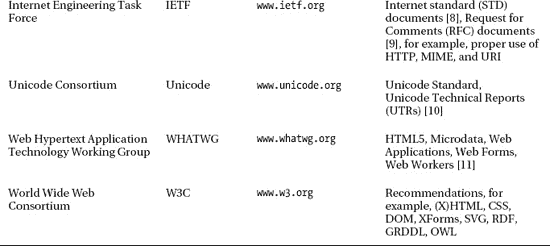
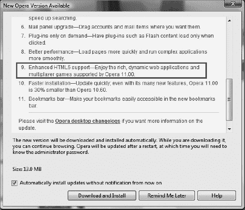
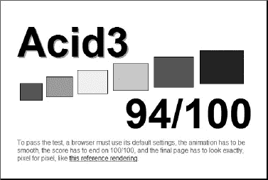
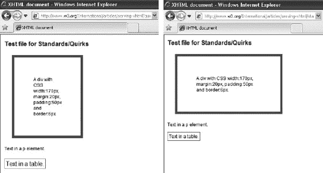
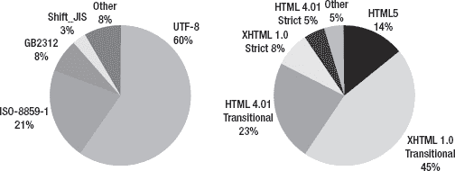

## 第一部分

## 网络标准

在本书的这一部分，您将熟悉 web 标准背后的理论背景。您将学习网站标准化的基本概念，以及开发标准的标准化机构和发布、推广和分发标准的最有影响力的网站。您将了解 web 标准的重要性，理解不正确实现的原因，以及纠正或消除它们的技术。您将按类别学习 web 标准，从服务器配置和国际化设置到符合标准的标记、样式表、对象嵌入、元数据注释和新闻提要。阅读完这些章节后，你将有一个坚实的 web 标准基础，并且能够为你的项目选择最合适的标准。

## C H A P T E R 1

## Web 标准介绍

技术标准广泛应用于生活的各个领域——想想纸张大小的标准和适合它们的标准信封。 *Web 标准*与其他标准类似，是技术和方法的规范性规范。换句话说，它们是需要满足的明确定义的需求集。它们不仅从技术角度来看是理想的，而且代表了用户的需求。然而，web 标准经常被忽视；万维网由数十亿个文档组成，这些文档没有考虑适当的限制或规定，导致了严重的问题。这是因为网络是一个“免费论坛”，即使没有技术背景，每个人都可以在这里发表文章。不幸的是，这种方法是有代价的:您经常会遇到下载速度较慢、外观不佳或功能较差的站点。此外，尽管遵从标准有好处，但不仅内容作者，而且 web 开发者都发现很难实现 web 标准。其中一个主要原因是缺乏广泛的分布。即使是最受欢迎的网站也可能非常混乱，与常见的误解相反，开发人员不能将它们作为学习的参考。此外，许多开发人员忽视标准，因为他们错误地认为使用标准进行开发意味着额外的工作量。人们对 web 标准的了解有限，他们通常不知道应用它们的原因和最佳方法。

在本章中，您将了解 web 标准的重要性，以及为了在自己的应用中充分利用 web 标准，您应该了解的可靠资源。Web 标准经常被忽略，这导致了严重的问题，这些问题将在本章后面的“问题陈述”一节中描述。本章阐述了 web 标准的主要好处。它还会让你对标准的多样性和地位有一个坚实的理解。阅读本章后，您将能够识别最终的规范，并为任何项目选择最合适的规范。

### 基本概念

*Web 标准*适用于万维网(简称 Web)。这些正式的标准定义和描述了网络的各个方面。根据标准的主要推动者 web 标准项目的说法，“Web 标准是经过精心设计的，旨在为最多的 Web 用户提供最大的好处，同时确保在 Web 上发布的任何文档的长期生存能力。使用这些标准进行设计和构建可以简化和降低生产成本，同时提供更多人和更多类型的互联网设备可以访问的网站。随着传统桌面浏览器的发展，以及新的互联网设备进入市场，沿着这些路线开发的网站将继续正确运行。

网络标准通常是事实上的标准。由于没有强制执行的法律，web 标准被很大一部分 web 开发人员所忽视。世界上最大的网络标准化组织万维网联盟(W3C)发布的建议也不例外。然而，在 2010 年 11 月，W3C 向前迈进了一大步，成为 ISO/IEC JTC 1 PAS 提交者，因为 W3C 生产的任何稳定的核心 web 技术也在 ISO 的范围内。国际标准化组织(ISO)和国际电工委员会(IEC)可以通过将事实上的标准的地位变为法律上的(原则上)[ [2](#ref2) ]来有效地促进 W3C 标准的更广泛(如果可能的话)全球采用。

*网站标准化*是指标准网站的开发过程或对非标准网站的修正，以满足成为标准网站的要求。这个短语最近与 web 设计和编程的哲学联系在一起，包括广泛接受的技术、技巧和最佳实践的应用。该列表还包括各种技巧，以及许多开发人员使用的 CSS 和 JavaScript 技巧，他们中的大多数人并不知道这些技术不应该使用。

标准化的主要目标是功能性、互操作性以及浏览器和分辨率独立性，以确保用户体验、内容访问、菜单可用性和可预测的行为。

### 标准化的作用

正如您将看到的，web 开发有几个目标，如果没有标准化的方法，这些目标是无法实现的。没有纸张尺寸标准，怎么可能在日常生活中使用打印机呢？没有标准电压，怎么会有人使用电子设备呢？为什么 web 开发人员应该认为标准对于质量保证不是必不可少的？

在 web 上创作时，应该遵循由 Web 标准定义的语法和其他规则。尽管浏览器具有强大的内置错误处理功能，能够消除用户方面的问题，但 web 开发人员不应该滥用这些功能。

总体而言，设计成本更低，因为需要做出的设计决策更少。常规设计应该基于标准。另一个好处是开发者可以在设计时再次使用他们的知识。

如果内容没有以适当的方式提供，用户会在几秒钟内切换到其他网站。因此，糟糕的功能和可用性可能会对网站流量和商业收入产生严重影响。

此外，不同的浏览器以不同的方式解释坏的或损坏的标记。这可能是不一致、布局错误、样式问题和意外脚本行为的原因。最好的方法是满足适当的文档类型定义和 W3C 推荐标准所描述的结构、语法和其他规则的所有要求(参见“W3C”一节)。

应用最新的网络技术是困难的，但是它对于提供大多数用户期望的强大功能是至关重要的。网站作者应该选择正确的技术与其他开发者竞争。符合标准是网站开发的一个基本特征，它保证了总体质量。

因此，使用 web 标准是提高 Web 整体可用性的一种有前途的方法。

#### 非标准化加价的成本

所有互联网用户都会不时地遇到这样的情况:网站分崩离析，在明显错误的位置显示元素，这些元素与不可读的内容部分重叠。

在大多数情况下，原因是不标准的或特定于浏览器的源代码，或者缺少用于呈现页面的 web 浏览器的标准支持。

从标准化的角度来看，大多数网站已经过时。即使是最大、最知名的公司也不断发布非标准文档。

非标准化文件的主要缺点如下:

*   搜索引擎索引不足。爬网程序无法索引编码不正确的文档，这可能会导致访问者流失。 [1](#CHP-1-FN-1)
*   下载时间更长。
*   更长的渲染。
*   不正确的渲染(最大的缺点之一)。
*   更容易开发。
*   可及性水平低。
*   低水平的向后兼容性。
*   流量流失，访客减少，销量下降。由于前面列出的不便和问题，不符合标准的网站具有丧失功能、受欢迎程度和生产力的更高风险。
*   额外的带宽负载和托管成本。源代码中大量不必要的字符增加了文件的大小和复杂性。
*   更新维护困难。

#### 符合标准的标记的好处

有效的、符合标准的标记有几个优点。以下是最重要的几个:

*   搜索引擎爬虫可以更充分的索引文档，内容基本都是搜索引擎优化的。
*   相比那些违反标准的网站，符合标准的网站下载速度更快。
*   结构良好的标记提供了更快的呈现速度。
*   正确应用标准的 Web 文档被准确地呈现。
*   容纳了更多的用户，他们可能会因为正确的外观和布局而停留更长时间。 [2](#CHP-1-FN-2)
*   更低的开发成本(仅在合格的开发人员和精心选择的软件工具的情况下)。
*   符合标准的标记是网站可访问性的基础。
*   随着浏览器的发展，确保了向后兼容性。
*   最佳的内容长度和文件大小(源代码中没有列出不必要的字符)，以及成本最优的存储(更便宜的主机的潜力)。

__________

然而，还有几个额外的因素会影响搜索引擎索引。

2 得益于正确的渲染而非设计。

*   符合标准的标记比违反标准的标记更容易维护和更新。
*   符合标准的源代码会过时，当引入新标准时，升级会容易得多。
*   保证了与当前和未来浏览器的兼容性(至少从开发人员的角度来看)。
*   激励实现并迫使 web 浏览器逐步支持标准。

显然，符合标准的、干净的代码比非标准的源代码有许多优势。因此，在网站开发过程中考虑标准不仅是强烈推荐的，而且是至关重要的。

### 标准的制定和发布

一般来说，web 标准是由标准化机构发布的 web 技术的技术规范。大多数网络标准都是由 W3C [ [4](#ref4) 发布的。它的*建议*在用标准设计时至关重要。W3C 发布了关于标记语言、样式表、元数据、XML 技术、语义标记、数学符号和图形格式的规范，这只是提到了最重要的类别。然而，在 web 标准化领域也有其他有影响力的标准组织([表 1-1](#tab_1_1) )。

_________

3 建议一词指的是缺乏法律地位。这是它们很少被应用的原因之一。

#### W3C

由蒂姆·伯纳斯·李(“网络的发明者”)创立并领导的*万维网联盟*是为万维网制定标准的最大国际组织。它在世界各地有几个地方办事处。W3C 的成员主要是热衷于参与 web 标准开发的大学和研究团体。W3C 是一个开放的论坛。

正在努力简化对 web 标准的贡献。在 2010 年秋天，W3C 发布了“让 W3C 成为新标准之地”的提案草案。开放性可能是来自网络社区的新的、更容易的贡献的关键，包括没有 W3C 成员资格的独立网络开发者。这也有助于知识重用的最大化[ [13](#ref13) ]。HTML5、CSS、SVG、MathML、各种 API、RDFa 和微数据等重要标准被总结为一套名为*开放网络平台*的技术标准，该平台向外部组织和公众开放，供其做出贡献。W3C 现在是“网络标准化的开放平台”。

事实上，web 开发人员每天面临的许多问题已经在早期的 W3C 推荐标准中得到了解决和公布，有时是在几年前。一些技术基于最初在其他地方创建的想法，但后来与 W3C 共享，以获得更广泛的支持和流行。

例如，新闻提要并不像人们想象的那么新。当它们第一次出现在 Web 上并得到主流浏览器、操作系统和办公套件的支持时，它们在很多年前就已经被描述过了。令人惊讶的是，RSS 0.9 早在 1999 年就发布了[ [17](#ref17) ]！

类似的趋势也适用于标记语言、矢量图形、等式和其他规范。

数学符号以 GIF 图像文件的形式发布在整个互联网上，尽管用于此目的的标记语言在 1999 年成为推荐标准(随后很快有了更新)。

_________

虽然人们经常这样称呼他，但他并不这样称呼自己。

尽管 W3C 在 1998 年就开始开发 SVG 标准，并在 2001 年成为推荐标准，但矢量图形很少在 Web 上使用。 [5](#CHP-1-FN-5) 用高分辨率位图图形代替。但是为什么呢？只要有可能，就应该用 SVG 来代替它们，并且光栅图形应该只应用于发布照片。W3C 的免费 web 编辑器/浏览器 Amaya 以及 Adobe Illustrator 和 CorelDraw 等流行的图形套件都支持 SVG。从 2010 年开始，SVG 也被 Google [ [18](#ref18) ]收录。SVG 1.2 也支持动画。编辑 SVG 并不比编辑位图复杂，但 SVG 文件一般体积更小，下载速度更快，质量也是位图无法比拟的。

#### WHATWG

Web 超文本应用技术工作组(WHATWG)是一个专业但非官方的社区，由个人于 2004 年创建。这是对 W3C 相对缓慢的标准开发及其决定放弃 HTML 以支持 XHTML 和其他基于 XML 的标准的回应。WHATWG 有一个只接受邀请的委员会，控制着规范的编辑。任何人都可以加入 WHATWG 的开放邮件列表[[19](#ref19)]，为 WHATWG 做出贡献。

#### 亲爱的

*欧洲信息学和数学研究联盟*召集研究人员在 ICT 和应用数学的各个领域进行合作，包括但不限于信息系统应用、信息存储和检索、信息接口和表示、数据加密和数据库管理 [20](#ref20) 。来自欧洲不同国家的 19 个组织保证了这一科学方法。ERCIM 在 SMIL 和 SVG [ [21](#ref21) ]等标准的制定中发挥了重要作用。

#### IETF

互联网工程任务组(IETF)是非营利组织互联网协会(ISOC)和互联网架构委员会(IAB)的标准化组织。IETF 主要关注互联网协议。IETF 标准通常比网站开发人员感兴趣的级别低；然而，即使是众所周知的 TCP/IP 也是由 IETF 开发的。IETF 的使命是通过制作高质量的相关技术文档，影响人们设计、使用和管理互联网的方式，使互联网更好地工作。技术文件列在征求意见(RFC)网站[ [23](#ref23) ]上。

#### Ecma 国际

Ecma International 是一个非营利性的标准组织，致力于开发和推广信息和通信系统的标准。从 web 开发人员的角度来看，它最重要的标准之一是标准化脚本语言 ECMAScript(JavaScript 基于它；参见“JavaScript ~~错误！未找到参考源~~了解更多信息)。

#### 统一码联盟

Unicode Consortium 协调 Unicode 和其他国际化标准的开发、维护和推广[ [25](#ref25) ]。非营利组织定义了 Unicode 字符之间的行为和关系。该联盟与 W3C 和 ISO 密切合作。合作中最重要的部分是 ISO/IEC 10646 的维护，这是与 Unicode 标准同步的国际标准。

_________

相比之下，从 2011 年开始，Internet Explorer 只支持 SVG。

#### DCMI

都柏林核心元数据倡议组织是一家在 T2 注册的公司。开放组织开发和维护可互操作的元数据标准。DCMI 提供年度会议和研讨会、标准联络和标准推广。DCMI 通过论坛、社区和任务组中的协作工作来支持全球用户和开发人员社区。

#### IANA

*互联网数字地址分配机构*负责监管全球 IP 地址和顶级域名分配、域名系统中的根区域管理(ccTLDs 和 gTLDs 的分配)、MIME 类型以及其他互联网协议相关的符号和数字[ [27](#ref27) ]。IANA 由非营利组织互联网名称与数字地址分配机构(ICANN) [ [28](#ref28) ]运营。

#### 绿洲

结构化信息标准促进组织致力于 web 服务、互操作性、安全性和电子商务的开放标准。它的口号是“推进信息社会的开放标准”。该联盟在 web 服务和 XML 上维护有影响力的信息门户[30，31]。

#### ISO

成立于 1947 年的*国际标准化组织*是一个代表世界各地各种标准组织的国际标准化机构 [32](#ref32) 。ISO 提供工业和商业标准。ISO 已经制定了 18，500 多项关于各种主题的国际标准，其中许多也在 Web 上使用(例如，国家代码、日期/时间和持续时间注释)。

### 标准推广和分发

许多 web 标准只是可选的，没有法律强制执行(这是实现全球应用的唯一途径)。然而，有一个新的趋势可能会在几年内改变这种情况(例如，在一些国家有法律强制执行的可访问性标准—参见“定义 Web 可访问性”一节)。在此之前，web 标准并不是随处可见的，web 开发人员很难保持最新的知识和学习新的技术。然而，人们可以使用各种事件和资源作为个人或通过附属机构来通知自己，包括会议、印刷或在线文档和书籍。

#### 群体和协会

热情的 web 开发人员中有许多团体分发和加速标准，并使它们与最佳实践相协调。会员费一般比标准化机构的会员费低得多。有些是开放的，任何人都可以免费加入。

请注意，许多技术团体和协会主要关注技术而不是标准。他们的成员通常只知道最新的技术新闻。以下部分提供了与 web 标准化相关的有影响力的团体的快速概述。

##### 网络标准项目

web 标准项目(WaSP)由专业 web 开发人员于 1998 年创建，旨在推广主要由 W3C 发布的 Web 标准的应用。“网络标准项目是一个草根联盟，致力于确保所有人都能简单、经济地使用网络技术的标准”。该组织关注标准支持、可访问性和更容易的开发。

WaSP 对 web 标准支持的主要贡献被称为*任务组*。它的目的是吸引世界上最大的公司和组织的注意，并说服他们尽可能地遵守标准。WaSP 任务组包括以下内容:

*   无障碍工作队
*   Adobe 任务组(前 Dreamweaver 任务组)
*   教育工作队
*   国际联络小组
*   微软任务组
*   街头团队

用于比较浏览器标准支持的 Acid 测试(参见“标准符合性测试”一节)是由 Web 标准项目引入的。

##### 网络标准组织

作为一个网页设计者/开发者社区，*网页标准组织* (WSG)专注于网页标准和最佳实践以实现标准代码。成千上万来自世界各地的 IT 专业人士都是 WSG 的成员。

##### 无障碍网页设计师协会

无障碍网页设计师协会是一个由专业组织、个人网页设计师和开发者组成的世界性协会。妇女参与发展联盟致力于促进无障碍标准[[35](#ref35)。

##### 国际网站管理员协会

国际网站管理员协会是 W3C 的成员，该协会“在致力于或追求网络事业的个人中提供和促进职业发展机会，并努力工作以提高他们的效率、形象和职业精神，吸引和服务他们的客户和雇主” [36](#ref36) 。

##### 网络行业专业人士协会

网络行业专业人士协会是澳大利亚的一个技术协会。WIPA 召集了在网络行业工作的专业人士来“交流思想，参与辩论，推进教育和促进道德实践”[。WIPA 是澳洲网络课程的主要组织者。](#ref37)

##### 开放数字权利语言倡议

*开放数字权利语言* (ODRL) *倡议*是一个开发和推广 ODRL 词汇表[ [38](#ref38) ]的国际组织，ODRL 词汇表是政策表达的开放标准(参见“DC、IMS 和 ODRL”一节)。

#### 保持消息灵通:活动和课程

除了官方新闻提要之类的在线资源之外，还有几种类型的外观和事件有助于 web 标准的全球分布。该列表包括新闻稿、科学和专业会议、讲座、研讨会、会议、论坛、座谈会和教程。与这些活动相关的许多文件都可以在网上找到。Web standardistas 可以使用这些文档来保持最新的知识和跟上最新的规范。

与 web 标准相关的主要活动(如研讨会和会议以及建议和演示的公告)的主要资源是 W3C 网站，网址为`www.w3.org` [ [39](#ref39) 。事件分为“谈话和露面”和“事件”过去的事件可以在新闻档案中找到。

万维网联盟还通过一个专门的门户网站[ [41](#ref41) ]提供关于 SVG 等标准的在线培训课程。课程包括每周的教学模块(*讲座*)、链接收集、活动和一个论坛。质量由教师保证，因为他们要么是相关 W3C 标准的合著者或编辑，要么是该领域国际公认的专家。参与者预计每周将在这些课程上花费两到三个小时。

从 1977 年开始，*国际化&统一码会议* (IUC)每年举办一次。它涵盖了软件和 web 应用国际化的最新行业标准和最佳实践。最新信息可在`[www.unicodeconference.org](http://www.unicodeconference.org)` [ [42](#ref42) 获得。

IETF 会议每年举行三次。关于即将召开的会议、请求、材料、会议记录和赞助的信息发布在 IETF 网站[ [43](#ref43) ]上。

自 2001 年[ [44](#ref44) ]以来，都柏林核心元数据倡议每年都举行都柏林核心和元数据应用国际会议。

WIPA 在 WIPA 网站[ [45](#ref45) ]上提供关于即将举办的活动的最新信息，例如澳大利亚的培训课程和研讨会。协会还有两个 RSS 频道，分别发布一般新闻[ [46](#ref46) ]和行业事件[ [47](#ref47) ]。

计算机器协会(ACM)维护着一个关于 IT 会议和事件的最新日历，其中一些与 web 技术相关。

自 1970 年以来，ISO、IEC 和 ITU 每年 10 月 14 日在瑞士日内瓦庆祝世界标准日。2010 年世界标准日的信息清楚地表明了标准化的一个主要目标:“标准让世界对所有人开放”。

然而，并不是所有的重大事件都有悠久的历史。许多有前景的会议和研讨会都是很好的倡议，比如 Web 应用的流行会议未来[ [50](#ref50) ]。Carsonified 还组织关于最新技术的在线会议。

有些网站收集了给定主题的事件和文章。一个很好的例子就是`[www.semanticmetadata.net](http://www.semanticmetadata.net)`，这是一个面向语义网开发者的综合性网站[ [52](#ref52) ]。

#### 资源

了解最新 web 标准的最简单方法之一是订阅标准化机构和组织的新闻提要。新闻经常发布在相关网站的主页上。在许多情况下，还可以获得课程材料、会议记录和演示幻灯片。还可以获得各种各样的资源。

W3C 提供了一份每周新闻简报。它的最新消息可以在 Atom[[54](#ref54)和 RSS[[55](#ref55)新闻源中获得。绝大多数 W3C 文档都是公开的，可以免费获得。

关于 Unicode 的一般新闻可以通过 Unicode Consortium [ [56](#ref56) ]的新闻提要获得。

都柏林核心元数据倡议在其网站的主页上发布新闻，并提供新闻提要。Dublin Core 和元数据应用国际会议的会议记录可在 DCMI 会议论文网页[ [58](#ref58) ]上查阅。

带有数字对象标识符(DOI)的科学期刊论文也可以在整个网络上找到，尽管这些文档中的许多都不是免费的。尽管如此，他们中的大多数至少提供了 PDF 格式的摘要。

### 标准的类型、阶段和状态

Web 是一种高度创新的媒体，不断的变化和改进需要不断的标准开发。这导致不同的文档成熟度级别。例如，W3C 建议通过五个这样的级别，也称为 *W3C 流程* [ [59](#ref59) ]:

*   工作草案
*   最后呼叫工作草案
*   候选人推荐(CR)
*   提议的建议
*   W3C 建议(REC)

最后一个版本被开发者认为是要应用的*(事实上)*标准。W3C 推荐标准有时会通过单独发布的*勘误表*进行更新。经过大量的修改后，新版本将取代当前版本。然而，它们的 URIs 一般保持不变。*文件状态*决定哪个版本是最新的，哪个版本应该被应用。在 W3C 技术报告文件夹[ [60](#ref60) ]中可以找到当前 W3C 出版物的列表和技术报告的最新版本。

其他标准化团体使用不同的状态约定。例如，互联网工程任务组应用文档状态，如*互联网草案*、*信息*和*提议标准*。后者被定义为“基本稳定的规范，解决了已知的设计选择，被认为是很好理解的，已经接受了重要的机构群体审查，并且似乎享有足够的机构群体利益，被认为是有价值的。然而，进一步的经验可能会导致规范在推进之前发生变化甚至撤销。IETF RFCs 被指定为*标准*、*草案标准*、*建议标准*、*当前最佳实践*、*信息文档*、*实验文档*和*历史标准*、 [62](#ref62) 。

微格式社区对那些“在开发过程中有些成熟”并且稳定性没有保证的文档使用状态草案规范(T2)。这些文件的实施者被警告要跟上未来的发展和变化。

ISO 采用以下惯例:

*   *前期工作项目* (PWI)
*   *新工作项目建议* (NP 或 NWIP，NP Amd/TR/TS/IWA)
*   *工作草案* (AWI、AWI Amd/TR/TS、WD、WD Amd/TR/TS)
*   *委员会草案* (CD、CD Amd/Cor/TR/TS、PDAmd (PDAM)、PDTR、PDTS)
*   *调查草案* (DIS、FCD、FPDAmd、DAmd (DAM)、FPDISP、DTR、DTS)
*   国际标准最终草案 (FDIS、FDAmd (FDAM)、PRF、PRF Amd/TTA/TR/TS/Suppl、FDTR)
*   *国际标准* (ISO TR、TS、IWA、Amd、Cor)

许多 web 标准是开放标准，这意味着开发已经对个人贡献者开放；它们是公开可用的，并且可能适用某些版权许可。

### 各种渲染引擎

Web 文档和与样式表文件、脚本文件、图像和 XML 文件相关联的文件由*呈现引擎* ( *布局引擎*)处理和显示(即呈现)或打印。它们通常嵌入在 web 浏览器和电子邮件客户端中。

尽管 web 浏览器[64、65、66、67 等等]的使用份额统计数据要么被高估了，要么被低估了，因此通常是不准确的，但有一点是肯定的:没有一个用户代理可以被称为“最受欢迎”或“使用最广泛”的。因此，浏览器独立性比以往任何时候都更加重要。由于呈现和标准支持的差异，为了互操作性和功能性，在网站开发中应该考虑呈现引擎的特性。

从标准的角度来看，没有一款浏览器是完美的。所有这些都有一些关于标记、样式、ECMAScript 或可访问性的问题。然而，大多数浏览器开发者意识到应该加强对标准的支持；否则，他们无法与其他人竞争。

从 web 开发人员的角度来看，在各种浏览器中实现相似(而不是逐像素相同)的外观是一项相当复杂的任务。由于不同的功能和特性，不同的浏览器甚至可能以不同的方式呈现符合标准的网站。在实践中，各种技巧和黑客被用来解决这个问题。但是，只要有可能，就应该消除这些问题。

与 Internet Explorer (IE)相比，其他浏览器的更新会频繁发布，这就是它们在 IE 之前提供新功能的方式([图 1-1](#fig_1_1) )。反 IE 的开发者经常忽略这个简单的事实。

***图 1-1。**浏览器更新提供了新功能，例如对最新标准的高级支持。*

支持 SVG 可以作为一个很好的例子。该规范于 1999 年发布，直到 HTML5 越来越流行才引起人们的注意，html 5 本身就支持这种格式。Firefox、Opera 或 Safari 等浏览器最近也采用了这一标准，尽管是在 IE 之前。然而，这并不是一个很大的成就，因为多年来他们都不支持 SVG。在 21 世纪初，有一个人(如果不是唯一的)做到了这一点，那就是 Amaya。直到最近，大多数人都使用 Adobe SVG Viewer 插件在浏览器中显示 SVG 图像。

元素和属性的实现并不一定意味着对标记语言的完全支持。例如，一些浏览器供应商多年来声称他们的产品支持 MathML 然而，由于缺乏对嵌入机制和外部文件的支持，MathML 在许多情况下无法呈现。实现中甚至缺少适当的 MIME 类型。

多年来，大多数浏览器对标准的支持，尤其是对 CSS 的支持是不正确和/或不完整的。此外，CSS 的最新版本 CSS3 是在上一个版本 CSS 2.1 在浏览器中获得完全支持之前推出的。

#### 三叉戟

被 Internet Explorer(从版本 4 开始)和 IE shells、Outlook Express、Maxthon 和各种媒体播放器使用， *Trident* 是使用最广泛的渲染引擎之一。Windows Internet Explorer(以前称为 Microsoft Internet Explorer)是由 Microsoft 开发的一系列图形 web 浏览器。自 1995 年以来，IE 已经在微软视窗操作系统中实现。

尽管 Internet Explorer 在每个版本中都得到了不断的改进，但即使是最重要的标准，即描述标记和样式表的标准，也没有完全实现。有限的标准支持、不正确的浮动位置、不断扩大的盒子问题，尤其是 Internet Explorer 6 的单个盒子模型的实现，多年来已经给 web 设计带来了严重的问题。

版本 6 中引入了符合标准的模式；然而，这并没有解决问题。甚至一些众所周知的 HTML 4.01 元素(例如，`abbr`)在 IE8 之前也不被支持。几个 DHTML 对象不符合标准。然而，当网页以 IE8 模式呈现时，IE8 中更新的方法和属性可能会给期望早期 IE 版本[ [68](#ref68) ]呈现功能的网站带来问题。

多年来，Trident 一直支持 HTML 4.01、XML 1.0、XSLT 1.0 和 DOM Level 1，只是在实现上略有差距。CSS 级别 2 和 DOM 级别 2 已经提供了主要的实现差距和一致性问题。Windows Internet Explorer 中的 CSS 支持一直在不断发展。Internet Explorer 6 是第一个完全符合 CSS 级标准的版本。然而，一些选择器如`min-height`丢失了。Internet Explorer 8 是第一个几乎完全支持 CSS 2.1 和部分 CSS3 的 IE 版本。重要的是要记住，Internet Explorer 8 中引入的 CSS 功能只有在网页以 *IE8 模式*(或更高)呈现时才能工作。这可以通过将[清单 1-1](#list_1_1) 中描述的`meta`标签添加到网页的头部来保证。

***清单 1-1。**面向 Internet Explorer 8 的版本(不应使用)*

`<meta http-equiv="X-UA-Compatible" content="IE=8" />`

但是，如前所述，强烈建议避免版本定位。

从 Trident 版本 IE8 使用)开始，还可以通过一个专用按钮使用内置的 RSS/Atom 新闻订阅阅读器，该按钮的 RSS 徽标为灰色，激活后变为橙色(如果适用)。

微软最近认识到标准支持的重要性，并开始认真对待它。首先，微软成为 W3C 的 CSS3 和 SVG 工作组中标准开发的积极参与者。其次，它是 HTML5 工作组的联合主席，也是 HTML5 测试任务组的领导者。

Internet Explorer 9 中应用的 Trident 5 引入了对现代 web 标准的支持，包括 HTML5、CSS3、ECMAScript5、DOM Levels 2 和 3、ICC 颜色配置文件和 SVG [ [69](#ref69) ]。与早期版本相比，Trident 5 提供了全面的 XHTML 支持，早期版本只能呈现“HTML 兼容”的 XHTML 文档，而不能正确地使用`text/html` MIME 类型。

#### 壁虎

Firefox、Camino、Mozilla 应用套件、Netscape、Thunderbird、SeaMonkey 等软件都应用了渲染引擎 Gecko(原 NGLayout) [ [70](#ref70) 。网景公司在 1997 年发布了第一个版本。1998 年，Mozilla 项目启动，源代码在开源许可下发布。Gecko 现在由 Mozilla 基金会/公司开发。用 C++ [6](#CHP-1-FN-6) 编写，在 Mozilla 公共许可证(MPL)、GNU 通用公共许可证(GPL)、GNU Lesser 通用公共许可证(LGPL)三种许可证下作为跨平台布局引擎。

Gecko 最初是为了支持 web 标准而设计的，并且正在不断改进。超越标记、CSS、JavaScript、ECMAScript 3 和 5、DOM Levels 1/2/3、XML 1.0 等常规标准；不常用的标准，如 MathML、RDF、XSLT、XPath 和 SVG 也支持具有 alpha 透明度的动画 PNG (APNG)图像。应用 Gecko 的 Firefox 不仅支持 W3C 的建议，还支持其他标准化组织的提议和标准，比如 WHATWG。

__________

Mozilla Firefox 浏览器的部分内容是用 C/C++、JavaScript、CSS、XUL 和 XBL 编写的。

为了提供广泛的互操作性，Gecko 支持`DOCTYPE`切换，这使得正确呈现为旧浏览器及其变体(如 Netscape Communicator 4)设计的非标准网站成为可能。 *x* 。在某种程度上也支持非标准的 Internet Explorer 特性，比如不正确的实现`document.all`属性或`marquee`元素。火狐的怪癖模式并不完美，但和其他浏览器差不多。

Firefox 还提供了 Google 协议 Safebrowsing 来提高数据交换的安全性。

默认情况下，Firefox 不支持 ActiveX 控件。尽管有第三方插件可用，但它们并不能在所有版本或所有平台上安全运行。

#### KHTML

KHTML 是 Konqueror 使用的布局引擎。它支持 HTML 4.01，部分支持 HTML 5。CSS 2.1 提供了屏幕和分页媒体支持。除了 CSS 3 选择器的完整实现(来自 KDE 3.5.6 [ [71](#ref71) ])，KHTML 还支持其他 CSS3 特性，例如，多背景、框大小和`text-shadow`。KHTML 完全支持 DOM 1 和 2，部分支持 DOM 3。KHTML 中可以使用 ECMA 262(JavaScript 1.5)，以及图形格式 PNG、MNG、JPEG、GIF 和 SVG(部分支持)。

#### 网络工具包

KHTML 的分叉(采用)版本是开源的 WebKit 布局引擎。使用 WebKit 的最知名的浏览器是苹果 Safari 和谷歌 Chrome。但是，也有其他应用 WebKit 的浏览器，例如，Arora、美岛莉、OmniWeb、Shiira、iCab (4+)、Epiphany、SRWare Iron 和 Maxthon (3+)。WebKit 用于多种移动设备，如 Apple iPad、iPhone 和 iPod touch，以及 Android、Palm webOS 和 Symbian S60 上的浏览器。桌面版 Safari 适用于 Mac 和 Windows 电脑。

作为最新标准的首批实施者之一(这也已经被 Acid2 和 Acid3 测试所证明)，Safari 一直被认为是最具创新性的网络浏览器之一。例如，Safari 5 不仅支持 HTML 4.01 和 XHTML 1.0，还支持 HTML5 的一些功能，如媒体支持、`video`元素、`canvas`元素的全屏播放、地理定位、结构化元素、Ajax 历史、`draggable`属性、表单验证、`sandbox`属性和 Ruby 注释。Safari 5 处理 CSS 动画、CSS 效果和 Web 字体。此外，它还提供 JavaScript 支持(ECMAScript 262 版本 3)、JSON、XML 1.0 和 SVG 1.1。Safari 5 中还提供了高级辅助功能，如 VoiceOver 屏幕阅读器、ARIA 支持、增强的键盘导航、整页缩放、内容缩放、HTML5 视频的隐藏字幕、自定义样式表和最小字体大小。它还有一个内置的新闻阅读器[ [72](#ref72) ]。

使用 WebKit 渲染引擎的另一个流行浏览器 Google Chrome 的第一个版本通过了 Acid1 和 Acid2 测试。Chrome 通过了第 4 版的 Acid3 测试。Chrome 是 HTML5 实现的领导者，由于 HTML5 规范的持续发展，它也在不断发展。Chrome 还提供了令人印象深刻的 CSS3 选择器支持和快速的 JavaScript 执行。

#### 快点

Presto 是主要由 Opera 桌面浏览器(从版本 7 开始)、Opera Devices SDK 以及 Opera Mobile 和 Mini 变体使用的渲染引擎。Opera 被用作其他浏览器的基础，如任天堂 DS 和 DSi、诺基亚 770 和 Wii 互联网频道，以及索尼 Mylo COM-1 浏览器。

类似 Trident(微软)的开发者，Presto，Opera 软件的开发者，是 W3C 成员[ [73](#ref73) ]。因此，Opera 拥有高水平的标准支持。例如，Opera 11 支持 HTML5 元素，如`video`、`audio`、web 表单、`contentEditable`和`input`属性或`input`类型。CSS 2.1 和 CSS3 选择器已经完全实现，还有 SVG、SMIL 和`canvas`。Web Workers、地理定位、选择器 API、触摸事件、Viewport `meta`元素以及其他技术和标准也在 Presto [ [74](#ref74) ]中可用。

#### Amaya

不同于其他专门用于显示网络文档的浏览器，Amaya 是一个免费的开源网络浏览器，集所见即所得的网络开发环境于一身。Amaya 由 W3C 管理，支持 HTML 4.01、XHTML 1.0、XHTML Basic、XHTML 1.1、HTTP 1.1、MathML 2.0、CSS2(部分)、SVG [ [75](#ref75) ]。发行版适用于 Windows、Linux 和 Mac。

### 测试浏览器的标准支持

Web 浏览器可以从两个不同的方面进行测试:支持的标准和支持的技术。浏览器测试的发展取决于方法和目标。

自动*布局测试*很难在移动设备上执行。通常，布局测试应用基于截屏的方法，将截屏与参考进行比较。

一个必不可少的特性应该是可以在尽可能多的平台和浏览器上运行的测试格式。比如 Mozilla 开发的浏览器测试就不是跨浏览器测试。

可以使用 *ref-tests* [ [76](#ref76) ]来比较被认为会产生完全相同的渲染效果的同一网页的两个不同版本。Mozilla 还提供了一个使用 *MochiKit* JavaScript 库[ [77](#ref77) 的自动化测试框架。该测试应用 JavaScript 函数调用。这些特定于浏览器的测试不能用于一般的浏览器比较。

万维网联盟提供了 HTML 测试[ [78](#ref78) ]，CSS 测试套件[ [79](#ref79) ]，移动测试[ [80](#ref80) ]，MathML 测试套件[ [81](#ref81) ]，SVG 测试套件[ [82](#ref82) ]，以及国际化测试[ [83](#ref83) 。W3C 也对贡献开放。

大多数浏览器测试都需要人工评估来完全确定地识别错误。不完整或不正确的标准支持通常用复杂的测试来测试，其中许多是公开的。

#### 标准符合性测试

最著名的符合标准的浏览器测试是 *Acid 测试*。该名称是指用于黄金评估的酸性测试。然而，这些酸性测试提供了快速且易于理解的渲染引擎标准符合性的指示，而不是黄金纯度。尽管如此，Acid 测试总是因为测试一组很少使用的特性，以及那些没有最终规范的特性而受到批评。

Acid 测试的第一个版本是在 1998 年末用 HTML 4.0 Strict 编写的，用于检查早期 web 浏览器之间的互操作性问题。Acid1 根据参考图像[ [85](#ref85) ]在页面上测试几个特性，重点是符合 CSS1 规范。根据文档标题，Acid1 是一个“显示/框/浮动/清除测试”

*Acid2* 是 Web 标准项目在 2005 年发布的一个测试页面。同样，提供了参考图像，该参考图像应该与渲染版本进行比较。请注意，当鼠标悬停在脸部[ [86](#ref86) ]时，鼻子应该会变成蓝色。除了这种悬停效果，Acid2 还测试了绘画顺序、`object`元素、数据 URIs、PNG 图像的 alpha 透明度和几个 CSS 特性(绝对、相对和固定定位、CSS 框模型、CSS 表格格式、CSS 生成的内容和 CSS 解析)。Safari 是第一个在 2005 年末通过 Acid2 的广泛使用的浏览器。其他人在两到三年后跟进。比如 Firefox 从 3.0 版本就通过了测试。

*Acid3* 已于 2008 年开播。分成 6 个“桶”的 100 个子测试涵盖了以下标准的各个部分:数据 URI 方案、HTTP 1.1 协议、HTTP 状态代码、Unicode 5.0 UTF-8 和 UTF-16、`image/png`和`text/plain`内容类型、HTML 4.0 过渡、HTML 4.01 严格和 XHTML 1.0 严格标记语言、DOM 级别 2(核心、HTML、事件、样式、视图、遍历、范围)、`object`元素、ECMAScript(包括垃圾收集)、CSS 选择器不仅仅是那些不能达到 100/100 分的浏览器没有通过测试，那些不能流畅地渲染动画或者渲染得与参考资料中呈现的不同的浏览器也没有通过测试([图 1-2](#fig_1_2) [ [87](#ref87) )。

***图 1-2。**浏览器中的 Acid3 测试未通过*

以下是通过 Acid3 测试的首批稳定的公共浏览器版本:

*   苹果 Safari 4.0(第一款通过 Acid3 [ [88](#ref88) ]的网络浏览器)
*   Opera 10.6 [ [89](#ref89) ]
*   Google chrome 4 . 0 . 249 . 78[[90](#ref90)
*   主显节 2.28.0 [ [91](#ref91)
*   iphone[【7】](#CHP-1-FN-7)3.1
*   虹膜浏览器 [7](#CHP-1-FN-7) 1.1.4
*   螺栓浏览器 [7](#CHP-1-FN-7) 1.6 [ [92](#ref92)
*   歌剧移动[7](#CHP-1-FN-7)9.7[93](#ref93)

_________

7 手机浏览器

#### 综合测试

在渲染引擎时，除了符合标准之外，还有其他一些考虑因素，例如，安全性或 CSS 选择器 API94 支持。

布局测试、Mochi 测试和 RefTests 可以由 BrowserTests 执行，browser tests 是浏览器测试用例及测试套件[ [95](#ref95) ]的存储库。

BrowserScope 提供了对整体浏览器功能的全面比较和评估。这是一个“社区驱动的 Web 浏览器评测项目”。该网站提供了在最新浏览器版本上进行的最新测试的最新信息。可以比较浏览器，并且可以在用于呈现站点的浏览器上运行测试。

### 标准与怪癖模式，文档类型切换

web 浏览器的标准遵从性问题并不是最近才出现的。然而，情况一直在不断改善。在部分支持 W3C 推荐标准后，浏览器用户和网站开发者面临一个严重的问题。早期为旧浏览器开发的数百万个网站在过时的渲染引擎中看起来不错，但在最新版本中却有严重的问题。换句话说，遵从 W3C 推荐标准成了一个问题。

*来自网络标准项目的托德·法尔纳*在 1998 年 [97](#ref97) 发明了被称为*文档类型切换*的解决方案。缺少`DOCTYPE`的旧的非标准文档可能会在不同的渲染引擎中产生不同的结果。现代浏览器检查`DOCTYPE`，如果预期的行为遵循 W3C 标准，则文档以*标准模式* ( *严格模式*)呈现。如果缺少文档类型定义，浏览器会切换到一种称为*怪癖模式* [ [98](#ref98) ]的模式，这种模式可以处理旧浏览器的非标准、意外行为([图 1-3](#fig_1_3) )。

***图 1-3。**标准模式[ [99](#ref99) 和怪癖模式[ [100](#ref100) ]* 下的 W3C 测试文件

最著名的浏览器 bug 之一是 *Internet Explorer box 模型 bug* ，它使得在不同的浏览器中进行完全相同的逐像素渲染变得不可能。它是作为一个盒子模型的自己的实现出现的，而不是早期版本的微软 Internet Explorer 中的 W3C CSS 盒子模型[ [101](#ref101) 。(然而，一些 web 开发人员认为 IE5 中实现的 box 模型比 W3C 的[ [102](#ref102) ]更符合逻辑；尽管如此，它还是不标准。)IE6 和更新的版本消除了标准模式中的问题。然而，为了兼容性，这个 bug 仍然以古怪的方式出现。(2006 年停产的 Mac 版 Internet Explorer 不受影响。)根据 1996 年发布的 W3C CSS1 规范(后来修订了几次)，确定所有块级元素的`width`和`height`属性应该只影响可见元素的宽度和高度，而填充、边框和边距应该在以后应用。Internet Explorer 5 在预定的宽度/高度内包装内容、填充和边框。因此，呈现框与预期的不同。盒子模型也出现在新版本的级联样式表规范中，包括 CSS 2.1 [ [103](#ref103) 和 CSS3 [ [104](#ref104) ]。

符合标准的网页可以更快地打开，因为浏览器可以使用标准模式，而不是在古怪模式中找出非标准标记。

现代浏览器以标准模式呈现所有提供`DOCTYPE`的页面，不管它们是否有 XML 声明。但是，如果在`DOCTYPE`声明之前出现了除字节顺序标记之外的任何内容，Internet Explorer 6 会以 Quirks 模式呈现所有页面。

### 问题陈述

大多数人认为 web 标准化是一个规范的、精确的过程。事实上，没有一套明确的规则可以遵循。稍微熟悉 web 标准的人可能会认为万维网联盟为 Web 提供了标准。尽管 W3C 为标记、注释、样式等开发了 web 技术，但这些技术迟早会获得官方授权，它们的实现只是一种期望。由于缺乏官方地位，这些发展是建议，而不是标准。与标准化组织公布的标准不同，例如，ISO，web 建议很少被应用，因为缺乏官方地位[ [105](#ref105) ]。个体供应商和网站开发者*可能*决定遵循一些建议，但是没有强制执行。这绝对不是对待他们的方式。应努力使这些建议得到广泛采纳；事实上，从技术的角度来看，99.9%的网站都已经过时了。标准化方面的情况也好不到哪里去:很大一部分网站提供了无效代码。

2011 年在全球 350 个最受欢迎的网站上进行了一系列全面的验证测试(由 Alexa index[8](#CHP-1-FN-8)[[107](#ref107)]选出)。测试发现，94%的网站没有通过涵盖字符编码、标记和样式的 web 标准验证测试。

完全没有理由应用 13 种不同的字符编码，即 UTF 8、ISO-8859-1、GB2312、Shift_JIS、GBK、Windows 1251、EUC-JP、Windows 1256、ISO-8859-15、ISO-8859-2、ISO-8859-7、ISO-8859-9 和 Windows 874。这同样适用于标记语言。已经确定了九个(X)HTML 版本和变体。在测试时，14%的网站在规范最终确定之前已经应用了 HTML5，23%的网站使用了过时的 HTML 4.01 Transitional，45%的网站使用了 XHTML 1.0 Transitional，8%的网站使用了 XHTML 1.0 Strict，5%的网站使用了 HTML 4.01 Strict，还有 5%的网站使用了其他语言，如 HTML 4.0 Transitional，HTML 4.0 Strict 和 XHTML 1.1 ( [图 1-4](#fig_1_4) )。虽然 XHTML 1.0 Strict 和 HTML5 这两个版本可以被认为是现代标记语言，但它们的应用是不正确的:大多数情况下标记都充满了错误。标记错误的平均数(6)清楚地表明了这种情况。样式表错误的数量甚至更高，令人难以置信地高达 738 个错误(！)放在一个 CSS 文件中。CSS 错误的平均数量是 45。这些数字仅代表索引文件；预计所有其他页面也会有类似的数量级。

__________

自然，网站列表会不断变化，但这对结论没有任何影响。

***图 1-4。**字符编码和标记语言的份额*

显然，并不是所有的内容作者都是 web 开发者，Web 标准化的份额甚至更低。大多数 web 内容作者甚至不知道底层的技术和标准，更不用说它们的应用了。期望不会迫使人们正确地实现 web 技术和标准。缺乏共识使得网络混乱不堪。与 C 等编程语言相比，Web 是一个非常容错的环境。这一特性使得数百万人在没有适当知识的情况下创建网页成为可能，但同时这也是互联网用户每天面对不正确标记的原因。

公司希望有一个专业的形象来销售他们的产品，并且经常专注于设计和营销。在大多数情况下，设计师对 web 标准化知之甚少。每个人都应该至少知道 web 标准中固有的潜力。

web 浏览器的不充分和不完整的标准实现也导致了标准化和推荐标准的问题。话又说回来，即使是标准化的网站在缺乏完全标准支持的浏览器中也可能看起来不够好。只有在用户代理和 web 开发人员的站点都遵循标准的情况下，才能期望合理的呈现。

Web 发布通常过于简单，只有非常有限的开发人员成为手工编码人员，这是标准化 web 开发的一个主要关键。因为内容作者需要通过图形界面和动态内容进行内容管理，所以在创作工具中实现适当的标准也可以极大地促进 web 标准化。然而，直到最近，标准遵从性才成为内容管理系统和博客的主要关注点。

在某一点之后，充满错误的 web 文档不应该也不能被容忍。这种文档包含几个不恰当的嵌套元素、格式错误的标签和其他错误，通常被称为*标签汤*。表格应该用于组织数据，而不是用于布局或设计。不应该容忍缺少标签。糟糕的标记会延长下载时间，更不用说渲染时间了。降低加价可以提高效率。很明显，充满错误的源代码比没有错误的标准代码要复杂得多。还可以增加可访问性，以及跨浏览器兼容性和向前兼容性。

#### 服务器端技术和内容管理

服务器端技术，如 PHP、ASP 或 Ruby on Rails，因其在创建动态网站方面的强大帮助而广受欢迎。

虽然服务器端技术和内容管理系统提供了比静态标记更多的动态网站，但它们通常缺乏能使网站更好运行的结构和语义。因此，仍然可以手动生成最高级、标准、可访问的标记，这些标记也提供语义内容。然而，在这方面有一点明显的改善。例如，流行的开源内容管理系统 Drupal 支持一些标准，如用 RDFa[9](#CHP-1-FN-9)[110](#ref110)进行语义注释。

#### 开发工具中有限的标准支持

使用所见即所得软件(如 Adobe Dreamweaver)的非专业作者制作了大量的网站。直到最近，它们中的许多都提供非标准输出。现代版本的 web 开发创作工具支持 W3C 标准。对于提供动态内容的开源环境也是如此，比如社交网站、博客门户等。

尽管如此，这些软件工具仍然要对网上发布的数十亿个网站负责，而不考虑是否符合标准。在大多数情况下，复杂的网站不同于存储在创作环境的模板中的网站。为了实现这一点，用户经常试图修改或扩展源代码的某些部分，这也导致了非标准代码。

由 WYSIWYG 创作工具提供的标记和样式的标准符合性是极其重要的，因为有大量的作者应用它们。然而，如果不理解源代码，标准化的许多方面就不能被充分利用。

### 主要问题

与文档、书籍或电影类似，无法创建满足所有标准和所有用户需求的完美网站——适合一个受众的网站可能不适合另一个受众，即使您试图绝对遵守发布的每个标准，您也会发现某些标准不能与其他标准结合使用。然而，这并不意味着你不应该努力坚持最重要的标准。几个特点有助于一定程度的质量保证。其中大部分都是符合标准的基本要求，并导致正确的开发实践。此外，它们提供足够的和更可预期的功能和行为、可用性和稳定性，以及更快的下载和呈现。

#### 不良做法

虽然适当的编码实践在编程中被广泛应用，但是 web 开发人员和没有适当背景的人不会认真对待标记实践。“它也是以这种方式工作的——为什么要为符合标准而烦恼呢？”这是严肃的 web 开发人员最好忘记的方法。不良标记包括但不限于特定于浏览器的代码片段、大量嵌套的表格布局、结构与布局混合、局部应用的样式属性、属性最小化、缺少属性值以及其他异常，这些都会显著增加代码长度、复杂性、下载和呈现时间。

#### 缺乏支持

Web 标准支持是不够的。对于缺乏经验的人来说，没有关于 web 标准的终极实用指南。尽管提供了对标准规范的免费访问，但大多数人发现它们太难理解，并且在实践中难以应用。

__________

来自版本 7 的 9

在符合标准是官方要求的地方，例如政府门户网站或欧盟项目网站，最好的解决方案是雇佣*web standarditas*开发合适的网站。许多网页设计师对标记或样式表并不感兴趣。他们唯一关心的是外表；例如，对于创造性的 Flash 动画，焦点通常完全集中在 SWF 本身，很少考虑如何将它嵌入到网页中。公司领导主要关注内容。人们很难意识到遵从标准可以解决他们的许多问题，例如依赖于浏览器的网页、不正确的呈现或较差的功能。

#### 不关心

web 标准的一个主要问题是，免费获取这些标准不足以说服人们使用它们。创作工具的标准实现是有限的，由它们生成的网站很少遵循标准。web 浏览器的标准支持只是部分的，尽管它们在不断发展。

许多人在没有适当 IT 背景的情况下“开发”网站。对有些人来说，这只是一种爱好；对其他人来说，这是利润来源。除非全世界最有影响力的公司都强调网络标准的重要性，否则它们不会流行起来。另一方面，一些开发者甚至不知道这些技术。这些趋势是由商业和营销所推动的，以达到流行或满足商业需求。例如，由于苹果 iPhone 缺乏对 Flash 的支持，早期的 HTML5 实现应用了未完成的规范，但同时加快了标准的发展和应用。每个对网站设计/开发感兴趣的人，不管是不是专业人士，都应该熟悉 web 标准，因为它们在 web 开发中至关重要，值得学习(而不是照搬别人的坏做法)。

没有几年的专业知识，没人能看懂选择。哪种标记语言是最现代的？如果不了解 HTML、XHTML、XML、语义 web 和 Web 标准的成熟度，就不可能回答这个问题。

幸运的是，最近的趋势是更频繁地应用 web 标准；然而，这种趋势远未在世界范围内使用。只有很少的手工程序员，他们中只有一些人以标准的方式开发网站。因此，内容管理系统有潜力帮助 web 开发人员遵守标准。如果他们能够可靠地生成符合标准的标记，那么默认情况下这是有保证的。大多数高级标记代码是由手工编码者编写的；然而，他们应该完全自己承担标准遵从的责任。即使有许多有用的工具可以帮助他们，手工编码员也不能依赖自动错误检查(见第十一章)。由于 web 标准制定者不仅处理内容，还逐字符处理整个标记和样式表，以及网站的所有文件，他们应该通过频繁的修订和测试来确保符合标准。

#### 有影响力的网站

开发人员通常有一个合乎逻辑的想法，那就是遵循世界上最流行和最广泛使用的网站的实践。然而，这些网站不能仅仅作为标准化的参考，因为它们在遵守标准方面经常有严重的问题。

更令人失望的是，顶级网页设计师也会犯严重的错误。信不信由你，世界上最著名的网络标准化组织的个人网站也可能会出现标记错误。他们中的大多数也害怕在链接到 W3C 验证器的页面上提供 W3C 一致性图标。

寻找同时也符合标准的现代网站可能是一个很好的起点。然而，对于初学标准化的人来说，这可能非常令人困惑。显然，满足所有用户需求是不可能的，但是专注于标准遵守并标有标志“有效 XHTML”或“有效 CSS”的网站通常缺乏设计，并展示出有限的技术使用。很好的例子是 web 标准化机构或 web 可访问性设计者的网站。即使源代码是有效的并且没有错误，代码也经常有其他问题。缺少预期的组件，如新闻提要或收藏夹图标(favicons)，语义标记不存在，等等。这些特性并不影响这些 web 文档的有效性，它们不能专门用作开发现代的、符合标准的网站的起点。不仅个人网站和博客，而且精确的技术文档也可以漂亮地呈现。记住，web 标准化不是一种牺牲！世界上一些最大、最受欢迎的网站成功地应用了标准。

但不是全部。仔细看看来自世界上最大的网站之一的代码片段([清单 1-2](#list_1_2) )。

***清单 1-2。**高流量网站不一定应用标准代码*

`<body class="ego_page home hasLeftCol fbx ie8 win Locale_en_US">
<input type="hidden" id="post_form_id" name="post_form_id"
value="b053066a05f482d5739d31c033b5fd90" autocomplete="off" />

<h1 id="pageLogo">`

显然，这是软件生成的标记，即使是最有经验的手工编码 web standardista 也很难解释这样的代码。几乎每个元素和属性都有问题。`class`属性的值为空。标识符长得不合理，根本不是描述性的，比如`c4d06220d5f2c97d20912236`。源中有内联样式，它应该在外部样式表中。显然，使用-10.000 像素的层定位是一种技巧(可能用于图像替换等技术)，可以通过正确实施标准来消除。应该消除空属性，尤其是如果它们打算用于标识的话(没有名称的`class`不能用于标识元素类)。即使是这几行，错误列表也很长。

#### Flash 的流行

设计是网站制作的主要关注点之一。Adobe Flash 是一种理想的技术，可以提供令人惊叹的外观并吸引注意力。然而，全闪存站点有几个缺点。除非 web 文档是提供联系数据的单页小册子式主页，否则开发(X)HTML 内容要好得多，因为文本标记比二进制文件有几个好处。利用新的交互式 HTML5 元素和 CSS3 属性尤其如此，它们是 Flash 内容的良好替代品。

平面设计师不一定是网页开发者。因此，Flash 电影经常被错误地嵌入。虽然 Flash 文件理论上可以在任何带有适当插件的浏览器中工作，但是控制它们的标记代码可能是依赖于浏览器的，这应该被消除。

Flash 没有问题，但它可能更适合用于标题和内嵌动画。XHTML 和 CSS 的结合可以提供类似的(如果不是更高级的话)用户体验，但是不需要在显示索引页面的内容之前下载完整的大文件。虽然这对于快速连接来说不是问题，但世界上有数百万用户可能会等待半分钟来下载这样的内容。即使 Flash 文件在某些浏览器中是流式的，在下载完成之前，菜单和内容是不可用的。此外，它们可以更有效地被索引/搜索，尺寸更小，并且在默认情况下对浏览器窗口具有完全控制。文本内容比任何其他格式都更易于渲染。即使一些图像无法下载或者存在一些样式问题，内容仍然在那里(如果不是绝对位于窗口之外或者以与背景相同的颜色书写)。与 Flash 内容不同， [10](#CHP-1-FN-10) (X)HTML 文本的锐度、字体大小和其他特性可以根据用户的要求直接从浏览器中更改。

一些软件公司认识到了标记语言相对于 Flash 的优势，并发布了将 Flash 文件转换为 HTML 的工具(例如， *FlashKeeper* [ [111](#ref111) )。甚至 Adobe 也有一个名为 Wallaby [ [112](#ref112) ]的 FLA-HTML 转换器。然而，与其他自动标记生成器类似，必须对它们多加小心，因为结果通常是无效的，因此不是最佳的。

#### 格式良好

XML 文档的一个基本要求，也是所有 web 文档的期望要求是*良构性*。它在标准化中至关重要，因为它保证了在相应规范中定义的语法规则列表得到满足。

为了在 SGML 语言(如 HTML)中实现良好的格式，应该正确地打开和关闭元素。空元素也必须终止。元素应该正确嵌套，这样就不会发生重叠。文档的根元素应该包含所有其他元素。

由于 SGML 解析器非常容错，HTML 开发人员很少完全遵循这些规则，这导致了标记错误。因此，缺乏良好的格式会直接导致不正确、不标准的标记。

在诸如 XHTML 这样的 XML 语言中，格式良好有额外的要求。元素标记区分大小写；也就是说，开始和结束标记必须完全匹配。格式良好的 XML 文档应该只包含正确编码的合法 Unicode 字符。但是，这些字符也可以直接用在元素名称和属性中，而不仅仅是用在字符数据(文档文本)中。XML 中具有特殊含义的字符只能用于标记指令，例如，或&。如果它们打算表示为文本，则应该应用它们的实体代码(参见“实体引用”一节)。

违反格式良好性规则的字符会导致某些 XML 解析器无法处理 XML 文件(XHTML 文档、RDF 元数据、RSS 提要通道等等)。这种特殊字符也可能导致错误消息。一个字符(格式不正确)会使整个文件无法处理。例如，在 Internet Explorer 8 中本地打开的有效 RSS 源的 XML 文件显示为树形结构。从服务器检索到的相同文件被表示为新闻提要。但是，如果文件包含一个非法字符，IE8 会给出错误消息 XML 页面无法显示。类似的错误信息在所有浏览器中都存在([图 1-5](#fig_1_5) )。

__________

虽然从版本 10 开始，Flash Player 中也有高级的字体操作功能。

***图 1-5。**Opera 中的一个 XML 解析错误*

#### 互操作性

市场上有各种各样的平台、操作系统和浏览器。每个制造商和开发商都试图提供额外的功能；因此，产品不断地相互竞争。这种多样性导致不同的操作和功能。默认情况下，跨不同系统的网站的功能和行为不能得到保证，但可以通过正确应用最新标准来实现。自然，用户希望将各种系统结合起来使用，以允许相互通信并充分交换数据。不能限制数据访问，并且应该避免特定于实现的解决方案。

*网络互操作性*确保符合标准的网页可以在各种操作系统下的任何浏览器中查看，从 Windows 到 Mac OS 和 Linux，不仅可以在台式电脑上查看，还可以在移动设备上查看，包括平板电脑和智能手机，如三星 Galaxy Tab、苹果 iPhone 或 HTC Sensation。

有几种技术支持互操作性，应该在 web 开发中使用，包括但不限于 UTF-8 字符编码、XML 文档、使用 XHTML 或 HTML5 [ [113](#ref113) ]的结构和语义标记、DOM 脚本、ECMAScript、基于 CSS 的布局、分离的结构、表示和行为、用 MathML 描述的等式以及语义元数据。

##### 浏览器独立

“一页多视图”一直是 web 开发者的噩梦。尽管用户很自然地希望所有的网站在不同的浏览器中都有相同的外观和行为方式，但要实现这一点并不容易。

> 任何在网页上贴上“此页最好用 X 浏览器浏览”标签的人似乎都在怀念过去的糟糕时光，在网络出现之前，你很少有机会阅读写在另一台计算机、另一个文字处理器或另一个网络上的文件。
> 
> —蒂姆·伯纳斯·李[ [114](#ref114)

如今，选择浏览器的自由比以往任何时候都更加真实。人们使用各种各样的软件浏览互联网。然而，大多数人只使用几种浏览器，即 Internet Explorer、Mozilla Firefox、Google Chrome、Opera 和 Safari。因此，在大多数情况下，关注这些旗舰就足够了。这些桌面浏览器背后的四个主要渲染引擎——Trident、Gecko、Presto 和 WebKit——也用于移动浏览(Internet Explorer Mobile、Firefox for mobile、Opera Mobile 和 Safari)。WebKit 还被各种其他移动浏览器使用(Android 浏览器、BlackBerry 浏览器、Iris 浏览器、Myriad 浏览器、诺基亚系列 40 和系列 60 浏览器、Obigo 浏览器、Polaris 浏览器、Skyfire 移动浏览器和 HP webOS 浏览器)。在移动浏览场景中，NetFront 也值得一提；Kindle Basic Web、NetFront 和索尼 PlayStation 便携式网络浏览器使用它。统计数据显示，只有极少数访问者使用由其他渲染引擎驱动的浏览器。

没有人想赶走潜在客户，所以避免特定浏览器的网站开发非常重要。也许最好的解决方案是创建用任何浏览器都能最好浏览的页面。有时，这个网站的特征也通过“可以用任何浏览器浏览”活动的标志来清楚地表明[ [115](#ref115) ]。

开发人员创建在所有浏览器中都相同的网站的主要问题是，在许多情况下需要应用各种技巧来确保功能性。然而，这些代码并不能在所有的浏览器下工作，因此必须为不同的浏览器(以及这些浏览器的旧版本)添加越来越多不同的攻击，从而导致大量额外的代码。唯一的选择是创建基于标准的网站。即使现在的浏览器还不完全支持某些标准(这其实是一个让开发者头疼的问题)，但这些代码至少是为未来做好了准备[ [116](#ref116) ]。此外，它们是发展的良好起点。

与浏览器的不同呈现行为相关的一个非常糟糕的实践是*代码分叉*。代码分叉是为不同的浏览器开发相同内容的多个版本。不应该应用代码分叉，因为产生的代码不能长期使用。

网络标准化组织也同意，不能期望网站在每个浏览器中看起来都完全一样，但是网页上发布的信息应该清晰易读，所有功能都应该在所有主流浏览器中可用。

#### 消除了版本定位

由于渲染引擎不断发展，即使是同一浏览器的不同版本也支持不同的标准。为了避免失去使用旧版本浏览器的用户和潜在客户，web 开发人员通常在标记或样式表中应用各种特定于浏览器和版本的解决方案。换句话说，*版本瞄准*对开发者来说意味着相当大的额外工作，结果只在某个浏览器的某个版本中起作用。

此外，由于当前浏览器版本标准支持的提高，这些代码实际上是对功能或代码优化的威胁，或者两者都是。因此，应该消除版本定位，这在另一方面会导致向后兼容性的问题[ [119](#ref119) ]。虽然有一些技术可以与标准兼容一起使用，以最大化版本独立性(例如，重置浏览器的样式表)，但创建在所有浏览器和浏览器版本下都能正常工作的网页是不可行的。

符合标准的 web 开发应该足够了，浏览器现在应该完全符合标准。然而，情况仍然不是这样。

通过文档头中的简单的`meta`声明([清单 1-3](#list_1_3) )，可以很容易地定义用于呈现版本目标 web 文档的浏览器。

***清单 1-3。**版本定位示例(不应使用)*

`<meta http-equiv="X-UA-Compatible" content="IE=8;FF=3;OtherUA=4" />`

可以通过将`IE=edge`属性值添加到`meta`元素的`content`属性中来定位最新的 Internet Explorer 版本[ [120](#ref120) ] ( [清单 1-4](#list_1_4) )。

***清单 1-4。**版本定位为最新 IE 版本(不应使用)*

`<meta http-equiv="X-UA-Compatible" content="IE=edge" />`

尽管当提供这种数据时，目标浏览器可能会更快地在旧的、向后兼容的和新的、符合标准的呈现模式之间做出决定，但是版本目标应该完全消除。为同一网页创建多个版本的非标准标记不仅成本高昂，而且不可持续。此外，版本定位和浏览器检测脚本不可靠，并且在许多情况下不能定位正确的浏览器，因为浏览器经常将自己标识为其他浏览器或同一浏览器的其他版本。

#### 向后兼容性

在当前使用的浏览器版本下工作良好的符合标准的网站也为将来做好了准备，但是由于其呈现引擎的不正确的标准实现，可能会在较旧的浏览器中不正确地呈现。因此，即使实现得当，web 标准也不能在所有浏览器下工作。对老渲染引擎的支持，*向后兼容性*，应该在合理的范围内。为什么要为不再使用的浏览器或者主流浏览器的“非常旧”的版本而烦恼呢？例如，Netscape 就像 Internet Explorer 1.0 或 Mozilla Firefox 0.9 一样“不再被广泛使用”。这个问题的主要问题是如何定义*浏览器过时*。IE5.5 可以被贴上“很老”的标签，IE6 可以被贴上“老”的标签吗？支持的浏览器的选择对网站的流量和受欢迎程度有很大的影响，缺乏对旧的甚至过时的浏览器的支持会导致访问者的流失。事实上，关于向后兼容性没有最终的决定。

关于向后兼容性的最大痛苦之一是对 IE6 的支持。它的市场份额缓慢下降，直到 2007 年，当时它的受欢迎程度大幅下降，这可能是因为 Windows、Vista 和后来的 Windows 7 的新版本，以及它们的新浏览器版本 7 和后来的版本 8、9 和 10、11以及 Mozilla Firefox、Apple Safari 和 Google Chrome 等竞争对手越来越受欢迎。升级者考虑了几个主要问题。首先，这些年来已经指出了严重的安全漏洞，这些漏洞已经被后来的补丁部分覆盖。然而，由于不断增长的需求，新的功能已经在其他浏览器和 Internet Explorer 中推出，占领了市场。例如，所有现代浏览器都支持 XML 技术、RSS 提要和选项卡式浏览。IE8，尤其是 IE9 是向标准兼容和现代功能迈进的一大步。连微软都推荐 IE6 用户升级[121，122]。像谷歌这样的软件巨头已经开始减少对旧浏览器的支持，这也是他们这么做的另一个原因。最后但同样重要的是，当用户停止使用 Internet Explorer 6 时，这将是开发人员的一大解脱。

__________

Windows XP 附带了 Internet Explorer 6。版本 7 和 8 也可以在 XP 上使用，而 IE9 需要 Windows Vista 或 Windows 7。IE10 将在 Windows 7 下独占运行。

向后兼容的主要缺点是它在某些时候阻碍了新技术的广泛使用。尽管如此，web 标准化组织应该尽可能最大化向后兼容性。满意的用户不能在每次新版本发布时都被要求升级浏览器。

由于旧浏览器的标准支持不完整或有缺陷，向后兼容性通常等同于针对浏览器的攻击和代码片段的应用，以及应该消除的非标准甚至不赞成使用的标记。实现或最大化向后兼容性的一个有用工具是 JavaScript 库“Modernizr”，它检测浏览器对最新 web 标准的支持，如 HTML5 或 CSS3 模块[ [124](#ref124) 。该软件确定当前使用的浏览器是否实现了给定的功能，这使得开发者可以在支持新功能的浏览器中应用新功能，并为那些不支持新功能的浏览器创建回退机制。

#### 向前兼容

虽然一个新的浏览器版本对于非标准的，特别是特定于浏览器的网站的开发者来说可能是个问题，但是网络标准化者不必担心。*向前兼容性*伴随着标准符合性。标准化的 web 文档可以很容易地转换成应用最新标记语言、样式表和其他技术的更新文档。

#### 功能性

除了内容，功能是网站最重要的特征之一。没有它，所有其他的努力都是无用的，甚至包括流行的设计。

开发人员和浏览器都应该支持标准。对于 web 标准主义者来说，以标准的方式开发经常看起来像是某种牺牲。例如，某些 CSS 选择器可以用于各种网站功能，但某些渲染引擎(通常是 Trident 或 Gecko)不支持它们。在这种情况下，开发人员应该做出决定:要么遵循建议和标准的指导方针，不支持某些浏览器(这是不能容忍的)，要么提供非标准的、功能齐全的代码。不幸的是，开发人员有时会面临这些选择。

#### 设备独立性

互联网接入不再局限于台式电脑。笔记本电脑、上网本、PDA、智能手机和电子书阅读器等移动设备也可以连接浏览网站。然而，一些设备——尤其是手持设备——屏幕尺寸、可滚动性和计算能力有限。必须注意提供能在各种设备上工作的代码。这个概念也有助于网站的可访问性，并与国际化部分重叠。

电脑显示器、屏幕、电视和投影仪的选择范围很广。例如，它们都有不同的尺寸、长宽比、分辨率、对比度和色彩保真度。这方面的一个基本要求是*分辨率独立性*。功能应该在各种设备上可用，而不管不同的硬件控制，例如键盘、触摸屏或移动设备的可定制控制按钮。设备独立性提供了对不同访问机制和不同使用模式(例如，视觉和听觉使用模式)的支持。设备独立性的目的是“将网络内容与交付环境的需求、能力和限制相匹配” [125](#ref125) 。尤其是对移动浏览日益增长的兴趣使得设备独立性成为网站开发中的一个主要关注点。

HTML 和 XHTML 等标记语言是设备独立性标准的很好例子。CSS 可用于通过除台式计算机以外的设备(包括但不限于移动电话、投影仪和打印机)的附加样式表来提供设备独立性。 [12](#CHP-1-FN-12) Java 小程序可以在不同平台下的多种设备上执行，因为 Java 是一种跨平台的编程语言。JPEG、TIFF 或 GIF 等图像文件格式也是与设备无关的文件。在文档发布和共享中，PDF 是设备独立性的经典例子。

#### 将内容与演示分离

在网络发展的早期，人们对网络出版的唯一关注就是网络本身。当时，web 文档主要局限于轻度格式化的文本内容和图像的混合。当可能性扩大时，网络很快成为一个完整的多媒体平台。

由于越来越多的人(不仅仅是 web 开发人员)尝试在 Web 上发布内容，因此有必要简化这一过程。结果，几乎每个人都能在网上发表文章，即使他们没有能力这样做。为了维护网络的功能，浏览器开发者让他们的产品变得简单且容错。人们开始认为表面之下的东西并不重要。

多年来已经证明，格式应该与结构分离。这是级联样式表的主要概念之一。这种方法导致了集中的样式控制，使得从一个位置改变整个网站的样式成为可能。此外，标记变得更短、更少冗余、更清晰、更简单，并且更容易解释和呈现。除了语法，语义注释也可以在 web 文档中提供。与样式规则相反，语义在逻辑上与标记和内容相关。

#### 可用性

*可用性*可以定义为“为一个网站设定清晰简明的目标，确定一套正确详尽的用户需求，确保网站满足用户的期望，设定可用性目标，提供有用的内容” [126](#ref126) 。这是一个衡量系统使用难易程度的指标。可用性可以通过优化用户体验、提供浏览器独立性和可访问性、提供适当的主页和站点结构以及提供可靠的布局来实现。可用性不应该与可访问性混淆，可访问性意味着所有人都可以访问，不管用户是否残疾或设备是否受限。

网站应该提供有用的内容，这些内容与受众相关并且适合他们。网页内容要写的合适。对文本、链接、列表、控件、图形和多媒体的外观有许多要求。除了内容之外，导航和站点结构的组织方式应该满足用户的期望。这可以通过让用户参与测试站点来实现。任何网站的主要目标都应该在设计和开发过程之前。在设计过程中，应该考虑用户界面问题以及多种设计。

应该避免很可能混淆或干扰用户的解决方案。弹出窗口应该被消除。网站应该按照标准来开发，这样用户就可以按照他们习惯的顺序和方式来执行任务。

__________

没有背景图片的相同网站，确保宽度不超过美国信纸的宽度，等等。

#### 可靠的布局

网站元素的可靠定位一直是网站开发中的主要关注点。由于要考虑大量的因素，有些元素应该绝对定位，而其他元素应该相对定位。有些元素应该是固定的，即使内容超出了浏览器窗口并且内容是滚动的(参见“可靠定位”一节)。

在 CSS 中，有几个度量单位用于定义元素的尺寸、长度和距离。单位可以是相对于相关字体或查看设备的(`em`、`ex`、`px`)，也可以是绝对的(`in`、`cm`、`mm`、`pt`、`pc`)。也可以应用百分比。但是，应合理选择单位(参见“尺寸和比例”一节)。不可靠或依赖于浏览器的定位以及不正确的单元组合会导致内容不可读或功能受限。层的重叠顺序也可能是一个问题，因为该顺序可能导致在各种环境中内容不可读。

布局与设备、分辨率和浏览器独立性密切相关。

#### 代码优化

Web 标准提供了一种开发可靠的、功能齐全的、可互操作的、独立于设备的网站的方法。但是，它们无法保证默认情况下*的最佳码长*。即使源代码中的每个字符都有其意义，也就是说，没有一个字符是不必要的，代码长度可能仍然远非最佳。标记中的长标识符，尤其是 CSS 中被忽略的继承(请参见“被忽略的继承”一节)会增加复杂性和长度，导致文件更大、下载更慢、呈现时间更长(请参见“非最佳代码长度”一节)。

### 总结

在本章中，您了解到 web 标准不是固定的规则集，而是一个不断发展的最终规范列表。到现在为止，您已经很清楚有几个网站发布了开放标准，web 标准化也包含了最佳实践。正确的标准实现独立于网站的受欢迎程度以及内容作者和开发者试图追求的趋势。设计和开发网站没有最好的方法；然而，遵循标准是非常有益的，这是提供最高级别的互操作性和保护您的网站未来安全的唯一方法。

在下一章中，我将讨论服务器和标记中的语言和字符设置，以确保正确的字符表示，并为搜索和处理 web 文档的软件代理提供高级提示。web 文档的国际化设置通常在开发过程之前，因此被描述为标准网站开发的第一步。

### 参考文献

1.  Gustafson A，Casciano C，Walter A 等(2010)[www.webstandards.org](http://www.webstandards.org)。Web 标准项目。2010 年 4 月 26 日访问
2.  Dardailler D (2010) W3C PAS 常见问题。万维网联盟。[www.w3.org/2010/04/pasfaq](http://www.w3.org/2010/04/pasfaq)2010 年 11 月 6 日访问
3.  hazal-Massieux，D (2002)购买符合标准的网站。万维网联盟。[www.w3.org/QA/2002/07/WebAgency-Requirements](http://www.w3.org/QA/2002/07/WebAgency-Requirements)2010 年 10 月 24 日访问
4.  W3C (2010)所有标准和草案。万维网联盟。[www.w3.org/TR/#Recommendations](http://www.w3.org/TR/#Recommendations)2010 年 4 月 26 日访问
5.  ECMA (2010)正式出版物。www.ecma-international.org/publications/index.html[。ECMA 国际。2010 年 4 月 26 日访问](http://www.ecma-international.org/publications/index.html)
6.  ISO 网站上的 ISO (2010)万维网标准。<ins>【www.iso.org/iso/search.htm?qt=world+wide+web】&发表=上&主动 _ tab =标准</ins> 。国际标准化组织。2010 年 4 月 26 日访问
7.  IANA IANA(2010)网站。[www.iana.org](http://www.iana.org)互联网号码分配机构。2010 年 4 月 26 日访问
8.  IETF (2010) IETF 网站。[www.ietf.org](http://www.ietf.org)互联网工程任务组。2010 年 4 月 26 日访问
9.  IETF (2010) RFC 页面。www.ietf.org/rfc.html。互联网工程任务组。2010 年 4 月 26 日访问
10.  Unicode Consortium (2010)技术报告。www.unicode.org/reports/index.html。unicode Inc .于 2010 年 4 月 26 日访问
11.  WHATWG (2011) WHATWG 社区网站。www.whatwg.org。网络超文本应用技术工作组。2011 年 7 月 29 日访问
12.  Jacobs I (2010)让 W3C 成为新标准之地。W3C 提议草案。[www.w3.org/2010/07/community](http://www.w3.org/2010/07/community)2010 年 9 月 14 日访问
13.  Dardailler D (2010)开放标准政策。W3C:网络标准化的开放平台。未来互联网会议-标准化研讨会。万维网联盟。[www . w3 . org/2010/12/DD-W3C . html #(3)](http://www.w3.org/2010/12/dd-w3c.html#(3))。2010 年 12 月 3 日访问
14.  Dardailler D (2010) W3C 执行摘要。W3C:网络标准化的开放平台。万维网联盟。[www . w3 . org/2010/06/DD-diplo . html #(7)](http://www.w3.org/2010/06/dd-diplo.html#(7))。2010 年 10 月 10 日访问
15.  Dardailler D (2010) W3C:网络标准化的开放平台。万维网联盟。[www.w3.org/2010/12/dd-w3c.html](http://www.w3.org/2010/12/dd-w3c.html)2010 年 12 月 12 日访问
16.  Guha RV，Bray T (1997)使用 XML 的元内容框架。万维网联盟。[www.w3.org/TR/NOTE-MCF-XML/](http://www.w3.org/TR/NOTE-MCF-XML/)2009 年 10 月 7 日访问
17.  网景通信(1999)我的网景网络:快速入门。网景公司。http://web . archive . org/web/20001208063100/http://my . Netscape . com/publish/help/quick start . html(存档版本于 2010 年 9 月 2 日访问，原始版本不再提供)
18.  斯坦内斯库 B，萨拉帕塔 J (2010) Google now 索引 SVG。谷歌公司[http://Google webmastercentral . blogspot . com/2010/08/Google-now-indexes-SVG . html](http://googlewebmastercentral.blogspot.com/2010/08/google-now-indexes-svg.html)。2010 年 9 月 27 日访问
19.  WHATWG (2011) WHATWG 邮件列表。网络超文本应用技术工作组。[www.whatwg.org/mailing-list](http://www.whatwg.org/mailing-list)于 2011 年 8 月 1 日访问
20.  ERCIM (2010) ERCIM 网站。[www.ercim.org](http://www.ercim.org)欧洲信息学和数学研究联盟。2010 年 9 月 23 日访问
21.  Jeffery K(2009)ERCIM 二十年:历史与展望。欧洲信息学和数学研究联盟。[http://ercim-news . ercim . eu/en77/joint-ercim-actions/twenty-years-of-ercim-history-and-outlook](http://ercim-news.ercim.eu/en77/joint-ercim-actions/twenty-years-of-ercim-history-and-outlook)。2011 年 7 月 29 日访问
22.  IETF (2011)互联网工程任务组(IETF)。[www.ietf.org](http://www.ietf.org)2011 年 3 月 14 日访问
23.  IETF(2010)RFC-编辑器网页。[www.rfc-editor.org](http://www.rfc-editor.org)互联网工程任务组。2010 年 9 月 23 日访问
24.  ECMA (2010) ECMA 网站。[www.ecma-international.org](http://www.ecma-international.org)ECMA 国际。2010 年 9 月 23 日访问
25.  Unicode(2011)Unicode 联合会。统一码公司[www.unicode.org](http://www.unicode.org)。2011 年 2 月 14 日访问
26.  DCMI (2011)都柏林核心元数据倡议。都柏林核心元数据倡议有限公司。[http://dublincore.org](http://dublincore.org)2011 年 2 月 13 日访问
27.  IANA (2010)互联网数字地址分配机构。www.iana.org[。2011 年 2 月 13 日访问](http://www.iana.org)
28.  ICANN (2010)互联网名称与数字地址分配机构。[www.icann.org](http://www.icann.org)2011 年 2 月 13 日访问
29.  OASIS (2010) OASIS:推进全球信息社会的开放标准。[www.oasis-open.org](http://www.oasis-open.org)绿洲。2010 年 9 月 23 日访问
30.  绿洲(2010)封面页。[http://xml.coverpages.org](http://xml.coverpages.org)绿洲。2010 年 9 月 23 日访问
31.  绿洲(2010)XML.org。www.xml.org。2010 年 9 月 23 日访问
32.  ISO (2011)国际标准化组织。[www.iso.org](http://www.iso.org)2011 年 2 月 13 日访问
33.  WaSP (2011)网络标准项目。[www.webstandards.org](http://www.webstandards.org)2011 年 2 月 15 日访问
34.  WSG (2010) WSG 网站。[http://webstandardsgroup.org](http://webstandardsgroup.org)网络标准组织。2010 年 9 月 23 日访问
35.  Byrne J，Pedley M，Millen B，Allard N，Henley C (2010)无障碍网页设计师协会。天哪。[www.gawds.org](http://www.gawds.org)2010 年 9 月 27 日访问
36.  IWA (2011)国际网站管理员协会网站。国际网站管理员协会。[www.iwanet.org](http://www.iwanet.org)2011 年 2 月 15 日访问
37.  WIPA (2011)网络行业专业人士协会网站。网络行业专业人员协会。[www.wipa.org.au](http://www.wipa.org.au)2011 年 2 月 15 日访问
38.  ODRL 倡议(2011) ODRL 网站。开放数字权利语言倡议。[http://odrl.net](http://odrl.net)2011 年 2 月 15 日访问
39.  W3C (2011)万维网联盟。[www.w3.org](http://www.w3.org)2011 年 2 月 13 日访问
40.  W3C (2011)新闻档案。万维网联盟。[www.w3.org/News/](http://www.w3.org/News/)2011 年 2 月 13 日访问
41.  W3C (2011)万维网联盟。[www.w3techcourses.com](http://www.w3techcourses.com)2011 年 2 月 14 日访问
42.  OMG (2011)国际化& Unicode 大会。对象管理组。[www.unicodeconference.org](http://www.unicodeconference.org)2011 年 2 月 13 日访问
43.  IETF (2011) IETF 会议。互联网工程任务组。[www.ietf.org/meeting/](http://www.ietf.org/meeting/)2011 年 2 月 13 日访问
44.  DCMI (2011)都柏林核心和元数据倡议国际会议。都柏林核心元数据倡议。[http://dcevents.dublincore.org/index.php/index/index/index](http://dcevents.dublincore.org/index.php/index/index/index)2011 年 2 月 14 日访问
45.  WIPA (2011)网络行业专业人士协会。[http://wipa.org.au](http://wipa.org.au)2011 年 2 月 14 日访问
46.  WIPA (2011) WIPA 新闻。网络行业专业人士协会。[http://wipa.org.au/newsfeed.cfm](http://wipa.org.au/newsfeed.cfm)2011 年 2 月 14 日访问
47.  WIPA (2011)来自 WIPA 的行业活动。网络行业专业人士协会。[http://wipa.org.au/eventfeed.cfm](http://wipa.org.au/eventfeed.cfm)2011 年 2 月 14 日访问
48.  美国计算机学会 2011 年日历。计算机械协会。[www.acm.org/calendar-of-events](http://www.acm.org/calendar-of-events)2011 年 2 月 14 日访问
49.  Gasiorowski-Denis E (ed) (2010)标准让世界对所有人无障碍——第 41 个世界标准日。国际标准化组织。[www.iso.org/iso/pressrelease.htm?refid=Ref1356](http://www.iso.org/iso/pressrelease.htm?refid=Ref1356)2011 年 2 月 13 日访问
50.  Carsonified (2011)网络应用的未来大会。被碳化了。[http://futureofwebapps.com](http://futureofwebapps.com)2011 年 2 月 14 日访问
51.  Carsonified (2011)在线会议。[http://thinkvitamin.com/online-conferences/](http://thinkvitamin.com/online-conferences/)被碳化了。2011 年 2 月 14 日访问
52.  勒克斯米(2010)SemanticMetadata.net。马蒂亚斯·莱克丝。www.semanticmetadata.net[。2011 年 2 月 14 日访问](http://www.semanticmetadata.net)
53.  W3C (2011)每周新闻简报。万维网联盟。[www.w3.org/News/Public/](http://www.w3.org/News/Public/)2011 年 2 月 13 日访问
54.  W3C (2011) W3C 新闻(Atom 新提要)。万维网联盟。[www.w3.org/News/atom.xml](http://www.w3.org/News/atom.xml)2011 年 2 月 13 日访问
55.  W3C (2011) W3C 新闻(RSS 新提要)。万维网联盟。[www.w3.org/News/news.rss](http://www.w3.org/News/news.rss)2011 年 2 月 13 日访问
56.  Unicode(2011)Unicode 博客(新闻源)。Unicode 联合会。[http://unicode-inc.blogspot.com/feeds/posts/default?alt=rss](http://unicode-inc.blogspot.com/feeds/posts/default?alt=rss)2011 年 2 月 13 日访问
57.  DCMI (2011)都柏林核心元数据倡议的新闻源。都柏林核心元数据倡议。[http://dublincore.org/news.rss](http://dublincore.org/news.rss)2011 年 2 月 15 日访问
58.  DCMI (2011) DCMI 会议论文。都柏林核心元数据倡议。[http://dcpapers.dublincore.org/ojs/pubs](http://dcpapers.dublincore.org/ojs/pubs)2011 年 2 月 15 日访问
59.  Dardailler D (2010) W3C 流程。W3C:网络标准化的开放平台。未来互联网会议-标准化研讨会。万维网联盟。[http://www . w3 . org/2010/12/DD-W3C . html #(7)](http://www.w3.org/2010/12/dd-w3c.html#(7))。2010 年 12 月 3 日访问
60.  W3C (2011)所有标准和草案。万维网联盟。[www.w3.org/TR/](http://www.w3.org/TR/)2011 年 2 月 13 日访问
61.  Bradner S (1996)互联网标准流程-第 3 版。互联网工程任务组。[http://tools.ietf.org/html/rfc2026](http://tools.ietf.org/html/rfc2026)2010 年 12 月 1 日访问
62.  IETF(2008) RFC 概述。互联网工程任务组。[www.rfc-editor.org/overview.html](http://www.rfc-editor.org/overview.html)2011 年 5 月 3 日访问
63.  TMC (2010)草案。参见:微格式维基。微格式社区。[http://microformats.org/wiki/Main_Page](http://microformats.org/wiki/Main_Page)2010 年 11 月 13 日访问
64.  Net Apps (2011)浏览器市场份额。Net 应用。[www.netmarketshare.com/browser-market-share.aspx?qprid=0](http://www.netmarketshare.com/browser-market-share.aspx?qprid=0)2011 年 2 月 9 日访问
65.  STAT OWL (2011)网络浏览器市场份额。统计猫头鹰。[http://statowl.com/web_browser_market_share.php](http://statowl.com/web_browser_market_share.php)2011 年 2 月 9 日访问
66.  StatCounter(2011)StatCounter 全球统计。StatCounter。[http://GS . statcounter . com/# browser-ww-monthly-2011 01-2011 01-bar](http://gs.statcounter.com/#browser-ww-monthly-201101-201101-bar)。2011 年 2 月 9 日访问
67.  W3Counter (2011)全球网络统计。Awio 网络服务有限责任公司。[www.w3counter.com/globalstats.php?year=2011&月=1](http://www.w3counter.com/globalstats.php?year=2011&month=1) 。2011 年 2 月 9 日访问
68.  Internet Explorer 8 中的微软开发者网络(2010)标准符合性更新。微软公司。[http://msdn . Microsoft . com/library/DD 433047(vs . 85)。aspx](http://msdn.microsoft.com/library/dd433047(VS.85).aspx) 。2010 年 12 月 31 日访问
69.  微软(2010)[www.beautyoftheweb.com/#/highlights/html5](http://www.beautyoftheweb.com/#/highlights/html5)。微软公司。2010 年 12 月 31 日访问
70.  Scholz F 等人(2010)壁虎。Mozilla 开发者网络。[https://developer.mozilla.org/en/Gecko](https://developer.mozilla.org/en/Gecko)2010 年 12 月 31 日访问
71.  KDE 站长(2011) KDE 3.5.6 变更日志。KDE e . v .[www . KDE . org/announcements/changelogs/changelog 3 _ 5 _ 5to 3 _ 5 _ 6 . PHP](http://www.kde.org/announcements/changelogs/changelog3_5_5to3_5_6.php)。2011 年 2 月 9 日访问
72.  苹果公司(2011 年)的 Safari 功能。苹果公司[www.apple.com/safari/features.html](http://www.apple.com/safari/features.html)。2011 年 2 月 9 日访问
73.  W3C (2011)当前成员。万维网联盟。[www.w3.org/Consortium/Member/List](http://www.w3.org/Consortium/Member/List)2011 年 2 月 9 日访问
74.  Opera 软件(2011)在 Opera 产品中的 Web 规范支持。Opera Software ASA。www.opera.com/docs/specs/productspecs/[。2011 年 2 月 9 日访问](http://www.opera.com/docs/specs/productspecs/)
75.  金特五世(编辑)(2010 年)。W3C 的编辑器/浏览器。万维网联盟。[www.w3.org/Amaya/](http://www.w3.org/Amaya/)2011 年 2 月 10 日访问
76.  Baron LD (2006)布局引擎视觉测试(reftest)。Mozilla 公司。[http://mxr . Mozilla . org/Mozilla-central/source/layout/tools/ref test/readme . txt](http://mxr.mozilla.org/mozilla-central/source/layout/tools/reftest/README.txt)。2011 年 2 月 10 日访问
77.  Shepherd E (ed) (2011) Mochitest。Mozilla 开发者网络。[https://developer.mozilla.org/en/Mochitest](https://developer.mozilla.org/en/Mochitest)2011 年 2 月 10 日访问
78.  W3C (2011) HTML 测试区。万维网联盟。[http://test.w3.org/html/](http://test.w3.org/html/)2011 年 2 月 10 日访问
79.  Bos B(ed)(2010)W3C 官方测试套件。万维网联盟。[www.w3.org/Style/CSS/Test/](http://www.w3.org/Style/CSS/Test/)2011 年 2 月 10 日访问
80.  Hazael-Massieux D (ed) (2011)移动测试。万维网联盟。[http://test.w3.org/m/](http://test.w3.org/m/)2011 年 2 月 10 日访问
81.  Ion，PDF (ed) (2010) MathML 测试套件。万维网联盟。[www.w3.org/Math/testsuite/](http://www.w3.org/Math/testsuite/)2011 年 2 月 10 日访问
82.  W3C (2010) SVG 测试套件。万维网联盟。[www.w3.org/Graphics/SVG/WG/wiki/Test_Suite_Overview](http://www.w3.org/Graphics/SVG/WG/wiki/Test_Suite_Overview)2011 年 2 月 10 日访问
83.  Ishida R (ed) (2010)国际化测试。万维网联盟。[www.w3.org/International/tests/](http://www.w3.org/International/tests/)2011 年 2 月 10 日访问
84.  我们如何测试一个网页浏览器？万维网联盟。[www.w3.org/QA/2010/09/how_do_we_test_a_web_browser_o.html](http://www.w3.org/QA/2010/09/how_do_we_test_a_web_browser_o.html)2011 年 2 月 10 日访问
85.  Fahrner T (1998)酸 1 试验。万维网联盟，美国国家标准与技术研究所，凯斯西储大学。[www.w3.org/Style/CSS/Test/CSS1/current/test5526c.htm](http://www.w3.org/Style/CSS/Test/CSS1/current/test5526c.htm)2010 年 9 月 23 日访问
86.  希克森一世(2005)的 Acid2 测试。Web 标准项目。[http://acid2.acidtests.org](http://acid2.acidtests.org)2011 年 2 月 10 日访问
87.  希克森一世(2008)的酸 3 测试。Web 标准项目。[http://acid3.acidtests.org](http://acid3.acidtests.org)2011 年 2 月 10 日访问
88.  苹果(2010)Safari——了解 Safari 的可用功能。苹果公司[www.apple.com/safari/features.html](http://www.apple.com/safari/features.html)。2010 年 9 月 23 日访问
89.  Opera 软件(2009)用 Opera 10 增强你的网络体验。Opera Software ASA。[www.opera.com/press/releases/2009/09/01/](http://www.opera.com/press/releases/2009/09/01/)2010 年 9 月 23 日访问
90.  Laforge A (2010)谷歌 Chrome 发布:稳定的频道更新。谷歌公司[http://Google chrome releases . blogspot . com/2010/01/stable-channel-update _ 25 . html](http://googlechromereleases.blogspot.com/2010/01/stable-channel-update_25.html)。2010 年 9 月 23 日访问
91.  Ryan P (2009) Linux garden 在 2.28 版本中获得了一个新的 GNOME。Ars 技术公司。[http://ars technica . com/open-source/news/2009/09/Linux-garden-gets-a-new-gnome-with-version-228 . ars](http://arstechnica.com/open-source/news/2009/09/linux-garden-gets-a-new-gnome-with-version-228.ars)。2010 年 9 月 23 日访问
92.  Scott (2009) Bolt 浏览器更新至 1.6 版，带来了新功能！智能手机博客网络。[http://blackberry sync . com/2009/12/bolt-browser-gets-updated-to-version-1-6-bring-new-features/](http://blackberrysync.com/2009/12/bolt-browser-gets-updated-to-version-1-6-brings-new-features/)。2010 年 9 月 23 日访问
93.  engebhl(2009)采用 Opera Turbo 的 Opera Mobile 9.7。Opera Software ASA。[http://my . opera . com/opera mobile/blog/2009/03/26/opera-mobile-9-7-beta-for-windows-mobile](http://my.opera.com/operamobile/blog/2009/03/26/opera-mobile-9-7-beta-for-windows-mobile)。2010 年 9 月 23 日访问
94.  Van Kesteren A，Hunt L (2009)选择器 API 等级 1，W3C 候选推荐。万维网联盟。http://dev.w3.org/2006/webapi/selectors-api/[。2010 年 9 月 23 日访问](http://dev.w3.org/2006/webapi/selectors-api/)
95.  Pasche S (2010)浏览器测试。跨浏览器自动化测试。谷歌公司[http://code.google.com/p/browsertests/wiki/StartPage](http://code.google.com/p/browsertests/wiki/StartPage)。2011 年 2 月 10 日访问
96.  Simon L 等人(2011)浏览范围。[www.browserscope.org](http://www.browserscope.org)2011 年 2 月 10 日访问
97.  Geocrawler.com-Mozilla-layout-NG 布局和 5.0 导航器。archive.com 存档的托德·法纳的邮件。开源开发网络。http://web . archive . org/web/20030212115103/http://www . geo crawler . com/archives/list-name . mbox/123/1998/7/0/1037920/。2010 年 9 月 16 日访问
98.  Ishida R (2010)服务 HTML & XHTML。“标准”与“怪癖”模式。万维网联盟。[www.w3.org/International/articles/serving-xhtml/](http://www.w3.org/International/articles/serving-xhtml/)2010 年 9 月 15 日访问
99.  标准模式的 Ishida R (2010) XHTML 测试文档。In: Serving HTML & XHTML。“标准”与“怪癖”模式。万维网联盟。[www . w3 . org/International/articles/serving-XHTML/standards . html](http://www.w3.org/International/articles/serving-xhtml/standards.html)。2010 年 9 月 15 日访问
100.  用于 Quirks 模式的 Ishida R (2010) XHTML 测试文档。In: Serving HTML & XHTML。“标准”与“怪癖”模式。万维网联盟。[www.w3.org/International/articles/serving-xhtml/quirks.html](http://www.w3.org/International/articles/serving-xhtml/quirks.html)2010 年 9 月 15 日访问
101.  李 HW，Bos B (2008)格式化模型。在:级联样式表，级别 1。W3C 推荐标准，修订版。[www.w3.org/TR/REC-CSS1/#formatting-model](http://www.w3.org/TR/REC-CSS1/#formatting-model)万维网联盟。2010 年 9 月 16 日访问
102.  道格拉斯·鲍曼向 CSS……vor sprung durch web standards 表白了他的爱。[http://www . vorsprungdurchwebstandards . de/visitories/fallinglovewithcss/Douglas-bowman/](http://www.vorsprungdurchwebstandards.de/interviews/fallinginlovewithcss/douglas-bowman/)。2010 年 9 月 16 日访问
103.  博斯 B，切利克 T，希克森 I，列 HW (2009) CSS 2.1 盒模型。在:级联样式表 2 级修订版 1 (CSS 2.1)规范，W3C 候选推荐标准中。万维网联盟。[www.w3.org/TR/CSS2/box.html](http://www.w3.org/TR/CSS2/box.html)2010 年 9 月 16 日访问
104.  Bos B (2007) CSS 基本盒模型，W3C 工作草案。万维网联盟。[www.w3.org/TR/css3-box/](http://www.w3.org/TR/css3-box/)2010 年 9 月 16 日访问
105.  Gertner M (2008)网络标准化过时了吗？只是浏览一下。[http://browsing . just discourse . com/2008/01/22/is-web-标准化-过时/](http://browsing.justdiscourse.com/2008/01/22/is-web-standardization-obsolete/) 。2010 年 9 月 9 日访问
106.  Zeldman J，Marcotte E (2009) 99.9%的网站都过时了。在:用网络标准设计，第三版。新骑手，伯克利
107.  Alexa (2011) Alexa 全球网站 500 强。Alexa 互联网公司[www.alexa.com/topsites](http://www.alexa.com/topsites)。2011 年 3 月 14 日访问
108.  安德森 E，德波特 V，费瑟斯通 D，巩特尔 L，雅各布博士，詹森-因曼 L，米尔斯 C，施密特 C，西姆斯 G，沃尔特 A (2010)与网页标准互动-网页设计的整体方法。新骑手，伯克利
109.  Zeldman J，Marcotte E (2009)旧件分叉可能会对工厂的长期健康造成危害。在:用网络标准设计，第三版。新骑手
110.  Herman I，Corlosquet S，Clark L (2010)将数据网和文档网(RDFa 和 Drupal 7)结合起来。2010 年国际语义网会议论文集，2010 年 11 月 8 日，上海。[www.w3.org/2010/Talks/RDFa-Drupal-Tutorial/](http://www.w3.org/2010/Talks/RDFa-Drupal-Tutorial/)2010 年 9 月 22 日访问
111.  Sparkle Media (2010)将 Flash 动画发布为 HTML 格式。闪耀媒体系统。[www.flashkeeper.com/publishhtml.htm](http://www.flashkeeper.com/publishhtml.htm)2011 年 1 月 12 日访问
112.  Adobe Labs (2011)将 Adobe Flash FLA 文件转换为 HTML，并扩展到更多设备。Adobe 系统公司。http://labs.adobe.com/technologies/wallaby/[。2011 年 6 月 22 日访问](http://labs.adobe.com/technologies/wallaby/)
113.  elik T (2010) HTML5 Now:一个循序渐进的视频教程，帮助您立即开始学习。伯克利新骑手出版社
114.  伯纳斯-李 T (1996)技术评论，1996 年 7 月。[http://en.wikiquote.org/wiki/Tim_Berners-Lee](http://en.wikiquote.org/wiki/Tim_Berners-Lee)2011 年 4 月 14 日访问
115.  可以用任何浏览器查看的 burst ein CD(2008):Campaign。卡里·伯斯坦。[www.anybrowser.org/campaign/](http://www.anybrowser.org/campaign/)2010 年 9 月 25 日访问
116.  Kyrnin J (2006)浏览器特定的网页设计——你为什么要在意？纽约时报公司。[http://webdesign.about.com/od/browsers/a/aa111797.htm](http://webdesign.about.com/od/browsers/a/aa111797.htm)2010 年 9 月 26 日访问
117.  奥尔索普 J (2009)它不需要在每个浏览器中看起来都一样。在:使用 Web 标准开发。新骑手，伯克利
118.  泽尔德曼 J (2010)温和的劝说。在:使用 Web 标准进行设计。新骑手，伯克利
119.  超越文档类型:网络标准、前向兼容性和 IE8。一份单独的杂志。[www.alistapart.com/articles/beyonddoctype](http://www.alistapart.com/articles/beyonddoctype)2010 年 9 月 26 日访问
120.  微软开发者网络(2010)默认标准是什么意思？微软公司。[http://msdn.microsoft.com/en-us/library/cc817575.aspx](http://msdn.microsoft.com/en-us/library/cc817575.aspx)2010 年 12 月 31 日访问
121.  Shankland S (2009)微软积极敦促 IE 6 用户升级。CNET 新闻。[http://news.cnet.com/8301-30685_3-10406468-264.html](http://news.cnet.com/8301-30685_3-10406468-264.html)2010 年 9 月 25 日访问
122.  微软(2011)Internet Explorer 6 倒计时——让世界远离 Internet Explorer 6。微软公司。[http://ie6countdown.com](http://ie6countdown.com)于 2011 年 3 月 14 日访问
123.  谷歌将在三月份让 ie 6 用户打包走人。Ars 技术公司。[http://ars technica . com/Microsoft/news/2010/01/Google-to-send-internet-explorer-6-users-packing-come-March . ars](http://arstechnica.com/microsoft/news/2010/01/google-to-send-internet-explorer-6-users-packing-come-march.ars)。2010 年 9 月 25 日访问
124.  Ateş，Irish P，Sexton A(2011)Modernizr——正确进行前端开发。法鲁克·阿泰什、保罗·爱尔兰人和亚历克斯·塞克斯顿。[www.modernizr.com](http://www.modernizr.com)于 2011 年 8 月 1 日访问
125.  Gimson R，Finkelstein SR，Maes S，Suryanarayana L (eds) (2003)设备独立性原则。万维网联盟。[www.w3.org/TR/di-princ/](http://www.w3.org/TR/di-princ/)于 2011 年 7 月 31 日访问
126.  莱维特·莫、施奈德曼 B、贝利·RW、巴纳姆 C、博斯利 J、恰帕罗 B、杜马斯 J、象牙米、约翰 B、米勒-雅各布斯 H、科亚尼 s J、刘易斯 JR、佩奇 S、拉米 J、雷迪什 J、舒尔茨 J、威金顿 S、沃尔夫森 CA、伍德·勒、齐默尔曼 D(编辑)(2006)基于研究的网页设计&可用性指南。美国政府卫生部&人类服务部(HHS)。[http://usability.gov/guidelines/guidelines_book.pdf](http://usability.gov/guidelines/guidelines_book.pdf)2011 年 2 月 12 日访问