## 第 11 节

## 表格元素

在这一章中，我将向你展示可以用来创建表格的 HTML 元素。表格的主要用途是在网格中显示二维数据，但在 HTML 的早期版本中，使用表格来控制页面内容的布局变得很常见。在 HTML5 中，这不再被允许，必须使用新的 CSS 表格特性(在[第 21 章](21.html#ch21)中描述)。[表 11-1](#tab_11_1) 对本章进行了总结。

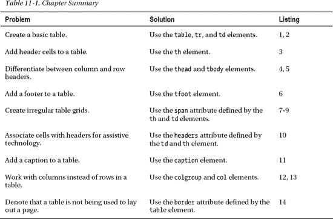

### 创建基本表格

每个表必须包含三个元素:`table`、`tr`和`td`。还有其他的元素——我将在本章的后面解释它们——但是这是你必须开始的三个元素。第一个是`table`，它是 HTML 中表格内容支持的核心，表示 HTML 文档中的一个表格。[表 11-2](#tab_11_2) 总结了`table`元素。

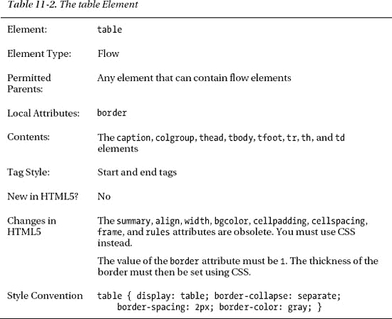

下一个核心`table`元素是`tr`，它表示一个表格行。HTML 表格是面向行的，而不是面向列的，你必须分别表示每一行。[表 11-3](#tab_11_3) 总结了`tr`要素。

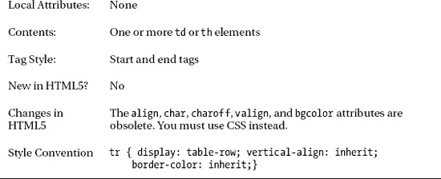

我们的三个核心元素中的最后一个是`td`，它表示一个表格单元格。[表 11-4](#tab_11_4) 总结了`td`要素。

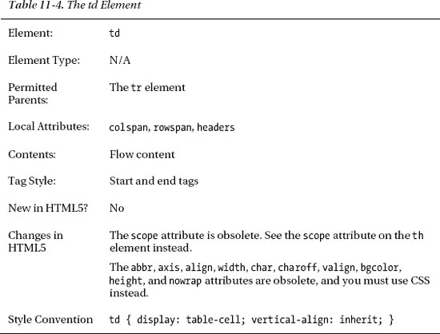

定义了这三个元素后，您可以将它们组合起来创建表格，如清单 11-1 所示。

*清单 11-1。使用 table、tr 和 td 元素创建一个表格*

`<!DOCTYPE HTML>
<html>
    <head>
        <title>Example</title>
        <meta name="author" content="Adam Freeman"/>
        <meta name="description" content="A simple example"/>
        <link rel="shortcut icon" href="favicon.ico" type="image/x-icon" />
    </head>
    <body>
        **<table>**
            **<tr>**
                **<td>Apples</td>**
                **<td>Green</td>**
                **<td>Medium</td>**
            **</tr>**
            **<tr>**
                **<td>Oranges</td>**
                **<td>Orange</td>**
                **<td>Large</td>**
            **</tr>**
        **</table>**
    </body>
</html>`

在这个例子中，我定义了一个有两行的`table`元素(由两个`tr`元素表示)。每行有三列，每列由一个`td`元素表示。`td`元素可以包含任何流内容，但是在这个例子中我坚持使用简单的文本。您可以在[图 11-1](#fig_11_1) 中看到默认样式惯例是如何应用于显示表格的。

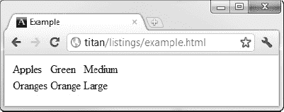

*图 11-1。显示一个简单的表格*

这是一个非常简单的表格，但是你可以看到它的基本结构。浏览器负责调整行和列的大小以维护表格。例如，看看当我添加一些更长的内容时会发生什么，如清单 11-2 中的[所示。](#list_11_2)

*清单 11-2。添加一些更长的单元格内容*

`<!DOCTYPE HTML>
<html>
    <head>
        <title>Example</title>
        <meta name="author" content="Adam Freeman"/>
        <meta name="description" content="A simple example"/>
        <link rel="shortcut icon" href="favicon.ico" type="image/x-icon" />
    </head>
    <body>
        <table>
            <tr>
                <td>Apples</td>
                <td>Green</td>
                <td>Medium</td>
            </tr>
            <tr>
                <td>Oranges</td>
                <td>Orange</td>
                <td>Large</td>
            </tr>
            **<tr>**
                **<td>Pomegranate</td>**
                **<td>A kind of greeny-red</td>**
                **<td>Varies from medium to large</td>**
            **</tr>**
        </table>
    </body>
</html>`

每个新添加的`td`元素的内容都比前两行长。你可以在[图 11-2](#fig_11_2) 中看到浏览器如何调整其他单元格的大小，使它们大小相同。

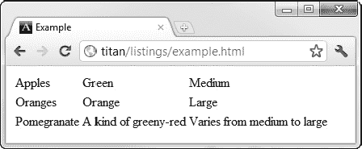

*图 11-2。调整单元格大小以容纳更长的内容*

`table`元素最好的特性之一是你不必担心大小的问题。浏览器确保最长的内容有足够的列宽，最高的单元格有足够的行高。

### 添加表头单元格

`th`元素表示一个标题单元格，允许我们区分数据和数据的描述。[表 11-5](#tab_11_5) 总结了`th`要素。

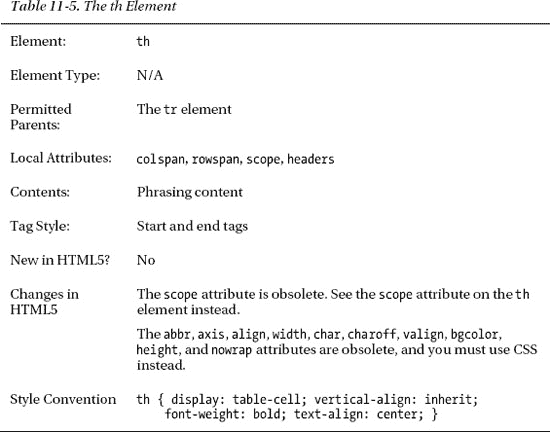

您可以看到我是如何将`th`元素添加到[清单 11-3](#list_11_3) 的表格中，以便为包含在`td`元素中的数据值提供一些上下文。

*清单 11-3。向表格添加标题单元格*

`<!DOCTYPE HTML>
<html>
    <head>
        <title>Example</title>
        <meta name="author" content="Adam Freeman"/>
        <meta name="description" content="A simple example"/>
        <link rel="shortcut icon" href="favicon.ico" type="image/x-icon" />
    </head>
    <body>
        <table>
            **<tr>**
                **<th>Rank</th><th>Name</th>**
                **<th>Color</th><th>Size</th>**
            **</tr>**
            <tr>
                **<th>Favorite:</th>**
                <td>Apples</td><td>Green</td><td>Medium</td>
            </tr>
            <tr>
                **<th>2nd Favorite:</th>**
                <td>Oranges</td><td>Orange</td><td>Large</td>
            </tr>
            <tr>
                **<th>3rd Favorite:</th>**
                <td>Pomegranate</td><td>A kind of greeny-red</td>
                <td>Varies from medium to large</td>
            </tr>
        </table>
    </body>
</html>`

您可以看到，我能够将`th`和`td`元素混合在一行中，并创建一个仅包含`th`元素的行。你可以在[图 11-3](#fig_11_3) 中看到浏览器是如何渲染这些的。

*图 11-3。向表格添加标题单元格*

### 向表格添加结构

你有一个基本的表，但你设法给自己制造了一个问题。当您设计表格样式时，您会发现很难区分`th`元素是在它们自己的行上，还是与数据混合在一起。这不是不可能的，只是需要密切关注..清单 11-4 展示了你如何做到这一点。

*清单 11-4。区分表格中的元素*

`<!DOCTYPE HTML>
<html>
    <head>
        <title>Example</title>
        <meta name="author" content="Adam Freeman"/>
        <meta name="description" content="A simple example"/>
        <link rel="shortcut icon" href="favicon.ico" type="image/x-icon" />
        ****
    </head>
    <body>
        <table>
            <tr>
                <th>Rank</th><th>Name</th><th>Color</th><th>Size</th>
            </tr>
            <tr>
                <th>Favorite:</th><td>Apples</td><td>Green</td><td>Medium</td>
            </tr>
            <tr>
                <th>2nd Favorite:</th><td>Oranges</td><td>Orange</td><td>Large</td>
            </tr>
            <tr>
                <th>3rd Favorite:</th><td>Pomegranate</td><td>A kind of greeny-red</td>
                <td>Varies from medium to large</td>
            </tr>
        </table>
    </body>
</html>`

在这个例子中，我创建了一个匹配所有`th`元素的选择器和一个仅匹配那些`th`元素的样式，这些元素是`tr`元素中该类型的唯一子元素。你可以在[图 11-4](#fig_11_4) 中看到样式的效果。

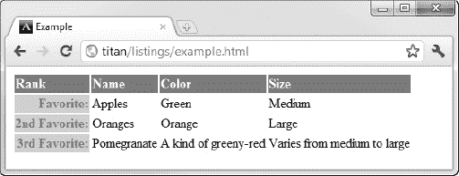

*图 11-4。添加匹配表格中第行的样式*

这是一个非常可行的方法，但是缺乏灵活性。如果我向表的行添加额外的`th`元素，我的第二个选择器将不再工作。我真的不想每次换表的时候都要调整选择器。

为了灵活地解决这个问题，您可以使用`thead`、`tbody`和`tfoot`元素。这些元素允许您向表中添加结构，这种结构的主要好处是它使处理表的不同部分变得更简单，尤其是在使用 CSS 选择器时。

#### 表示标题和表体

`tbody`元素表示构成表格主体的一组行——与标题行和脚注行相反，标题行和脚注行用`thead`和`tfoot`元素表示，我们很快就会看到。[表 11-6](#tab_11_6) 总结了`tbody`要素。

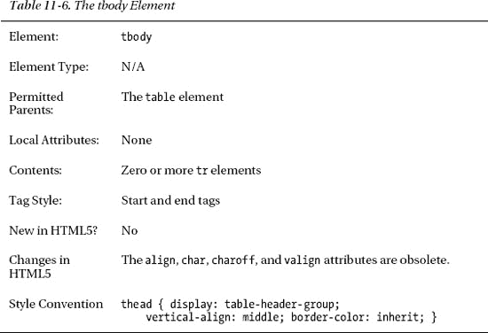

顺便说一下，大多数浏览器在处理`table`元素时会自动插入`tbody`元素，即使它没有在文档中指定。这意味着假设表格布局与编写的一样的 CSS 选择器可能会失败。例如，`table > tr`这样的选择器无法工作，因为浏览器在`table`和`tr`元素之间插入了一个`tbody`元素。为了解决这个问题，你必须使用一个选择器，比如`table > tbody > tr`、`table tr`(没有`>`字符)，甚至仅仅是`tbody > tr`。

`thead`元素定义了一行或多行，它们是`table`元素的列标签。[表 11-7](#tab_11_7) 总结了`thead`元素。

T2】

如果没有`thead`元素，所有的`tr`元素都被认为属于表格的*主体*。[清单 11-5](#list_11_5) 显示了示例表中添加的`thead`和`tbody`元素，以及您可以使用的更加灵活的 CSS 选择器。

*清单 11-5。将 ad 和 tbody 元素添加到表中*

`<!DOCTYPE HTML>
<html>
    <head>
        <title>Example</title>
        <meta name="author" content="Adam Freeman"/>
        <meta name="description" content="A simple example"/>
        <link rel="shortcut icon" href="favicon.ico" type="image/x-icon" />
        
    </head>
    <body>
        <table>
            **<thead>**
                <tr>
                    <th>Rank</th><th>Name</th><th>Color</th><th>Size</th>
                </tr>
            **</thead>**
            **<tbody>**
                <tr>
                    <th>Favorite:</th><td>Apples</td><td>Green</td><td>Medium</td>
                </tr>
                <tr>
                    <th>2nd Favorite:</th><td>Oranges</td><td>Orange</td><td>Large</td>
                </tr>
                <tr>
                    <th>3rd Favorite:</th><td>Pomegranate</td>
                    <td>A kind of greeny-red</td><td>Varies from medium to large</td>
                </tr>
            **</tbody>**
        </table>
    </body>
</html>`

这看起来没什么大不了的，但是您添加到表格中的结构使得处理不同种类的单元格更加容易，并且在您修改表格的设计时不太可能失败。

#### 添加页脚

`tfoot`元素表示构成表格页脚的行块。[表 11-8](#tab_11_8) 总结了`tfoot`要素。

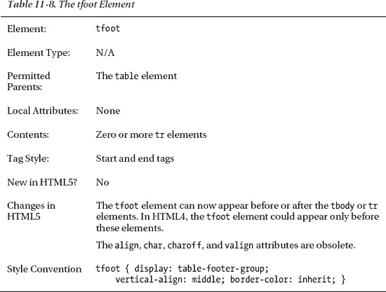

清单 11-6 展示了如何使用`tfoot`元素为`table`元素创建一个页脚。在 HTML5 之前，`tfoot`元素必须出现在`tbody`元素之前(如果省略了`tbody`，则出现在第一个`tr`元素之前)。在 HTML5 中，您可以将`tfooter`元素放在`tbody`或最后一个`tr`元素之后，这与浏览器显示`table`的方式更加一致。在[清单 11-6](#list_11_6) 中，我在第一个位置显示了`tfoot`元素——两者都是可以接受的。我的感觉是，当使用模板以编程方式生成 HTML 时，above-the- `tbody`方法通常更有帮助，而在手动编写 HTML 时，below-the- `tbody`方法感觉更自然。

*清单 11-6。使用 tfoot 元素*

`<!DOCTYPE HTML>
<html>
    <head>
        <title>Example</title>
        <meta name="author" content="Adam Freeman"/>
        <meta name="description" content="A simple example"/>
        <link rel="shortcut icon" href="favicon.ico" type="image/x-icon" />
        
    </head>
    <body>
        <table>
            <thead>
                <tr>
                    <th>Rank</th><th>Name</th><th>Color</th><th>Size</th>
                </tr>
            </thead>
            **<tfoot>**
                **<tr>**
                    **<th>Rank</th><th>Name</th><th>Color</th><th>Size</th>**
                **</tr>**
            </tfoot>
            <tbody>
                <tr>
                    <th>Favorite:</th><td>Apples</td><td>Green</td><td>Medium</td>
                </tr>
                <tr>
                    <th>2nd Favorite:</th><td>Oranges</td><td>Orange</td><td>Large</td>
                </tr>
                <tr>
                    <th>3rd Favorite:</th><td>Pomegranate</td>
                    <td>A kind of greeny-red</td><td>Varies from medium to large</td>
                </tr>
            </tbody>
        </table>
    </body>
</html>`

我将页眉中的一组行复制到页脚中。在这一章的后面，我们会回来让页脚变得更有趣。我还为其中一个样式添加了第二个选择器，这样`thead`和`tfoot`元素中的`th`和元素的样式也是相同的。您可以看到增加了如图[图 11-5](#fig_11_5) 所示的页脚。

*图 11-5。向表格添加页脚*

### 创建不规则表格

大多数表格都是简单的网格，每个单元格在网格中占据一个位置。但是，为了表示更复杂的数据，有时需要创建不规则的表格，其中单元格分布在多行和多列中。您可以使用`td`和`th`元素的`colspan`和`rowspan`属性创建这样的表。[清单 11-7](#list_11_7) 展示了如何使用这些属性来创建一个不规则的表格。

*清单 11-7。创建不规则表格*

`<!DOCTYPE HTML>
<html>
    <head>
        <title>Example</title>
        <meta name="author" content="Adam Freeman"/>
        <meta name="description" content="A simple example"/>
        <link rel="shortcut icon" href="favicon.ico" type="image/x-icon" />
        
    </head>
    <body>
        <table>
            <thead>
                <tr>
                    <th>Rank</th><th>Name</th><th>Color</th>
                    <th **colspan="2"**>Size & Votes</th>
                </tr>
            </thead>
            <tbody>
                <tr>
                    <th>Favorite:</th><td>Apples</td><td>Green</td>
                    <td>Medium</td><td>500</td>
                </tr>
                <tr>
                    <th>2nd Favorite:</th><td>Oranges</td><td>Orange</td>
                    <td>Large</td><td>450</td>
                </tr>
                <tr>
                    <th>3rd Favorite:</th><td>Pomegranate</td>
                    <td **colspan="2" rowspan="2"**>
                        Pomegranates and cherries can both come in a range of colors
                        and sizes.
                    </td>
                    <td>203</td>
                </tr>
                <tr>
                    <th **rowspan="2"**>Joint 4th:</th>
                    <td>Cherries</td>
                    <td rowspan="2">75</td>
                </tr>
                <tr>
                    <td>Pineapple</td>
                    <td>Brown</td>
                    <td>Very Large</td>
                </tr>
            </tbody>
            <tfoot>
                <tr>
                    <th **colspan="5"**>© 2011 Adam Freeman Fruit Data Enterprises</th>
                </tr>        
            </tfoot>
        </table>
    </body>
</html>`

如果希望一个单元格跨越多行，可以使用`rowspan`属性。分配给该属性的值是要跨越的行数。类似地，如果希望一个单元格跨越多列，可以使用`colspan`属性。

 **提示**赋给`rowspan`和`colspan`的值必须是整数。有些浏览器会将值 100%理解为表中的所有行或列，但这不是 HTML5 标准的一部分，也没有得到一致的实现。

我在示例文档中添加了一些额外的样式来突出显示跨越多行或多列的单元格，如图 11-6 所示。受影响的单元格以粗边框显示。

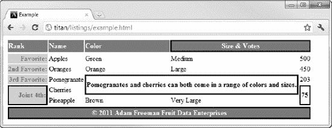

*图 11-6。跨越多行多列*

您将`colspan`和`rowspan`属性应用于您想要覆盖的网格部分的最上面和最左边的单元格。您忽略了通常会包含的`td`或`tr`元素。作为一个例子，考虑在[清单 11-8](#list_11_8) 中显示的简单表格。

*清单 11-8。一张简单的桌子*

`<!DOCTYPE HTML>
<html>
    <head>
        <title>Example</title>
        <meta name="author" content="Adam Freeman"/>
        <meta name="description" content="A simple example"/>
        <link rel="shortcut icon" href="favicon.ico" type="image/x-icon" />
        
    </head>
    <body>
        <table>
            <tr>
                <td>1</td>
                <td>2</td>
                <td>3</td>
            </tr>
            <tr>
                <td>4</td>
                <td>5</td>
                <td>6</td>
            </tr>
            <tr>
                <td>7</td>
                <td>8</td>
                <td>9</td>
            </tr>
        </table>
    </body>
</html>`

本例中的表格是一个 3x3 的规则网格，如图[图 11-7](#fig_11_7) 所示。

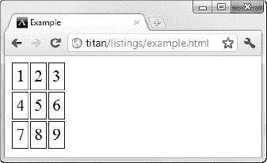

*图 11-7。一个规则的网格*

如果希望中间一列中的一个单元格跨越所有三行，可以将`rowspan`属性应用于单元格 2，它是您想要覆盖的网格区域的最上面(也是最左边，但在本例中这无关紧要)的单元格。您还必须删除扩展单元格将覆盖的单元格元素，在本例中是单元格 5 和 8。您可以在清单 11-9 中看到这些变化。

*清单 11-9。扩展单元格以覆盖多行*

`<!DOCTYPE HTML>
<html>
    <head>
        <title>Example</title>
        <meta name="author" content="Adam Freeman"/>
        <meta name="description" content="A simple example"/>
        <link rel="shortcut icon" href="favicon.ico" type="image/x-icon" />
        
    </head>
    <body>
        <table>
            <tr>
                <td>1</td>
                **<td rowspan="3">2</td>**
                <td>3</td>
            </tr>
            <tr>
                <td>4</td>
                <td>6</td>
            </tr>
            <tr>
                <td>7</td>
                <td>9</td>
            </tr>
        </table>
    </body>
</html>`

你可以在[图 11-8](#fig_11_8) 中看到这些变化的结果。

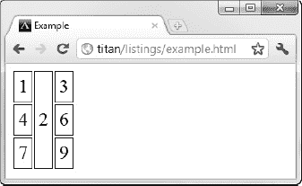

*图 11-8。扩展单元格以覆盖三行*

浏览器负责确定您定义的其他单元格应该如何适应扩展的单元格。

 **注意**注意不要让两个单元格扩展到同一个区域而产生重叠的单元格。table 元素的目的是表示表格数据。使用重叠单元格的唯一原因是让表格元素布局其他元素，这应该使用 CSS 表格功能来完成(在第 21 章的[中描述)。](21.html#ch21)

### 将表头与单元格关联

`td`和`th`元素定义了`headers`属性，该属性可用于使表格更容易被屏幕阅读器和其他辅助技术处理。`headers`属性的值是一个或多个`th`单元格的 ID 属性值。清单 11-10 显示了如何使用这个属性。

*清单 11-10。使用标题属性*

`<!DOCTYPE HTML>
<html>
    <head>
        <title>Example</title>
        <meta name="author" content="Adam Freeman"/>
        <meta name="description" content="A simple example"/>
        <link rel="shortcut icon" href="favicon.ico" type="image/x-icon" />
        
    </head>
    <body>
        <table>
            <thead>
                <tr>
                    <th id="rank">Rank</th>
                    <th id="name">Name</th>
                    <th id="color">Color</th>
                    <th id="sizeAndVotes" colspan="2">Size & Votes</th>
                </tr>
            </thead>
            <tbody>
                <tr>
                    <th id="first" headers="rank">Favorite:</th>
                    <td headers="name first">Apples</td>
                    <td headers="color first">Green</td>
                    <td headers="sizeAndVote first">Medium</td>
                    <td headers="sizeAndVote first">500</td>
                </tr>
                <tr>
                    <th id="second" headers="rank">2nd Favorite:</th>
                    <td headers="name second">Oranges</td>
                    <td headers="color second">Orange</td>
                    <td headers="sizeAndVote second">Large</td>
                    <td headers="sizeAndVote second">450</td>
                </tr>
            </tbody>
            <tfoot>
                <tr>
                    <th colspan="5">© 2011 Adam Freeman Fruit Data Enterprises</th>
                </tr>        
            </tfoot>
        </table>
    </body>
</html>`

我给`thead`中的每个`th`元素和出现在`tbody`中的`th`元素添加了全局`id`属性。对于`tbody`中的每个`td`和`th`，我使用了`headers`属性将单元格与列标题关联起来。对于`td`元素，我还指定了行标题(出现在第一列的标题)。

### 给表格添加标题

`caption`元素允许您定义一个标题，并将其与一个`table`元素相关联。[表 11-9](#tab_11_9) 总结了`caption`元素。

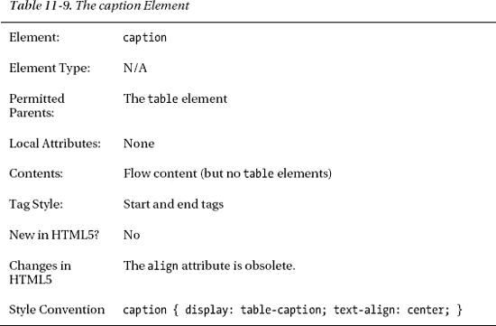

清单 11-11 展示了使用中的`caption`元素。

*清单 11-11。使用标题元素*

`<!DOCTYPE HTML>
<html>
    <head>
        <title>Example</title>
        <meta name="author" content="Adam Freeman"/>
        <meta name="description" content="A simple example"/>
        <link rel="shortcut icon" href="favicon.ico" type="image/x-icon" />
        
    </head>
    <body>
        <table>
**            <caption>Results of the 2011 Fruit Survey</caption>**
            <thead>
                <tr>
                    <th>Rank</th><th>Name</th><th>Color</th>
                    <th colspan="2">Size & Votes</th>
                </tr>
            </thead>
            <tbody>
                <tr>
                    <th>Favorite:</th><td>Apples</td><td>Green</td>
                    <td>Medium</td><td>500</td>
                </tr>
                <tr>
                    <th>2nd Favorite:</th><td>Oranges</td><td>Orange</td>
                    <td>Large</td><td>450</td>
                </tr>
                <tr>
                    <th>3rd Favorite:</th><td>Pomegranate</td>
                    <td colspan="2" rowspan="2">
                        Pomegranates and cherries can both come in a range of colors
                        and sizes.
                    </td>
                    <td>203</td>
                </tr>
                <tr>
                    <th rowspan="2">Joint 4th:</th>
                    <td>Cherries</td>
                    <td rowspan="2">75</td>
                </tr>
                <tr>
                    <td>Pineapple</td>
                    <td>Brown</td>
                    <td>Very Large</td>
                </tr>
            </tbody>
            <tfoot>
                <tr>
                    <th colspan="5">© 2011 Adam Freeman Fruit Data Enterprises</th>
                </tr>        
            </tfoot>
        </table>
    </body>
</html>`

一个表格只能包含一个`caption`元素，但它不必是表格中包含的第一个元素。但是，它将始终显示在表的上方，而不管元素是在哪里定义的。你可以在[图 11-9](#fig_11_9) 中看到标题的效果(以及我应用的样式)。

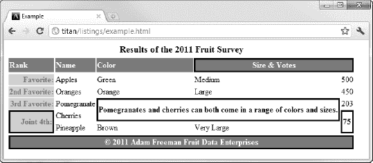

*图 11-9。给表格添加标题*

### 使用列

HTML 处理表格的方式是面向行的。您将单元格的定义放在`tr`元素中，并逐行构建表格。这使得对列应用样式变得很困难，尤其是在处理包含不规则单元格的表格时。这个问题的解决方案是使用`colgroup`和`col`元素。

`colgroup`元素表示一组列。[表 11-10](#tab_11_10) 总结了`colgroup`要素。

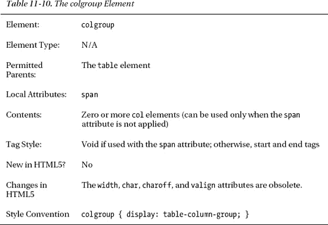

[清单 11-12](#list_11_12) 展示了`colgroup`元素的使用。

*清单 11-12。使用 colgroup 元素*

`<!DOCTYPE HTML>
<html>
    <head>
        <title>Example</title>
        <meta name="author" content="Adam Freeman"/>
        <meta name="description" content="A simple example"/>
        <link rel="shortcut icon" href="favicon.ico" type="image/x-icon" />
        
    </head>
    <body>
        <table>
            <caption>Results of the 2011 Fruit Survey</caption>
            **<colgroup id="colgroup1" span="3"/>**
            **<colgroup id="colgroup2" span="2"/>**
            <thead>
                <tr>
                    <th>Rank</th><th>Name</th><th>Color</th>
                    <th colspan="2">Size & Votes</th>
                </tr>
            </thead>
            <tbody>
                <tr>
                    <th>Favorite:</th><td>Apples</td><td>Green</td>
                    <td>Medium</td><td>500</td>
                </tr>
                <tr>
                    <th>2nd Favorite:</th><td>Oranges</td><td>Orange</td>
                    <td>Large</td><td>450</td>
                </tr>
                <tr>
                    <th>3rd Favorite:</th><td>Pomegranate</td>
                    <td colspan="2" rowspan="2">
                        Pomegranates and cherries can both come in a range of colors
                        and sizes.
                    </td>
                    <td>203</td>
                </tr>
                <tr>
                    <th rowspan="2">Joint 4th:</th>
                    <td>Cherries</td>
                    <td rowspan="2">75</td>
                </tr>
                <tr>
                    <td>Pineapple</td>
                    <td>Brown</td>
                    <td>Very Large</td>
                </tr>
            </tbody>
            <tfoot>
                <tr>
                    <th colspan="5">© 2011 Adam Freeman Fruit Data Enterprises</th>
                </tr>        
            </tfoot>
        </table>
    </body>
</html>`

在这个例子中，我定义了两个`colgroup`元素。属性指定了`colgroup`元素应用于多少列。清单中的第一个`colgroup`应用于表中的前三列，另一个元素应用于接下来的两列。我将全局的`id`属性应用于每个`colgroup`元素，并定义了使用`id`值作为选择器的 CSS 样式。在[图 11-10](#fig_11_10) 中可以看到效果。

*图 11-10。使用 colgroup 元素*

该图展示了使用`colgroup`元素的一些重要方面。首先要知道的是，应用于`colgroups`的 CSS 样式比直接应用于`tr`、`td`和`th`元素的样式具有更低的特异性。您可以看到，应用于`thead`、`tfoot`和第一列`th`元素的样式不受匹配`colgroups`的样式的影响。如果我移除除了那些针对`colgroup`元素的样式之外的所有样式，所有的单元格都会被修改，如图 11-11 所示。

*图 11-11。移除所有的样式，除了那些直接指向 colspan 元素的样式*

要注意的第二点是，不规则单元格被算作它们开始所在的列的一部分。您可以在第三行看到这一点，第一个样式匹配的单元格扩展到另一个`colgroup`元素覆盖的区域。

需要注意的最后一点是，`colgroup`元素包括一列中的所有单元格，甚至包括那些在`thead`和`tfoot`元素中的单元格，并且它匹配`th`和`td`元素。`colgroup`元素很特殊，因为它与元素中不包含的元素相关。这意味着您不能使用`colgroup`元素作为更多焦点选择器的基础(例如，像`#colgroup1 > td`这样的选择器不匹配任何元素)。

#### 调出单个列

您可以使用`col`元素来代替`colgroup`元素的`span`属性。这允许您定义一个组和其中存在的不同列。[表 11-11](#tab_11_11) 总结了`col`要素。

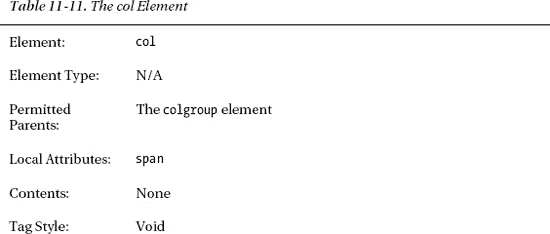

使用`col`元素的好处是更好的控制。您可以将样式应用于多组列以及该组中的单个列。`col`元素放在`colgroup`元素里面，如[清单 11-13](#list_11_13) 所示，`col`的每个实例代表组中的一列。

*清单 11-13。使用 col 元素*

`<!DOCTYPE HTML>
<html>
    <head>
        <title>Example</title>
        <meta name="author" content="Adam Freeman"/>
        <meta name="description" content="A simple example"/>
        <link rel="shortcut icon" href="favicon.ico" type="image/x-icon" />
        
    </head>
    <body>
        <table>
            <caption>Results of the 2011 Fruit Survey</caption>
            **<colgroup id="colgroup1">**
                **<col id="col1And2" span="2"/>**
                **<col id="col3"/>**
            **</colgroup>**
            <colgroup id="colgroup2" span="2"/>
            <thead>
                <tr>
                    <th>Rank</th><th>Name</th><th>Color</th>
                    <th colspan="2">Size & Votes</th>
                </tr>
            </thead>
            <tbody>
                <tr>
                    <th>Favorite:</th><td>Apples</td><td>Green</td>
                    <td>Medium</td><td>500</td>
                </tr>
                <tr>
                    <th>2nd Favorite:</th><td>Oranges</td><td>Orange</td>
                    <td>Large</td><td>450</td>
                </tr>
                <tr>
                    <th>3rd Favorite:</th><td>Pomegranate</td>
                    <td colspan="2" rowspan="2">
                        Pomegranates and cherries can both come in a range of colors
                        and sizes.
                    </td>
                    <td>203</td>
                </tr>
                <tr>
                    <th rowspan="2">Joint 4th:</th>
                    <td>Cherries</td>
                    <td rowspan="2">75</td>
                </tr>
                <tr>
                    <td>Pineapple</td>
                    <td>Brown</td>
                    <td>Very Large</td>
                </tr>
            </tbody>
            <tfoot>
                <tr>
                    <th colspan="5">© 2011 Adam Freeman Fruit Data Enterprises</th>
                </tr>        
            </tfoot>
        </table>
    </body>
</html>`

您可以使用`span`属性创建一个表示`colgroup`中两列的`col`元素。如果不使用`span`属性，`col`元素表示一个单独的列。在这个例子中，我对`colgroup`和它包含的一个`col`元素应用了一个样式。在[图 11-12](#fig_11_12) 中可以看到效果。

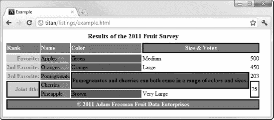

*图 11-12。使用 colgroup 和 col 元素对表格应用样式*

### 对表格元素应用边框

元素定义了属性。当您应用这个属性时，它告诉浏览器您正在使用`table`来表示表格数据，而不是布局其他元素。大多数浏览器通过在`table`和每个单元格周围绘制边框来响应`border`属性。[清单 11-14](#list_11_14) 显示了`border`元素的应用。

*清单 11-14。使用边框属性*

`<!DOCTYPE HTML>
<html>
    <head>
        <title>Example</title>
        <meta name="author" content="Adam Freeman"/>
        <meta name="description" content="A simple example"/>
        <link rel="shortcut icon" href="favicon.ico" type="image/x-icon" />
    </head>
    <body>
        <table **border="1"**>
            <caption>Results of the 2011 Fruit Survey</caption>
            <colgroup id="colgroup1">
                <col id="col1And2" span="2"/>
                <col id="col3"/>
            </colgroup>
            <colgroup id="colgroup2" span="2"/>
            <thead>
                <tr>
                    <th>Rank</th><th>Name</th><th>Color</th>
                    <th colspan="2">Size & Votes</th>
                </tr>
            </thead>
            <tbody>
                <tr>
                    <th>Favorite:</th><td>Apples</td><td>Green</td>
                    <td>Medium</td><td>500</td>
                </tr>
                <tr>
                    <th>2nd Favorite:</th><td>Oranges</td><td>Orange</td>
                    <td>Large</td><td>450</td>
                </tr>
                <tr>
                    <th>3rd Favorite:</th><td>Pomegranate</td>
                    <td colspan="2" rowspan="2">
                        Pomegranates and cherries can both come in a range of colors
                        and sizes.
                    </td>
                    <td>203</td>
                </tr>
                <tr>
                    <th rowspan="2">Joint 4th:</th>
                    <td>Cherries</td>
                    <td rowspan="2">75</td>
                </tr>
                <tr>
                    <td>Pineapple</td>
                    <td>Brown</td>
                    <td>Very Large</td>
                </tr>
            </tbody>
            <tfoot>
                <tr>
                    <th colspan="5">© 2011 Adam Freeman Fruit Data Enterprises</th>
                </tr>        
            </tfoot>
        </table>
    </body>
</html>`

分配给`border`属性的值必须是`1`或空字符串(`""`)。该属性不控制边框的样式。你通过 CSS 做到这一点。你可以在[图 11-13](#fig_11_13) 中看到 Google Chrome 如何响应`border`属性的出现。(注意，我从这个例子中删除了`style`元素，以强调`border`属性的效果。)

*图 11-13。将边框属性应用到表格元素的效果*

浏览器应用的默认边框并不特别吸引人，所以除了`border`属性之外，通常还必须使用 CSS。

 **提示**你不必将`border`属性应用到表格中就能使用 CSS 定义边框。但是，如果您不应用`border`属性，浏览器可以随意假设您将表格用于布局目的，并且它可能会以一种意想不到的方式显示表格。当我写这篇文章时，主流浏览器并不太关注`border`属性(除了应用默认边框)，但这可能会在未来改变。

即使`border`属性使浏览器将边框应用于表格*和*的每个单元格，您仍然必须在 CSS 选择器中单独定位要替换的每种元素。在创建 CSS 选择器时，您并不缺少选择:您可以通过`table`元素定位表格的外部边框；带有`thead`、`tbody`和`tfoot`元素的页眉、正文和页脚；通过`colspan`和`col`元素的列；以及使用`th`和`td`元件的单个单元。而且，如果所有其他方法都失败了，您仍然可以使用`id`和`class`全局属性显式地创建目标。

### 总结

在这一章中，我带你参观了 HTML5 对表格的支持。HTML5 中最重要的变化是你不能再使用表格来处理页面布局——为此你必须依赖 CSS 表格支持，我在第 21 章中对此进行了描述。除了这一限制之外，表格具有无限的灵活性，易于设计，并且使用起来很愉快。