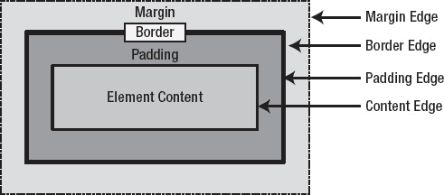
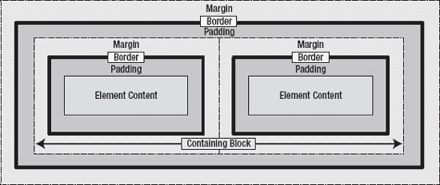
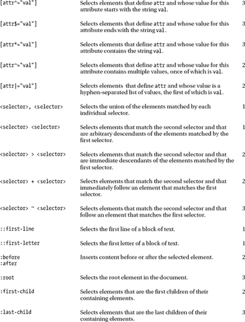
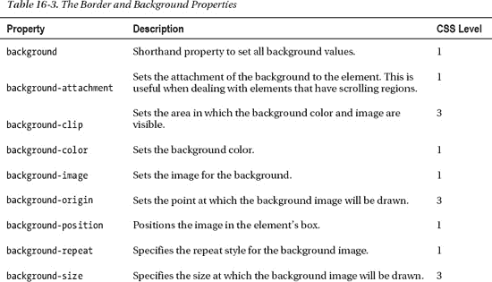
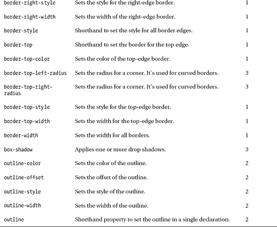
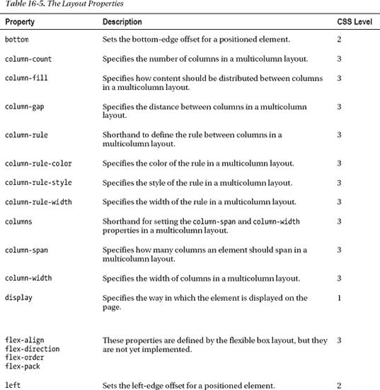
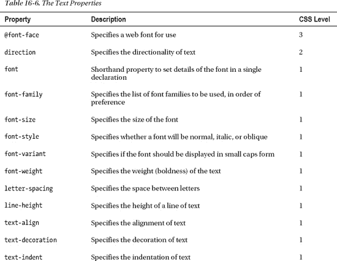
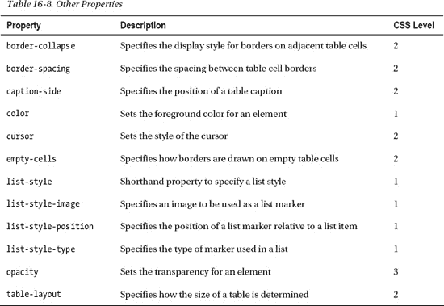

# 十六、上下文中的 CSS

在接下来的章节中，我将描述 CSS 定义的属性，更恰当的说法是*级联样式表*。[第 4 章](04.html#ch4)提供了 CSS 基础知识的快速复习，在我们开始深入细节之前，这一章提供了一些额外的背景知识。

### 了解 CSS 标准化

CSS 有过艰难的过去。在浏览器被视为分割市场的工具的时期，浏览器制造商将 CSS 作为一种关键工具来创建他们软件独有的功能。这是一个混乱——相同名称的属性以不同的方式处理，特定于浏览器的属性被用来访问特定于浏览器的功能。这个想法是为了迫使网络开发者让他们的网站或应用只在一个浏览器上运行。

好消息是，浏览器大多在速度、易用性以及越来越符合 CSS 等标准方面与众不同。坏消息是 CSS 的标准化过程并不理想。

正如你将在接下来的章节中看到的，CSS 中有很多功能。W3C(CSS 和 HTML 的标准团体)没有试图创建一个单一的标准，而是决定将 cs3s 分解成*个模块*，并让每个模块遵循自己的时间表。这是一个很好的想法——它肯定胜过了单一的方法——但是这意味着没有一个符合 CSS3 的整体标准。相反，您必须依次考虑每个模块，并决定它是否有足够广泛的支持。

更复杂的是，只有极少数的 CSS3 模块已经完成了标准化过程。一些模块，尤其是那些向 CSS 引入新功能领域的模块，仍处于开发过程的早期阶段，可能会发生变化。可以添加、更改或删除属性。模块可能被合并或删除；模块之间的关系可能会改变(因为模块通常依赖于其他模块中定义的属性或单元)。这意味着你可能会发现，自从我写这本书以来，一些新的属性已经发生了变化。

在接下来的章节中，我包含了一些来自模块的属性，这些属性看起来很稳定，并且有望被主流浏览器很快实现。在大多数情况下，这些功能是稳定的，可以在最近的浏览器版本中依赖。为了帮助您决定使用一个属性是否适合您的项目，我在本章后面的“属性快速参考”一节中包含了 CSS 版本，每个属性都添加到该版本中。

在模块定义的更不稳定的阶段，浏览器将使用特定于浏览器的前缀来实现一个特性。这不像过去那样糟糕——这些是试验性的实现，允许早期采用者测试浏览器对一组特定属性的实现。我通常避免使用这样的属性，但是 CSS3 的一些特性非常重要，所以我在例子中使用了前缀。在所有情况下，特定于浏览器的实现都非常接近规范。每个浏览器都有不同的前缀。你可以在[表 16-1](#tab_16_1) 中看到最流行的浏览器的前缀。

### 了解盒子模型

CSS 中的一个基本概念是*盒子模型*。如果一个元素是可见的，它将占据页面的一个矩形区域。这被称为元素的*盒*。该盒由四部分组成，如图[图 16-1](#fig_16_1) 所示。

*图 16-1。CSS 盒子模型*

其中两个部分是可见的:内容和边框。填充是内容和边框之间的间距，边距是边框和页面上其他元素之间的间距。理解这四个部分之间的关系对于充分利用 CSS 是至关重要的。在接下来的章节中，我将向您介绍 CSS 属性，这些属性允许您控制边距、填充和边框，并控制内容的整体外观。

一个元素可以包含其他元素。在这种情况下，父元素的上下文框被称为子元素的*容器块*(或者有时只是*容器*)。这种关系如图[图 16-2](#fig_16_2) 所示。

*图 16-2。父元素和子元素之间的盒子模型关系*

您可以使用包含块的特征来确定元素的外观。这不仅适用于级联和继承的属性，也适用于显式定义的属性，正如你在第 21 章中看到的元素布局。

### 选择器快速参考

我在第 17 章和第 18 章中深入描述了 CSS 选择器。为了快速参考，[表 16-2](#tab_16_2) 总结了选择器，并显示了它们是在哪个版本的 CSS 中添加的。

### 属性快速参考

在[第 19 章](19.html#ch19)–[第 24 章](24.html#ch24)中，我描述了 CSS 属性。为了快速参考，以下部分总结了这些属性以及它们所添加到的 CSS 版本。

#### 边框和背景属性

表 16-3 总结了可用于元素应用边框和背景的属性。这些属性在[第 19 章](19.html#ch19)中有完整描述。

#### 盒子模型属性

表 16-4 总结了可用于配置元素盒的属性。这些属性在[第 20 章](20.html#ch20)中有完整描述。

#### 布局属性

表 16-5 总结了可用于创建元素布局的属性。这些属性在[第 21 章](21.html#ch21)中有完整描述。

#### 文本属性

[表 16-6](#tab_16_6) 总结了可用于文本样式的属性。这些属性在[第 22 章](22.html#ch22)中有完整描述。

#### 过渡、动画和变换属性

表 16-7 总结了可以用来改变元素外观的属性，通常是在一段时间后。这些属性在[第 23 章](23.html#ch23)中有完整描述。

#### 其他属性

表 16-8 总结了不适合其他章节的特性。这些属性在[第 24 章](24.html#ch24)中有完整描述。

### 总结

在这一章中，我为后面的章节提供了一些背景，在这些章节中我描述了 CSS 属性。我还提供了快速参考表，当你在一个真实的项目中使用 CSS 时，它会让你找到你想要的属性。当考虑在项目中使用 CSS 功能时，考虑定义属性的 CSS 版本是很重要的。正如我在本章开始时解释的那样，一些 CSS3 模块仍然不稳定，而另一些则没有像我们希望的那样广泛实现。