## 17

## 使用 CSS 选择器—第一部分

在第四章的[中，我解释了当使用`style`元素或外部样式表时，使用 CSS 选择器来识别想要应用样式的元素。在本章和下一章中，我将描述和演示核心 CSS3 选择器。您将看到做出选择是多么容易，以及如何定制这些选择以满足广泛或非常具体的条件。](04.html#ch4)

随着时间的推移，这些选择器在不同版本的 CSS 中被引入。主流浏览器对所有的选择器都有相当好的支持，但是您可能会发现在不太流行的浏览器中覆盖范围有点不完整。为了帮助您找出可以依赖的内容，我指出了每个选择器是在哪个 CSS 版本中引入的。表 17-1 对本章进行了总结。

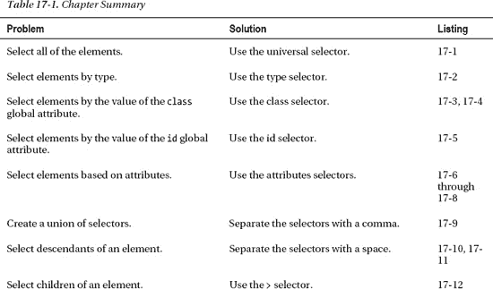

### 使用基本的 CSS 选择器

有一组非常简单易用的选择器。把它们想象成基本的选择器。您可以使用这些选择器在文档中进行大范围的选择，或者在组合在一起时作为更小范围匹配的基础(这种技术我将在本章后面介绍)。在下面的每一节中，我将向您展示如何使用一个基本的选择器。

#### 选择所有元素

*通用选择器*匹配文档中的每个元素。这是 CSS 选择器中最基本的，但是很少使用，因为它匹配的范围太广了。[表 17-2](#tab_17_2) 总结了选择器。

清单 17-1 展示了一个使用通用选择器的样式的例子。

*清单 17-1。使用通用选择器*

`<!DOCTYPE HTML>
<html>
    <head>
        <title>Example</title>
        ` `    </head>
    <body>
        <a href="http://apress.com">Visit the Apress website</a>
        
I like apples and oranges.

        <a href="http://w3c.org">Visit the W3C website</a>
    </body>
</html>`

我在清单 17-1 中定义的样式在选中的元素周围放了一个细黑盒子。这是我在本章中用来演示选择器匹配方式的样式之一。你可以在[图 17-1](#fig_17_1) 中看到这个选择器的效果。

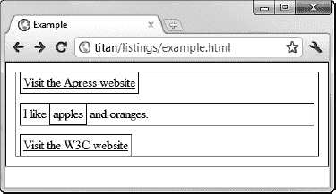

*图 17-1。使用通用 CSS 选择器*

如果这个图看起来有点奇怪，那是因为通用选择器确实匹配文档中的每个元素的*，包括`html`和`body`元素。这个选择器是一个有效的工具，但是有点残忍，你应该小心使用它。*

#### 按类型选择元素

您可以通过将元素类型指定为选择器来选择文档中元素的所有实例(例如，如果您想要选择所有的`a`元素，那么您可以使用`a`作为选择器)。[表 17-3](#tab_17_3) 总结了元素类型选择器。

清单 17-2 提供了一个例子。

*清单 17-2。使用元素类型选择器*

`<!DOCTYPE HTML>
<html>
    <head>
        <title>Example</title>
        
    </head>
    <body>
        <a href="http://apress.com">Visit the Apress website</a>
        
I like apples and oranges.

        <a href="http://w3c.org">Visit the W3C website</a>
    </body>
</html>`

你可以在[图 17-2](#fig_17_2) 中看到这个选择器的效果。

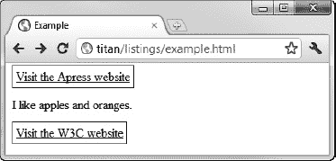

*图 17-2。按类型选择元素*

 **提示**您可以将一个样式应用于多个元素类型，方法是用逗号分隔这些类型。有关示例，请参见本章后面的“组合选择器”一节。

#### 按类别选择元素

类选择器允许我们选择已经使用类全局属性分配给特定类的元素。表 17-4 描述了这个选择器。我在第三章的[中描述了`class`属性。](03.html#ch3)

T2】

清单 17-3 展示了这个选择器。

*清单 17-3。按类别选择元素*

`<!DOCTYPE HTML>
<html>
    <head>
        <title>Example</title>
        
    </head>
    <body>
        <a **class="class1 class2"** href="http://apress.com">Visit the Apress website</a>
        
I like apples and oranges.

        <a href="http://w3c.org">Visit the W3C website</a>
    </body>
</html>`

在[清单 17-3](#list_17_3) 中，我使用了选择器`.class2`。这具有选择已经被分配给类`class2`的任何类型的所有元素的效果。

这个选择器有两种表达方式:有和没有通用选择器。选择器`*.class2`和`.class`是等价的。第一种形式更具描述性，但第二种形式是最常用的。这是 CSS 选择器中反复出现的模式。当您继续浏览可用的选择器时，您会发现每个选择器实际上都是一个过滤器，它缩小了选择器的范围，使其匹配更少的元素。您可以组合这些选择器来创建焦点匹配。在本章后面的“组合选择器”一节中，我将向你展示组合选择器的不同技术。

在[清单 17-3](#list_17_3) 中，有两个元素被分配给目标类:一个`a`元素和一个`span`元素。你可以在[图 17-3](#fig_17_3) 中看到这种风格的效果。

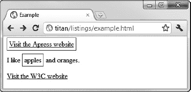

*图 17-3。使用类别选择器*

您可以更具体地将选择限制为已分配给某个类的单一类型的元素。你可以用元素类型替换通用选择器，如清单 17-4 所示。

*清单 17-4。为单个元素类型使用类选择器*

`<!DOCTYPE HTML>
<html>
    <head>
        <title>Example</title>
        
    </head>
    <body>
        <a class="class1 class2" href="http://apress.com">Visit the Apress website</a>
        
I like apples and oranges.

        <a href="http://w3c.org">Visit the W3C website</a>
    </body>
</html>`

在这种情况下，我缩小了选择器的范围，使其只匹配已经分配给`class2`的`span`元素。你可以在[图 17-4](#fig_17_4) 中看到缩小范围的效果。

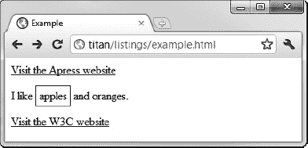

*图 17-4。缩小类选择器的范围*

 **提示**如果要选择多个类中的成员，可以指定用句点分隔的类名(如`span.class1.class2`)。这将只选择分配给`class1`和`class2`的元素。

#### 按 ID 选择元素

ID 选择器允许您通过全局`id`属性的值来选择元素，我在第 3 章的[中对此进行了描述。表 17-5](03.html#ch3) 总结了这个选择器。

正如我在[第 3 章](03.html#ch3)中解释的，元素的`id`属性的值在 HTML 文档中必须是唯一的。这意味着当您使用 ID 选择器时，您正在寻找单个元素。[清单 17-5](#list_17_5) 演示了`id`选择器的使用。

*列表 17-5。使用 id 选择器*

`<!DOCTYPE HTML>
<html>
    <head>
        <title>Example</title>` `**        **
    </head>
    <body>
        <a **id="apressanchor"** class="class1 class2" href="http://apress.com">
            Visit the Apress website
        </a>
        
I like apples and oranges.

        <a **id="w3canchor"** href="http://w3c.org">Visit the W3C website</a>
    </body>
</html>`

在这个例子中，我选择了具有`w3canchor`的`id`的元素。你可以在[图 17-5](#fig_17_5) 中看到它的效果。

*图 17-5。通过 ID 选择元素*

看起来，如果您将单个元素作为样式的目标，那么您可以通过使用元素的`style`属性来实现相同的效果。这是真的，但是当你把它和其他选择器结合起来的时候，这个选择器的真正价值才体现出来，这是我在本章后面演示的技术。

#### 按属性选择元素

属性选择器允许你根据属性的不同方面匹配属性，如[表 17-6](#tab_17_6) 所述。

通过使用通用选择器(`*`)，或者在更常见的形式中，通过省略通用选择器并将条件放在方括号内(`[`和`]`字符)，可以选择匹配属性满足条件的所有元素(或者给定类型的所有元素)。清单 17-6 展示了属性选择器的使用。

*清单 17-6。使用元素属性选择器*

`<!DOCTYPE HTML>
<html>
    <head>
        <title>Example</title>
        
    </head>
    <body>
        <a id="apressanchor" class="class1 class2" href="http://apress.com">
            Visit the Apress website
        </a>
        
I like apples and oranges.

        <a id="w3canchor" href="http://w3c.org">Visit the W3C website</a>
    </body>
</html>`

在[清单 17-6](#list_17_6) 中，我使用了最简单的属性选择器，它匹配任何具有`href`属性的元素，而不考虑属性的赋值。在示例 HTML 文档中，这意味着两个`a`元素都将被选中，如图[图 17-6](#fig_17_6) 所示。

*图 17-6。基于属性的存在选择元素*

您可以创建更复杂的条件来匹配属性，如[表 17-7](#tab_17_7) 所示。这些条件已经分两次添加到 CSS 中，所以我指出了每个条件在哪个版本的 CSS 中受支持。

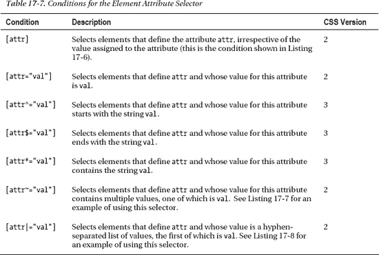

最后两个条件需要进一步解释。`~=`条件对于处理支持由空格字符分隔的多个值的属性很有用，比如 class global 属性。清单 17-7 给出了一个演示。

*清单 17-7。基于多个值之一进行选择*

`<!DOCTYPE HTML>
<html>
    <head>
        <title>Example</title>
**        **` `    </head>
    <body>
        <a id="apressanchor" **class="class1 class2"** href="http://apress.com">
            Visit the Apress website
        </a>
        
I like apples and oranges.

        <a id="w3canchor" href="http://w3c.org">Visit the W3C website</a>
    </body>
</html>`

在[清单 17-7](#list_17_7) 中，我使用了`class`全局属性，因为这是我迄今为止引入的唯一一个接受多个值的属性。您不需要使用属性选择器来匹配`class`值；类选择器自动处理多个类成员。

我在选择器中使用的条件是匹配定义了`class`属性并且该属性的值包含`class2`的元素。我已经突出显示了内容元素的类属性，你可以在[图 17-7](#fig_17_7) 中看到选择器的效果。

*图 17-7。基于多值属性进行选择*

当几条信息用一个属性值表示并用连字符分隔时,`|=`条件很有用。一个很好的例子是`lang`全局属性，它可以与包含区域子标记的语言说明符一起使用(例如，`en-us`是美国的英语口语，`en-gb`是英国的英语口语)。[清单 17-8](#list_17_8) 展示了如何选择所有的英文标签，而不必列举所有的地区差异(地区差异有很多)。

*清单 17-8。使用|=属性条件*

`<!DOCTYPE HTML>
<html>
    <head>
        <title>Example</title>
**        **
    </head>
    <body>` `        <a **lang="en-us"** id="apressanchor" class="class1 class2" href="http://apress.com">
            Visit the Apress website
        </a>
        
I like apples and oranges.

        <a **lang="en"** id="w3canchor" href="http://w3c.org">Visit the W3C website</a>
    </body>
</html>`

你可以在图 17-8 的[中看到这个选择器的效果。注意，选择器匹配第二个`a`元素，它没有区域子标记(即`lang`元素的值是`en`，而不是`en-us`或`en-gb`)，以及那些有子标记的元素。](#fig_17_8)

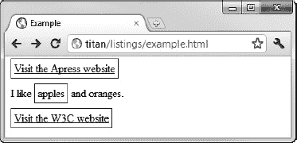

*图 17-8。基于语言属性选择元素*

### 组合选择器

通过创建选择器的组合，您可以更具体地选择元素。这些要么拓宽了应用样式的元素范围，要么起到了相反的作用:让你在选择时变得非常具体。在接下来的几节中，我将向您展示组合选择器的不同方式。

#### 创建选择器联合

创建一个逗号分隔的选择器列表意味着样式被应用到每个单独的选择器匹配的所有元素的并集。表 17-8 总结了选择器的联合。

清单 17-9 提供了一个创建选择器并集的例子。

*清单 17-9。创建选择器联合*

`<!DOCTYPE HTML>
<html>
    <head>
        <title>Example</title>
**        **
    </head>
    <body>
        <a id="apressanchor" class="class1 class2" href="http://apress.com">
            Visit the Apress website
        </a>
        
I like apples and oranges.

        <a id="w3canchor" href="http://w3c.org">Visit the W3C website</a>
    </body>
</html>`

在清单 17-9 的[中，我指定了一个类型选择器(`a`)和一个属性选择器(`[lang|="en"]`)，用逗号(`a, [lang|="en"]`)隔开。浏览器将依次评估每个选择器，并将样式应用于所选元素。您可以自由地混合和匹配不同类型的选择器，匹配的元素之间不需要任何通用性。你可以从图 17-9](#list_17_9) 中的[清单 17-9](#list_17_9) 中看到选择器的效果。

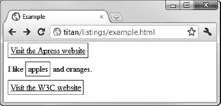

*图 17-9。创建选择器联合*

您可以根据需要组合任意数量的选择器，每个选择器之间用逗号分隔。

#### 选择后代元素

您可以使用*后代选择器*来选择包含在另一个元素中的元素。[表 17-9](#tab_17_9) 提供了一个总结。

T2】

应用第一个选择器，然后根据第二个选择器评估匹配元素的*后代*。后代选择器将匹配第一个选择器匹配的元素中包含的任何元素*，而不仅仅是直接子元素。[清单 17-10](#list_17_10) 提供了一个演示。*

*清单 17-10。选择后代*

`<!DOCTYPE HTML>
<html>
    <head>
        <title>Example</title>
**        **
    </head>
    <body>
        <a id="apressanchor" class="class1 class2" href="http://apress.com">
            Visit the Apress website
        </a>
        
I like apples and oranges.

        <a id="w3canchor" href="http://w3c.org">Visit the W3C website</a>
    </body>
</html>`

清单 17-10 中的选择器选择`p`元素的后代`span`元素。给定示例中的 HTML，我可以直接选择`span`元素来获得相同的结果，但是这种方法更加灵活，如下例所示。

*清单 17-11。更复杂的后代选择器示例*

`<!DOCTYPE HTML>
<html>
    <head>
        <title>Example</title>
**        **
    </head>
    <body>
        <table id="mytable">
            <tr><th>Name</th><th>City</th></tr>
            <tr><td>Adam Freeman</td><td>London</td></tr>
            <tr><td>Joe Smith</td><td>New York</td></tr>
            <tr><td>Anne Jones</td><td>Paris</td></tr>
        </table>

        
I like apples and oranges.

        <table id="othertable">
            <tr><th>Name</th><th>City</th></tr>
            <tr><td>Peter Pererson</td><td>Boston</td></tr>
            <tr><td>Chuck Fellows</td><td>Paris</td></tr>
            <tr><td>Jane Firth</td><td>Paris</td></tr>
        </table>
    </body>
</html>`

在[清单 17-11](#list_17_11) 中，我定义了两个简单的表格，每个表格都定义了`id`属性。使用 ID 选择器，我选择具有`mytable`的`id`值的表，然后选择它包含的`td`元素。在[图 17-10](#fig_17_10) 中可以看到效果。

*图 17-10。选择后代元素*

注意，在这个例子中我没有选择直系后代。我跳过了`tr`元素来选择`td`元素。

#### 选择子元素

与后代选择器相对应的是*子选择器*，它只匹配直接包含在匹配元素中的元素。[表 17-10](#tab_17_10) 总结了子选择器。

清单 17-12 展示了如何选择子元素。

*清单 17-12。选择子元素*

`<!DOCTYPE HTML>
<html>
    <head>
        <title>Example</title>
**        **
    </head>
    <body>
        <table id="mytable">
            <tr><th>Name</th><th>City</th></tr>
            <tr><td>Adam Freeman</td><td>London</td></tr>
            <tr><td>Joe Smith</td><td>New York</td></tr>
            <tr><td>Anne Jones</td><td>Paris</td></tr>
        </table>

        
I like apples and oranges.

        <table id="othertable">
            <tr><th>Name</th><th>City</th></tr>
            <tr><td>Peter Pererson</td><td>Boston</td></tr>
            <tr><td>Chuck Fellows</td><td>Paris</td></tr>
            <tr><td>Jane Firth</td><td>Paris</td></tr>
        </table>
    </body>
</html>`

在这个选择器中，我创建了一个子选择器的联合。在第一个例子中，我寻找作为*元素的子元素的`span`元素，以及作为`body`元素的子元素的*元素。在第二个例子中，我在寻找`tr`元素的子元素`th`元素。你可以在[图 17-11](#fig_17_11) 中看到哪些元素匹配。

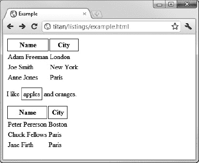

*图 17-11。选择子元素*

#### 选择同级元素

您可以使用*直接兄弟选择器*选择紧跟在其他元素之后的元素。[表 17-11](#tab_17_11) 总结了该选择器。

清单 17-13 展示了如何选择直接兄弟元素。

*清单 17-13。使用直接兄弟选择器*

`<!DOCTYPE HTML>
<html>
    <head>
        <title>Example</title>
**        **
    </head>
    <body>
        <a href="http://apress.com">Visit the Apress website</a>
        
I like apples and oranges.

        <a href="http://w3c.org">Visit the W3C website</a>
        <a href="http://google.com">Visit Google</a>
    </body>
</html>`

在清单 17-13 的[中，选择器将匹配紧跟在`p`元素之后的`a`元素。正如你在](#list_17_13)[图 17-12](#fig_17_12) 中看到的，清单中只有一个这样的元素，那就是`a`元素，它创建了一个到 W3C 网站的超链接。

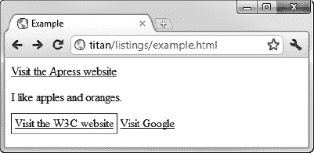

*图 17-12。选择直接兄弟*

您可以使用*通用兄弟选择器*使选择稍微宽松一点，它选择另一个指定元素之后的元素，但不一定是立即选择。[表 17-12](#tab_17_12) 描述了这个元素。

清单 17-14 展示了如何使用通用兄弟选择器。

*清单 17-14。使用通用同级选择器*

`<!DOCTYPE HTML>
<html>
    <head>
        <title>Example</title>
**        **
    </head>
    <body>
        <a href="http://apress.com">Visit the Apress website</a>
        
I like apples and oranges.

        <a href="http://w3c.org">Visit the W3C website</a>
        <a href="http://google.com">Visit Google</a>
    </body>
</html>`

我们不局限于紧跟在第一个选择器匹配的元素之后的元素，这意味着在这个例子中第二个选择器将匹配两个`a`元素。被排除的`a`元素(链接到 http://apress.com 的元素)未被选中，因为它位于`p`元素之前；我们只能选择后继的兄弟姐妹)。你可以在图 17-13 的[中看到这个选择器的效果。](#fig_17_13)

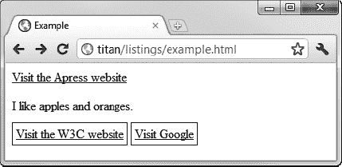

*图 17-13。使用通用同级选择器*

### 使用伪元素选择器

到目前为止，您已经看到了使用 HTML 文档中定义的元素的选择。CSS 还包括*伪选择器*，它们提供更复杂的功能，但并不直接对应于文档中定义的元素。伪选择器有两种:*伪元素*和*伪类*。在这一节中，我将描述并演示伪元素选择器。顾名思义，伪元素并不真正存在；它们是 CSS 提供的一种便利，让您可以做出有帮助的选择。

#### 使用::首行选择器

`::first-line`选择器匹配文本块的第一行。[表 17-13](#tab_17_13) 总结了`::first-line`选择器。

[清单 17-15](#list_17_15) 显示了一个使用`::first-line`选择器的例子。

*清单 17-15。使用::第一行伪元素选择器*

`<!DOCTYPE HTML>
<html>
    <head>
        <title>Example</title>
**        **
    </head>
    <body>
        
Fourscore and seven years ago our fathers brought forth
           on this continent a new nation, conceived in liberty, and
           dedicated to the proposition that all men are created equal.

        
I like apples and oranges.

        <a href="http://w3c.org">Visit the W3C website</a>
    </body>
</html>`

我在这个例子中单独使用了选择器，但是它也可以作为一个修饰符应用于其他选择器。例如，如果我想只选择第一行的`p`元素，我可以指定`p::first-line`作为选择器。

 **提示**伪元素选择器以两个冒号字符(`::`)为前缀，但是浏览器将识别只有一个冒号的选择器(即`:first-line`而不是`::first-line`)。这使得格式与我在本章前面描述的伪类选择器保持一致，以便向后兼容。

当浏览器窗口调整大小时，浏览器将重新评估第一行是什么。这意味着样式总是正确地应用于文本的第一行，如图[图 17-14](#fig_17_14) 所示。

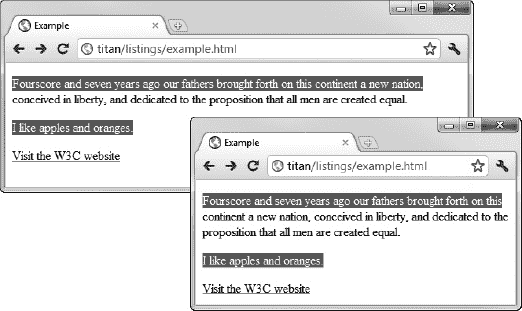

*图 17-14。浏览器确保样式被应用到第一行，即使当窗口被调整大小时*

#### 使用::首字母选择器

选择器顾名思义:它选择文本块中的第一个字母。表 17-14 总结了这个伪元素选择器。

清单 17-16 显示了正在使用的选择器。

*清单 17-16。使用::首字母伪元素选择器*

`<!DOCTYPE HTML>
<html>
    <head>
        <title>Example</title>
**        **
    </head>
    <body>
        
Fourscore and seven years ago our fathers brought forth
            on this continent a new nation, conceived in liberty, and
             dedicated to the proposition that all men are created equal.

        
I like apples and oranges.

        <a href="http://w3c.org">Visit the W3C website</a>
    </body>
</html>`

你可以在[图 17-15](#fig_17_15) 中看到这个选择器的效果。

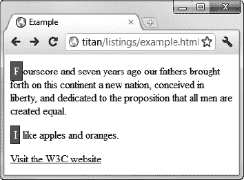

*图 17-15。使用::首字母选择器*

#### 使用:之前和:之后选择器

`:before`和`:after`选择器的不同寻常之处在于它们生成内容并将其添加到文档中。我在第 9 章的[中介绍了`:before`选择器，并展示了如何使用它来创建定制列表。`:after`选择器是`:before`的对等物，它在元素之后添加内容，而不是在元素之前。表 17-15](09.html#ch9) 描述了这些选择器。

清单 17-17 展示了这些属性的使用。

*清单 17-17。使用之前和之后选择器*

`<!DOCTYPE HTML>
<html>
    <head>
        <title>Example</title>
**        **
    </head>
    <body>
        <a href="http://apress.com">Visit the Apress website</a>
        
I like apples and oranges.

        <a href="http://w3c.org">Visit the W3C website</a>
    </body>
</html>`

在[清单 17-17](#list_17_17) 中，我选择了`a`元素并应用了`:before`和`:after`伪选择器。当使用这些选择器时，通过为`content`属性设置一个值来指定想要插入的内容。这是一个特殊的属性，只能与这些选择器一起使用。在这个例子中，内容`Click here to`将被插入到`a`元素的内容之前，感叹号(`!`)将被插入到内容之后。你可以在图 17-16 中看到这些增加的效果。

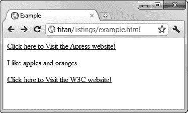

*图 17-16。使用:之前和之后选择器*

#### 使用 CSS 计数器功能

`:before`和`:after`选择器通常与 CSS *计数器*功能一起使用，它可以让您生成数字内容。我在[第 9 章](09.html#ch9)中给出了一个使用这些计数器创建自定义列表的例子。清单 17-18 给出了一个演示。

*清单 17-18。使用 CSS 计数器功能*

`<!DOCTYPE HTML>
<html>
    <head>
        <title>Example</title>
**        **
    </head>
    <body>
        <a href="http://apress.com">Visit the Apress website</a>
        
I like apples and oranges.

        
I also like mangos and cherries.

        <a class="myclass1 myclass2" href="http://w3c.org">Visit the W3C website</a>
    </body>
</html>`

要创建一个计数器，您可以使用特殊的`counter-reset`属性，并将值设置为您想要用于计数器的名称，如下所示:

`counter-reset: paracount;`

这具有初始化名为`paracount`计数器的计数器并将值设置为`1`的效果。您可以通过在计数器名称后添加一个数字来指定不同的初始值，如下所示:

`counter-reset: paracount 10;`

如果想要定义多个计数器，只需将名称(和可选的初始值)添加到同一个`counter-reset`声明中，如下所示:

`counter-reset: paracount 10 othercounter;`

这个声明创建了一个名为`paracount`(初始值为`10`)的计数器和一个名为`othercounter`(初始值为`1`)的计数器。初始化计数器后，可以在使用`:before`和`:after`选择器的样式的`content`属性中使用它，如下所示:

`content: counter(paracount) ". ";`

因为这个声明已经在包含`:after`的选择器中使用，所以它的效果是在选择器匹配的每个元素之前包含 HTML 中计数器的当前值，在这种情况下，在每个值之后附加一个句点和一个空格。该值默认为十进制整数(`1`、`2`、`3`等)。)，但您也可以指定其他数字格式，如下所示:

`content: counter(paracount, lower-alpha) ". ";`

counter 函数的另一个参数是您想要的数字样式。你可以为`list-style-type`属性使用任何支持的值，我在[第 24 章](24.html#ch24)中对此进行了描述。

您使用特殊的`counter-increment`属性增加计数器。该属性的值是要递增的计数器的名称，如下所示:

`counter-increment: paracount;`

默认情况下，计数器递增 1，但是您可以通过将所需的步长添加到声明中来指定不同的增量，如下所示:

`counter-increment: paracount 2;`

你可以从[图 17-17](#fig_17_17) 中的[清单 17-18](#list_17_18) 中看到计数器的效果。

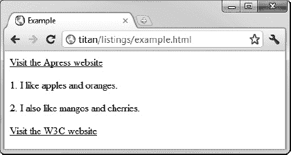

*图 17-17。使用带有生成内容的计数器*

### 总结

在这一章中，我描述了 CSS 选择器和伪元素，它们是你识别想要应用样式的元素的方法。选择器允许您在大范围内匹配元素，或者通过组合选择器，将您的关注点缩小到 HTML 文档中特定部分的元素。伪元素便于您选择文档中并不存在的内容。在下一章研究伪类时，你会看到类似的原理。

学习选择器是充分利用 CSS 的关键。在接下来的章节中，你将会看到很多选择器的例子，我建议你花时间去试验并熟悉它们。