## 19

## 使用边框和背景

在这一章中，我将介绍一些你可以用来给一个元素应用背景和边框的属性。这些是在 CSS3 中得到增强的非常常用的特性。例如，您现在可以创建带有弯曲边缘的边框，使用图像作为边框，以及为元素创建投影。这些看起来似乎很简单，但是 CSS 对它们的省略导致了以其他方式提供这些特性的无尽努力，并获得了混合的成功。表 19-1 对本章进行了总结。

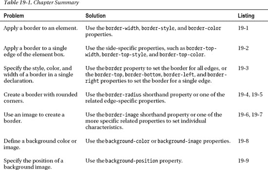

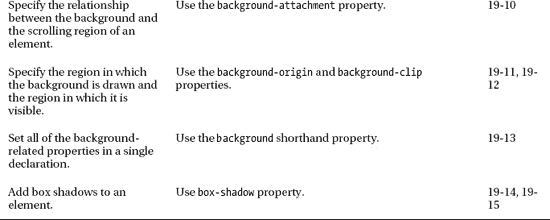

### 应用边框

让我们从控制边框的属性开始。这些是非常常用的，当你考虑第 20 章中的`margin`和`padding`属性时，它们会给你一些可见的东西。基本边界的三个关键属性是`border-width`、`border-style`和`border-color`。表 19-2 描述了所有三个属性。

您可以在清单 19-1 的[中看到这些正在使用的属性。](#list_19_1)

*清单 19-1。定义基本边界*

`<!DOCTYPE HTML>
<html>
    <head>
        <title>Example</title>
        <meta name="author" content="Adam Freeman"/>
        <meta name="description" content="A simple example"/>` `        <link rel="shortcut icon" href="favicon.ico" type="image/x-icon" />
        
    </head>
    <body>
    

        There are lots of different kinds of fruit - there are over 500 varieties
        of banana alone. By the time we add the countless types of apples, oranges,
        and other well-known fruit, we are faced with thousands of choices.
    

    </body>
</html>`

在[清单 19-1](#list_19_1) 中，我使用了一个`p`元素来表示一个段落，使用`border-width`、`border-style`和`border-color`属性使用`style`元素来应用一个边框。

#### 定义边框宽度

您可以将`border-width`属性表示为一个常规的 CSS 长度，表示为将要绘制边框的区域宽度的百分比，或者表示为三个快捷方式值中的一个。表 19-3 描述了这些选项。默认的`border-width`值是`medium`。

#### 定义边框样式

`border-style`属性可以是[表 19-4](#tab_19_4) 中显示的值之一。默认值为`none`，表示不绘制边框。

T2】

你可以在[图 19-1](#fig_19_1) 中看到这些边框类型是如何出现的。

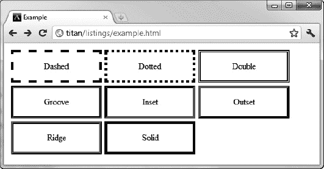

*图 19-1。边框样式属性的不同值*

当`border-color`属性为`black`时，有些浏览器在应用双色边框样式时会出现问题，比如`inset`和`outset`。包括谷歌 Chrome 在内的这些浏览器对两种色调都使用了`black`，产生了与`solid`风格相同的效果。更聪明的浏览器知道使用灰色阴影，包括 Firefox。为了创建图形(显示 Chrome)，我将`groove`、`inset`、`outset`和`ridge`样式的`border-color`属性设置为`gray`。

#### 将边框应用于单侧

您可以使用更具体的属性将不同的边框应用到元素的每一侧，如[表 19-5](#tab_19_5) 中所述。

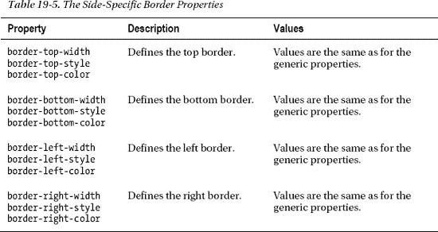

您可以使用这些属性构建边框，也可以将它们与更通用的属性结合使用来覆盖边框的特定边缘。清单 19-2 显示了后一种方法。

*清单 19-2。使用侧面特定的边界属性*

`<!DOCTYPE HTML>
<html>
    <head>
        <title>Example</title>
        <meta name="author" content="Adam Freeman"/>
        <meta name="description" content="A simple example"/>
        <link rel="shortcut icon" href="favicon.ico" type="image/x-icon" />
        
    </head>
    <body>
    

        There are lots of different kinds of fruit - there are over 500 varieties
        of banana alone. By the time we add the countless types of apples, oranges,
        and other well-known fruit, we are faced with thousands of choices.
    

    </body>
</html>`

你可以在[图 19-2](#fig_19_2) 中看到这些属性的效果。

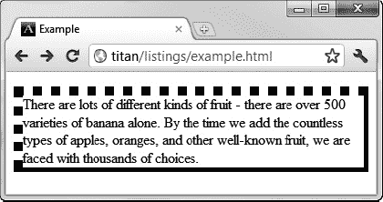

*图 19-2。将边界应用到单个边缘*

#### 使用边框速记属性

您可以使用简化的属性在一个步骤中设置所有三个值，而不是使用样式、宽度和颜色的单独属性。表 19-6 描述了这些特性。

通过在一行中指定宽度、样式和颜色值来设置这些属性的值，用空格分隔，如[清单 19-3](#list_19_3) 所示。

*清单 19-3。使用边框速记属性*

`<!DOCTYPE HTML>
<html>
    <head>
        <title>Example</title>
        <meta name="author" content="Adam Freeman"/>
        <meta name="description" content="A simple example"/>
        <link rel="shortcut icon" href="favicon.ico" type="image/x-icon" />
        
    </head>
    <body>
    

        There are lots of different kinds of fruit - there are over 500 varieties
        of banana alone. By the time we add the countless types of apples, oranges,
        and other well-known fruit, we are faced with thousands of choices.
    

    </body>
</html>`

请注意，我没有为`border-top`属性指定颜色。如果您忽略一个或多个值，浏览器将使用先前定义的任何值；在这种情况下，颜色由`border`速记属性指定。你可以在[图 19-3](#fig_19_3) 中看到这些属性的效果。

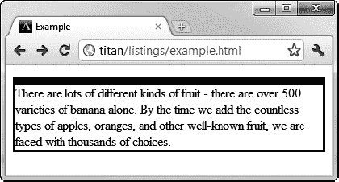

*图 19-3。使用边框速记属性*

#### 创建圆角边框

您可以使用边框`radius`功能创建圆角边框。有五个属性与此功能相关联。表 19-7 总结了这些。

T2】

通过指定两个半径值(长度或百分比)来定义曲线拐角。第一个值指定水平半径，第二个值指定垂直半径。百分比值是元素框的水平和垂直大小。你可以在图 19-4 中看到半径值是如何用于确定边界曲线的。

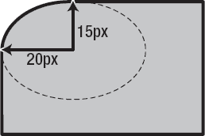

*图 19-4。使用半径来指定边界的曲线*

如图所示，半径值用于投影一个与元素的框相交的椭圆，并形成边框的角。清单 19-4 显示了这些作为样式声明一部分的值。

*清单 19-4。创建曲线边框*

`<!DOCTYPE HTML>
<html>
    <head>
        <title>Example</title>
        <meta name="author" content="Adam Freeman"/>
        <meta name="description" content="A simple example"/>
        <link rel="shortcut icon" href="favicon.ico" type="image/x-icon" />
        
    </head>
    <body>
    

        There are lots of different kinds of fruit - there are over 500 varieties
        of banana alone. By the time we add the countless types of apples, oranges,
        and other well-known fruit, we are faced with thousands of choices.
    

    </body>
</html>`

如果只提供一个值，那么水平半径和垂直半径都将使用该值。你可以在[图 19-5](#fig_19_5) 中看到浏览器显示的效果。我放大了弯曲的边界区域，让它看起来更清楚。

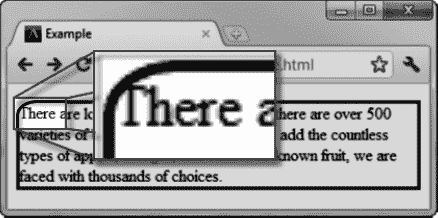

*图 19-5。创建曲线边框*

 **提示**注意边框接触到图中的文字。为了在一个元素的内容和它的边框之间创建空间，你添加了*填充*，这将在[第 20 章](20.html#ch20)中介绍。

`border-radius`速记属性允许你为所有四个角指定一个值，或者在一个值中指定四个单独的值，如[清单 19-5](#list_19_5) 所示。

*清单 19-5。使用边框半径速记属性*

`<!DOCTYPE HTML>
<html>
    <head>
        <title>Example</title>
        <meta name="author" content="Adam Freeman"/>
        <meta name="description" content="A simple example"/>` `        <link rel="shortcut icon" href="favicon.ico" type="image/x-icon" />
        
    </head>
    <body>
    

        There are lots of different kinds of fruit - there are over 500 varieties
        of banana alone. By the time we add the countless types of apples, oranges,
        and other well-known fruit, we are faced with thousands of choices.
    

    

        There are lots of different kinds of fruit - there are over 500 varieties
        of banana alone. By the time we add the countless types of apples, oranges,
        and other well-known fruit, we are faced with thousands of choices.
    

    </body>
</html>`

在[清单 19-5](#list_19_5) 中，有两段，每段都有自己的`border-radius`声明。第一个声明只指定了两个值，它们应用于边框的所有四个角。请注意，水平值和垂直值由一个`/`字符分隔开。第二个声明指定了八个值。前四个值是每个角的水平半径值，后四个值是水平对应值。这些值集也由一个`/`字符分隔。

你可以在图 19-6 中看到这些声明的效果。结果有点奇怪，但是它演示了如何使用单个声明为每个角定义不同的曲线，以及如何自由混合百分比和长度值。

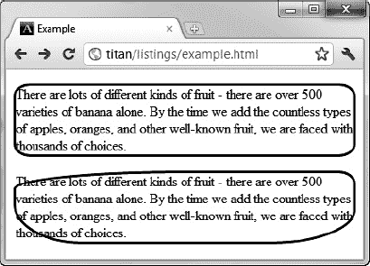

*图 19-6。使用边框半径速记属性*

#### 使用图像作为边框

您并不局限于由`border-style`属性定义的边框。您还可以使用图像为您的元素创建真正自定义的边框。有五个属性配置图像边框的各个方面，还有一个快捷的属性，您可以用它来配置单个声明中的所有内容。表 19-8 显示了所有六个属性。

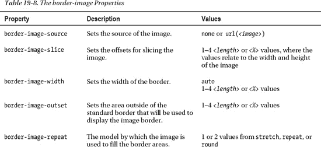

问题是，当我写这篇文章时，主流浏览器不支持这些属性。你*可以*使用图片作为边框，但是只能通过速记属性，并且只能使用我在[第十六章](16.html#ch16)中描述的浏览器特有的前缀(而 IE 根本不支持这个特性)。这允许我演示基本特性，但不是向您展示单个属性。特定于浏览器的速记属性的工作方式与`border-image`属性相同，因此当浏览器支持时，将本节中的示例转换为标准属性应该没有问题。

##### 分割图像

使用图像作为边框的关键是*切片*。您指定的值是图像的偏移量，浏览器使用这些值将图像分割为九个部分。为了演示切片的效果，我创建了一个图像，可以很容易地看到浏览器如何执行切片，以及如何使用每个切片。你可以在[图 19-7](#fig_19_7) 中看到这个图像。

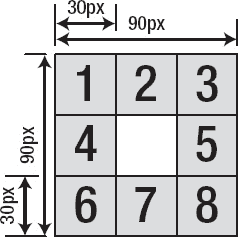

*图 19-7。旨在展示边界特征的图像*

这个图像是 90 像素乘 90 像素，并且每个单独的拼贴是 30 像素乘 30 像素。中间的瓷砖是透明的。要对图像进行切片，需要从图像的顶部、右侧、底部和左侧边缘提供插入，以长度或图像大小的百分比表示。您可以为所有四个插入提供不同的值，或者提供两个值(用于水平和垂直插入)，或者只提供一个值，然后用于所有四个插入。对于这幅图像，我使用了一个单独的值`30px`，它创建了所需的切片，如图 19-8 中的[所示。](#fig_19_8)

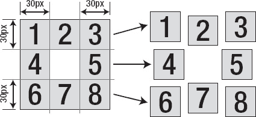

*图 19-8。对边界图像进行切片*

对图像进行切片会生成八个图块。标有`1`、`3`、`6`和`8`的拼贴用于绘制边界的角，标有`2`、`4`、`5`和`7`的拼贴用于绘制边界边缘。[清单 19-6](#list_19_6) 显示了浏览器特有的属性，用于对图像进行切片，并将其用作边框。

*清单 19-6。分割图像并将其用作边界*

`<!DOCTYPE HTML>
<html>
    <head>
        <title>Example</title>
        <meta name="author" content="Adam Freeman"/>
        <meta name="description" content="A simple example"/>
        <link rel="shortcut icon" href="favicon.ico" type="image/x-icon" />
        
    </head>
    <body>
    

        There are lots of different kinds of fruit - there are over 500 varieties
        of banana alone. By the time we add the countless types of apples, oranges,
        and other well-known fruit, we are faced with thousands of choices.
    

    </body>
</html>`

每个属性声明都有相同的参数。您必须使用`url`函数来指定图像(这是必需的，因为 CSS 规范保留了实现其他获取图像的方法的权利)。在每种情况下，我都提供了一个切片值`30`，匹配示例图像的平铺尺寸。请注意，在指定切片时，您不需要提供单位，因为它们被假定为像素。

`/`字符用于将切片值与边框宽度值分开。我们可以为元素的每一边指定不同的宽度，但是我提供了一个单一的值，它将用于所有四边；在本例中，我选择了`50px`的边框宽度。图 19-9 显示了 Chrome 如何显示图像。火狐和 Opera 看起来一模一样。

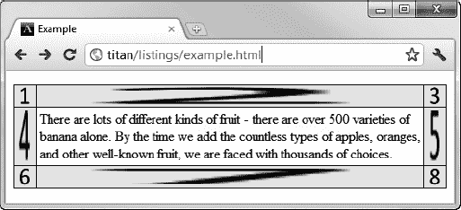

*图 19-9。使用图像作为边框*

您可以看到浏览器是如何使用图像的每一部分的。标记为 2 和 7 的切片可能有点难以辨认，但它们分别用于顶部和底部边缘。

##### 控制切片重复样式

你可以在图 19-10 中看到，切片已经被拉伸以填充边界的可用空间。您可以更改重复样式以获得不同的效果。这是`border-image-repeat`属性的责任，但是您也可以使用速记属性来指定重复样式。[表 19-9](#tab_19_9) 描述了可用于定义重复样式的值。

在我写这篇文章时，对重复样式值的支持是不完整的。没有一个浏览器支持`space`值，Chrome 也不支持`round`值。[清单 19-7](#list_19_7) 展示了如何在 Firefox 中使用`repeat`和`round`值来改变边框重复样式。

*清单 19-7。控制切片重复样式*

`<!DOCTYPE HTML>
<html>
    <head>
        <title>Example</title>
        <meta name="author" content="Adam Freeman"/>
        <meta name="description" content="A simple example"/>
        <link rel="shortcut icon" href="favicon.ico" type="image/x-icon" />
        
    </head>
    <body>
    

        There are lots of different kinds of fruit - there are over 500 varieties
        of banana alone. By the time we add the countless types of apples, oranges,
        and other well-known fruit, we are faced with thousands of choices.
    

    </body>
</html>`

在清单 19-7 中，第一个值指定水平重复样式，第二个值指定垂直重复样式。如果您只提供一个值，它将用于水平和垂直重复。你可以在[图 19-10](#fig_19_10) 中看到这些值之间的差异。

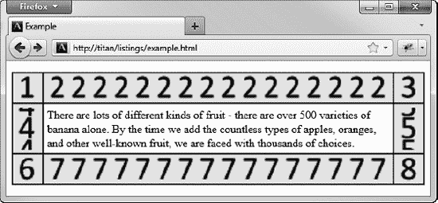

*图 19-10。边界切片重复的舍入和重复值*

请注意，顶部和底部边缘不包含任何部分切片。`2`和`7`数字被稍微拉伸了一下，然后重复，这样就没有零碎了。相比之下，设置为使用`repeat`样式的左右边缘被分割以填充空间。

### 设置元素背景

盒子模型的第二个可见区域是元素的内容。在这一节中，我将介绍可以用来设置该区域背景样式的属性。(有关如何对内容本身进行样式化的详细信息，请参见第 22 章。)其特性在[表 19-10](#tab_19_10) 中描述。

#### 设置背景颜色和图像

元素背景的起点是使用背景属性设置背景颜色或图像，或者两者都设置，如清单 19-8 所示。

*清单 19-8。设置背景颜色和图像*

`<!DOCTYPE HTML>
<html>
    <head>
        <title>Example</title>
        <meta name="author" content="Adam Freeman"/>
        <meta name="description" content="A simple example"/>
        <link rel="shortcut icon" href="favicon.ico" type="image/x-icon" />
        
    </head>
    <body>
    

        There are lots of different kinds of fruit - there are over 500 varieties
        of banana alone. By the time we add the countless types of apples, oranges,
        and other well-known fruit, we are faced with thousands of choices.
    

    </body>
</html>`

在这个例子中，我将`background-color`设置为`lightgray`，并使用`url`函数为`background-image`属性加载一个名为`banana.png`的图像。你可以在[图 19-11](#fig_19_11) 中看到这个图像的效果。背景图像总是绘制在背景颜色上。

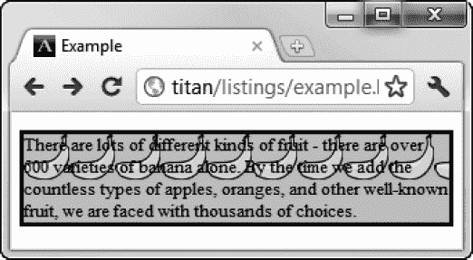

*图 19-11。使用背景颜色和图像*

这张图片在某种程度上覆盖了元素的文本，但背景图片往往会这样，除非选择得非常仔细。请注意，该图像在图中的元素上水平重复。这通过`background-repeat`属性实现，其允许值在[表 19-11](#tab_19_11) 中描述。

T2】

您可以为水平和垂直重复指定一个值，但是如果您只提供一个值，浏览器将在两个方向上使用该重复样式。例外情况是`repeat-x`和`repeat-y`，浏览器将对第二个值使用`no-repeat`样式。

#### 设置背景图像尺寸

我指定的图像对于元素来说太大了，所以我使用了`background-size`属性来指定图像的大小应该由`40`像素调整为`40`像素。除了长度，您还可以指定百分比(从图像的宽度和高度得出)和一些预定义的值，如[表 19-12](#tab_19_12) 所述。

`contain`值确保图像被缩放，以便可以在元素内部看到所有图像。浏览器确定图像的长度或高度是否更大，并以此作为缩放的轴。根据约定，对于`cover`值，浏览器选择最小值，并沿该轴缩放图像。这意味着不会显示所有的图像。在[图 19-12](#fig_19_12) 中可以看到两种不同的尺寸样式。

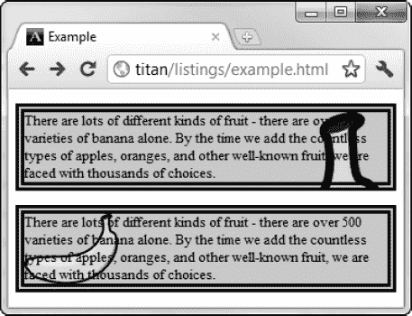

*图 19-12。容器和盖子尺寸样式*

香蕉图像的高度大于宽度。这意味着当您使用`cover`值时，图像将被缩放，以便完全显示宽度，即使不能显示图像的全部高度。你可以在最上面的元素[图 19-12](#fig_19_12) 中看到这个效果。当使用`contain`值时，图像被缩放，使得最大轴完整可见，这意味着整个图像将被显示，即使它没有覆盖整个背景区域。你可以在[图 19-12](#fig_19_12) 的下部元素中看到这种效果。

#### 设置背景图像位置

属性让你指示浏览器背景图片应该放在哪里。当您不重复图像时，这是最有用的。您可以在清单 19-9 中看到这个属性的使用。

*清单 19-9。定位背景图像*

`<!DOCTYPE HTML>
<html>
    <head>
        <title>Example</title>
        <meta name="author" content="Adam Freeman"/>
        <meta name="description" content="A simple example"/>
        <link rel="shortcut icon" href="favicon.ico" type="image/x-icon" />
        
    </head>
    <body>
    

        There are lots of different kinds of fruit - there are over 500 varieties
        of banana alone. By the time we add the countless types of apples, oranges,
        and other well-known fruit, we are faced with thousands of choices.
    

    </body>
</html>`

该声明告诉浏览器从左边缘 30 像素处和从上边缘 10 像素处绘制背景图像。我使用长度指定了位置，但是您也可以使用[表 19-13](#tab_19_13) 中显示的预定义值。

第一个值控制垂直位置，可以是`top`、`bottom`或`center`。第二个值控制水平位置，可以是`left`、`right`或`center`。你可以在[图 19-13](#fig_19_13) 中看到定位图像的效果。

*图 19-13。定位背景图片*

#### 为背景设置附件

将背景应用于具有视口的元素时，可以指定如何将背景附加到内容。带有视窗的元素的一个很好的例子是`textarea`(在[第 14 章](14.html#ch14)中有描述)，它会自动添加滚动条来显示内容。另一个常见的例子是`body`元素，当内容比浏览器窗口长时，它可以有滚动条(你可以在[第 7 章](07.html#ch7)中找到`body`元素的细节)。您可以使用`background-attachment`属性控制后台附件。[表 19-14](#tab_19_14) 描述了允许值。

[清单 19-10](#list_19_10) 显示了与`border-attachment`属性一起使用的`textarea`元素。

*清单 19-10。使用边框附件属性*

`<!DOCTYPE HTML>
<html>
    <head>
        <title>Example</title>
        <meta name="author" content="Adam Freeman"/>
        <meta name="description" content="A simple example"/>
        <link rel="shortcut icon" href="favicon.ico" type="image/x-icon" />` `        
    </head>
    <body>
    

**        <textarea rows="8" cols="30">**
**        There are lots of different kinds of fruit - there are over 500 varieties**
**        of banana alone. By the time we add the countless types of apples, oranges,**
**        and other well-known fruit, we are faced with thousands of choices.**
**        </textarea>**
    

    </body>
</html>`

我不能用图形来演示不同的连接模式。这是你必须亲自在浏览器中看到的东西。要查看固定模式和滚动模式之间的差异，请使用示例 HTML 文档，调整浏览器窗口的大小以使`textarea`不完全显示，然后使用浏览器滚动条(而不是`textarea`滚动条)进行滚动。

#### 设置背景图像原点和裁剪样式

背景的原点指定应用背景颜色和图像的位置。剪辑样式确定元素框中绘制背景色和图像的区域。`background-origin`和`background-clip`属性控制这些特性，每个属性都有相同的三个允许值，在[表 19-15](#tab_19_15) 中有描述。

清单 19-11 展示了`background-origin`属性的使用。

*清单 19-11。使用背景-起源属性*

`<!DOCTYPE HTML>
<html>
    <head>
        <title>Example</title>
        <meta name="author" content="Adam Freeman"/>
        <meta name="description" content="A simple example"/>
        <link rel="shortcut icon" href="favicon.ico" type="image/x-icon" />
        
    </head>
    <body>
    

        There are lots of different kinds of fruit - there are over 500 varieties
        of banana alone. By the time we add the countless types of apples, oranges,
        and other well-known fruit, we are faced with thousands of choices.
    

    </body>
</html>`

在[清单 19-11](#list_19_11) 中，我选择了`border-box`值，这意味着浏览器将在边框下绘制背景颜色和图像。我说在下面，因为边框总是画在背景上。你可以在[图 19-14](#fig_19_14) 中看到效果。

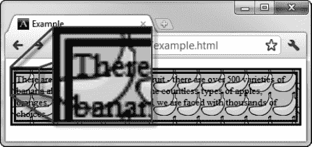

*图 19-14。使用背景-原点属性*

`background-clip`属性通过应用*剪辑框*来确定背景的哪个部分可见。框外的任何内容都被丢弃并且不显示。您有与`background-origin`属性相同的三个可用值，您可以在清单 19-12 中看到组合这些属性的效果。

*清单 19-12。使用背景剪辑属性*

`<!DOCTYPE HTML>
<html>
    <head>
        <title>Example</title>
        <meta name="author" content="Adam Freeman"/>
        <meta name="description" content="A simple example"/>
        <link rel="shortcut icon" href="favicon.ico" type="image/x-icon" />
        
    </head>
    <body>
    

        There are lots of different kinds of fruit - there are over 500 varieties
        of banana alone. By the time we add the countless types of apples, oranges,
        and other well-known fruit, we are faced with thousands of choices.
    

    </body>
</html>`

这种组合告诉浏览器在边框内绘制背景，但丢弃内容框之外的任何内容。你可以在[图 19-15](#fig_19_15) 中看到相当微妙的效果。

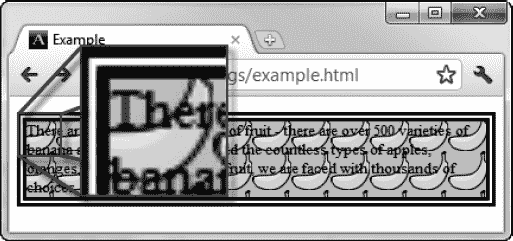

*图 19-15。一起使用边框起点和边框裁剪属性*

#### 使用后台速记属性

属性允许你在一个声明中设置所有不同的背景值。以下是该属性的值的格式，引用了各个属性:

`background: <background-color> <background-position> <background-size>
    <background-repeat> <background-origin> <background-clip> <background-attachment>
    <background-image>`

这是一个相当长的值声明，但是您可以省略值。如果这样做，浏览器将使用默认值。清单 19-13 展示了正在使用的`border`速记属性。

*清单 19-13。使用边框速记属性*

`<!DOCTYPE HTML>
<html>
    <head>
        <title>Example</title>
        <meta name="author" content="Adam Freeman"/>
        <meta name="description" content="A simple example"/>
        <link rel="shortcut icon" href="favicon.ico" type="image/x-icon" />
        
    </head>
    <body>
        

        There are lots of different kinds of fruit - there are over 500 varieties
        of banana alone. By the time we add the countless types of apples, oranges,
        and other well-known fruit, we are faced with thousands of choices.
        

    </body>
</html>`

该单个属性相当于以下一组单独的属性:

`background-color: lightgray;
background-position: top right;
background-repeat: no-repeat;
background-origin: border-box;
background-position: content-box;
background-attachment: local;
background-image: url(banana.png);`

 **提示**目前并非所有浏览器都支持该属性。

### 创建方框阴影

最令人期待的 CSS3 特性之一是为元素的盒子添加阴影的能力。你可以使用`drop-shadow`属性来完成，这在[表 19-16](#tab_19_16) 中有描述。

`box-shadow`柠檬的值组成如下:

`box-shadow: hoffset voffset blur spread color inset`

这些单个值元素在[表 19-17](#tab_19_17) 中描述。

 **注意**省略`color`值时要小心。这应该是一个可选值，允许浏览器应用一个标准颜色，也许是一个适合用户操作系统或浏览器选择的颜色。但在撰写本文时，基于 Webkit 的浏览器不会用未指定的颜色绘制边框。因此，值得在`box-shadow`值中明确指定一种颜色。

您可以在清单 19-14 的[中看到这个属性。](#list_19_14)

*清单 19-14。创建投影*

`<!DOCTYPE HTML>
<html>
    <head>
        <title>Example</title>
        <meta name="author" content="Adam Freeman"/>
        <meta name="description" content="A simple example"/>
        <link rel="shortcut icon" href="favicon.ico" type="image/x-icon" />
        
    </head>
    <body>
    

        There are lots of different kinds of fruit - there are over 500 varieties
        of banana alone. By the time we add the countless types of apples, oranges,
        and other well-known fruit, we are faced with thousands of choices.
    

    </body>
</html>`

你可以在[图 19-16](#fig_19_16) 中看到该属性的效果。

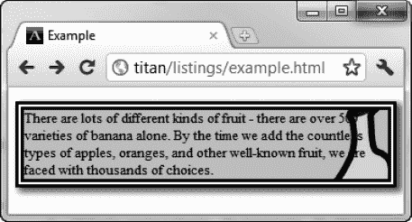

*图 19-16。应用于元素的方框阴影*

您可以在一个`box-shadow`声明中定义多个阴影。为此，用逗号分隔每个声明，如清单 19-15 所示。

*清单 19-15。对一个元素应用多重阴影*

`<!DOCTYPE HTML>
<html>
    <head>
        <title>Example</title>
        <meta name="author" content="Adam Freeman"/>
        <meta name="description" content="A simple example"/>
        <link rel="shortcut icon" href="favicon.ico" type="image/x-icon" />
        
    </head>
    <body>
    

        There are lots of different kinds of fruit - there are over 500 varieties
        of banana alone. By the time we add the countless types of apples, oranges,
        and other well-known fruit, we are faced with thousands of choices.
    

    </body>
</html>`

在清单 19-15 中，我定义了两个阴影，其中一个是插入的。你可以在[图 19-17](#fig_19_17) 中看到效果。

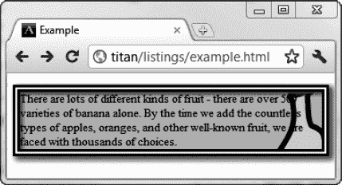

*图 19-17。为一个元素定义多个阴影*

### 使用轮廓

轮廓是边框的替代物。它们对于暂时将用户的注意力吸引到某个元素上非常有用，例如必须按下的按钮或数据输入中的错误。您在边框外绘制轮廓。边框和轮廓的主要区别在于，轮廓不被视为页面的一部分，因此在应用它们时不会导致页面布局的调整。[表 19-18](#tab_19_18) 描述了与轮廓相关的元素。

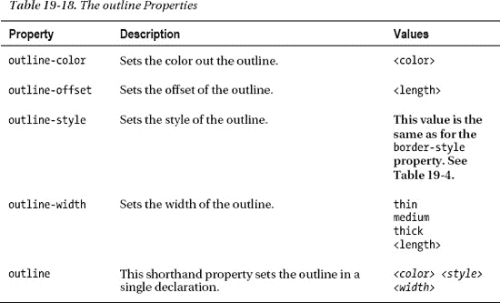

[清单 19-16](#list_19_16) 展示了一个大纲的应用。我在这个例子中包含了一个简单的脚本，这样我就可以演示如何绘制轮廓，而不会导致页面被重新布局。

*清单 19-16。使用大纲*

`<!DOCTYPE HTML>
<html>
    <head>
        <title>Example</title>
        <meta name="author" content="Adam Freeman"/>
        <meta name="description" content="A simple example"/>
        <link rel="shortcut icon" href="favicon.ico" type="image/x-icon" />
        
    </head>
    <body>
        

            There are lots of different kinds of fruit - there are over 500
            varieties of banana alone. By the time we add the countless types of
            apples, oranges, and other well-known fruit, we are faced with
            thousands of choices.
        

        

            There are lots of different kinds of fruit - there are over 500
            varieties of banana alone. By the time we add the countless types of
            apples, oranges, and other well-known fruit, we are faced with
            thousands of choices.
        

        

            There are lots of different kinds of fruit - there are over 500
            varieties of banana alone. By the time we add the countless types of
            apples, oranges, and other well-known fruit, we are faced with
            thousands of choices.
        

        <button>Outline Off</button>
        <button>Outline On</button>
        
    </body>
</html>`

你可以在[图 19-18](#fig_19_18) 中看到应用轮廓的效果。请注意元素是如何不改变位置的。这是因为在页面布局中没有为大纲分配它们自己的空间。

*图 19-18。对元素应用轮廓*

### 总结

在这一章中，我已经向你展示了可以用来给元素的盒子添加边框、背景和轮廓的属性。

您可以从一组简单的样式中选择边框，或者使用图像完全自定边框。图像边界的关键技术是切片，其中图像被分成多个部分，每个部分用于绘制部分边界。

你可以用背景来补充边框。我向您展示了如何创建颜色或图像背景，以及如何将它们配置为与元素框的其余部分相关联。

我通过演示阴影结束了这一章，它和弯曲的边框一起，是 CSS3 添加到边框和背景区域的主要新特性。