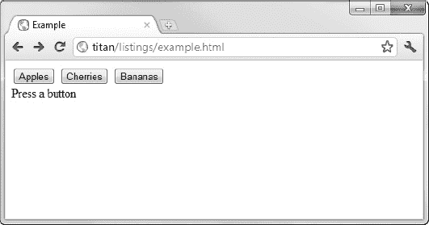
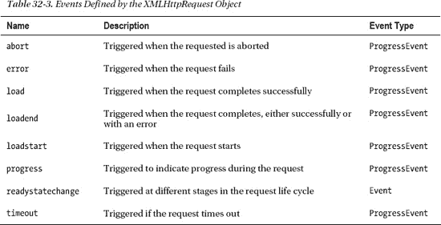

# 三十二、使用 Ajax——第一部分

Ajax 是现代 web 应用开发中的一个关键工具。它允许您从服务器异步发送和检索数据，并使用 JavaScript 处理数据。Ajax 是异步 JavaScript 和 XML 的缩写。这个名字是在 XML 成为数据传输格式的时候出现的，尽管我将在后面解释，现在情况已经不同了。

Ajax 是另一种有争议的技术。它在创建丰富的 web 应用方面非常有用，以至于设计师和开发人员围绕它的使用创造了一个传说，并定期参与关于如何正确使用 Ajax 的恶意攻击比赛。这很大程度上是垃圾，不需要。当你深入到细节时，Ajax 出奇的简单，你马上就能像大师一样提出请求。我的对付狂热者的标准建议适用于对付 Ajax 狂热者:礼貌地点点头，后退，为你的项目做正确的事情。

 **提示**你会看到 Ajax 有很多不同的用法。“AJAX”似乎是目前使用最广泛的，但 AJaX 相当普遍，有些人甚至使用 Ajax(挑剔的人认为你从来不大写“and”)。它们都是指相同的技术和技巧。我试图在本书中始终如一地使用 Ajax。

Ajax 的关键规范以您用来设置和发出请求的 JavaScript 对象命名:`XMLHttpRequest`。该规范有两个层次。所有主流浏览器都实现了 1 级，这是基本的功能级别。第 2 级扩展了最初的规范，以包括额外的事件、一些使使用`form`元素更容易的特性，以及对一些相关规范的支持，比如 CORS(我将在本章后面解释)。

在这一章中，我将解释 Ajax 的基础知识，向您展示如何创建、配置和执行简单的请求。我将向您展示如何通过事件来通知请求的进度，如何处理请求和应用错误，以及如何跨源发出请求。

本章中的所有例子都是关于从服务器获取数据的。下一章是关于发送数据的——特别是表单数据，这是 Ajax 最常见的用途之一。表 32-1 对本章进行了总结。

T2】

### 【Ajax 入门

Ajax 的关键是`XMLHttpRequest`对象，理解这个对象的最好方法是通过一个例子。[清单 32-1](#list_32_1) 展示了`XMLHttpRequest`对象的基本用法。

*清单 32-1。使用 XMLHttpRequest 对象*

`<!DOCTYPE HTML>
<html>
    <head>
        <title>Example</title>
    </head>
    <body>
        

            <button>Apples</button>
            <button>Cherries</button>
            <button>Bananas</button>
        

        **
**
            **Press a button**
        **
**
             
    </body>
</html>`

在这个例子中，有三个`button`元素，每个元素被标记为不同的水果:`Apples`、`Cherries`和`Bananas`。还有一个`div`元素，当你开始时，它会显示一条简单的消息，告诉用户按下其中一个按钮。你可以在[图 32-1](#fig_32_1) 中看到该文件的外观。

*图 32-1。一个简单 Ajax 例子的起始状态*

当按下其中一个按钮时，示例中的脚本加载另一个 HTML 文档，并将其设置为`div`元素中的内容。另外还有三个文档，它们对应于`button`元素上的标签:`apples.html`、`cherries.html`和`bananas.html`。[图 32-2](#fig_32_2) 显示了这些文档中的一个响应按钮的按下而显示的文档。

*图 32-2。显示异步加载的文档*

这三个附加文档非常简单——有一张图片和一段取自维基百科页面的相关水果的文本。作为参考，[清单 32-2](#list_32_2) 显示了`cherries.html`的内容，但所有三个文档遵循相同的结构(包含在本书的源代码下载中，可在`apress.com`免费获得)。

*清单 32-2。cherries.html 的内容*

`<!DOCTYPE HTML>
<html>
    <head>
        <title>Cherries</title>
        
    </head>
    <body>       
        

            
            True cherry fruits are borne by members of the subgenus Cerasus, which is
            distinguished by having the flowers in small corymbs of several together
            (not singly, nor in racemes), and by having a smooth fruit with only a weak
            groove or none along one side. The subgenus is native to the temperate
            regions of the Northern Hemisphere, with two species in America,
            three in Europe, and the remainder in Asia. The majority of eating cherries
            are derived from either Prunus avium, the wild cherry (sometimes called the
            sweet cherry), or from Prunus cerasus, the sour cherry.
        
` `    </body>
</html>`

当用户按下每个水果按钮时，浏览器关闭并异步检索所请求的文档，而无需重新加载主文档。这是典型的 Ajax 行为。

如果你把注意力转向剧本，你就能看到这是如何实现的。从`handleButtonPress`函数开始，该函数被调用以响应来自`button`控件的`click`事件:

`function handleButtonPress(e) {
    var httpRequest = new XMLHttpRequest();
    httpRequest.onreadystatechange = handleResponse;
    httpRequest.open("GET", e.target.innerHTML +  ".html");
    httpRequest.send();
}`

第一步是创建一个新的`XMLHttpRequest`对象。与您在 DOM 中看到的大多数对象不同，您不能通过浏览器定义的全局变量来访问这种对象。相反，您可以使用`new`关键字，就像这样:

`var httpRequest = new XMLHttpRequest();`

下一步是为`readystatechange`事件设置一个事件处理程序。这个事件在请求过程中被多次触发，为您提供事情进展的最新信息。我将在本章的后面回到这个事件(以及由`XMLHttpRequest`对象定义的其他事件)。我将`onreadystatechange`属性的值设置为`handleResponse`，这个函数我们很快就会用到:

`httpRequest.onreadystatechange = handleResponse;`

现在你可以告诉`XMLHttpRequest`对象你想要它做什么。您使用`open`方法，指定 HTTP 方法(在本例中为`GET`)和应该请求的 URL:

`httpRequest.open("GET", e.target.innerHTML +  ".html");`

 **提示**我在这里展示了最简单形式的`open`方法。您还可以向浏览器提供在向服务器发出请求时使用的凭证，如下所示:`httpRequest.open("GET", e.target.innerHTML + ".html", true, "adam", "secret")`。最后两个参数是应该发送给服务器的用户名和密码。另一个参数指定请求是否应该异步执行。这应始终设置为`true`。

我正在根据用户按下的`button`编写请求 URL。如果按下了`Apples`按钮，我会请求 URL `Apples.html`。浏览器足够智能，可以处理相对 URL，并根据需要使用当前文档的位置。在这种情况下，我的主文档是从 URL `[http://titan/listings/example.html](http://titan/listings/example.html)`加载的，所以`Apples.html`被认为是指`[http://titan/listings/Apples.html](http://titan/listings/Apples.html)`。您的环境的 URL 会有所不同，但效果是一样的。

 **提示**为您的请求选择正确的 HTTP 方法很重要。正如我在第 12 章[中解释的那样，`GET`请求是为了安全交互，这样你就可以一遍又一遍地发出相同的请求，而不会引起任何副作用。`POST`请求是针对*不安全的交互*，其中每个请求都会导致服务器发生某种变化，重复的请求很可能会有问题。还有其他 HTTP 方法，但 GET 和 POST 是使用最广泛的方法，以至于如果您想使用不同的方法，您必须使用本章“覆盖请求 HTTP 方法”一节中描述的约定来确保您的请求通过防火墙。](12.html#ch12)

这个函数的最后一步是调用`send`方法，就像这样:

`httpRequest.send();`

在这个例子中，我没有向服务器发送任何数据，所以没有关于`send`方法的参数。我将在本章的后面向您展示如何发送数据，但是在这个简单的例子中，您只是从服务器请求 HTML 文档。

#### 应对应对

脚本一调用`send`方法，浏览器就向服务器发出后台请求。因为请求是在后台处理的，所以 Ajax 依靠事件来通知您请求的进展情况。在这个例子中，我用`handleResponse`函数处理这些事件:

`function handleResponse(e) {
    if (e.target.readyState == XMLHttpRequest.DONE && e.target.status == 200) {
        document.getElementById("target").innerHTML = e.target.responseText;
    }
}`

当`readystatechange`事件被触发时，浏览器将一个`Event`对象传递给指定的处理函数。这就是我在[第 30 章](30.html#ch30)中描述的同一个`Event`对象，并且`target`属性被设置为事件所涉及的`XMLHttpRequest`。

许多不同的阶段通过`readystatechange`事件发出信号，您可以通过读取`XMLHttpRequest.readyState`属性的值来确定您正在处理哪一个。该属性的一组值如[表 32-2](#tab_32_2) 所示。

`DONE`状态并不表示请求成功——只表示请求已经完成。您通过`status`属性获得 HTTP 状态代码，该属性返回一个数值——例如,`200`值表示成功。只有结合`readyState`和`status`属性值，才能决定请求的结果。

您可以看到我是如何在`handleResponse`函数中检查这两个属性的。只有当`readyState`值为`DONE`并且`status`值为`200`时，我才设置`div`元素的内容。我使用`XMLHttpRequest.responseText`属性获取服务器发送的数据，如下所示:

`document.getElementById("target").innerHTML = **e.target.responseText;**`

`responseText`属性返回一个表示从服务器检索的数据的字符串。我使用这个属性来设置`div`元素的`innerHTML`属性的值，以便显示所请求文档的内容。这样，您就有了一个简单的 Ajax 示例——用户单击一个按钮，浏览器在后台向服务器请求一个文档，当文档到达时，您处理一个事件并显示所请求文档的内容。[图 32-3](#fig_32_3) 显示了该脚本的效果及其显示的不同文档。

*图 32-3。基本 Ajax 示例中脚本的效果*

#### 最低级的普通支配者:处理歌剧

在我们继续之前，我们必须花一点时间处理 Opera 对`XMLHttpRequest`标准的实现，它……嗯，不如其他浏览器好或完整。本章开头的例子对于其他主流浏览器来说非常适用，但是您需要做一些修改来处理 Opera 中的一些问题。清单 32-3 显示了这个例子，它有必要的修改。

*清单 32-3。修改示例以支持 Opera*

`<!DOCTYPE HTML>
<html>
    <head>
        <title>Example</title>
    </head>
    <body>
        

            <button>Apples</button>
            <button>Cherries</button>
            <button>Bananas</button>
        

        

            Press a button                
        

             
    </body>
</html>`

第一个问题是 Opera 在触发`readystatechange`事件时没有调度`Event`对象。这意味着你必须将`XMLHttpRequest`对象赋给一个全局变量，以便以后引用它。我定义了一个名为`httpRequest`的`var`，当我在`handleButtonPress`函数中创建对象时引用它，当我在`handleResponse`函数中处理完成的请求时再次引用它。

这看起来没什么大不了的，但是如果用户在处理请求时按下按钮，一个新的`XMLHttpRequest`对象将被分配给全局变量，您将失去与原始请求交互的能力。

第二个问题是 Opera 没有在`XMLHttpRequest`对象上定义就绪状态常数。这意味着您必须使用我在[表 32-2](#tab_32_2) 中显示的数值来检查`readyState`属性的值。代替`XMLHttpRequest.DONE`，你必须检查值`4`。

我希望在你读这本书的时候，Opera 已经升级和改进了它的`XMLHttpRequest`实现，但是如果没有，你需要写你的脚本来适应这种不好的行为。

### 使用 Ajax 事件

既然您已经构建并研究了一个简单的示例，那么您可以开始深入研究`XMLHttpRequest`对象支持的特性，以及如何在您的请求中使用它们。从 2 级规范中定义的附加事件开始。你已经看到了其中的一个——从第一级延续下来的`readystatechange`——但是还有其他的，正如[表 32-3](#tab_32_3) 中所描述的。

这些事件中的大多数都是在请求中的特定时刻触发的。例外情况是`readystatechange`(我在前面描述过)和`progress`，它们可以被触发几次以给出进度更新。

除了`readystatechange`之外，表中显示的事件在`XMLHttpRequest`规范的第 2 级中定义。当我写这篇文章时，对这些事件的支持各不相同。例如，Firefox 拥有最全面的支持。Opera 根本不支持它们，Chrome 也支持其中一些，但不是以符合规范的方式。

 **注意**`readystatechange`事件是此时跟踪请求进度的唯一可靠方法，因为 2 级事件的实现不完整

当分派事件时，浏览器对`readystatechange`事件使用常规的`Event`对象(在第 30 章的[中描述),对其他事件使用`ProgressEvent`对象。`ProgressEvent`对象定义了`Event`对象的所有成员，加上](30.html#ch30)[表 32-4](#tab_32_4) 中描述的附加成员。

清单 32-4 显示了如何使用这些事件。我在这里展示过 Firefox，它有最完整和正确的实现。

*清单 32-4。使用 XMLHttpRequest* 定义的一次性事件

`<!DOCTYPE HTML>
<html>
    <head>
        <title>Example</title>
        
    </head>
    <body>
        

            <button>Apples</button>
            <button>Cherries</button>
            <button>Bananas</button>
        

        <table id="events" border="1">

        </table>
        

            Press a button                
        

        ` `    </body>
</html>`

这是前一个例子的变体。我为一些事件注册了处理函数，并在一个`table`元素中为我处理的每个事件创建了一个记录。你可以在图 32-4 中看到 Firefox 如何触发事件。

*图 32-4。Firefox 触发的 2 级事件*

### 处理错误

使用 Ajax 时，您必须注意两种错误。他们之间的差异是由不同的视角驱动的。

第一种错误是从`XMLHttpRequest`对象的角度来看的问题——一些阻止向服务器发出请求的问题，例如 DNS 中没有解析主机名，连接请求被拒绝，或者 URL 无效。

第二种错误从我们应用的角度来看是一个问题，但是*不是*的`XMLHttpRequest`对象。当成功地向服务器发出请求，并且服务器接受了请求、处理了请求并生成了响应，但是该响应并没有提供您希望的内容时，就会出现这种情况。例如，如果您请求的 URL 不存在，就会出现这种情况。

有三种方法可以处理这些错误，如清单 32-5 所示。

*清单 32-5。处理 Ajax 错误*

`<!DOCTYPE HTML>
<html>
    <head>
        <title>Example</title>` `</head>
    <body>
        

            <button>Apples</button>
            <button>Cherries</button>
            <button>Bananas</button>
            <button>Cucumber</button>
            <button id="badhost">Bad Host</button>
            <button id="badurl">Bad URL</button>
        

        
Press a button

        

        

             
    </body>
</html>`

#### 处理设置错误

您需要处理的第一种错误发生在您向`XMLHttpRequest`对象传递错误数据时，比如格式错误的 URL。当基于用户输入生成 URL 时，这非常容易做到。为了模拟这种问题，我在示例文档中添加了一个标记为`Bad URL`的`button`。按下这个`button`会导致下面对`open`方法的调用:

`httpRequest.open("GET", "http://");`

我已经记不清我看到这个问题的次数了(很遗憾，也记不清我造成这个问题的次数了)。通常，系统会提示用户在`input`元素中输入一个值，该元素的内容用于为 Ajax 请求生成一个 URL。当用户在没有输入值的情况下触发请求时，会向`open`方法传递一个部分 URL，或者像在本例中一样，只传递协议部分。

这是一个阻止请求执行的错误，当这种事情发生时，`XMLHttpRequest`对象将抛出一个错误。这意味着您需要在设置请求的代码周围使用一个`try…catch`语句，如下所示:

`**try {**
    …
    httpRequest.open("GET", "http://");
    …
    httpRequest.send();
**} catch (error) {**
    **displayErrorMsg("try/catch", error.message);**
**}**`

`catch`子句是你从错误中恢复的机会。您可以选择提示用户输入一个值，返回到默认的 URL，或者干脆放弃请求。对于这个例子，我简单地通过调用`displayErrorMsg`函数显示错误消息。该函数在示例脚本中定义，显示 ID 为`errormsg`的`div`元素中的`Error.message`属性。

#### 处理请求错误

第二种错误出现在请求发出后，但是请求出了问题。为了模拟这种问题，我在示例中添加了一个标记为`Bad Host`的按钮。当按下此按钮时，用一个不能使用的 URL 调用`open`方法:

`httpRequest.open("GET", "http://a.nodomain/doc.html");`

这个 URL 有两个问题。第一个问题是主机名无法在 DNS 中解析，因此浏览器无法连接到服务器。这个问题对于`XMLHttpRequest`对象来说是不明显的，直到它开始发出请求，所以它以两种方式发出问题信号。如果您已经为`error`事件注册了一个监听器，浏览器将向您的监听器函数发送一个`Event`对象。以下是我在示例中的函数:

`function handleError(e) {
    displayErrorMsg("Error event", httpRequest.status + httpRequest.statusText);
}`

当这种错误发生时，您从`XMLHttpRequest`对象获得的信息程度会因浏览器而异，可悲的是，您通常会得到一个`0`的`status`和一个空的`statusText`值。

第二个问题是 URL 的来源不同于发出请求的脚本——默认情况下这是不允许的。通常，只允许对与脚本加载来源相同的 URL 发出 Ajax 请求。浏览器可以通过抛出一个`Error`或触发一个`error`事件来报告这个问题——这在不同的浏览器之间是不同的。不同的浏览器在不同的时间检查原点，这意味着你并不总是看到浏览器突出显示的同一个问题。(您可以使用跨站点资源规范或 CORS 来克服同源限制。请参阅本章后面的“制作跨源 Ajax 请求”一节)。

#### 处理应用错误

从`XMLHttpRequest`对象的角度来看，当请求成功时，最后一种错误出现了，但是它没有给出您想要的数据。为了解决这种问题，我在示例文档中添加了一个标记为`Cucumber`的`button`。除了服务器上没有`cucumber.html`文档之外，按下该按钮会生成与`Apples`、`Cherries`和`Bananas`按钮相同的请求 URL。

当这种情况发生时，并不存在错误(因为请求本身成功了)，您可以从`status`属性中确定发生了什么。当您请求一个不存在的文档时，您会得到一个状态代码`404`，这意味着服务器无法找到所请求的文档。您可以看到我是如何处理任何不是`200`(意思是`OK`)的代码的:

`if (httpRequest.status == 200) {
    target.innerHTML = httpRequest.responseText;
} else {
    document.getElementById("statusmsg").innerHTML =
        "Status: " + httpRequest.status + " " + httpRequest.statusText;
}`

对于这个例子，我只显示了`status`和`statusText`的值。在实际的应用中，您需要以一种有用且有意义的方式进行恢复——可能是通过显示一些回退内容或提醒用户出现问题，这取决于什么对应用有意义。

### 获取和设置标题

`XMLHttpRequest`对象允许您为发送给服务器的请求设置标题，并从服务器的响应中读取标题。[表 32-5](#tab_32_5) 描述了与割台相关的方法。

#### 覆盖请求 HTTP 方法

您不需要经常添加或更改 Ajax 请求中的头。浏览器知道它需要发送什么，服务器知道如何响应。但是也有一些例外。第一个是`X-HTTP-Method-Override`头。

HTTP 标准通常用于在互联网上请求和传输 HTML 文档，它定义了许多*方法*。大多数人都知道`GET`和`POST`，因为它们是目前使用最广泛的。但是还有其他的，包括`PUT`和`DELETE`，使用这些 HTTP 方法赋予从服务器请求的 URL 以意义的趋势正在增长。举个简单的例子，如果你想查看一个用户记录，你可以发出这样的请求:

`httpRequest.open("GET", "http://myserver/records/freeman/adam");`

我只是在这里展示了 HTTP 方法和请求 URL。要使这个请求生效，必须有一个服务器端应用知道如何理解这个请求，并将其转换成合适的数据发送回服务器。如果您想要删除数据，可以执行以下操作:

`httpRequest.open("`**DELETE**`", "http://myserver/records/freeman/adam");`

这里的关键是通过 HTTP 方法表达你希望服务器做什么，而不是通过某种方式在 URL 中编码。这是名为 RESTful APIs 趋势的一部分。构成 RESTful API 的其余部分是一个经常激烈争论的话题，我不打算在这里讨论。

以这种方式使用 HTTP 方法的*问题*是，许多主流 web 技术只支持`GET`和`POST`，许多防火墙只允许`GET`和`POST`请求通过。有一个约定可以避免这种限制，那就是在实际发送一个`POST`请求时，使用`X-HTTP-Method-Override`头来指定您想要使用的 HTTP 方法。清单 32-6 给出了一个演示。

*清单 32-6。设置请求头*

`<!DOCTYPE HTML>
<html>
    <head>
        <title>Example</title>
    </head>
    <body>
        

            <button>Apples</button>
            <button>Cherries</button>
            <button>Bananas</button>
        

        
Press a button

             
    </body>
</html>`

在这个例子中，我在`XMLHttpRequest`对象上使用了`setRequestHeader`方法来表示我希望这个请求像使用 HTTP `DELETE`方法一样被处理。注意，我在调用 open 方法后设置了标题*。如果您试图在使用`open`方法之前使用`setRequestHeader`方法，那么`XMLHttpRequest`对象将抛出一个错误。*

 **提示**只有当服务器端 web 应用框架理解`X-HTTP-Method-Override`约定，并且您的服务器端应用被设置为寻找和理解不常用的 HTTP 方法时，覆盖 HTTP 方法才有效。

#### 禁用内容缓存

添加到 Ajax 请求中的第二个有用的头是`Cache-Control`，尤其是在编写和调试脚本时。有些浏览器会缓存通过 Ajax 请求获得的内容，并且在浏览会话期间不再请求它。在我在本章中使用的例子的上下文中，这意味着对`apples.html`、`cherries.html`和`bananas.html`的任何更改都不会立即反映在浏览器中。[清单 32-7](#list_32_7) 展示了如何设置标题来避免这种情况。

*清单 32-7。禁用内容缓存*

`…
function handleButtonPress(e) {
    httpRequest = new XMLHttpRequest();
    httpRequest.onreadystatechange = handleResponse;
    httpRequest.open("GET", e.target.innerHTML + ".html");
    **httpRequest.setRequestHeader("Cache-Control", "no-cache");**
    httpRequest.send();
}
…`

您以与前一个示例相同的方式设置头值，但是您感兴趣的头是`Cache-Control`，您想要的值是`no-cache`。有了这个语句，下次请求文档时，就会显示通过 Ajax 请求的内容的变化。

#### 读取响应标题

您可以通过`getResponseHeader`和`getAllResponseHeaders`方法读取服务器在响应 Ajax 请求时发送的 HTTP 头。在很大程度上，您并不关心头的内容，因为它们是浏览器和服务器之间事务的一部分。[清单 32-8](#list_32_8) 展示了如何使用这些属性。

*清单 32-8。读取响应头*

`<!DOCTYPE HTML>
<html>
    <head>
        <title>Example</title>
        
    </head>
    <body>
        

            <button>Apples</button>
            <button>Cherries</button>
            <button>Bananas</button>
        

        

        

        
Press a button

             
    </body>
</html>`

当`readyState`变为`HEADERS_RECEIVED`(其数值为`2`)时，响应头可用。头是服务器在响应中发回的第一件事，这就是为什么您可以在内容本身可用之前阅读它们。在这个例子中，我将两个`div`元素的内容设置为一个头(`Content-Type`)和所有头的值，这是用`getResponseHeader`和`getAllResponseHeader`方法获得的。你可以在[图 32-5](#fig_32_5) 中看到结果。

*图 32-5。阅读回复标题*

从这一点上，您可以看出我的开发服务器 titan 运行的是 IIS web 服务器的 7.5 版本(这是您对经常使用 Windows Server 2008 R2 服务器的期望。我最后一次修改 apples.html 文档是在 8 月 29 日(但是截图是在 9 月 1 日)。

### 发出跨来源的 Ajax 请求

默认情况下，浏览器将脚本限制为在包含它们的文档源中发出 Ajax 请求。您应该还记得，来源是 URL 的协议、主机名和端口的组合。这意味着当我从`http://titan`加载一个文档时，文档中包含的脚本通常不能向`http://titan:8080`发出请求，因为第二个 URL 中的端口不同，因此在文档源之外。从一个来源到另一个来源的 Ajax 请求被称为*跨来源请求*。

 **提示**该策略旨在降低*跨站点脚本* (CSS)攻击的风险，在这种攻击中，浏览器(或用户)被诱骗执行恶意脚本。CSS 攻击超出了本书的范围，但是在`[http://en.wikipedia.org/wiki/Cross-site_scripting](http://en.wikipedia.org/wiki/Cross-site_scripting)`有一篇很好的维基百科文章，对这个主题做了很好的介绍。

这个政策的问题在于它是一个全面的禁令——没有跨产地的请求。这导致使用一些非常丑陋的伎俩来欺骗浏览器发出违反策略的请求。幸运的是，现在有了一种合法的跨来源请求方式，在*跨来源资源共享* (CORS)规范中定义。

 **注意**这是一个高级主题，需要一些关于 HTTP 头的基础知识。因为这是一本关于 HTML5 的书，所以我不打算详细介绍 HTTP。我的建议是，如果你不熟悉 HTTP，你应该跳过这一节。

为了设置场景，让我们看一下我们试图解决的问题。清单 32-9 显示了一个 HTML 文档，其中包含一个想要进行跨来源请求的脚本。

*清单 32-9。想要进行跨原点请求的脚本*

`<!DOCTYPE HTML>
<html>
    <head>
        <title>Example</title>
    </head>
    <body>
        

            <button>Apples</button>
            <button>Cherries</button>
            <button>Bananas</button>
        

        
Press a button

             
    </body>` `</html>`

本例中的脚本追加用户已经按下的按钮的内容，将其追加到`[http://titan:8080](http://titan:8080)`，并尝试发出一个 Ajax 请求(例如，`[http://titan:8080/Apples](http://titan:8080/Apples)`)。我将从`[http://titan/listings/example.html](http://titan/listings/example.html)`加载这个文档，这意味着脚本正试图进行跨来源请求。

脚本试图到达的服务器运行在 Node.js 下。[清单 32-10](#list_32_10) 显示了代码，我将它保存在一个名为`fruitselector.js`的文件中。(获取 Node.js 的详细信息见[第二章](02.html#ch2))

*清单 32-10。fruitselector.js Node.js 脚本*

`var http = require('http');

http.createServer(function (req, res) {
    console.log("[200] " + req.method + " to " + req.url);

    res.writeHead(200, "OK", {"Content-Type": "text/html"});
    res.write('<html><head><title>Fruit Total</title></head><body>');
    res.write('
');
    res.write('You selected ' + req.url.substring(1));
    res.write('
</body></html>');
    res.end();

}).listen(8080);`

这是一个非常简单的服务器——它根据客户机请求的 URL 生成一个简短的 HTML 文档。例如，如果客户端请求`[http://titan:8080/Apples](http://titan:8080/Apples)`，服务器将生成并返回以下 HTML 文档:

`<html>
    <head>
        <title>Fruit Total</title>
    </head>
    <body>
        
You selected Apples

    </body>
</html>`

照目前的情况来看，`example.html`中的脚本将无法从服务器获得它想要的数据。解决这个问题的方法是给服务器发送回浏览器的响应添加一个头，如清单 32-11 所示。

*清单 32-11。添加跨原点表头*

`var http = require('http');

http.createServer(function (req, res) {
    console.log("[200] " + req.method + " to " + req.url);

    res.writeHead(200, "OK", {
                        "Content-Type": "text/html",
                        **"Access-Control-Allow-Origin": "http://titan"**
                        });` `    res.write('<html><head><title>Fruit Total</title></head><body>');
    res.write('
');

    res.write('You selected ' + req.url.substring(1));
    res.write('
</body></html>');
    res.end();
}).listen(8080);`

`Access-Control-Allow-Origin`标题指定了应该允许对该文档进行跨来源请求的来源。如果标头指定的来源与当前文档的来源匹配，浏览器将加载并处理响应中包含的数据。

 **提示**支持 CORS 意味着浏览器在联系服务器并获得响应报头后，必须应用跨来源安全策略，这意味着即使响应因所需报头丢失或指定了不同的域而被丢弃，仍会发出请求。这是一种与不实现 CORS 的浏览器非常不同的方法，这些浏览器只是阻止请求，从不联系服务器。

通过在来自服务器的响应中添加这个报头，`example.html`文档中的脚本能够从服务器请求和接收数据，如图 32-6 所示。

*图 32-6。启用跨源 Ajax 请求*

#### 使用原产地请求标题

作为 CORS 的一部分，浏览器将在请求中添加一个`Origin`头，指定当前文档的来源。您可以使用它来更加灵活地设置`Access-Control-Allow-Origin`头的值，如[清单 32-12](#list_32_12) 所示。

*清单 32-12。使用原产地请求标题*

`var http = require('http');

http.createServer(function (req, res) {
    console.log("[200] " + req.method + " to " + req.url);

    res.statusCode = 200;
    res.setHeader("Content-Type", "text/html");

    **var origin = req.headers["origin"];**
    **if (origin.indexOf("titan") > -1) {**
        **res.setHeader("Access-Control-Allow-Origin", origin);**
    **}**

    res.write('<html><head><title>Fruit Total</title></head><body>');
    res.write('
');

    res.write('You selected ' + req.url.substring(1));
    res.write('
</body></html>');
    res.end();

}).listen(8080);`

我修改了服务器脚本，只在请求包含值包含`titan`的`Origin`头时设置`Access-Control-Allow-Origin`响应头。这是一种非常宽松的检查请求来源的方法，但是您可以在您自己的项目环境中定制这种方法，使其更加严格。

 **提示**你也可以将`Access-Control-Allow-Origin`头设置为星号(`*`，这意味着来自*任何*起点的跨起点请求都将被允许。在使用此设置之前，您应该仔细考虑安全问题。

#### 高级 CORS 功能

CORS 规范定义了许多额外的头，可用于对跨来源请求实现细粒度控制，包括将请求限制到特定的 HTTP 方法。这些高级功能需要一个*预检请求*，其中浏览器向服务器发出一个请求以确定约束是什么，然后发出第二个请求以获取数据本身。在我写这篇文章时，这些高级特性还没有可靠地实现。

### 中止请求

`XMLHttpRequest`对象定义了一个允许你中止请求的方法，如[表 32-6](#tab_32_6) 所述。

T2】

为了演示这个特性，我修改了`fruitselector.js` Node.js 脚本，引入了 10 秒的延迟，如[清单 32-13](#list_32_13) 所示。

*清单 32-13。在服务器上引入延迟*

`var http = require('http');

http.createServer(function (req, res) {
    console.log("[200] " + req.method + " to " + req.url);

    res.statusCode = 200;
    res.setHeader("Content-Type", "text/html");

    **setTimeout(function() {**
        var origin = req.headers["origin"];
        if (origin.indexOf("titan") > -1) {
            res.setHeader("Access-Control-Allow-Origin", origin);
        }

        res.write('<html><head><title>Fruit Total</title></head><body>');
        res.write('
');
        res.write('You selected ' + req.url.substring(1));
        res.write('
</body></html>');
        res.end();
    **}, 10000);**

}).listen(8080);`

当服务器收到请求时，它会写入初始响应头，暂停 10 秒钟，然后完成响应。清单 32-14 展示了如何在浏览器中使用`XMLHttpRequest`的中止功能。

*清单 32-14。中止请求*

`<!DOCTYPE HTML>
<html>
    <head>
        <title>Example</title>
    </head>
    <body>
        

            <button>Apples</button>
            <button>Cherries</button>
            <button>Bananas</button>
        
` `        **
**
            **<button id="abortbutton">Abort</button>**
        **
**
        
Press a button

             
    </body>
</html>`

我在文档中添加了一个`Abort`按钮，它调用`XMLHttpRequest`对象上的`abort`方法来中止一个正在进行的请求。既然我已经在服务器端引入了延迟，我们有足够的时间来做这件事。

`XMLHttpRequest`通过`abort`事件和`readystatechange`事件发出中止信号。在这个例子中，我响应`abort`事件，用`target`的`id`更新`div`元素的内容，以表明请求已经被中止。在[图 32-7](#fig_32_7) 中可以看到效果。

*图 32-7。中止请求*

### 总结

在本章中，我通过`XMLHttpRequest`对象向您介绍了 Ajax。Ajax 允许你进行后台请求，为用户创造更流畅的体验。我解释了`XMLHttpRequest`对象如何通过一系列事件来表示请求的进度，如何检测和处理不同类型的错误，以及如何设置请求头来指示浏览器或服务器您需要的操作类型。作为一个更高级的主题，我介绍了跨源请求规范(CORS)——一组响应头，允许脚本向另一个源发出 Ajax 请求。这是一项有用的技术——只要您能够向来自服务器的响应添加标头。

本章中的所有例子都是关于从服务器检索数据的。在下一章中，我将向您展示如何发送数据。