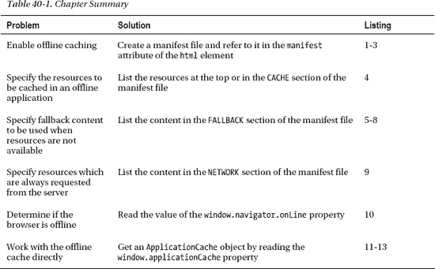
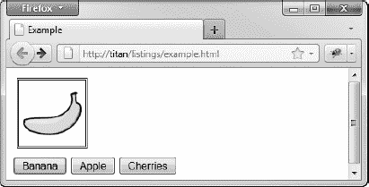
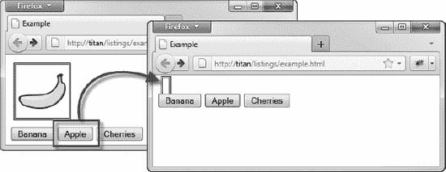
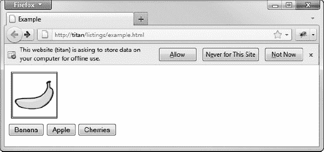
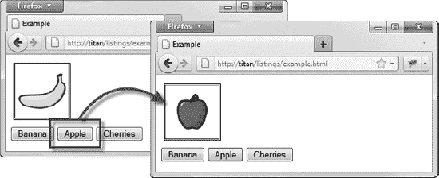
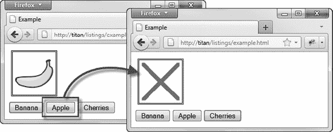
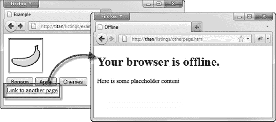
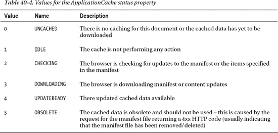
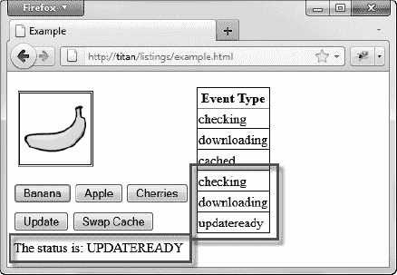
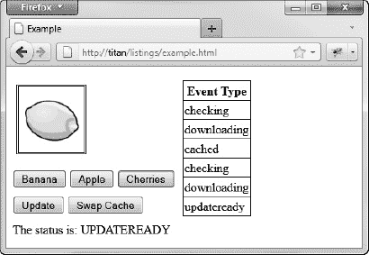

## 四十

## 创建脱机 Web 应用程序

离线应用程序缓存特性允许我们指定 web 应用程序需要的所有资源，这样浏览器就可以在加载 HTML 文档时下载所有资源。通过这样做，我们使用户能够继续使用我们的应用程序，即使他们没有网络接入。

在撰写本文时，本章中对特性的支持是非常可变的——我建议您将本章视为离线应用程序通常遵循的方向的路标，而不是禁止性的参考。表 40-1 对本章进行了总结。

### 定义问题

为了理解我们可以通过创建离线 web 应用程序来解决的问题，我们需要一个例子。清单 40-1 显示了一个非常简单的应用程序，它依赖于按需从服务器加载的资源。

*清单 40-1。一个简单的网络应用程序*

`<!DOCTYPE HTML>
<html>
    <head>
        <title>Example</title>
        
    </head>
    <body>
        
        

            <button id="banana">Banana</button>
            <button id="apple">Apple</button>
            <button id="cherries">Cherries</button>
        

        
    </body>
</html>`

有一个`img`元素，它的`src`属性被设置为响应`button`的按压。不同的按钮将导致浏览器从 web 服务器请求不同的图像。在应用程序的整个生命周期中，可能需要三个映像:

*   `banana100.png`
*   `apple100.png`
*   `cherries100.png`

其中一个图像`banana100.png`在文档加载时被加载，因为它被指定为`img`元素的`src`属性的初始值。您可以在[图 40-1](#fig_40_1) 中看到文档在浏览器中的显示。

*图 40-1。一个简单的网络应用*

我在本章中使用了 Firefox，因为它有一个容易访问的离线模式(在`File – Web Developer`菜单中有一个选项)。当我将浏览器切换到离线状态时，我们可以看到我试图解决的问题，这模拟了失去网络连接，而我不必禁用我的无线适配器，如图 40-2 所示。

*图 40-2。离线时请求不可用的资源*

当我按下`Apple`按钮时，浏览器试图加载`apple100.png`图像，但是，当然，没有网络连接，请求失败。但是，如果我单击`Banana`按钮，就会显示正确的图像，因为`banana100.png`从文档第一次加载时就在浏览器缓存中。我们创建脱机应用程序的目标是确保我们需要的所有资源都可用，以便应用程序即使在脱机时也能工作。

### 定义清单

清单允许我们列出脱机工作所需的所有资源。清单 40-2 显示了示例 web 应用程序的清单。

*清单 40-2。一份简单的清单*

`CACHE MANIFEST
example.html
banana100.png
apple100.png
cherries100.png`

清单文件是一个简单的文本文件。第一行总是`CACHE MANIFEST`，然后我们列出应用程序所需的资源，每行一个。

 **提示**离线应用的规范建议我们将 HTML 文档本身添加到清单中，即使在清单被加载和读取时它已经在浏览器缓存中了。

清单文件没有固定的命名方案，但是最常用的是后缀`.appcache`。我将示例中的文件保存为`fruit.appcache`。无论您使用什么命名方案，您都必须安排 web 服务器使用`text/cache-manifest` MIME 类型向浏览器描述内容。

 **注意**如果服务器没有正确设置 MIME 类型，浏览器将不会使用缓存文件。

我们通过`html`元素的`manifest`属性将清单文件与文档关联起来，如[清单 40-3](#list_40_3) 所示。

*清单 40-3。将清单文件与 HTML 文档相关联*

`<!DOCTYPE HTML>
<html **manifest="fruit.appcache"**>
    <head>
        <title>Example</title>
        
    </head>
    <body>
        
        

            <button id="banana">Banana</button>
            <button id="apple">Apple</button>
            <button id="cherries">Cherries</button>
        

        
    </body>
</html>`

当我们将`manifest`属性应用到`html`元素时，浏览器可能会提示用户允许我们在本地存储离线内容。浏览器处理这种情况的方式各不相同。Chrome 和 Opera 允许我们在不提示用户的情况下缓存离线数据。另一个极端是 Firefox，它需要用户的明确批准，如图[图 40-3](#fig_40_3) 所示。

*图 40-3。寻求用户许可存储离线数据*

浏览器将下载清单中指定的所有内容，即使这些内容尚未被要求。对于我们的简单应用程序，这意味着我们的三个图像都被下载了。现在应用程序继续正常工作，甚至当我离线时，如[图 40-4](#fig_40_4) 所示。

*图 40-4。创建离线应用*

如您所见，创建离线 web 应用程序非常简单。我们只需创建清单，确保它包含我们的应用程序需要的资源，然后在文档中的`html`元素上设置`manifest`属性的值。

#### 指定清单部分

我们可以向清单文件添加不同的部分。有三个不同的部分可用，我将在接下来的部分中进行描述。

##### 定义高速缓存部分

我们可以在清单的开头列出需要缓存的文件，或者在文件中创建一个`CACHE`部分。清单 40-4 给出了一个例子。

*清单 40-4。定义缓存清单文件段*

`CACHE MANIFEST

example.html
banana100.png

**CACHE:**
**apple100.png**
**cherries100.png**`

我将一些资源放在 manifest 文件开头的 default 部分，其他放在`CACHE`部分。这相当于前面的清单，但是它允许我们在我在下一节描述的其他部分之后定义我们想要的资源。

#### 定义回退段

`FALLBACK`部分允许我们指定浏览器应该如何处理清单中没有包含的资源。清单 40-5 给出了一个例子。

*清单 40-5。在清单中定义回退部分*

`CACHE MANIFEST

example.html
banana100.png

**FALLBACK:**
***.png offline.png**

CACHE:
apple100.png`

在这个例子中，我添加了一个后备部分。这个新部分包含一个条目，它告诉浏览器当它需要一个没有离线缓存的`png`文件时，应该使用 offline.png 文件。

 **提示**我们不需要将后备资源添加到清单的缓存部分，因为浏览器会自动下载后备资源。

我已经从缓存部分删除了`cherries100.png`,这样我们就有了应用程序需要但不可用的资源。你可以在[图 40-5](#fig_40_5) 中看到浏览器如何处理回退。

*图 40-5。使用回退内容*

`offline.png`图像是一个简单的十字。为图像提供后备并不理想，但至少我们可以维护页面的结构和布局。回退对于链接到其他文档可能更有用。[清单 40-6](#list_40_6) 显示了我们的 web 应用程序文档的一个变更，它包含了一个到另一个 HTML 文件的链接。

*清单 40-6。向另一个文件添加链接*

`<!DOCTYPE HTML>
<html manifest="fruit.appcache">
    <head>
        <title>Example</title>
        
    </head>
    <body>
        
        

            <button id="banana">Banana</button>
            <button id="apple">Apple</button>
            <button id="cherries">Cherries</button>
        

**        <a href="otherpage.html">Link to another page</a>**
        
    </body>
</html>`

然后，我们可以创建一个后备文档，如果我们链接到的 HTML 文件不在脱机缓存中，将使用该文档。我已经调用了这个页面`offline.html`，它的内容显示在[清单 40-7](#list_40_7) 中。

*清单 40-7。offline.html 文件*

`<!DOCTYPE HTML>
<html>
    <head>
        <title>Offline</title>
    </head>
    <body>
      <h1>Your browser is offline.</h1>
      Here is some placeholder content
    </body>
</html>`

然后，我们可以向缓存清单文件添加一个回退条目，如清单 40-8 所示。

*清单 40-8。向 HTML 文件清单添加回退条目*

`CACHE MANIFEST

example.html
banana100.png

FALLBACK:
*.png offline.png
*** offline.html**

CACHE:
apple100.png`

我链接到的文件(`otherpage.html`)不在清单中，因此不会包含在脱机缓存中。如果我在脱机状态下点击主文档中的链接，我会看到后备文档，如图 40-6 所示。(回退页面显示的消息不是特别有用，但它演示了该功能。在真实的应用程序中，我们可以显示更有用的消息，甚至可以定义脚本，用脱机缓存中的资源提供某种简化的功能。)

*图 40-6。对 HTML 文档使用回退内容*

#### 定义网络段

清单文件的`NETWORK`部分定义了一组不应该被缓存的资源，以及浏览器应该总是从服务器请求的资源，即使是在离线时。[清单 40-9](#list_40_9) 显示了`NETWORK`部分的使用。

*清单 40-9。在清单中定义网络段*

`CACHE MANIFEST

example.html
banana100.png

FALLBACK:
* offline.html

**NETWORK:**
**cherries100.png**

CACHE:
apple100.png`

在这个例子中，我已经将`cherries100.png`图像添加到了`NETWORK`部分。这意味着浏览器将尝试从服务器请求这个图像，即使在离线时也是如此(尽管如果图像是在清单之外加载的，它将使用图像的缓存副本，也就是说，用户在浏览器离线前按下`Cherries`按钮)。

 **提示**让一个离线应用程序拥有一个网络部分可能看起来很奇怪，但是浏览器即使在线也会使用缓存的数据。

### 检测浏览器状态

我们可以通过`window.navigator.onLine`属性来判断浏览器是在线还是离线，这个属性在[表 40-2](#tab_40_2) 中有描述。

只有当浏览器确定它处于脱机状态时，该属性才是确定的。一个`true`值并不能确定浏览器是否在线，而是不能确定它是否离线。清单 40-10 展示了这个属性的使用。

*清单 40-10。检测浏览器的状态*

`<!DOCTYPE HTML>
<html>
    <head>` `        <title>Example</title>
    </head>
    <body>
        The browser is: unknown.
        
    </body>
</html>`

你可以在图 40-7 中看到这两种状态，这是在 Firefox 中使用方便的离线模式实现的。在现实生活中，这种状态很少如此确定。浏览器可以自由地对自己的状态进行评估，大多数浏览器不会默认离线，直到他们尝试并未能发出请求(另一方面，一些移动浏览器一旦失去网络覆盖就会进入离线模式)。

*图 40-7。检测浏览器状态*

### 使用离线缓存

我们可以通过调用返回一个`ApplicationCache`对象的`window.applicationCache`属性来直接使用离线缓存。该对象定义的成员在[表 40-3](#tab_40_3) 中描述。

 **注意**这是一个高级话题，使用缓存机制会令人非常沮丧。在使用我在本节中描述的对象和技术之前，问问自己是否真的需要控制缓存。

T2】

`status`属性将返回一个数值，该数值对应于[表 40-4](#tab_40_4) 中显示的集合。

除了方法和状态属性之外，`ApplicationCache`对象还定义了一组当缓存状态改变时触发的事件。这些事件在[表 40-5](#tab_40_5) 中描述。

我们可以结合这些方法和`status`属性的值来明确控制离线缓存，如[清单 40-11](#list_40_11) 所示。

*清单 40-11。直接使用应用缓存*

`<!DOCTYPE HTML>
<html manifest="fruit.appcache">
    <head>
        <title>Example</title>
        
    </head>
    <body>
        

            
            

                <button id="banana">Banana</button>
                <button id="apple">Apple</button>
                <button id="cherries">Cherries</button>
            

            

                <button id="update">Update</button>
                <button id="swap">Swap Cache</button>
            

            The status is: 
        

        <table id="eventtable" border="1">
            <tr><th>Event Type</th></tr>
        </table>
        
    </body>
</html>`

这个例子包含了调用`ApplicationCache`对象的 update 和`swapCache`方法的按钮。该脚本还定义了一些事件的监听器，并在一个`table`元素中显示事件类型。接下来，我们需要一份清单。[清单 40-12](#list_40_12) 显示了这个例子中使用的一个。

*清单 40-12。缓存示例的清单*

`CACHE MANIFEST

CACHE:
example.html
banana100.png
cherries100.png
apple100.png`  `FALLBACK:
* offline.html`

清单上没有什么新东西。它列出了主文档、它使用的图像文件和一个常规的后备文档。你可以在[图 40-8](#fig_40_8) 中看到该示例是如何显示的。

*图 40-8。手动控制缓存*

在这个图中有两点需要注意。首先是事件的顺序。当加载文档时，浏览器检测到`html`元素上的`manifest`属性，并开始下载和缓存内容。您可以在 table 元素中看到它的效果——触发了`checking`、`downloading`和`cached`事件。

#### 进行更新

为了改变缓存，我们必须在服务器上进行某种更新。为了将樱桃换成柠檬，我将简单地用我的柠檬图像覆盖服务器上的`cherries100.png`文件。需要澄清的是:文件名仍然是 cherries100.png，但是内容已经改成了柠檬。

当我们在`ApplicationCache`对象上调用`update`方法时，浏览器检查清单文件是否已经改变；但是，它不会检查清单中指定的任何单个文件是否被修改。因此，为了让浏览器加载我修改过的图像，我还需要对清单文件进行更改。为了简单起见，我更改了回退 HTML 文件的名称，如[清单 40-13](#list_40_13) 所示。

*清单 40-13。对清单文件*进行更改

`CACHE MANIFEST

CACHE:
example.html
banana100.png
cherries100.png
apple100.png`  `FALLBACK:
* offline2.html`

 **警告**调试离线缓存时产生混乱的一个主要原因是浏览器遵循清单文件中各个条目的缓存策略。这意味着，如果您对不同类型的内容设置了不同的缓存过期头，您可能会陷入真正的混乱，因为浏览器会检查一些内容的更新，而不会检查其他内容。要在缓存中获得即时更改(嗯，即时排序——参见本节后面的注释),最安全的做法是设置 web 服务器，使其将`Cache-Control`头设置为`no-cache`。这告诉浏览器不要在每次需要资源时检查更新(尽管您不希望在生产服务器上这样做)。

#### 获取更新

既然我们已经在服务器上做了更改，我们可以要求浏览器更新离线缓存。为此，按下`Update`按钮。效果如图[图 40-9](#fig_40_9) 所示。

*图 40-9。将更新下载到离线缓存*

将显示新的事件序列(`checking`、`downloading`、`updateready`)，缓存的状态将变为`UPDATEREADY`。此时，浏览器已经下载了修改后的内容，但是还没有应用到我们正在使用的缓存中，也就是说点击`Cherries`按钮仍然会向我们展示一张樱桃的图片，尽管浏览器已经下载并缓存了同名的柠檬替代品。

#### 应用更新

当我们准备好接收更新的内容时，我们可以按下`Swap Cache`按钮，这将调用`ApplicationCache`对象上的`swapCache`方法。更新后的内容被应用到我们应用程序的离线缓存中。

 **注意**使用缓存时的另一个困惑是应用更新的影响。这些更改仅在下一次从缓存中请求资源时使用。这意味着浏览器不会重新加载任何缓存的样式表或脚本文件，您必须显式重新加载包含它们的文档才能从任何更改中受益。

当我们按下`Cherries`按钮时，我们会看到柠檬的图片，如图[图 40-10](#fig_40_10) 所示。

*图 40-10。将更新应用到离线缓存*

 **注意**最后一个令人沮丧的地方是，在应用更新和文档中使用的更新内容之间可能会有一个滞后。在写这一章的时候，我遇到了从几秒钟到 10 分钟甚至更长的延迟。

### 总结

在这一章中，我已经向你展示了如何创建脱机应用程序，即使在浏览器不能连接到网络时也能正常工作。这是一个非常有用的特性，一旦你得到了你需要的配置，结果会非常好；然而，用应用程序缓存进行测试和调试可能是一个令人抓狂的过程，尤其是当您通过`ApplicationCache`对象直接控制缓存时。