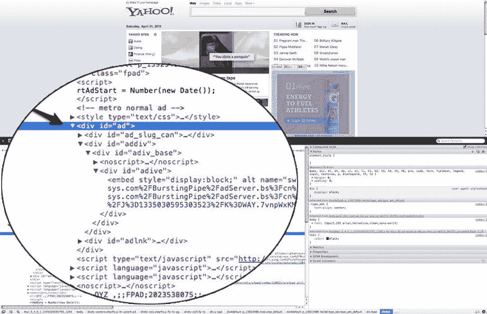
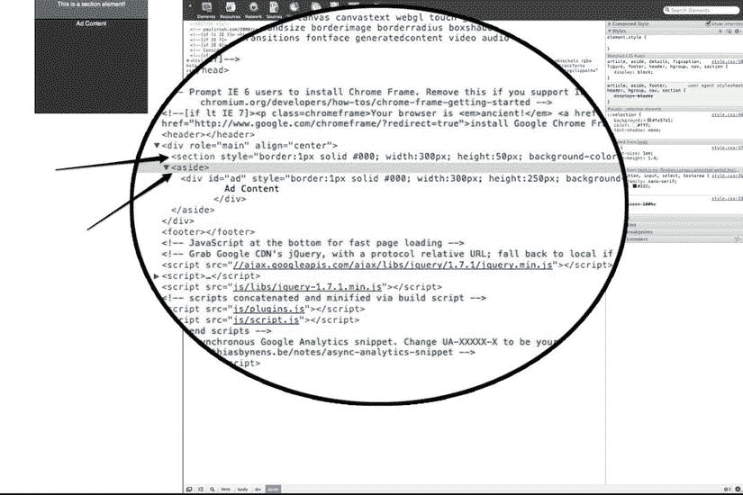

# 三、网络标准广告

这一章将讨论 HTML5 和开放网络标准的新的和有用的特性，你可以在你的下一次广告活动中利用它们。要记住的是，HTML5 不仅仅是 HTML 标记的进步；在其他技术中，它还开创了新的 JavaScript APIs 和 CSS 特性。将研究一些 HTML5、CSS3 和 JavaScript 技术，您将看到如何将它们结合使用来增强现代浏览器市场中的创造性开发。

众所周知，网络广告经历了许多阶段:静态图像、动态 gif、基本的 HTML 广告、Flash 的丰富功能。现在 HTML5 和现代网络堆栈正在建立一个新的发展阶段。随着这本书的继续，我将介绍随着新兴 web 标准的成熟，设计人员和开发人员遇到的一些常见陷阱，您将看到如何立即使用这一新规范，同时为使用旧浏览器的用户提供良好的回退。

我已经讨论了 HTML5 广告世界中的富媒体广告是如何产生的；因此，让我们假设从这一点开始，网络上的所有广告都将被认为是“丰富的”和高度互动的。本章旨在让你完全掌握使用新兴网络技术处理广告时的一些细微差别。我将介绍 HTML5 中的一些新特性，利用 API，优化您的代码以跨发行商高效运行。

然而，首先要做的是。确保您使用的是最新版本的 Safari、Internet Explorer、Chrome、Opera 或 Firefox。因为我将会先看一下本章中的一些代码，所以你拥有一个现代化的浏览器是很重要的。把这一章当作入门，因为它将全面展示 HTML5 的前景及其对整个网络广告的影响。接下来的每一章都将着重于更深入地研究这里讨论的技术，但这是你涉足的地方。所以让我们开始吧！

HTML5 广告

HTML5 已经带来了——在撰写本文时,*还在带来—*许多对网页内容创作的增强。这本书的重点是 HTML5 及其各种技术如何影响在线广告市场，但我强烈建议你学习更多关于 HTML5 标记以及它如何影响整个网络的知识。像<文章>、<旁白>、<细节>、<页眉>、<页脚>和<部分>——以及<画布>、<视频>、<音频>，以及其他一些我们将在后面详细介绍的标签——都是 HTML5 规范中的新标签。有了这些新标签，开发人员和设计人员可以在浏览器中本地创建语义和逻辑标记。一定要看看 W3C( `w3.org/TR/2011/WD-html5-20110525`)和 WHATWG ( `whatwg.org/specs/web-apps/current-work/multipage`)对 HTML5 的最新看法，看看它如何影响整个网络。也就是说，新兴的和有竞争力的浏览器厂商现在正在整合 HTML5 的特性，允许开发者用这些即将成为标准的 HTML 语义来定义文档的结构。

使用

因为知道用什么元素包装你的广告内容才是这里真正关注的，所以一些 HTML5 特性——那些与广告空间相关的特性——比其他特性更重要。在 HTML 规范的早期版本中，文档的结构通常用

标签以及特定的 id 和类来标记，因此发布者可以在他们的页面标记中的特定部分插入广告代码。使用< div >标签，出版商和内容开发者可以将他们的页面分割为标题、导航、广告和其他特定内容。例如，在开发网站属性时，拥有一个名为 header、footer 或 ad 的< div >容器可以提供一个非常标准的结构。以来自出版商雅虎的[图 3-1](#Fig1) 中的例子为例。



[图 3-1。使用 Chrome 的 inspect 元素功能对雅虎页面进行标记](#_Fig1)

图 3-1 展示了雅虎实际上使用了一个 ID 为“ad”的广告容器 div。这告诉其他开发者页面的这一部分是为广告设计的(广告位)。如果您检查任何页面，您会发现标记中的其他 div 指定了其他元素，如“y-header”和“y-footer”，这是 Yahoo 标记的特定命名约定。

新的广告容器选项:

<section>和</section>

有了新的 HTML5 标记元素，开发者可以利用两个新的广告容器元素:

<section>和

<aside>。section 元素有助于为特定内容划分页面。例如，您可以将页面划分为广告内容、博客文章甚至图片。对于出版商来说，将广告内容放在带有特定 id 的包装 div 中是一个特别好的主意。这很有帮助，因为页面上的广告和其余内容没有其他相关联的语义。</aside>

</section>

<aside>标签表示页面内容的一部分，松散地连接到

<aside>元素周围的内容，这意味着如果广告服务器根据上下文提供广告消息，

<aside>标签将是广告的精确容器。这很可能只有在出版商为上下文体验安排了特定的广告清单的情况下才行得通。看一下 HTML5 第 3 页的图 3-2 中的例子。</aside>

</aside>

</aside>



[图 3-2。](#_Fig2)浏览器中 section 和 aside 元素的标记

数据属性

HTML5 中另一个有趣的特性是新的数据属性。这种属性添加起初可能看起来有点疯狂，但是它提供了一些非常好的用例，尤其是在广告领域。使用广告标记中的数据属性，您可以自定义特定元素的特定值。例如，在广告投放中，所谓的宏通常用于在广告投放时将变量替换为其他值；它的使用方式取决于广告面向的出版商，以及在将广告呈现到页面之前我们可以了解的其他信息。这个宏值非常类似于传统编码语言中的变量，通常看起来像$MACRO$，？？宏？？，或者类似的东西，这取决于广告服务公司及其解析特定字符以插入值的能力。宏值可以通过数据属性添加到广告的标记中；当提供广告时，根据广告服务器收集的信息，该属性将被应该存在的值所替换。[清单 3-1](#list1) 展示了如何通过替换一个广告的点击 URL 来让同一个广告创意服务于许多出版商。点击 URL 可以根据广告服务器动态变化的事实有助于您在多个出版商之间传播相同的创意，但仍希望拥有唯一的点击 URL。

[***清单 3-1。***](#_list1) 一个广告投放宏的例子

```html
<!DOCTYPE HTML>
<html>
<head>
<meta http-equiv="Content-Type" content="text/html; charset=UTF-8">
<style type="text/css" media="screen">
#clickBtn {background-color:#000; width:100px; height:20px; color:#FFF; cursor:pointer;}
</style>
</head>
<body>
<div align="center" id="clickBtn" data-link=$MACRO$onClick=window.open(macroValue)>Open Macro</div>
</body>
<script type="text/javascript">
var macroValue = document.getElementById('clickBtn').getAttribute('data-link') //returns value to be replaced by ad server
</script>
</html>
```

在广告投放时，$MACRO$值被广告服务器定义的值所替换。这种情况下可能会出现$ MACRO $ =[http://www.google.com](http://www.google.com)或[http://www.bing.com](http://www.bing.com)的情况。简而言之，数据属性的规则规定，任何以“data-”开头的属性都将被视为最终用户看不到的存储区域。同样，当您试图在不改变元素的外观或感觉的情况下指定关于元素的显式信息时，这是非常有价值的。

HTML5 注意事项

应该注意的是，HTML5 新增加的标记是辅助技术的巨大进步，因为它们允许机器更好地解释文档的结构以进行解析和解释。然而，由于广告往往只存在于其活动的生命周期中，通常最多几个月，所以在一个良好的 ol' common div 标签中发布广告通常会更好，并应用特定的 id 和类。我发现这是出版商和广告网络最常用的方法。

还应该注意到，每个发布者将具有其自己的用于在其整个网络内容中构建广告清单的实现。也就是说，我能给出的最好建议是直接联系出版商，了解他们是否使用 HTML5 元素，溢出设置为 none 的 div，或者甚至是作为广告包装元素的 iFrame。虽然这可能不是每个活动都要关心的问题，但是更复杂和交互式的活动可能需要操作站点的元素或跳出 iFrame，所以这些信息可能是至关重要的。如果你想了解更多关于 HTML5 构建模块的信息，或者你对这些有点困惑，看看来自 html5doctor.com[T4](http://html5doctor.com)[的图 3-3](#Fig3) 中的图片。


[图 3-3。](#_Fig3)HTML5 医生的 html 5 元素选择器流程图

HTML5 已经有了太多的新元素，到最终规范发布时，可能会有更多的新元素。更多的新的和更新的元素将涵盖在整本书。

 **注意**有关 HTML5 元素索引的最新信息，请访问`html5doctor.com/element-index`。

对于 web 创建者来说，HTML5 中新的语义标记在创建结构良好、搜索引擎友好的 web 内容时非常有价值。它改善了整体搜索引擎优化(SEO)，因为像谷歌这样的搜索巨头可以更有效地解析页面内容，将页面内容与其结构分离开来。这也有助于开发人员在跨属性开发时保持标准的命名实践，因为标记名称现在将保持不变。例如，现在将有页眉和页脚标签，就像头和正文标签一样。

 **注意**兼容 HTML5 的浏览器不需要在属性周围加引号。比如< div id="ad" > < /div >现在可以写成< div id=ad > < /div >。

安全 iframe

正如上面简要提到的，打破 iFrame 是需要发生的事情，以确保广告在网络或出版商的页面上提供丰富的体验。然而，将广告呈现在发布者的文档上可能会产生名称空间冲突和引用变量。例如，如果广告有一个名为照片库的元素，网页也是如此，对该元素的任何操作都可能传递给广告体验，甚至破坏页面内容。在广告创意的 Flash (SWF)时代，这并不是一个问题，因为 SWF 元素本来就在出版商页面的沙盒中。必须有一种更好的方式来提供丰富的 HTML 体验，可以从出版商的内容沙盒，对不对？

如果您认为将广告内容包装在 iFrame 中可以解决所有这些混乱，那么您绝对是正确的。然而，iFrame 限制了体验的丰富性，因为它将广告限制在页面上的特定区域；此外，对于页面来说，这有点占用内存，因为它创建了文档的一个新实例，一个可能不需要的实例。(想象一下，如果页面上有多个 iFrames，甚至多个 iFrames 嵌套在一起，会发生什么情况。)

传统上，使用发布者端脚本，广告可以检查该脚本是否在适当的位置并突破发布者指定的 iFrame。这是绝对必要的，因为大多数丰富的广告体验需要扩展和关闭功能。然而，一旦广告被删除并写入发布者页面的主文档，同样的规则也适用于 CSS 继承和 JavaScript 变量范围。因此，冲突和样式问题可能会出现——事实上，它们肯定会出现。

基于 iFrame 可以保护您免受出版商内容影响的知识，如何提供一个通用 API，一个允许 iFrame 扩展和收缩以及将有价值的指标收集到广告体验中的 API？IAB 和各种工作组成员正在致力于一项名为“安全 iFrames”的计划，该计划旨在成为出版商和广告之间的协议，并成为一个通用的 API，允许“丰富”广告在 iFrames 内被沙箱化，并且仍然可以访问特定的扩展和收缩命令等。发布者将有效地向 iFrame 添加一些代码，以允许广告调用发布端函数来展开和折叠。虽然这种方法需要标准化和采用，以成为一种可扩展的方法，但它在处理页面内容和广告冲突方面有一定的前景。(我模拟了一个简单的例子来说明您可以在`jsbin.com/omodus/5`展开或折叠实际的 iFrame。)请记住，这将涉及到发布者端的特殊代码；它将控制页面上 iFrame 的功能和动画，而不是第三方广告服务器标签。

 **注意**出版商甚至有可能使用 MRAID API 来提供广告标签。在第 9 章的[中寻找更多关于 MRAID 规格的信息。](09.html)

HTML5 更多与广告相关的特性将在本书后面讨论。HTML5 是关于更新和推动网络整体向前发展的；广告是这一过程的关键部分。浏览器中更新的任何东西都会对广告产生影响。

用 CSS3 做广告

正如您刚刚了解到的，HTML5 对页面的整体结构进行了许多增强，包括添加、删除或修改。当然，伴随标记结构而来的是风格。CSS 长期以来一直是浏览器风格的支柱，随着现代浏览器采用 CSS3 特性 ，包括谷歌、苹果和 Mozilla 在内的许多制造商正在利用最新的 CSS3 附件来处理 web 动画和演示，这是前所未有的。因为 CSS3 是如此强大的设计工具集，设计师现在可以利用它直接在浏览器中创建丰富的、值得打印的图形。他们不再需要依赖 Flash 或使用图像来创建他们追求的设计。

对于 CSS 来说，有些事情是必须的，因为每个制造商对于最新的 CSS3 规范都有自己的解释和采用率。首先，供应商在其环境中经常有可变性。这种不一致性以 CSS 重置的形式为设计者带来了代价，这是跨浏览器重置呈现元素所必需的。尼古拉斯·加拉格尔的 normal . CSS(`necolas.github.com/normalize.css`)是新兴浏览器的一个非常有用的工具，它让所有浏览器，无论是旧的还是最新的，都可以一致地呈现元素，而不会应用不必要的样式。

一个好的建议是从你的广告的顶层元素向下重置。这意味着，如果您将整个广告包装在一个充当广告容器的 div 元素中，您可以将一个名为“adContainer”的类应用于该 div。现在，在 CSS 文档中，您可以简单地通过编写以下内容来添加特定的重置或样式:

```html
#adContainer .adBanner {

}
```

这样，只有广告标记中的元素被作为目标，并且这保持了发布者页面内容和广告内容之间的清晰分离。

除了重置之外，如果您部署的浏览器碰巧与 HTML5 不兼容，您将需要优雅的故障转移来正确设置页面样式。一个很好的例子是在网站`CSS-Tricks.com`上。该网站实际上在 IE6 这样的旧浏览器中降级得非常好，但当用户的浏览器支持并能够增强体验时，它利用了新兴的 CSS3 功能。这种被称为渐进增强的技术也可以应用到你的广告创意中。如果你正在运行一个需要针对任何和所有用户的活动，并且没有指定一个浏览器版本，不管是否符合 HTML5，总是要考虑到老年用户来构建广告体验。维护核心功能和消息传递，并构建更新的浏览器能够处理的更丰富的功能。

规则

CSS 规范还有一个 at-rule 索引。At-rules 用于以各种方式处理 CSS 文档并指示 CSS 解析器。这里有一些流行的 at 规则。

*   @charset:这指定了外部样式表的字符集。
*   @import:这将外部样式表文件导入到当前样式表中。
*   @media:这指定了应该应用样式的媒体。
*   @page:这为分页媒体的样式表中的页面框指定了边距值。
*   @font-face:这定义了自定义字体属性。

以上所有规则都允许设计者根据请求风格化内容的机器或设备来创建特定的视觉体验。

正如您在简介中看到的，CSS 媒体配置文件用于请求呈现 web 内容的不同显示。屏幕、打印、手持和电视(仅举几个例子)允许基于视觉的内容在请求内容的设备上动态更新。如果你正在部署一个跨设备的活动，这个特性会非常有用，因为它允许设计师在设计阶段考虑许多不同的显示。此外，CSS 可以通过@import 规则集(见上文)用作外部链接，或者作为链接文件添加到 HTML 文档中。但是它也可以用作 HTML 元素的内联样式。这两种技术的使用都有值得争议的优点和缺点，不胜枚举。开始开发时，您应该相应地权衡您的选择。

我个人的发展方式是从形式和功能外化风格。这样做可以在不接触标记或 JavaScript 的情况下轻松更新布局。另一方面，一些广告平台要求您的 CSS 保持内联，并与内联 HTML 标记捆绑在一起。这种情况，显然很难扩展，有时是一种需求；因此，一定要保持样式的良好格式，因为您可能需要返回代码并执行更新和修订。然而，如果你被允许外部化你的 CSS 文件(我真的希望你可以)，我最喜欢的 CSS 开发工具之一是`bearcss.com`，它允许上传你的原始 HTML 标记，并为你构建一个样板 CSS 模板。这是一个巨大的时间节省，因为您不需要在构建标记后重写一堆元素声明。

供应商前缀

随着 CSS level 3 规范在 HTML5 中被采用，每个浏览器制造商都使用自己的前缀来区分浏览器渲染引擎中的标准内容。因此，使用新兴的 CSS 功能，您需要包括 Webkit、Mozilla、Microsoft 和 Opera 的前缀——假设您将在下一个 HTML5 活动中针对所有浏览器(通常是这种情况)。供应商前缀的几个例子分别是，-webkit，-moz，-ms 和-o；在使用新兴的 CSS 规范构建时使用这些前缀 将确保您在各自的浏览器环境中拥有最新的前沿 CSS3 特性集。

 **注意**随着规范在各种浏览器中被采用，对这些前缀的需求将会减少，结果是开发人员将不得不回到代码库中删除它们，这样一旦对带前缀版本的代码的支持下降，就不会有任何东西破坏代码。

众所周知，广告的生命周期通常比传统的网页内容要短得多，但是在部署内容时记住供应商前缀非常重要。如果你想现在就做一些对未来可持续的事情，失败将是一个真正的痛苦。尽管你正在使用的特性可能会在浏览器的后续版本中被删除，但是你可以把任何带有厂商前缀的东西看作是对即将到来的事情的一个偷偷的高峰。在使用这一新兴标准进行开发时，一个非常好的工具是`prefixer.com`。Prefixer 允许你用 CSS 开发。只需点击一个按钮，它就会自动为您翻译所有必要的供应商前缀，这又是一个巨大的时间节省！有关最新的 CSS3 规范，请访问 W3C 当前草案，网址为`w3.org/Style/CSS`。

媒体查询

CSS 的一个非常重要的功能是利用媒体查询的能力 ，这个功能从第 2 版开始就有了，但是被归入了 CSS3。媒体查询允许您执行该术语所述的操作:查询设备或屏幕上支持的媒体。有用的媒体示例包括设备宽度、设备高度、像素密度和方向。这些特性在移动开发中非常重要，是响应式 web 设计的基础。通过使用它们，开发人员可以创建一个 CSS 文档，根据访问设备动态调整 web 内容。一些非常棒的响应式 web 设计框架是 Foundation ( `foundation.zurb.com`)、320 及以上(`stuffandnonsense.co.uk/projects/320andup`)和黄金网格系统(`goldengridsystem.com`)。这些工具为在屏幕上开发单一的统一体验提供了蓝图。

这种方法在 web 开发领域很棒，但是请注意，当用这种格式构建广告时，几乎可以肯定 k-weight 会增加，因为您要考虑不止一个屏幕——这意味着更多的 CSS 声明。在开发之前，我建议联系你的出版商，确定他们是想要一个响应性的广告布局还是为所有屏幕变化生成新的标签。事实上，这取决于出版商想要什么。通常会有更多的广告库存出售，所以如果用户重新定位他们的设备或在响应性布局上缩放他们的浏览器，他们会给人留下不止一个印象。广告清单将改变而不是适应，这将导致发行商看起来更多的广告清单，并且将需要广告服务器为每个尺寸生成单独的标签；发布者或第一方广告服务器将需要相应地调整。一个好的做法是将 CSS 内容剥离成必要的部分，并通过使用媒体查询加载特定于设备的外部样式表。这样，您就不会为在不符合所应用的媒体查询规则的移动设备上查看的用户带来不需要的 CSS 代码，或者更糟糕的是，在带宽非常有限的设备上查看。使用我们之前的例子，[清单 3-2](#list2) 利用了对平板设备和电视的媒体查询，并考虑了它的方向。

[***清单 3-2。***](#_list2) 某媒体查询示例

```html
<!DOCTYPE HTML>
<html>
<head>
<meta http-equiv="Content-Type" content="text/html; charset=UTF-8">
<link rel="stylesheet" media="all" href="base.css" />
<link rel="stylesheet " media="all and (orientation:portrait) " href="tablet_portrait.css">
<link rel="stylesheet " media="all and (orientation:landscape) " href="tablet_landscape.css">
<link rel="stylesheet" media="tv" href="tv.css" />
</head>
<body>
<div align=center id=clickBtn data-link=$MACRO$ onClick=window.open(macroValue)>Open Macro</div>
</body>
<script type="text/javascript">
var macroValue = document.getElementById('clickBtn').getAttribute('data-link') //returns $MACRO$
</script>
</html>
```

因为这样做显然需要额外的开发和设计时间，所以请确保您的团队了解这一点；仅当您知道您的广告将在需要响应式布局的发布商之间运行时，才使用此方法。(有关 CSS3 媒体查询的更多信息，请访问`w3.org/TR/css3-mediaqueries`。)

 **注意**在 HTML5 doc 解析器中，不再要求包含 type = " text/JavaScript "；这是现在默认的假设。因此，编写<脚本></脚本>现在可以工作了。

响应式广告在成为现实之前还有时间成长。这归结于出版商和广告服务器如何收集广告的指标，而这是可以改变的。这是一种思维模式的转变。传统上，广告服务器和发行商根据印象向客户收费，并将影响这些印象的广告分成大小类别，以更细致地了解广告活动的表现。然而，如果你在页面上有一个广告标签，并允许创意者相应地调整大小和重新布局，那么就不需要考虑其他标签。这是广告运营人员的一个梦想——他们不必担心哪个标签在哪个分销渠道上到达哪个酒店。无论是智能手机、平板电脑、台式机还是电视，都是一样的标签，因此广告交易的运营规模是一个巨大的胜利！然而，客户肯定想知道什么尺寸的广告获得了最多的浏览量，因为这将有助于确定访问该广告的用户群。下面的模型(见[清单 3-3](#list3) )有助于进一步分解这一点；它允许标签跟踪一个主要的活动印象，并根据呈现在用户屏幕上的创意大小来发出补充印象。

[***清单 3-3。***](#_list3) 一个响应式广告的例子

```html
var publisherSize;//Get this value from the publisher's page.

window.addEventListener('load', function () {
//fire off uber impression
var img = new Image()
img.src = 'http://imptracker.adserver.com';
//Pass publisher's layout to the checkSize function
checkSize(publisherSize);
}, false);

function checkSize (creativeSize) {
                //Check the size to fire off supplementary impression
        switch (creativeSize) {
             case "300x50" :
                  http://sizetracker.adserver.com/300x50
                  break;
             case "300x250" :
                  http://sizetracker.adserver.com/300x250
                  break;
             case "728x90" :
                  http://sizetracker.adserver.com/728x90
                  break;
       }
}
```

由于每个创意都是不同的，这个例子没有考虑要应用的 CSS 样式规则或所有的广告大小，因为它们依赖于发布者的页面，但它展示了如何为适应观众屏幕的广告收集相同的丰富指标。如果广告要从 publisherSize 变量中获得一个字符串值，广告服务器将能够发出正确大小的展示来进行报告。

选择器

CSS 规范中另一个有趣的部分是选择器。选择器 允许你以不同的方式定位你的标记中的特定元素。您可以通过 ID、类、标记名、类型甚至属性以及特定的值来定位它们。下面是 CSS 选择器的一些常见例子。

*   *:以文档中的每个元素为目标。
*   #ad:按 ID 定位元素。
*   。中心:按类定位元素。
*   header:按标记类型定位元素。
*   div + p:只针对 div 之前的元素。
*   footer > a:目标是 footer 的直接子级。
*   a[title]:通过属性 title 定位元素。

    **注意，以上元素仅为示例，请务必使用您自己的元素进行更新。*

上面的例子是 CSS 选择器在现实世界中如何工作的一些常见例子。我将在本书后面的例子中使用它们——但是请注意，它们远不止本章所讨论的那些。所以我强烈建议看一看 W3C 关于 CSS 选择器的最新文档。

 **注**关于 CSS3 选择器的更多信息，参见`w3.org/TR/selectors`。

伪类

CSS 的另一个有趣的特性是伪类。伪类很像选择器，但是它们有一个额外的层来对布局或交互做出反应。下面是一些 CSS 伪类 。

*   :主动:主动元素
*   :焦点:具有焦点的元素
*   :已访问:已访问的链接
*   :hover:被悬停的元素(记住这在触摸设备上不起作用)
*   :选择:用户当前选择的元素
*   :选中:选中的表单元素
*   :n-child(n):第 n 个兄弟元素(您也可以使用奇数/偶数关键字来代替这里的 *n*
*   :n-last-child(n):是第 n 个同级的元素，从最后一个同级开始计数

这些伪类对操纵你的广告布局非常有帮助。使用它们可以做任何事情，从将鼠标悬停在 CTA 元素上并改变其比例，到使用偶数和奇数编号来设计无序列表的样式。在接下来的章节中，伪类和选择器将被用来定位我们的元素。

 **注**关于 CSS3 伪类的更多信息，请访问`coding.smashingmagazine.com/2009/07/13/css-3-cheat-sheet-pdf`。

伪元素

最后，CSS 中也有伪元素；它们允许设计者将目标元素 相对于他们自己的标记和设计。以下是其中的几个。

*   *首字母:以文本的首字母为目标
*   *第一行:针对文本的第一行
*   * before:元素之前的目标
*   * after:元素之后的目标

使用伪元素，您可以极其轻松地快速获得类似杂志和报纸的类型布局。如果你想把一个段落的第一个字母加粗，或者简单地增加它的字体大小，伪元素是可以考虑的。与所有新兴事物一样，在您的活动中使用这些功能之前，或者如果旧的浏览器成为目标，请确保检查浏览器的兼容性。

CSS 预处理器

最近，代码开发方面的 web 进步真的起飞了！似乎每天都有另一种精品元语言被创造出来。其中一种语言是代码预处理器和开发人员创建的定制工具，以新的方式生成 CSS 和 HTML 标记代码。这些进步包括 SASS、LESS 和 HAML，它们是 CSS 和 HTML 预处理程序。

厚颜无耻

SASS，或语法上令人敬畏的样式表，是一种元语言:它位于普通 CSS 开发之上。SASS 最初由 Hampton Catlin 设计，旨在用比传统 CSS 开发更多的结构和风格来描述 CSS 文档。使用 SASS 需要编译器将 SCSS 文件翻译成普通的 CSS 文件，这样浏览器才能理解它们并完成它的工作。一个流行的 SASS 编译器是 Compass，位于`compass-style.org`。SASS 允许开发人员和设计人员快速生成动态代码，并轻松地更新和更改代码；因为它接受包含变量、混合和参数，所以它是开发 CSS 的真正逻辑和动态的方法。例如，您可以将背景颜色设置为名为$ BG-color:# ffffff；的变量。由于您的付费客户端经常希望将背景从白色改为黑色，因此开发人员很容易回到 SASS 代码库，将这一行更新为#000000，并让它在引用该变量的所有内容中扩散。这就是萨斯的真正力量发挥作用的地方！

较少的

Alexis Sellier 的 LESS ，是另一种动态样式表语言；它允许设计者利用类似于 SASS 的特性——变量、混合、嵌套规则、数学和带参数的函数。LESS 的主要区别在于它可以在客户端和服务器端环境中工作(“客户端”是指在用户的浏览器中，而“服务器端”是指托管服务器执行操作)。事实上，W3C 甚至考虑在未来将变量原生包含在 CSS 规范中(见`dev.w3.org/csswg/css-variables`)。这可能会成功，也可能不会，但是如果你等不及了，这些时髦的语言会让你开始学习。还有其他的 CSS 预处理程序——Stylus 就是其中之一——但是我希望您现在已经了解了他们的目标是解决什么。如果你正在构建更大更复杂的广告，这些广告反映了丰富的应用开发，从长远来看，使用预处理器可能会让你的生活更轻松。

 **注**有关使用 LESS 的更多信息，请访问`lesscss.org`。

低增生性急性髓细胞性白血病

最后，既然我们在预处理程序的主题上，我将提到 HTML 抽象标记语言(HAML)。HAML 是专门为 HTML 标记设计的预处理器；它可以帮助加速您的标记开发。我不会说得更详细，但是为了看看 HAML 是否适合你，请访问`haml-lang.com/try.html`并尝试一下吧！这些新的编码语言的全部前提是用更少的代码做更多的事情。我是说，真的，一个 CSS 变量？那真的太牛逼了！

用 JavaScript 做广告

正如我已经说过的，在本书的其余部分，你会看到很多关于 JavaScript 的内容。您可能记得 JavaScript 不仅处理页面的行为；它还可以控制功能和交互性。值得注意的是，有了 HTML5，我们现在可以利用的 JavaScript APIs 比以往任何时候都多。同样重要的是要注意，JavaScript 是一种解释型语言——不像 Flash 的 Actionscript 或 Objective-C 那样是编译型语言。

在这种情况下，浏览器被指示运行它理解的命令，从左到右和从上到下书写。如果您来自 Flash 开发领域，这可能是一种完全不同的思考方式，因为您几乎总是会遇到这样的问题:JavaScript 命令被解释到甚至还没有在标记中创建的元素上。由于常见的“空对象引用”，这通常会导致错误并破坏您的广告中的代码。同样，这与 ActionScript 有很大的不同，因为编译器会打包以确保所有元素都存在，因此可以对它们的属性进行操作。

一些非常流行的 JavaScript 语法元素有 getElementById()；和 getElementsByTagName()；—这些 JavaScript 命令允许在 DOM 树中选择元素。另外，现在还有 getElementsByClassName()；和新的 querySelectorAll()；和 query selector()；它允许开发人员在 DOM 中查询他们希望作为参数作为 CSS 选择器传递的任何元素。这对于直接定位元素非常有帮助，可以用来代替流行的 JavaScript 库，如 jQuery。无论你是否是 JavaScript 的新手，在深入研究之前，我都推荐你阅读一下丽贝卡·墨菲的一篇名为《前端开发人员的基线》的快速文章。她概述了构建、测试和过程自动化的重要性；这些是每个开发人员都可能涉及到的事情。

 **注意**DOM 树是文档中元素的标记。有关 DOM 树的更多信息，请访问`w3schools.com/htmldom/dom_nodetree.asp`。

使变小

当你处理 JavaScript、HTML 和 CSS 时，拥有一个缩小版和一个存档版总是好的。缩小版应在活动生产环境中使用；它通过删除换行符和空格以及用单个字母引用替换冗长的名称，将代码缩减为 k-weight 比归档版本更小的单个代码块。存档的版本应该永远是你的冗长、清晰的代码库——也就是说，你可以在几年后回去，快速理解它并进行更新。

当代码被部署到 3G 或更低速度的移动设备和平板电脑上时，精简代码尤其有用。一些开发人员甚至自动化了编译和缩小所有 JavaScript 文件的过程。当您准备好部署 JavaScript 时，Apache 的 ANT、Maven 和 Grunt 等工具可以帮助您简化这个过程。相反，如果您曾经想要解混 JavaScript 代码，一个极其有用的工具是`jsbeautifier.org`；它允许您以一种更加格式化和易于理解的方式查看代码。jQuery 的库缩小版(`code.jquery.com/jquery-1.8.2.min.js`)和非缩小版(`code.jquery.com/jquery-1.8.2.js`)就是一个例子。

异步ˌ非同步(asynchronous)

在 HTML5 兼容的现代浏览器中，JavaScript 现在提供了一个异步属性来加载脚本文件；当脚本文件与页面上加载的其他脚本并行且异步加载时，使用 async。这些脚本不依赖于页面内容的其余部分。这对于帮助更快地加载页面或者当外部脚本没有响应时特别有用。使用 async 加载脚本允许页面呈现，而不会在尝试执行失败的脚本时被阻止。async 的主要优点是避免解析器阻塞——在脚本文件完成之前文档停止呈现的情况。这通常会导致没有元素呈现在屏幕上，因为大多数脚本文件都被添加到文档的头部，解析器无法越过它。对于 JavaScript 广告标签，使用 async 可以确保您的广告脚本不会延迟发布者页面的呈现，直到您的所有广告内容都下载下来。为了更好地理解这一点，请随意查看幻灯片和`BuySellAds.com` ( `css-tricks.com/thinking-async`)中的一些示例。[清单 3-4](#list4) 概述了异步在广告呼叫中的使用。

[***清单 3-4。***](#_list4) 在广告调用中使用异步 JavaScript

```html
<!DOCTYPE HTML>
<html>
<head>
<meta http-equiv="Content-Type" content="text/html; charset=UTF-8">
<script async src='http://code.someAdTag.js'></script>
</head>
<body>
</body>
</html>
```

推迟

除了 async，您很可能会看到更多依赖于其他脚本的脚本。你可以引用一个外部库或者其他依赖项，比如页面内容，它们在广告执行之前就存在了。您可以使用一个名为 defer 的新 JavaScript 属性，它指示 DOM 解析器按照脚本被解释的顺序加载脚本。例如，您可能希望在加载引用前一个脚本的另一个脚本之前加载一个更大的延迟脚本。更多地使用 defer 属性，在处理脚本文件的排序时，您会注意到更少的错误。清单 3-5 概述了如何使用延期属性。

[***清单 3-5。***](#_list5) 使用 JavaScript 的 defer 属性

```html
<!DOCTYPE HTML>
<html>
<head>
<meta http-equiv="Content-Type" content="text/html; charset=UTF-8">
<script defer src='http://code.one.js'></script>
<script defer src='http://code.two.js'></script>
<script defer src='http://code.three.js'></script>
<script defer src='http://code.four.js'></script>
</head>
<body>
</body>
</html>
```

请记住，async 和 defer 都不会阻塞 DOM 解析器，从而为查看页面内容的用户带来更好的体验。它还提到了 defer 发生在浏览器的 DOMContentLoaded 事件之前。

requestAnimationFrame

HTML5 欢迎用户使用 requestAnimationFrame 来处理 JavaScript 动画，而不是使用 setTimeout 或 setInterval 的旧方法。使用 requestAnimationFrame 明确地告诉浏览器你对动画的意图。传统上，开发者使用清单 3-6 中的代码来移动页面上的东西。

[***清单 3-6。***](#_list6)JavaScript setinterval

```html
<script>
window.setInterval(function() {
   //move and repeat.
   console.log('animate');
}, 1000 / 60); // 60fps.
</script>
```

现在，我们可以使用 requestAnimationFrame，如[清单 3-7](#list7) 所示。

[***清单 3-7。***](#_list7) 使用 requestAnimationFrame

```html
<!DOCTYPE HTML>
<html>
<head>
<meta http-equiv="Content-Type" content="text/html; charset=UTF-8">
</head>
<body>
   <div id='box' style='position:absolute; background-color:black; width:50px; height:50px;'></div>
</body>
<script>
var globalRequestAnimationFrame = window.requestAnimationFrame || window.mozRequestAnimationFrame ||← window.webkitRequestAnimationFrame || window.msRequestAnimationFrame;
window.requestAnimationFrame = globalRequestAnimationFrame;
var theElement = document.getElementById('box');
var movement = 0;
function animate(timestamp) {

//move something the new way

movement += 5;

globalRequestAnimationFrame(animate);

theElement.style.left = movement + 'px';

console.log(movement);
}
//kick animation off
globalRequestAnimationFrame(animate);
</script>
</html>
```

使用 requestAnimationFrame 允许浏览器智能地将动画偏移到 GPU(支持这样做的地方)；这使得动画更加流畅，并且还可以检测用户何时没有在隐藏的浏览器标签上查看动画内容。浏览器降低动画的帧速率可以节省资源；如果用户返回到该选项卡，它会自动恢复。这与使用 setTimeout 有天壤之别；由于浏览器能够真正理解设计者的意图，它适当地分配资源。(因为 requestAnimationFrame 仍然是一个新兴的特性，而不是一个最终的规范，所以一定要包含厂商前缀的版本。)

可扩展置标语言

XML (可扩展标记语言)长期以来一直是网络语言和许多其他软件编程语言。XML 的真正魅力在于它不特定于任何语言。完全不可知，它描述了人类和各种编码语言都可读的规则。使用 XMLHttpRequest，XML 是处理 HTTP web 服务调用时的响应。XMLHttpRequest 受制于同源策略，出于安全原因，该策略只允许从页面内容的域内发出请求。也就是说，不能使用 XMLHttpRequest 从`twitter.com`或`google.com`访问信息。也就是说，在与 JavaScript 开发人员打交道时，XML 响应通常不是最受欢迎的。通常，开发人员要求他们的 web 服务以 JSON 格式响应。

数据

JSON (JavaScript object notation)是一个名称/值对对象，通过 JavaScript 在内部进行本机处理。它之所以如此有用，是因为它非常轻便，易读。在移动设备中为 web 服务使用 API 时，JSON 对响应非常有帮助。此外，带填充的 JavaScript 或 JSON-P 将 JSON 视为原生 JavaScript，这意味着当从外部域请求服务时，您不会遇到跨域策略问题。JSON 正成为 Twitter 和其他流行 API 服务的标准响应，因为它响应速度快，可读性强。清单 3-8 展示了一个简单易懂的 JSON 结构。

[***清单 3-8。***](#_list8) 一个基本 JSON 结构

```html
"people": [
        {"name": "John",
        "age":"28",
        "title":"Developer"
        },
        {"name": "Alison",
        "age":"26",
        "title":"Teacher"
        }]

```

在网络广告中，开发者总是与外部 API 一起工作，为广告单元带来更多的相关性。典型的请求是通过 RSS 提要将广告商的最新新闻拉入广告单元。jQuery 的创始人 John Resig 提供了一个 JSON 格式的工具:RSS2JSON ( `ejohn.org/projects/rss2json`)。

 **注意**我们将在[第 11 章](11.html)中使用 API 更深入地讨论 JSON。

JavaScript 库

因为编写原生 JavaScript 有时很麻烦，所以许多有才华的开发人员创建了库和抽象来使用和编写原生 JavaScript。大多数情况下，在广告环境中使用 JavaScript 库意味着您会给广告增加额外的代码膨胀。请记住，您可以在原生 JavaScript 中完成这些库所做的一切，因此请始终权衡依靠库来完成工作的利弊。也就是说，最流行的库可能是 jQuery。

框架

jQuery 在开发者社区群体中是庞大的，它拥有非常干净简单的编码语言。事实上，我亲眼看到许多 Actionscript 开发人员在从 Flash 开发转向 JavaScript 开发时都倾向于使用 jQuery。不过，这种方法也有利弊。一方面，jQuery 有一个非常简单的语法，AS3 开发人员会发现自己很熟悉。另一方面，jQuery 在广告界也有不利的一面，因为它会增加整体 k 权重，并且对于简单的广告创作来说可能是不必要的。如果您注意到使用 jQuery 只是简单地在屏幕上制作几个项目的动画，并且很容易引用 DOM 节点，那么您真的应该停止使用它。如果你绝对*必须*依靠 jQuery 来实现跨浏览器兼容性或类似的东西，广告服务器能做的最好的事情就是提供一个使用或不使用它的选项，这取决于出版商的页面是否包含它。既然 jQuery 如此受欢迎——我的意思是非常非常受欢迎——作为一名开发人员，您很有可能不必为您的广告内容提供多余的 jQuery。如果发布者已经加载了 jQuery，只需利用它。做一个快速的条件检查，类似于[清单 3-9](#list9) 中的内容。

[***清单 3-9。***](#_list9) 一个 jQuery 条件检查

```html
<script>
(function(window){
    var latestVersion = "1.8.2";//update to jQuery's latest version
    var libraries = {
        pubjQuery: window.jQuery || window.$,
        iFramePubjQuery: window.parent.jQuery,
        googjQuery: "https://ajax.googleapis.com/ajax/libs/jquery/" + latestVersion + "/jquery.min.js",
    }
    for (var libs in libraries) {
        var lib = libraries[libs];
        console.log("Possible Libs: " + lib);
    }
    if (libraries.pubjQuery || libraries.iFramePubjQuery) {
        console.log("Publisher Has jQuery - We're Good!");
    } else {
       loadScript(libraries.googjQuery);
    }
    function loadScript(_script) {
        var script = document.createElement("script")
        script.type = "text/javascript";
        script.defer = true;
        script.src = _script;
        document.getElementsByTagName("head")[0].appendChild(script);
        console.log("We choose " + _script);
    }
})(window);
</script>
```

可以在广告中使用这个条件来检测页面是否包含 jQuery。如果没有，广告服务器可以在广告加载之前引入它，因为它可能依赖于它。使用 jQuery 的另一个好建议是从 Google 的 CDN 中提取。这很可能已经缓存在用户的机器上了(每个人都使用谷歌)；因此不需要额外的下载。这是一项巨大的优化技术——为什么要做得比你必须做的更多，对吗？

因为有很大的机会，即使不是所有的，也有一些出版商会利用 jQuery，所以在广告体验中使用之前，一定要问他们是否已经加载了库的修改版本。发行商很有可能会加载 jQuery 1 . 8 . 2 版本，但事实上它是该库的变体。仅仅这个事实就可以引导许多广告开发者远离使用出版商的库。

在 web 开发和内容创建方面，jQuery 非常棒。当压缩和缩小它的特性集时，它是相对轻量级的。它拥有一大批支持代码库的开发人员，甚至得到了 Adobe 和 Google 等大公司的支持。也就是说，在广告中，如果不是完全需要，它会产生不必要的代码膨胀和沉重的加载时间。快速开发的 JavaScript 库可能是一个巨大的优势，尤其是如果您只是试图原型化一些东西来测试功能的话。然而，请记住，保持代码最小化和精简有助于更快的代码执行和更好的性能，尤其是在移动设备上。

一些非常流行的 JavaScript 库，在[表 3-1](#Tab1) 中列出，提供了有用的特性来处理跨浏览器的差异，以及处理诸如触摸事件、视频、画布和离线存储等特定特性。在后面的章节中会有更多关于这些库的内容。

[表 3-1。](#_Tab1)一些适用于各种用例的有用的 JavaScript 库

| JavaScript 库 | 描述 |
| --- | --- |
| 工艺 | [http://craftjs.org/](http://craftjs.org/) |
| 把手 | handebrsjs . com |
| 哈默杰斯 | [八种媒体. github.com/hammer.js](http://eightmedia.github.com/hammer.js) |
| 幽怪 | [幻像 js.org](http://phantomjs.org) |
| 朗夏尔 | [westcoastlogic.com/lawnchair](http://westcoastlogic.com/lawnchair) |
| 图形动画 | createjs.com |
| 加工 j | [processingjs.org](http://processingjs.org) |
| 洛卡切斯 | [locachejs.org](http://locachejs.org) |
| 要求的 | 【T0 需求. org】t1 |
| HeadJS | head js . com |
| 视频 | [videojs.com](http://videojs.com) |
| RevealJS | [lab.hakim.se/reveal-js](http://lab.hakim.se/reveal-js) |
| UnderscoreJS | [http://underscorejs.org/](http://underscorejs.org/) |

 **注意**还有更多的 JavaScript 库——在广告中，有些比其他的更有用——但是这里举不胜举。查看一下[javascriptlibraries.com](http://javascriptlibraries.com)的好列表，或者看看 *Smashing Magazine* 对 40 个最有用的 JavaScript 库的分析:[coding . smashingmagazine . com/2009/03/02/40-单机-JavaScript-专用库](http://coding.smashingmagazine.com/2009/03/02/40-stand-alone-javascript-libraries-for-specific-purposes)。

JavaScript 编译器

还记得读过关于 CSS 和 HTML 开发的萨斯和 HAML 吗？不要忘记 JavaScript 和它的小 JavaScript 编译语言 CoffeeScript。CoffeeScript 旨在以更简单的方式展示 JavaScript 的优点。CoffeeScript 编译成 JavaScript 的速度和开发人员手工编码一样快，甚至更快。它还保证通过 JavaScript Lint 或任何其他 JavaScript 测试器；当您在团队成员之间传递脚本文件时，这非常有用。你不会相信有多少工具和编译器可以编译成本地 JavaScript。许多人说，为了构建复杂的网络应用，比如谷歌的 Gmail 和地图，你需要在原生 JavaScript 之上再加一层构造。事实上，对于大多数广告活动来说，这样做可能有点矫枉过正，但如果你正在处理一个有许多活动部分的非常深入和复杂的活动，那么可能值得看看 CoffeeScript。另外，看一下 Google 的 Dart 和闭包编译器来了解一下我所说的抽象层次。

 **注**关于 JavaScript 编译器的完整列表，请参见`github.com/jashkenas/coffee-script/wiki/List-of-languages-that-compile-to-JS`。

多填充物

polyfill 是一段代码(或插件),它提供了开发者希望浏览器本身提供的技术。如果你愿意，可以把 API 的前景变平。

—雷米·夏普

Polyfills 处理不支持一点技术的浏览器差异。当你开展广告活动时，你的用户群会在几种不同的浏览器和设备上。聚合填充被编码来处理这些差异。一些典型的 polyfills 处理最新的 HTML5 兼容浏览器中支持的新兴功能，如<画布>元素以及视频和离线存储。如果您的活动需要跨浏览器和设备运行，多填充非常重要。(这些信息应该在你最初的媒体计划中列出。)如果您只是运行针对单个设备或浏览器的广告，您通常不需要添加聚合填充，因为您可以将客户期望设置为该浏览器上当前可用的内容。

注意，有一个非常有用的在线工具叫做[caniuse.com](http://caniuse.com)(我会在书中经常提到)。它分解了所有主流现代浏览器的当前特性支持，甚至给出了未来版本中会有什么特性的见解。我的建议？书签吧！

需要注意的一点是，添加多孔填料几乎总是会增加额外的 k 重量。出版商可能不会发现这是一个理想的情况，所以当你意识到这一点时，一定要标记出来。然而，随着 HTML5 规范的最终确定和浏览器采用更新和更改，对 polyfill 的需求将会减少，就像对供应商前缀的需求一样，因此添加 polyfill k-weight 膨胀的需求将会消除。目前，polyfills 是创意开发过程中不可或缺的一部分，应该根据活动目标来使用。

一些真正有用的聚合填充工具是 yepnopejs.com 的[和 afarkas.github.com/webshim/demos 的](http://yepnopejs.com)[和](http://afarkas.github.com/webshim/demos)。但是，请记住，大多数都是建立在 jQuery 或 Modernizer 之上的，这增加了额外的 k-weight。最好的解决方案是向你的客户展示目前能做什么。如果一个活动需要跨设备和浏览器运行，您几乎总是需要利用 polyfill，或者大幅缩减创意设计和功能。同样，我建议使用 caniuse.com 的[，它会记录什么时候有什么功能可用。](http://caniuse.com)

浏览器扩展

当你建立一个活动时，用于网络开发的浏览器扩展 可以给你极大的帮助。他们允许你进入浏览器，弄清楚某些事情如何和为什么会发生在你的广告创意上。本节回顾了 Webkit、Mozilla、Opera 和 IE 浏览器的一些非常有用的扩展的使用和安装。

当开发新兴浏览器时，每个开发人员都需要浏览器扩展的基本要素。它们可以更有效地帮助调试和分解您的创造性开发，因为它们在浏览器中呈现您最终将部署的内容。

有些扩展非常有用，我甚至认为它们是强制性的。其中一个就是萤火虫([getfirebug.com](http://getfirebug.com))。Firebug 提供了一套工具，类似于谷歌的 Chrome 浏览器在你右击并检查页面上的元素时提供的工具(也称为浏览器的 web inspector 工具)。Mozilla 浏览器的另一个有用的插件是 HTTP fox(【addons.mozilla.org/en-US/firefox/addon/httpfox】)它可以分析你浏览器中的 HTTP 流量。这在调试进出服务器的某些 API 调用时非常有用。无论是 HTML 标记、CSS 样式和动画，还是 JavaScript，这些工具在代码调试中都至关重要。其他流行的浏览器扩展是 Adblock Plus(【adblockplus.org】)和类似的广告拦截器，它们会阻止广告在浏览器中的呈现。我不鼓励你安装这个扩展，因为它会阻止所有的广告，甚至一些与广告无关的重要网页内容。然而，理解这些存在是有好处的，并且观察未来广告拦截器的行为将是有趣的(它们传统上被用于杀死 Flash 内容的域)。如果被阻止的域向用户提供有用的内容，该内容也将被阻止，从而给最终用户带来失败的体验。我的猜测是，这些扩展需要变得更聪明，如果他们只是想有效地阻止广告为他们的安装基础。否则，用户将看不到 publisher 内容和其他重要的 web 内容。

调试

正如任何开发人员都会告诉你的，调试代码很容易就占据了工作时间的一半，通常是大部分。调试 就是验证代码，检查错误和 bug 的过程。根据广告单元的复杂程度，这可能是一个相当漫长的过程。对每个功能进行单元测试需要极大的耐心以及重构，这可能是一个非常耗时的过程。幸运的是，今天的开发人员拥有许多对以前的开发人员来说只是梦想的增强功能和工具。使用这些工具，您可以调试标记、样式和脚本中的任何内容。您可以直接在 DOM 上操作元素，并实时获得反馈。像 Charles 这样的工具(用于 Mac【charlesproxy.com】[和《提琴手》(针对 Windowsfiddler2.com/fiddler2](http://charlesproxy.com)[，像 HttpFox 一样监控网络流量。这些代理工具对于调试桌面和移动设备以及测试 web 服务调用至关重要。它们可以提供从请求到响应的浏览器网络流量执行情况的有价值的见解——如果您正在进行外部 HTTP 调用并需要验证响应，这非常有用。它可以帮助您了解您的错误是客户端的还是服务器端的。然而对我来说，也许现代浏览器中最重要的工具是网页浏览器。正如我在上一节中提到的，Web Inspectors 为开发人员提供了许多测试和调试工具，默认情况下，所有现代浏览器都附带了这些工具。](http://fiddler2.com/fiddler2)

我在开发人员调试代码时看到的常见问题中，尤其是来自使用 trace 语句的 Flash/Actionscript 世界的开发人员，会弹出 JavaScript 测试警报。弹出警告框是通过编写命令-alert(' hello world ')来执行的；—在您的脚本中；这将导致代码停止执行。正如您在查看 async 和 defer 属性时看到的，DOM 解析器将被阻塞，这将阻止您的代码执行，直到用户清除警告窗口。所以最好不要抛出警告和暂停解析器。相反，如果您正在寻找与 Actionscript 的 trace 语句类似的体验，请在现代浏览器中使用 JavaScript 控制台。从那里，您将能够打印输出日志到控制台，并查看在浏览器的引擎盖下发生了什么，它如何执行您的广告代码。通过调用 console.log()使用 throw()语句甚至 log 语句来代替 alerts 对于普通的跟踪输出语句，console . warn()；如果您希望处理警告信号，请在测试代码中的潜在错误时使用 console.error()。有了所有这些调试命令，您将能够轻松地导航您的 JavaScript 代码，并确定哪里发生了错误或者哪里可以进行优化。

当您使用 console.log、console.warn 和 console.error 时，每个命令都会在浏览器的控制台查看器中写入不同颜色的代码以进行区分。这非常有用，因为根据广告代码的复杂程度，您可能有许多命令。还有许多其他的开发工具，每个开发人员都有一个特殊的“定位”工具。我发现一些有用的是 Dom Monster([mir.aculo.us/dom-monster](http://mir.aculo.us/dom-monster))和 JsPerf([jsperf.com](http://jsperf.com))。Dom Monster 很棒，因为它是浏览器的一个不错的小书签，JsPerf 很适合针对代码片段编写测试用例。我的建议是先尝试使用这些工具，直到你找到一个适合你的。

 **注**关于在 Chrome 中访问开发者工具的信息，请访问[developers.google.com/chrome-developer-tools/docs/profiles](http://developers.google.com/chrome-developer-tools/docs/profiles)。

广告最佳实践

由于“最佳实践”在每个行业都是一个相当老套的术语，如果你对它有意见，请原谅我使用它。此外，目前没有人能够处理将“最佳实践”应用到非最终的东西上。然而，我希望有一些有用的提示可以让你不陷入困境。IAB 甚至在其创意指南页面 上声明:

在 iPhone 和 iPad 等设备被广泛采用之前，Flash 格式的创意在整个行业中被广泛接受并易于展示。在今天的市场中，必须进行调整以适应跨多个显示设备的广告。HTML5 提供了一种解决方案，但是还没有被广泛采用，并且需要与 Flash 格式的创意不同的创意规范。有人要求调出一个单独的创意规格类别来容纳 HTML5 广告，但对于这一发布的创意指南，决定保持规格“技术中立”。HTML5 展示广告最佳实践附录目前正在制定中。

如您所见，对于仍在出现的事物，很难说有“最佳实践”。我和其他工作组成员正在努力开发一个关于 HTML5 和广告的正式概述。当该规范成为最终版本时，IAB 肯定会更新该指南。(访问[iab.net/guidelines/508676/508767/displayguidelines](http://iab.net/guidelines/508676/508767/displayguidelines)了解更多关于这个话题的信息。)

边框

第一个广告最佳实践是，如果广告颜色与页面背景颜色没有明显不同，出版商通常会要求所有创意都包含 1 像素的黑色边框。如果单元周围需要 1 个像素的边框，你只需要在 ads div 容器上添加 CSS，这样它就可以与发布者的页面内容清楚地分开。

跟踪

HTML5 广告能够跟踪用户，就像出版商能够使用 Flash 一样。现在，广告公司可以利用谷歌分析和 URL 缩短链接，如 [Bit.ly](http://Bit.ly) ，它允许跟踪点击。广告设计师可以将这些免费的分析平台嵌入到他们的创意代码中，并获得对用户位置、行为和技术的宝贵见解。对于 HTML5 广告，有很多关于广告服务公司使用 HTML5 ping 属性来跟踪 URL 的讨论。该属性可以存储一个值，并将其“ping”到重定向服务器，这对于跟踪非常有用。(关于此事的更多信息，请访问[lists . whatwg . org/htdig . CGI/whatwg-whatwg . org/2005-10 月/004926.html](http://lists.whatwg.org/htdig.cgi/whatwg-whatwg.org/2005-October/004926.html) 。)

点击标签

广告追踪的一种特殊形式涉及到所谓的点击标签。它们允许广告服务器在服务时将特定的值注入到点击的 URL 目的地。(这与[清单 3-1](#list1) 中概述的宏观方法非常相似。)点击标签可以根据广告服务器以多种方式分配，但它几乎总是添加在广告创意中。它们可以用广告服务器要求的任何变体来编写——clickTAG、ClickTag、click tag 或其他。在创意开发期间，请咨询您的广告服务提供商，以便使用正确的变量。让我们来看看如何使用点击标签(见[清单 3-10](#list10) )。

[***清单 3-10。***](#_list10) 一个点击标记例子

```html
<!DOCTYPE HTML>
<html>
<head>
<meta http-equiv="Content-Type" content="text/html; charset=UTF-8">
</head>
<body>
<div id='clickBtn1' onClick=window.open(clickTag1)>CLICK HERE!</div>
<div id='clickBtn2' onClick=window.open(clickTag2)>CLICK HERE!</div>
</body>
</html>
```

如您所见，使用点击标签非常简单。根据广告服务器的不同，URL 在开发过程中的位置将是 clickTag 和您要使用的编号。在这种情况下，有两个，所以我简单地称它们为 clickTag1 和 clickTag2。在广告投放时，点击标签值将被广告服务器上定义的任何值所替换。当创意被发送到媒体购买的各种出版商和广告网络时，这将保持特定的跟踪和重定向完好无损。

文件大小

文件大小 与 Flash SWF 相比，使用基于 HTML 的广告创意时，考虑因素可能是最大的转变。Flash 非常擅长使用专有的压缩格式将创意资源打包到一个小的 SWF 文件容器中。这种压缩确实大大压缩了带有动画、字体和图像的广告的文件大小——你能想到的都有。正因为如此，IAB 和各种出版商已经为富媒体广告采用了更小的 k-weight 足迹，通常从 40kb 到 100kb 不等，如果你幸运的话。因为我们不再包含在 SWF 包装中，所以需要做两件事。首先，作为开发人员和设计人员，我们需要优化我们用于创意的程序。这可能是优化 Adobe Photoshop 的图像压缩，甚至是在上传到我们的主机之前缩小代码库。第二，IAB 和它的各种出版商将需要更新文件大小的指导方针。当对在特定文件大小限制内可以做什么有不切实际的期望时，我们作为一个行业无法推进我们的创造性创新。在此更新期间，设计人员和开发人员可以使用适当的优化技术，如使用 sprite sheets、代码缩减和压缩、通过 GZIP (wire weight)测量文件大小，以及利用 CDN 托管的 JS 库(所有这些都将在本书的其余部分详细介绍)。

资产交付

广告开发与 web 开发非常相似，需要许多不同的组件来生成您在浏览器中看到的最终作品。请确保当您从代理机构或客户处请求创意文件时，您总是会要求以下内容:

*   图像—PNG、JPG、GIF(动态和静态)
*   分层源文件(Photoshop 文档)
*   HTML、CSS 和 JavaScript 文件
*   音频和视频文件(如果需要)
*   字体和/或(CSS web 字体)
*   故事板(pdf)

无论你是出版商、代理商还是广告服务人员，这都将有助于你在试图处理所有不同的格式和文件以及试图在稍后的过程中进行更新和修改时保持理智。确保在最初的资产接收流程中考虑到所有这些文件，可以确保周转时间和客户期望不会因为缺少文件和/或不必要的来回沟通而受到影响。

元素名称

保持命名约定的明确和完整有助于降低广告代码与发布者页面代码冲突的风险。使用没有特定名称的元素 可能会导致代码执行冲突，甚至可能将来自发布者页面的脚本和样式合并到您的广告内容中。例如，如果发布者的页面有一个名为 container 的 div，广告代码也有，并且您有 JavaScript 代码在该 DOM 元素上执行，那么广告代码很可能会与发布者的代码冲突。当应用样式时，也会发生同样的事情。最好保留 div 标签和其他非常能描述广告平台的标签。就我个人而言，我喜欢在元素上使用我自己的前缀。例如，如果我有一个广告容器，我将查看哪个广告服务器提供创意，并将名称添加到相应的元素中。如果是 DFP 在投放广告，大概会是这样:<div id = DFP _ ad container></div>；或者如果是 PointRoll，那么就会是<div id = point roll _ ad container></div>。这样，页面上很有可能没有其他带有该前缀的元素。如果你需要更详细的信息，包括广告的大小以及广告服务器的前缀名。

相同输入–相同输出规则

广告通常也遵循“同进同出”的规则。这就是广告单元的功能，以及它如何基于用户交互来扩展和收缩。例如，如果用户点击或轻敲来扩展广告创意，用户应该点击或轻敲来关闭。同样的规则也适用于在桌面上使用鼠标的交互。请注意，所有支持富媒体广告活动的出版商通常都遵循这一规则。

移动的

如果你的广告公司准备开始构建 HTML5 广告，这是一个很好的机会，你和你的客户也可以专注于移动市场 的渗透和覆盖，因为 Flash 在 iDevices 上不受支持。从整体来看，手机仍是一个小市场，但它正在快速增长。2011 年，移动广告比 2010 年增长了 149 %;总的来说，广告将很快完全取代 Flash，利用 HTML5、CSS3 和 JavaScript 来创造体验。为了进行 A/B 比较，请看来自 Sencha 的广告样本:[dev.sencha.com/deploy/css3-ads](http://dev.sencha.com/deploy/css3-ads)。你能说出 Flash 和 CSS3 的区别吗？有可能你可以，但是随着越来越多的 HTML5 浏览器成为标准，期待看到更多类似 Flash 的使用 web 标准开发的体验。此外，使用[html5readiness.com](http://html5readiness.com)保持最新的整体浏览器接受度。

图像与图标

对于移动设备，尤其是像素密度不断变化的设备，利用浏览器创建图形并尽可能使用较少的位图图像更有意义。为什么？因为不管怎样，当图像被缩放时是绝对可怕的。放大会导致图像保真度和整体质量的损失；缩小会导致不必要的锯齿，这会降低图像的整体锐度。考虑到这一点，Drew Wilson 为各种屏幕布局和整体设计创建了一个字体图标库 Pictos (pictos.cc)。今天许多网络出版商使用这些图标。如果你被要求使用图像，因为你的客户绝对不会满足于字体图标，我会鼓励你使用一种服务，比如 Sencha 的图像服务，这是一种代理服务，允许设计师优化多个设备和屏幕请求的图像。(请访问[sencha.com/learn/how-to-use-src-sencha-io](http://sencha.com/learn/how-to-use-src-sencha-io)了解这项技术的更多信息。)反过来，你可以使用 Resize.ly (resize.ly)这样的服务，这是一个基于云的图片大小调整工具。简而言之，如果在充分利用 CSS3 的同时可以让浏览器完成繁重的工作，那么比通过多次 HTTP 请求从服务器获取图像要好得多。确保明智地使用图像，并且只针对桌面用户。如果你在手机上开展活动，问问自己是否需要图片，如果需要，需要多少？在大多数情况下，移动或低带宽设备上的用户将从单映像或无映像加载中受益更多。同样，确保在移动设备上使用 CSS、SVG、canvas 或其他替代方法。在后面的章节中，你会学到更多关于它们的知识。

现场活动

在广告中，站点事件允许从一个广告单元跟踪到一个发布者的页面；这个过程也称为转换。对于广告商来说，增加网站事件代表了真正的投资回报率；它显示了用户从哪里点击，以及他们如何到达广告商的网站。然而，由于 cookie 用于跟踪站点事件，因此 iOS 设备上的转换处理方式存在限制，因为 iOS 默认设置不允许丢弃第三方 cookie，除非用户访问了该域。这是行业内的巨大挑战；许多广告服务公司想把这个故事告诉广告商，但是不得不寻找其他方式。许多人认为 HTML5 本地存储可以提供这种跟踪转换的机制(在本书的后面，您将更深入地了解如何使用它)。其他人认为这将如何改变未来的事情。出版商会代表广告服务器充当广告服务第一方 cookie drops 吗？第三方广告服务器会消失吗？有一点是肯定的:随着 HTML5 在广告市场上变得越来越大，隐私方面的限制和未来问题是每个人最关心的问题。

定义你的范围

HTML5 广告要成为标准还需要时间，但我相信在未来几年你会看到越来越多的广告——尤其是在 2013 年。随着越来越多的营销人员意识到，为每个屏幕构建两个版本的相同广告体验并不划算，我们正在慢慢看到移动和桌面网络上从 Flash 内容到 HTML5 的转变。在完全转变之前，你可以做很多事情来让 HTML5 广告朝着正确的方向发展。首先，你通过阅读这本书做了迄今为止最好的事情，但也开始为新兴的网络发展；经常去[caniuse.com](http://caniuse.com)了解你现在可以使用的功能。然后鼓励使用谷歌的 Chrome 框架，该框架允许 IE6 和其他旧浏览器使用新的 HTML5 功能(它通过向用户的 IE 浏览器注入一个不可见的渲染框架来工作)。接下来，教育其他人开始利用开放网络。如果仍然有代理和广告服务器支持过时的插件模式，我们就不能推动行业前进。最后，始终包括优雅的故障转移，尤其是在这个过渡时期。鉴于一个活动的周转时间，达到 100%的用户群几乎是不可能的，所以一定要尽一切努力在差异成为问题之前解决它们。记住，在你定义了你的目标范围后，要考虑最老的浏览器用户群；随着新浏览器的支持，在最初的基础上迭代更复杂的特性。通过这种方式，所有新老用户都能获得他们能够处理的体验。不是每个浏览器都是一样的，所以每个广告体验也不应该是一样的。一旦浏览器的前景变得平坦，HTML5 的特性被广泛采用——我们将能够忽略用户可能使用的旧版本浏览器的开发困境。

摘要

本章回顾了 HTML5、CSS 和 JavaScript 的网络标准及其对广告的整体影响。在我们准备深入研究 HTML5 广告的具体细节时，您现在应该已经全面了解了核心广告开发实践。在接下来的章节中，canvas 元素、web 字体的使用、SVG、动画、演示、表单、拖放、web workers、媒体、离线存储等等都将被详细介绍。现在，您既了解了行业的基本语言，也了解了一些真正有助于入门的最佳实践。最后，如果你对如何帮助本章讨论的规范感到好奇，或者如果你对过渡到 HTML5 有疑问，请访问[whatwg.org/mailing-list#specs](http://whatwg.org/mailing-list#specs)并帮助开发。还有时间来塑造新网络的未来！我们开始吧。