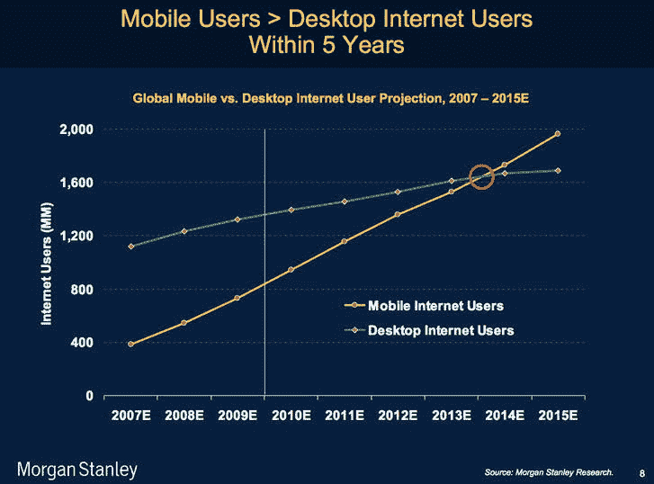
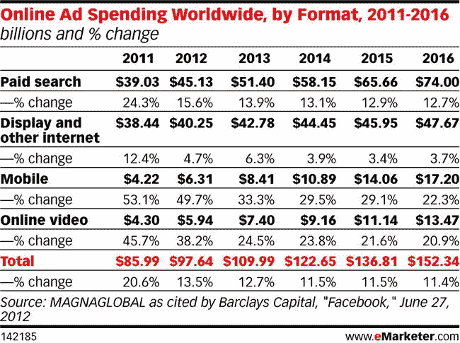
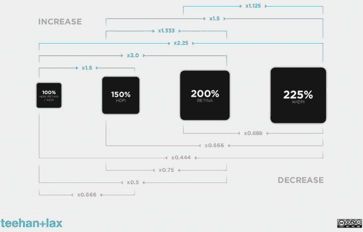
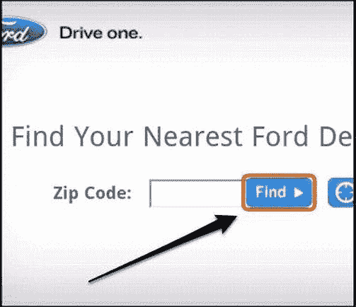
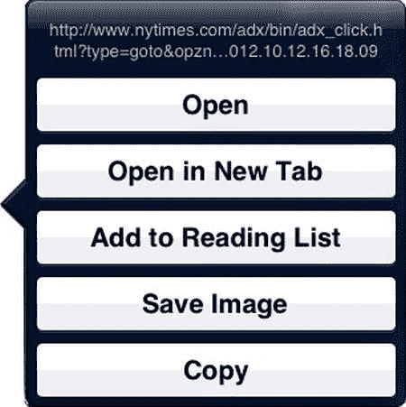
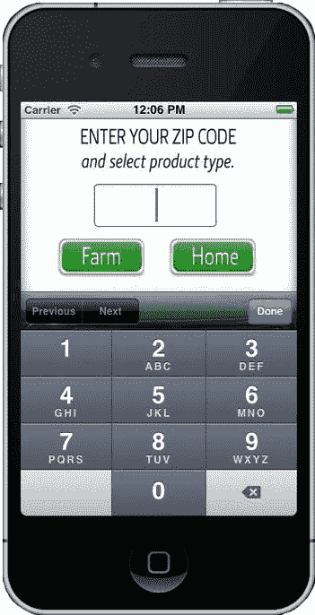
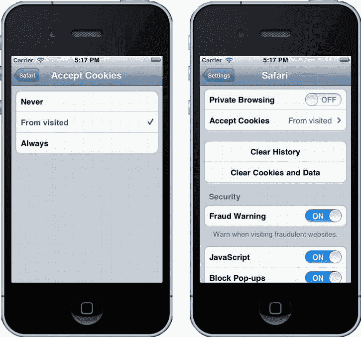
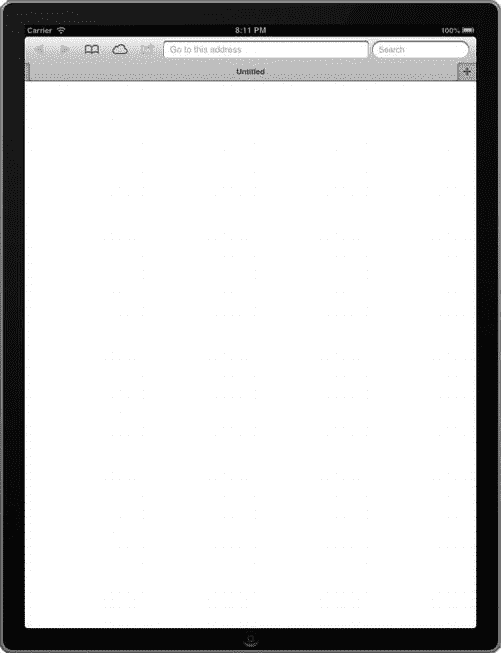
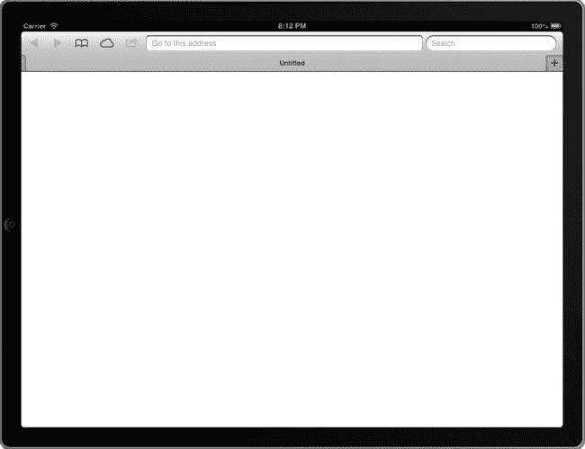

# 八、移动网络广告

我认为可以肯定地说，移动和平板电脑市场推动了 HTML5 的出现。苹果发布 iPhone 和 iPad 的唯一原因是它们都不支持 Flash 播放器，这使得 HTML5 成为一个家喻户晓的名字和推动移动领域发展的必要技术。本章将重点关注 HTML5 广告，因为它与不断增长、不断变化且略微分散的移动领域相关。在我写作时，移动市场充斥着各种浏览器、设备和操作系统，更不用说支持不同 HTML5 的各种浏览器和操作系统的几个版本了。市场实际上是相当分散的，至少可以这么说，但不要担心，我一定会引导你通过这一切。

到目前为止，焦点一直集中在 HTML5 的功能上，因为它们或多或少与桌面有关，但移动设备的功能使 HTML5 的优势更加突出。通过使用 API，您可以利用原生设备功能，如触摸、方向、指南针、加速度计和电池状态，更不用说 HTML5 为桌面浏览器带来的所有新功能，这些功能也可以渗透到移动领域。面对现实吧，我们现在生活在一个移动的世界。由于可以上网的智能设备，人们可以在飞机上用手机登记登机牌，进行电子支付，甚至可以通过优步这样的服务叫出租车。因此，让我们来谈谈移动开发如何将 HTML5 推进一步，并具体谈谈设备功能、它们的使用方式、当前支持的内容以及即将推出的内容。由于移动设备和桌面浏览器使用 HTML5 有很大不同，本章将概述 HTML5 可以访问的当前设备功能，并重点介绍如何使用这些功能为我们的客户创建真正令人惊叹的广告。如果广告商希望在手机和平板电脑上接触到他们的观众，他们肯定需要依靠 HTML5 向前发展。移动市场为许多创新的事物提供了入口；所以让我们深入研究，找出到底是什么。

移动世界

让我们搞清楚一件事:移动技术已经出现，相信我，它会一直存在下去！越来越多的人配备了带有网络连接的智能手机和平板电脑。硬件的制造成本比以往任何时候都低，随着苹果、三星、LG 和其他 OEM(原始设备制造商)以相对较小的价格创造出非常复杂和互联的设备，日常消费者的进入门槛已经降低，这使其成为一个高利润的广告渠道。这些设备在许多方面都很复杂，但其中一个需要关注的是现代浏览器对 HTML5 的支持。因为社交、工作、收发电子邮件或只是在旅途中玩游戏比以往任何时候都更容易，而且随着如此多的眼球从传统的桌面和电视转向更小的屏幕，广告商已经注意到了这一趋势，并渴望进入这个新兴市场。许多分析师预测，移动市场将在未来两三年内超过标准桌面市场。例如，看看摩根士丹利研究公司T3 的[图 8-1](#Fig1) 。



[图 8-1。](#_Fig1)2013-2015 年移动互联网用户和桌面用户预测(来源:摩根士丹利研究)

正如您所看到的，对于移动领域的任何人来说，这都是一个激动人心的趋势，为长期繁荣的未来提供了机会。有一点是肯定的:HTML5 将在这个市场上非常突出，因为它是目前唯一可以跨越所有移动平台的无处不在的技术。没有其他技术可以部署到所有的浏览器和设备上——无论是 Flash 还是 Silverlight。除非你知道 Objective-C 或 Java，或者使用 Adobe AIR for iOS 或类似的打包程序，否则你肯定无法为主流移动操作系统构建应用。HTML5 不仅允许你构建令人惊叹的网络应用；它甚至可以在像 PhoneGap([http://phonegap.com](http://phonegap.com))这样的框架的帮助下，在阿帕奇·科尔多瓦([http://incubator.apache.org/cordova](http://incubator.apache.org/cordova))上创建本地移动应用。使用在现代网络浏览器中工作的相同工具和语法，现在可以跨设备、浏览器和各种操作系统使用，以确保编译到本机应用时的兼容性。这是 HTML5 在移动设备上变得如此有吸引力的主要原因。您可以构建一次，然后在任何地方部署(目前支持任何地方)。既然您已经知道了 HTML5 为什么如此重要，那么在深入研究每种设备的代码和实践之前，让我们来看看市场上的各种设备。

移动设备、浏览器和操作系统

桌面浏览器对 HTML5 的支持是分散的，移动设备也不例外。有许多不同的设备制造商，每个都有自己的变化，并在其浏览器中采用 HTML5 规范。目前该领域有如此多的不同设备，以至于几乎不可能跟踪在哪里支持什么，以及我们可以访问的设备的最新功能是什么。

 **注意**关于碎片化移动生态系统的非常好的信息，我强烈建议去看看[http://www.quirksmode.org/mobile/](http://www.quirksmode.org/mobile/)。

接下来的几节将讨论撰写本文时市场上的顶级设备，我们还将回顾一些随时可能出现的新兴竞争对手。有各种不同的屏幕尺寸和操作系统，数以吨计的浏览器版本，以及数以百计的设备模型，广告单元都必须在其上显示。接下来的几个部分将帮助你浏览风景并理解它。

苹果 iOS

当苹果在 2007 年推出 iPhone 时，智能手机市场真的起飞了。从那以后，手机的外观就再也不一样了，用户已经习惯了手持设备上丰富的触摸功能。多年来，苹果经历了多次硬件和软件迭代；开发人员和用户从更快的硬件、更多的设备 API 和整体性能提升中受益匪浅。例如，随着 iOS 6 的最新发布，用户可以从网络浏览器访问相机和照片库，并利用一种称为网络音频 API 的新功能(更多信息请参见第 12 章)。对于开发人员来说，iOS 提供了一个很好的开发环境，有丰富的工具和模拟器来测试本地应用和 web 内容。就开发者和广告支出而言，苹果几乎是智能手机市场的王者，尽管其主要竞争对手谷歌在全球范围内拥有更大的用户群。JiWire(【www.jiwire.com/insights】T2)概述了英国和美国每台设备的广告请求数量。2012 年的结果显示，iOS 在广告方面的市场份额最大。

这些信息表明了一些事情，其中之一是广告商似乎喜欢在 iOS 市场开发内容，因为这是一个结构化的环境，而 Android 则因为其开放性而更加分散。第二件事是，这可能意味着更多的人在 iOS 设备上观看带有广告支持模式的在线内容和应用。无论你从哪个角度看，这些数字都不会说谎。

Google Android

谷歌坚信开源，并通过其移动操作系统 Android 坚守这一信念。Android 是目前移动领域最大的操作系统，安装在各种设备上。在这种情况下，开放既是一件好事，也是一件坏事。它创造了大量的创新和竞争，但反过来，也给需要在这种环境下进行开发的开发者带来了很多挫折。由于有超过 2，000 种不同的 Android 产品(并且还在增长)，开发人员面临着浏览器中不同级别的 HTML5 合规性、不同的屏幕分辨率、不同的像素密度，甚至是传统的 Flash Player 支持。但随着 Android 4.1 的全面采用，Flash Player 支持将正式消失。访问 http://opensignalmaps.com/reports/fragmentation.php，你会了解到 Android 的开发是多么的分散和混乱。你可能会发现这项研究的结果令人震惊！正如这项研究所说，用三星或 HTC 设备测试和开发内容是最有意义的，因为它们是当今市场上最突出的产品。然而，如果你是一名开发人员，你就无法逃避为 Android 设备进行开发。由于大多数手机和平板电脑市场都使用这种操作系统的版本，广告商更有理由希望出现在他们的屏幕上。

其他人

市场上的其他一些设备有 Galaxy 平板电脑、黑莓 Playbook、Nooks 和 Kindles，所有这些设备都支持各种 Android 操作系统的混合，只有 Playbook 例外，它使用黑莓自己的平板电脑操作系统。据说，截至 2012 年 4 月，亚马逊的 Kindle Fire 拥有美国 54.4%的安卓平板电脑，这一事实证明了为该设备创建正确显示和工作的内容的合理性。这些设备中的大多数都提供非常符合 HTML5 的浏览器，大多数操作系统都有频繁的更新。(你可以在 http://html5test.com 查看这些结果。)其他开源浏览器和平台正在开发中，其中包括 ti Zen(【http://tizen.org】)据说在这项研究期间拥有最好的 HTML5 兼容浏览器之一([http://it world . com/mobile-wireless/262120/ti Zen-pops-html 5-winner](http://itworld.com/mobile-wireless/262120/tizen-pops-html5-winner))。最终，移动世界可能真的会变得支离破碎，但支持在这些设备上做广告仍然是必要的，因此请确保与您的客户讨论他们希望在活动的分配时间和预算内瞄准哪些操作系统平台。如果您一开始就知道您的客户想要的目标，这可以节省您几个小时甚至几天的开发和调试时间。

移动广告

您已经看到，HTML5 是在兼容桌面的浏览器中构建和交付广告的标准；现在，让我们更深入地了解这是如何影响移动领域的。使用 HTML5 的广告提供了广告内容和页面内容之间的无缝集成，尤其是在移动设备中不支持 iFrames 的情况下。随着广告真正成为页面的一部分，网络和广告开发者有能力做一些令人惊讶的事情。但这对他们来说也是相当具有破坏性的，因此他们需要紧密合作来完成复杂的富媒体执行。由于 HTML5 目前的接受状态，无法保证 HTML5 构建的广告能够在移动生态系统中的所有浏览器和操作系统上同等呈现。web 设计人员和开发人员为确保每个像素和功能在不同浏览器间都正确而经历的同样的问题和测试在这里也同样适用。在接下来的章节中，让我们回顾一下移动广告是如何被购买、销售、创建、服务和分析的。

众所周知，移动广告行业正在蓬勃发展，而且短期内不会放缓。如果你是移动广告的新手，你很快就会发现移动广告是独一无二的；从桌面过渡的开发人员和设计人员有他们的工作要做。移动是一个新兴的有利可图的行业，但在我们像在桌面创作中一样得心应手之前，还有很多东西要学习和解决。事实上，一整本书都可以专门讨论这个话题。所有购买、销售、创建、提供和分析广告的方式仍处于发展阶段，但随着市场上有如此多的手机和平板电脑，广告商希望他们的活动能够覆盖最广泛的范围。通常，巨大的牺牲来自运营规模和周转时间，因为开发需要编写许多条件和功能检测，以便广告可以有效和正确地跨屏幕部署，同时也可以优雅地失败。移动广告市场仍处于起步阶段，但增长迅速。为了证明这一点，请看图 8-2(T1)，其中有来自 eMarketer 的关于全球在线广告支出的数据。



[图 8-2。](#_Fig2)按形式划分的全球在线广告总支出(来源:【eMarketer.com】T2

如果你正在寻找一个职业改变，甚至只是一个新的爱好，这是一个很好的行业！预计到 2016 年，全球移动广告支出将会有最大的百分比增长。然而，在你能把它想成所有的乐趣和利润之前，有许多事情要涵盖。让我们从移动广告定价开始。

移动定价

移动广告定价与桌面广告非常相似，因为广告通常是根据印象计费的；即，广告被呈现到页面或被请求的次数。传统上，移动富媒体是按 CPM 计费的(即，按每一千次展示计费)。这也可以与可视印象相结合——当广告实际出现在用户的机器上时。通常，该指标有助于呈现“折叠线以下”的广告，当用户访问页面时，该区域不在初始视图中。点击或点击是用户触摸横幅以扩展它的次数，CTR(点击率)——在移动设备中应该称为 TTR(点击率)——是广告被点击的总次数除以提供的广告展示次数。例如，如果一个广告被播放 1000 次，被点击 10 次，那么它的点击率为 1.0%。最后，费用由所报告的时间段内支付的总金额以及可能的基于所提供的展示总数的账单来分解。在[http://mymobileagency . co . uk/blog/mobile-advertising-pricing-explained . html](http://mymobileagency.co.uk/blog/mobile-advertising-pricing-explained.html)有一个很好的、非常详细的移动广告定价分类。

广告创作

既然你已经了解了移动广告的定价，让我们来深入探讨一下手头更大的话题，也就是广告的创意设计和开发。对于移动设备，最好将所有广告的样式表放在发布者页面的头部或 iFrame 的头部，如果是这样的话(你的发布者会告诉你你的广告将如何呈现在页面上)。

 **注意**旧设备浏览器中的 iFrame 广告会导致系统内存问题，尤其是当它们嵌套在一起的时候。随着新设备的出现，这变得不那么令人担忧了，但在定义您的活动范围时，请记住这一点。

样式不应该包含在其他任何地方，因为在创建元素后应用它们会导致回流、重画和不必要的(和不必要的)非样式内容闪烁。当包含特定于您的广告的 CSS 时，请确保在缩小和压缩时将所有 CSS 文件捆绑到一个文件中。在移动领域，请求越少越好，因为网络条件可能会有很大的变化。我推荐使用 CSSCompressor 、【http://csscompressor.com】和 js compress([http://jscompress.com](http://jscompress.com))，因为缩小或压缩代码会减少整体文件大小——这对移动设备来说超级重要。对于依赖于元素的脚本，让它们在 DOM“就绪”或“加载”之后执行——这是通过使用 DOMContentLoaded 或“加载”事件来完成的。

此外，如果您需要依赖图像资产，您应该尽可能预加载；预加载在将任何广告内容呈现到屏幕之前提供完整的广告体验。虽然图像在移动世界中很重要，但你不能总是不使用它们，所以一定要像我们在第五章学到的那样使用精灵表。这样，当用户最终看到内容时，您可以确信内容是可操作的和可见的。[清单 8-1](#list1) 展示了预加载图像资产的常用技术。

[***清单 8-1。***](#_list1) JavaScript 图像预加载器

```html
<!DOCTYPE html>
<html lang="en">
<head>
<script>
   var images = new Array();
   var numImages = '3';
   var count;
   function preloading () {
      for (i = 0; i < preloading.arguments.length; i++){
          images[i] = new Image();
        images[i].src = preloading.arguments[i];
        count = i+1;

        if(count.toString() === numImages) {
           //initialize ad
           console.log('adInit');
        }
     }
}
preloading(
  "image1.gif",
  "image2.gif",
  "image3.gif"
);
</script>
</head>
<body>
</body>
</html>
```

正如您所看到的，正在建立一个名为 images 的数组对象。接下来，让我们创建一个名为 preloading 的函数，该函数将传递一组图像资产，循环遍历并从中创建新的图像对象，并将它们的源属性分配给函数中提供的文件路径。最后，加载图像时可以调用任何其他需要的东西，比如启动广告的 init 函数。

除了预加载外部内容之外，您还应该优先加载特定的资产。如果您正在利用脚本将依赖的外部 JavaScript 库，那么排序是强制性的。幸运的是，您可以利用两个新的脚本标记属性 Async 和 Defer 来更好地帮助发布者进行代码排序。延迟脚本是依赖于其他脚本的脚本，比如外部库。因此，如果您绝对需要在移动活动中使用 jQuery 和其他相关脚本，那么您应该推迟使用它们。

 **注意**延迟脚本在 DOMContentLoaded 事件之前执行。

广告服务器的 JavaScript 广告标签应该使用异步属性,这样发布者页面的加载速度会更快。Async 适用于加载后立即执行的脚本，不需要依赖其他脚本——它们非常适用于广告标签、社交网络小工具和网站上其他第三方内容，这些内容与网站内容没有明确的联系。这两个新属性的真正好处是它们不会阻塞 HTML 解析器，否则会阻塞用户的重要 UI(用户界面)元素。让我们看一下[清单 8-2](#list2) ，它概述了 defer 和 async 属性的使用。

[***清单 8-2。***](#_list2) JavaScript 延迟示例

```html
<html>
<head>
<script defer src='jquery.js'></script>
<script defer src='mainSiteScript.js'></script>
<script async src='adTag.js'></script>
</head>
</html>
```

您可以看到，首先加载的是 jquery.js 脚本，使用的是 defer 设置，然后是 mainSiteScript.js，它依赖于 jquery 库。最后，为我们的广告内容调用第三方 JavaScript 标记，它不依赖于发布者内容。由于在移动设备上解析 JavaScript 可能需要几毫秒的时间，这取决于网络连接，所以保持网站对用户的功能并在主要内容加载后加载广告是很重要的。

在开始 HTML5 活动和开始创意开发之前，请始终询问您的广告运营或活动经理标签将在哪里运行。什么设备，浏览器，等等。定义你的范围；这将决定整体功能，因为对某些功能的支持是有限的。创意所需的功能将决定跨浏览器/设备构建的开发时间。在 http://media.admob.com 的 HTML5 中有一个非常全面的关于移动广告开发的概要。

考虑到这一点，我们先来讨论一下移动*中的*视口*。*视窗实际上是浏览器在移动设备上呈现内容的虚拟窗口。通过在文档页面的头部使用 meta 标签，您可以指定宽度、比例和用户可伸缩性，甚至设置浏览器窗口要解释的最小和最大值。由于这对于在移动设备上正确格式化内容非常重要，让我们看看[清单 8-3](#list3) ，它显示了浏览器窗口被设置为访问其内容的设备的屏幕大小。

[***清单 8-3。***](#_list3) 视口移动元标签

```html
<!DOCTYPE HTML>
<html>
<head>
<meta name = "viewport" content = "width=device-width">
</head>
```

当您在移动浏览器中打开此文档时，您会注意到浏览器中的任何内容都已被设置为设备的宽度。对于苹果 iPhone，这将是 320 CSS 像素宽；Kindle Fire 的像素是 600 CSS。这种可变宽度是一个很好的特性。由于它使浏览器看起来像是设备的原生应用，这是广告应该考虑的事情，因为大多数发布者页面都会包含这些元标签。清单 8-4 通过设置比例值和用户输入显示了一个更精细的视口示例。

[***清单 8-4。***](#_list4) 用视口元标签设置比例

```html
<!DOCTYPE HTML>
<html>
<head>
<meta name = "viewport" content = "initial-scale = 1.0, minimum-scale=1.0, maximum-scale=1.0, user-scalable=no, width=device-width">
</head>
```

这也可以通过使用 JavaScript 文件中包含的 JavaScript 方法来实现(见[清单 8-5](#list5) )。

[***清单 8-5。***](#_list5) 用 JavaScript 设置视口宽度和比例

```html
var viewMeta=document.createElement('meta');
viewMeta.name='viewport';appleMeta.content='width=device-width, initial-scale=1, maximum-scale=1, minimum-scale=1, user-scalable=0';
document.getElementsByTagName('head')[0].appendChild(viewMeta);
```

当在浏览器中查看时，这些代码示例都将页面内容的宽度设置为设备的屏幕宽度，将初始、最小和最大缩放级别设置为 100%，并且不允许用户使用收缩手势放大页面内容。这些信息对于希望为移动访问者实现最佳呈现的内容所有者至关重要，尤其是那些想要模仿为 Web 构建的本地应用的内容所有者。关于广告商、代理商和广告服务器——同样，当向专门设置了此视窗的页面投放广告时，这是需要注意的事情，因为你的创意可能会受到影响。创意元素可以根据比例设置放大或缩小，这可能会创建难以辨认或更糟的副本或图像，或者如果出版商使内容比广告预期的更窄，则会对广告的宽度进行不必要的更改。

媒体查询和像素密度和

当调整视窗时，您很可能会希望利用 CSS 媒体查询来进行移动广告创意。您可能不知道将访问媒体页上您的广告内容的每一个设备，因此您必须制作一个响应迅速并适应查看它的设备的广告。响应式广告设计需要大量的工作和清晰的执行计划，但如果做得正确，可以节省大量的时间。由于许多设备有不同的屏幕尺寸和像素密度，广告设计师越来越难以处理创意构建中的所有差异。因为这是为各种尺寸和密度的移动设备开发的设计师的一个问题，所以 Teehan+Lax 的人开发了一个漂亮的图形和图表([http://teehanlax.com/blog/density-converter](http://teehanlax.com/blog/density-converter))来帮助你为各种像素密度的屏幕设计内容(见[图 8-3](#Fig3) )。



[图 8-3。](#_Fig3)缩放各种像素密度的屏幕内容

在撰写本文时，苹果设备的像素密度为 1.0 和 2.0；Android 有各种其他版本，包括 1.4、1.75 和 2.3。例如，iPhone 4 及以上支持更高的像素密度——苹果称之为视网膜显示器。在这些设备上，宽度仍然是 320 CSS 像素，但设备的像素每像素翻倍，以创建更高的图像保真度。例如，300 × 250 的图像需要 600 × 500 的图像才能在这些更高像素密度的显示器上看起来清晰(有关此主题的更多信息，请参见[http://quirks mode . org/blog/archives/2010/04/a _ pixel _ is _ not . html](http://quirksmode.org/blog/archives/2010/04/a_pixel_is_not.html))。通过阅读这篇文章，你会明白这个故事的寓意是 CSS 像素与实际的物理设备像素没有什么关系。因此，应该尽可能地使用它们，因为不管设备的底层分辨率如何，它们在各种浏览器中的解释都是一致的。[清单 8-6](#list6) 展示了如何使用 CSS 处理更高像素密度的图像。(写这样的东西不要觉得不舒服。)

[***清单 8-6。***](#_list6)CSS 中双倍像素密度示例

```html
<style>
.adContainer {
    background-image: url(bg_600x500.jpg);
    width: 300px;
    height: 250px;
}
</style>

```

正如您所看到的，代码示例将背景图像的大小增加了一倍，以弥补额外的设备像素。我知道这会让你很困惑！但是，现在已经有了正在开发的规范，甚至可以使用特定的厂商前缀特性。有关更多信息，请阅读 CSS 中的图像集属性([http://blog . cloud four . com/safari-6-and-chrome-21-add-Image-Set-to-support-retina-images](http://blog.cloudfour.com/safari-6-and-chrome-21-add-image-set-to-support-retina-images))以及备受期待的新兴图片元素规范(【http://github.com/scottjehl/picturefill】)。

移动提示

现在，您已经设置好了 viewport 和 CSS，让我们来讨论一些关于使用各种移动设备的重要“问题”。接下来的部分将会帮助你处理移动广告开发中一些常见的陷阱。客户经常会要求去掉设备的灰色轮廓。这个轮廓在移动 Safari 上看起来像一个灰色的点击区域，在 Android 设备上看起来像一个琥珀色或绿色的区域。参见[图 8-4](#Fig4) 了解该问题的图示。



[图 8-4。](#_Fig4)某些移动设备上的触摸轮廓

如果你想去掉这个大纲，这里有一些代码演示了如何使用 CSS 做到这一点。

```html
button {
    -webkit-tap-highlight-color: rgba(0,0,0,0);
    -webkit-tap-highlight-color: transparent;
    outline: none;
}
```

注意我们是如何将前缀 webkit-tap-highlight-color 的 RGBA 标度设置为 0，并将其命名为透明的。最后，为了安全起见，我们将大纲设置为 none 来禁用它。

CSS 和 mobile 的另一个有用的特性是禁用选择。如果您或您的客户希望在广告单元中禁用剪切、复制和粘贴操作，您可以使用 CSS 来实现这一点。[图 8-5](#Fig5) 描绘了复制粘贴过程在手机上的样子。


[图 8-5。](#_Fig5)移动设备上的复制粘贴技术

如果您希望禁止用户从 ad 单元获取信息，禁用此功能可能会很有用。也许是及时和动态的数据或一次性优惠券交易。无论哪种方式，只要确定您真的想要为您的用户群禁用此设置。这里有一个 CSS 片段可以实现这个结果。

```html
p {
   -webkit-user-select: none;
}
```

有时，当用户点击图像并按住它或按住内容中的链接时，您可能会收到在 iOS 设备上禁用标注窗口的请求。图 8-6 更好地说明了我所说的。



[图 8-6。](#_Fig6)iOS 上的标注气球

默认情况下，当用户点击图像或 URL 并按下一段时间时，操作系统会提供一个菜单项列表供用户选择。如果这不是您的广告体验的一部分，CSS 可以删除本机标注窗口。

```html
img, a {
   -webkit-touch-callout: none;
}
```

在前面的代码中，只需将名为 touch-callout 的 Webkit 属性设置为 none，就可以禁用该操作系统标注功能。

通常，您希望为用户提供特定的输入，而不是传统的文本输入键盘。这对于在表单中输入数字数据(电话号码、邮政编码)非常有用。为了更改表单输入上的这些键盘显示，请在输入标记上指定 input-type 属性。例如，在[图 8-7](#Fig7) 中，我用模式[0–9]*将输入字段设置为 tel，因为我希望用户输入邮政编码。有点令人困惑，但它是有效的，因为 ZIP 没有输入类型(至少现在还没有)，我所关心的是这个特定输入的数字条目。



[图 8-7。](#_Fig7)移动设备上的“tel”键盘输入

正如您所看到的，当用户将焦点放在输入字段上时，设备的数字键盘就会出现。这里有一些代码可以用来切换键盘，以获得更好的用户体验。

 **注意**如果输入类型不受支持，浏览器将默认为“文本”类型的通用输入

```html
<!-- display a standard keyboard -->
<input type="text" />

<!-- display a telephone keypad -->
<input type="tel" />

<!-- display a URL keyboard -->
<input type="url" />

<!-- display an email keyboard -->
<input type="email" />

<!-- display a numeric keyboard on iOS -->
<input type="tel" pattern="[0–9]*" />

```

使用这些代码片段，您可以根据自己的创作目标为用户显示所有类型的输入字段。让这变得非常简单和有用的是，浏览器会为您处理这一切。您不需要构建和定制特定的输入字段。

另一件有趣的事情是字体平滑属性。在你的创意中经常会有一些动画，有时会涉及到复制元素的动画。[图 8-8](#Fig8) 展示了“o”字符的字体平滑效果。


[图 8-8。](#_Fig8)CSS 字体平滑属性的效果

有些动画可能涉及复制或文本元素，有一个很棒 CSS 片段可以防止字体上出现锯齿或脊状动画。这里有一些代码提供复制元素的反走样。

```html
.smoothCopy {
    font-smooth:always;
}
```

 **注**在撰写本文时，字体平滑功能仅在 Webkit 浏览器中可用。它不是任何 web 标准规范的一部分。

除此之外，移动广告和基于 CSS 的网络字体也是一个潜在的大问题。一方面，广告商和品牌将希望使用他们实际的字体，因为它们通常是他们品牌身份的核心——想想可口可乐或百威啤酒——而唯一的方法就是增加 CSS 字体或透明 PNG 图像的 k 权重。另一方面，CSS3 字体的负载导致最终用户的下载时间更长，并且各种格式需要更多的 HTTP 请求。这种情况没有灵丹妙药；有些客户绝对会要求你使用他们的品牌字体。最好的做法是向客户表明，做它想做的事情会让用户付出代价。他们的体验可能会受到影响，尤其是在低带宽连接上。如果客户坚持，有一些非常好的优化字体库可以使用:谷歌的网络字体库([http://www.google.com/webfonts](http://www.google.com/webfonts))、Adobe 的 Typekit([https://typekit.com/](https://typekit.com/))和 WebType([http://www.webtype.com/](http://www.webtype.com/))，正如你在[第 5 章](05.html)中所了解的，这些字体库只带来设备所需的格式。权衡使用或不使用的利弊，也考虑透明的 PNG 文件。然而，当复制需要改变或者是动态的时，png 不是一个选项。对于 iOS 设备上的默认字体支持，请查看[http://iosfonts.com](http://iosfonts.com)。Android 用户对默认字体的选择要有限得多——Droid Sans、Droid Sans Mono、Droid Serif 和 Roboto——但希望随着操作系统的未来更新，会有更多的选择。

 **注意**这些只是一些问题和解决方法。还有很多，但是考虑到所有正在使用的设备和浏览器，把它们都列出来超出了本书的范围。更多移动 CSS 调整见[http://css-infos.net](http://css-infos.net)。

正如你可能已经猜到的，许多移动广告来自于桌面广告。调查、“发送给朋友”、优惠券下载、客户数据收集、动画、应用商店的直接链接、地图、视频、投票、互动、广告内购买和基于位置的交易等广告功能都是可能的，但它们可能需要更多的理解才能完美地跨设备实现。这些功能确实能让广告主受益；他们可以利用从桌面营销活动中学到的东西，并将其应用到移动设备中，或者重新定位他们的营销活动，以获得更适合移动设备的功能。这是迄今为止不一样的媒体，但在功能方面，很多相同的事情和更多的可以完成。业界的一个大问题是如何处理资产，因为它们不仅仅是 SWF 文件。这适用于移动广告，也适用于 HTML5 广告。以下是在内部和外部团队成员之间处理或移交创意资产时需要注意的事项。

*   超文本标记语言
*   半铸钢ˌ钢性铸铁(Cast Semi-Steel)
*   Java Script 语言
*   分层 PSD 和/或带有子画面的图像
*   Illustrator 文件
*   情节串连图板
*   字体
*   媒体文件(视频/音频)(如果需要)
*   自述文本文件，概述了资产的说明。

所有这些资产可能会以 ZIP 文件的形式提供给您，这可以确保所有资产在整个转移过程中保持在一起。当需要移交资产时，确认所有这些文件都存在可以避免后续的混乱。这种混乱往往会消耗宝贵的时间，并可能会破坏活动的启动。

营销活动通常要求您将数据 ping 到第三方服务器，尤其是当其他供应商为验证跟踪指标而向您提供 1 × 1 数据时。这可以通过在 JavaScript 中创建一个新的图像对象并应用图像的源属性来指向你希望的第三方目的地来实现(见[清单 8-7](#list7) )。

[***清单 8-7。***](#_list7) 像素跟踪示例

```html
<!DOCTYPE HTML>
<html>
<head>
</head>
<body>
   <div id='icon' style='background-color:black; width:50px; height:50px;'></div>
</body>
<script>
var someElement = document.querySelector('#icon');
someElement.addEventListener('touchstart', activityHandler, false);

function activityHandler () {
   var img = new Image ();
   img.src = 'http://www.tracker.com/ping';
}
</script>

</html>
```

您可以看到一个事件监听器已经添加到您选择的元素中，当点击时，我们调用 activityHandler 函数。在该函数中，创建了一个新的图像对象 img，并将其提供给要调用的目的地。现在，浏览器将向该源发出请求，接收端将记录一个交互度量。(只要确保在您希望跟踪的用户活动上这样做；否则，您的报告指标将会失真。)此外，请记住，对移动设备使用此功能意味着另一个 HTTP 调用，基于带宽限制，这可能会有偏差。如果没有足够的带宽，第三方的请求可能会失败，但动作仍然会从创意内部发生。

最后，与展示广告一样，移动广告也适用同样的“进/出”规则。如果用户点击或轻触广告来扩大广告，他们很可能需要点击或轻触来结束体验。这或多或少是由发行商的需求决定的，但是在考虑整体用户体验时要记住这一点。

优化

优化是移动开发的关键部分。在移动生态系统中保持轻量级广告应该是任何开发者或设计师的首要关注点，因为这对最终用户可能面临的各种网络连接极其重要。由于图像和脚本在 3G 连接上负担过重，检测这些限制并为用户提供替代体验。在 Android 设备 2.2 及更高版本上，检查 navigator.connection.type 属性；它可以检测来自以太网、2G 或 3G 连接的 WiFi，并相应地调整您的广告。对于黑莓设备，查看 blackberry.network 获取类似信息；在 iOS 上，除非第一方广告服务器可以提供，否则要等到网络信息上的 API 来到那个浏览器。有关网络 API 的更多信息，请参见[http://w3.org/TR/netinfo-api](http://w3.org/TR/netinfo-api)。

在理想情况下，最好的情况是检测用户的当前带宽，并提供替代信息或适当的故障转移。例如，如果用户不在 WiFi 上或连接不好，提供一个简化的创意版本，几乎没有图像和依赖于各种 HTTP 请求的动态内容。连接信息将让广告真正适应用户的设备和观看条件。将此与广告内容的响应性创意设计相结合，您将拥有一个可以在任何条件下在任何屏幕上运行的广告——没问题！这基本上是广告服务的圣杯。

此外，使用 mobile 最好移除所有沉重的、不需要的外部库；尽可能使用直接的本地 JavaScript。库提供了极大的易用性，但是由于这个原因，太多的开发人员依赖于它们。如果内容仅针对一个操作系统或设备，则不保证包含它们。像 jQuery 这样的库提供了令人惊讶的一致的跨浏览器体验，但是如果您只是为了它的动画和语法易用性而使用它，那么您就用额外的重量杀死了最终用户。事实上，在 2012 年的一个版本中，jQuery 压缩了 93 千字节，压缩了 34 千字节。这对移动用户来说是相当大的，尤其是广告内容。始终尝试使用裸 JavaScript，最小化 k-weight，减少网络下载，并且永远不要忘记您应该利用的正常方法，例如缩小脚本和 CSS 文件，以及将您的资产压缩为最小的传输大小。

最后，尽量保持你的浏览器重画非常低。对于移动设备来说，重新绘制 DOM 的布局是一项非常昂贵的任务。随着更多动画和 DOM 操作的出现，重画可能会大大减少用户的电池寿命。

代码执行

在优化之后，另一个重要的实践是代码执行。对于移动广告，代码执行可能是一场噩梦，尤其是在等待页面内容加载时，首先是各种网络条件和移动设备上非移动优化的 web 内容。这实际上是一个序列、检查和扮演交通警察游戏。我的一个同事兼朋友总是称之为“舞蹈”无论您是在对 DOM 元素调用操作之前检查它们是否存在，还是等待 JavaScript 平台和库下载，当您的 ad 标签进入实际环境时，这总是一个调试过程。事实上，这句话总结了在浏览器中处理解释代码执行时的挫败感，尤其是发布者一方无法控制的代码。就像一个新的舞伴，你不知道他们是否会踩你的脚。

在广告领域，发布者的页面内容首先要加载，通常作为一个 onload 事件；则该页面向广告服务器发出请求以请求广告内容。此时，广告填充发布者的页面或指定的 iFrame。广告代码仍然需要加载所有与广告相关的文件——在这种情况下，它可以是 CSS、JavaScript、任何图像、web 字体以及其他任何文件。最后，得到许可后，我们的广告体验就可以开始了。我见过很多这样做的方法，但是不管它是如何完成的，都有很多步骤，特别是对于必须快速执行的广告内容！记住，没有人上网看广告，所以你必须快速渲染，尽可能抓住用户的注意力。您将了解到，最好的网站为广告提供回调以开始加载，甚至异步加载它们的广告脚本。清单 8-8 显示了我自己确保所有元素都被写入页面的方法。

[***清单 8-8。***](#_list8) DOM 元素检查器示例

```html
<script>
function adChecker () {
     if (document.querySelector("#yourLastDOMElement")) {
          initAd();
     } else {
          setTimeout(adChecker,100);
     }
}

function initAd () {
     //Ad content starts here
}

adChecker();
</script>
```

从代码中可以看出，正在使用一个名为 adChecker 的函数。它通过一个条件来检查广告代码的最后一个元素是否呈现在页面上。一旦返回 true，就会执行名为 initAd 的函数。它将开启我们的创意。否则，将超时函数设置为 100 毫秒，并再次调用 adChecker 函数。这将反复发生，直到广告的标记完全呈现到文档中。这种一遍又一遍的循环可能是一个昂贵的操作，这就是为什么我说最好的网站提供广告挂钩的回调。它们比这种重复功能效率高得多，尤其是在手机上。

移动站点事件

客户的一个常见要求是能够在移动设备上跟踪网站事件。站点事件是放置在广告商网站上的跟踪标签。当用户查看广告或与广告交互并随后访问广告商的网站时，会触发网站事件度量，从而显示广告可能会使用户在注意到广告后转到广告商的 URL 的 ROI。传统上，网站事件基于 cookie 模型进行跟踪；在一些移动浏览器中，这完全没问题。然而，在 iOS 和 mobile Safari 上，第三方 cookie 被默认禁用，这些设备和浏览器被禁止使用 cookie 方法跟踪站点事件。为了更好地说明这个设置，请看图 8-9 ，它展示了 iOS 上的默认设置。



[图 8-9。](#_Fig9)iOS Safari 上的默认 cookie 设置

如果你依赖移动广告中的 cookie 模式，这种情况会是一个很大的限制。相反，利用 HTML5 的 localStorage 属性将该信息而不是 cookie 放在客户端的浏览器上。清单 8-9 显示了如何使用 JavaScript 在广告代码中实现这一点。

[***清单 8-9。***](#_list9) 某 localStorage 网站事件示例(Ad)

```html
<script>
//iOS Site Events - local storage technique - platform.
function setiOSiteEvent (ad, placement, campaign, publisher) {
    var m = new Date().getMonth()
    var d = new Date().getDate();
    var y = new Date().getFullYear();
    var dom = window.location.href;
    var timeLoc = m + '/' + d + '/' + y + '&' + dom;
    var se = ad + '-' + placement + '-' + campaign + '-' + publisher + timeLoc;
                   localStorage.setItem('SiteEvent', se);
}
setiOSiteEvent('advertiser', 'placement', 'campaign' , 'publisher');
</script>
```

如清单 8-9 所示，你可以创建一个名为 setiOSiteEvent 的函数，它获取一些参数，这些参数最终会在广告服务时由广告服务器传入。这些可以是广告客户的名称、位置标识符、活动标识符和发布广告的出版商。接下来，在我们的函数中，声明几个变量——m，d，y——它们在站点事件发生时准确地标记时间戳。接下来，通过编写 var dom = window.location.href 来获取对 URL 位置的引用；—这将给出查看者看到广告的确切页面位置。接下来，调用另一个变量 timeLoc，它代表时间/位置，并获得时间值和位置的串联值，或者 URL 地址。接下来，创建我们的最终 var，称为 se，它获取所有的 ad 服务器值，以及我们的时间戳和位置值。最后，调用我们的 localStorage 对象，并通过 setItem 调用存储该值，将 se 分配给它。这个 localStorage.setItem 调用将把所有的站点事件(se)信息存储到用户的浏览器中，以便广告商的页面以后可以引用它。[清单 8-10](#list10) 展示了如何在广告商的页面上实现这一点。

[***清单 8-10。***](#_list10) 某 localStorage 网站事件示例(广告客户的页面)

```html
function getiOSiteEvent () {
                   if(localStorage == '' || localStorage == null) {
                                     return;
                   } else {
                                     //Grab iOS Site Event
                                     console.log(localStorage.getItem('SiteEvent'));
                                     var seCall = new Image();
                                     seCall.src = 'http://tracking.adserver.com?siteevent=' + localStorage.getItem('SiteEvent');
                                     setTimeout(localStorage.clear(), 500);//Clear the information once the metric is reported
                   }
}

getiOSiteEvent ();
```

当用户访问广告商的页面时，getiOSiteEvent 函数将被触发。在该功能中，检查用户是否有任何位置存储信息。如果用户没有，就退出该功能；如果用户这样做了，创建一个新的图像(很像我们的第三方跟踪示例),并将其 source 属性设置为跟踪位置。最后，一旦广告服务器获得指标，设置一个超时并清除用户浏览器中的 localStorage，这样我们就不会再跟踪这个值。除了过时的 cookie 方法，还有许多方法可以做到这一点；一般来说，选择取决于你使用的广告服务器和浏览器对客户端存储技术的采用。

移动视频广告

在写这篇文章的时候，最大的移动广告市场是视频——传统的流内或前置视频。正如上一章所展示的，VAST 是 IAB 向视频播放器发送视频广告的行业规范，手机也不例外。移动视频是我们行业中增长最快的市场之一，广告商开始寻求使用前置广告来吸引小屏幕空间中所有眼球的注意力。[图 8-10](#Fig10) (来自 eMarketer)估计了 2016 年全球移动视频的使用情况。


[图 8-10。](#_Fig10)2011 年至 2016 年全球移动视频观众估计数

许多网络和出版商在他们的视频播放器中实现了 HTML5 支持，在我写这篇文章的时候，他们已经取得了不同程度的进展。但预计实现会随着时间的推移而增长。一个技术问题是从广告服务器加载外部资产，这在原生 JavaScript 中带来了某些相同的域安全限制。这就是为什么使用 CORS 方法，如在第 6 章中所讨论的，对于资源共享是非常重要的。让我们看看如何使用一个兼容 HTML5 的视频资源的移动标签(见[清单 8-11](#list11) )。

[***清单 8-11。***](#_list11) 移动广阔的例子

```html
<VAST version="2.0">
    <Ad id="12345">
        <InLine>
            <AdSystem>HTML5 Compatible</AdSystem>
            <AdTitle>VAST 2.0 Instream Test</AdTitle>
            <Description>VAST 2.0 Instream Test</Description>
            <Error>http://url/error</Error>
            <Impression>http://tracking/impression</Impression>
            <Creatives>
                <Creative AdID="12345">
                    <Linear>
                        <Duration>00:00:30</Duration>
                        <TrackingEvents>
                            <Trackingevent="creativeView">http://tracking/creativeView</Tracking>
                            <Tracking event="start">http://tracking/start</Tracking>
                            <Tracking event="midpoint">http://tracking/midpoint</Tracking>
                            <Tracking event="firstQuartile">http://tracking/firstQuartile</Tracking>
                            <Tracking event="thirdQuartile">http://tracking/thirdQuartile</Tracking>
                            <Tracking event="complete">http://tracking/complete</Tracking>
                        </TrackingEvents>
                        <VideoClicks>
                            <ClickThrough>http://www.somedomain.com</ClickThrough>
                            <ClickTracking>http://tracking/click</ClickTracking>
                        </VideoClicks>
                        <MediaFiles>
                            <MediaFile delivery="progressive" type="video/mp4" bitrate="1000" width="640" height="360" scalable="true" maintainAspectRatio="true">
                                [http://cdn.somedomain.com/video.mp4](http://cdn.somedomain.com/video.mp4)
                            </MediaFile>
                            <MediaFile delivery="progressive" type="video/ogg" bitrate="1000" width="640" height="360" scalable="true" maintainAspectRatio="true">
                                [http://cdn.somedomain.com/video.ogg](http://cdn.somedomain.com/video.ogg)
                            </MediaFile>
                            <MediaFile delivery="progressive" type="video/webm" bitrate="1000" width="640" height="360" scalable="true" maintainAspectRatio="true">
                                [http://cdn.somedomain.com/video.webm](http://cdn.somedomain.com/video.webm)
                            </MediaFile>
                        </MediaFiles>
                    </Linear>
                </Creative>
                <Creative AdID="12345Companion">
                    <CompanionAds></CompanionAds>
                </Creative>
            </Creatives>
        </InLine>
    </Ad>
</VAST>
```

这只是常规的大量标记——但是，请查找媒体文件节点(粗体)和所使用的特定视频资源。你能看见吗？使用了三种不同的视频类型(MP4、OGG、WebM ),以满足所有 HTML5 浏览器及其不同的格式要求。此外，请记住，一些 HTML5 视频播放器可能需要 JSON 代码，而不是 XML。同样，这些信息将来自特定的发行商和他们的视频播放器需求。

本机设备功能

本节将回顾 mobile 可以访问的一些原生特性，以及赋予移动开发者权限的各种 API。移动浏览器和设备有许多功能:打电话、GPS 定位、深度链接到应用商店、加速度计、陀螺仪和指南针等等。所有这些设备功能都可以用来更好地增强您的创造力，您将在以下章节中了解到这一点。一些新兴设备甚至支持 NFC(近场通信)、用于检测气候的气压计和用于检查磁性的磁力计，所有这些都可以帮助你的广告获得真正相关的信息——比如用户查看你的广告时的湿度。让我们回顾一下如何使用这些令人惊叹的 API 和 JavaScript 来访问这些功能，并为移动设备提供高度丰富的广告体验，同时在不支持它们的地方进行优雅的故障转移。在深入研究之前，请参见[http://mobilehtml5.org](http://mobilehtml5.org)了解哪些 API 和特性可以用于特定的设备和浏览器。

触摸

让我们从触摸开始，这可能是最受欢迎的移动设备功能。你肯定知道，当今市场上的大多数手机和平板电脑都提供电容式触摸屏界面，允许用户用手指进行交互，而不是传统的点击鼠标界面。这是 web 内容开发方式的一个巨大转变，因为业界已经习惯于将鼠标点击和鼠标悬停作为一种交互和测量的形式。现在，开发人员可以利用点击、滑动、挤压和其他手势来增加创意的交互性，从而为广告商和创意机构开辟一个全新的沉浸式创意世界。与传统的“点击展开”CTA 不同，您会注意到“点击展开”、“点击呼叫”、“点击地图”等等。这些 CTA 越来越广泛地应用于触摸设备，尤其是移动广告。

触摸事件

在移动设备和平板电脑上使用 touch API 时会用到以下事件:touchstart，当手指放在任何 DOM 元素上时都会触发；touchmove，当手指沿着任意 DOM 元素拖动时触发；和 touchend，当手指从任何 DOM 元素移开或拿起时触发。还记得我们的视窗设置吗？移动浏览器本身有默认的触摸设置。如果你想一想，如果你的浏览器有自己的滑动和手势行为，你的广告创意也有，这就不会那么好了。要解决这个问题，请使用 user-scalable=no 设置视口，使用户无法缩放。通过在您的代码编辑器中执行并使用 JavaScript touch API，您可以使用代码来触摸并拖动屏幕上的元素，并指示浏览器阻止其默认行为，即移动整个窗口(参见[清单 8-12](#list12) )。

[***清单 8-12。***](#_list12) 阻止浏览器的默认触摸行为

```html
<!DOCTYPE HTML>
<html>
<head>
<meta name="viewport" content="initial-scale=1, user-scalable=no">
</head>
<body>
   <div id="element" style="position:absolute; background-color:black; width:50px; height:50px;"></div>
</body>
<html>
<script>
var element = document.getElementById("element");

element.addEventListener('touchmove', function(event) {
   event.preventDefault();

   if (event.targetTouches.length === 1) {
        console.log(event)
        var touch = event.targetTouches[0];
        // Place element where the finger is
        element.style.left = touch.pageX + 'px';
        element.style.top = touch.pageY + 'px';
    }
}, false);
</script>
</html>
```

如果你在一个支持触摸的浏览器上刷新你的页面，你可以用你的手指在浏览器上触摸并拖动*元素*。无论你的手指去哪里，元素都会跟着去。这可能是在支持触摸的浏览器上实现拖放式效果的一个很好的方法。

如果你经常使用 touch——我希望你在为移动设备开发时也经常使用——一个非常好的 JavaScript 框架，叫做 hammer js([http://eightmedia.github.com/hammer.js](http://eightmedia.github.com/hammer.js))，可以加速你的开发。这个框架允许你在头脑中快速开发触控功能，压缩后只需要大约 2 千字节，这足以在移动广告单元中自由使用。

 **注意**当在支持触摸的浏览器中对输入字段应用 CSS3 变换时，一些 Android 设备会失去对输入的关注。在未来版本中解决这些问题之前，最好不要应用 CSS 转换。

方向

方向是移动设备的另一个有趣的特征(大多数移动设备都有这些传感器)。方向仅仅是指用户如何物理地握住实际的手机或平板电脑。在纵向或横向模式下，您可以使用方向 API 来检测屏幕布局并做出相应的反应。这一点很重要，因为你很可能需要为两个版本开发两种不同的广告，或者使用一个“安全区域”来适应两个版本。有时，出版商会要求提供两个独立的广告标签，但这有望很快淘汰，因为不应该为设备级功能进行另一个 HTTP 调用。理想情况下，目标应该是能够适应设备屏幕的响应式广告布局。典型的情况是使用 JavaScript 和 CSS 将创意重新加工到新的维度，并相应地调整创意布局。[清单 8-13](#list13) 可以用来检测你的创意中的方向。

[***清单 8-13。***](#_list13) 定向示例(HTML)

```html
<html>
<head>
<link rel="stylesheet" media="screen and (orientation:portrait)" href="portrait.css"><link rel="stylesheet" media="screen and (orientation:landscape)" href="landscape.css">
</head>
<body>
</body>
</html>
```

从这段代码中可以看到，在文档的头部有两个样式表引用——一个处理纵向布局，另一个处理横向布局(注意媒体查询)。这样，广告创意可以根据用户的方向相应地调整其布局。还有一种方法可以达到这种效果，那就是使用直接的 CSS(见[清单 8-14](#list14) )。

[***清单 8-14。***](#_list14) 定向示例(CSS)

```html
@media only screen and (orientation: landscape) {
                   */* rules for device in landscape orientation */*
                   *#ad {...};*
}

@media only screen and (orientation: portrait) {
                   */* rules for device in portrait orientation */*
                   *#ad {...};*
}
```

如您所见，CSS 规则可以在 CSS 样式表中包含特定的媒体查询。要了解除定位之外的其他媒体查询，请参见[http://w3.org/TR/css3-mediaqueries](http://w3.org/TR/css3-mediaqueries)。

 **注**在撰写本文时，媒体查询中的 orientation 属性在苹果的 iPhone 和其他一些手机设备上不可用。

在我看来，最好的技术还是了解你所服务的设备的屏幕尺寸，并使用 CSS 媒体查询和 JavaScript 中的 orientationchange 事件来满足每个设备的需求。[清单 8-15](#list15) 显示了如何检测变更事件。

[***清单 8-15。***](#_list15) 方位示例(JavaScript)

```html
<!DOCTYPE HTML>
<html>
<head>
</head>
<body>
</body>
<script>
window.addEventListener("orientationchange", function() {
    if (window.orientation === 0 || window.orientation === 180) {
    //portrait
    showPortrait();
    } else {
        //landscape
      showLandscape();
    }
}, false);

function showPortrait () {
   document.body.style.backgroundColor = 'yellow';
}
function showLandscape () {
   document.body.style.backgroundColor = 'black';
}
</script>

</html>
```

请注意，事件侦听器被添加到 orientationchange 事件的窗口对象中。如果设备改变方向，它将广播此事件，这可以调整。请注意，在我们的函数中，正在检查 window.orientation，它是 window 对象的一个固有属性。如果你发现它返回 0 或者 180，你就知道这个设备是纵向的，如图[图 8-11](#Fig11) 所示。



[图 8-11。](#_Fig11)纵向设备

否则，它要么是 90°要么是 90 °,这意味着设备处于横向，如图[图 8-12](#Fig12) 所示。



[图 8-12。](#_Fig12)横向放置的设备

因为在广告中，你必须很快地把东西推出去，所以开发两种创造性的布局根本不是一个选择。在这种情况下，我通常会指示客户开发对广告布局最有意义的方向，并在用户切换方向时为他们切换指示卡。图 8-13 展示了最近的一次 iPad 宣传活动。在左边你会看到纵向布局的指导卡，在右边你会注意到完整的广告体验。


[图 8-13。](#_Fig13)以下是移动广告如何在每个方向上有两种不同的设计

在某些情况下，这是一个更好的技术，特别是如果创意是一个在风景中看起来更好的视频，或者是一个在肖像中更好的游戏。再说一次，这大部分将在个案的基础上处理，所以一定要考虑你自己的创意，并在开发前指导你的客户。

陀螺仪、指南针和加速度计

既然您刚刚了解了移动设备的方向，让我们更进一步，讨论陀螺仪、指南针和加速度计。这些 API 中的每一个都可以通过直接绑定到设备功能来为您的广告创意提供丰富的增强功能。如何在广告体验中使用这个 API 的一个很好的例子是在[http://bit.ly/OAf8BX](http://bit.ly/OAf8BX)发现的，它利用加速计 API 和画布为用户提供迷宫般的体验。

为了利用这些很酷的特性，您需要了解一些关于 deviceorientation 规范的知识。设备定位 API 概述了 DOM 将如何监听特定事件——如设备定位、compassneedscalibration 和设备运动——以通过我们的广告的 JavaScript 进行挖掘。查看清单 8-16 中的代码，了解如何使用这个 API。

[***清单 8-16。***](#_list16) 加速度计/陀螺仪示例

```html
<script>
var ad = document.querySelector('#ad');
window.addEventListener("deviceorientation", function(event) {
          // process
          var a = event.alpha;
          var b = event.beta;
          var g = event.gamma;

          console.log('Alpha : ' + a + ' Beta : ' + b + ' Gamma : ' + g);
          ad.style.webkitTransform = 'translate3d(' + Math.round(a) + 'px, ' + Math.round(b) + 'px, ' + Math.round(g) + 'px)';
}, true);
</script>
```

您可以看到，我们正在为设备方向事件添加一个事件侦听器，它将返回关于窗口方向状态的 alpha、beta 和 gamma。那么什么是阿尔法、贝塔和伽玛呢？它们实际上是设备从上到下、从左到右以及以环形方式旋转的度量(在方向规范中有更详细的解释)。最后，使用我们的 ad 元素，通过调用 translate3d 函数并对 ad 的 x、y 和 z 属性应用 alpha、beta 和 gamma 值，对 ad 单元应用 CSS3 转换。如果你跟着做，你应该能够看到你的广告元素在屏幕上根据你如何改变方向而移动。如果你问我的话，这是一个非常微妙但巧妙的效果！

使用加速度计也可以访问“摇动”手势，但由于需要一些编码，请务必查看[http://github.com/alexgibson/shake.js](http://github.com/alexgibson/shake.js)以快速实现。有关器件方向规范的更多信息，请参见 http://dev.w3.org/geo/api/spec-source-orientation.html 的[。有关 iOS 和 compass 使用的更多信息，请参见](http://dev.w3.org/geo/api/spec-source-orientation.html)[developer . apple . com/library/safari/# documentation/safaridomain additions/Reference/deviceorientionevent/deviceorientionevent . html](http://developer.apple.com/library/safari/#documentation/SafariDOMAdditions/Reference/DeviceOrientationEventClassRef/DeviceOrientationEvent/DeviceOrientationEvent.html)。

 **注意**在[http://help . ArcGIS . com/EN/webapi/JavaScript/ArcGIS/help/js samples _ start . htm # js samples/mobile _ compass . html](http://help.arcgis.com/EN/webapi/javascript/arcgis/help/jssamples_start.htm#jssamples/mobile_compass.html)有一个很好的使用 Webkit compass 的例子。

协议

移动广告的另一大优势是直接在广告体验中打电话和发短信。在移动设备中，特定协议可用于 TEL 和 SMS 等。电话和短信可以让用户在设备上打开本地电话或短信客户端。这个例子演示了如何做。

```html
<a href="tel:18005551212">Call!</a>
<a href="sms:18005551212">Text!</a>
```

这种简单的交互提供了出色的用户体验；用户不必复制和粘贴文本，也不必在应用之间切换。他们需要做的只是点击链接 CTA，然后收到通知，让他们打电话或发短信。如果你想让某人联系客户服务，或者甚至在当地汽车经销商处安排一次试驾，这真的很棒。除了这些内置协议之外，当用户在特定链接上进行交互时，本机应用可以分配自己的协议，以便从浏览器中打开自己。这里有一段代码展示了苹果的 Facetime 和微软的 Skype 是如何使用它们自己的协议的。

```html
<a href="facetime://18005551212">Facetime me!</a>
<a href="skype:youUserID?call">Skype!</a>
```

请记住，许多应用都有自己的协议，但在移动领域，这对广告商来说非常有利。这也不是电话或通讯应用特有的；内容提供商和出版商——包括使用 wsj://【的《华尔街日报》——使用协议从一个链接打开应用内部的特定用户交互。当网页或广告与原生应用无缝通信时，这是一个非常好的特性。你可以让用户从广告单元中尝到信息的滋味，并要求他们通过更深入地挖掘应用环境来阅读更多信息。

MMA 和 IAB

在回顾所有这些信息时，你可能会问自己一个关于标准和移动广告准则的问题。幸运的是，就像桌面广告一样；在移动领域也有一套新兴的标准和指导方针需要遵循。移动营销协会(MMA)([http://mmaglobal.com](http://mmaglobal.com))和互动广告局(IAB；http://iab.net 是移动在线广告的标准组织。MMA 传统上侧重于静态广告，而 IAB 更侧重于移动领域的丰富广告。以下是 IAB 和 MMA 为 rich 和 static 设置的一些常见的移动广告单元大小。

*   典型的移动富媒体横幅尺寸:300 × 50、320 × 50
*   典型的移动富媒体面板尺寸:300 × 300、320 × 320 或全屏(320 × 480)
*   需要面板上的关闭按钮
*   静态 MMA 尺寸
*   XL (300 × 50)
*   大(216 × 36)
*   中等(168 × 28)
*   小(120 × 20)

IAB 还专注于被称为“明日之星”的移动富媒体格式，这种格式对广告出版商和广告服务器来说更有吸引力。这些格式包括全屏单元、滑块和电影创意广告单元。每一个都提供了独特的体验；他们超越了静态横幅房地产。参见[http://iab.net/risingstarsmobile](http://iab.net/risingstarsmobile)了解更多信息。

设备测试

在本章结束时，我想谈谈在处理移动开发时可以使用的工具——我知道这可能会让人不知所措！在所有这些移动设备上进行测试可能会很痛苦。有太多的设备可以控制你的内容在每个屏幕上的外观和行为。有很多服务可以进行虚拟设备和浏览器测试:Device Anywhere、BrowserStack、Opera 的移动模拟器等等。它们非常好，但是没有什么比在真实的东西上测试更准确，所以一定要联系在线社区，在他们可能随时可用的设备上启动一些测试。网络上也有各种免费工具来缓解你的移动开发困境:[http://jsconsole.com](http://jsconsole.com)、[http://remote-tilt.com](http://remote-tilt.com)，以及移动“查看源”工具、[http://snoopy.allmarkedup.com](http://snoopy.allmarkedup.com)，都有非常棒的免费功能集。此外，还有免费的远程调试工具:Adobe Edge Inspect(正式名称为 Adobe Shadow)[[http://html.adobe.com/edge/inspect](http://html.adobe.com/edge/inspect)]，Weinre[[http://people.apache.org/∼pmuellr/weinre/docs/latest](http://people.apache.org/∼pmuellr/weinre/docs/latest)]，以及 Safari 为 iOS 6 新开发的开发者工具集都值得一试。最后，有时你绝对需要在实际设备上进行测试，所以如果你需要开车去当地的电子商店查看最新的设备，那么就去吧——特别是如果你的客户将使用你无法获得的设备。有可能你至少会有一个客户会在“百万分之一”的设备上观看你的创意，如果你不测试它，它可能会让你付出整个活动的代价。

摘要

这一章已经介绍了很多关于移动广告和移动网络的内容。景观是广阔的，破碎是非常明显的。某些技术仅适用于某些浏览器、设备和操作系统版本。移动广告和 HTML5 携手并进，移动对如何与不断发展的 HTML5 规范合作以及其各种 API 开发者可以获得什么有着特定的看法。我们回顾了我们生活的移动世界以及如何构建它，甚至讨论了各种可以用来构建丰富的广告创意的原生设备功能。希望在读完这一章后，你会有信心回答客户的问题，比如“JavaScript 能和 HTML5 一起用于开发 iPad 的互动广告吗？”下一章关注移动应用广告的广阔世界。这是事情变得更棘手的地方，空间碎片明显变得更厚。但这也是移动广告更复杂、更吸引人的地方。如果你准备好了，让我们深入应用广告的世界。