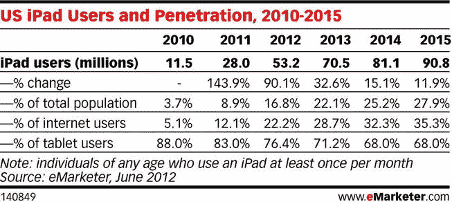
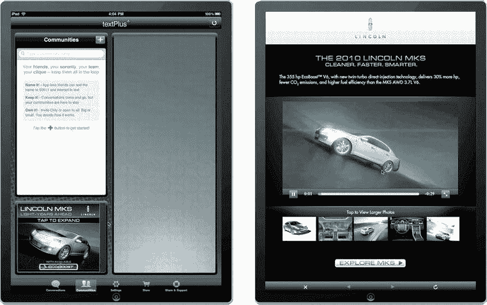
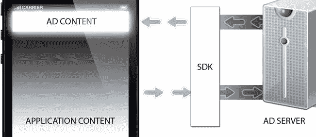

第九章


应用内广告

在回顾了关于移动网络广告的第 8 章之后，是时候开始了解广告商是如何将他们的广告带入新兴的应用世界的。这些应用可以是任何东西，从用户从应用商店下载的手机应用到游戏机或智能电视上的应用。我将讨论每种设备和操作系统的不同环境，并讨论所有环境的使用案例。我将回顾软件开发工具包(SDK)和它们如何参与广告服务，以及广告如何在应用程序中比在移动网络环境中提供更丰富的功能。我将讨论 SDK 提供商，如 AdMarvel、Medialets 和 Millennial Media，它们提供应用内广告，我将重点讨论 IAB 的解决方案和标准，以及 ORMMA 和 MRAID API。

 **注意**复习本章时请记住，SDK 和应用程序是会变化的。本章介绍了当前应该做什么，但是随着 SDK 供应商和内容所有者更新他们的 SDK 或使用其他供应商来传播他们的广告，信息可能会发生变化。

移动应用

移动应用程序是在您的移动设备上运行的本地应用程序。你可以把它们想象成微软 Office 或 Adobe Photoshop 之类的应用程序，它们原本在你的台式电脑上运行，但现在却在你的手机或平板电脑上运行。使用移动应用程序，而不是强迫用户在浏览器中访问 URL 此外，通过提供应用程序，内容所有者可以完全控制他们的应用程序，因为它位于设备浏览器之外。应用程序开发人员通过使用操作系统所依赖的底层代码来创建这些“应用程序”。对于苹果 iOS 来说是 Objective-C，对于安卓来说是 Java。拥有这些技能的开发人员可以为自己创造一个非常有利可图的职业生涯，为生产力、娱乐甚至游戏开发应用程序。至少可以说，应用程序市场正在蓬勃发展，因为 2011 年应用程序内购买占了 9.7 亿美元的销售额。到 2015 年，这一数字预计将增长到 56 亿美元。Juniper Research 在 2012 年报告称，到今年年底，应用内广告将达到 24 亿美元。到 2015 年，这一数字将飙升至 71 亿美元。这些应用程序获得了大量的浏览量，因为人们可以在任何时候花很少的费用甚至免费将它们下载到他们的设备上。这当然给应用程序市场带来了很多关注，以及用户抓住它们是多么容易。

在苹果的应用商店、谷歌的 Play marketplace 和黑莓的应用世界等各种应用商店中，有近百万种不同的应用可供选择；每款应用的功能和价格都各不相同，甚至可以免费进行应用内购买。在接下来的部分中，我将介绍一些领先的应用市场。

苹果

苹果对移动应用市场并不陌生。通过 iOS 和苹果应用商店，用户可以浏览超过 50 万个应用程序，而且大多数应用程序都是免费的，还附带广告。开发人员过去可以在他们的应用程序中获取用户的唯一设备标识符(UDID)，但苹果公司删除了这一功能，因为它对用户的隐私问题构成了威胁。基本上，拥有一个用户 UDID 可以让应用开发者通过他们的应用更好地将广告商的信息传递给正确的客户。将位置、时间和兴趣等信息都绑定到一个唯一的设备 ID 或哈希，这意味着广告商可以更好地了解谁在何时查看他们的广告内容。虽然 UDIDs 现在不允许应用程序在 iOS 中访问广告，但从 iOS 6 开始，还有另一个广告标识符，允许应用程序通过类似的方式更好地定位。此外，甚至有一个称为 open UDID 的开放 UDID 的倡议，它将被所有设备访问，但它尚未真正起飞([http://github.com/ylechelle/OpenUDID](http://github.com/ylechelle/OpenUDID))。

苹果凭借在这样一个受控的开发者环境中提供的优质应用数量，在应用市场上几乎占据了至高无上的地位。再加上苹果设备的爆炸性增长，这意味着应用程序是一个非常有价值的市场。图 9-1 显示了 eMarketer 对美国 iPad 用户未来三年的预测。



[图 9-1。](#_Fig1)2010 年至 2015 年美国 iPad 用户(数据来源:eMarketer.com)

图 9-1 表示，到 2015 年，大约 9000 万美国用户将接触 iPad 平板电脑并与之互动。随着许多人转向基于平板电脑的体验，而不是传统的桌面应用程序，预计会看到更多的应用程序和广告商进入这一领域。

机器人

谷歌的 Android 是另一个主要的竞争应用操作系统。截至去年，谷歌拥有全球最多的每台设备操作系统安装量，许多人认为这是因为它提供了一个稳定和开放的操作系统，可以安装在许多制造商的设备上，如三星、LG、摩托罗拉和其他公司。谷歌提供了与苹果应用商店非常相似的体验，在安卓设备上下载和安装应用；谷歌的商店叫做 Google Play([http://play.google.com/store/apps](http://play.google.com/store/apps))。从安卓设备上，用户可以浏览近百万个应用，包括免费和付费的。就像它的竞争对手苹果一样，由于许多应用程序都是免费提供的，谷歌应用程序通常是由基于广告的模式推动的。

关于 Android，需要注意的一件重要事情是，它的操作系统版本在其用户群中有很大差异，这就是为什么对于 Android，你经常会听到*碎片化*。这种碎片化的出现是因为所有不同的操作系统版本，以及用户无法或缺乏兴趣采用最新版本。我说“无法”是因为许多设备无法更新到最新版本的 Android，这使得其用户群非常多样化。这反过来为开发人员和设计人员创造了大量额外的工作，他们需要创建原生应用和基于 HTML5 的广告。这是 iOS 对开发者保持很大吸引力的主要原因之一；它的用户群采用(并且能够)非常快速地安装最新的操作系统，这给了开发者一个公平的竞争环境来部署内容。为了更好地理解这种碎片化，请访问[http://all thingsd . com/2012 09 20/usage-of-Apple-ios-6-hits-staggering-levels-on-first-day-available](http://allthingsd.com/20120920/usage-of-apples-ios-6-hits-staggering-levels-on-first-day-of-availability)，在那里你会发现 Android 的操作系统采用率与苹果的 iOS 相比是失败的。

Android 仍然是移动操作系统领域的主要竞争对手，如果你有兴趣为世界上最大的移动操作系统开发应用程序，请访问 http://developer.android.com/sdk/index.html。

其他人

许多其他移动操作系统也在市场上，包括黑莓的 App World([http://appworld.blackberry.com](http://appworld.blackberry.com))和 Windows Phone 的 store([http://windowsphone.com/store](http://windowsphone.com/store))，但与 iOS 和 Android 相比，它们目前在全球操作系统市场上的份额都非常小。预计黑莓将在 2013 年发布最新最棒的操作系统黑莓 10，这可能是该公司迫切需要的推动力。在[http://blackberry.com/BlackBerry-10](http://blackberry.com/BlackBerry-10)阅读更多特色。

根据研究公司尼尔森(Nielsen)的说法，Windows Phone 在 Windows Phone 7 上的起步也很慢，但预计会有很大的变化，因为 Windows 应该会随着 Windows 8 更新而起飞，Windows 8 更新是与微软的第一款平板电脑 Surface 一起发布的。Windows 最初将这一新操作系统的用户界面命名为“Metro ”,但后来移除了 Windows 8 用户界面的这一品牌。黑莓和 Windows 在移动领域仍然具有竞争力，如果你正在制作需要在这些操作系统上的各种应用中部署的广告，你需要继续阅读，以了解如何利用高度分散的移动市场。

应用内广告

你可能已经猜到，有了所有这些应用商店，这些设备上的用户数量，以及免费应用程序的数量，广告商注意到并将其部分广告支出转移到这个新兴的数字渠道只是时间问题。嗯，你完全正确。在为设备开发原生应用时，应用内广告正成为开发者收入流的巨大市场。许多内容提供商和开发者以广告支持的模式免费提供他们的应用。以非常受欢迎的游戏 *Word with Friends* 为例，这款游戏可以在任何操作系统上运行，有免费版和付费版供用户下载。这两款游戏为最终用户提供了非常相似的体验，除了免费版有广告，付费版没有广告。随着这些流行游戏的数以百万计的下载，广告商注意到人们的目光不再都集中在桌面或电视上，所以他们将广告资金转移到了吸引眼球的地方。

应用内广告其实并不新鲜；事实上，自从 2010 年苹果 iPad“发明”了平板电脑市场以来，广告就一直存在于应用程序中。例如，广告服务器 PointRoll 在 iPad 向用户发布的第一天提供了如图 9-2 所示的广告单元。[图 9-2](#Fig2) 展示了一个富媒体 Lincoln 广告，它是通过 text plus([http://textplus.com](http://textplus.com))应用程序在 iPad 上使用 SDK 提供商 AdMarvel 部署的。



[图 9-2。](#_Fig2)最早的 iPad 广告之一

就率先上市和创新的平板电脑广告而言，林肯的广告相当具有开创性。用户的体验是点击应用程序中的静态横幅，他们将被带到一个全屏沉浸式环境，其中有视频、高分辨率图像和多种布局，具体取决于设备的方向。这种体验为更具创新性的广告体验铺平了道路，包括游戏、互动和现场投票。很快，广告商们意识到，你可以在桌面上做的任何事情，也可以带到移动和平板电脑环境中。

随着广告商越来越多地涉足这一媒介，预计未来几年将有更多的资金投入这一市场。事实上，eMarketer 和 Juniper Research 指出，2015 年应用程序中的广告支出将超过 70 亿美元(见[图 9-3](#Fig3) )。


[图 9-3。](#_Fig3)2012 年至 2015 年全球移动应用内广告支出(来源:eMarketer.com)

随着未来几年应用内广告支出的增加，现在是学习如何将富广告部署到这些新的分发渠道的绝佳时机。但是现在还不完全是有趣和有利可图的。在跨 oss 开发之前，你需要掌握一些关键的技术要点。你可能会认为现在所有的错误都被解决了，这种情况比你最初从 HTML5 和其他移动设备中学到的要少得多。遗憾的是，事实远非如此，在下一节中，您将了解在处理应用内广告时需要考虑的额外碎片。

sdks

HTML5 中的碎片是非常明显的，正如你在前面的章节中了解到的。在移动 web 领域更是如此，有各种不同的操作系统、版本号和各种级别的 HTML5 兼容性。对于移动应用领域，事情变得更加棘手，因为现在开发人员必须了解哪些应用支持哪些广告平台 SDK 以及 SDK 的版本。许多出版商和应用广告服务器使用软件开发工具包(SDK)来处理许多不同应用环境中各种广告标签的交易和调度。可以将 SDK 视为广告管理系统和用户设备上的应用程序之间的中介层。由于 SDK 实际上只是包含在原生应用程序中的一点代码，开发人员需要预见到他们的应用程序应该或将要在某个时候包含广告。例如，目前一些应用程序，如脸书、Instagram，甚至 Twitter 都没有广告，因此在其应用程序的开发中不需要第三方广告 SDK。然而，像*华尔街日报*、*今日美国*和潘多拉电台这样的应用程序向用户提供广告，以换取免费内容，无论是音乐、体育还是新闻。这些广告通常是通过发布者端的广告服务器和应用软件开发工具包来传播的。一方面，你有广告服务器的活动管理工具，它允许用户安排和定位他们的标签以及设置基本的发送规则。另一方面，您有一个 SDK，它与活动管理工具进行通信，以便接收预定的特定广告。[图 9-4](#Fig4) 更好地展示了两端之间的连接。



[图 9-4。](#_Fig4)应用程序和广告服务器之间通过 SDK 进行通信

在[图 9-4](#Fig4) 中，可以看到应用内容会通过 SDK 向广告服务器发出请求。一旦广告服务器知道是什么应用程序发出了广告请求，它就会通过 SDK 返回适当的广告内容。所以，你可能会想，必须有一个标准的方法来做到这一点，对不对？好吧，回答你的问题，答案是肯定的和否定的。目前，在移动应用内场景中有许多不同的发行商广告服务器和 SDK，在下面的章节中，你将仔细看看一些更受欢迎的，你将在开发应用内活动时处理的。

苹果的 iAd

苹果自己的 iAd 平台([http://advertising.apple.com](http://advertising.apple.com))是更受欢迎的应用内广告网络之一。苹果 iAd 平台允许开发者通过横幅和丰富的全屏广告获得收入，其中苹果出售你的应用程序中的广告空间，并通过其网络发送广告以填充广告位。然后，当用户查看(*印象*或与应用中显示的广告互动(*活动*)时，应用开发者可以获得收入。

苹果 iAd 平台是在 4.0 版本的操作系统中向 iOS 开发者和广告商推出的，过去每个广告活动的价格高达 100 万美元，但由于缺乏初始参与者，价格已经大幅下降。要使用苹果的 iAd 平台，你必须成为苹果开发者和 iAd 网络成员，只有这样，应用发行商或开发者才能控制应用中的广告。有了 iAd，开发者可以使用苹果的免费工具，如 iAd Producer，它为快速构建 iOS 广告提供了一个干净的界面。此外，由于广告是为 iPhone 和 iPad 等 iOS 和苹果设备构建的，开发者可以利用一些真正令人惊叹的应用内功能，例如:

*   在后台下载应用程序或 iTunes 内容
*   将提醒事项直接添加到日历应用程序
*   使用联系人列表，在广告中撰写和发送品牌电子邮件
*   借助 WebGL 支持体验身临其境的 3D 图形(更多关于 WebGL 的信息，请参见第 12 章)
*   在自定义框架中查看在线音频和视频
*   保存优惠券、条形码、食谱或品牌壁纸
*   使用地理定位查找附近的商店

除了 iAd 用户可用的丰富功能外，该平台还提供有价值的指标和分析，例如:

*   印象
*   龙头和龙头通过率
*   独特的访问
*   平均花费时间
*   浏览量和每次访问的浏览量
*   互动(观看视频、玩游戏等)
*   转换和下载

最后，iAd 还提供了一些丰富的受众和设备定位功能，例如:

*   人口统计数据
*   应用程序首选项
*   音乐、电影、电视和有声读物类型兴趣
*   位置
*   设备(iPhone、iPad、iPod touch)
*   网络(WiFi、3G)

如果你是一个出版商或内容所有者，并希望在你的应用中利用 iAd 平台，我强烈建议你访问[http://developer . apple . com/library/IOs/# DOCUMENTATION/user experience/Conceptual/iAd _ Guide/Introduction/Introduction . html](http://developer.apple.com/library/ios/#DOCUMENTATION/UserExperience/Conceptual/iAd_Guide/Introduction/Introduction.html)。

谷歌的 AdMob*

你可能已经猜到了，谷歌也在这个领域，它的大型移动广告平台叫做 AdMob([http://google.com/ads/admob](http://google.com/ads/admob))。谷歌在 2009 年以 7.5 亿美元收购了该公司，目前 AdMob 每年运营数十亿条横幅和基于文本的广告展示。它的 SDK 跨 Android、iOS 和 Window Phone 7 应用程序运行，并在一个界面中管理多个广告网络。AdMob 通过与 Adfonic、BrightRoll、HUNT、iAD、InMobi、Jumptap、Millennial Media、MobFox 等网络合作，提供了一个巨大的广告网络中介，为广告管理提供了一个单一的界面。应用程序开发人员将 SDK 代码库安装到他们的应用程序中，并可以通过在环境中提供富媒体广告来获得收入。除了 SDK 之外，AdMob 还直接与 DoubleClick for publishers (DFP)接口，后者允许用户直接通过 AdMob 广告网络填充广告库存。AdMob 允许富媒体，提供利用 HTML5 的高级创意格式，并提供针对特定人口统计和位置的受众。要下载最新的 AdMob SDK，请访问 http://developers.google.com/mobile-ads-sdk/download。例如，对于使用 AdMob SDK 的应用，请访问 http://code.google.com/p/google-mobile-dev。

歌剧广告*

另一个移动广告服务器和 SDK 提供商是 AdMarvel[http://admarvel.com](http://admarvel.com)。AdMarvel 隶属于浏览器制造商 Opera，是一家强大的出版商端广告服务器、优化/中介(移动广告交换)和富媒体 SDK 提供商。与 AdMob 非常相似，它提供了一个 iOS 和 Android SDK 以及一个黑莓 SDK。因此，应用程序开发人员/发行商可以获得最好的服务，并访问其他富媒体提供商，同时减少应用程序中的 SDK 混乱。通过 AdMarvel 接口，标准目标包括:

*   时间
*   地区
*   设备
*   操作系统
*   网络运营商

请注意，自定义目标也是可用的(专门针对 AdMarvel)。这意味着活动经理和开发人员可以根据之前的输入为某些广告标签设置规则，以呈现到用户的设备上。当您想要为特定设备、一天中的某个时间，甚至是手机网络状态提供定制的消息或创意时，这非常有用。

媒体*

另一个流行的移动富媒体广告服务器和 SDK 提供商是 media lets([http://medialets.com](http://medialets.com))。Medialets 专门从事移动富媒体，在在线出版商和电子杂志等数字出版物市场都有很大的渗透力。Medialets 提供了自己的 SDK，用于集成到 iOS、Android 和 BlackBerry 应用程序中，并提供了一套分析工具来衡量您的活动效果。由于 Medialets 是一个在应用程序环境中工作的 SDK 提供者，它可以提供很好的定位，包括时间、地理位置、应用程序内容、设备类型和连接状态。

千禧年媒体

千禧传媒([http://millennialmedia.com](http://millennialmedia.com))自称是最大的独立移动广告网络，与谷歌的 AdMob 和苹果的 iAd 竞争。Millennial Media 还推出了完整的 SDK (MMSDK ),可以在各种设备上的各种应用程序中提供富媒体移动广告。您可以下载适用于各种设备操作系统的 MMSDK，包括 iOS、Android、BlackBerry、Windows Phone、PSP 和 WebOS 等等。通过 Millennial Media 的工具，开发人员可以通过实时结果和分析支持交互式移动视频广告、移动富媒体和传统横幅广告。千禧媒体还提供目标定位，包括人口统计、行为、地理位置和背景等。你可以在 http://tools.mmedia.com 的[了解更多关于它的工具集(一定要先注册)。](http://tools.mmedia.com)

其他人

移动广告网络和提供 HTML5 驱动的富媒体的 SDK 提供商还有很多。对于本书的范围来说，有太多的名字，这是一个不断变化的生态系统。但是为了让你知道其他几个，你可能还需要把你的广告标签放到 Jumptap([http://jumptap.com](http://jumptap.com))、grey stripe([http://greystripe.com](http://greystripe.com))和 InMobi([http://inmobi.com](http://inmobi.com))这样的网络中。请注意，他们可能依赖这里没有提到的 SDK。事实上，某些应用程序拥有自己的“自制”广告服务 SDK，如 Pandora Music 应用程序，当服务于此类应用程序时，应用程序提供商、SDK 供应商和创意机构需要共同确定需要对平台进行哪些调用，以识别广告的某些丰富功能，如广告是扩展还是关闭。Pandora 对移动领域并不外行，但出于某种原因，它选择不与 iAd、Millennial Media 和 AdMeld 等提供商合作，可能是因为安全问题([http://cnnmoneytech . Tumblr . com/post/4588292154/Pandora-boots-its-outside-ad-platforms](http://cnnmoneytech.tumblr.com/post/4588292154/pandora-boots-its-outside-ad-platforms))。

所有这些 SDK 供应商信息的要点是，这些 SDK 需要被您交付的 HTML5 广告创意引用。ad 和 SDK 供应商之间的这种通信是通过 API 进行的，它通常通过 ad 的 JavaScript 代码进行通信。对于扩展、关闭并提供视频和游戏的移动富媒体广告，包含广告的应用程序需要根据用户交互了解广告处于什么状态。这可能看起来很熟悉，因为我在第 7 章的[中讨论了在出版商的视频播放器中使用 VPAID API。基本上，同样的规则也适用于此，广告需要与发行商的应用程序进行沟通，这样最终用户的体验才不会不舒服。问题是，这个领域有这么多不同的供应商，很难理解什么样的 API 适用于所有这些供应商，即使存在这样的供应商。这就是移动应用空间中出现碎片的地方。这在不同的网络和设备之间会有很大的不同，这使得广告商很难保证购买的媒体在任何地方都能完美运行。](07.html)

以一个“家庭酿造”解决方案为例，当使用 Pandora 应用程序时，你可以使用清单 9-1 中的代码片段在它的移动应用程序中运行一个基本的扩展/折叠富媒体广告。

***[清单 9-1](#_list1) 。*** 潘多拉 App API 示例

```html
<!DOCTYPE HTML>
<html>
<head>
<meta name = "viewport" content = "width=device-width">
</head>
<body>
  <button onclick=expandPandora()>Open Panel</button>
  <button onclick=closePandora()>Close Panel</button>
</body>
<script>
document.addEventListener('DOMContentLoaded', function() {

}, false)

function expandPandora() {
   try {
       PandoraApp.setViewportHeight(300)
   } catch (e) {
       console.log (e + " No PandoraApp Reference")
   };

   initExpand();
}

function initExpand () {
   console.log('initExpand')
}

function closePandora () {
   try {
       PandoraApp.setViewportHeight(50);
   } catch (e) {
       console.log(e + " No PandoraApp Reference")
   };

   closeExpand();
}

function closeExpand () {
   console.log('closeExpand')
}
</script>
</html>
```

从前面的例子中可以看出，通过 JavaScript 调用使用 Pandora 的 SDK 相当简单，但它只适用于 Pandora。在其他出版商之间投放广告的广告商需要为每个出版商定制广告，从操作上来说，这对于规模和快速周转时间没有意义，因为您可能需要在脚本中创建一个大型条件语句来与所有供应商的 API 接口。


考虑到这个广告可能会被发送给潘多拉之外的出版商，我喜欢用一个 try/catch 方法来包装我的调用。虽然这不是最佳的编码实践，但它确保了如果 Pandora 对象不存在，代码将记录一条消息并继续运行而不会中断。目前，当你想让一个广告在多个网站和网络上运行时，这是一个很好的做法。同样，这个特定的用例只是针对潘多拉的，但是你可以很容易地看到这是如何迅速失控的！让开发人员添加大量的 try/catch 语句或条件是一项额外的工作和测试，在您可以在什么浏览器、什么设备、什么操作系统版本上使用什么功能之间，将这种 SDK 碎片添加到难题中真的会让您头疼！(还记得广告主是怎么想要规模的吗？)总得有更好的吧？！

奥尔玛和 MRAID

因此，对于所有这些应用程序，您可能会问自己，“这是怎么回事？在 HTML5 广告开发已经多样化的情况下，我为什么还要担心额外的 SDK 碎片？”嗯，一段时间以来(甚至在我写这篇文章的时候)，这种方式一直存在，因为供应商认为他们可以将他们的客户捆绑在一起，使用他们自己专有的 SDK 代码库，从而导致客户被他们的广告服务“卡住”。虽然这是一个非常聪明的商业模式，因为它使开发者很难做出改变，但现实是这不是一个长期的商业模式，因此，我向你介绍奥尔马([http://ormma.org](http://ormma.org))和 MRAID([http://iab.net/mraid](http://iab.net/mraid))。

开放富媒体移动广告(ORMMA)是一项全行业倡议，旨在让广告商拥有一套通用的规则，用于在各种移动应用平台上显示富媒体广告。ORMMA 是一个 SDK 和 API，允许广告设计人员使用一种通用的方式与 ORMMA 兼容的应用程序进行交互。应用程序开发人员需要遵循 ORMMA 规范，以允许广告设计人员将引人注目的富媒体广告添加到他们的应用程序中。虽然 ORMMA 开始大规模构建移动富媒体，但随着 IAB MRAID 的发布，这已经成为过去。

移动富媒体广告接口定义(MRAID)本质上是 VPAID 对于发行商视频播放器的意义，除了移动应用。它建立在 ORMMA 提出的许多原则的基础上，其唯一目的是缓解设备、应用程序和广告服务器之间的碎片化，使移动富媒体成为一个有利可图的行业。MRAID 得到 IAB 的坚定支持，并有一个致力于其发展的专门工作组。IAB 认为 MRAID 应该成为移动富媒体广告单元与应用环境通信的事实标准。目前在其第二个版本中，MRAID 允许移动广告开发者利用一组标准功能在广告和应用程序的 SDK 之间进行通信，例如告诉应用程序广告将扩展、关闭，甚至播放视频。MRAID 并不意味着践踏 HTML5 或当前的 APIs 相反，它的存在是为了帮助广告设计者进行开发，因为某些 HTML5 碎片可能仍然存在。

MRAID 旨在简化和易于实现，并且不依赖于各种 SDK。事实上，对 MRAID 的唯一要求是应用程序选择的 SDK 应该是 MRAID 兼容的，并且能够识别来自广告代码内部的 API 调用。这些信息只能来自出版商，或者可能是记录谁是 MRAID 认证的或者不是的 IAB。然而，我前面提到的大多数 SDK 供应商都在努力实现 MRAID 合规性，因此在他们的平台内工作应该会很好。

所以，现在你知道了一点为什么 MRAID 对广告设计师很重要，让我们在下一节和清单 9-2 中回顾一些基本的 MRAID 代码。

 **注**在撰写本文时，标有*的 SDK 部分据说是兼容的，支持 IAB 的 MRAID。

MRAID 电码

既然所有未来的 SDK 都应该是 MRAID 兼容的，那么回顾一下 MRAID 代码 在应用中与兼容 SDK 的接口是值得的。[清单 9-2](#list2) 概述了一个使用基本 MRAID API 函数的基本可扩展广告。

***[清单 9-2](#_list2) 。*** MRAID JavaScript API 示例

```html
<!DOCTYPE HTML>
<html>
<head>
<meta name = "viewport" content = "width=device-width">
</head>
<body>
  <div id='cta' hidden data='http://johnpercival.org'>Click Here</button></div>
  <section id='banner'><button onclick=expandMRAID()>Open Panel</button></section>
  <section id='panel'><button onclick=closeMRAID()>Close Panel</button></section>
</body>
<script>
function checkMRAID (){
     if (mraid.getState() != 'ready') {
          console.log("MRAID Ad: adding event listener for ready");
          /* mraid still loading, registering for ready event */
          mraid.addEventListener('ready', init);
     } else if (mraid.getState() === 'ready') {
         console.log("MRAID Ad: already ready, calling init");
         init();
     } else {
         console.log("MRAID Ad: I think its ready, calling init");
         init();
     }
}

function init () {
     mraid.removeEventListener('ready', init);

     console.log("Mraid Version = " + mraid.getVersion());
     console.log("Mraid Placement Type = " + getPlacementType());

     mraid.setExpandProperties({
        width : 320,
        height : 480,
        useCustomClose : true
     });

     mraid.addEventListener('error', handleErrorEvent);
           mraid.addEventListener('stateChange', handleStateChangeEvent);

     document.getElementById('cta').removeAttribute('hidden');
     document.getElementById('cta').addEventListener('click', function() {
        var url = document.getElementById('cta').getAttribute('data');
        openBrowser(url);
     });
}

function expandMRAID () {
     try {
         mraid.expand();
     } catch (e) {
       console.log(e + " No MRAID Reference")
     };
}

function closeMRAID () {
     try {
         mraid.close();
       } catch (e) {
         console.log(e + " No MRAID Reference")
     };
}

function handleStateChangeEvent(state){
     switch (state) {
         case "default":
              document.getElementById('banner').style.display = 'block';
              document.getElementById('expandable').style.display = 'none';
              break;
         case "expanded":
              document.getElementById('banner').style.display = 'none';
              document.getElementById('expandable').style.display = 'block';
              break;
     }
     console.log("State - " + state + " at handleStateChangeEvent");
}

function openBrowser(href) {
     try {
         mraid.open(href);
     } catch (e) {
        console.error(e);
     } finally {
          window.setTimeout('location.href="' + href + '"', 150);
     }
}

function handleErrorEvent (message, action){
  var msg = "MRAID ERROR ";
  if (action != null) {
     msg += "caused by action '" + action + "', ";
  }
  msg += "Message: " + message;
  console.error(msg);
}

window.addEventListener("DOMContentLoaded", function() {
    try {
         var head = document.getElementsByTagName('head')[0];
         var js = document.createElement('Script');
         js.setAttribute('type', 'text/javascript');
         js.setAttribute('src', 'mraid.js');
         head.appendChild(js);
    } catch (e) {
        console.log("Error injecting mraid.js");
    }
    console.log('DOM Loaded');

    checkMRAID();
});
</script>
</html>
```

该代码以最简单的方式概述了如何与 MRAID API 进行交互。作为广告开发人员，您需要做的第一件事是通过将 mraid.js 脚本添加到您的广告标签来表明您是 MRAID 广告。通过侦听 DOMContentLoaded 事件可以做到这一点，因为这将在 DOM load 事件之前触发。尽快将这些信息提交给 SDK 是至关重要的，因为这是你与 MRAID 广告合作的唯一标志。如果您没有能力监听和处理 DOM 事件，那么您的广告脚本标记应该通过编写

 **注意**Chrome、Firefox、Opera、Safari、IE9+都支持 DomContentLoaded。如果你的目标是 IE8，那么如果使用 jQuery，一定要使用 onload 或 DOM ready。

回到代码:接下来，通过在 checkMRAID()方法中添加一个事件侦听器来侦听 MRAID 就绪事件；。有时，事件在您可以调用侦听器来处理它之前就触发了，所以在这种情况下，您可以假设 MRAID 存在并被加载，并且可以安全地调用 init()；。在 init 中，您删除事件监听器，检查 SDK 支持的 MRAID 版本，并检查您的放置类型。这些信息对于广告开发人员来说非常重要，如果早期版本的 MRAID API 不支持某些功能，他们可以调整广告体验。您还可以通过将宽度设置为 320，高度设置为 480 来设置您的扩展属性，并告诉 SDK 您正在使用自己的自定义关闭按钮，这样您就不需要在扩展时让 SDK 为您提供一个按钮。最后，为 MRAID 上的错误以及广告上的状态变化添加两个事件侦听器。最后，当 ad 调用 expandMRAID()和 closeMRAID() 时，可以调用 mraid.expand()和 mraid.close()方法来分别指示应用程序 ad 正在打开和关闭，这个函数应该暂停应用程序环境中的任何内容。

这个例子相当简单，但是就语法而言，可能需要一些时间来适应。MRAID 并没有就此结束；如果 creative 或 SDK 需要，还可以添加更多内容，包括保存图片、播放视频，甚至将提醒保存到移动设备的日历应用程序的方法。在 API 的 2.0 版本中，开放这些功能集，这对那些标准尚未完全确定并在 HTML5 或其他规范中采用的广告开发人员来说有很大的好处。也就是说，MRAID 并不打算与 HTML5 和 DOM APIs 或浏览器的新功能发生冲突。它充当广告和应用程序之间的通信层，并在需要时为广告创意提供特征检测，并允许广告适度降级。IAB 对 MRAID 2.0 的描述如下:

MRAID v.2 提供了一种标准的方式来查询富媒体 SDK 的某些设备功能，提供了视频创意的一致处理，并解决了 HTML5 目前没有很好地实现的两个原生设备功能:向设备日历添加条目和在设备照片卷中存储图像。

MRAID 是任何开发广告创意应用程序的人的福音，如果你发现一个应用程序不支持它，但提供广告，我强烈建议联系开发者，让他们采用它。事实上，非常努力地追求它；你将为他们、你自己以及将来需要开展活动的所有人提供服务。有关 MRAID 文档的更多信息，请访问 http://iab.net/mraid。

测试

在应用广告的世界里，没有什么比在设备上测试创意 更好的了。然而，在许多情况下，这与实际情况相去甚远。应用程序的发布者和内容所有者通常没有能力允许每个广告开发者访问他们应用程序的“测试版本”，要么是因为他们不知道如何这样做，要么是因为他们已经达到了他们可以分发的设备的极限。

 **注意**一个名为 TestFlightApp([http://testflightapp.com](http://testflightapp.com))的优秀应用测试服务可以帮助解决这个问题。

不管是什么情况，只要知道大多数时候获得发行商应用程序的测试版本是一种奢侈，所以调试你的广告代码可能是一个巨大的挑战。这里的问题是，在应用程序中的设备上进行测试可以提供最准确的结果，就像在多个浏览器中测试桌面活动一样。回想一下，当出版商提供测试页面时，广告服务器可以将他们的广告标签传输到一个与广告发布当天的真实环境非常相似的环境中。这是同样的概念，只是更难得到！

总是在一开始就询问与你合作的发行商和/或应用提供商他们是否能支持这一点，如果不能，他们还能以什么方式支持测试。了解他们是否可以提供他们的应用程序版本，这样你就可以运行你的广告，而不只是在浏览器中测试或相信别人的话。就我个人而言，我喜欢把我的广告测试分成以下四层。我总是试着射第一个球，但是有时候由于前面提到的各种原因，第一个球还是遥不可及。

1.  在要运行的设备上使用应用程序的测试版本。
2.  在要运行的设备上使用本机 web 浏览器进行测试。
3.  使用要运行的设备的设备模拟器进行测试。
4.  使用与移动 web 浏览器类似的渲染引擎的桌面浏览器，如 Webkit for Mobile Safari。

在 MRAID 的情况下，你可以在位于 http://webtester.mraid.org 的 MRAID 网络测试器中查看符合要求的广告，但是你也可以下载源代码并在你自己的域名上运行你自己的网络测试器。在那里，您将能够使用 MRAID API 模拟一个应用程序环境，并验证您的广告功能是否正常工作。

我想你会同意测试对于应用内广告来说是一个挑战，但是我预测随着时间的推移，随着更多的广告投入进入这个市场，这将变得更加容易。事实上，苹果的 iOS 6 和 Mac OS X Safari 允许通过桌面 Safari 使用 Safari 的开发工具在 iPhones 和 iPads 等设备上进行测试和检查。设计人员和开发人员现在可以在实际设备上实时查看他们的应用程序、web 内容和广告。

最终，在应用内的设备上进行测试是最理想的。但是，如果你需要满足于你可以访问的东西，使用 iOS、Android 和其他移动操作系统的模拟器，如果你需要，开车到你最近的电子商店，在地板模型上测试(说真的，我已经这样做了)。请记住，今天是平板电脑和手机，但接下来将是电视和其他电器和汽车。我们不能指望拥有并测试每一台冰箱，不是吗？争取从发行商那里获得测试应用程序，特别是如果你计划与他们一起做不止一次的活动。当你这样做的时候，构建、测试和调试将会顺利得多，如果你是一个应用程序开发者或发布者，使用像 TestFlightApp([http://testflightapp.com](http://testflightapp.com))这样的工具，它允许你通过空中(OTA)将你的应用程序传递给不同的团队成员。如果您的生产和开发团队遍布全球，这尤其有用！

MRAID 收养〔t0〕〔t1〕

MRAID 在某些方面仍然是相当新的，但它有望成为应用程序内部广告工作的标准。出版商需要一段时间来采用新的做法，但 MRAID 的支持是对行业的巨大推动，甚至是 IAB 的更大推动。在我写这篇文章的时候，IAB 正在为 MRAID 的未来版本进行许多测试和讨论，并向出版商和广告服务器发布认证标签，声明他们符合 MRAID 标准。虽然我个人希望他们能更好地监管这一点，所以出版商和广告服务器必须证明他们是 MRAID 兼容的，我想这将做他们声明他们是。如果他们不在，我们随时可以叫他们出来。

事实是，如果你有一个活动，要求你进入一个应用程序，因为它是在媒体购买中概述的，首先要确保出版商的 SDK 是 MRAID 兼容的。第二，进行一次试飞，以确保在进行一场真正的战役之前，一切都解决了。这将允许你轻松地跨多个发行商和应用程序进行伸缩，并且确信你的广告将在任何和所有支持该 API 的应用程序中正确运行。在这个空间中不再需要处理 SDK 碎片。我们都知道开发者有更大的事情要担心，尤其是在行业其他领域的分裂。如果你确实遇到了一个问题，一个出版商或应用程序声称它符合 MRAID 标准，但你的测试证明不是这样，告诉 IAB，以便它可以强制遵守([http://iab.net/guidelines/508676/compliance/2153679](http://iab.net/guidelines/508676/compliance/2153679))。再说一次，这是为了整个行业的改善，而不是指责。

创意特色

在应用程序环境中工作允许 ads 与设备和本机设备功能 有更深入的整合。你可以拥有比典型的移动网络广告更丰富的功能。创意可以使用诸如检测网络连接、设备硬件和特殊文件访问等功能来添加到日历或相册中，正如您刚刚了解到的那样。当你构思下一个广告活动时，这些都应该被考虑在内，因为创意可以将所有这些惊人的功能考虑在内，并真正让用户惊叹。确保为创造性的头脑风暴会议带来合适的开发人员和技术人员。他们将能够在任何进展发生之前通知你某件事是不可能的。

摘要

这一章讲述了很多关于移动应用的内容，包括作为其中一部分的前景和盈利能力。此外，它还覆盖了各种移动设备应用程序中的广告的广阔世界。具体来说，我介绍了应用程序 SDK 的复杂世界，以及它们在应用程序环境中交付尖端富媒体的不可或缺的角色，以及它与移动 web 环境的不同之处。我回顾了 SDK 的分散角色，以及像 MRAID 这样的技术如何从应用程序开发人员和广告开发人员的角度来缓解这种分散。我讨论了 SDK 之间的一些细微差别，甚至回顾了一些代码示例，因此您可以在今天的活动中使用它们。我强调确保应用程序符合 MRAID 标准是很重要的，因为这一标准将使每个人的生活更加轻松。

在下一章中，我将讨论如何让广告离线，并在用户恢复网络连接时仍然进行报告。移动是一个很难成功导航的世界，但是了解基础知识将有助于你进入下一章。[第十章](10.html)见！