# 八、图形和声音效果：迷宫

当我还是个孩子的时候，电子游戏在家庭中并不常见。那时候，我们还有别的游戏。是的，我们有非视频游戏。迷宫中的球谜题非常受欢迎；它们在每个药店都有不同的尺寸、形状和颜色([图 8-1](#fig_8_1) )。

**图 8-1。** *迷宫球图片来自维基百科*

这些游戏可以追溯到 19 世纪。为什么我在一本关于电子游戏的书里谈论非电子游戏？嗯，因为在这一章中你将把一个复古游戏变成一个复古视频游戏。你将用 GameSalad 实现一个迷宫游戏。

在 GameSalad 中实现一个迷宫游戏是相当容易的，并且给你无限数量的游戏去设计。在前面的章节中，你学习了一些严肃的游戏逻辑，你将利用这些知识打下迷宫游戏的基础。您将再次实现加速度计运动以及计时器行为。

然后我将向你展示如何使用 GameSalad 中的一些技巧实现一些很酷的灯光特效。最后，我将介绍声音导入以及如何使用声音行为来创建空间声音效果。

### 创建迷宫游戏项目

首先打开 GameSalad creator。在“新建项目”下，选择“我的伟大项目模板”,然后单击“在 GameSalad Creator 中编辑”。

根据[表 8-1](#tab_8_1) 配置项目信息。

单击文件另存为保存您的项目。命名为`Labyrinth.gameproj`。

### 为迷宫游戏创造演员

在这个游戏中，你将使用以下角色:

> *   ball
> *   background
> *   wall
> *   Gate
> *   open the door
> *   Shengli cave
> *   Failure hole

##### 球

球是游戏的主角，从某种意义上说，它是由玩家控制的主角。因为是球，你会把碰撞形状改成圆形，这样会提供更真实的碰撞效果。

创建一个新的 actor，双击它打开 Actor 编辑器。用[表 8-2](#tab_8_2) 中的参数编辑演员属性。

导入位于 chapter_08 文件夹中名为`ball.png`的图像。将`ball.png`拖放到演员中。

##### 背景

背景演员只是用来显示游戏中的背景图像。

创建一个新的 actor 并双击它以打开 Actor 编辑器。用[表 8-3](#tab_8_3) 中的参数编辑演员属性。

导入位于 chapter_08 文件夹中的`wood background.png`图像。将它拖放到演员中。

##### 墙壁

墙角色用于定义球的可碰撞边界。将恢复值更改为 0 以避免反弹是很重要的。此外，墙壁的位置是固定的，因此您将取消选中可移动属性。

创建一个新的 actor，双击它打开 Actor 编辑器。用[表 8-4](#tab_8_4) 中的参数编辑演员属性。

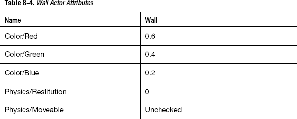

##### 通过

门演员用来给游戏增加一点复杂性。它阻止进入获胜区域。玩家必须执行一些步骤来打开门并进入获胜区域。

创建一个新的 actor，双击它打开 Actor 编辑器。用[表 8-5](#tab_8_5) 中的参数编辑演员属性。

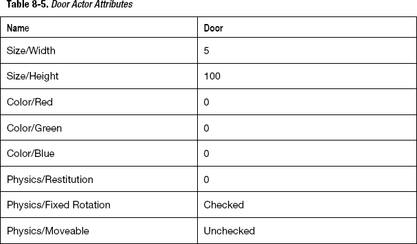

##### 快开门

开门演员被用作打开胜利洞入口的开关按钮。

创建一个新的 actor，双击它打开 Actor 编辑器。用[表 8-6](#tab_8_6) 中的参数编辑演员属性。

##### 胜利洞

胜利洞演员充当球的目标。作为球员，你的目标是把球打进洞里。演员要比球稍微大一点，视觉效果好。

创建一个新的 actor 并双击它以打开 Actor 编辑器。用[表 8-7](#tab_8_7) 中的参数编辑演员属性。

##### 丢失的洞

为了让游戏更难一点，你会使用一些陷阱:让你输的洞。这些是丢失的洞。

创建一个新的 actor 并双击它以打开 Actor 编辑器。用[表 8-8](#tab_8_8) 中的参数编辑演员属性。

### 用规则和行为定义游戏逻辑

现在是时候定义游戏逻辑了。你将会重复使用前面章节中提到的规则和行为。这是回顾定时器行为和加速度计使用的绝佳机会。

##### 球类规则和行为

为了移动球，你将像在第 4 章中一样使用加速度计。你将实现四个方向。请记住，如果你要发布这个游戏，你需要实现自动旋转，以保持有效的运动。

在演员编辑器中打开球演员。创建一个新组，命名为“加速度计。”

创建一个新规则，并将其命名为“up”规则的条件是“属性”“设备”。加速度计。X""

> *   Direction: 270
> *   Relative: actor
> *   Acceleration: max(100, min( 1400, abs). Accelerometer. X * 1000)

该规则如[图 8-2](#fig_8_2) 所示。

**图 8-2。** *向上加速计规则*

该公式将确保您获得模拟加速度。它与加速度计轴的值相关联，所以你移动得越强，它就走得越快。

重复上述步骤三次以上。

按住 option 键并向下拖动现有规则，复制您刚刚创建的规则。把它命名为“对”规则的条件是“属性”“设备”。加速度计。Y"">""0.1。"然后拖放加速行为，并将设置更改为:

> *   Direction: 180
> *   Relative: actor
> *   Acceleration: max(100, min( 1400, abs). Accelerometer. Y * 1000)

该规则如[图 8-3](#fig_8_3) 所示。

**图 8-3。** *右加速计规则*

创建一个新规则，并将其命名为“down”规则的条件是“属性”“设备”。加速度计。X"">""0.1 "。然后拖放加速行为，并将设置更改为:

> *   Direction: 90
> *   Relative: actor
> *   Acceleration: max(100, min( 1400, abs). Accelerometer. X*1000)

该规则如图 8-4 中的[所示。](#fig_8_4)

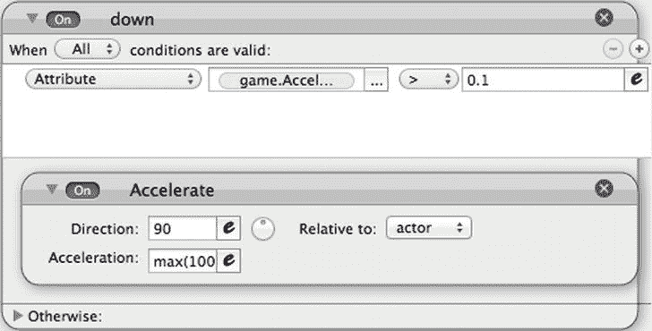

**图 8-4。** *向下加速计规则*

创建一个新规则，并将其命名为“left”规则的条件是“属性”“设备”。加速度计。Y""

> *   Direction: 0
> *   Relative: actor
> *   Acceleration: max(100, min(1400, abs (device). Accelerometer. Y*1000)

该规则如[图 8-5](#fig_8_5) 所示。

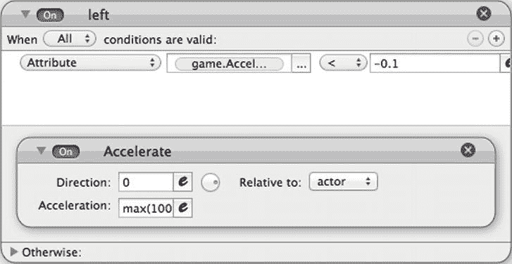

**图 8-5。** *左侧加速度计规则*

提示:如果你想设计一个即将发布的游戏，不要忘记处理屏幕旋转，如[第四章](04.html)中所解释的。

接下来，你需要确保球从墙壁和门演员那里反弹回来。拖放碰撞行为，并将设置更改为与“演员类型”“墙”碰撞时反弹通过拖放第二个碰撞行为重复该操作，但根据[图 8-6](#fig_8_6) 更改设置使其与“类型的演员”“门”碰撞。

**图 8-6。** *球的碰撞规则*

##### 背景规则和行为

背景包含几个更改属性行为，它们将用于将演员完美地定位在屏幕的中心。

在演员编辑器中打开背景演员。创建一个新组，命名为“定位背景”在群组中拖放更改属性行为并更改背景。位置 X 到 240。使用附加的更改属性行为和更改背景重复该操作。位置 Y 到 160。该组如[图 8-7](#fig_8_7) 所示。

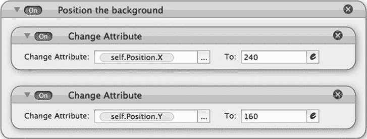

**图 8-7。** *定位背景*

##### 开门规则和行为

你需要打开阻挡通往获胜洞的门。玩家必须将球移动到一个按钮上，该按钮将触发门的打开。该按钮用作开/关按钮。这意味着如果球碰到按钮，它就会打开门。如果球再碰到按钮，就会关门，这样循环下去。

在开门演员里，你会察觉到和球演员的碰撞。这将触发布尔游戏属性的变化。根据前面属性的值，门将从一个位置移动到另一个位置。但是，为了在球再次击中按钮之前有时间将球从按钮上移开，您需要添加一个 2 秒的计时器。如果你不使用这个计时器，让球一直在按钮上移动，它会一直从真到假快速改变状态，以至于你甚至不会用眼睛注意到它。

创建一个布尔类型的新游戏属性，并将其命名为“开门”在演员编辑器中打开开门演员。创建一个 Boolean 类型的新 actor 属性，并将其命名为“Timer”

创建一个新规则，并将其命名为“更改为假”将“全部”应用于以下情况:

> *   [Attributes] [Games]. "Open the door" is "true"
> *   Actor receiving event and actor type ball
> *   "Properties" "Open the door". Timer ""=" "0 "

然后拖拽一个改变属性行为，改变游戏。向 0 敞开大门。

拖放第二个更改属性行为并更改开门。计时器到 1。

接下来，拖放一个计时器行为，并在选中“运行到完成”的情况下，将设置更改为“2 秒后”。

最后，将更改属性行为拖放到计时器中，并更改开门。定时器到 0。

完整的规则如[图 8-8](#fig_8_8) 所示。

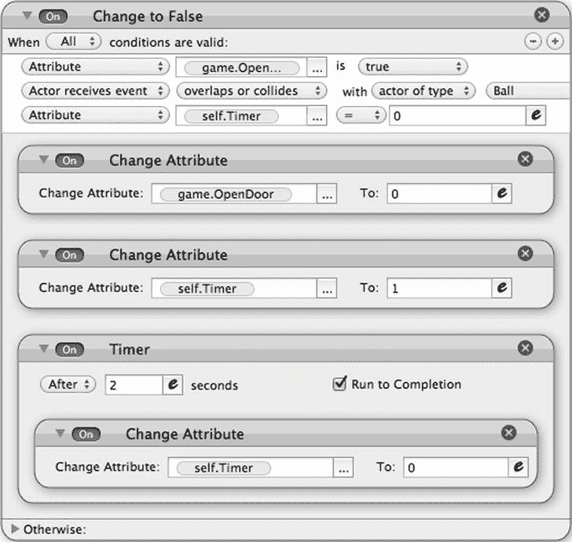

**图 8-8。** *改假统治*

按住 Option 键并向下拖移来复制规则。将其命名为“更改为真”你基本上会把结果反过来。将“全部”应用于以下情况:

> *   [Attributes] [Games]. Open "is" false "
> *   "Actor receives event" "and" Actor type ""ball "
> *   "Attribute" "Open Door" overlaps or conflicts. Timer ""=" "0 "

然后拖拽一个改变属性行为，改变游戏。打开 1 号门。

拖放第二个更改属性行为并更改开门。计时器到 1。

接下来，拖放一个计时器行为，将设置更改为“2 秒后”，并勾选“运行至完成”。

最后，将更改属性行为拖放到计时器中，并更改开门。定时器到 0。

完整的规则如[图 8-9](#fig_8_9) 所示。

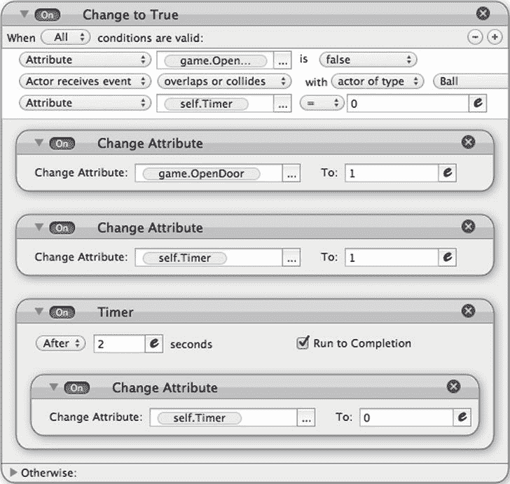

**图 8-9。** *变真法则*

##### 门规则和行为

假设门位于屏幕的顶部，向下打开(如果你想让门向上或向左或向右，你可以很容易地调整设置)。将 Y 位置的初始值存储在 actor 属性中，并对 Y 位置值减去 actor 的高度进行前后插值。

首先，创建一个 real 类型的新 actor 属性，并将其命名为“InitialY”

接下来，拖放一个更改属性行为和更改门。最初是门。根据[图 8-10](#fig_8_10) 定位 Y 轴。

**图 8-10。** *存储初始 Y 位置值*

然后，创建一个新规则，并将其命名为“OpenDoor is True”这条规则将用于开门。将“全部”应用于以下情况:

> *   [Attributes] [Games]. Open "is" true "
> *   [attribute] [door]. Location. Y" "= ""gate. Initially "

第二个条件将检查门是否关闭。

拖放插值行为，并将设置更改为“门”。位置。Y " "门。首先是门。尺寸.高度" " 0.5 " "线性。"

完整的规则如[图 8-11](#fig_8_11) 所示。

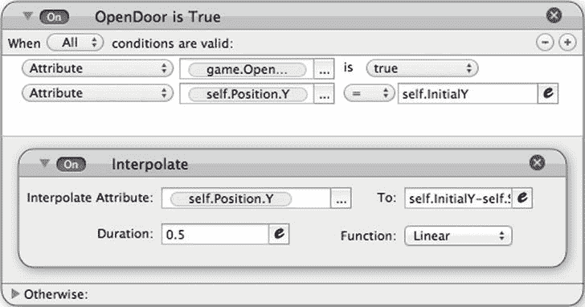

**图 8-11。** *开门是真规则*

最后，创建一个新规则，并将其命名为“OpenDoor is False”这条规则将用于关门。将“全部”应用于以下情况:

> *   [Attributes] [Games]. Open "is [false T2]
> *   [attribute] [door]. Location. Y "Gate. Initial "

第二个条件将检查门是否关闭。

拖放插值行为，并将设置更改为“门”。位置。Y " "门。最初为“0.5”线性

完整的规则如[图 8-12](#fig_8_12) 所示。

**图 8-12。** *开门是假规则*

##### 胜利洞规则和行为

这一部分的最后一步是当球碰到胜利洞演员时重置游戏。对于一个真正的游戏，你会改变场景到下一个级别。

创建一个新规则，条件为“执行元接收事件”“与“执行元类型”“球”重叠或冲突然后按照[图 8-13](#fig_8_13) 将一个重置游戏行为拖放到规则中。

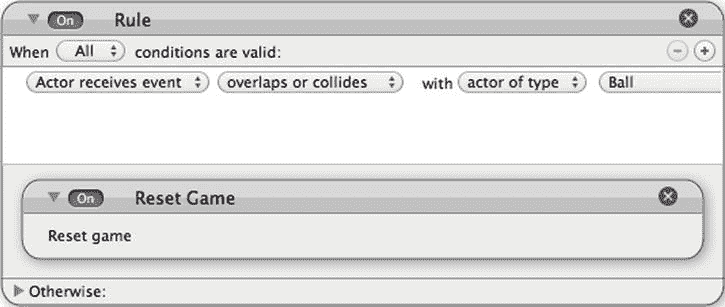

**图 8-13。** *胜利洞法则*

### 通过布置场景来设计游戏区

是时候布置场景了。首先，拖放背景演员，并尝试将其定位在场景的中心。

然后，您将使用不同大小的墙角色的多个实例。GameSalad 允许您拥有多个不同大小的 actor 实例，但仍然坚持规则和行为的原型。

将墙演员拖放到场景中。按照[图 8-14](#fig_8_14) 将鼠标指针定位在演员的侧面(在白色圆圈上)，按住点击并保持点击以调整演员的大小。

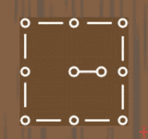

**图 8-14。** *调整演员尺寸*

将尺寸改为最小宽度，高度与场景高度匹配。然后按照[图 8-15](#fig_8_15) 将墙移动到场景左侧。

**图 8-15。** *定位第一面墙*

现在重复操作，以得到类似于图 8-16 的迷宫。

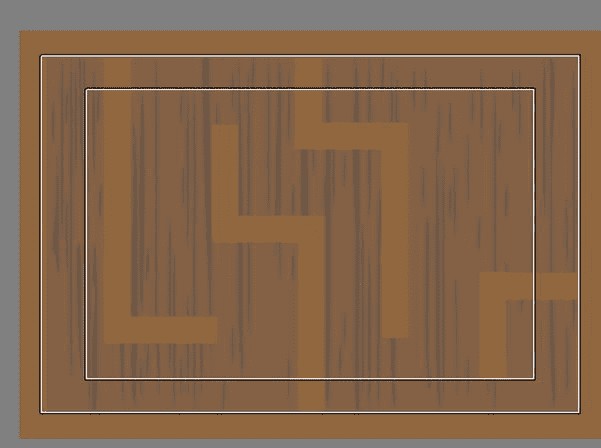

**图 8-16。** *迷宫布局*

最后，根据[图 8-17](#fig_8_17) 将球、胜利洞、开门和门演员拖放到现场。

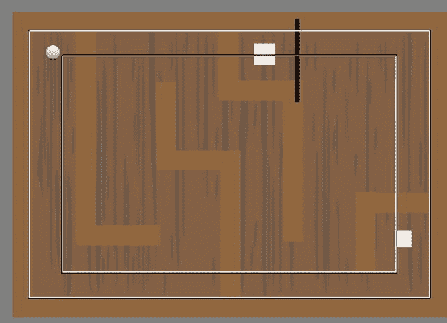

**图 8-17。** *完成布局*

在您的设备上尝试游戏。

### 实现灯光特效

LightFX 被认为是带有灯光的特殊效果。它们通常用于视频游戏中，以增加交互性或增强玩家体验。

打开文件`Labyrinth-step1.gameproj`，可以在这个阶段直接开始。

我现在给你看一个非常酷的魔术。这就是我所说的“灯灭了”想象一下球周围只有少量光线的迷宫游戏；现场一片漆黑。当然，光线必须跟随球，你会通过球发现这个区域。如果你已经有了 iOS 版的迷宫游戏，你就知道这是一个通用的功能。

诀窍很简单。您将使用一个中间有透明圆盘的黑色图像。盘的大小取决于你想做游戏的难度。此外，图像的大小应该是场景大小的两倍。圆盘的中心将被约束到球的位置。有了这个尺寸，无论球去哪里，整个场景都会被覆盖。

你将使用一些游戏属性来存储球的位置。创建两个名为“BallX”和“BallY”的游戏属性

在演员编辑器中打开球演员。拖放一个约束属性行为并改变游戏。BallX 到 Ball.Position.X .对 BallY 和 Position 重复相同的操作。y 根据[图 8-18](#fig_8_18) 。

**图 8-18。** *约束球*

导入位于 Chapter_8 文件夹中名为`Light Off.png`的图像。创建一个新演员，并将图像拖放到新演员上。将该演员重命名为“Light_Off”

在演员编辑器中打开演员，拖放一个约束属性行为，设置为“Light _ off . position . x”“game . ballx .”用 Light_Off.position.Y 和 game.BallY 重复操作

将熄灯演员定位在场景中。

在您的设备上尝试游戏。

### 实现声音特效

SoundFX 被称为带有声音的特殊效果。您将使用声音使您的游戏更具互动性，更生动。它也将为玩家提供额外的信息。

打开文件`Labyrinth-step2.gameproj`，可以在这个阶段直接开始。

为了让游戏更真实，你会使用一个小声音特效——没有什么花哨，只是球撞到墙上时发出的小声音。这将说明如何使用播放声音行为。

我在这里将重点放在播放声音的行为上，但是播放音乐的工作方式大致相同。还有一些行为叫做暂停音乐和继续音乐，我稍后会谈到。

**注意:**播放声音与播放音乐

当声音小于 30 秒时，可以使用播放声音。当声音超过 30 秒时，您应该使用播放音乐。请记住，GameSalad 一次只能播放一个音乐片段，但可以同时播放多个声音。

与图像类似，您需要将声音导入到您的库中，以便能够使用它们。

根据[图 8-19](#fig_8_19) 点击演员编辑器或场景编辑器中的声音选项卡。

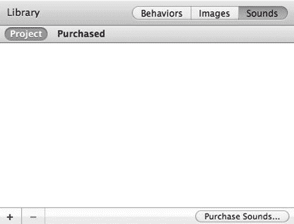

**图 8-19。** *声音标签*

单击+号导入新的音频文件。选择名为`brick.mp3`的文件进行导入。然后，您需要根据[图 8-20](#fig_8_20) 选择是将文件作为音乐还是声音导入。

**图 8-20。** *音乐或声音导入*

选择“导入为声音”

接下来，在 Ball actor 中创建一个规则，在每次与墙壁发生碰撞时播放声音。在演员编辑器中打开球演员。创建一个新规则，条件将是“执行元接收事件”“与“执行元类型”“墙”重叠或冲突根据[图 8-21](#fig_8_21) ，将播放声音行为拖放到规则中，并将设置更改为声音:“砖块”和音量:“0.50”，并选中“运行到完成”。

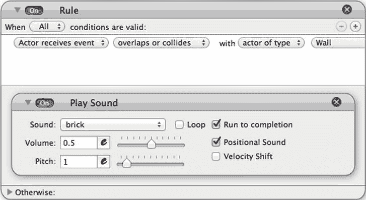

**图 8-21。** *播放声音规则*

我建议尽可能多地使用定位音。定位声音功能增加了大量的交互性。如果播放声音的演员在屏幕的左侧，会给人一种声音是从左侧传来的感觉，非常好看的效果。此外，如果演员在播放声音时移动，声音将随演员一起“移动”。

你可以在你的设备上试试这个游戏。

MP3 或其他格式

GameSalad 支持`Caf`、`ogg`、`mp3`、`m4a`等多种声音格式。

关于暂停音乐和继续音乐:

如果您在游戏中实现了暂停功能并有背景音乐，您可能希望暂停音乐，并在玩家取消暂停游戏后继续播放。为此，您需要使用暂停音乐和继续音乐行为。

### 总结

在这一章中，你回顾了创建一个新项目和定义游戏的基础。你还学到了一些非常强大而简单的特效，这些特效肯定会增加游戏和玩家体验的趣味。

你有:

> *   Review the creation of new GameSalad projects.
> *   Strengthen the use of rules and behaviors to define gameplay.
> *   Learned how to realize lighting special effects.
> *   Learned how to use sound behavior to achieve sound effects.