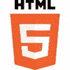
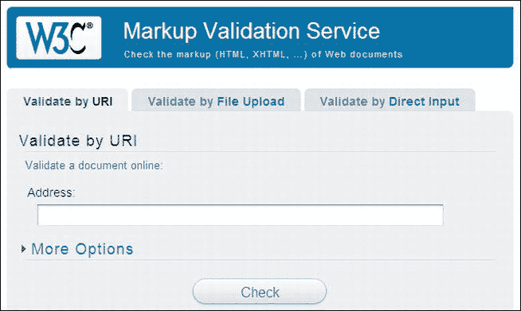
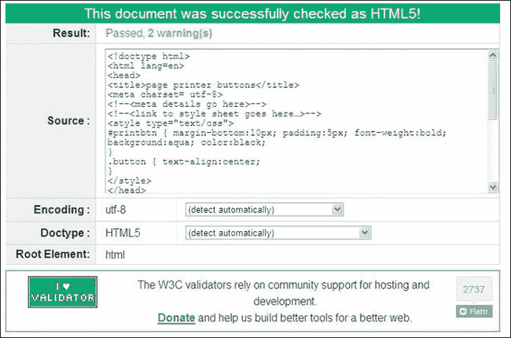

## 18

## 确认

### 为什么你应该验证

验证是一个经常被请求的增强功能。客户要求我在他们的页面上添加一个 W3C 验证标志，以表明他们雇佣了一个有能力的网页设计师。验证使网页设计者为他们准确的编码感到自豪。验证还有一些实际原因，如下所示:

> 验证是解决模糊问题的另一种方法。通过在不同浏览器中测试页面之前进行验证，设计人员可以节省时间并避免失败。*   It ensures that your page is coded correctly, so that the browser won't produce strange results.*   It ensures that the search engine will not be blocked because of your tiny coding errors.*   Disabled users will be able to access your page. Small coding errors will trouble automatic screen readers.*   The mobile device has a reduced version of the browser; They can't handle errors in unverified websites.T11】

#### html 5 和 XHTML5 的文档类型

要验证 HTML5 页面，DOCTYPE 必须设置为下列之一:

对于 HTML5

`        <!doctype html>
        <html lang=en>
        <head>
<title>HTML5 test page</title>
<meta charset=utf-8>
                *meta details go here*
</head>`

对于 XHTML5

`<!DOCTYPE html>
<html lang="en">
<head>` `<title>XHTML5 test page</title>
        <meta charset="utf-8" />
                *meta details go here*
</head>`

`lang=en`指定英语语言。

 **提示**对于非英语语言，参见`[http://www.w3schools.com/tags/ref_language_codes.asp](http://www.w3schools.com/tags/ref_language_codes.asp)`和`[http://www.iana.org/assignments/language-subtag-registry](http://www.iana.org/assignments/language-subtag-registry)`

### 标志

如果一个页面有一个可访问的数据表，该页面必须是 HTML4 或 XHTML1.0，因为屏幕阅读器(在编写时)不能正确读取 HTML5 表(见[图 18-1](#fig_18_1) 中 HTML4 和 XHTML 1.0 的相关验证标志)。

#### HTML4 和 XHTML 1.0 徽标

当 HTML4 或 XHTML 1.0 页面通过验证时，您有权在页面上放置验证证书，以向您的客户证明您能够按照最新标准正确编写网站代码。您还可以下载经过验证的 CSS2 样式表的徽标。对于 HTML4 和 XHTML 1.0，你可以选择蓝色或黄色的标志。HTML4 和 XHTML 1.0 标识如图[图 18-1](#fig_18_1) 所示。

***图 18-1。**这些可下载的徽标可从 W3C 验证器获得*

HTML5 的 logo 有点不一样。我们接下来会看到这一点。

#### html 5 标志

[图 18-2](#fig_18_2) 显示了 2011 年 1 月发布的 HTML5 标志。

***图 18-2。**html 5 验证标志*

目前，HTML5 标识并不表示 W3C 是提供验证的权威。你需要在你的页面上说明这一点。

HTML5 徽标有多种尺寸和多种配置。W3C 徽标网站很漂亮，但令人困惑。它在`[http://www.w3.org/html/logo/](http://www.w3.org/html/logo/)`被发现

 **注意**W3C 网址中没有字母“c”；是`w3.org`不是`w3c.org`。它是在知识共享署名 3.0 下许可的。您可以更改徽标的颜色和大小，以匹配您的网页。

#### 可验证 HTML5 徽标的解决方案

HTML4 和 XHTML 1.0 徽标附带了完整的 HTML 代码，这样用户就可以单击徽标并收到页面经过真正验证的验证。在撰写本文时，HTML5 徽标没有这种保护措施；网站管理员可以欺骗并嵌入 HTML5 徽标来假装页面是有效的。

同时，我设计了一些代码来克服这个缺陷。该代码既可以消除动态嵌入 HTML5 徽标的需要，也可以从您的`images`文件夹中调用它。在网页的适当位置输入清单 18-2 中粗体显示的代码；你用它不需要我的许可。

 **注意**一个页面必须上传到主机，使我的徽标代码在单击时产生验证报告。如果您不这样做，一个错误消息将告诉您验证程序无法定位 referer。

***清单 18-2。【在网页上放置可验证的标志(verifiable-code-1.html)***

`<!doctype html>
<html lang=en>
<head>
<title>Validation logo for html5</title>
<meta charset=utf-8>

</head>
<body>
**
**
**<a href="http://validator.w3.org/check?uri=referer">**
**</a>**
**
**
</body>
</html>`

如果您希望从根文件夹中的 images 文件夹加载图像，而不是从 W3C 网站加载，请将 64 像素徽标下载到 images 文件夹中，然后使用下面的替代代码片段(`verifiable-code-2.html`):

`**
**
**<a href="http://validator.w3.org/check?uri=referer">**
**</a>**
**
**`

如果您喜欢较小的徽标，请在代码片段中将 64 的每个实例都改为 32。您需要下载 32 像素版本的徽标，以使第二个代码片段能够显示小徽标。

 **注意**验证 HTML4、XHTML 1.0、XHTML5 或 HTML5 时，验证报告有时会引用错误的行号。报告将引用一个行号，但您不会在该行上找到错误。这很正常；在所示行附近的行中查找错误，尤其是在前面的行中。

### 使用 W3C 验证器

W3C 验证器和 HTML5 徽标目前位于 W3C 网站的不同文件夹和不同页面中。此外，没有必要代码的 W3C 标志并不意味着页面是有效的。希望这本书出版时这些遗漏能被弥补。

我强烈推荐 W3C 验证器。[图 18-3](#fig_18_3) 显示了 W3C 验证器的界面，它在`[http://validator.w3.org](http://validator.w3.org)`被访问。

 **注意**不管你用哪个`DOCTYPE`，HTML4，XHTML 1.0，HTML5，还是 XHTML5，验证器都会识别出来并产生报告与之匹配。这同样适用于编码；它将自动检测它，并根据您的页面是`utf-8`还是任何 Windows 或 ISO 编码进行验证。

***图 18-3。**W3C 验证器的接口*

当你在浏览器中打开 W3C 验证器时，你会看到三个标签:通过 URI 验证、通过文件上传验证和通过直接输入验证。以下提示将帮助您决定应该选择哪个选项卡:

> *   **如果你的页面已经上传到一个网络主机**，选择第一个标签，将页面的 URL 复制粘贴到地址栏或者输入；比如`[http://www.mywebsite.co.uk/myhomepage.html](http://www.mywebsite.co.uk/myhomepage.html)`。
>     
>     单击"检查"按钮,等待几秒钟。最终会出现一份报告如果页面尚未上传到您的 web 主机，请单击文件上传选项卡，在您的计算机上浏览到该页面的文件，并加载它。然后单击“检查”按钮。
>     
>     
>     
>     或者单击"通过直接输入验证"选项卡,将页面的整个标记粘贴到提供的文本区域中。然后单击"检查"按钮

[图 18-4](#fig_18_4) 显示了一次成功的标记。

***图 18-4。**W3C 验证器成功验证了一个标记页面*

[图 18-4](#fig_18_4) 显示了粘贴到文本区域的标记页面的成功验证。如果验证给出一个或两个警告，它们可以被忽略，因为它们指的是验证器是实验性的，而`utf-8`是自动假定的。警告与您的页面无关。

如果验证报告有一个绿色的标题，那么你的网页是有效的。如果它有一个红色的标题，那么你有一个或多个错误。我认为这是一个糟糕的颜色选择，因为最常见的色盲是红色/绿色。无论如何，以下部分回顾了一些错误和建议的解决方法。

 **提示**为了最大限度的方便，使用文本编辑器来显示行号并打印页面标记。将打印结果放在计算机旁边，以便可以参考认证报告提供的行号。

HTML4 和 XHTML 1.0 的早期验证器检查正确的代码样式和标记错误。HTML5 验证器只关心标记错误。因为 HTML5 是向后兼容的，它将接受任何早期的样式，验证器也相应地工作。例如，HTML5 验证器将接受`<meta charset=utf-8>`、`<META charset="utf-8">`、`<meta CHARSET=UTF-8 />`或这些样式的任意组合。但是，它不会验证`<meta charset=utf8>`，因为缺少的连字符是错误的标记。

#### 一些典型的 HTML5 验证错误以及如何修复它们

与验证 HTML4 和 XHTML 1.0 相比，HTML5 文档报告的错误更少，因为 HTML5 验证器只查找错误的标记；它不检查代码样式。

如果验证器报告的标题是红色的，问题列表和建议的解决方案将出现在红色标题的下面。

看到红顶报告中列出大量错误，您可能会感到震惊。不要担心，验证器总是报告许多错误，而实际上只存在少数错误(许多报告的错误是重复的)。

以下部分描述了一些典型的验证报告和适当的修复。

##### 一份 W3C 验证报告发现了以下三个错误

下面是提交给验证器的 HTML5 标记的一个片段。我在括号中添加了行号，仅用于教学目的。

`(10) <!--[if lte IE 8]><!-- conditional Javascript added -->
(11) 
(13) <![endif]-->`

验证报告的第一部分如下:

`Line 10, Column 23: Consecutive hyphens did not terminate a comment. -- is not permitted
inside a comment, but e.g. - - is.
<!--[if lte IE 8]><!--conditional Javascript added-->
 Line 10, Column 23: The document is not mappable to XML 1.0 due to two consecutive hyphens in
a comment.
<!--[if lte IE 8]><!--conditional Javascript added-->
 Line 13, Column 3: Bogus comment.
<![endif]-->
 Line 13, Column 11: The document is not mappable to XML 1.0 due to two consecutive hyphens in
a comment.
<![endif]-->
 Line 13, Column 12: The document is not mappable to XML 1.0 due to a trailing hyphen in a comment.
<![endif]-->`

不要让报告难倒你，而是按照以下四个步骤开始清除警告和一些重复。

 **提示**将报告复制到 Notepad++或其他显示行号的文本编辑器中。然后清除警告。删除引用 XML 的行，因为这些行是已经报告的行的变体。这留下了一个更清晰的工作区域(如下所示)。

> 1.  从报告中删除了所有警告，因为它们适用于验证器，而不是文档。我删除了所有对 XML 的引用，因为它们重复了前面的错误消息。以下是报告第一部分的剩余内容:`Line 10, Column 23: Consecutive hyphens did not terminate a comment. -- is not
>     permitted inside a comment, but e.g. - - is.
>     <!--[if lte IE 8]><!--conditional Javascript added-->
>     <!--[if lte IE 8]><!--conditional Javascript added-->
>      Line 13, Column 3: Bogus comment.
>     <![endif]-->`
>     
>     报告指出,评论中不允许出现连续的连字符。我们知道注释中的连续连字符是正确的,那么问题是什么呢？验证器将条件代码块视为注释。这是正确的,因为它以`<!--`开始,以`-->`结束。报告应该说你不能在评论里有*的评论于是，我将注释移到了条件注释的上方，并再次尝试验证。修改后的标记如下所示。`**<!-- conditional Javascript added -->**
>     <!--[if lte IE 8]>
>     
>     <![endif]-->`*
>     
>     
>     
>     此验证成功；只剩下第三个错误,如下所示
>     
>     `Line 38, Column 42: Bad value 88px for attribute width on element img: Expected a digit but
>     saw p instead.
>         title="Valid CSS!" alt="Valid CSS!" /></a>Syntax of non-negative integer:
>     One or more digits (0–9). For example: 42 and 0 are valid, but -273 is not.`:
>     
>     查看标记,很明显出现了一个愚蠢的错误,如粗体所示
>     
>     `
<a href="http://jigsaw.w3.org/css-validator/">     width="88**px**" height="31" title="Valid CSS!" alt="Valid CSS!"></a>
>       Markup Validated by the World Wide Web Consortium
`
> 2.  The last paragraph of the report said that it saw a letter "P" instead of a number. The width of images in HTML tags can only be numbers. `88px` is very good in CSS stylesheets, but it is not a good tag when it is included in HTML pages. After `px` is removed, the whole page is verified successfully.

##### 视频文件会产生验证错误和警告

一个播放视频的 HTML5 文件被提交给验证器，验证器报告了 14 个错误和 2 个警告。这两个警告被忽略，因为它们与验证程序有关，而与页面无关。其中 12 个错误是相同的——12 个&符号被写成`'&'`。验证器建议将&符号改为实体`&amp;`。使用“查找和替换”,十二个“与”符号变成了实体。然后，在几个浏览器中测试该页面，以检查其功能是否正常；幸运的是，它做到了。页面再次被提交给验证器。该报告只给出了两个错误，如下所示:

`Line 20, Column 49: Element object is missing one or more of the following attributes: data, type.
        <object width='320' height='265' id='flvPlayer'>Attributes for element object:
Line 24, Column 9: Stray end tag embed.  </embed>`

我注释掉了`</embed>`标签，然后页面在浏览器中测试，然后重新提交给验证器。这一次，唯一的错误在第 20 行，这里的属性在`<object>`标签中丢失了。

验证程序推荐了一个`data`或一个`type`属性。首先，一个`Mime` `type`被匹配到视频，这是一个冲击波文件。

在互联网上快速搜索发现了一个冲击波文件的 MIME `type`;它被输入到代码中，如粗体所示。

`<object width='320' height='265' id='flvPlayer' **type="application/x-shockwave-flash"**>`

修改后的页面在浏览器中运行正常，并且验证成功。

##### 找到字节顺序标记

Microsoft Expression Web 是创建标记的程序之一，这些标记会产生神秘的警告“发现字节顺序标记”。

字节顺序标记(BOM)是嵌入在`utf-16`页中的字节序列。它确保您的 utf-16 文档能被 web 浏览器正确读取。不幸的是，默认情况下，MS Expression Web 会在不需要 BOM 的地方向`utf-8`页面或 PHP 页面添加 BOM。

在 MS Expression Web 中，要防止 BOM 包含在新页面中，请按照下列步骤操作:

> 1.  Click Tools and select the Page Editor Options dialog box.
> 2.  On the authoring tab, check the contents under New Document.
> 3.  Then add a byte order mark (BOM) to the new `utf-8` document with these file extensions, and you will see a list of file extensions.
> 4.  Clear the check box next to each file extension that you do not want BOM.

要从现有页面中删除 BOM，请执行以下操作:

> 1.  Open the document in Expression Web.
> 2.  In Code view, right-click anywhere, and then click Encoding.
> 3.  In the text file encoding dialog box, clear the check box marked "Include a byte order mark (BOM)".
> 4.  Save the page and upload it; And then re-verify.

 **注意**免费的 Notepad ++程序有一个 BOM 移除工具。加载页面，单击菜单上的“格式”，然后选择“转换为不带 BOM 的 UTF”。Notepad ++还提供了行号、颜色编码和许多其他用于编辑任何类型的 web 文档的强大功能。

##### 检测到罕见或未注册的字符编码

如果您看到该错误消息，那么包含文本编码的 meta 标记中有一个错误。标记应如下所示:

`<charset=utf-8>`

很可能你省略了`utf-8`中的连字符。

关于 PHP 页面，包含一些 PHP 代码是“罕见或未注册字符”错误消息的常见原因。要验证包含 PHP 的页面，字符集必须是`windows-1252`，如下所示:

`<charset=windows-1252>`

#### 验证可访问数据表:HTML4 和 XHTML 1.0 验证错误及解决方案

对于盲人和弱视者，任何数据表都必须出现在 XHTML 1.0 或 HTML4 页面上。在屏幕阅读器能够正确读取具有三列或更多列的 HTML5 数据表之前，这将是必要的。

以下部分主要处理 HTML4 和 XHTML 1.0 页面上的错误，但有些也适用于 HTML5 页面。本节只提到了少量的验证错误，因为有 447 个已知的错误，而且篇幅有限(请访问下面技巧中的`w3.org`网站，查看所有已知的错误消息)。

 **提示**有关验证错误及其解决方案的列表，请访问网站`[http://line25.com/articles/10-common-validation-errors-and-how-to-fix-them](http://line25.com/articles/10-common-validation-errors-and-how-to-fix-them)`和`[http://validator.w3.org/docs/errors.html](http://validator.w3.org/docs/errors.html)`。虽然这些 URL 主要处理 HTML4 和 XHTML 1.0 验证错误，但有些也适用于 HTML5。

看到红顶报告中列出大量错误，您可能会感到震惊。验证器在页面顶部发现一个错误，然后它向下级联报告，多次重复相同的错误报告，有时使用不同的单词。例如，在验证有错误的页面时，这些错误可能会作为 XML 解析错误在报告中重复出现。只要忽略它们，当你纠正靠近报告顶部的错误时，它们就会消失。

##### 一些最常见的验证错误信息

以下是一些最常见的验证错误消息:

> **OMITTAG NO** :这是常见错误的前兆。查找未正确关闭的元素。
> 
> `Line 78, Column 9: end tag for "html" omitted, but OMITTAG NO was not specified.`
> 
> 开始的结束标签应该出现在页面的最后一行。我漏掉了标签。
> 
> **`
`**标签【XHTML 1.0 最常见的错误是`
`缺少结束标签`
`。****
> 
>  ****结束标签**:XHTML 1.0 中的一些结束标签与普通 HTML4 不同；必须用` `代替` .`标签` `称为自结束标签。所有的 XHTML 1.0 `<meta>`标签和``标签都必须用一个像这样的正斜杠`…" />`结束。该报告陈述了这样的闭合错误:
> 
> `Line 38, Column 10: end tag for "ul" omitted but OMITTAG NO was not specified.`
> 
> 这意味着在 HTML4/XHTML 1.0 页面中省略了结束标记尖括号`>`，或者在 XHTML 1.0 或 XHTML5 页面中结束标记应该是`/>`而不是`>`。
> 
> 当报告闭合错误时，即使只有一个闭合错误，也会有几个错误级联通过报告。修正错误，瀑布就会消失。
> 
> **一个没有打开的元素**:闭包错误的反义词。
> 
> `Line 87, Column 12: end tag for element "SPAN", which is not open.`
> 
> 这可能意味着您在文档的前面删除了一个内联标签，比如``，但是忘记删除页面中它的结束元素。
> 
> **小写**:记住 XHTML 1.0 标记必须全小写。验证器将会看到小写字母。
> 
> **不正确的嵌套**:一些标签错误可能被描述为在不允许的地方。您可能将`<ul> <li>`元素与表格元素`<tr> <td>`混合在一起。错误消息将会显示如下内容:
> 
> `Line 33, Column 32: document type does not allow element "li" here.`
> 
> **内嵌元素**嵌套:在下一个例子中，验证器说像`<ul>`这样的块元素标签不能包含在``标签中。
> 
> `Line 52, Column 4: document type does not allow element "ul" here.
>         ****
>         <ul>
>         <li>he Haven provides sheltered housing companionship in retirement</li>
>         <li>Thirteen purpose built units for single or double occupancy</li>
>         </ul>
>         ****`
> 
> 应该去掉``标签，将类插入到`<ul>`标签中。
> 
> 此处不允许的其他*错误是用内嵌标签包围块元素的结果。例如，用``标签、`<b>`标签或`<strong>`标签包围一个无序列表。*
> 
>  ***弃用的标签和属性**:错误报告会发现 HTML4 或 XHTML 1.0 中不再接受的弃用元素；例如:
> 
> `Line 32, Column 7: there is no attribute "CENTER".`
> 
> 这意味着*中心*在 HTML 标记中不再被接受；必须使用样式表使元素居中。
> 
> W3C 验证程序更有帮助的解释示例:
> 
> `Line 137, Column 19: value of attribute "ALIGN" cannot be "ABSBOTTOM"; must be one
> of "TOP", "MIDDLE", "BOTTOM", "LEFT", "RIGHT". align="absbottom" width="199"
> height="231">`
> 
> 有些属性(如 align)不再适用于将文本与图像对齐，只接受顶部、中间、底部、左侧和右侧。
> 
> **alt**:验证器会报告`"alts"`图像丢失。
> 
> 有些报道不明确；例如:
> 
> `Line 25, Column 39: document type does not allow element "li" here; missing one of
> "ul", "ol", "menu", "dir" start-tag . <li>Home page<li>.`
> 
> 我忘记了在结束标签中加一个正斜杠，就像这样`</li>`。
> 
> 出现了一些误报，如下例所示:
> 
> `Elements not allowed here
> Line 23, Column 9: document type does not allow element "h2" here; missing one of
> "object", "applet", "map", "iframe", "button", "ins", "del" start-tag . <h2>some
> heading text was here</h2>`
> 
> 我查看了第 23 行，没有发现错误；`h2`元素已正确关闭。然后我查看了附近的行，发现在第 22 行，没有一个`
`元素的结束`
`标记。错误报告的错误通常可以通过查看未关闭的`
`报告行的上方和下方来修复。***

 ***提示你会得出结论，报告的错误并不总是像它们看起来那样。您需要通过查看错误行之前或之后的行来确定报告应该说些什么。就像纵横字谜中的神秘线索一样，通过练习，你会认识到这些模式，并知道如何纠正编码错误。

### The。nu HTML5 验证程序

替代验证网站是`[http://html5.validator.nu](http://html5.validator.nu)`

我发现这相当容易使用，但是它的报告不如 W3C 验证器的信息丰富。W3C 验证器实际上使用了`.nu`验证器作为其代码扫描过程的一部分。我倾向于只使用 W3C 验证器，但这可能是因为我对它太熟悉了。你不应该让我个人的偏好阻止你探索`.nu`验证器。它在不断改进，它的界面是不言自明的。整洁的界面如图[图 18-5](#fig_18_5) 所示。

***图 18-5。**美国。nu 验证器的界面*

在撰写本文时，`.nu`验证器没有提供 HTML5 徽标。为此，您需要访问 W3C 徽标网站。然后，您将需要添加我的代码片段，使用户能够检查验证。

 **注意**在撰写本文时，W3C HTML5 和 XHTML5 验证器以及`.nu`验证器都是“高度实验性的”此外，随着时间的推移，`.nu`验证器的外观会随着每次更新而改变。XHTML5 页面的`.nu`祝贺消息指出被检查的文件是 HTML5，反之亦然。在编写本文时，`.nu`验证器只会产生一个 HTTP 错误 415，并且拒绝验证任何 HTML5 文件。这有望在本书出版时得到纠正。

### 验证 CSS2

转到`[http://jigsaw.w3.org/css-validator/](http://jigsaw.w3.org/css-validator/)`，你会发现一个类似于 HTML 验证器的界面，但是标题是 CSS 验证服务。

> *   **如果你的 CSS 页面已经上传到你的网络主机**，使用以下格式输入你想要验证的 CSS 样式表的 URL:`[http://www.mywebsite.co.uk/mystylesheet.css](http://www.mywebsite.co.uk/mystylesheet.css)`。
>     
>     单击"检查"按钮,等待几秒钟。最终会出现一份报告如果 CSS 页面尚未上传到您的 web 主机，请单击文件上传选项卡，在您的计算机上浏览到该页面的文件，并加载它。然后单击“检查”按钮。
>     
>     
>     
>     或者单击"通过直接输入验证"选项卡,并将半铸钢ˌ钢性铸铁(Cast Semi-Steel)页面标记粘贴到提供的字段中。然后单击"检查"按钮

如果标记未能通过验证，您将得到有关错误的提示。如果它通过验证，你会得到一个标志放在你的网页上。

下面的例子可能令人困惑:

* * *

`29    li.btn a                Same color for background-color and border-right-color
29    li.btn a                Same color for background-color and border-top-color
29    li.btn a                Same color for background-color and border-left-color
30    li.btn a:hover          Same color for background-color and border-top-color
30    li.btn a:hover          Same color for background-color and border-left-color
30    li.btn a:hover          Same color for background-color and border-right-color
32    li.btn a:active         Same color for background-color and border-top-color
32    li.btn a:active         Same color for background-color and border-left-color
32    li.btn a:active         Same color for background-color and border-right-color
35    Same colors for color and background-color in two contexts li.btn a:active and
#footer`

* * *

菜单 3D 按钮的起始边框颜色已设置为与背景颜色相同。可以安全地忽略这些警告，但是如果您愿意，可以通过稍微更改开始的边框颜色使其不同于背景颜色来消除错误。

如果文本和渐变背景使用相同的颜色，CSS 样式表也将无法验证。例如，如果背景是带有绿色背景渐变的白色，并且文本也是白色。验证器忽略渐变，将真实背景(白色)与文本(白色)进行比较。它会将此报告为错误。

#### CSS3 验证和供应商特定错误

要验证 CSS3 样式表，请转到`[http://jigsaw.w3.org/css-validator/](http://jigsaw.w3.org/css-validator/)`。

 **注意**对于 CSS3，必须点击更多选项按钮。为您的标记条目选择一个选项卡。然后单击 Profile 字段中的下拉箭头，并选择 CSS Level 3。

> *   **If your CSS page has been uploaded to the network host** , use this format.
> *   `[http://www.mywebsite.co.uk/mystylesheet.css](http://www.mywebsite.co.uk/mystylesheet.css)`键入你想要验证的 CSS 样式表的 URL。
>     
>     单击"检查"按钮,等待几秒钟。最终会出现一份报告如果 CSS 页面尚未上传到您的 web 主机，请单击文件上传选项卡，在您的计算机上浏览到该页面的文件，并将其加载。然后单击“检查”按钮。
>     
>     
>     
>     或者单击"通过直接输入验证"选项卡,并将半铸钢ˌ钢性铸铁(Cast Semi-Steel)页面标记粘贴到提供的字段中。然后单击"检查"按钮

CSS3 验证器将报告样式表中任何供应商特定项目的错误；即`-mozkit-`、`-webkit-`等项目。这是您所期望的，因为特定于供应商的项目不是 W3C 推荐的；验证器的作用是检查是否符合 W3C 推荐标准。这样的错误将会继续被报道，直到浏览器厂商支持 CSS3 并放弃他们特定的攻击。尽一切办法玩 CSS3，但也许你应该忘记 CSS3 和它在客户网站上的验证标志，直到这些黑客不再需要，当 IE 7 和 IE 8 最终过期。同时，在客户的网站上使用 CSS2。

例如，测试了一个 CSS 样式表，验证器给出了一个带有红色横幅的报告。典型故障报告的内容如[图 18-6](#fig_18_6) 所示。

***图 18-6。**CSS3 表的 CSS 验证报告*

我检查了提交的代码，发现了错误和警告，如下面粗体文本所示:

`(1) table { width: 500px; border:1px black solid; border-collapse:collapse; }
(2) td { border:1px black solid; padding:0 **5px;**0 5px }
(3) th { border:1px black solid; }
(4) caption { font-weight:bold; }
(5) table tr:nth-child(even) { **background-color: #C8F0F0;** }
(6) .right { text-align:right; }`

在第 2 行中，5px 后面的分号应该位于行尾，如下所示:

`td { border:1px black solid; padding:0 5px 0 **5px;** }`

关于第五行的警告建议总是指定文本颜色和背景颜色。这一行应该是:

`table tr:nth-child(even) { background-color: #C8F0F0; **color:black;** }`

当修正后的 CSS 代码被重新验证时，它给出祝贺信息，如图[图 18-7](#fig_18_7) 所示。这个案例中的横幅是绿色的。

***图 18-7。**W3C CSS3 验证程序显示验证成功*

在撰写本文时，CSS3 的验证标志还不可用，但正如你在图 18-7 中看到的，你可以看到传统的 CSS 标志和代码，使用户能够验证验证。

### 总结

在本章中，您发现了验证对于故障排除和确保代码在各种设备上正常运行是多么有用。提供了一个代码片段来嵌入 HTML5 徽标，使用户能够检查页面是否经过真正的验证。您还了解了从验证器收到的报告可能相当神秘，为了熟悉它们的含义和解决方案，需要进行一些练习。

在下一章，你将学习如何处理设计网站时出现的一些问题。故障排除是 web 开发的一个重要方面；下一章的提示和捷径将会节省你的时间和挫折。***