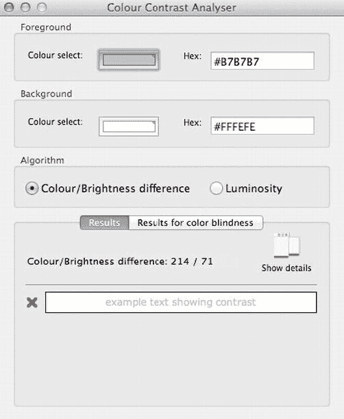
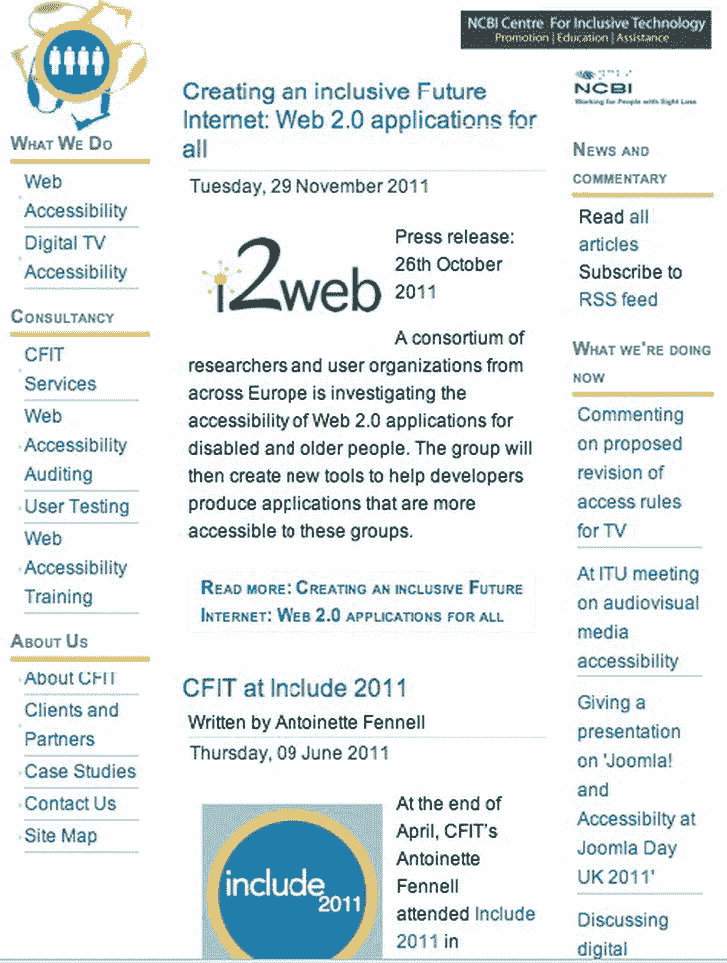
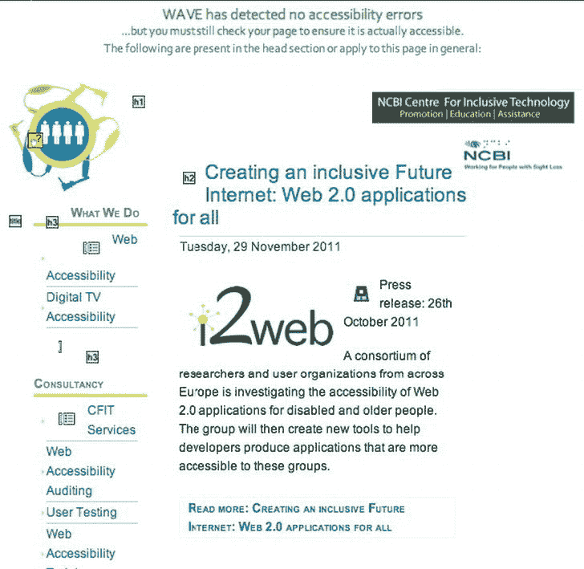
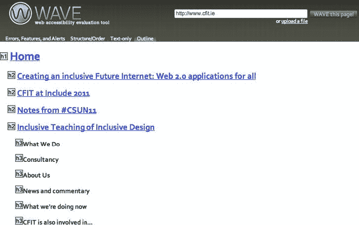
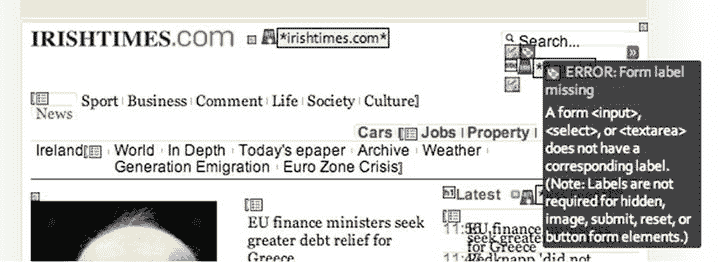
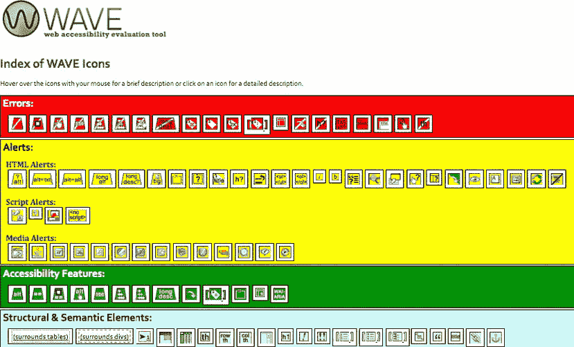
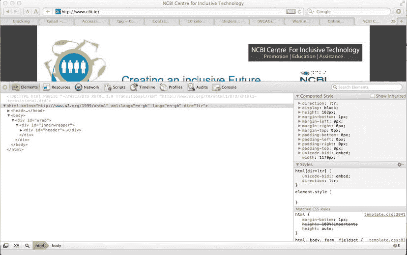
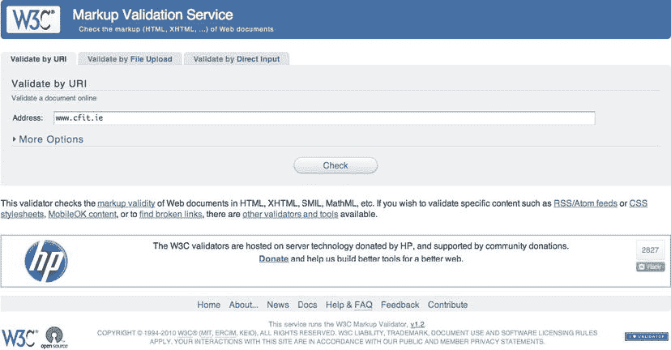
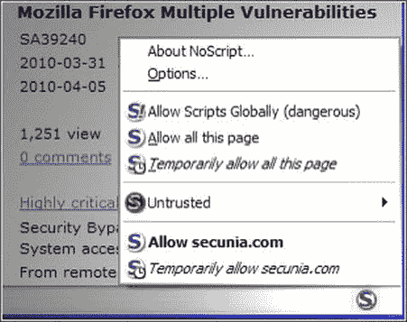

# 十、工具、提示和技巧：评估可访问的 HTML5 项目

在这一章中，你将看到一些可用的工具和技术来帮助你的可访问的 HTML5 站点达到最好。通过花一点时间使用我将在这里概述的一些工具，您可以避免一些常见的陷阱，并测试您的工作(或者其他人的工作)以了解其可访问性水平并评估其可用性的一些方面。

 **注意**好消息是有很多你喜欢的浏览器的插件；坏消息是你最喜欢的浏览器有很多插件！在这一章中，我将概述一些我最熟悉的或者我在为我的客户对网站进行日常评估时使用的方法。

我们将讨论诸如*验证*和*自动化可访问性检查*等主题，并且您将看到如何在测试中使用屏幕阅读器(包括如何做和如何不做)。您还将看到如何进行快速的“游击式用户测试”(读完上一章后，您应该还记忆犹新)。此外，如果您没有设备与真人一起进行用户测试，本章将展示一些简单的模拟技术，可能有助于您了解残障人士可能会如何体验您的网站。

### 对开发者有用的工具

接下来我们将看看一些不可或缺的工具，你可以用它们来提高你的 HTML5 项目的可访问性。

#### Chris Pederick Web Developer 工具栏

我很遗憾地说，您将看到的第一个工具不再由开发人员维护。然而，它是最好的之一。它是 Firefox 的 Chris Pederick Web Developer 工具栏，如图 10-1 所示。

***图 10-1。**Firefox 中的 Web 开发者工具栏*

这是一个优雅的工具，可以用来测试页面是否存在 HTML 标题、未标记的表单控件、缺少`@alt`的图像以及许多其他非常有用的与可访问性相关的东西。它的上一个官方版本是针对 Firefox 4 的，也有一个 Chrome 版本。话虽如此，这个插件仍然可以在我使用的 Firefox 9 的一个实例中工作，但它可能会有问题。我希望将来会发布一个更新的插件，它可以在新的浏览器上工作。它值得一提纯粹是因为它太好了。更多详情，敬请关注`[http://chrispederick.com/work/web-developer](http://chrispederick.com/work/web-developer)`。

#### WAT-C 网页可访问性工具栏(Internet Explorer 和 Opera)

Web Accessibility Tools Consortium(WAT-C)开发了这个工具，Jim Thatcher(他开发了第一个屏幕阅读器)将其描述为“近年来在可访问性方面发生的最好的事情”。由的 Steve Faulkner 和 WAT-C 的 Jun 开发的 WAT-C 网页可访问性工具栏如图[图 10-2](#fig_10_2) 所示。

***图 10-2。**Internet Explorer 中的网页可访问性工具栏*

这是一个很好的工具，既可以识别网页的各种组件，也可以让您访问页面内容的其他视图。您可以使用它来获得结构(或缺少结构)的概述、表格标记的好坏(例如，它们是否有表格标题、合适的标题或摘要数据)等等。Web 辅助功能工具栏提供英语、法语、意大利语、德语和中文等语言版本。WAT-C 一直致力于开发其工具的新版本——在 WAT-C 网站`[www.wat-c.org/tools](http://www.wat-c.org/tools)`上可以找到完整的版本。

#### 色彩对比分析仪

另一个我经常使用的优秀工具是色彩对比分析仪，如图 10-3 所示。

 **注意**我第一次看到这个工具是作为火狐浏览器的插件，最初是由 Gez Lemon(TPG Juicy Studio 的)开发的。

我在 Mac 上(大部分时间)，所以我喜欢使用该平台自带的工具(尽管我也在 PC 上做了很多测试)。当 TPG 的 Cédric Trévisan 为 Mac 开发了色彩对比分析器时，我真的很高兴，这是一个非常好的工具，我用来检查用户界面的前景和背景色。它可以告诉我这些颜色对视力受损的人来说是否有问题。

该工具检查前景色和背景色的组合，以确定它们是否提供了良好的颜色可视性。它还包含创建某些视觉条件(如色盲)模拟的功能。

颜色可见度的概念是基于万维网联盟(W3C)提出的对比度算法。

 **注意**对比度是 W3C 的一个建议，用于帮助色盲或其他视觉障碍的人判断两种颜色之间的对比度。

***图 10-3。**色彩对比分析仪(Mac 版)*

您可以使用该工具来帮助确定网页上文本的易读性以及基于图像的文本表示的易读性。当您想要查看您的内容是否符合 Web 内容可访问性指南(WCAG)时，它特别有用。例如，WCAG2.0 准则 1.4 解决了使内容可区分的问题，规定您应该执行以下操作:

> “让用户更容易看到和听到内容，包括将前景与背景分开。”[1](#CH-10-FN-1)T5】

准则 1.4.3 对比度(最低)规定如下:

___________

1T0】

> *文本和文本图像的视觉呈现对比率至少为 4.5:1，以下情况除外(AA 级):*
> 
> *   ***大尺寸文字:**大尺寸文字和大尺寸文字的图像具有至少 3:1 的对比度。*
> *   ***附带:**作为非活动用户界面组件的一部分的文本或文本图像，纯装饰性的，任何人都看不见的，或者是包含其他重要视觉内容的图片的一部分的，没有对比度要求。*
> *   ***标识:**作为标识或品牌名称一部分的文字没有最低对比度要求。*

准则 1.4.6:对比(增强)指出:

> *文本和文本图像的视觉呈现的对比度至少为 7:1，以下情况除外:(AAA 级):*
> 
> *   ***大尺寸文字:**大尺寸文字和大尺寸文字的图像的对比度至少为 4.5:1。*
> *   ***附带:**作为非活动用户界面组件一部分的文本或文本图像，它们是纯装饰性的，对标识不可见:作为标识或品牌名称一部分的文本没有最低对比度要求。*

色彩对比分析仪非常有用，可以帮助你测试你的色彩对比是否足以满足这两点。事实证明，这是一种为你提供即时反馈的聪明方式，正如你在图 10-4 中看到的。

***图 10-4。**色彩对比分析仪反馈(Mac 版)*

#### 波

WAVE 是我目前最喜欢的检查网页可访问性和快速发现潜在问题的工具。这是我这些天反复提到的一个问题。这是一个由 WebAIM 团队开发的免费可访问性评估工具(你可以在优秀的`[www.WebAIM.org](http://www.WebAIM.org)`网站上探索他们的工作)。WebAIM 站点本身是一个与可访问性相关的极好的资源，它已经成为全世界可访问性社区的中心，包括从业者、专家和新手。我强烈建议你把浏览器指向那个方向。

那么 WAVE 是做什么的呢？这个想法是 WAVE 被用来帮助人们进行网页可访问性评估。WAVE 并没有提供复杂的技术报告，而是通过内嵌的图标和指示器来显示网页的可访问性。

有几种不同的方法可以让页面摆动。您可以使用网站并输入 URL、上传文件或直接输入 HTML 代码。[图 10-5](#fig_10_5) 是 WAVE 网站的屏幕截图。

***图 10-5。**浪潮首页【http://wave.webaim.org】T4T6】*

如果您有一些本地文件需要评估可访问性，您可以下载并安装 Firefox 的 WAVE 插件，还有一个 Dream Weaver 扩展。还有其他选项，比如通过链接或 WAVE 按钮将 WAVE 添加到网页中。你可以在 WAVE 中创建快速链接和书签来自动处理页面，也可以在其他工具中实现 WAVE，比如 Google toolbar。

我的偏好是使用 WAVE 工具作为 Firefox 的插件。这种方法如[图 10-6](#fig_10_6) 所示。

***图 10-6。**火狐浏览器的 WAVE 插件*

对我来说，WAVE 的伟大之处在于，我发现它以一种非常优雅的方式运行。如果你有一个网站，比如我自己的 NCBI 包容性技术中心(CFIT)，你可以看到 WAVE 评估前后的图片。[图 10-7](#fig_10_7) 是应用 WAVE 之前的页面。

***图 10-7。**CFIT 网站首波*

稍后，通过添加这个 URL 到 WAVE 工具，你会看到如图 10-8 所示的结果。这显示了 WAVE 如何评估页面，从而为您提供出色的视觉反馈，突出显示网站的错误和可访问的方面。

***图 10-8。**CFIT 网站后波*

所以我的工作主页很健康。您可以看到该工具添加了有用的图标来指示页面上出现标题的位置，以及一些我添加的 null @alt 文本。波形工具还可以让您更详细地查看页面的结构轮廓。当轮廓选项被激活时，波形工具显示如图[图 10-9](#fig_10_9) 所示的页面。

***图 10-9。**波浪页面轮廓特征*

 **注意**该工具还有其他有用的选项，比如能够浏览结构/顺序选项，或者只查看文本。最常见的选项是激活错误、功能和警报。这个选项给了你确切的答案，只做罐头上说的事情。

在一个可能有一些可访问性错误的页面上测试错误、功能和提醒选项怎么样？通过 WAVE 工具运行`Irishtimes.com`网站，你会得到如图 10-10 所示的结果。公平地说，从可访问性的角度来看，该网站实际上并不太差，但总有改进的空间。

***图 10-10。**在 Irishtimes.com 主页上使用 WAVE*

您可以看到 WAVE 工具已经检测到 15 个可能的可访问性错误。这些是通过评估工具嵌入页面的真正有用的小图标引起您的注意的。

 **注** WAVE 也向你展示了你网站的优点！可能有问题的是红色图标。

你可以看到爱尔兰时报网站上的搜索框区域需要注意，可能会有问题，所以让我们再深入探讨一下。[图 10-11](#fig_10_11) 显示了鼠标悬停在图标上时出现的错误细节。

***图 10-11。**将鼠标悬停在错误上查看更多详细信息*

将鼠标移动到图标上，你会得到更多关于潜在问题的信息。从[图 10-11](#fig_10_11) 中可以看到，搜索`<input>`文本框缺少一个合适的标签。没有标签使得屏幕阅读器用户更难知道`<input>`是干什么的。所以这很重要。这种能够快速发现问题区域的简单方法使得 WAVE 工具非常有用和有效。

你可以通过点击工具栏上的图标键按钮找到 WAVE 使用的图标的解释。这样做将得到如图[图 10-12](#fig_10_12) 所示的图标图例，它概述了用于错误和警报(如 HTML、脚本相关和媒体警报)的图标。通过点击这个按钮，你还可以看到一个网站的结构和语义元素，以及一些辅助功能。

***图 10-12。**波浪图标索引*

 **提示**我非常喜欢 WAVE 的一点是，它快速实现了对一些 WAI-ARIA 角色、状态和其他项目的支持。使用 WAVE 也能轻松检测到这些，这真是太棒了。

#### 萤火虫

“你必须使用的真正有用的工具”皇冠上的另一颗宝石是 Firebug。你可以在[图 10-13](#fig_10_13) 中看到公司网站的主页。

***图 10-13。前往 www.getfirebug.com 的**。现在！*

这个工具真的是一个改变游戏规则的工具，当我第一次看到它的时候，我非常高兴。它有很多有用的东西值得推荐。

Firebug 是一个浏览器插件，允许你编辑和调试网页中的 CSS、HTML 和 JavaScript。您可以在 Firebug 中查看和编辑您的代码。您可以检查您自己的代码(以及其他人的代码)来帮助您改进您正在构建的内容，并对其他人的工作方式进行逆向工程。Firebug 还有其他很棒的特性，可以用来加速 JavaScript 运行时和调试 JavaScript。您可以使用它来检查 HTTP 头数据并进行 *XMLHttpRequest* 监控。我可以继续说它有多棒，但我不会。只要把你的浏览器指向 getfirebug.com/，自己检查一下。

#### 浏览器中的工具

注意，Safari ( [图 10-14](#fig_10_14) )和 Opera ( [图 10-15](#fig_10_15) )等浏览器都内置了 DOM 和 CSS 检查工具。你使用什么最终取决于你的偏好和你喜欢的工作方式。

***图 10-14。** Safari 网页检测工具*

***图 10-15。**蜻蜓歌剧院*

#### 自动化可访问性评估工具

实际上有许多自动化的辅助工具。在阅读了杰弗瑞·泽尔德曼的《用网络标准进行设计》一书(T1)(新骑手出版社，2009 年)和乔·克拉克的《建立可访问的网站》(T3)(新骑手出版社，2002 年)之后，我使用的第一个工具是 A-Prompt 和 A-Checker。两者都是由多伦多大学的适应性技术资源中心(ATRC)开发的。

一个相当全面的自动化可访问性工具列表，“Web 可访问性评估工具的完整列表”，可在`[www.w3.org/WAI/RC/tools/complete](http://www.w3.org/WAI/RC/tools/complete)`获得。实际上，这些工具是各种各样的，您在项目中使用什么实际上取决于个人偏好。

您可能会发现这些工具的输出很难解析。当我开始对网页可访问性感兴趣时，对我来说最大的挑战是知道什么是严重错误，什么不是。最后，我警告你不要过度依赖或热衷于这些工具的输出。对网站进行专家评估，或者，理想情况下，对残疾人进行用户测试，可能会让你发现问题并不严重。话虽如此，像 WAVE 这样的工具对我来说是赢家，因为它们非常直观和简单，并且非常适合我自己的工作流程。您可能会发现，如果您在非常大的站点上工作，企业级解决方案会满足您的需求。当您使用这些工具(大的或小的)时，我建议您仅将其作为总体评估套件的一部分来使用，而不要将它们的输出视为真理。理想情况下，在检查可访问性和可用性时，你应该使用多种方法的组合，因为一个熟练的可访问性专家将能够发现误报，并以软件无法做到的方式解读问题的细微差别。

 **注意**一些自动化的可访问性检查器有 *lite* 版本，可以免费使用，如果需要，您可以选择升级订阅以获得更多企业级解决方案。

#### 想要检查可访问性 API 吗？尝试 AccProbe 或 Inspect32

如果你想获得更多关于一个控件如何暴露给一个可访问 API 的细节，AccProbe 和 Inspect32 是两个有用的工具。这些工具执行简单但有用的任务，比如公开 HTML 元素的属性(比如它的名称、角色和状态)。

Inspect32 已经存在一段时间了，它专注于 HTML 组件的可访问性相关属性。

与 Inspect32 类似的其他工具是更新的 AccEvent(或“可访问事件观察器”)。AccEvent 允许开发人员验证应用的 UI 元素在发生 UI 更改时是否会引发正确的 Microsoft UI 自动化和 Microsoft Active Accessibility 事件。例如，当焦点改变时，或者当网页组件具有一些属性或状态改变时，可以发生许多改变。

 **注意**上述工具是微软 Windows SDK 的一部分。

AccProbe 是一个独立的 Eclipse 富客户端产品(RCP)应用，它提供了 Microsoft Active accessible(MSAA)或 IAccessible2 层次结构的视图，公开了该应用或文档的可访问对象的属性。它还可以作为事件监视器来跟踪由这些可访问对象触发的事件。

开发人员应该将 Microsoft Inspect32、AccExplore 和 AccEvent 等工具的功能结合到一个易于使用的应用中，以进行可访问性测试和调试。更多信息见`[http://accessibility.linuxfoundation.org/a11yweb/util/accprobe/](http://accessibility.linuxfoundation.org/a11yweb/util/accprobe/)`。

对于 UIAutomation API 测试，可以使用 UISpy ( `[http://msdn.microsoft.com/en-us/library/ms727247.aspx](http://msdn.microsoft.com/en-us/library/ms727247.aspx)`)。UISpy 使开发人员能够探索、查看和询问页面内容的结构、属性值等。它对于检查 UI 自动化事件信息、元素是否可导航以及它是否可以接收键盘焦点等非常有用。

 **注**IBM 的 Michael Squillace 从盲人用户使用这些工具的体验角度写了一篇有趣的文章。他的文章“编写可访问的辅助工具”可以在`[www-03.ibm.com/able/resources/accessible_tools.html](http://www-03.ibm.com/able/resources/accessible_tools.html)`找到。

#### 残疾模拟工具:aDesigner

你可以研究一些残疾模拟工具，特别是 aDesigner。使用这些工具，您可以了解网页对于盲人或弱视者的可访问性和可用性。

 **注**在`[www.eclipse.org/actf/downloads](http://www.eclipse.org/actf/downloads)`得到一个设计者。

我对这些模拟工具有着复杂的感觉，因为当你做用户测试时，你无法击败直接从真实的人那里获得反馈。然而，这并不总是可能的。我的观点是，模拟工具是用户测试可怜的表亲；然而，如果这些工具能够帮助您更好地了解残障人士的需求，并帮助您识别设计中可能存在的问题，那么它们就已经完成了工作，是值得的。

#### 游击队用户测试

这就是我们在第 9 章中提到的“使用你所拥有的 DIY 朋克摇滚方法”进行用户测试。在这里，你可以使用你周围的人(年龄、计算机知识水平越多样化越好，如果他们同意的话，还有残疾同事，等等)，以及使用任何你可以乞求或借用的设备或开源软件，对你的网站或原型进行一些快速和肮脏的用户测试。如果你能用手持摄像机录下整个过程，那就更好了。

享受这些非正式的会议，随着时间的推移，你会发现它们很有用。如果你在运行这些测试时很放松，你的用户会发现这一点，也会放松并给你好的反馈。您还会发现，您快速提出“测试脚本”(概述一些任务)并发现可能的可用性失败的能力将会提高。玩得开心，不要害羞！人们喜欢参与进来，觉得自己在提供帮助。不用担心科学或者太正式。根据我的经验，即使最好的用户测试环境也完全是人为的。承认这一点，你会得到更好的结果。

### 验证

通过 W3C 验证器的代码验证(在`[http://validator.w3.org](http://validator.w3.org)`可用，如图[图 10-16](#fig_10_16) 所示)是检查你的文档是否符合特定语法风格的一种方式。这可能是 HTML、CSS、XHTML、MathML 等的一个版本。

***图 10-16。**W3C 验证器*

在我进入可访问性领域的早期，我喜欢验证器。这似乎是一个给你反馈的工具(完全无法理解，但仍然是反馈),你可以用它来帮助网站变得更容易访问。此外，如果您正在评估网页的可访问性，这是一个可以用来向您的客户展示必须修复的错误的资源。许多对可访问性或 web 开发知之甚少的人开始求助于 it 来测试他们的网站的可访问性。如果你看到红色的小 x(如图[图 10-17](#fig_10_17) 所示),就会有抱怨，必须尽快修复！

***图 10-17。**W3C 验证者发现的样本验证错误*

但是它们真的需要尽快修复吗？这些错误严重吗？你如何区分什么是严重问题，什么不是？“一知半解是件危险的事情”这句格言跃入脑海。真正缺乏对验证器是什么(不是什么)的认识给每个人都造成了困惑。我认为它以一种几乎适得其反的方式被依赖，因为这个工具让一个人很容易成为验证狂热者。您可以躲在验证器后面，掩盖您自己对真正的可访问性问题的知识的不足。事实是，在验证器和可访问性之间没有一对一的映射。因此，尽管你可能认为验证等同于 11y，但事实并非如此。实际上，仅仅因为您的页面通过了验证器并不意味着它是可访问的。没有通过验证器也不意味着您的页面不可访问。

验证器检查您的页面内容是否符合您在 DOCTYPE (DTD)中定义的语法。它运行算法来检查您是否坚持了该语言规范中定义的最佳实践。这当然非常有用，验证器可以帮助处理*格式良好性*，并指示页面是否更容易被访问。但是，这种可能性只是一种概率，而不是确定性。因此，试着按照它的意图对待验证器:作为评估文档一致性的一种方式，而不是作为可访问性检查器。

#### 层叠样式表

你可能已经注意到，这本书并没有涉及很多 CSS3。这真的是故意的。有许多关于这个主题的优秀书籍和在线教程可以为您提供关于 CSS3 的最新提示和技术。这本书关注的是 HTML5 和 WAI-ARIA 提供的辅助技术(at)的语义，比如屏幕阅读器。CSS 不提供这些，并且在不同的层中操作。

然而，使用 CSS 通过确保足够的颜色对比度来帮助您的页面内容适合有视觉障碍的人是一个很大的帮助，同时使用 CSS 来确保您的文本可以通过使用相对字体大小(em 或%)从键盘上调整大小。

CSS3 一个受欢迎的飞跃是它更复杂的排版。使用媒体查询来调整页面内容也很简单。然而，有一些效果我就是不喜欢，比如令人恶心的 CSS 变换，网页现在可以飞入和飞出你的浏览器，或者上下移动，除了“你现在可以这样做了！”此外，CSS 提供的手风琴式菜单过于跳跃、动态(以一种糟糕的方式)，或者聪明到几乎无法使用。这些都被我否决了。小心使用这些东西。一点点克制不会伤害任何人。

### 模拟演习

正如在第一章中提到的，像残疾人一样体验你的网页内容的一个好方法是关闭你浏览器中所有的铃铛和哨子。本节提供了一些简单的练习，如果您不能正常使用某些功能，您可以使用这些练习来感受一下访问网页的感觉。它们试图让你设身处地地为他人着想，关闭浏览器中许多你可能认为理所当然或不假思索就使用的功能。

#### 模拟练习 1:简单的浏览

为了给用户提供简洁的体验，我建议您在选择的浏览器中关闭以下选项:

*   样式表
*   形象
*   声音
*   Java Script 语言
*   爪哇
*   支持 Flash/Silverlight
*   弹出窗口

您不必一下子完成所有这些工作，但是这样做肯定可以帮助您了解页面内容的核心，并体验对于残障人士来说有限的浏览体验是什么样的。

##### 使用 NoScript 阻止 JavaScript/Java 和 Flash 内容

火狐的一个有用插件是 NoScript，如图[图 10-18](#fig_10_18) 所示。虽然它的主要用途或目的是为了增加安全性，但它可以很好地用作简单浏览体验的一部分。它易于安装和使用。作为模拟练习，这可能很有用，因为您可以体验 JavaScript 驱动的菜单或窗口小部件的行为，如果它们是以不会优雅地降级的方式编码的话。

***图 10-18。** NoScript 在行动*

##### 禁用弹出窗口

对于有认知障碍的人来说，弹出窗口可能会让人迷失方向。它们既令人困惑又让人分心，因此很难理解正在发生的事情。对于没有视力的用户来说，这也是一个问题，因为盲人用户在输入数据时可能不得不在弹出窗口和主浏览器窗口之间切换。或者在数据输入的位置和页面状态*之间可能会有一个断开。对于更高级的计算机用户来说，除了可用性影响之外，这可能不是一个大问题，但是对于新手用户来说，这可能会让人迷失方向。视力低下的人可能不会意识到弹出窗口的存在。他们可能看不到弹出窗口。一个经验法则是，如果有`<input>`控件和类似的东西需要用户登录并执行其他类似的任务，只要将它们包含在主浏览器窗口中。尝试完全避免弹出窗口是一个好习惯，当然也要避免产生许多实例或浏览器窗口。这也意味着如果可以的话，你真的不应该在新的浏览器窗口/实例中链接到外部网站。但是，如果你必须这样做，你应该通过在你的链接文本中包含通知“[在新的浏览器窗口中打开]”或类似的内容来通知用户这将会发生。*

##### 不用鼠标工作

现在我要你扔掉你的鼠标。

然后像往常一样浏览网页，看看你是如何预订演唱会门票的！浏览一些你熟悉的网站是个好主意(从一个新的角度来看它们)，然后浏览一些你以前没去过的网站。

每次尝试 30 分钟左右，你应该会很好地了解网络对许多不同残疾的人来说是什么样的，这些人依赖键盘，或者无法访问 Flash 内容，或者关闭了 JavaScript(无论出于什么原因)，等等。

这个简短的实验应该提供足够的思考资料。你还会发现简单的浏览是发现可能问题的好方法。

#### 模拟练习 2:关闭显示器并使用屏幕阅读器

为了真正模拟和理解盲人屏幕阅读器用户的网络，您可以尝试使用屏幕阅读器进行浏览。如果你没有使用屏幕阅读器的经验，这不是一件容易的事情，并且需要一定的决心来坚持下去。屏幕阅读器是一个复杂的应用。在你启动这个软件之前，我建议你仔细阅读它(大多数都有快速入门指南),并坚持一些基本的浏览。如果你有苹果电脑。您已经安装了优秀的 VoiceOver，我建议您花时间使用它。它可以同样有趣和令人沮丧，以及启发。如果你用的是个人电脑，可以从自由科学网站下载 JAWS 的演示，或者你可以试试像 NVDA 这样的免费选项。他们都表演类似主题的变奏曲。

 **注意**JAWS 的演示选项运行 40 分钟，这是你试驾屏幕阅读器时学习的好时机。 [2](#CH-10-FN-2) 

您应该尽可能多地使用您选择的屏幕阅读器进行练习。如果您确实需要帮助，我建议您联系当地的视力障碍者服务提供商。他们会很乐意帮忙的。这也是一个了解盲人和理解他们浏览策略的好方法。

对于您的早期屏幕阅读器路测，我推荐一些基于任务的简短会议。例如，专注于网站的某个方面，并尝试做一些类似购买音乐会门票的事情，如前所述。这将把你的注意力集中在网站的一个方面(比如表单的可访问性)，并给会议一些结构。当你使用屏幕阅读器浏览网页时，它可能会让你感觉不那么无处不在。

_____________

2T0】

 **注意**如前所述，屏幕阅读器用户有不同的浏览策略和数字素养水平。记住这一点非常重要。尽管你自己的测试既令人沮丧又有趣，但是它不能代替那些真正失明并且确实需要使用屏幕阅读器的人的用户测试。如果你有视力，心理也会有所不同——当你感到沮丧时，你可以选择打开显示屏或拿起鼠标。无论你在测试中变得多么熟练，你的测试只是真实经验的一个影子。

### 结论

这一章标志着这本书的结束。我真的希望你学到了一些东西。可达性实际上是一个连续体——一条不断发展的线，而不是一座有待征服的山峰。尽你所能，人们会感激你的。最后，不要羞于加入可访问性社区来学习更多并分享你所知道的。全世界有一个充满活力的网络社区，由热心的人组成，他们乐于分享专业知识和知识，努力让网络成为一个对每个人都更好、更包容的地方。