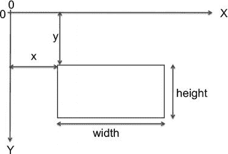
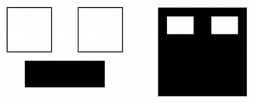
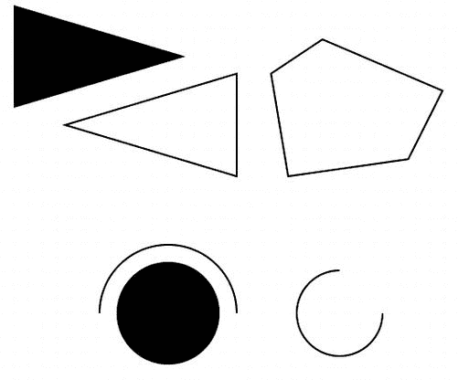
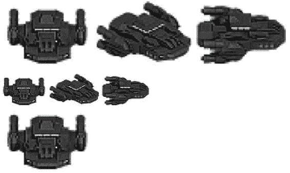

第一章


HTML5 和 JavaScript 基础

HTML5 ，HTML 标准的最新版本，为我们提供了许多改进交互性和媒体支持的新功能。这些新特性(如画布、音频和视频)使得无需 Flash 等第三方插件就能为浏览器制作相当丰富的交互式应用成为可能。

HTML5 规范目前正在制定中，浏览器仍在实现它的一些新功能。然而，大多数现代浏览器(Google Chrome、Mozilla Firefox、Internet Explorer 9+、Safari 和 Opera)已经支持我们构建一些非常棒的游戏所需的元素。

开始在 HTML5 中开发游戏所需要的只是一个好的文本编辑器来编写代码(我在 Mac 上使用 TextMate—[http://macromates.com/](http://macromates.com/))和一个现代的、兼容 HTML5 的浏览器(我使用谷歌 Chrome—[http://www.google.com/chrome](http://www.google.com/chrome))。

HTML5 文件的结构与以前版本的 HTML 中的文件非常相似，只是在文件的开头有一个简单得多的 DOCTYPE 标记。清单 1-1 提供了一个非常基本的 HTML5 文件的框架，我们将用它作为本章剩余部分的起点。

执行这段代码需要将其保存为 HTML 文件，然后在 web 浏览器中打开该文件。如果你做的一切都正确，这个文件应该弹出消息“Hello World！”

[***清单 1-1。***](#_list1) 基本 HTML5 文件骨架

```html
<!DOCTYPE html>
<html>
    <head>
        <meta http-equiv =  "Content-type" content =  "text/html; charset =  utf-8">
        <title > Sample HTML5 File</title>
        <script type =  "text/javascript" charset =  "utf-8">
            // This function will be called once the page loads completely
            function pageLoaded(){
                alert('Hello World!');
            }
        </script>
    </head>
    <body onload =  "pageLoaded();">
    </body>
</html>
```

 **注意**我们使用主体的 onload 事件来调用我们的函数，这样我们就可以在开始使用它之前确定我们的页面已经被完全加载了。当我们开始操作像 canvas 和 image 这样的元素时，这将变得很重要。试图在浏览器完成加载之前访问这些元素会导致 JavaScript 错误。

在我们开始开发游戏之前，我们需要检查一些我们将用来创建游戏的基本构件。我们需要的最重要的是

*   画布元素，用于呈现形状和图像
*   音频元素，添加声音和背景音乐
*   图像元素，加载我们的游戏作品并显示在画布上
*   浏览器定时器功能和游戏循环来处理动画

画布元素

我们游戏中最重要的元素是新的画布元素。根据 HTML5 标准规范，“canvas 元素为脚本提供了一个依赖于分辨率的位图画布，可用于实时渲染图形、游戏图形或其他可视图像。”你可以在 www . whatwg . org/specs/we b-apps/current-work/multipage/the-canvas-element . html 找到完整的规范。

画布允许我们绘制线条、圆形和矩形等基本形状，以及图像和文本，并且已经针对快速绘制进行了优化。浏览器已经开始启用 2D 画布内容的 GPU 加速渲染，因此基于画布的游戏和动画运行速度很快。

使用 canvas 元素相当简单。将< canvas >标签放在我们之前创建的 HTML5 文件的主体中，如清单 1-2 中的[所示。](#list2)

[***清单 1-2。***](#_list2) 创建画布元素

```html
<canvas width =  "640" height =  "480" id =  "testcanvas" style =  "border:black 1px solid;">
    Your browser does not support HTML5 Canvas. Please shift to another browser.
</canvas>
```

清单 1-2 中的代码创建了一个 640 像素宽、480 像素高的画布。画布本身显示为空白区域(带有我们在样式中指定的黑色边框)。我们现在可以开始使用 JavaScript 在这个矩形内绘制。

 **注意**不支持 canvas 的浏览器会忽略< canvas >标签，渲染< canvas >标签内的任何东西。您可以使用此功能在旧浏览器上向用户显示替代的后备内容或一条消息，引导他们使用更现代的浏览器。

我们使用画布的主要渲染上下文在画布上进行绘制。我们可以使用 canvas 对象中的 getContext()方法来访问这个上下文。getContext()方法接受一个参数:我们需要的上下文类型。我们将在游戏中使用 2d 背景。

清单 1-3 展示了页面加载后，我们如何访问画布及其上下文。

[***清单 1-3。***](#_list3) 访问画布上下文

```html
<script type =  "text/javascript" charset =  "utf-8">
    function pageLoaded(){

        // Get a handle to the canvas object
        var canvas = document.getElementById('testcanvas');
        // Get the 2d context for this canvas
        var context = canvas.getContext('2d');
        // Our drawing code here. . .

    }
</script>
```

 **注意**所有的浏览器都支持 2D 图形所需的 2d 环境。浏览器也用它们自己的专有名称实现其他上下文，比如用于 3D 图形的 experimental-webgl。

这个上下文对象为我们提供了大量的方法，我们可以使用这些方法在屏幕上绘制我们的游戏元素。这包括以下方法:

*   绘制矩形
*   绘制复杂的路径(直线、圆弧等)
*   绘图文本
*   自定义绘图样式(颜色、alpha、纹理等)
*   绘制图像
*   变换和旋转

我们将在下面的小节中更详细地研究这些方法。

绘制矩形

画布使用一个坐标系统，原点(0，0)在左上角，x 向右增加，y 向下增加，如图[图 1-1](#Fig00011) 所示。



[图 1-1。](#_Fig00011)画布坐标系

我们可以使用上下文的矩形方法在画布上绘制一个矩形:

*   fillRect(x，y，width，height):绘制一个实心矩形
*   strokeRect(x，y，width，height):绘制矩形轮廓
*   clearRect(x，y，width，height):清除指定的矩形区域并使其完全透明

[***清单 1-4。***](#_list4) 在画布内绘制矩形

```html
// FILLED RECTANGLES
// Draw a solid square with width and height of 100 pixels at (200,10)
context.fillRect (200,10,100,100);
// Draw a solid square with width of 90 pixels and height of 30 pixels at (50,70)
context.fillRect (50,70,90,30);

// STROKED RECTANGLES
// Draw a rectangular outline of width and height 50 pixels at (110,10)
context.strokeRect(110,10,50,50);
// Draw a rectangular outline of width and height 50 pixels at (30,10)
context.strokeRect(30,10,50,50);

// CLEARING RECTANGLES
// Clear a rectangle of width of 30 pixels and height 20 pixels at (210,20)
context.clearRect(210,20,30,20);
// Clear a rectangle of width 30 and height 20 pixels at (260,20)
context.clearRect(260,20,30,20);
```

[清单 1-4](#list4) 中的代码会在画布的左上角绘制多个矩形，如图[图 1-2](#Fig00012) 所示。



[图 1-2。](#_Fig00012)在画布内绘制矩形

绘制复杂路径

当简单的盒子不够用时，context 有几种方法可以让我们画出复杂的形状:

*   beginPath() :开始记录一个新形状
*   closePath() :通过从当前绘制点到起点绘制一条线来关闭路径
*   fill()、stroke() :填充或绘制记录形状的轮廓
*   moveTo (x，y):将绘图点移动到 x，y
*   lineTo (x，y):从当前绘制点到 x，y 绘制一条直线
*   圆弧 (x，y，半径，起始角度，终止角度，逆时针):在 x，y 处画一个指定半径的圆弧

使用这些方法，绘制复杂路径包括以下步骤:

1.  使用 beginPath()开始记录新形状。
2.  使用 moveTo()、lineTo()和 arc()创建形状。
3.  或者，使用 closePath()关闭形状。
4.  使用 stroke()或 fill()绘制轮廓或填充形状。使用 fill()会自动关闭任何打开的路径。

[清单 1-5](#list5) 将创建如图[图 1-3](#Fig00013) 所示的三角形、弧线和形状。

[***清单 1-5。***](#_list5) 在画布内绘制复杂的形状

```html
// Drawing complex shapes
// Filled triangle
context.beginPath();
context.moveTo(10,120);    // Start drawing at 10,120
context.lineTo(10,180);
context.lineTo(110,150);
context.fill();    // close the shape and fill it out

// Stroked triangle
context.beginPath();
context.moveTo(140,160); // Start drawing at 140,160
context.lineTo(140,220);
context.lineTo(40,190);
context.closePath();
context.stroke();

// A more complex set of lines. . .
context.beginPath();
context.moveTo(160,160); // Start drawing at 160,160
context.lineTo(170,220);
context.lineTo(240,210);
context.lineTo(260,170);
context.lineTo(190,140);
context.closePath();
context.stroke();

// Drawing arcs

// Drawing a semicircle
context.beginPath();
// Draw an arc at (400,50) with radius 40 from 0 to 180 degrees,anticlockwise
context.arc(100,300,40,0,Math.PI,true);     //(PI radians = 180 degrees)
context.stroke();

// Drawing a full circle
context.beginPath();
// Draw an arc at (500,50) with radius 30 from 0 to 360 degrees,anticlockwise
context.arc(100,300,30,0,2*Math.PI,true); //(2*PI radians = 360 degrees)
context.fill();

// Drawing a three-quarter arc
context.beginPath();
// Draw an arc at (400,100) with radius 25 from 0 to 270 degrees,clockwise
context.arc(200,300,25,0,3/2*Math.PI,false); //(3/2*PI radians = 270 degrees) context.stroke();
```

清单 1-4 中的代码将创建[图 1-3](#Fig00013) 中所示的三角形、圆弧和形状。



[图 1-3。](#_Fig00013)在画布内绘制复杂的形状

绘图文本

上下文还为我们提供了两种在画布上绘制文本的方法:

*   strokeText(text，x，y):在(x，y)处绘制文本轮廓
*   fillText(text，x，y):在(x，y)处填充文本

与其他 HTML 元素中的文本不同，canvas 中的文本没有 CSS 布局选项，如换行、填充和边距。然而，文本输出可以通过设置上下文字体属性以及笔画和填充样式来修改，如[清单 1-6](#list6) 所示。设置 font 属性时，可以使用任何有效的 CSS 字体属性。

[***清单 1-6。***](#_list6) 在画布内绘制文本

```html
// Drawing text
context.fillText('This is some text. . .',330,40);

// Modifying the font
context.font = '10 pt Arial';
context.fillText('This is in 10 pt Arial. . .',330,60);

// Drawing stroked text
context.font = '16 pt Arial';
context.strokeText('This is stroked in 16 pt Arial. . .',330,80);
```

清单 1-6 中的[代码将绘制出](#list6)[图 1-4](#Fig00014) 中所示的文本。


[图 1-4。](#_Fig00014)在画布内绘制文本

自定义绘图样式(颜色和纹理)

到目前为止，我们绘制的所有东西都是黑色的，但这只是因为画布默认的绘制颜色是黑色。我们有其他选择。我们可以在画布上设计和定制线条、形状和文本。我们可以使用不同的颜色、线条样式、透明度，甚至填充形状内部的纹理

如果我们想将颜色应用于形状，有两个重要的属性可以使用:

*   fillStyle:设置所有未来填充操作的默认颜色
*   strokeStyle:设置所有未来描边操作的默认颜色

这两个属性都可以将有效的 CSS 颜色作为值。这包括 rgb()和 rgba()值以及颜色常数值。比如 context.fillStyle = " red 将为所有将来的填充操作(fillRect、fillText 和 fill)将填充颜色定义为红色。

清单 1-7 中的[代码将绘制彩色矩形，如图](#list7)[图 1-5](#Fig00015) 所示。

[***清单 1-7。***](#_list7) 用颜色和透明度绘制

```html
// Set fill color to red
context.fillStyle = "red";
// Draw a red filled rectangle
context.fillRect (310,160,100,50);

// Set stroke color to green
context.strokeStyle = "green";
// Draw a green stroked rectangle
context.strokeRect (310,240,100,50);

// Set fill color to red using rgb()
context.fillStyle = "rgb(255,0,0)";
// Draw a red filled rectangle
context.fillRect (420,160,100,50);

// Set fill color to green with an alpha of 0.5
context.fillStyle = "rgba(0,255,0,0.6)";
// Draw a semi transparent green filled rectangle
context.fillRect (450,180,100,50);
```


[图 1-5。](#_Fig00015)用颜色和透明度绘图

绘图图像

虽然我们仅仅使用我们到目前为止已经介绍过的绘图方法就可以取得相当大的成就，但是我们仍然需要探索如何使用图像。学习如何绘制图像将使您能够绘制游戏背景、角色精灵和爆炸等效果，使您的游戏栩栩如生。

我们可以使用 drawImage()方法在画布上绘制图像和精灵。上下文为我们提供了这种方法的三种不同版本:

*   drawImage(image，x，y):在画布上的(x，y)处绘制图像
*   drawImage(image，x，y，width，height):将图像缩放到指定的宽度和高度，然后在(x，y)处绘制
*   drawImage(image，sourceX，sourceY，sourceWidth，sourceHeight，x，y，Width，Height):从图像中剪切一个矩形(sourceX，sourceY，sourceWidth，sourceHeight)，将其缩放到指定的宽度和高度，并在画布上的(x，y)处绘制它

在开始绘制图像之前，我们需要将图像加载到浏览器中。现在，我们将在 HTML 文件中的< canvas >标签后添加一个< img >标签:

```html

```

一旦图像被加载，我们就可以使用清单 1-8 中的代码来绘制它。

[***清单 1-8。***](#_list8) 绘制图像

```html
// Get a handle to the image object
var image = document.getElementById('spaceship');

// Draw the image at (0,350)
context.drawImage(image,0,350);

// Scaling the image to half the original size
context.drawImage(image,0,400,100,25);

// Drawing part of the image
context.drawImage(image,0,0,60,50,0,420,60,50);
```

清单 1-8 中的[代码将绘制出](#list8)[图 1-6](#Fig00016) 所示的图像。



[图 1-6。](#_Fig00016)绘制图像

变换和旋转

context 对象有几种方法来转换用于绘制元素的坐标系。这些方法是

*   translate(x，y):将画布及其原点移动到不同的点(x，y)
*   旋转(角度):围绕当前原点顺时针旋转画布一个角度(弧度)
*   scale(x，y):以 x 和 y 的倍数缩放绘制的对象

这些方法的一个常见用途是在绘制对象或精灵时旋转它们。我们可以通过以下方式做到这一点

*   将画布原点平移到对象的位置
*   将画布旋转所需的角度
*   绘制对象
*   将画布恢复到原始状态

让我们在绘制之前先看看旋转的物体，如[清单 1-9](#list9) 所示。

[***清单 1-9。***](#_list9) 先旋转物体再绘制它们

```html
//Translate origin to location of object
context.translate(250, 370);
//Rotate about the new origin by 60 degrees
context.rotate(Math.PI/3);
context.drawImage(image,0,0,60,50,-30,-25,60,50);
//Restore to original state by rotating and translating back
context.rotate(−Math.PI/3);
context.translate(−240, -370);

//Translate origin to location of object
context.translate(300, 370);
//Rotate about the new origin
context.rotate(3*Math.PI/4);
context.drawImage(image,0,0,60,50,-30,-25,60,50);
//Restore to original state by rotating and translating back
context.rotate(−3*Math.PI/4);
context.translate(−300, -370);
```

清单 1-9 中的[代码将绘制出](#list9)[图 1-7](#Fig00017) 中所示的两幅旋转后的船只图像。


[图 1-7。](#_Fig00017)旋转图像

 **注意**除了旋转和平移回来，你还可以在开始转换之前首先使用 save()方法恢复画布状态，然后在转换结束时调用 restore()方法。

音频元素

使用 HTML5 音频元素是将音频文件嵌入网页的新标准方式。在这个元素出现之前，大多数页面使用嵌入式插件(如 Flash)播放音频文件。

音频元素可以在 HTML 中使用< audio >标签创建，也可以在 JavaScript 中使用音频对象创建。清单 1-10 中给出了一个例子。

[***清单 1-10。***T5】html 5<音频>标签](#_list10)

```html
<audio src =  "music.mp3" controls =  "controls">
    Your browser does not support HTML5 Audio. Please shift to a newer browser.
</audio>
```

 **注意**不支持音频的浏览器会忽略<音频>标签，渲染<音频>标签内的任何东西。您可以使用此功能在旧浏览器上向用户显示替代的后备内容或一条消息，引导他们使用更现代的浏览器。

包含在[清单 1-10](#list10) 中的控件属性使浏览器显示一个简单的特定于浏览器的界面来播放音频文件(比如播放/暂停按钮和音量控件)。

音频元素还有其他几个属性，如下所示:

*   预加载:指定是否应该预加载音频
*   自动播放:指定是否在对象加载后立即开始播放音频
*   循环:指定音频结束后是否继续回放

目前浏览器支持三种流行的文件格式:MP3(MPEG 音频层 3)、WAV(波形音频)和 OGG (Ogg Vorbis)。需要注意的一点是，并非所有的浏览器都支持所有的音频格式。例如，由于许可问题，Firefox 不能播放 MP3 文件，但可以播放 OGG 文件。另一方面，Safari 支持 MP3，但不支持 OGG。[表 1-1](#Tab00011) 显示了最流行的浏览器支持的格式。

[表 1-1](#_Tab00011) 。不同浏览器支持的音频格式


解决这一限制的方法是为浏览器提供可供选择的播放格式。音频元素允许在< audio >标签中有多个源元素，浏览器自动使用第一个识别的格式(见[清单 1-11](#list11) )。

[***清单 1-11。***](#_list11)<多音频>标签

```html
<audio controls =  "controls">
    <source src =  "music.ogg" type =  "audio/ogg" />
    <source src =  "music.mp3" type =  "audio/mpeg" />
      Your browser does not support HTML5 Audio. Please shift to a newer browser.
</audio>
```

也可以通过使用 JavaScript 中的 Audio 对象来动态加载音频。Audio 对象允许我们根据需要加载、播放和暂停声音文件，这就是游戏将使用的内容(参见[清单 1-12](#list12) )。

[***清单 1-12。***](#_list12) 动态加载音频文件

```html
<script>
    //Create a new Audio object
    var sound = new Audio();
    // Select the source of the sound
    sound.src = "music.ogg";
    // Play the sound
    sound.play();
</script>
```

同样，与< audio > HTML 标签一样，我们需要一种方法来检测浏览器支持哪种格式并加载适当的格式。Audio 对象为我们提供了一个名为 canPlayType() 的方法，该方法返回值""、" maybe "或" probably "来表示对特定编解码器的支持。我们可以用它来创建一个简单的检查并加载适当的音频格式，如[清单 1-13](#list13) 所示。

[***清单 1-13。***](#_list13) 测试音频支持

```html
<script>
    var audio = document.createElement('audio');
    var mp3Support,oggSupport;
    if (audio.canPlayType) {
           // Currently canPlayType() returns: "", "maybe", or "probably"
          mp3Support = "" ! = myAudio.canPlayType('audio/mpeg');
          oggSupport = "" ! = myAudio.canPlayType('audio/ogg; codecs =  "vorbis"');
    } else {
        //The audio tag is not supported
        mp3Support = false;
        oggSupport = false;
    }
    // Check for ogg, then mp3, and finally set soundFileExtn to undefined
    var soundFileExtn = oggSupport?".ogg":mp3Support?".mp3":undefined;
    if(soundFileExtn) {
        var sound = new Audio();
        // Load sound file with the detected extension
        sound.src = "bounce" + soundFileExtn;
        sound.play();
    }
</script>
```

当文件准备好播放时，音频对象触发一个名为 canplaythrough 的事件。我们可以使用这个事件来跟踪声音文件的加载时间。清单 1-14 显示了一个例子。

[***清单 1-14。***](#_list14) 等待音频文件加载

```html
<script>
    if(soundFileExtn) {
        var sound = new Audio();
        sound .addEventListener('canplaythrough', function(){
            alert('loaded');
            sound.play();
        });
        // Load sound file with the detected extension
        sound.src = "bounce" + soundFileExtn;
    }
</script>
```

我们可以用这个来设计一个音频预加载器，在开始游戏之前加载所有的游戏资源。我们将在接下来的几章中更详细地探讨这个观点。

图像元素

image 元素允许我们在 HTML 文件中显示图像。最简单的方法是使用< image >标签并指定一个 src 属性，如前面的[清单 1-15](#list15) 所示。

[***清单 1-15。***](#_list15)<图像>标记

```html

```

您还可以使用 JavaScript 通过实例化一个新的图像对象并设置它的 src 属性来动态加载图像，如[清单 1-16](#list16) 所示。

[***清单 1-16。***](#_list16) 动态加载图像

```html
var image = new Image();
image.src = 'spaceship.png';
```

您可以使用这两种方法中的任何一种来获取用于在画布上绘制的图像。

图像加载

游戏通常被编程为在开始之前等待所有图像加载。程序员经常做的一件事是显示进度条或状态指示器，显示图像加载的百分比。Image 对象为我们提供了一个 onload 事件，一旦浏览器加载完图像文件，该事件就会被触发。使用这个事件，我们可以跟踪图像加载的时间，如清单 1-17 中的例子所示。

[***清单 1-17。***](#_list17) 等待图像加载

```html
image.onload = function() {
    alert('Image finished loading');
};
```

使用 onload 事件，我们可以创建一个简单的图像加载器来跟踪目前已经加载的图像(见[清单 1-18](#list18) )。

[***清单 1-18。***](#_list18) 简单的图像加载器

```html
var imageLoader = {
    loaded:true,
    loadedImages:0,
    totalImages:0,
    load:function(url){
        this.totalImages++;
        this.loaded = false;
        var image = new Image();
        image.src = url;
        image.onload = function(){
            imageLoader.loadedImages++;
            if(imageLoader.loadedImages === imageLoader.totalImages){
                imageLoader.loaded = true;
            }
        }
        return image;
    }
}
```

这个图像加载器可以被调用来加载大量的图像(比方说在一个循环中)。使用 imageLoader.loaded 可以检查是否加载了所有图像，使用 loadedimg/totalImages 可以绘制百分比/进度条。

精灵表

当你的游戏有很多图像时，另一个问题是如何优化服务器加载这些图像的方式。游戏可能需要几十到几百张图片。即使是简单的即时战略(RTS)游戏也需要不同单位、建筑、地图、背景和效果的图像。对于单位和建筑，您可能需要多个版本的图像来表示不同的方向和状态；对于动画，您可能需要动画的每一帧都有一个图像。

在我早期的 RTS 游戏项目中，我为每个动画帧使用单独的图像，为每个单位和建筑使用单独的状态，最终有超过 1000 个图像。由于大多数浏览器一次只能同时发出几个请求，下载所有这些图像需要很长时间，服务器上的 HTTP 请求会过载。当我在本地测试代码时，这不是问题，但是当代码上传到服务器时，这就有点麻烦了。人们最终要等 5 到 10 分钟(有时更久)才能加载游戏，然后才能真正开始玩游戏。这就是雪碧床单的用武之地。

Sprite sheets 将一个对象的所有 Sprite(图像)存储在一个大的图像文件中。当显示图像时，我们计算想要显示的 sprite 的偏移量，并使用 drawImage()方法的能力来绘制图像的一部分。我们在本章中使用的 spaceship.png 图像是一个精灵表的例子。

查看[清单 1-19](#list19) 和[清单 1-20](#list20) ，您可以看到绘制单独加载的图像和绘制加载到 sprite 表中的图像的例子。

[***清单 1-19。***](#_list19) 绘制一幅图像单独载入

```html
//First: (Load individual images and store in a big array)
// Three arguments: the element, and destination (x,y) coordinates.
var image = imageArray[imageNumber];
context.drawImage(image,x,y);
```

[***清单 1-20。***](#_list20) 绘制加载到 Sprite 表中的图像

```html
// First: (Load single sprite sheet image)

// Nine arguments: the element, source (x,y) coordinates,
// source width and height (for cropping),
// destination (x,y) coordinates, and
// destination width and height (resize).

context.drawImage (this.spriteImage, this.imageWidth*(imageNumber), 0, this.imageWidth, this.imageHeight, x, y, this.imageWidth, this.imageHeight);
```

以下是使用 sprite 工作表的一些优点:

*   *更少的 HTTP 请求*:一个有 80 张图片的单元(也就是 80 个请求)现在可以在一个 HTTP 请求中下载。
*   *更好的压缩效果*:将图像存储在单个文件中意味着文件头信息不会重复，而且合并后的文件大小比单个文件的总和要小得多。
*   *更快的加载时间*:随着 HTTP 请求和文件大小的显著降低，游戏的带宽使用率和加载时间也随之下降，这意味着用户不必为游戏加载等待很长时间。

动画:定时器和游戏循环

动画就是画一个物体，擦除它，然后在新的位置再画一次。最常见的处理方法是保存一个每秒被调用几次的绘图函数。在一些游戏中，还有一个独立的控制/动画功能，用于更新游戏中实体的移动，调用频率低于绘图例程。清单 1-21 显示了一个典型的例子。

[***清单 1-21。***](#_list21) 典型动画和绘图循环

```html
function animationLoop(){
    // Iterate through all the items in the game
    //And move them
}

function drawingLoop(){
    //1\. Clear the canvas
    //2.  Iterate through all the items
    //3\. And draw each item
}
```

现在我们需要找出一种方法，定期重复调用 drawingLoop()。实现这一点的最简单方法是使用两个计时器方法 setInterval()和 setTimeout()。setInterval(functionName，timeInterval)告诉浏览器以固定的时间间隔重复调用给定的函数，直到调用 clearInterval()函数。当我们需要停止动画时(当游戏暂停，或者已经结束)，我们使用 clearInterval()。清单 1-22 显示了一个例子。

[***清单 1-22。***](#_list22) 用 setInterval 调用绘图循环

```html
// Call drawingLoop() every 20 milliseconds
var gameLoop = setInterval(drawingLoop,20);

// Stop calling drawingLoop() and clear the gameLoop variable
clearInterval(gameLoop);
```

setTimeout(functionName，timeInterval)告诉浏览器在给定的时间间隔后调用一次给定的函数，如[清单 1-23](#list23) 中的示例所示。

[***清单 1-23。***](#_list23) 用 setTimeout 调用绘图循环

```html
function drawingLoop(){
    //1\. call the drawingLoop method once after 20 milliseconds
    var gameLoop = setTimeout(drawingLoop,20);

    //2\. Clear the canvas

    //3\. Iterate through all the items

    //4\. And draw them
}
```

当我们需要停止动画时(当游戏暂停，或者已经结束)，我们可以使用 clearTimeout():

```html
// Stop calling drawingLoop() and clear the gameLoop variable
clearTimeout(gameLoop);
```

requestimationframe〔t0〕

虽然使用 setInterval()或 setTimeout()作为动画帧的方法确实有效，但浏览器供应商已经提出了一种专门用于处理动画的新 API。使用此 API 而不是 setInterval()的一些优点是浏览器可以执行以下操作:

*   将动画代码优化为单个回流和重绘周期，从而产生更流畅的动画
*   当选项卡不可见时暂停动画，从而减少 CPU 和 GPU 的使用
*   在不支持更高帧速率的机器上自动限制帧速率，或者在能够处理帧速率的机器上提高帧速率

不同的浏览器厂商对 API 中的方法都有自己专有的名称(比如微软的 msrequestAnimationFrame 和 Mozilla 的 mozRequestAnimationFrame)。然而，有一段简单的代码(见[清单 1-24](#list24) )作为跨浏览器的 polyfill，为您提供了两种方法:requestAnimationFrame()和 cancelAnimationFrame()。

[***清单 1-24。***](#_list24) 简单的 requestAnimationFrame Polyfill

```html
(function() {
    var lastTime = 0;
    var vendors = ['ms', 'moz', 'webkit', 'o'];
    for(var x = 0; x < vendors.length && !window.requestAnimationFrame; ++x) {
        window.requestAnimationFrame = window[vendors[x] + 'RequestAnimationFrame'];
        window.cancelAnimationFrame =
          window[vendors[x] + 'CancelAnimationFrame'] ||          window[vendors[x] + 'CancelRequestAnimationFrame'];
    }

    if (!window.requestAnimationFrame)
        window.requestAnimationFrame = function(callback, element) {
            var currTime = new Date().getTime();
            var timeToCall = Math.max(0, 16 - (currTime - lastTime));
            var id = window.setTimeout(function() { callback(currTime + timeToCall); },
              timeToCall);
            lastTime = currTime + timeToCall;
            return id;
        };

    if (!window.cancelAnimationFrame)
        window.cancelAnimationFrame = function(id) {
            clearTimeout(id);
        };
}());
```

 **注意**既然我们不能保证帧速率(浏览器决定它调用我们的绘制循环的速度)，我们需要确保动画对象在屏幕上以相同的速度移动，而与实际的帧速率无关。我们通过计算自上一个绘制周期以来的时间，并使用该计算来插入正在被动画化的对象的位置，来做到这一点。

一旦这个 polyfill 就位，就可以从 drawingLoop()方法中调用 requestAnimationFrame()方法，类似于 setTimeout()(见[清单 1-25](#list25) )。

[***清单 1-25。***](#_list25) 用 requestAnimationFrame 调用绘图循环

```html
function drawingLoop(nowTime){
    //1\. call the drawingLoop method whenever the browser is ready to draw again    var gameLoop = requestAnimationFrame(drawingLoop);

    //2\. Clear the canvas

    //3\. Iterate through all the items

    //4\. Optionally use nowTime and the last nowTime to interpolate frames

    //5\. And draw them
}
```

当我们需要停止动画时(当游戏暂停，或者已经结束)，我们可以使用 cancelAnimationFrame():

```html
// Stop calling drawingLoop()and clear the gameLoop variable
cancelAnimationFrame(gameLoop);
```

本节已经介绍了给游戏添加动画的主要方法。在接下来的章节中，我们将会看到这些动画循环的实际实现。

摘要

在这一章中，我们看了构建游戏所需的 HTML5 的基本元素。我们讲述了如何使用 canvas 元素来绘制形状、编写文本和操作图像。我们研究了如何使用 audio 元素在不同的浏览器上加载和播放声音。我们还简要介绍了动画、预加载对象和使用精灵表的基础知识。

我们在这里讨论的主题只是一个起点，并不详尽。本章旨在快速复习 HTML5。当我们在接下来的章节中构建游戏时，我们将会更详细地讨论这些主题，包括完整的实现。

如果你跟不上，想要更详细地解释 JavaScript 和 HTML5 的基础知识，我会推荐你阅读 JavaScript 和 HTML5 的入门书籍，比如特里·麦克纳威的《绝对初学者的 JavaScript》和珍妮·迈耶的《HTML5 基本指南》。

现在我们已经有了基本的方法，让我们开始构建我们的第一个游戏。