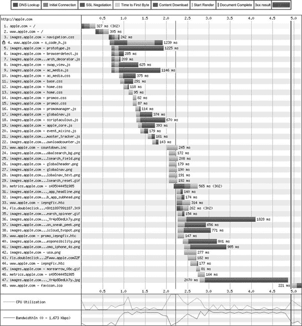
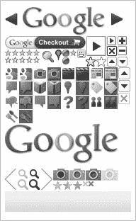

# 三、性能指南

我们的经验和研究让我们创建了一套在网站上工作时牢记在心的性能准则。碰巧的是，我们发现我们的指导方针与雅虎、谷歌和其他做同类最佳网络开发的公司的指导方针基本一致。

除了一个例外，我们相信这些规则可以让任何网站变得更好。与内容和流量较少的网站相比，它们对高内容、高流量网站的帮助更大，但即使是个人网站也能从良好的性能中受益。这些准则中的例外是内容交付网络(CDN)的使用。如果你有足够的内容和流量使其在经济上可行，CDN 就有意义，否则就没有意义。

 **注意**本章中没有一条规则是专门针对 HTML5 或 CSS3 或任何其他特定技术的。然而，在一本关于性能的书中，如果不提供这些信息，我们就是失职。

### 为什么页面加载时间很重要

除了希望为访问他们网站的人提供最好的体验，并希望尽可能地做好工作之外，web 开发人员还有另一个非常好的理由来关注页面加载时间。2010 年 4 月，谷歌开始将页面加载速度作为搜索排名的一个因素。排名不靠前的网页吸引的顾客更少，销售也因此受到影响。WebSiteOptimization.com 综合了多项研究的结果，得出了以下结论:

> Google 发现，从 0.4 秒加载 10 个结果的页面到 0.9 秒加载 30 个结果的页面，流量和广告收入减少了 20% (Linden 2006)。当谷歌地图的主页从 100KB 减少到 70-80KB 时，第一周的流量增加了 10%,接下来的三周又增加了 25 %( Farber 2006)。亚马逊的测试显示了类似的结果:Amazon.com 的加载时间每增加 100 毫秒，销售额就会下降 1% (Kohavi and Longbotham 2007)。

WebSiteOptimization.com[2T3】](#CHP-3-FN-2)

__________

1 来源:`[http://googlewebmastercentral.blogspot.com/2010/04/using-site-speed-in-web-searchranking.html](http://googlewebmastercentral.blogspot.com/2010/04/using-site-speed-in-web-searchranking.html)`。

2 来源:`[http://www.websiteoptimization.com/speed/tweak/psychology-web-performance/](http://www.websiteoptimization.com/speed/tweak/psychology-web-performance/)`。

在我们看来，每 100 毫秒销售额下降 1%都是巨大的影响。显然，页面加载时间肯定是 web 开发人员关心的一个关键问题。

### 指导方针

以下各节描述了一个特定的准则(按照对页面加载时间的影响顺序):

*   减少 HTTP 请求
*   使用内容交付网络(CDN)
*   避免空的`src`或`href`属性
*   添加过期标题
*   用 GZIP 压缩部件
*   将 CSS 放在顶部
*   将 JavaScript 放在底部
*   避免 CSS 表达式
*   移除未使用的 CSS
*   缩小 JavaScript 和 CSS
*   最小化重绘

#### 减少 HTTP 请求

减少 HTTP 请求是性能准则星座中的一颗闪亮的星星。这是一个复杂的主题，因此我们将其分为以下几个单独的性能指导:

*   了解并行连接
*   组合资源文件
*   使用图像精灵

##### 了解并行连接

我们注意到，减少 HTTP 请求的想法经常被忽视，尽管这是大多数网站受益的最大的性能提升。开发人员关注的是后端的复杂性，而没有意识到很多加载瓶颈都在浏览器中。因为网站的开发者不能控制浏览器做什么，但是*可以*控制他们自己的服务器、数据库和代码做什么，他们自然关注他们能控制的。这很好，直到开发人员无法解释浏览器是如何工作的。那就成问题了。[图 3-1](#fig_3_1) 说明了这个感知问题。

***图 3-1。**页面负载影响:开发者认知与现实*

开发人员经常忽略的浏览器端限制是浏览器一次可以加载多少资源。HTTP 1.1 规范规定，“单用户客户端不应该与任何服务器或代理保持超过 2 个连接。”近年来，大多数浏览器都超过了这个建议。许多浏览器目前支持四个并行连接，少数支持六个。IE8 根据客户端的带宽改变其连接，从拨号连接的两个连接到宽带连接的六个连接。

没有什么比插图更能说明问题了，所以让我们考虑一个例子。[图 3-2](#fig_3_2) 显示了`apple.com`(通过`[http://www.webpagetest.org/](http://www.webpagetest.org/)`)的加载。

***图 3-2。**为 Apple.com*加载资源

请注意，HTML 的加载时间是 327 毫秒。也就是说，一个页面的文字内容下来的速度非常快。请注意，其他文件(大部分是来自 images.apple.com 的图像)是成批到达的。这种分组模式是浏览器可以打开的并行连接数量的直接结果。有点像铁路编组站。在一个繁忙的车场，有很多火车，但只有几条出站轨道。因此，调度员不得不分组发送列车，而不是一次发送所有列车。大型网站也有同样的问题。

你可以将资源放入多个主机(比如`[www.apple.com](http://www.apple.com)`和 i `mages.apple.com`，在[图 3-2](#fig_3_2) 所示的例子中。)然而，这种做法只能在一定程度上提高性能，因为额外的 DNS 查找成本会导致回报迅速减少。

##### 组合资源文件

并行连接问题的结果是文件越大越好。我们知道对于一些开发者来说这听起来像是疯狂的异端邪说，但这是真的。很长一段时间，我们努力使资源变得更小。我们还记得 1200 波特调制解调器和拨号连接的时代，那时看图像进来就像网页的进度条。然而，时代变了，绝大多数人都有快速的互联网连接。有了我们现代的基础设施，任何给定的文件都不可能扼杀浏览器。因此，大文件越少越好。回到我们的编组站的例子，如果我们能在每列火车上放更多的车，我们就能在同样的轨道上得到更多的货物。(顺便说一句，长期以来，铁路公司一直在寻求每辆列车装载更多的汽车。在他的其他爱好中，杰伊是一位铁路历史学家。)这同样适用于文件和并行连接。

此外，每个 HTTP 请求在时间和带宽上都至少有一些开销。因此，如果您能够组合您的资源，使得您需要更少的 HTTP 请求来呈现一个页面，您将为站点的访问者获得更快的呈现速度。

所有这些考虑的总和就是你应该把你的内容合并到更少的文件中。如果可能的话，将多个 CSS 样式表合并成一个文件，将多个 JS 文件合并成一个文件。当不同的页面使用不同的 CSS 和 JS 文件时，将它们组合起来，使每个页面都获得一个 CSS 文件和一个 JS 文件，这可能是一个问题。但是，您可以通过使用每次修改 CSS 和 JS 文件时运行的构建脚本来解决这个问题。这样的构建脚本将确定每个页面使用的文件，创建所需的唯一文件，并向每个页面添加所需的链接元素。如果动态页面共享一组公共的 CSS 和 JS 文件，动态内容仍然可以从这样的构建系统中受益。

另一个策略是在交付页面时动态地组合 CSS 和 JS 文件。考虑到这一步需要处理，它不会像使用预构建文件那样快。但是，如果你的网站足够复杂，它可能仍然是比使用许多单独的文件更好的选择。

最后，另一个策略是提交一个对所有页面通用的 CSS 文件，然后，当访问者点击每个页面时，提交另一个特定于该页面的 CSS 文件。考虑到页眉和页脚以及其他大的区域通常在不同的页面上保持不变，这种策略可以使维护变得更容易，并且仍然可以为提供页面的公司和网站的访问者带来很多好处。该公司节省了一遍又一遍地传递普通 CSS 文件内容的带宽和其他开销，访问者获得了更好的性能。对于非常大的站点，这种最终的策略通常代表了可维护性和性能之间的一种很好的折衷。

##### 使用图像精灵

图像精灵实际上只是组合的图像文件。它们提供了一种便捷的方式来实现将小文件合并成大文件的目标，并通过浏览器相对较少的并行连接更快地传递内容。

大多数网站在网站页面上使用图像集合。减少 HTTP 请求的一种方法是将所有这些常见的图像放在一个图像中(一个图像精灵)。然后，每当您需要这些图像中的一个时，您就引用 sprite 并在 sprite 中指定一组坐标。因此，将所有的徽标、自定义项目符号、导航提示和其他常见的图像宣传材料放在一个图像中，并在所有页面中使用该图像。

提高性能的一个有趣的技巧是按颜色范围对精灵进行分组，然后保存每个精灵文件，使其只使用该范围内的颜色。这种技术使每个精灵文件变得更小。这对于使用受限调色板的网站尤其有效。例如，如果你的公司的标志是红色和灰色的，公司的营销人员可能已经创建了一堆使用公司配色方案的图像，用于导航和其他目的。在这种情况下，您可以通过为这些图像创建一个文件并将颜色范围限制为红色和灰色来节省大量空间。

如果你有许多共同的图像资料，你可能需要一个以上的图像精灵，即使你不按颜色范围分开。此外，如果您公司的不同部门维护不同部分的公共图像资料(可能一个小组维护导航图像，而另一个小组维护徽标)，您可能希望有单独的文件。

当我们写这一章的时候，一个问题出现了(来自我们的技术评论者，Jeff Johnson ),什么时候一个 sprite 文件大到应该被分割？这是一个很好的问题，因为在一定程度上，一个大文件比两个小文件更成问题。但是，这一点会因多种因素而异，例如客户端需要多少其他 HTTP 请求才能完全加载您的站点，站点是否使用 CDN，甚至访问者使用的浏览器。因此，我们无法给出一个确切的答案。我们只能告诉你，如果你认为把大的 sprite 文件分割成小的 sprite 文件或者把小的文件合并成大的文件可能有利于你的页面加载时间，建立一些度量标准和一种方法来监控这些度量标准，然后尝试它们。正如 web 开发中的许多其他事情一样，没有单一的最佳方式。通常，我们必须通过测试来找到适合特定情况的答案。

不过，作为一条经验法则和一个好的起点，抑制 HTTP 请求比其他问题更重要。因此，如果可以的话，将所有常用的图片合并成几个图片。理想情况下，将它们放在一张图片中。然后使用偏移来显示图像的右边部分。[图 3-3](#fig_3_3) 显示了来自`google.com`的精灵。

***图 3-3。【Google.com T2】雪碧***

为了使用这个 sprite，我们创建了一个使用类的 div，然后定义了匹配的 CSS 类，它指定了我们想要的图像的细节。清单 3-1 显示了 div 元素。

***清单 3-1。**一个`div`来自一个精灵*的图像

`

`

[清单 3-2](#list_3_2) 展示了 CSS 类。

***清单 3-2。**一个精灵的 CSS*

`. arrowPrev
{
  width: 22px;
  height: 25px;
  background-image: url(googlesprite.png);
  background-position: -6px -13px;
  background-repeat: no-repeat;
}`

CSS 指定精灵、精灵中包含图像的视口的宽度和高度，以及图像的起点(实际偏移量)。它还指定图像不应重复。

结果就是上一个箭头，如图[图 3-4](#fig_3_4) 所示。

***图 3-4。**使用精灵的结果*

sprite 的另一个好处是，只从 sprite 中加载一个图像就可以将整个 sprite 放入浏览器的缓存中。因为 sprite 的每次后续使用都不需要获取图像，所以可以节省许多 HTTP 连接。在谷歌的例子中，这个有 60 个小图片的 sprite 可以节省多达 60 个 HTTP 连接。这是一个巨大的性能增益。

您可以找到许多不同的网站来帮助您使用 sprite 文件。过去，我们使用过`[http://www.spritecow.com](http://www.spritecow.com)`和`[http://www.spritebox.net](http://www.spritebox.net)`

#### 使用内容交付网络(CDN)

一个内容交付网络有许多战略性放置的服务器，以创建一个覆盖全球的 web。因此，在奥斯汀或巴黎访问你的网站的人有一个很短的跳转到它的素材。问题是这些文件不容易更改，所以您应该只将它们用于更改不多的资源，如图像、字体、JavaScript 库、媒体等。将所有静态内容放在用户附近确实可以提高性能。相反，必须是动态的内容通常应该从单个位置提供。即使对于大公司来说，跨地理上分离的服务器同步数据库事务所需的努力也很少是值得的。光是时间问题就经常让网络工程师们抓狂。因此，大多数网络企业应该把购物、登录和其他依赖数据的交易放在一个地方。

使用 CDN 的技巧之一是在文件前添加时间戳。这样你就有了一个独一无二的文件，而不必担心一个过时的文件被缓存在 CDN 服务器上分发给你的访问者。当你用一个新的时间戳更新文件时，你也必须更新你的引用代码。如果你在中小型网站上工作，这似乎是一个麻烦，所以你必须判断 CDN 是否适合你的项目。这确实增加了成本，而且如果你的网站支持一个本地企业或者在地理上是孤立的，这就没有意义了。

 **注:**如果一个内容交付网络不能帮助你，那么它就不是真正的次优性能提示。但是，我们把它留在这里，因为如果您确实需要，CDN 在提高页面加载性能方面仅次于降低 HTTP 请求的数量。

#### 避免空的 src 或 href 属性

我们看到的模式是创建一个具有空属性的`img`元素，然后在用 JavaScript 加载页面的过程中动态分配属性`src`的值。这样做的问题是，元素总是在脚本运行之前被评估(特别是如果你把脚本放在其他所有东西之后，就像我们在本章后面推荐的那样)。因此，浏览器会尝试评估该空属性，并创建一个 HTTP 请求来执行此操作。

类似的模式和问题也出现在`href`属性中，通常在锚元素中。有时，开发人员希望使用锚元素作为基于 JavaScript 的交互的触发器。问题是，如果 href 属性为空，当用户触发交互时，浏览器会向服务器发送一个 HTTP 请求。这不会影响页面加载时间，但会在服务器上产生不必要的流量，浪费带宽，并可能降低所有访问者的交付速度。解决这个问题的简单方法是将 href 属性的值设置为一个不执行任何操作的 JavaScript 命令。清单 3-3 展示了一个修复的例子。

***清单 3-3。**修复一个空的`href`属性*

`<a href="javascript:;" class="triggerName">Trigger</a>`

然而，仅仅使用空的 JavaScript 命令并不是最好的解决方案。更好的方法是提供一个描述(当用户将鼠标悬停在链接上时，它会出现在状态栏中)并阻止对`href`进行评估。清单 3-4 展示了如何去做。

***清单 3-4。**创建一个描述性的`href`属性*

`<a href="#Something_Descriptive" id="triggerName">Trigger</a>
`

现在，网站的访问者在承诺做某件事之前会得到一个提示，href 不会创建一个浪费的 HTTP 请求。

我们应该指出的是，当我们为关闭或无法访问 JavaScript 的访问者提供单独的演示时，我们解决这个问题的方法有所不同。在这些情况下，我们使用实际的链接。

我们还应该指出，空的 src 和 href 属性也会导致错误。如果您跟踪请求头中的状态(无论是通过 cookies 还是其他机制)并发送一个空属性，您可能会丢失对状态的跟踪。在这一点上，你有一个很好的机会让访问者感到沮丧，他们会很快把他们的业务转移到其他地方，或者如果他们别无选择只能使用你的网站，他们会非常生气。

当然，您也想在每次捕获空属性时写入日志文件。如果你有很多这样的问题，你肯定想找出为什么会这样，并解决它。

#### 添加过期标题

您应该为所有静态组件(图像、样式表、脚本、flash、PDF 等)添加一个`Expires`头。添加一个日期在未来很久的`Expires`头可以让浏览器缓存您的静态内容。[清单 3-5](#list_3_5) 显示了一个典型的 Expires 报头。

***清单 3-5。**典型的过期报头*

`Expires: Wed, 1 Jan 2020 00:00:00 GMT`

因此，当这些访问者返回时，他们的浏览器将不必为后续访问获取静态内容，并且他们将有更快的加载时间。当然，添加`Expires`标题对于第一次访问或者在两次访问之间清空缓存的人来说没有任何作用。另一方面，这不会对他们造成任何伤害，至少对一些游客有益。事实上，由于人们倾向于一遍又一遍地访问同一个网站，这可能会改善大多数访问者的体验。

在很久以后设置`Expires`头文件的缺点是，您必须重命名设置了`Expires`头文件的文件。回头客会缓存你的素材，你希望他们有你更新的素材。因此，您将需要某种版本控制方案。一个有趣的方法是在文件名中加入一个日期戳。例如，您的基本样式表可能被命名为`base20120303.css`。向文件添加时间戳的有趣之处在于，您可以立即看到版本控制系统中的变更历史。如果您觉得添加日期戳会使文件名太长，您可以使用一个简单的版本号来表示文件被修改的次数。例如，如果您已经修改了您的基本样式表 13 次，它可能被命名为`base13.css`。

关于如何设置`Expires`头的一个很好的例子，请看来自`[http://www.html5boilerplate.com](http://www.html5boilerplate.com)`的`htaccess`文件(我们在第 6 章的[中也使用了它)。](06.html)

#### 用 GZIP 压缩组件

HTTP/1.1 规范引入了`Accept-Encoding`头，可以表示 HTTP 请求中的内容是压缩的。这样的标题出现在[清单 3-6](#list_3_6) 中。

***清单 3-6。**一个接受编码报头*

`Accept-Encoding: gzip, deflate`

如您所见，该标头指定了两种压缩方式。GZIP 更常见，因为它是可用的最有效的压缩方案。根据雅虎的“加速你的网站的最佳实践”页面，GZIP 减少了大约 70%的回复大小。英特尔[的一名工程师进行的一项研究显示，对于某些文件类型(文本得分最高)，节省高达 90%，但雅虎的 70%可能是所有文件类型的平均水平。](#CHP-3-FN-4)

压缩减少了获取压缩资源所需的时间，从而改善了访问者的体验。它还减少了带宽，这为提供页面服务的公司节省了资金(如果访问者没有从他们的 ISP 或移动运营商那里购买无限带宽，也可能会节省资金)。

__________

3 来源:`[http://developer.yahoo.com/performance/rules.html#gzip](http://developer.yahoo.com/performance/rules.html#gzip)`。

4 来源:`[http://software.intel.com/en-us/articles/http-compression-for-web-applications/](http://software.intel.com/en-us/articles/http-compression-for-web-applications/)`。

压缩的一个问题是仍然有一些浏览器(更罕见的是代理)处理不当。因此，您需要在标题中添加一个`Vary`字段，以便这些浏览器和代理可以协商未压缩的内容。将`Vary`字段添加到标题中是通过标题中的指令来完成的，如清单 3-7 中的[所示。](#list_3_7)

***清单 3-7。**向标题添加一个`Vary`字段*

`Header set Vary *`

 **注意:**根据网络服务器的不同，你如何设置标题和其中的字段会有很大的不同。我们展示的是需要出现在 HTTP 头中的输出，而不是用于设置它的任何特定代码集。

你应该压缩任何本质上是文本的内容。这意味着你应该压缩你的 HTML，CSS，脚本，XML，JSON，以及其他任何实际上只是文本的东西。图像和 PDF 文件不应该被压缩，因为压缩应该是它们存储格式的一部分。如果有人制作了一个未压缩的图像或 PDF 文件(这是可能的，至少对于 PDF 来说)，补救措施是修复文件，而不是压缩这种内容。

您不想压缩图像和 PDF 文件的原因是，当您压缩它们时，它们实际上会变得更大。压缩引擎实际上不能使资源变小，但是因为它仍然必须添加自己的控制代码，所以文件变大了。因此，你不应该压缩所有的东西。

#### 将 CSS 放在顶部

如果您的页面包含样式信息，将该信息放在顶部(在`head`元素中)。为了避免重绘，许多 web 浏览器在获得所有样式信息之前不会开始呈现页面。因此，如果您的样式信息在页面的底部，这些浏览器在开始呈现任何内容之前都会加载所有内容。你可怜的网站访问者坐在那里看着一个白色的屏幕很长一段时间，因此，许多人会找到其他地方访问。

大型网站和缓慢的连接加剧了这一问题。一个页面的内容越多，风格信息就越有必要放在内容之前。仍然有一些人使用拨号上网，我们应该尽我们所能让他们的网络体验尽可能愉快。此外，许多人(包括本书的作者)在移动设备上进行相当多的网上冲浪，许多地方的移动连接性能仍然相对较慢。我们当然不想失去移动访问者的业务，所以我们需要让他们至少看到一些内容，而其余的内容加载。因此，我们想把 CSS 放在页面的顶部。

有趣的是，许多浏览器在呈现任何内容之前都会加载所有的样式信息，这一事实也支持将页面的外部 CSS 合并到一个文件中。通过网络获取多个文件自然比获取单个文件慢。因为我们希望用户尽可能快地看到一些东西，所以理想情况下，我们只希望一次获取样式内容。

#### 将 JavaScript 放在底部

脚本阻止并行下载。换句话说，当浏览器下载一个脚本时，它并没有下载任何其他东西。如果您的脚本在页面的顶部，那么您就阻止了在页面的其余部分加载时向用户显示页面的一部分。

您可以在`script`元素中使用`DEFER`属性，让浏览器知道它可以在下载这个脚本的同时下载其他内容。然而，这样做有两个问题。首先，并不是所有的浏览器都支持`DEFER`属性。第二个是使用`DEFER`属性的契约是任何具有该属性的脚本都不使用`document.write`。因此，您不能在使用`document.write`的脚本中使用`DEFER`属性。(在本章的后面，当我们讨论为什么重新排列 DOM 不是一个好主意时，我们将看到为什么避免`document.write`是一个好主意。)

通过将所有脚本放在末尾(就在`body`元素的结束标记之前)，您实际上已经将脚本加载推迟到了末尾，从而轻松地避免了并行下载受阻的问题。此外，您不必依赖就绪事件来确保元素可用，因为所有的元素都将在任何脚本运行之前准备好。

#### 避免 CSS 表达式

Internet Explorer 支持版本 5、6 和 7 的 CSS 表达式。其他浏览器从不支持它们。

CSS 表达式允许在页面加载时动态设置样式。清单 3-8 显示了一个 CSS 表达式(来自微软的动态属性网页)。

***清单 3-8。**一个 CSS 表情*

`object.style.left=(document.body.clientWidth/2) - (object.offsetWidth/2);`

该表达式试图将一个元素居中。你可以用[清单 3-9](#list_3_9) 中显示的 CSS 达到同样的效果。

***清单 3-9。**一个 CSS 表达式的替换*

`.center {
  margin-left: auto;
  margin-right: auto;
  width: 200px;
}`

当缩小时(我们将在本章后面讲到)，常规 CSS 比 CSS 表达式短，所以这个特殊的 CSS 表达式没有什么意义。

CSS 表达式的缺点是它们通常会比作者预期的更频繁地被求值。理想情况下，只有在呈现页面时(包括页面刷新时)才会对它们进行评估。然而，当用户上下滚动页面或者只是移动鼠标时，它们通常会被重新评估。许多用户(我们听过 80%的数字)“用鼠标看”，这意味着无论他们的眼睛看向哪里，他们的鼠标都会跟着看。想象一下，如果有人在读一篇文章，鼠标会移动多少。因为 CSS 表达式在鼠标移动时会被重新计算，所以当页面在浏览器中时，表达式可能会被计算数千次(我们已经看到了数以万计的引用)。这真的会扼杀可怜的网站访问者的性能。

#### 移除未使用的 CSS

在大多数浏览器中(据我们所知，实际上是所有的浏览器)，浏览器的样式引擎会评估 CSS 规则，以找到每个元素的匹配。在这样做的时候，它必须通过所有的 CSS 规则。因此，如果一个样式表有任何未使用的规则，就会给样式引擎带来更多的工作，却没有任何收获。移除未使用的规则还会使 CSS 文件变小，这允许浏览器更快地获取它并节省带宽。

__________

5 陈明志、安德森和孙明辉，“鼠标光标能告诉我们更多什么？网络浏览中眼睛/鼠标运动的相关性”，*《人机交互会议录(CHI)】*(2001):280–81。

为整个网站制作一个单一的样式表，甚至在一些页面没有使用样式表中的所有规则时也使用它，这很有诱惑力。然而，这样做通常是错误的，因为如果不需要的规则不存在的话，这些页面不会加载得那么快。

在这个问题的现有解决方案中，我们最喜欢的是制作一个包含所有页面通用的规则集的样式表，然后为站点上的每个区域(甚至页面)创建其他样式表。例如，所有页面可能包含一个名为`all.css`或`base.css`的样式表，而与购买产品相关的页面可能包含一个名为`product.css`或`buy.css`的附加样式表。

另一个解决方案是为站点页面使用的 CSS 规则的每个唯一组合制作一个单独的样式表。根据您的开发环境，您可以使用构建或其他服务器端脚本来创建这些文件。鉴于大多数大型网站都是动态创建页面的，创建页面的系统需要逻辑来决定使用哪种样式表。

还有一种解决方案是在请求页面时动态构建样式表。这样做的缺点是服务器端需要额外的处理，并且需要生成相同的文件名，以便浏览器可以缓存样式表。

最后，开发人员可以为 CSS 规则的每个独特组合手工制作一个样式表，并记住何时使用每一个。然而，任何依赖于人的记忆的东西都是如此不可靠，以至于我们宁愿为每个页面使用相同的样式表来降低性能。

#### 缩小 JavaScript 和 CSS

“缩小”就是从源代码中删除所有无用的字符。对于 JavaScript 和 CSS，您应该删除所有不会破坏代码的空白(包括换行符)、不会破坏代码的所有块分隔符以及所有注释。换句话说，无情地删除任何不一定要出现的字符，以使代码工作。精简代码有助于加快加载速度和降低带宽使用率。

我们更喜欢使用缩小工具来缩小自己。人类容易出错，要么把不该去掉的东西去掉，要么把能去掉的东西留在里面。此外，通过使用工具，我们可以像我们喜欢的那样详细，包括对我们的开发伙伴的注释，并使源文件易于阅读，并且仍然相信我们会因为我们的缩小工具而获得良好的性能。

缩小工具的最后一个好处(这是大多数缩小工具的可选设置)是能够用非常短的名字替换所有的变量名，或者用短的名字替换长的东西，这是另一个节省文件大小的方法。缺点是内容很难理解——如果在这种状态下对其进行了更改，则更容易出错——在这种替换之后。不过，如果您将源文件作为冗长文件进行维护，然后只在每个版本中或者只在提交给站点访问者时进行缩减，这也没什么问题。

我们使用雅虎的 YUI 压缩器来压缩 CSS 和 JavaScript。你可以在 http://developer.yahoo.com/yui/compressor/买到。

为了提供一个合适的例子，我们在[清单 3-10](#list_3_10) 中重复了[清单 2-2](02.html#list_2_2) 。

***清单 3-10。**一个“健谈”CSS 的例子*

`.browserArticle
{
  /* We set the position: relative so the absolutely positioned
     element within uses this box to position itself */
  position: relative;
  width: 200px;
  padding-left: 48px;` `  /* We set a minimum height in case there’s not enough content
     to make the box big enough to house the image. We use the
     height of the image plus 3 for the top offset. */
  min-height: 39px;
}

.subTitle
{
  font-size: 18px;
}

.evilChromeLogo
{
  background: url(img/evilChromeLogo.png) no-repeat 0 0;
  height: 36px;
  width: 38px;
  position: absolute;
  left: 0;
  top: 3px;
  z-index: 1;
}

.accentColor1
{
  color: #1C70AD;
}`

清单 3-11 显示了缩小后的同一个 CSS 片段。

***清单 3-11。**缩小 CSS 的一个例子*

`.browserArticle{position:relative;width:200px;padding-left:48px;min-height:39px}.subTitle{font-
size:18px}.evilChromeLogo{background:url(img/evilChromeLogo.png) no-repeat 0 0;height:36px;wi
dth:38px;position:absolute;left:0;top:3px;z-index:1}.accentColor1{color:#1C70AD}`

[清单 3-10](#list_3_10) 有 678 字节。[清单 3-11](#list_3_11) 有 341 个字节。这相当于节省了 337 字节，也就是大约一半。这个例子可能是一个极端的例子，因为在原文中有大量的注释。然而，缩小仍然是一个好主意，即使节省并不明显。

我们要感谢`[http://freeformatter.com](http://freeformatter.com)`的人们创建了 YUI 压缩器的在线实现。这对于快速检查某物是如何压缩的很方便，我们用它来制作清单 3-11 中的样本。

#### 最小化重绘

我们发现页面重绘非常烦人，我们认为大多数人也是这样。你有没有试过点击一个链接，却让浏览器选择那个时候重新绘制页面，然后发现你什么也没点击，或者更糟的是，点击了错误的链接？这很烦人，对于 web 开发人员来说，避免这种情况是件好事。这里有一套指导方针，可以最大限度地减少浏览器重新绘制页面的次数，以便正确地呈现页面:

*   指定图像的尺寸
*   表格仅用于表格内容
*   指定一个字符集
*   不要重新排列 DOM

###### 指定图像的尺寸

您应该为`img`元素指定尺寸。当浏览器创建区域树时，它会为每个元素留出一个区域。如果您不指定一个`img`元素的尺寸，浏览器很可能一开始就猜错了，然后在下载图像后纠正错误。当它纠正最初的猜测时，它必须重新绘制页面以正确放置元素。您可以通过提供尺寸来避免重新绘制。

###### 仅对表格内容使用表格

将表格仅用于本质上是表格的内容(而不是作为布局设备)的许多其他原因之一是，当浏览器呈现表格时，表格通常会强制重绘。当浏览器接收到每一行时，它们通常会尝试逐步布局表格。当包含要求不同列宽或行高的内容的行出现时，必须重新绘制前面的行。如果站点开发人员只对表格内容使用表格元素，这通常不会太麻烦。然而，当开发人员使用表格时(尤其是表格中的表格，就像在许多编码很差的站点中一样)，当页面加载时，页面的整个部分可以从一个地方“跳到”另一个地方。这对网站的访问者来说是非常不和谐的。

###### 指定一个字符集

大多数浏览器(但不是 IE6、7 和 8)会缓冲页面的一部分，直到找到字符集定义。他们这样做是因为字符集是呈现页面的一个重要因素。不同的字符集可能意味着与浏览器使用默认字符集呈现的外观完全不同。因此，通过将字符集指定为 HTML 中`head`元素的第一个子元素，您可以让大多数浏览器更快地向站点的访问者显示内容——比不显示要快得多。

唯一比不指定字符集更糟糕的是，在 HTML 中指定字符集太晚了，以至于浏览器在开始使用默认字符集呈现后才找到字符集定义。在这种情况下，除非开发人员足够幸运地指定了与浏览器默认字符集相同的字符集，否则浏览器会丢弃当前呈现的内容并开始重新绘制页面。

###### 不要重新排列 DOM

重新排列 DOM 通常会迫使浏览器重新绘制页面。通常，浏览器很快就能完成 DOM，因为加载 HTML 文件是浏览器做的第一件事(尽管它可能同时加载 HTML 文件中指定的其他资源)。因此，任何向 DOM 添加元素或从中删除元素的脚本都可能导致浏览器至少重绘部分页面。此外，在 DOM 中移动一个元素实际上相当于从一个位置移除它，然后将它添加到另一个位置，这甚至比仅仅添加或移除元素还要糟糕。

如果由于某种原因必须重新排列 DOM，当有一组节点要插入时，避免一次插入一个节点。例如，如果您希望插入一个列表，不要添加列表(`ul`或`ol`)元素，然后添加它的每个子元素(`li`)。每次插入都会强制重绘，所以添加一个包含两个条目的列表会强制进行三次重绘操作。相反，创建一个包含要插入列表的 HTML 的字符串，然后一次性插入该字符串。这样，您只需要强制执行一次重绘操作。

类似的原则也适用于动态设置元素的样式。不要在 JavaScript 中设置每个样式元素。相反，创建一个包含所有必要样式信息的类，然后在元素上设置该类。同样，您得到一个重绘操作，而不是多个重绘操作。

您确实应该避免修改 DOM。然而，如果你必须这样做(我们也被迫这样做，所以我们知道它会发生)，以这样一种方式做，你不是重复地强迫重绘操作。

### 延伸阅读

在众多关于 HTML 和 CSS 性能优化的信息来源中，我们发现以下是最有用的:

*   [http://developer.yahoo.com/performance/rules.html](http://developer.yahoo.com/performance/rules.html)
*   [http://code.google.com/speed/page-speed/docs/rendering.html](http://code.google.com/speed/page-speed/docs/rendering.html)

### 总结

这一章介绍了一些优化网站访问者页面加载时间的方法。以下是你可以快速做出的简单改变(如果你还没有的话):

*   将 CSS 放在`head`元素中。
*   将 JavaScript 放在`body`元素下面。
*   指定图像的尺寸。
*   指定一个字符集。

当然，如果你有很多页面，仅仅因为重复，即使简单的修改也会很麻烦。

如果你有能力做出更大、更系统的改变，尝试下面的改进(如果你还没有做的话):

*   通过以下方式减少 HTTP 请求
    *   组合您的资源文件。
    *   使用图像精灵。
*   避免空的`src`或`href`属性。
*   用 GZIP 压缩部件。
*   避免 CSS 表达式。
*   使用高效的 CSS 选择器。
*   使 JavaScript 和 CSS 成为外部的。
*   缩小 JavaScript 和 CSS。
*   尽量减少重画。

最后，我们强烈建议在考虑浏览器如何加载页面的同时，定期检查网页。没有人能一直记住这一点，因为作为开发人员，我们总是会遇到一些奇怪的小问题，需要我们全神贯注。因此，每隔一段时间停下来检查一下页面负载是个好主意。如果你是团队的一员，传递指导方针，让整个团队都参与进来。