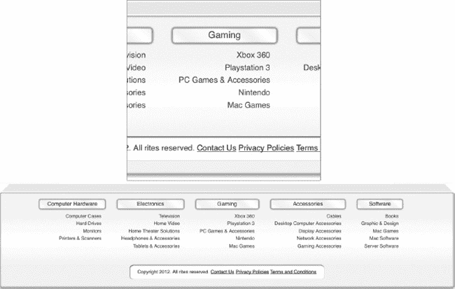
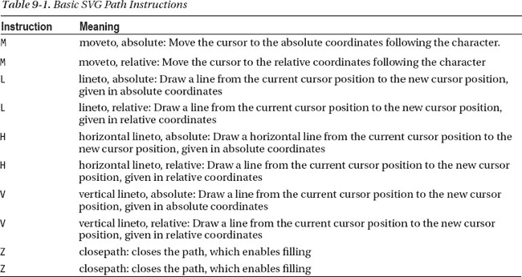
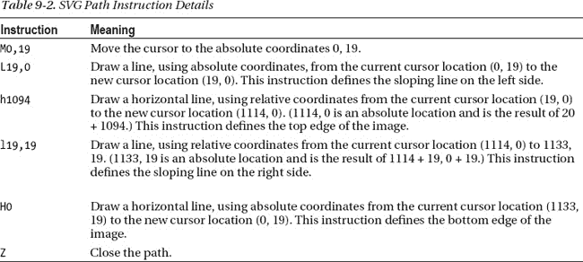

## C H A P T E R 9

## 页脚

许多网站都有页脚。通常，它是放置法律信息(如版权和商标声明)和适用于每个页面的一些内容的地方。每个在网上冲浪超过 10 分钟的人都知道，如果你在页眉中找不到联系人和关于链接，就在页脚中找。

页脚的另一个用途，也是我们将要使用的，是作为存放站点地图的地方。因为页脚出现在每个页面上，所以站点地图也总是出现。这使得那些从站点地图角度考虑的访问者的导航更加容易，对于那些喜欢搜索或浏览以找到他们喜欢的内容的访问者来说，这仍然是一个不错的选择。

因为页脚很简单，否则这一章会很短，所以我们也将利用这一章来介绍在网站上使用 SVG 的想法。SVG 可以很好地促进页面加载，这一点我们将在本章后面发现。

让我们先来看看我们对页脚有什么想法。然后我们将讨论如何实现它。[图 9-1](#fig_9_1) 显示了我们的示例站点`[http://clikz.us](http://clikz.us)`的页脚

***图 9-1。**我们的样本网站的页脚*

### 制作页脚

制作页脚的方法有很多:手工编写每个链接的代码，通过许多不同的服务器端机制生成链接，甚至使用 JavaScript 模板。(不过，我们建议不要使用 JavaScript 模板；它不能产生最佳性能，并且对搜索机器人不友好)。在这种情况下，我们将把页脚内容存储在服务器上的一个单独的文件中。该文件还包含网站菜单的内容，这是页脚的第一次性能提升。

为了创建站点地图中的所有链接，我们不打算创建新内容。相反，我们将使用 CSS 来重新设计菜单中已有的内容。除了不会两次下载相同的信息所带来的性能提升之外，我们还可以很好地提升开发人员的性能。当您向菜单中添加项目时，它也会自动出现在站点地图中。这省去了添加两次的麻烦，也消除了出现错误的可能性，因为你记住了一个地方，却忘记了另一个地方。我们强烈反对两次输入相同的内容，不仅仅是因为我们懒惰，还因为手动复制经常是错误的来源。

为了便于说明，让我们假设一个 PHP 支持的站点。因此，导航信息(无论是菜单还是站点地图)位于一个文件中，该文件包含一些对 PHP 呈现引擎有意义的特殊标记。我们可以很容易地选择许多其他技术，包括`.Net`(通过局部视图)、JavaServer Pages、JavaServer Faces 等等。

因此，首先我们必须将导航 HTML 从主模板中移除，并将其放入另一个文件中。在本例中，我们将代码放在一个`includes`文件夹中，并将文件命名为`siteNavigation.php`。为了使菜单和站点地图的样式不同，我们需要一种方法来设置一个唯一的选择器来匹配我们的 CSS。我们通过在 PHP include 上面设置一个变量来创建惟一的选择器，并在 HTML 中使用这个变量。[清单 9-1](#list_9_1) 显示了`siteNavigation.php`的内容。第一行(加粗)显示了我们设置选择器的位置，该选择器应用样式来创建菜单或站点地图。我们还加粗了设置一些辅助文本的行，帮助屏幕阅读器为视力有问题的访问者提供更少痛苦的体验。

***清单 9-1。【siteNavigation.php T2】内容，变量高亮***

`<ul class="navMainUL <?php echo $navContext ?> clearfix" role="navigation">
  <li class="visuallyhidden">
    <h3 class="assistive-text"><?php echo $assistiveNav?></h3>
    

      <a class="assistive-text" href="#content" title="Skip to primary content">Skip to primary content</a>
    

  </li>
  <li class="nmLI first">
    <a href="javascript:;" class="nmA">Computer Hardware </a>
    

      <ul class="nmUL-L2 ">
        <li class="nmLI-L2">
          <a href="" class="nmA-L2">Computer Cases</a>
        </li>
        <li class="nmLI-L2">
          <a href="" class="nmA-L2">Hard Drives</a>
        </li>
        <li class="nmLI-L2">
          <a href="" class="nmA-L2">Monitors</a>
        </li>
        <li class="nmLI-L2 nmLast">
          <a href="" class="nmA-L2">Printers &amp; Scanners</a>
        </li>
      </ul>
    

  </li>
  <li class="nmLI">
    <a href="javascript:;" class="nmA">Electronics</a>
    

      <ul class="nmUL-L2 ">
        <li class="nmLI-L2">
          <a href="" class="nmA-L2">Television</a>
        </li>
        <li class="nmLI-L2">
          <a href="" class="nmA-L2">Home Video</a>
        </li>
        <li class="nmLI-L2 nmLast">
          <a href="" class="nmA-L2">Home Theater Solutions</a>
        </li>
        <li class="nmLI-L2 nmLast">
          <a href="" class="nmA-L2">Headphones &amp; Accessories</a>
        </li>
        <li class="nmLI-L2 nmLast">
          <a href="" class="nmA-L2">Tablets &amp; Accessories</a>
        </li>
      </ul>
    

  </li>
  <li class="nmLI">
    <a href="javascript:;" class="nmA">Gaming</a>
    

      <ul class="nmUL-L2 ">
        <li class="nmLI-L2">
          <a href="" class="nmA-L2">Xbox 360</a>
        </li>
        <li class="nmLI-L2">
          <a href="" class="nmA-L2">Playstation 3</a>
        </li>
        <li class="nmLI-L2 nmLast">
          <a href="" class="nmA-L2">PC Games &amp; Accessories</a>
        </li>
        <li class="nmLI-L2">
          <a href="" class="nmA-L2">Nintendo</a>
        </li>
        <li class="nmLI-L2">
          <a href="" class="nmA-L2">Mac Games</a>
        </li>
      </ul>
    

  </li>
  <li class="nmLI">
    <a href="javascript:;" class="nmA">Accessories</a>
    

      <ul class="nmUL-L2 ">
        <li class="nmLI-L2">
          <a href="" class="nmA-L2">Cables</a>
        </li>
        <li class="nmLI-L2">
          <a href="" class="nmA-L2">Desktop Computer Accessories</a>
        </li>
        <li class="nmLI-L2">
          <a href="" class="nmA-L2">Display Accessories</a>
        </li>
        <li class="nmLI-L2">
          <a href="" class="nmA-L2">Network Accessories</a>
        </li>
        <li class="nmLI-L2">
          <a href="" class="nmA-L2">Gaming Accessories</a>
        </li>
      </ul>
    

  </li>
  <li class="nmLI last">
    <a href="javascript:;" class="nmA">Software</a>
    

      <ul class="nmUL-L2 ">
        <li class="nmLI-L2">
          <a href="" class="nmA-L2">Books</a>
        </li>
        <li class="nmLI-L2">
          <a href="" class="nmA-L2">Graphic &amp; Design</a>
        </li>
        <li class="nmLI-L2">
          <a href="" class="nmA-L2">Mac Games</a>
        </li>
        <li class="nmLI-L2">
          <a href="" class="nmA-L2">Mac Software</a>
        </li>
        <li class="nmLI-L2">
          <a href="" class="nmA-L2">Server Software</a>
        </li>
      </ul>
    

  </li>
  <li class="nmLI searchWrap">
    <input type="search" id="searchInput" class="searchInput" placeholder="Site Search" />
    <button class="searchBtn siteGrad">
      Search
    </button>
  </li>
</ul>`

这两个变量是我们所需要的,`$navContext`变量标识使用哪组样式(菜单或站点地图)。`$navContext`变量的值可以是`nmDropDown`或`footerNav`。给定这些值，我们可以为相同的信息创建两种非常不同的布局。我们还将`$assistiveNav`变量的值设置为对屏幕阅读器有意义的文本，这样使用屏幕阅读器的访问者就知道他们遇到了一个菜单或站点地图，并有机会跳过它。每个网页设计者都应该在屏幕阅读器中收听他们的网站。每次访问另一个页面，你都会听到上百个导航链接，你很快就会准备好面对屏幕。

设置变量是一项简单的任务。为了给菜单设置正确的值，把代码放在标题下面的清单 9-2 中。

***清单 9-2。**为菜单设置变量值*

`

  <?php
    $navContext = "nmDropDown";
    $assistiveNav = "Main Navigation";
    include ("includes/siteNavigation.php");
  ?>

`

要为菜单设置正确的值，将清单 9-3 中的代码放在页脚的顶部。

***清单 9-3。**为页脚设置变量值*

`

  <?php
    $navContext = "footerNav";
    $assistiveNav = "Footer Navigation";
    include ("includes/siteNavigation.php");
  ?>

`

因此，在每个实例中，我们都定义了一段由服务器处理的代码。这就是`<?php //serverside code goes here ?>`形式的指令所做的。在这种情况下，我们为节(菜单或页脚)设置适当的变量，然后直接在变量声明下面输出`siteNavigation.php`的内容(用适当的特定于节的值填充)。我们得到的是不同的类名，这让我们可以为两个用例中的每一个恰当地设计 HTML 样式。例如，如果我们想在菜单和页脚中设置不同的第一层锚标签样式，我们可以使用[清单 9-4](#list_9_4) 中所示的 CSS。

***清单 9-4。**对菜单和页脚中的 1 级锚点标签进行不同的样式化*

`.nmDropDown .nmA {
  /* only styles the main navigation; */
}
.footerNav  .nmA{
  /* only styles the footer navigation; */

}`

正如我们在本章前面提到的，这种机制让我们只维护`.siteNavigation.php`(而不是同一个文件中的两个源或两个内容块)并在主站点导航和页脚之间共享那个文件中的内容。

除了本章前面提到的性能优势之外，突出站点地图还为站点访问者和运营站点的企业提供了另一个实质性的优势。用户可以一目了然地看到网站的分类。但是如果有人说，“嗯，这不就是网站地图的作用吗？”答案是好处可能不太明显。假设访问者可能对某个链接非常感兴趣，但是这个链接属于用户认为很无聊的类别。有了高度可见的站点地图，访问者更有可能点击那个链接。没有网站地图，访问者将永远找不到它，企业也将错过销售该产品的机会。这对各方来说都是一个失败的提议。访问者找不到感兴趣的产品，企业失去了销售，web 开发人员错过了让访问者找到正确内容的机会。所以，是的，这是显而易见的，但好处可能是显著的。将所有链接都放在页脚的最后一个优点是，它为基于 JavaScript 的主导航提供了备份(例如我们用来显示导航的下拉菜单)。如果你的网站使用基于 JavaScript 的菜单，但是访问者关闭了 JavaScript，他们什么也找不到，会很快转到其他网站。结果呢？你刚刚失去了一个机会。此外，搜索机器人通常不会遍历基于 JavaScript 的菜单。对于这两种情况，拥有一个网站地图，提供一种替代方式来连接访问者和搜索机器人的内容，让你在游戏中。

#### 设计页脚的样式

理论到此为止。让我们来看看设计页脚和它包含的站点地图背后的代码。清单 9-5 显示了样式页脚所需的所有 CSS 代码。这是一个巨大的清单，所以请耐心等待。我们将在本章的后面解释每一部分的作用。

***清单 9-5。**样式页脚的 CSS*

`.siteGrad {
  background: #e6272b; /* Old browsers */
  /* IE9 SVG, needs conditional override of 'filter' to 'none' */
  background: url(data:image/svg+xml;base64,PD94bWwgdmVyc2lvbj0iMS4wIiA/Pgo8c3ZnIHhtbG5zPSJodHRw
Oi8vd3d3LnczLm9yZy8yMDAwL3N2ZyIgd2lkdGg9IjEwMCUiIGhlaWdodD0iMTAwJSIgdmlld0JveD0iMCAwIDEgMSIgcHJl
c2VydmVBc3BlY3RSYXRpbz0ibm9uZSI+CiAgPGxpbmVhckdyYWRpZW50IGlkPSJncmFkLXVjZ2ctZ2VuZXJhdGVkIiBncmFk
aWVudFVuaXRzPSJ1c2VyU3BhY2VPblVzZSIgeDE9IjAlIiB5MT0iMCUiIHgyPSIwJSIgeTI9IjEwMCUiPgogICAgPHN0b3Ag
b2Zmc2V0PSIwJSIgc3RvcC1jb2xvcj0iI2U2MjcyYiIgc3RvcC1vcGFjaXR5PSIxIi8+CiAgICA8c3RvcCBvZmZzZXQ9IjE1
JSIgc3RvcC1jb2xvcj0iI2YxMjgyZCIgc3RvcC1vcGFjaXR5PSIxIi8+CiAgICA8c3RvcCBvZmZzZXQ9IjI3JSIgc3RvcC1j
b2xvcj0iI2YyMjkyZSIgc3RvcC1vcGFjaXR5PSIxIi8+CiAgICA8c3RvcCBvZmZzZXQ9IjUwJSIgc3RvcC1jb2xvcj0iI2Uz
MjYyYiIgc3RvcC1vcGFjaXR5PSIxIi8+CiAgICA8c3RvcCBvZmZzZXQ9Ijc3JSIgc3RvcC1jb2xvcj0iI2NhMjIyNiIgc3Rv
cC1vcGFjaXR5PSIxIi8+CiAgICA8c3RvcCBvZmZzZXQ9Ijg1JSIgc3RvcC1jb2xvcj0iI2M2MjEyNSIgc3RvcC1vcGFjaXR5
PSIxIi8+CiAgICA8c3RvcCBvZmZzZXQ9IjEwMCUiIHN0b3AtY29sb3I9IiNjNjIxMjUiIHN0b3Atb3BhY2l0eT0iMSIvPgog
IDwvbGluZWFyR3JhZGllbnQ+CiAgPHJlY3QgeD0iMCIgeT0iMCIgd2lkdGg9IjEiIGhlaWdodD0iMSIgZmlsbD0idXJsKCNn
cmFkLXVjZ2ctZ2VuZXJhdGVkKSIgLz4KPC9zdmc+);
  background: -moz-linear-gradient(top, #e6272b 0%, #f1282d 15%, #f2292e 27%, #e3262b 50%, #ca22
26 77%, #c62125 85%, #c62125 100%);/* FF3.6+ */
  background: -webkit-gradient(linear, left top, left bottom, color-stop(0%, #e6272b), color-
stop(15%, #f1282d), color-stop(27%, #f2292e), color-stop(50%, #e3262b), color-stop(77%, #ca2226)
, color-stop(85%, #c62125), color-stop(100%, #c62125));/* Chrome,Safari4+ */
  background: -webkit-linear-gradient(top, #e6272b 0%, #f1282d 15%, #f2292e 27%, #e3262b 50%, #c
a2226 77%, #c62125 85%, #c62125 100%);/* Chrome10+,Safari5.1+ */
  background: -o-linear-gradient(top, #e6272b 0%, #f1282d 15%, #f2292e 27%, #e3262b 50%, #ca2226
 77%, #c62125 85%, #c62125 100%);/* Opera 11.10+ */
  background: -ms-linear-gradient(top, #e6272b 0%, #f1282d 15%, #f2292e 27%, #e3262b 50%, #ca222
6 77%, #c62125 85%, #c62125 100%);/* IE10+ */
  background: linear-gradient(top, #e6272b 0%, #f1282d 15%, #f2292e 27%, #e3262b 50%, #ca2226 77
%, #c62125 85%, #c62125 100%);/* W3C */
  filter: progid:dximagetransform.microsoft.gradient(startColorstr='#e6272b', endColorstr='#c6212
5', GradientType=0);/* IE6-8 */

}
.mainFooter {
  clear: both;
  padding: 18px 0;
  text-align: center;
}
.mainFooter .row {
  overflow: visible;
}
nav.mainFooterWrap {
  box-shadow: 0px 3px 4px rgba(0, 0, 0, 0.2), inset 0px 0px 3px #888888;
  -webkit-border-radius: 3px;
  -moz-border-radius: 3px;
  border-radius: 3px;
  -moz-background-clip: padding;
  -webkit-background-clip: padding-box;
  background-clip: padding-box;
  background: #fafafa;/* Old browsers */

  /* IE9 SVG, needs conditional override of 'filter' to 'none' */
  background: url(data:image/svg+xml;base64,PD94bWwgdmVyc2lvbj0iMS4wIiA/Pgo8c3ZnIHhtbG5zPSJodHRw
Oi8vd3d3LnczLm9yZy8yMDAwL3N2ZyIgd2lkdGg9IjEwMCUiIGhlaWdodD0iMTAwJSIgdmlld0JveD0iMCAwIDEgMSIgcHJl
c2VydmVBc3BlY3RSYXRpbz0ibm9uZSI+CiAgPGxpbmVhckdyYWRpZW50IGlkPSJncmFkLXVjZ2ctZ2VuZXJhdGVkIiBncmFk
aWVudFVuaXRzPSJ1c2VyU3BhY2VPblVzZSIgeDE9IjAlIiB5MT0iMCUiIHgyPSIwJSIgeTI9IjEwMCUiPgogICAgPHN0b3Ag
b2Zmc2V0PSIwJSIgc3RvcC1jb2xvcj0iI2ZhZmFmYSIgc3RvcC1vcGFjaXR5PSIxIi8+CiAgICA8c3RvcCBvZmZzZXQ9IjE1
JSIgc3RvcC1jb2xvcj0iI2ZhZmFmYSIgc3RvcC1vcGFjaXR5PSIxIi8+CiAgICA8c3RvcCBvZmZzZXQ9IjI3JSIgc3RvcC1j
b2xvcj0iI2ZhZmFmYSIgc3RvcC1vcGFjaXR5PSIxIi8+CiAgICA8c3RvcCBvZmZzZXQ9IjUwJSIgc3RvcC1jb2xvcj0iI2Zm
ZmZmZiIgc3RvcC1vcGFjaXR5PSIxIi8+CiAgICA8c3RvcCBvZmZzZXQ9Ijc3JSIgc3RvcC1jb2xvcj0iI2Y5ZjlmOSIgc3Rv
cC1vcGFjaXR5PSIxIi8+CiAgICA8c3RvcCBvZmZzZXQ9Ijg1JSIgc3RvcC1jb2xvcj0iI2Y5ZjlmOSIgc3RvcC1vcGFjaXR5
PSIxIi8+CiAgICA8c3RvcCBvZmZzZXQ9IjEwMCUiIHN0b3AtY29sb3I9IiNmOWY5ZjkiIHN0b3Atb3BhY2l0eT0iMSIvPgog
IDwvbGluZWFyR3JhZGllbnQ+CiAgPHJlY3QgeD0iMCIgeT0iMCIgd2lkdGg9IjEiIGhlaWdodD0iMSIgZmlsbD0idXJsKCNn
cmFkLXVjZ2ctZ2VuZXJhdGVkKSIgLz4KPC9zdmc+);
  background: -moz-linear-gradient(top, #fafafa 0%, #fafafa 15%, #fafafa 27%, #ffffff 50%, #f9f9
f9 77%, #f9f9f9 85%, #f9f9f9 100%);/* FF3.6+ */
  background: -webkit-gradient(linear, left top, left bottom, color-stop(0%, #fafafa), color-
stop(15%, #fafafa), color-stop(27%, #fafafa), color-stop(50%, #ffffff), color-stop(77%, #f9f9f9)
, color-stop(85%, #f9f9f9), color-stop(100%, #f9f9f9));/* Chrome,Safari4+ */
  background: -webkit-linear-gradient(top, #fafafa 0%, #fafafa 15%, #fafafa 27%, #ffffff 50%, #f
9f9f9 77%, #f9f9f9 85%, #f9f9f9 100%);/* Chrome10+,Safari5.1+ */
  background: -o-linear-gradient(top, #fafafa 0%, #fafafa 15%, #fafafa 27%, #ffffff 50%, #f9f9f9
77%, #f9f9f9 85%, #f9f9f9 100%);/* Opera 11.10+ */
  background: -ms-linear-gradient(top, #fafafa 0%, #fafafa 15%, #fafafa 27%, #ffffff 50%, #f9f9f
9 77%, #f9f9f9 85%, #f9f9f9 100%);/* IE10+ */
  background: linear-gradient(top, #fafafa 0%, #fafafa 15%, #fafafa 27%, #ffffff 50%, #f9f9f9 77
%, #f9f9f9 85%, #f9f9f9 100%);/* W3C */
  filter: progid:dximagetransform.microsoft.gradient(startColorstr='#fafafa', endColorstr='#f9f9f
9', GradientType=0);/* IE6-8 */

}
.footerNav {
  display: inline-block;
  padding-top: 20px;
}
.footerNav .nmLI {
  float: left;
  margin-right: 30px;
}
.footerNav .nmA {
  color: #777;
  box-shadow: 0 0 3px #999;
  font-size: 14px;
  display: block;
  padding: 2px 20px;
  -webkit-border-radius: 4px;
  -moz-border-radius: 4px;
  border-radius: 4px;
  -moz-background-clip: padding;
  -webkit-background-clip: padding-box;
  background-clip: padding-box;
  box-shadow: 0 0 3px rgba(0, 0, 0, 0.5), inset 0 0 2px rgba(0, 0, 0, 0.5);
  background: #ffffff;/* Old browsers */
  /* IE9 SVG, needs conditional override of 'filter' to 'none' */
  background: url(data:image/svg+xml;base64,PD94bWwgdmVyc2lvbj0iMS4wIiA/Pgo8c3ZnIHhtbG5zPSJodHRw
Oi8vd3d3LnczLm9yZy8yMDAwL3N2ZyIgd2lkdGg9IjEwMCUiIGhlaWdodD0iMTAwJSIgdmlld0JveD0iMCAwIDEgMSIgcHJl
c2VydmVBc3BlY3RSYXRpbz0ibm9uZSI+CiAgPGxpbmVhckdyYWRpZW50IGlkPSJncmFkLXVjZ2ctZ2VuZXJhdGVkIiBncmFk
aWVudFVuaXRzPSJ1c2VyU3BhY2VPblVzZSIgeDE9IjAlIiB5MT0iMTAwJSIgeDI9IjEwMCUiIHkyPSIwJSI+CiAgICA8c3Rv
cCBvZmZzZXQ9IjAlIiBzdG9wLWNvbG9yPSIjZmZmZmZmIiBzdG9wLW9wYWNpdHk9IjEiLz4KICAgIDxzdG9wIG9mZnNldD0i
MTUlIiBzdG9wLWNvbG9yPSIjZjlmOWY5IiBzdG9wLW9wYWNpdHk9IjEiLz4KICAgIDxzdG9wIG9mZnNldD0iNTAlIiBzdG9w
LWNvbG9yPSIjZmZmZmZmIiBzdG9wLW9wYWNpdHk9IjEiLz4KICAgIDxzdG9wIG9mZnNldD0iNzElIiBzdG9wLWNvbG9yPSIj
ZjhmOGY4IiBzdG9wLW9wYWNpdHk9IjEiLz4KICAgIDxzdG9wIG9mZnNldD0iODUlIiBzdG9wLWNvbG9yPSIjZmZmZmZmIiBz
dG9wLW9wYWNpdHk9IjEiLz4KICAgIDxzdG9wIG9mZnNldD0iMTAwJSIgc3RvcC1jb2xvcj0iI2Y4ZjhmOCIgc3RvcC1vcGFj
aXR5PSIxIi8+CiAgPC9saW5lYXJHcmFkaWVudD4KICA8cmVjdCB4PSIwIiB5PSIwIiB3aWR0aD0iMSIgaGVpZ2h0PSIxIiBm
aWxsPSJ1cmwoI2dyYWQtdWNnZy1nZW5lcmF0ZWQpIiAvPgo8L3N2Zz4=);
  background: -moz-linear-gradient(45deg, #ffffff 0%, #f9f9f9 15%, #ffffff 50%, #f8f8f8 71%, #ff
ffff 85%, #f8f8f8 100%);/* FF3.6+ */
  background: -webkit-gradient(linear, left bottom, right top, color-stop(0%, #ffffff), color-
stop(15%, #f9f9f9), color-stop(50%, #ffffff), color-stop(71%, #f8f8f8), color-stop(85%, #ffffff)
, color-stop(100%, #f8f8f8));/* Chrome,Safari4+ */
  background: -webkit-linear-gradient(45deg, #ffffff 0%, #f9f9f9 15%, #ffffff 50%, #f8f8f8 71%,
#ffffff 85%, #f8f8f8 100%);/* Chrome10+,Safari5.1+ */
  background: -o-linear-gradient(45deg, #ffffff 0%, #f9f9f9 15%, #ffffff 50%, #f8f8f8 71%, #ffff
ff 85%, #f8f8f8 100%);/* Opera 11.10+ */
  background: -ms-linear-gradient(45deg, #ffffff 0%, #f9f9f9 15%, #ffffff 50%, #f8f8f8 71%, #fff
fff 85%, #f8f8f8 100%);/* IE10+ */
  background: linear-gradient(45deg, #ffffff 0%, #f9f9f9 15%, #ffffff 50%, #f8f8f8 71%, #ffffff
85%, #f8f8f8 100%);/* W3C */
  filter: progid :dximagetransform.microsoft.gradient(startColorstr='#ffffff',
endColorstr='#f8f8f8', GradientType=1);/* IE6-8 fallback on horizontal gradient */

}
.footerNav .ie9 .nmA {
  filter: none;
}
.footerNav .nmSlideout {
  height: auto;
  padding: 10px;
}
.footerNav .nmUL-L2 {
  padding-bottom: 20px;
}
.footerNav .nmA-L2 {
  color: #888;
  font-size: 12px;
  text-align: right;
  display: block;
  padding-bottom: 2px;
}
.footerNav .nmA-L2:first-word {
  color: #00F;
  font-weight: bold;
}
.footerNav .searchWrap {
  display: none;
}
.mainFooterUL {
  display: inline-block;
}
.mfLI {
  float: left;
  padding: 0 10px;
  border-right: 1px solid #999;
}
.mfLI.mfLast {
  border: 0;
}
.mfA {
  font-size: 12px;
  color: #999;
}
.mainFooterWrap {
  text-align: center;
  padding-bottom: 20px;
}
.legalWrap {
  background: #FFF;
  display: inline-block;
  padding: 10px 20px;
  -webkit-border-radius: 10px;
  -moz-border-radius: 10px;
  border-radius: 10px;
  -moz-background-clip: padding;
  -webkit-background-clip: padding-box;
  background-clip: padding-box;
  box-shadow: inset 1px 1px 2px rgba(0, 0, 0, 0.5);
}
.legalText {
  margin: 0;
  font-size: 12px;
  color: #777;
}
.legalText a {
  color: #555;
  text-decoration: underline;
}`

大部分代码非常简单，与我们做过的其他事情相似。然而，我们想指出一些关于页脚布局代码的事情。我们将从我们的`.footerNav .nmA`规则集中的双框阴影开始，如下行所示:

`box-shadow: 0 0 3px rgba(0, 0, 0, 0.5), inset 0 0 2px rgba(0, 0, 0, 0.5);`

那一行有三个项目需要我们注意。首先，我们使用 RGBA，因为它允许我们通过 Alpha (A)值设置透明度值。在本例中，我们将透明度设置为 50(`0.5`)。结果是透明度为 50%的黑色阴影，这使它们变成深灰色，并让背景中的项目透过阴影显示出来。

第二，我们使用了一个插入值，由于光源似乎来自左上角，这使得这个框看起来像是缩进了页面中。(光源可能来自任何地方，但左上角是标准。)在版权声明周围可以看到嵌入效果。

关键字 *inset* ，告诉浏览器我们想要盒子里面有阴影。这可以用来使盒子的内部看起来是嵌入式的，意思是凹陷的，阴影被投射在高度差中，通常灯光模拟来自左上角。我们在版权声明周围设置了这种效果。该效果由`.legalWrap`类中的以下行定义:

`box-shadow: 1px 1px 2px rgba(0,0,0,.5);`

 **提示**方框阴影的一般格式如下:`box-shadow : horizontal_offset vertical_offset blur_radius color;`

然而，我们不希望导航的副标题出现凹陷。事实上，我们想要相反的效果:一点点提升。为了实现这种外观，我们设置阴影来帮助定义边缘，并给链接一点高度。所以我们在`.footerNav .nmA`类中设置了如下阴影:

`Box-shadow: 0 0 2px rbga(0,0,0,.5);`

这使得在站点地图中包含类别的框的整个内部周围有 2 个像素的相等阴影。它创造了一种斜面效果。

要注意的第三点是，我们有多个阴影定义，用逗号分隔。您可以添加任意数量的阴影，用逗号分隔各个阴影。要了解有多疯狂，请访问另一个保罗爱尔兰网站，看看他如何在文本上使用阴影: [`http://mothereffingtextshadow.com/`](http://mothereffingtextshadow.com/)

我们建议谨慎使用阴影，无论你在哪里使用它们，除非你正在创建一个展示阴影的站点。野生阴影会使访问者阅读和导航更加困难。尽管如此，如果使用得当，它们可以将访问者的注意力吸引到重要的地方，所以它们是一个好主意。

#### SVG

正如我们在本章开始时提到的，页脚可能有点无聊。为了让它更有活力，我们通过 SVG(可缩放矢量图形)增加了一点渐进的增强。SVG 对于某些事情非常有用。然而，Internet Explorer 直到版本 9 才支持 SVG。因此，我们通过 Modernzr 使用我们通常的特征检测技巧，并且只在浏览器知道如何处理 SVG 时才显示它。SVG 确实在运行 WebKit 浏览器的移动设备上大放异彩(iPhone、Android、Palm)。然而，我们也需要支持旧的浏览器，所以我们将再次使用渐进式改进来确保所有访问者得到的页面看起来和他们的浏览器所能提供的一样好。

在我们开始实现之前，我们需要解释一些关于 SVG 的事情。SVG 存储为 XML 的一种方言，对应于万维网联盟定义的模式。当前的推荐标准(版本 1.1)可以在 W3 网站上找到:`[http://www.w3.org/TR/SVG11/](http://www.w3.org/TR/SVG11/)`

SVG 允许创建复杂的形状，然后可以正确地缩放到任何大小。几年前，Jay 使用 SVG 为一个客户创建了一个四英尺高的金属标牌。因为是 SVG，他可以用彩色激光在普通信纸大小的纸上打印出标志的草稿。一旦客户对设计感到满意，他就把文件交给一家金属制造公司，该公司用这个图像制作了这个标志。因为 SVG 可以缩放到任何大小，所以 Jay 不必担心在呈现四英尺高时标牌看起来很好。客户对此很满意，这个标志仍然挂在德克萨斯州奥斯汀的一栋建筑的侧面。

SVG 能够无限伸缩的秘密在于它的渲染方式。SVG(或任何其他矢量图像格式)不像光栅图像格式那样定义一堆像素。相反，它描述了各种形状以及它们之间的关系。如果您曾经上过几何课，您就会确切地知道 SVG 是如何工作的。它使用简单形状(圆形、三角形、正方形、矩形和其他多边形)之间和内部的相同数学关系来渲染任意大小的图像。复杂的形状，如字体中的字母，被渲染为一组简单的形状，但这是渲染引擎处理的细节(这也是一件好事，否则使用 SVG 会很痛苦)。无论您是需要网页上的徽标、四英尺高的金属标志、广告牌，还是飞艇侧面的消息，SVG 都可以缩放，以便在该尺寸下正确打印图像(没有像素化或其他不幸的打印瑕疵)。

设计人员可以手工创建 XML 来定义 SVG 图像，这对于简单的图像来说已经足够好了。然而，使用一个好的绘图工具，然后将结果保存为 SVG 通常更容易。幸运的是，Adobe Illustrator、CorelDraw、Inkscape 和其他各种软件都可以保存为 SVG。此外，Google Code 项目包括一个 SVG 绘图工具。它在`[http://svg-edit.googlecode.com/svn/branches/2.5.1/editor/svg-editor.html](http://svg-edit.googlecode.com/svn/branches/2.5.1/editor/svg-editor.html)`。最后，Apache 通过其 XML Graphics 项目维护了一个简单的工具，可以方便地进行 SVG 实验。叫蜡染，在`[http://xmlgraphics.apache.org/batik/](http://xmlgraphics.apache.org/batik/)`。杰用蜡染做了那个金属标牌。

那么我们页脚中的 SVG 在哪里呢？最上面的部分给页脚部分提供了深度的错觉。这个想法是创造一个顾客的产品放在上面的柜台的假象。不过，主要是为了向您展示一些简单的 SVG。

我们在页脚使用的 SVG 定义了简单的形状(一个浅灰色的条，两端向内倾斜),如图 9-2 所示。

***图 9-2。**页脚中的 SVG 图像。*

[清单 9-6](#list_9_6) 显示了生成 SVG 图像的代码和包含它的`div`元素。

***清单 9-6。**footerTopHolder div 元素*

`

  <svg version="1.1" x="0px" y="0px" width="100%" height="19px" viewBox="0 0 1133 19" preserveAspectRatio="none">
    <path fill="#F3F3F3" d="M0,19L19,0h1094l19,19H0z"/>
  </svg>

`

在我们深入研究使用 SVG 元素的细节之前，让我们考虑一下这样做的好处。在这种情况下，SVG 占用 182 个字节。同样大小(1133 × 19)的 PNG 图像需要 290 字节。更好的是，我们保存了一个 HTTP 请求，因为 SVG 内容在 HTML 中。这两个因素都给了我们比图像更好的表现。

现在让我们花点时间来看看`svg`元素。元素的开始标签包含了许多我们出于各种原因需要的属性。我们需要`id`属性，这样我们就可以使用 JavaScript 来修改图像。我们将在这一章的后面讨论这个问题。我们需要`version`和`xmlns`属性来为浏览器识别我们正在创建什么样的图像。`x`和`y`属性定义了形状的原点。`width`属性被设置为 100 %,它指定图像应该占据所有可用的宽度。`height`属性指定高度应该是 19 像素。

 **提示**视图框属性定义了渲染引擎的最小和最大高度和宽度。通常，它应该与 svg 元素的子元素的高度和宽度相匹配。在我们的例子中，我们只有一个子元素，所以我们将 viewBox 属性的大小设置为子元素的大小，这必须通过数学方法来推导。(当我们到达子元素时，我们将展示如何做到这一点。)

此外，设置视图框定义了高度与宽度的比率。由于不同的访问者使用不同宽度的浏览器(或者如果人们改变浏览器的宽度)，这个比例保持不变。因此，条的高度随着宽度的变小而变小。在这种情况下，我们不希望这样；我们希望条的高度保持为 19 像素，不管条有多宽。为此，我们必须使用值为`none`的`preserveAspectRatio`属性，这意味着我们没有保留纵横比。将`preserveAspectRatio`设置为`none`会使图像填满所有可用空间，这给了我们想要的效果。如果这一切看起来不清楚，请原谅我们。当我们完成产品并展示最终的图像时，各种元素的相互作用会更加清晰。

path 元素包含两个属性。两者中最明显的一个是`fill`属性，它指定填充颜色。由于我们使用的是实心和不透明填充，我们不需要其他与填充相关的属性，比如`fill-rule`或`fill-opacity`。`d`(“数据”的缩写)属性包含更复杂的内容。它指定了创建我们想要的形状的路径。它通过下面的字符串定义了四个点:`"M0,19L19,0h1094l19,19H0z"`。理解字符串如何定义路径的诀窍在于知道路径中的字母是什么意思。[表 9-1](#tab_9_1) 描述了各种路径定义指令(每个都是一个字符)及其含义。

 **注意**我们已经讲述了基本的命令。还存在用于定义更复杂形状的其他命令。有关更多细节，请参见 W3 SVG 规范。您可以在 [`http://www.w3.org/TR/SVG/Overview.html`](http://www.w3.org/TR/SVG/Overview.html) 找到 SVG 规范

如果您仔细研究路径字符串，您可以看到它设置了一个初始位置(`M0, 19`)，绘制了四条线，最后关闭了路径(使用`z`指令)。[表 9-2](#tab_9_2) 更详细地描述了这些指令。

通过计算绝对光标位置，正如我们在[表 9-2](#tab_9_2) 中所做的，你可以计算出`svg`元素的`viewBox`属性有多大。当然，我们实际上从期望的宽度 1133 开始向后工作，这是 1140 网格的宽度，带有一个小的边距。

为了确保包含的`div.footerTopHolder`在 SVG 可用时出现，我们添加了清单 9-7 中的[所示的代码。同样，我们依靠 Modernzr 来测试 SVG 支持，然后根据 modern Zr 的发现，我们将`svg`或`no-svg`添加到 class 属性中。](#list_9_7)

***清单 9-7。**移除浏览器无法显示的 SVG 图像*

`.no-svg .footerTopHolder {
                display:none;
}`

正如我们在本节前面提到的，SVG 占用 182 个字节。同样大小(1133 × 19)的 PNG 图像需要 290 字节。更重要的是，我们保存了一个 HTTP 请求，因为 SVG 内容在 HTML 中。这两个因素都产生了比图像更好的性能。

除了尺寸优势，使用 SVG 还有另一个好处:即使宽度改变，高度也可以保持不变。这不是您经常想做的事情，但它确实为 SVG 的另一个优点提供了一个有趣的演示。因为我们设置了`width ="100%"`和`height ="19px"`，所以当宽度改变时，浏览器确保高度保持 19 像素。

传统上，如果我们在这里使用一个图像，我们的浏览器窗口变小了，我们漂亮的响应网站适应了更小的尺寸，你会期望得到类似于图 9-3 和图 9-4 与图 9-3 和图 9-4 之间的差别。

***图 9-3。**原始尺寸*

***图 9-4。**使用 SVG 缩小尺寸(50%)，同时指定特定的高度和百分比宽度，产生高度不变的图像，如图[图 9-5](#fig_9_5) 所示。此外，因为浏览器中的 SVG 渲染引擎正在渲染一个数学构造(它是几何图形，还记得吗？)，它永远不会产生任何令人遗憾的渲染伪像，比如像素化。*

***图 9-5。**尺寸较小，高度固定*

同样，这不是一个经常使用的技术，但是当你需要它的时候，它肯定是方便的。JavaScript 交互

现在让我们考虑使用 SVG 的最后一个好处。您可以通过 JavaScript 与图像进行交互。使用 jQuery 使得这种交互变得非常容易。只需使用`.attr`方法并重置 SVG 中的各种值。清单 9-8 展示了一个可以对 SVG 图像做的事情的简单例子。

***清单 9-8。**用 JavaScript 修改 SVG 图像*

`$("#footerTop").attr("width", "200px");
$("#footerTop").find("path").attr("fill", "#0000FF");`

而现在是 200 像素宽，蓝色，如图[图 9-6](#fig_9_6) 所示。

***图 9-6。**用 JavaScript 修改后的页脚栏*

把你的注意力集中在线的末端。看到角度怎么不再是 45 度了？这是因为我们改变了`svg`元素的宽度属性，但是没有改变 path 元素中`d`属性的值。这种效果是在显示器顶部附近的某个地方出现了一个消失点，这就是我们想要的效果。

我们只是触及了 SVG 的皮毛。更有趣的是(对于本书来说，这是一个太大的主题)将 SVG 与`canvas`元素结合使用。SVG 和`canvas`元素为复杂的 Flash 功能、体验和交互提供了真正的替代方案。我们并不讨厌 Flash (Michael 曾长期从事 Flash 开发)，但如果内容必须移动化，我们今天就不推荐使用 Flash。

#### 不只是简单的形状

我们想分享关于 SVG 的最后一点想法。在我们示例网站的例子中，我们使用了一个非常简单的形状。然而，SVG 能够呈现复杂得多的图像。通过使用 Adobe Illustrator 之类的程序，您可以制作一些令人惊叹的 SVG 艺术作品。问题通常是如何平衡复杂性和大小。图形越复杂，正确渲染所需的代码就越多。有时，如果不考虑缩放或打印，使用图像会更有意义。

尽管如此，让我们看看 Illustrator 中内置的一些有趣的功能。它可以将复杂的图像(甚至是照片)转换成 SVG。然而，这些文件的大小通常非常大。为了好玩，Michael 在 Illustrator 中使用 Live Trace 制作了一个自己的 SVG 图像。你可以玩互动演示，让你在 [`http://clikz.us/svg.html`](http://clikz.us/svg.html) 改变图像的大小。现在看看你能不能放大迈克尔的头来匹配他的自负。这个图像需要 600 千字节(600 kb)的文件大小，证明 SVG 对于复杂的图像(尤其是照片)并不总是一个好的选择。

***图 9-7。**迈克尔的自画像*

### 总结

在本章中，我们描述了我们在示例站点中使用的页脚:`[http://clikz.us](http://clikz.us)`。

在这个过程中，我们演示了以下内容:如何重用内容来制作菜单和站点地图；如何用阴影突出显示页脚的重要部分；如何在网站上使用 SVG。

在描述如何使用 SVG 作为网页内容的过程中，我们演示了

*   对于简单的图像，SVG 使用更少的字节并减少 HTTP 请求的数量，这两者都有助于更好的页面加载时间和更少的网络流量。
*   SVG 可以由 JavaScript 操纵，让您更改图像以响应页面上的事件；这种技术可以产生一些很棒的交互式页面。
*   SVG 并不是渲染复杂图像的最佳方式，尤其是照片，尽管您可以从中获得一些乐趣。

我们不会在本书中进一步讨论页脚。然而，您可以在我们的示例站点的每个页面上看到它的运行:`[http://clikz.us](http://clikz.us)`。

本章总结了我们对本网站每个页面所用项目的描述。从这里开始，我们将投入到创建和使用可重用的 web 控件中，如第 5 章所述。