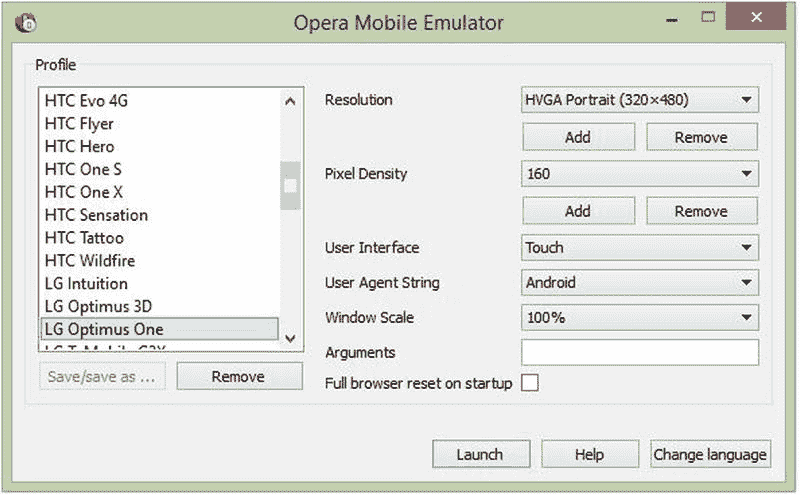
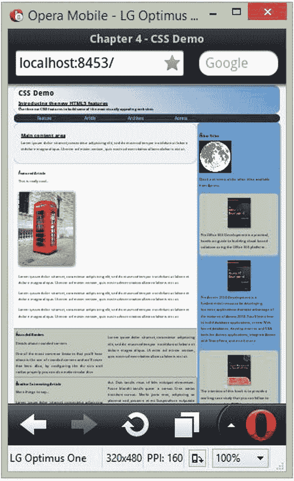
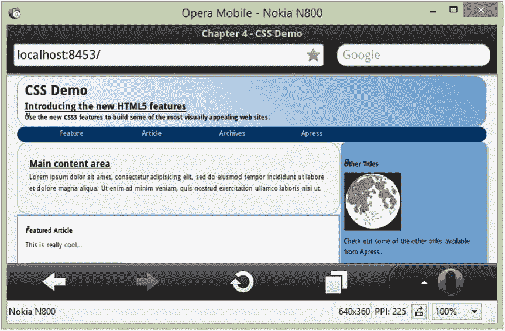
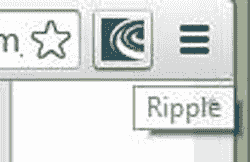
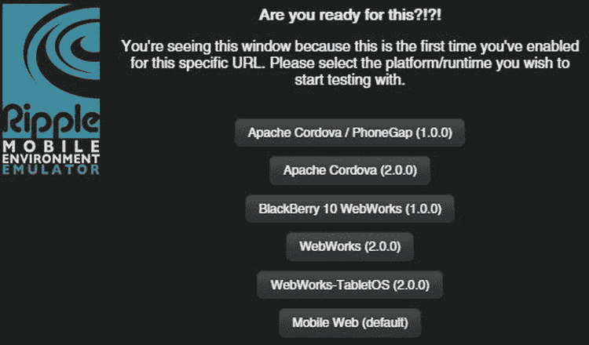
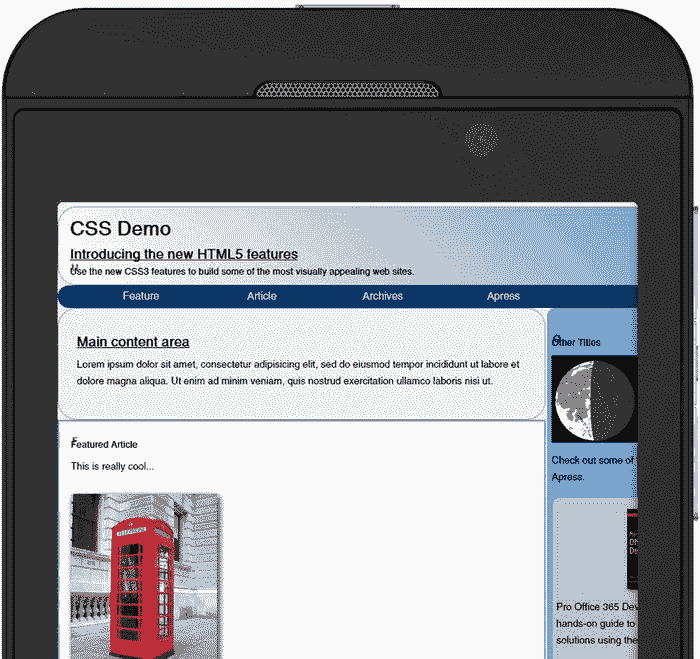
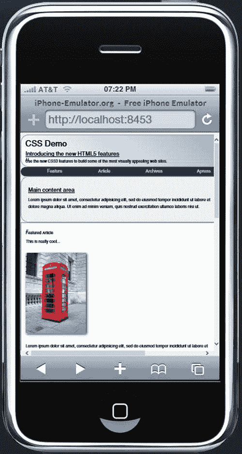
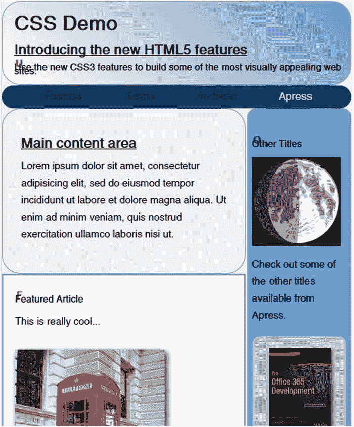
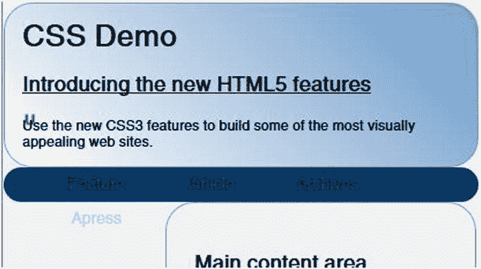
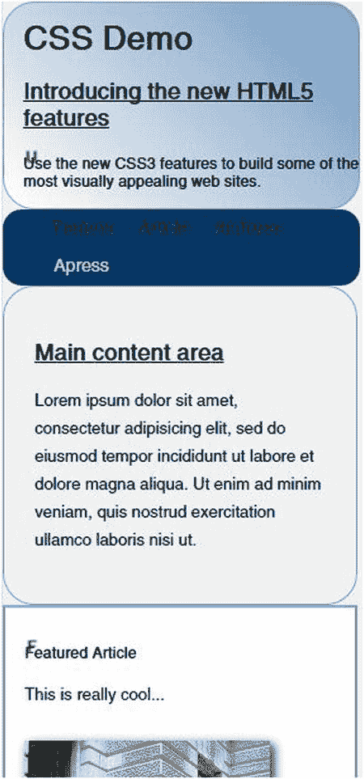

# 六、移动网络应用

到目前为止，我们只看了桌面浏览器；然而，HTML5 真正伟大的方面之一是它在包括手机、平板电脑和电视在内的各种设备上的支持程度。据 Html5Test.com 报道，在撰写本文时，Chrome 和 Opera 平台分别以 523 分和 489 分领先。但亚马逊丝绸，火狐手机，安卓和黑莓以 468，456，452 和 449 分紧随其后，满分为 555 分。

在移动设备上，您将使用本地应用和 web 应用。原生应用是为特定的移动平台开发的，并安装在设备上，或者通过电话服务下载。原生应用通常可以提供最佳的用户体验，因为它们可以最大限度地利用设备的特定硬件和操作系统功能。然而，部分由于 HTML5 的流行，网络应用的需求也越来越大。它们的开发几乎和桌面浏览器一样容易。

## 使用模拟器

要查看您的网站在移动设备上如何工作，您可以使用许多电话模拟器应用。虽然这些功能可能不完全像实际的硬件，但它们提供了一个合理的近似值。我将向您展示如何安装和使用几个更常见的实用程序。

### 使用 Opera 移动模拟器

Opera 提供了一个免费的移动模拟器应用，你可以从 [`www.opera.com/developer/tools/mobile`](http://www.opera.com/developer/tools/mobile) 下载。这个工具特别好的一点是，你可以从一个很长的列表中选择你想要模拟的设备。安装好这个应用后，启动它，你应该会看到如图 [6-1](#Fig1) 所示的启动窗口。

图 6-1。

The Opera emulator launch window

当您选择一个设备时，窗口会显示硬件详细信息，如屏幕分辨率。选择 LG Optimus One 设备，然后单击启动按钮。有了这个模拟器，你可以使用设备键盘或桌面键盘。从第四章的[中输入你的站点的 URL，它应该看起来像图](04.html) [6-2](#Fig2) 。

图 6-2。

Emulating the LG Optimus One device

请注意，页面被缩放以适合屏幕，这使得它几乎不可读。你将在本章的后面处理这个问题。您可以尝试一些其他设备，如诺基亚 N800，如图 [6-3](#Fig3) 所示。正如您所料，较大的外形尺寸可以更好地处理页面。

图 6-3。

Emulating the Nokia N800

### 安装镀铬波纹

在 Chrome 和 Firefox 上模拟移动设备需要一种不同的方法，即使用桌面浏览器的附加组件。使用仿真器时，实际上是使用带有一些附加功能的桌面浏览器来模拟设备的外形。

启动 Chrome 桌面浏览器，点击应用图标，选择网络商店应用。在搜索框中，选择扩展选项并键入 ripple emulator。结果应该如图 [6-4](#Fig4) 所示。单击免费按钮安装扩展。

图 6-4。

The Ripple emulator in the web store

安装完插件后，使用 Chrome 浏览器并输入第四章网站的 URL。右上角有一个按钮，如图 [6-5](#Fig5) 所示，用于启动模拟器。

图 6-5。

Launching Ripple

点击该按钮，然后点击使能按钮，如图 [6-6](#Fig6) 所示。

图 6-6。

Enabling the Ripple emulator

这将使用模拟器模式显示当前页面。第一次为一个特定的 URL 启动 Ripple，你会看到如图 [6-7](#Fig7) 所示的提示。点击 BlackBerry 10 WebWorks 按钮，选择要模拟的平台。

图 6-7。

Selecting the desired platform

你在 BlackBerry 10 设备上的网页应该如图 [6-8](#Fig8) 所示。

图 6-8。

The web page on the BlackBerry 10 device

浏览器窗口的左上角和右上角有两个带箭头的小按钮。使用这些来显示/隐藏选项窗口。例如，如图 [6-9](#Fig9) 所示，左边的界面允许您更改设备方向或选择不同的平台进行仿真。它还提供了当前设备的一些技术细节，如屏幕分辨率。右边的按钮包括“设置”标签，您可以在暗主题和亮主题之间切换。

图 6-9。

Displaying the emulator options

### 模拟其他设备

要在 iPhone 上模拟你的网站，使用 Chrome 浏览器，进入这个网站: [`http://iphone-emulator.org`](http://iphone-emulator.org/) 。当模拟器显示时，在设备上的搜索框中输入第 4 章网站的 URL。该站点将如图 [6-10](#Fig10) 所示。

图 6-10。

Emulating the web page on an iPhone

请注意页面顶部的按钮，这些按钮使您能够模拟其他设备，如 iPad 和 Android。

Tip

还有其他模拟器可用；我只讲了几个。如果您想查看其他选项，请尝试在 [`https://www.browserstack.com/list-of-browsers-and-platforms?product=live`](https://www.browserstack.com/list-of-browsers-and-platforms?product=live) 浏览堆栈。您还可以在 [`www.asp.net/mobile/device-simulators`](http://www.asp.net/mobile/device-simulators) 查看 ASP.net 上的资源。

## 处理外形尺寸

创建在移动设备上运行良好的 web 应用时，最大的挑战是处理各种形状因素。在较大的设备上，你会希望利用额外的空间，同时在较小的设备上也有一个合理的外观。到目前为止，在我展示的示例中，设备要么缩放页面以适应页面，要么裁剪页面。这两种方法都不是最佳的。

有三种技术可以帮助你改善你的网站在各种外形下的外观。

*   媒体查询:这允许您根据现有视口的属性应用不同的样式。我将用这一章的大部分时间来证明这一点。
*   使用 CSS flexbox 布局:这类似于使用 Windows Presentation Foundation(WPF)设计表单，允许浏览器根据窗口大小动态调整大小或移动元素。我将解释这是如何工作的，然后您将使用它来配置导航链接。
*   灵活的图像和视频:这只是指示浏览器拉伸或收缩图像，以适应可用的空间。

Tip

各种仿真器做的事情之一是根据设备特性限制窗口大小。您可以通过简单地调整浏览器窗口的大小来完成同样的事情。对于您的初始测试，您可以缩小窗口并查看布局如何响应。然后使用模拟器进行最后的测试。

### 了解媒体查询

CSS 2.1 引入了`media`关键字，允许你定义一个打印机友好的样式表。例如，您可以使用这样的内容:

`<link rel="stylesheet" type="text/css" href="screen.css" media="screen" />`

`<link rel="stylesheet" type="text/css" href="print.css" media="print" />`

然后，您可以为浏览器(屏幕)定义一个样式表，并为网页的打印版本定义一个不同的样式表。或者，您可以在单个样式表中嵌入特定于媒体的样式规则。例如，这将改变打印时的字体大小:

`@media print`

`{`

`h1, h2, h3`

`{`

`font-size: 14px;`

`}`

`}`

Tip

还支持其他媒体类型，包括`aural`、`braille`、`handheld`、`projection`、`tty`和`tv`。如您所见，媒体类型最初用于表示呈现页面的设备类型。此外，支持`all`类型，但是如果没有指定媒体类型，也是隐含的。带有`all`类型的样式适用于每个设备。

在 CSS3 中，这一点得到了显著的增强，允许您查询各种属性来确定合适的样式。例如，当窗口宽度为 600 像素或更小时，您可以应用如下样式:

`@media (max-width:600px)`

`{`

`h1`

`{`

`font-size: 12px;`

`}`

`}`

媒体查询中可以选择的功能如下:

*   `width`
*   `height`
*   `device-width`
*   `device-height`
*   `orientation`
*   `aspect-ratio`
*   `device-aspect-ratio`
*   `color` (0 表示单色或用于指定颜色的位数)
*   `color-index`(可供选择的颜色数量)
*   `monochrome`(彩色为 0，灰度为位数)
*   `resolution`(在 dpi 或 dpcm 中指定)
*   `scan`(对于电视，指定扫描模式)
*   `grid` (1 如果是网格设备如 TTY 显示，0 如果是位图)

其中大多数都支持`min-`和`max-`前缀，这意味着您不必使用大于号或小于号运算符。例如，如果您想要一个介于 500 像素和 700 像素之间的窗口样式，您可以指定如下:

`@media screen and (min-width: 500px) and (max-width: 700px)`

注意，在这个例子中，我还包括了`screen`媒体类型。在这种情况下，对于所有其他类型，如`print`，该样式将被忽略。

Tip

关于这些特性的完整定义，请参见 W3 规范的 [`www.w3.org/TR/css3-mediaqueries/#media1`](http://www.w3.org/TR/css3-mediaqueries/#media1) 。

### 使用媒体查询

您可以通过媒体查询做很多事情来动态设计您的网页。例如，您可以使用`color`和`monochrome`功能在单色设备上显示时应用更合适的样式。`color`功能返回支持的颜色数量，因此`(min-color: 2)`将选择所有颜色设备。您也可以使用`(orientation: portrait)`和`(orientation: landscape)`根据设备的方向排列元素。

在本演示中，您将关注窗口的宽度，但相同的基本概念也适用于其他功能。随着窗口宽度的缩小，样式将逐渐调整以适应窗口的大小，同时尽可能多地保留原始布局。

一个典型的方法是计划三种不同的风格:大型、中型和小型。大字体可能是网站最初设计的方式，就像你的第 4 章网站一样。有侧栏和多列内容。中等风格将保持相同的基本布局，但开始根据需要缩小区域。一个有用的技巧是使用相对大小，这样当窗口缩小时，每个元素也逐渐缩小。小型样式将用于手持设备，您通常会将布局保持为单列。由于页面现在会变得更长，页面上的书签链接变得更加重要。

## 修改[第 4 章](04.html)站点

为了演示这些技术，您将向您在第 4 章中构建的站点添加一些额外的样式规则。您将使用媒体查询来根据窗口的宽度有选择地应用这些样式。

Tip

章节 [4](04.html) 站点是使用 WebMatrix 应用创建的。但是，源代码下载提供了 WebMatrix 项目和 Visual Studio 项目。你会在章节 [4](04.html) 文件夹中找到这些。你可以用你喜欢的任何一个。该说明将告诉您如何修改`Default.cshtml`文件。如果您使用的是 Visual Studio，这将是`Index.cshtml`文件；这两个文件中的更改是相同的。我使用在第 5 章中修改过的版本，用 JavaScript 将内部链接设置为绿色。

打开章节 [4](04.html) 项目并运行应用。我们将继续使用 Chrome 浏览器，但大多数浏览器将支持本章演示的样式特性。尝试缩小浏览器窗口的宽度。请注意，页面根本没有缩放；浏览器简单地截取不适合窗口的内容。这是你有工作要做的第一个线索。网页应该是流畅的，并根据窗口大小进行调整。

Caution

为了使更改更容易理解，您只需将附加的样式规则附加到您的`style`标签的末尾。正如我在第四章中提到的，相同的选择器会覆盖文件中早先定义的样式。然而，使用相同的选择器是很重要的。您可以编写一个类似的选择器，它将返回相同的元素，但是如果它被认为不够具体，它不会覆盖前面的样式。例如，在本文档中，`nav a`将返回与`nav ul li a`相同的元素，但是后者被认为更具体，并且将优先于前者，即使它在文件中更靠前。

### 配置媒体布局

您的网页的当前布局基于相对较大的窗口，如桌面浏览器。设计网页时，还应该考虑适合小型设备的布局。我建议为小分辨率设备(如典型的移动设备)创建一个单独的设计。在本章中，您将使用媒体查询来实现小型、中型和大型配置。然而，中型布局往往是小型和大型之间的妥协。从大布局开始，然后设计小布局通常效果最好。

水平滚动不直观，应该尽可能避免。所以如果你的分辨率很窄，你应该垂直堆叠元素。例如,`aside e`元素需要放在页面的底部。你可以考虑去掉图片或者改变字体大小。

一旦你有了一个小的布局，你可以随着宽度的缩小而逐渐引入这些变化。我喜欢采取的方法是逐渐开始缩小浏览器窗口的宽度，看看有什么会中断。然后进行更正，以处理这一点，并尝试缩小一些。有了已经设计好的小布局，当你在这个迭代过程中进行调整时，你就会知道你要去哪里。

现在，您将定义中小型布局的样式，从中等开始。在中型设备上，您将使用相同的基本布局，但只是缩小一些元素。对于此站点，中等将被定义为宽度介于 600 像素和 940 像素之间。网页的大小是 940px，所以如果窗口比这个宽，就不需要调整。600 像素的最小尺寸有些随意。稍后我会解释我如何得出这个数字。

媒体布局需要一点调整。您将使用一个简单的技巧来定义具有相对大小的元素。这允许它们在调整窗口大小时自动收缩或伸展。打开`Default.cshtml`文件，将清单 [6-1](#FPar1) 中所示的规则添加到现有的`style`元素中。将此添加到所有现有规则之后。

Listing 6-1\. Defining the Medium Layout

`@@media screen and (max-width: 940px)`

`{`

`body`

`{`

`width: 100%;`

`}`

`aside`

`{`

`width: 30%;`

`}`

`nav ul li a`

`{`

`width: 100px;`

`}`

`}`

Note

在 Razor 语法中,“与”符号(`@`)用来表示跟在它后面的是代码，而不是内容。要在媒体查询这样的上下文中包含一个&符号，您需要使用一个双&符号。

通过将`body`宽度设置为 100%，它将自动缩小以适应窗口。但是，它不会超过 940 像素，因为这种样式仅在宽度小于 940 像素时应用。`aside`元素设置为 30%。当前比率(280 像素/940 像素)约为 30%。当你继续缩小窗口时，`nav`元素中的链接最终会被剪切掉，所以这种样式也会减少它们的宽度，使它们靠得更近。

运行应用并尝试缩小窗口。你应该注意到一个很好的流体布局，它可以根据窗口大小进行调整，如图 [6-11](#Fig11) 所示。

图 6-11。

Displaying the medium layout

### 配置小型布局

然而，最终布局效果并不好，如图 [6-12](#Fig12) 所示。

图 6-12。

The medium layout when shrunk too much

这里有几个你需要解决的问题。

*   页眉文本换行并重叠。
*   文本列太窄；这个大小不足以支持三个内容列。

调整布局的主要变化是将`aside`元素移到页面底部，而不是其他内容旁边。当你调整窗口大小时，其他的变化是渐进的，但是这个变化会导致一个跳跃。主要内容将从窗口大小的 70%变为 100%。您需要确定应该触发更改的适当宽度。我选择 600 像素，但是您可以尝试其他值，看看页面如何工作。

将清单 [6-2](#FPar2) 中的代码输入到现有`style`元素的末尾。

Listing 6-2\. Defining the Small Layout

`@@media screen and (max-width: 600px)`

`{`

`/* Move the aside to the bottom of the page */`

`#contentArea, #MainContent, aside`

`{`

`display: block;`

`}`

`aside`

`{`

`width: 98%;`

`}`

`/* Use a single column for the article content */`

`.otherContent`

`{`

`-webkit-column-count: 1;`

`column-count: 1;`

`}`

`/* Fix the line spacing of the header */`

`h2, h3`

`{`

`line-height:normal;`

`}`

`/* Force the intro element to stretch to fit the content */`

`.intro`

`{`

`height: min-content;`

`}`

`/* Move the book images to the left */`

`.book img`

`{`

`float: left;`

`margin-right:` `10px;`

`margin-bottom: 5px;`

`}`

`/* Make the book elements tall enough to fit the image */`

`.book`

`{`

`min-height: 120px;`

`}`

`}`

Note

您之前为中等尺寸添加的样式也适用于小尺寸样式，因为两者都适用于小于 940px 的宽度。小样式将定义额外的规则，但是记住前面的样式也适用。

小布局规则进行以下调整:

*   `aside`元素被移动到底部。这是通过撤销您在第 4 章中输入的表格和单元格属性，然后将宽度更改为 98%来完成的。以前，`#contentArea`元素的`display`属性被设置为表，`#mainContent`和`aside`元素被设置为`table-cell`。通过将这三个都设置为`block`，虚拟表被移除。
*   内容显示在两列中，这将减少到一列。
*   由于标题文本现在可以使用多行，请更改行高，使各行不重叠。
*   强制`intro`部分垂直拉伸，以确保所有内容适合。
*   将图书图像向左移动，将相应的文本向右移动。
*   确保书籍元素足够大以适合图像。

显示包含这些更改的网页并调整窗口大小。如果窗口足够窄，链接会换行，如图 [6-13](#Fig13) 所示。

图 6-13。

The web page with a narrow window

### 使用 Flexbox

为中等大小的窗口创建样式时，您减小了链接的宽度，以便它们适合较小的窗口。您可以再次这样做，这样它们仍然合适，但最终您将需要一个更好的解决方案。如果您需要添加另一个或两个链接，或者其中一个链接的长度超过了您指定的固定宽度，该怎么办？为了解决这个问题，你将使用一个灵活的盒子，或 flexbox。flexbox 允许您定义根据可用空间自动排列的内容块。

使用 flexbox 时，您需要配置容器以及容器中包含的物件。这些有时被称为父节点及其子节点。例如，文档中的`nav`标签有以下内容。`ul`标签包含一系列的`li`标签。

`<nav>`

`<ul>`

`<li><a href="#feature">Feature</a></li>`

`<li><a href="#other">Article</a></li>`

`<li><a href="#another">Archives</a></li>`

`<li><a href="`[`http://www.apress.com`](http://www.apress.com/)T2】

`</ul>`

`</nav>`

#### 配置容器

在容器元素上，在本例中是`ul`，您将把`display`属性设置为`flex`，以指示应该使用 flexbox。然后您可以指定`flow-direction`，它可以是`row`或`column`。方向设置为`row`时，项目从左到右水平对齐；有了`column`，它们就垂直堆叠，从上到下。您还可以添加`–reverse`来颠倒顺序(从右到左或从下到上)。这些是允许的值:

*   `row`:水平，从左到右(这是默认值)
*   `row-reverse`:水平，从右到左
*   `column`:垂直，从上到下
*   `column-reverse`:垂直，从下到上

然后您可以指定`flex-wrap`属性，该属性决定当项目不适合分配的空间时会发生什么。以下是可能的设置:

*   `nowrap`:内容显示在一行(或一列)中，并在必要时进行剪裁(这是默认值)。
*   `wrap`:项目按相同方向换行到下一行或下一列。
*   `wrap-reverse`:项目反方向绕到下一行(或列)。例如，如果`flow-direction`是`row`(从左到右)，第二行将从右到左。

`flex-direction`和`flex-wrap`可以合并成一个包含方向和环绕选项的`flex-flow`属性。例如，`flex-flow: row wrap`将水平对齐项目，并允许换行到下一行。

Note

方向指定主轴，水平或垂直。有几个属性可用于配置对齐；有些影响沿主轴的对齐，有些适用于副轴。我将假设使用了`row`方向来讨论这些。这是最常见的，使用这些术语会更容易理解。CSS 属性和值是有意通用的，使用像开始/结束这样的词，而不是顶部/底部或左侧/右侧。如果您使用的是`column`方向，属性和值同样适用，但是描述它们的词语会有所不同(例如，顶部对齐而不是左侧对齐)。

以下属性可用于进一步配置项目的对齐方式:

*   `justify-content`:主轴，影响一行内项目的水平间距
*   `align-items`:短轴，影响一行内的垂直对齐
*   `align-content`:短轴，影响行与行之间的垂直间距

您可以指定项目沿主轴对齐的方式，这将决定如何分配任何额外的空间。`justify-content`属性支持以下选项:

*   `flex-start`:默认。项目靠左对齐(如果使用列方向，则靠上对齐)。所有多余的空间都在末尾。
*   `flex-end`:项目右对齐(或下对齐)。
*   `center`:物品放在中间，首尾分开多余的空间。
*   `space-between`:第一个项目左对齐，最后一个项目右对齐，多余的空间分布在项目之间的空间。
*   `space-around`:类似于`space-between`，除了在第一个项目之前和最后一个项目之后也增加了额外的空格。

`align-items`属性指定项目如何在短轴上对齐。例如，如果`flow-direction`是`row`，那么`justify-content`属性描述了水平间距是如何排列的。然而，`align-items`属性指定了行内的项目如何垂直对齐。例如，如果行中的项目具有不同的高度，您可以选择对齐顶部或底部。以下是可用的选项:

*   `flex-start`:默认。这会对齐顶部。
*   `flex-end`:这将底部对齐。
*   `center`:这使每个项目居中，在顶部和底部之间均匀分布额外的空间。
*   `stretch`:将项目拉伸到行中最大项目的大小。
*   `baseline`:使用基线对齐项目。

Tip

基线一词来自印刷业，在印刷业中，字符沿着基线对齐。这不一定是文本的底部，因为字体有衬线以及上标和下标。但是，基线为放置字符提供了直观的指导，因此线条看起来是直的。在 CSS 中，这个概念甚至更复杂，因为我们不仅仅是在处理文本。如果你想深入研究这个课题，这里有一篇很好的文章: [`www.smashingmagazine.com/2012/12/17/css-baseline-the-good-the-bad-and-the-ugly`](http://www.smashingmagazine.com/2012/12/17/css-baseline-the-good-the-bad-and-the-ugly) 。

如果有多行项目，`align-content`属性指定如何在这些行周围放置额外的垂直间距。这支持与`justify-content`相同的选项:`flex-start`、`flex-end`、`center`、`space-between`和`space-around`。它还支持`stretch`选项。

#### 配置项目

有几个属性可以应用于子项，这些属性会影响子项的对齐方式。您可以为`flex-grow`和`flex-shrink`属性分配一个数值。这表示该项相对于其他项可以增大或缩小多少。例如，值为 2 的项目的增长是值为 1 的项目的两倍。此外，`flex-basis`属性用于指示项目初始大小的基础。这是一个数值，表示要使用的初始值。如果设置为默认值`auto`，这将是项目的实际宽度。

您也可以为`order`属性指定一个数值。默认情况下，项目按照它们在 HTML 内容中出现的顺序显示。然而，`order`属性，如果使用的话，将会覆盖它。

正如我之前解释的，沿着短轴的对齐是由`align-items`属性决定的。但是，这可以在一个或多个项目上被覆盖。例如，如果您将 al `ign-items`设置为`flex-start`，这将使它们沿顶部对齐。您可以通过设置单个项目的`align-self`属性来覆盖它。这与`align-items`属性采用相同的值。

Note

你可以在 [`www.w3.org/TR/css-flexbox-1`](http://www.w3.org/TR/css-flexbox-1) 找到完整的规格。在撰写本文时，它处于工作草案状态。通过一些直观的例子可以更好地理解其中的一些概念。这里有一篇很好的文章演示了这些技巧: [`https://developer.mozilla.org/en-US/docs/Web/Guide/CSS/Flexible_boxes`](https://developer.mozilla.org/en-US/docs/Web/Guide/CSS/Flexible_boxes) 。

#### 调整链接

现在，您将修改您的示例页面，以使用 flexbox 修复链接对齐。将以下内容添加到`style`标签的末尾。这将配置`ul`元素以水平显示元素，并在必要时启用换行。链接也将是左对齐的。链接的宽度被设置为`auto`,因此它可以容纳长和短的元素。

`nav ul`

`{`

`display: flex;`

`flex-flow: row wrap;`

`justify-content: flex-start;`

`}`

`nav ul li a`

`{`

`width: auto;`

`}`

如果链接需要包装，您还需要固定`nav`元素的大小，以便它可以垂直增长。`height`当前被设置为`30px`。将`height`属性更改为`min-height`，如下面的代码所示。这将设置初始高度为`30px`，但允许它增长以适应内容。

`/* Make the radius half of the height */`

`nav`

`{`

`min-` `height: 30px;`

`border-radius:15px;`

`}`

保存您的更改并刷新网页。尽可能缩小窗口。即使在这个尺寸下，页面布局看起来还是不错的，如图 [6-14](#Fig14) 所示。

图 6-14。

The web page with its smallest size

当结合媒体查询时，flexbox 工作得很好。一个例子是当窗口宽度较小时，将链接的方向配置为垂直。尝试在您的`style`元素末尾输入以下内容来演示这一点:

`@@media screen and (max-width: 400px)`

`{`

`nav ul`

`{`

`flex-direction: column;`

`}`

`}`

如果你将页面缩小到足够小，链接会垂直对齐，如图 [6-15](#Fig15) 所示。

图 6-15。

Using vertical links

### 使用灵活的图像

如果您有大的图像，您可能会发现它们被裁剪。为了防止这种情况，将`max-width`属性设置为 100%。这将导致调整图像大小以适合容器的宽度。这不是在媒体查询中完成的，这种格式将应用于所有分辨率。例如，您可以指定以下内容来配置电话亭图像:

`#phone`

`{`

`max-width: 100%;`

`height: auto;`

`}`

将`height`设置为`auto`将改变高度以保持现有的纵横比。您可以使用下面的样式规则对`video`元素做同样的事情:

`.video embed, .video object, .video iframe`

`{`

`width: 100%;`

`height: auto;`

`}`

### 在移动设备上查看页面

最后一个测试，使用 Chrome 显示站点，并启用 Ripple 模拟器，就像我之前演示的那样。选择 PhoneGap 平台。你的页面应该如图 [6-16](#Fig16) 所示。

图 6-16。

The web page as seen on the Ripple emulator

## 摘要

在本章中，我向您展示了如何安装和使用几个移动设备模拟器，其中包括:

*   Opera 移动仿真器
*   铬波纹附加组件
*   iPhone 模拟器

为了处理各种形状因素，媒体查询被用来根据窗口宽度有选择地应用样式。您实现了大、中、小布局，它们可以随着窗口大小的调整而整齐地缩放。此外，通过将宽度设置为 100%，您可以自动调整图像和视频的大小。最后，您使用 flexbox 来动态排列导航链接。