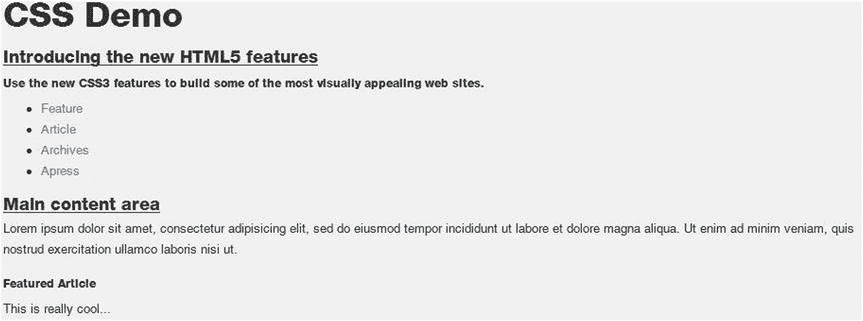
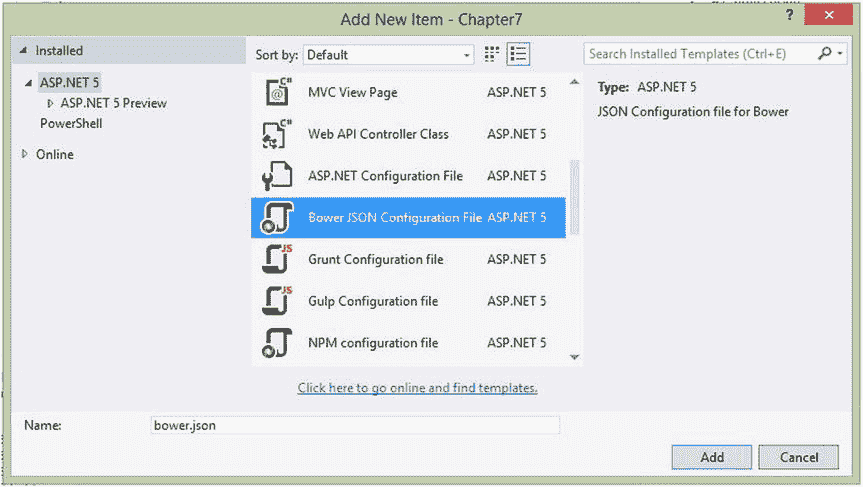
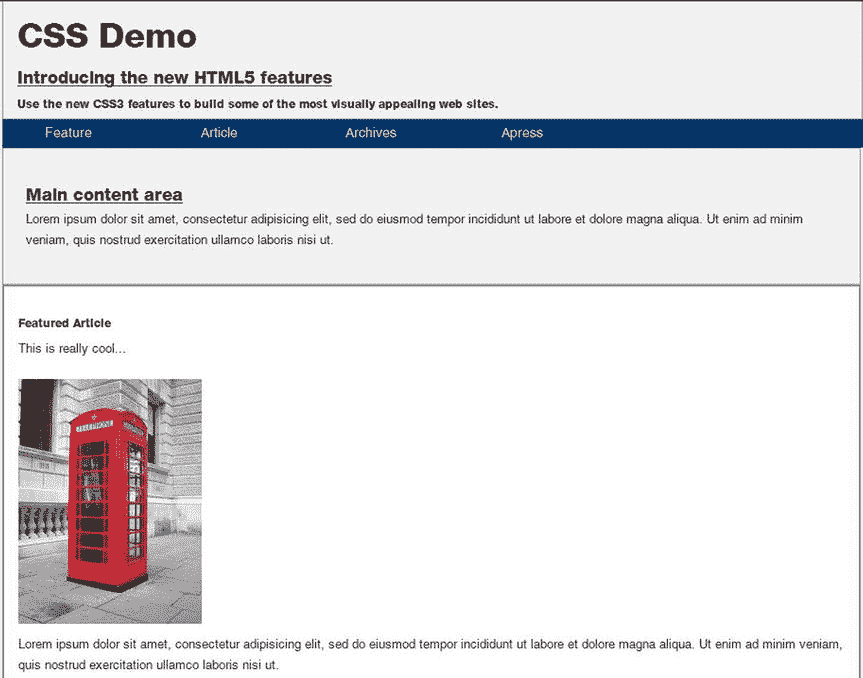
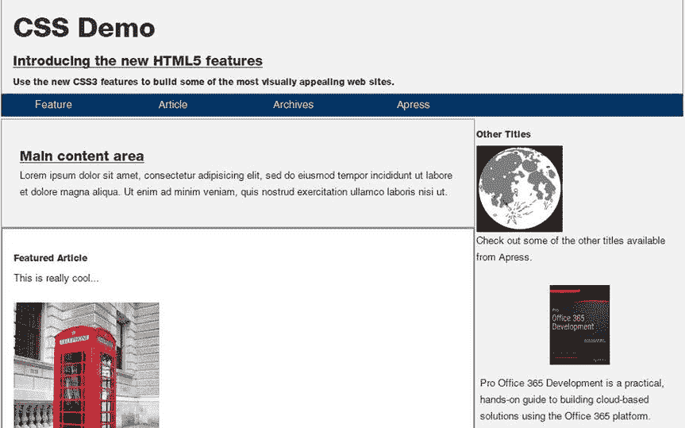
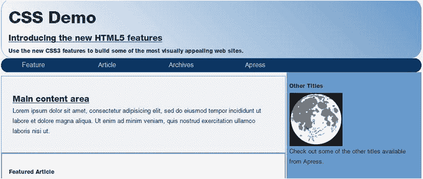
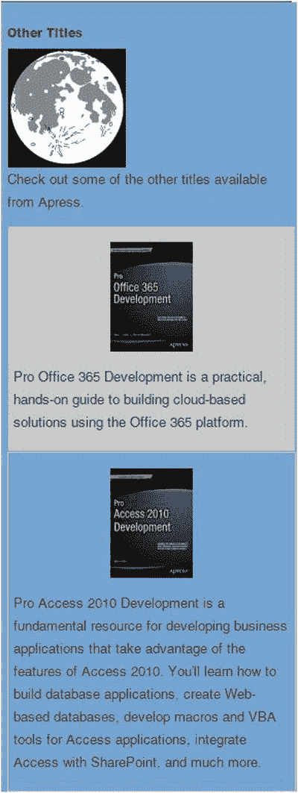
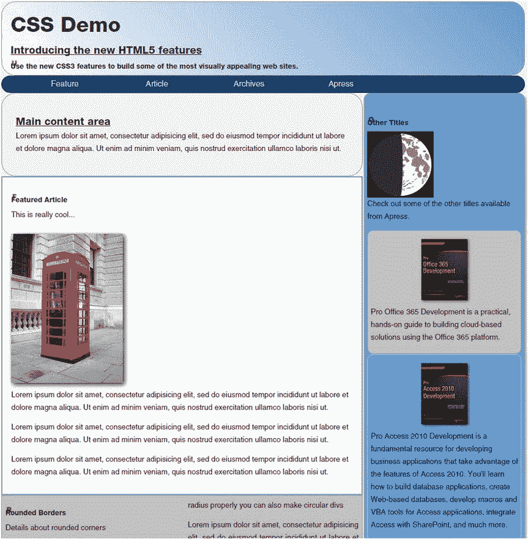

# 7.支持旧浏览器

现在你有了在第 4 章中创建的这个漂亮的、符合 HTML5 的网页。你想炫耀它，所以你给一个碰巧还在使用 IE 8 的同事发了一个链接，他们看到了类似图 [7-1](#Fig1) 的东西。

图 7-1。

The CSS demo as shown in IE 8

这个页面看起来很糟糕，一点也不像你所期待的。你肯定不会因此获得任何奖项。不要被吓到，你把链接发给你的老板，事情变得更糟。你的老板正在使用 IE 7，看到类似图 [7-2](#Fig2) 的东西。

图 7-2。

The CSS demo as shown in IE 7

侧边栏不再在边上，而是被钉在页面的底部。你的老板开始想知道你在业余时间都做了些什么。你刚从惨痛的教训中学到了两个重要的教训。

*   始终控制您的演示环境；在这种情况下，让他们在您的浏览器上看到该页面。
*   更重要的是，在几种不同的浏览器上测试你的网站。

在这一章中，我将向你展示一些相当简单的技术，让你的页面即使在老版本的浏览器上看起来也是最好的。您不必编写太多代码，因为有许多开源代码，您可以轻松地将它们添加到您的站点中。

## 做一些简单的改变

有几个非常简单的改变会让网页看起来更好。您将从这些开始，稍后我将向您展示一些更复杂的解决方案。

### 模拟旧浏览器

要使用一些旧版本的 Internet Explorer 测试您的网页，您将在模拟器模式下使用 IE 11。启动 Internet Explorer 后，按 F12 显示开发人员工具窗格。默认情况下，浏览器会使用“edge”模式，这是最新版本。要改变这一点，点击边缘下拉菜单，如图 [7-3](#Fig3) 所示。

图 7-3。

Modifying the emulation mode

对于本章，使用你在[第四章](04.html) (Visual Studio 版本)中创建的同一个项目，你可以从 [`www.apress.com`](http://www.apress.com/) 下载。

### 使用 Modernizr

当支持旧的浏览器时，您应该做的第一件事是使用 Modernizr 开源 JavaScript 库。这个库执行两个基本功能。

*   检测当前浏览器的可用功能，并将此信息作为可查询属性提供。例如，在您的 JavaScript 中，您可以像这样放置条件逻辑:

`if (!Modernizr.cssanimations) {`

`alert("Your browser does not support CSS animation");`

`}`

*   提供垫片来实现缺失的功能。这包括 html5shim 库，它允许您使用新元素，如`header`、`footer`、`nav`和`aside`，对内容进行样式化。

Tip

欲了解更多信息，请访问 Modernizr 网站 [`http://modernizr.com`](http://modernizr.com/) 。

因此，让我们将 Modernizr 库添加到您的页面中，看看会发生什么！在第 5 章中，我简要解释了作为客户端包管理器的 Bower 工具。现在，您将看到它的实际应用。因为这个项目是使用空模板创建的，所以您需要安装 Bower。从工具菜单转到 NuGet PackageManager。在搜索框中输入鲍尔，选择鲍尔，如图 [7-4](#Fig4) 所示。单击安装按钮开始安装。

图 7-4。

Adding Bower to the project

现在您还需要创建`bower.json`文件。从解决方案浏览器中，右键单击[第 7 章](07.html)项目，并选择 Add 和 New Item 链接。选择 Bower JSON 配置文件选项，如图 [7-5](#Fig5) 所示。文件名应该默认为`bower.json`。

图 7-5。

Adding the bower.json file.

在以下代码中添加粗体显示的行:

`{`

`"name": "Chapter`[`7`](07.html)T2】

`"private": true,`

`"dependencies": {`

`"modernizr": "2.8.3"`

`}`

Tip

正如我在第五章中解释的，当你编辑这个文件时，Visual Studio 提供了智能感知。从列表中选择`modernizr`并输入冒号后，将显示当前版本。截至本文撰写之时，它是 2.8.3。您应该使用 IntelliSense 显示的最新版本。

您可以安装 Grunt 或 Gulp，并设置一个任务来自动更新 Modernizr 文件，并将其复制到`wwwroot`文件夹中。为简单起见，您将手动执行此操作。在 Solution Explorer 中，展开`Dependencies`文件夹并右键单击 Bower 项。选择恢复包链接。这将强制下载最新版本。

在 Solution Explorer 中，右键单击`wwwroot`文件夹，选择 Add 和 New Item 链接，并输入名称 lib。然后右键单击`Dependencies\Bower`文件夹中的 modernizr 项，并选择在文件浏览器中打开链接。这将在此位置打开 Windows 资源管理器。你应该看到一个`modernizr.js`文件；将它复制到解决方案资源管理器中的`wwwroot\lib`文件夹。

现在安装了 Modernizr，您可以在页面中包含 Modernizer 库，方法是将它添加到您的`Index.html`文件的顶部，就在`DOCTYPE`标签之后:

``

使用 Internet Explorer 显示页面；然后转到开发者工具窗格，将浏览器模式更改为 IE 7，就像我前面解释的那样。你的页面应该如图 7-6 所示。

图 7-6。

The demo page with Modernizr as viewed in IE 7

请注意，现在显示了边框和背景颜色，这大大有助于使页面看起来像最初设计的那样。此外，导航链接是水平排列的。

Note

垫片是一种薄的物体，通常由木头制成，用于填充两个物体之间的间隙。在这种情况下，该术语指的是填补浏览器当前功能和完整 HTML5 规范之间空白的相对较小的一段代码。术语 shim 已经在软件开发界使用了很长时间。引入术语 polyfill 是为了指代与浏览器相关的填充。因此，在这种情况下，这两个术语是同义的。

## 添加更多聚合填充

现在你可能开始感觉好一点了。通过添加 Modernizr，页面看起来不错。但是，经过仔细检查，有一个相当长的功能列表不起作用，包括以下内容:

*   桌子
*   圆角
*   渐变背景填充
*   条纹物品
*   动画
*   3D 转换
*   多列

如果有足够的耐心和毅力(当然，还有时间)，你可能会实现所有这些功能，这样你的页面在 IE 7 和最新版本的 Chrome 上都是一样的。但是，我不建议你这么做。本质上，你应该确保你的页面在最新的 HTML5 兼容浏览器上运行良好，并且在旧的浏览器上运行良好。它不需要在每个浏览器上都运行良好。请考虑以下几点:

*   大多数用户不会在多种浏览器上浏览你的网站，并比较每种浏览器的体验。您的页面不需要在每个浏览器中看起来都一样。
*   如果有人正在使用 IE 7，他们已经习惯了难看的网站。实现其中的几个聚合填充可能会让你的页面成为他们访问过的最好的站点之一。
*   HTML5 应该让你作为 web 开发人员的工作更容易。然而，如果你试图让每一页都像旧浏览器上的原生 HTML5 一样工作，你将花费更多的时间，而不是更少。

对于您的页面使用的、通常使用的浏览器本身不支持的每个功能，您有以下选项:

*   失败:简单地显示一个错误，说明该浏览器不支持必要的功能，并提供一些建议使用的浏览器。例如，您在第 5 章中创建的示例站点的主要目的是演示如何使用 web workers。如果网页是用不支持 web workers 的浏览器浏览的，那么让网页正常工作就没有意义了。失败就好！
*   Polyfill:实现替代解决方案以提供所需的功能。这可以是简单的解决方案，也可以是相当复杂的。例如，如果不支持渐变填充，您可以只使用纯色填充，或者您可以提供一个填充并使用 JavaScript 实现渐变。
*   忽略:只保留未实现的特性。例如，您可以忽略圆角；在旧的浏览器中，它们会是方形的角。

这里没有硬性规定；你需要根据具体情况来决定哪些功能对你来说是重要的，以及你愿意花多少时间让它们在老版本的浏览器上工作。在本章的其余部分，我将演示一些技术，使用公开可用的开源垫片来回填这些特性。然而，我不想给你留下这样的印象，你必须回填每一个特性。事实上，这个演示中的几个特性，包括多列支持、3D 转换和动画都将被忽略，因为它们相对来说比较难或者不那么重要。

Tip

有过多的垫片和多孔填料可供选择。如果你正在寻找一些特定的东西，这篇文章提供了一个很好的参考: [`https://github.com/Modernizr/Modernizr/wiki/HTML5-Cross-Browser-Polyfills`](https://github.com/Modernizr/Modernizr/wiki/HTML5-Cross-Browser-Polyfills) 。请记住，这些可能并不总是正常工作，所以测试他们，并保持什么工作。此外，组合各种垫片可以创建一些有趣的结果，因为一个垫片的副作用可以破坏另一个垫片。

### 显示表格

当你在几个浏览器中测试你的页面时，注意那些不能正常工作的特性，然后确定它们的优先级。在这种情况下，`aside`元素应该在主要内容的旁边，而不是在页面的末尾。我认为，这是最关键的问题，因此应该首先解决。

Tip

IE 8 首先支持表格。如果你把浏览器模式改成 IE 8，你会看到侧边栏就在主要内容旁边。所以，表格支持只是 IE 7 和更老版本的问题。你可能会考虑简单地忽略这个问题，并解释说你的网站在 IE 8 和更新的版本上工作得最好。要想知道有多少用户会受到影响，请查看最新浏览器在 [`www.w3schools.com/browsers/browsers_stats.asp`](http://www.w3schools.com/browsers/browsers_stats.asp) 的统计数据。根据这些统计数据，这仅占正在使用的浏览器总数的 0.1%。这些统计数据代表总体使用情况；您可能有特定的目标受众，他们可能有不同的特征。

为了支持 IE 7 中的表格，您将使用行为 CSS 扩展，它允许您在样式表中嵌入 JavaScript。通过添加如下规则来调用扩展:

`header`

`{`

`behavior: url(customBehavior.htc);`

`}`

该实现在扩展名为`.htc`的 HTML 组件(HTC)文件中提供。有一些关于使用`.htc`文件的事情你应该知道。

*   通常，您可以在浏览器中打开 HTML 文件，而无需使用 IIS。例如，您可以简单地用 Internet Explorer(或任何浏览器)打开`Index.html`文件，页面就会正常工作。但是，如果页面实际上不是由 web 服务器(如 IIS 或 Apache)提供的，则`.htc`文件会被忽略。
*   您可能需要在 web 服务器上定义 HTC 内容类型。默认情况下，IIS 和 IIS Express 都支持这一功能，但是您可能需要在 Apache 或其他 web 服务器上添加这一功能。
*   尽管通常在 CSS 文件中引用`.htc`文件，但是在`behavior`属性中指定的 URL 必须相对于调用样式表的 HTML 文档的位置。如果你把`.htc`文件放在`css`文件夹中(和所有其他样式表一起)，你需要用一个相对路径`css/customBehavior.htc`来引用它。

为了显示表格，您将使用可以从 [`http://tanalin.com/en/projects/display-table-htc`](http://tanalin.com/en/projects/display-table-htc) 下载的开源 HTC。

EXERCISE 7-1\. SUPPORTING TABLESIn the Solution Explorer, right-click the `wwwroot` folder and select the Add and New Folder links. Enter the name css.   Download the latest `.zip` file from this site: [`http://tanalin.com/en/projects/display-table-htc`](http://tanalin.com/en/projects/display-table-htc) . (The latest file as of this writing is `display-table.htc_2011-11-25.zip`.) This file contains an uncompressed and a minimized version. Copy the `display-table.htc` file to the `css` folder in the Solution Explorer.   Open the `Index.html` and find the portion where the table is defined. Add the code shown in bold from Listing [7-1](#FPar7) to the existing style rules. This specifies a vendor-prefixed version of the `display` attribute and invokes the `display-table.htc` component.   Listing 7-1\. Defining a New Table

`/* Setup a table for the content and sidebar */`

`#contentArea`

`{`

`display: table;`

`-dt-display: table;`

`behavior: url(css/display-table.htc);`

`}`

`#mainContent`

`{`

`display: table-cell;`

`-dt-display: table-cell;`

`padding-right: 2px;`

`behavior: url(css/display-table.htc);`

`}`

`aside`

`{`

`display: table-cell;`

`-dt-display: table-cell;`

`width: 280px;`

`behavior: url(css/display-table.htc);`

`}`

Save your changes and view the `Index.html` page in Internet Explorer. Change the emulator mode to IE 7, and you should now see a table set up, as shown in Figure [7-7](#Fig7).

图 7-7。

The table support added in IE 7   Note

`display-table.htc`文件使用自己的、非标准的、特定于供应商的前缀。因此，您需要添加`–dt-display`属性。您也可以忽略因此而产生的警告。

Now there’s one more thing that needs to be fixed. You’ll notice that the `aside` element is missing some styles such as `background-color` and `padding`. This is a side effect of the CSS extension. To create the table in your page, this code created real table elements for you such as `tr` and `td`. So, once the JavaScript runs, the `aside` element is removed and replaced with rows and cells. Since there is no `aside` element anymore, you can’t use an element selector to style it. However, there is only one `aside` element in your source document, and it has the sidebar `id` attribute.   Close the browser.   Replace all `aside` selectors with `#sidebar`, including the one you just added. There are several places in the `Index.html` file that you’ll need to change.   View the page again and change the emulator mode to IE 7\. The sidebar should now have a background color, and there is also padding around the text.  

### 添加圆角

如果浏览器不支持圆角，您可以通过 Dave Methvin 编写的 jQuery 插件轻松添加圆角。除了圆角，该插件还可以创建许多其他图案，这些图案显示在 [`http://jquery.malsup.com/corner`](http://jquery.malsup.com/corner) 处。这是通过开源许可证提供的，因此您可以免费下载并在您的应用程序中使用它。

您将使用这个插件来实现`nav`和`footer`元素的圆角。但是，只有在圆角本身不受支持的情况下，才应该这样做。所以，第一个问题是，如何知道浏览器是否支持圆角？答案还是现代化。添加这样的语句将有条件地调用自定义方法:

`if (!Modernizr.borderradius)`

Tip

在本章的后面，我将向你展示另一种圆角技术。

EXERCISE 7-2\. ADDING ROUNDED CORNERSGo to [`http://jquery.malsup.com/corner`](http://jquery.malsup.com/corner) . Click the jquery.corner.js link near the top of the page. This will download the latest version. Save the file in your `wwwroot\lib` folder in the Solution Explorer.  

注意，这个插件不能通过 Bower 获得，所以您需要以传统的方式下载并安装它。

This function is based on jQuery, so you’ll also need to reference that in your page. Open the `bower.json` file and add the lines shown in bold (don’t forget to add the comma at the end of the previous line).  

`{`

`"name": "Chapter`[`7`](07.html)T2】

`"private": true,`

`"dependencies": {`

`"modernizr": "2.8.3"` `,`

`"jquery": "2.1.4",`

`"jquery-validation-unobtrusive": "3.2.2"`

`}`

`}`

After saving the `bower.json` file, you should see a jquery item in the `Dependencies\Bower` folder. Like you did for Modernizr, right-click the jquery item and select the Open in File Explorer link. Go to the dist subfolder and copy the `jquery.js` file to the `wwwroot\lib` folder in the Solution Explorer.   In the same way, copy the `jquery.validation.unobtrusive.js` file to the `wwwroot\lib` folder.   Open the `Index.html` file and add these references near the top of the page, just after the Modernizr script:  

``

``

Now invoke this by adding this `script` element at the end of the `Index.html` file, after the footer element and just before the body closing tag.  

``

This code uses the jQuery selector to find the `nav` and `footer` elements and calls the `corner()` method specifying the radius.   Save your changes and view the page using Internet Explorer. Switch the emulator mode to IE 7, and your page should look like Figure [7-8](#Fig8).

图 7-8。

The demo page with rounded corners  

### 添加渐变

接下来，您将使用 PIE(progressive Internet Explorer)的另一个开源解决方案向 intro 部分添加渐变背景。这是作为 HTC 文件实现的，就像您之前添加的表支持一样。一旦下载了组件，只需使用样式表规则的 behavior 属性调用它。

EXERCISE 7-3\. ADDING BACKGROUND GRADIENTSGo to the [`http://css3pie.com`](http://css3pie.com/) site and click the Download button. This will download a `PIE-1.0.0.zip` file (you may see a different version number; just download the latest version).   There are several files inside this `.zip` file. Copy the `PIE.htc` file to your `wwwroot\css` folder.   From Solution Explorer, right-click the `wwwroot\css` folder and click the Add and Existing Item links. Navigate to the `css` folder and select the `PIE.htc` file.   Open the `Index.html` file and find where the rules for the .`intro` class are defined. Add the following lines shown in bold. This code will add another vendor-prefixed attribute (`-pie-`) and then invoke the PIE component using the `behavior` property.  

`/* Gradients */`

`.intro`

`{`

`border: 1px solid #999999;`

`text-align:left;`

`margin-top: 6px;`

`padding-left: 15px;`

`border-radius:25px;`

`background-image: linear-gradient(45deg, #ffffff, #6699cc);`

`-pie-background: linear-gradient(45deg, #ffffff, #6699cc);`

`behavior: url(css/PIE.htc);`

`}`

Save your changes, view the page using Internet Explorer, and switch the emulator mode to IE 7\. You should now have a linear gradient that looks just like the native gradient. You might have also noticed that the corners are rounded as well. The `PIE.htc` shim also supports rounded corners and took care of that for you.   Note

PIE 旨在回填几个 CSS3 特性，本文列举了: [`http://css3pie.com/documentation/supported-css3-features`](http://css3pie.com/documentation/supported-css3-features) 。它将尝试处理引用`PIE.htc`垫片的元素中包含的任何这些特性。但是，它不会对本机支持的功能做任何事情。

该页面现在应该如图 [7-9](#Fig9) 所示。

图 7-9。

The demo page with a gradient background

### 将书单分条

回想一下第 4 章中的[，图书列表是使用`:nth-child`选择器设计的，所以交替的元素会有不同的背景。在不支持这一功能的旧浏览器中，您可以用传统的方式来实现，即在 JavaScript 中迭代列表，并改变交替元素的样式。](04.html)

然而，关键在于确定`:nth-child`选择器是否可用，因为 Modernizr 不提供这个功能。在撰写本文时，Modernizr 正在开发包含这一功能的版本 3 beta。更多详情，请查看 [`http://v3.modernizr.com/download`](http://v3.modernizr.com/download) 的功能列表。

Note

这里提供的解决方案基于 Lea Verou 的一篇文章。然而，我不得不调整它以适应 IE。更多详情，请查看 [`http://lea.verou.me/2011/07/detecting-css-selectors-support-my-jsconf-eu-talk/`](http://lea.verou.me/2011/07/detecting-css-selectors-support-my-jsconf-eu-talk/) 的文章。

EXERCISE 7-4\. STRIPING THE BOOK LISTOpen the `Index.html` file and add the following code to the `script` element at the top of the file:  

`function supportsSelector(selector) {`

`var el = document.createElement('div');`

`el.innerHTML = ['­', ''].join('');`

`try`

`{`

`el = document.body.appendChild(el);`

`var style = el.getElementsByTagName('style')[0],`

`ret = !!(style.sheet.rules || style.sheet.cssRules)[0];`

`}`

`catch(e){`

`ret = false;`

`}`

`document.body.removeChild(el);`

`return ret;`

`}`

This code creates a new `style` element and adds the selector in question. It then checks to see whether it is actually there. If not, the selector is not supported. This is done in a `try/catch` block in case older browsers do not support either the `style.sheet.rules` or `style.sheet.cssRules` property.   Now with your handy `supportsSelector()` function, you can implement the manual striping technique. Add the following code to the `script` element at the bottom of the file after the existing function you added for the rounded corners:  

`if (!supportsSelector(":nth-child(2n+0)")) {`

`var titles = document.getElementById("titles");`

`var articles = titles.getElementsByTagName("article");`

`for (var i = 0; i < articles.length; i++) {`

`var title = articles[i];`

`if (i % 2) {`

`title.style.background = "#6699cc";`

`title.style.border = "1px solid #c0c0c0";`

`}`

`else {`

`title.style.background = "#c0c0c0";`

`title.style.``bor`T2】

`}`

`}`

`}`

If the `:nth-child` selector is not supported, this code gets the `#titles` element using the `getElementById()` function. This is the `section` element that contains a series of `article` elements, one for each book. It then gets an array of child `article` elements using the `getElementsByTagName()` function. Note that this method is invoked on the `titles` object and not the `document` object. Once it has the array of elements, the code simply iterates the array, modifying the `background` and `border` properties.   Save your changes and view the page using the IE 7 emulation mode. The page should look like Figure [7-10](#Fig10).

图 7-10。

The aside element with manual striping  

## 隐藏不支持的元素

正如本章前面所述，对于每一个不支持的特性，你需要决定这是否是一个交易破坏者，页面是否需要失败，你是否想要填充这个特性，或者你是否想要在旧的浏览器上忽略它。从最初的不支持的更改列表中，还有三项您尚未实现:

*   CSS 动画
*   3D 转换
*   多列

您可以通过使用 JavaScript 在计时器到期时改变背景图像来轻松实现动画。在我们有 CSS 动画之前，这是通常的做法。然而，在旧的浏览器中实现 3D 变换是行不通的。我认为这两个功能都很好，但是不值得这么麻烦，所以如果浏览器不支持这些功能，我们就把它们去掉。

最好模仿的一个特性是多列支持。对此有垫片可用，如 GitHub 提供的这种: [`https://github.com/gryzzly/CSS-Multi-column-Layout-Module-Polyfill/blob/master/index.html`](https://github.com/gryzzly/CSS-Multi-column-Layout-Module-Polyfill/blob/master/index.html) 。也许有足够的时间和耐心，你可以得到一些工作，但这是其中一个艰难的决定。值得努力吗？在某些特殊的情况下，可能是这样，但是一般来说，你不应该把 80%的时间花在一个只会影响百分之几的预期观众的功能上。

但是，您应该考虑的一件事是隐藏没有功能的元素。例如，月亮的静态图片不是很有趣，所以您将通过将其大小设置为 0 来隐藏该元素。

EXERCISE 7-5\. HIDING ELEMENTSAdd the following code to the `script` element at the bottom of the `Index.html` file:  

`if (!Modernizr.cssanimations) {`

`document.getElementById("moon").style.width = "0px";`

`document.getElementById("moon").style.height = "0px";`

`}`

Finally, after all this work, you should try the page in a browser that supports all these features to make sure it still looks great there. The final version in Chrome should look like Figure [7-12](#Fig12).

图 7-12。

The final demo page  as shown in Chrome   This code simply shrinks the moon `div` if CSS animations are not supported. View the page in Internet Explorer and switch the emulator mode to IE 7\. The final web page should look like Figure [7-11](#Fig11).

图 7-11。

The final demo page as shown in IE7   Tip

源代码下载包含完整的`Index.html`文件。如果对具体应该如何或在哪里进行更改有任何疑问，请参考本指南。

## 摘要

在这一章中，我向你展示了一些让你的网页看起来很棒的技巧，即使是在不支持 HTML5 新特性的旧浏览器上。这些技术包括以下内容:

*   使用 Modernizr 进行特性检测和基本元素支持
*   显示表格
*   添加圆角
*   支持渐变背景图像
*   手动条带化列表
*   隐藏不支持的元素

对于每个不受支持的功能，您需要确定以下事项:

*   该特性是否对页面至关重要(如果是，页面应该失败)
*   该特征是否容易聚合填充
*   该功能是否可以忽略

这是一种平衡行为，因为您希望页面在所有浏览器中都很好看，但又不想花费过多的时间来支持每种可能的浏览器。

演示页面的最终实现达成了一个很好的妥协。该网站看起来很棒，功能正常。虽然省略了一些新的 HTML5 功能，但考虑到浏览器支持，总体来说它仍然是一个很好的网站，额外的工作也很少。

在下一章，我将向你展示如何使用 HTML5 中引入的新的`audio`和`video e`元素。