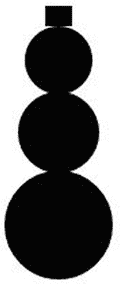
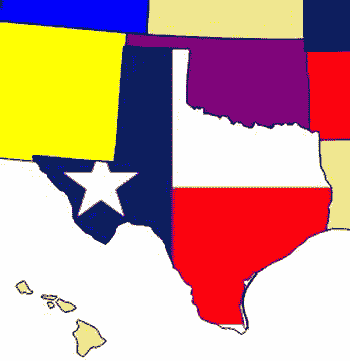
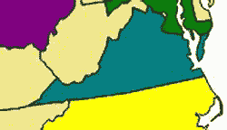

# 9.可缩放矢量图形

在这一章中，我将向你展示如何使用 Visual Studio、ASP.NET MVC 和 SQL Server 在 HTML5 web 应用中使用可缩放矢量图形(SVG)。使用 SVG 可以做很多非常酷的事情。我挑选了一个有趣的演示，可以很容易地应用于许多业务应用。但是首先，让我给你介绍一下什么是 SVG。

大多数人认为图形元素是某种形式的位图，由像素的行和列组成，每个像素都分配有特定的颜色。然而，相比之下，矢量图形将图像表示为公式的集合。例如，画一个圆心在点 x，y，半径为 r 的圆。更复杂的图像被定义为图形元素的集合，包括圆、线和路径。虽然渲染引擎将最终确定需要设置的特定像素，但图像定义是基于公式的。这一根本区别为使用矢量图形提供了两个显著的优势。

首先，顾名思义，矢量图形是可缩放的。如果您想要扩大图像的大小，渲染引擎只需根据新的大小重新计算公式，不会损失清晰度。如果你放大位图图像，你会很快看到颗粒感，图像变得模糊。

第二，图像中的每个元素都可以独立操作。例如，如果图像中有几个圆圈，您可以通过简单地改变该图像的颜色来突出显示其中一个。由于矢量图形是基于公式的，您可以轻松地调整公式来修改图像。特别有用的是，这些元素可以使用 CSS 样式化，使用我在第 4 章中展示的强大的选择器和格式化功能。

## SVG 简介

首先，您将创建一个使用简单几何形状来绘制图片的页面。然后，您将使用 CSS 对这些形状应用样式。我将向您展示如何将这些标记元素保存在一个`.svg`图像文件中。该图像文件可以像其他图像文件一样使用，例如。`jpg`和。`png`文件。

### 创建示例项目

您首先需要创建一个 Visual Studio 项目。这将使用与您在前面章节中使用的不同的项目模板。对于本章中的一个练习，您需要连接到 SQL Server 数据库。您将使用网站模板，而不是手动连接，它会为您完成大部分工作。

EXERCISE 9-1\. CREATING THE VISUAL STUDIO PROJECTStart Visual Studio 2015\. In the Start Page, click the New Project link.   In the New project dialog box, select the ASP.NET Web Application template. Enter the project name Chapter [9](09.html) and select a location for this project.   In the next dialog box, select the ASP.NET 5 Web Site template and make sure the “Host in the cloud” check box is not selected. Click the OK button, and the project will be created (this may take a minute).   Right-click the `Views\Home` folder and click the Add and New Item links. In the Add New Item dialog box, select the MVC View Page template, enter the name Snowman.cshtml, and click the Add button.  

### 添加一些简单的形状

为了演示`svg`元素是如何工作的，您将添加一些简单的形状，如圆形、矩形和线条。正如我将在这里演示的，大多数图像可以表示为几何形状的集合。

EXERCISE 9-2\. ADDING A SNOWMANReplace the initial contents of the `Snowman.cshtml` file with the following:   `<svg xmlns:svg="` [`http://www.w3.org/2000/svg`](http://www.w3.org/2000/svg) `" version="1.2"`        `width="100px" height="230px"`        `xmlns="` [`http://www.w3.org/2000/svg`](http://www.w3.org/2000/svg) `"`        `xmlns:xlink="` [`http://www.w3.org/1999/xlink`](http://www.w3.org/1999/xlink) `">`   `</svg>`  

注意`width`和`height`属性定义了元素的内在维度。在 IE 9 中，你可以省略这些，页面会根据实际使用的空间正确显示。对于其他浏览器，如果没有指定`width`和`height`，图像将被裁剪为某个默认大小。

Inside the `svg` element, add the following elements. These are just simple shapes, mostly `circle` elements with a rectangle (`rect`), `line`, and `polygon`.   `<circle class="body" cx="50" cy="171" r="40" />`   `<circle class="body" cx="50" cy="103" r="30" />`   `<circle class="body" cx="50" cy="50" r="25" />`   `<line class="hat" x1="30" y1="25" x2="70" y2="25" />`   `<rect class="hat" x="40" y="10" width="20" height="15" />`   `<circle class="button" cx="50" cy="82" r="4" />`   `<circle class="button" cx="50" cy="100" r="4" />`   `<circle class="button" cx="50" cy="118" r="4" />`   `<circle class="eye" cx="42" cy="42" r="4" />`   `<circle class="eye" cx="58" cy="42" r="4" />`   `<polygon class="nose" points="45,60 45,50 60,55" />` A `circle` is expressed as a center point, `cx` and `cy`, and a radius, `r`. A `line` is specified as a beginning point, `x1` and `y1`, and an endpoint, `x2` and `y2`. A rectangle (`rect`) element is described by the top-left corner location, `x` and `y`, a `width`, and a `height`. A `polygon` is defined by a set of points in the form of `x1,y1 x2,y2 x3,y3`. You can specify any number of points. It is rendered by drawing a line segment between each of these points and a line segment from the last point, back to the first point.   Open the `HomeController.cs` file (in the `Controllers` folder) and add the following action. This will allow you to navigate to the new view.   `public IActionResult Snowman()`   `{`       `return View("∼/Views/Home/Snowman.cshtml");`   `}`   Save your changes and press F5 to view the application. To get to the new page, add `/Home/Snowman` to the URL. The page should look like Figure [9-1](#Fig1) (you will also see the ASP.NET default header and footer on your page).

图 9-1。

The initial SVG image without styling  

### 添加样式

这些元素的默认样式是纯黑色填充，并且因为这些形状中的一些在彼此之上，所以有几个当前是不可见的。请注意，您为每个元素分配了一个`class`属性。现在您将使用`class`属性为这些元素应用样式。将清单 [9-1](#FPar1) 中所示的代码添加到`svg`元素中，就在您之前添加的元素之前。

Listing 9-1\. Adding SVG Styles

``

保存这些更改并刷新浏览器以查看更新后的网页，该网页应如图 [9-2](#Fig2) 所示。

图 9-2。

The SVG images with styling applied

## 使用 SVG 图像文件

除了嵌入一个`svg`元素之外，您还可以用。svg 扩展。该文件可以像其他图形图像一样使用。我将向您展示如何创建一个独立的 SVG 图像，然后在页面上使用它。

### 创建 SVG 图像

我将首先向您展示如何创建一个独立的`.svg`文件，然后使用它作为背景图像。这也将展示 SVG 图像的可伸缩性。

EXERCISE 9-3\. CREATING AN SVG IMAGEFrom the `wwwroot\images` folder, click the New and File links. In the Add New Item dialog box, select Text File, enter the name snowman.svg, and click the Add button.   Enter the following markup instructions: `<?xml version="1.0" standalone="no"?>` `<!DOCTYPE svg PUBLIC "-//W3C//DTD SVG 1.2//EN"` `"` [`http://www.w3.org/Graphics/SVG/1.2/DTD/svg12.dtd`](http://www.w3.org/Graphics/SVG/1.2/DTD/svg12.dtd) `">`   Copy and paste the entire `svg` element from the `Snowman.cshtml` file, including the `style` element to the new text file.   Click the Save button.   To test your image, from Solution Explorer, right-click the `snowman.svg` file and click the “Open with” link. Then select Internet Explorer in the Open With dialog box. This should launch a browser and display the snowman image.  

### 使用 SVG 背景

现在您有了一个图像文件，可以像使用其他图像一样使用它。为了演示这一点，您将向页面添加一个`div`元素，并将`snowman.svg`文件用作背景图像。您还将调整`div`的大小，这样您就可以看到调整大小时图像的样子。

EXERCISE 9-4\. ADDING A BACKGROUND IMAGEIn the `Snowman.cshtml` file, add the following code after the `svg` element: `

`   This simply defines a `div` element. Now you’ll use CSS to configure it. Add the following `style` element before the `svg` element:   ``   Press F5 to debug your application. In addition to the small image, you should also see a larger version of your image, as shown in Figure [9-3](#Fig3). Notice that there is no loss of image quality when expanding the size of the image.

图 9-3。

The page with the snowman background  

## 创建交互式地图

绘制雪人的图片可能很有趣，但是让我们继续讨论 SVG 的一些更实际的用途。您将创建一个美国地图，每个州用一个单独的 SVG path 元素表示，我将在后面解释。您将在 SQL Server 数据库中存储路径定义。我将向您展示如何使用模型类访问数据库，然后使用视图定义显示它。一旦显示了地图，我将向您展示一些使用静态和动态样式来设置地图样式的 CSS 技巧。最后，您将添加一些动画来为您的 web 页面增添一点趣味。

### 使用路径元素

`path`元素是所有 SVG 元素中最通用的。它是“移动到”、“直线到”和各种“曲线到”命令的集合。该形状是按照路径命令绘制的。每个命令从当前位置开始，或者移动到新位置，或者绘制一条线到下一个位置。这里有一个例子:

*   移动到 25，50。
*   画一条线到 50，50。
*   画一条线到 50，25。
*   画一个弧线到 25，50。

这表示如下:

`<path d="M25,50 L50,50 L50,25 A25,25 0 0,0 25,50 z" />`

“移动到”和“行到”命令非常简单。“弧到”命令，以及所有其他曲线命令，更复杂，因为你需要提供额外的控制点，描述如何绘制曲线。每个命令使用一个字母，如表 [9-1](#Tab1) 所示。

表 9-1。

The Available Path Commands

<colgroup><col> <col> <col></colgroup> 
| 命令 | 缩写 | 描述 |
| --- | --- | --- |
| 移到 | M | 移动到指定位置 |
| 行到 | L | 在指定位置绘制一条线 |
| 水平线至 | H | 在指定的 x 坐标处画一条水平线 |
| 垂直线至 | V | 在指定的 y 坐标上画一条垂直线 |
| 弧形到 | A | 在指定位置绘制弧线 |
| 弯曲到 | C | 绘制三次贝塞尔曲线 |
| 速记曲线到 | S | 绘制简化的三次贝塞尔曲线 |
| 二次曲线到 | Q | 绘制二次贝塞尔曲线 |
| 速记二次曲线到 | T | 绘制简化的二次贝塞尔曲线 |
| 关闭路径 | Z | 通过在起始位置画一条线来闭合图形 |

对于这些命令中的每一个，当使用绝对坐标时，使用大写字母。您还可以指定相对坐标，并使用小写字母来表示这些值相对于当前位置。有关构造路径元素的更多信息，请参见文章 [`http://www.w3.org/TR/SVG/paths.html#PathData`](http://www.w3.org/TR/SVG/paths.html#PathData) 。

正如您可能想象的那样，绘制一个像阿拉斯加州这样的复杂形状需要很多命令。您不会想要手动编辑它。幸运的是，有工具可以帮助构建路径定义。例如，在 [`http://code.google.com/p/svg-edit`](http://code.google.com/p/svg-edit) 有一个免费的网络工具。笑一笑，列表 [9-2](#FPar2) 显示了阿拉斯加的`path`元素。

Listing 9-2\. The Path Element Definition for Alaska

`<path d="M 158.07671,453.67502 L 157.75339,539.03215 L 159.36999,540.00211 L 162.44156,540.16377 L 163.8965,539.03215 L 166.48308,539.03215 L 166.64475,541.94205 L 173.59618,548.73182 L 174.08117,551.3184 L 177.47605,549.37846 L 178.1227,549.2168 L 178.44602,546.14524 L 179.90096,544.52863 L 181.0326,544.36697 L 182.97253,542.91201 L 186.04409,545.01361 L 186.69074,547.92352 L 188.63067,549.05514 L 189.7623,551.48006 L 193.64218,553.25833 L 197.03706,559.2398 L 199.78529,563.11966 L 202.04855,565.86791 L 203.50351,569.58611 L 208.515,571.36439 L 213.68817,573.46598 L 214.65813,577.83084 L 215.14311,580.9024 L 214.17315,584.29729 L 212.39487,586.56054 L 210.77826,585.75224 L 209.32331,582.68067 L 206.57507,581.22573 L 204.7968,580.09409 L 203.98849,580.9024 L 205.44344,583.65065 L 205.6051,587.36885 L 204.47347,587.85383 L 202.53354,585.9139 L 200.43195,584.62061 L 200.91693,586.23722 L 202.21021,588.0155 L 201.40191,588.8238 C 201.40191,588.8238 200.59361,588.50048 200.10863,587.85383 C 199.62363,587.20719 198.00703,584.45895 198.00703,584.45895 L 197.03706,582.19569 C 197.03706,582.19569 196.71374,583.48898 196.06709,583.16565 C 195.42044,582.84233 194.7738,581.71071 194.7738,581.71071 L 196.55207,579.77077 L 195.09712,578.31582 L 195.09712,573.30432 L 194.28882,573.30432 L 193.48052,576.6992 L 192.34888,577.1842 L 191.37892,573.46598 L 190.73227,569.74777 L 189.92396,569.26279 L 190.24729,574.92094 L 190.24729,576.05256 L 188.79233,574.75928 L 185.23579,568.77781 L 183.13419,568.29283 L 182.48755,564.57462 L 180.87094,561.66472 L 179.25432,560.53308 L 179.25432,558.26983 L 181.35592,556.97654 L 180.87094,556.65322 L 178.28436,557.29986 L 174.88947,554.87495 L 172.30289,551.96504 L 167.45306,549.37846 L 163.41152,546.79188 L 164.70482,543.55866 L 164.70482,541.94205 L 162.92654,543.55866 L 160.01664,544.69029 L 156.29843,543.55866 L 150.64028,541.13375 L 145.14381,541.13375 L 144.49717,541.61873 L 138.03072,537.73885 L 135.92912,537.41553 L 133.18088,531.59573 L 129.62433,531.91905 L 126.06778,533.374 L 126.55277,537.90052 L 127.68439,534.99062 L 128.65437,535.31394 L 127.19941,539.67879 L 130.43263,536.93055 L 131.07928,538.54716 L 127.19941,542.91201 L 125.90612,542.58869 L 125.42114,540.64875 L 124.12785,539.84045 L 122.83456,540.97208 L 120.08632,539.19381 L 117.01475,541.29541 L 115.23649,543.397 L 111.8416,545.4986 L 107.15342,545.33693 L 106.66844,543.23534 L 110.38664,542.58869 L 110.38664,541.29541 L 108.12338,540.64875 L 109.09336,538.22384 L 111.35661,534.34397 L 111.35661,532.5657 L 111.51827,531.75739 L 115.88313,529.49413 L 116.85309,530.78742 L 119.60134,530.78742 L 118.30805,528.20085 L 114.58983,527.87752 L 109.57834,530.62576 L 107.15342,534.02064 L 105.37515,536.60723 L 104.24352,538.87049 L 100.04033,540.32543 L 96.96876,542.91201 L 96.645439,544.52863 L 98.908696,545.4986 L 99.717009,547.60018 L 96.96876,550.83341 L 90.502321,555.03661 L 82.742574,559.2398 L 80.640977,560.37142 L 75.306159,561.50306 L 69.971333,563.76631 L 71.749608,565.0596 L 70.294654,566.51455 L 69.809672,567.64618 L 67.061434,566.67621 L 63.828214,566.83787 L 63.019902,569.10113 L 62.049939,569.10113 L 62.37326,566.67621 L 58.816709,567.96951 L 55.90681,568.93947 L 52.511924,567.64618 L 49.602023,569.58611 L 46.368799,569.58611 L 44.267202,570.87941 L 42.65059,571.68771 L 40.548995,571.36439 L 37.962415,570.23276 L 35.699158,570.87941 L 34.729191,571.84937 L 33.112578,570.71775 L 33.112578,568.77781 L 36.184142,567.48452 L 42.488929,568.13117 L 46.853782,566.51455 L 48.955378,564.41296 L 51.86528,563.76631 L 53.643553,562.958 L 56.391794,563.11966 L 58.008406,564.41296 L 58.978369,564.08964 L 61.241626,561.3414 L 64.313196,560.37142 L 67.708076,559.72478 L 69.00137,559.40146 L 69.648012,559.88644 L 70.456324,559.88644 L 71.749608,556.16823 L 75.791141,554.71329 L 77.731077,550.99508 L 79.994336,546.46856 L 81.610951,545.01361 L 81.934272,542.42703 L 80.317657,543.72032 L 76.922764,544.36697 L 76.276122,541.94205 L 74.982838,541.61873 L 74.012865,542.58869 L 73.851205,545.4986 L 72.39625,545.33693 L 70.941306,539.51713 L 69.648012,540.81041 L 68.516388,540.32543 L 68.193068,538.3855 L 64.151535,538.54716``L``62.049939,539.67879 L 59.463361,539.35547 L 60.918305,537.90052 L 61.403286,535.31394 L 60.756645,533.374 L 62.211599,532.40404 L 63.504883,532.24238 L 62.858241,530.4641 L 62.858241,526.09925 L 61.888278,525.12928 L 61.079966,526.58423 L 54.936843,526.58423 L 53.481892,525.29094 L 52.835247,521.41108 L 50.733651,517.85452 L 50.733651,516.88456 L 52.835247,516.07625 L 52.996908,513.97465 L 54.128536,512.84303 L 53.320231,512.35805 L 52.026941,512.84303 L 50.895313,510.09479 L 51.86528,505.08328 L 56.391794,501.85007 L 58.978369,500.23345 L 60.918305,496.51525 L 63.666554,495.22195 L 66.253132,496.35359 L 66.576453,498.77851 L 69.00137,498.45517 L 72.23459,496.03026 L 73.851205,496.67691 L 74.821167,497.32355 L 76.437782,497.32355 L 78.701041,496.03026 L 79.509354,491.6654 C 79.509354,491.6654 79.832675,488.75551 80.479317,488.27052 C 81.125959,487.78554 81.44928,487.30056 81.44928,487.30056 L 80.317657,485.36062 L 77.731077,486.16893 L 74.497847,486.97723 L 72.557911,486.49225 L 69.00137,484.71397 L 63.989875,484.55231 L 60.433324,480.83411 L 60.918305,476.95424 L 61.564957,474.52932 L 59.463361,472.75105 L 57.523423,469.03283 L 58.008406,468.22453 L 64.798177,467.73955 L 66.899773,467.73955 L 67.869736,468.70951 L 68.516388,468.70951 L 68.354728,467.0929 L 72.23459,466.44626 L 74.821167,466.76958 L 76.276122,467.90121 L 74.821167,470.00281 L 74.336186,471.45775 L 77.084435,473.07437 L 82.095932,474.85264 L 83.874208,473.88268 L 81.610951,469.51783 L 80.640977,466.2846 L 81.610951,465.47629 L 78.21606,463.53636 L 77.731077,462.40472 L 78.21606,460.78812 L 77.407756,456.90825 L 74.497847,452.22007 L 72.072929,448.01688 L 74.982838,446.07694 L 78.21606,446.07694 L 79.994336,446.72359 L 84.197528,446.56193 L 87.915733,443.00539 L 89.047366,439.93382 L 92.765578,437.5089 L 94.382182,438.47887 L 97.130421,437.83222 L 100.84863,435.73062 L 101.98027,435.56896 L 102.95023,436.37728 L 107.47674,436.21561 L 110.22498,433.14405 L 111.35661,433.14405 L 114.91316,435.56896 L 116.85309,437.67056 L 116.36811,438.80219 L 117.01475,439.93382 L 118.63137,438.31721 L 122.51124,438.64053 L 122.83456,442.35873 L 124.7745,443.81369 L 131.88759,444.46033 L 138.19238,448.66352 L 139.64732,447.69356 L 144.82049,450.28014 L 146.92208,449.6335 L 148.86202,448.82518 L 153.71185,450.76512 L 158.07671,453.67502 z M 42.973913,482.61238 L 45.075509,487.9472 L 44.913847,488.91717 L 42.003945,488.59384 L 40.225672,484.55231 L 38.447399,483.09737 L 36.02248,483.09737 L 35.86082,480.51078 L 37.639093,478.08586 L 38.770722,480.51078 L 40.225672,481.96573 L 42.973913,482.61238 z M 40.387333,516.07625 L 44.105542,516.88456 L 47.823749,517.85452 L 48.632056,518.8245 L 47.015444,522.5427 L 43.94388,522.38104 L 40.548995,518.8245 L 40.387333,516.07625 z M 19.694697,502.01173 L 20.826327,504.5983 L 21.957955,506.21492 L 20.826327,507.02322 L 18.72473,503.95166 L 18.72473,502.01173 L 19.694697,502.01173 z M 5.9534943,575.0826 L 9.3483796,572.81934 L 12.743265,571.84937 L 15.329845,572.17269 L 15.814828,573.7893 L 17.754763,574.27429 L 19.694697,572.33436 L 19.371375,570.71775 L 22.119616,570.0711 L 25.029518,572.65768 L 23.897889,574.43595 L 19.533037,575.56758 L 16.784795,575.0826 L 13.066588,573.95097 L 8.7017347,575.40592 L 7.0851227,575.72924 L 5.9534943,575.0826 z M 54.936843,570.55609 L 56.553455,572.49602 L 58.655048,570.87941 L 57.2001,569.58611 L 54.936843,570.55609 z M 57.846745,573.62764 L 58.978369,571.36439 L 61.079966,571.68771 L 60.271663,573.62764 L 57.846745,573.62764 z M 81.44928,571.68771 L 82.904234,573.46598 L 83.874208,572.33436 L 83.065895,570.39442 L 81.44928,571.68771 z M 90.17899,559.2398 L 91.310623,565.0596 L 94.220522,565.86791``L`T4】

Tip

该数据以及所有其他状态的数据都是从 [`http://en.wikipedia.org/wiki/File:Blank_US_Map.svg`](http://en.wikipedia.org/wiki/File:Blank_US_Map.svg) 下载的。去 [`http://commons.wikimedia.org`](http://commons.wikimedia.org/) ，在搜索条件中输入 svg map，可以找到很多类似的素材。

### 实现初始地图

您将从创建没有应用任何样式的初始地图开始。实际的路径元素将存储在 SQL 数据库中。您将创建数据库，添加一个`State`表，并存储路径定义。然后，您将使用实体框架创建一个模型来提供状态数据。最后，您将创建一个显示地图的新视图，然后提供一个访问它的链接。

#### 创建数据库

路径元素可能很长并且是静态的(阿拉斯加的形状不可能很快改变)，因此它们可以存储在数据库中并由检索。NET 来呈现页面。您使用的 MVC 项目模板已经为数据库连接进行了配置。您需要创建`State`表，并用适当的路径定义填充它。

EXERCISE 9-5\. CREATING THE STATE TABLEThe database used by .NET is not actually created until the first time it is accessed. The easiest way to create the database is to register yourself. Press F5 to debug the application. Click the Register link in the header and enter a username and password.   Once the registration is done, you can close the browser window, which will also stop the debugger.   Start SQL Server Management Studio (SSMS). In the Connect to Server dialog box, enter the server name as (LocalDB)\MSSQLLocalDB and use Windows authentication, as shown in Figure [9-4](#Fig4). Click the Connect button to open the database.

图 9-4。

Connecting to SQL Server   After connecting, you should see the database in Object Explorer, as shown in Figure [9-5](#Fig5).

图 9-5。

The database contents   If you don’t have SQL Server Management Studio, you can access the database through Visual Studio. From the View menu, click the SQL Server Object Explorer link. You can then navigate to your database, as shown in Figure [9-6](#Fig6).

图 9-6。

Selecting the Chapter[9](09.html) database   In the download that is available at [`www.apress.com`](http://www.apress.com/) , you’ll find a `States.sql` file in the Chapter[9](09.html) folder. Open this file in SSMS and click the Execute button. This will create the `State` table using the following script and then populate it with a record for each state:   `CREATE TABLE State(`       `Id int identity  NOT NULL,`       `StateCode nchar(10) NOT NULL,`       `StateName nvarchar(50) NOT NULL,`       `Path ntext NULL,`    `CONSTRAINT PK_State PRIMARY KEY CLUSTERED`   `(`       `Id ASC`   `)WITH (PAD_INDEX = OFF, STATISTICS_NORECOMPUTE = OFF, IGNORE_DUP_KEY = OFF,`     `ALLOW_ROW_LOCKS = ON, ALLOW_PAGE_LOCKS = ON) ON [PRIMARY]`   `) ON [PRIMARY] TEXTIMAGE_ON [PRIMARY]`   To verify the data was loaded correctly, open another query window using the New Query button. After connecting, select the Chapter[9](09.html) database and execute this query:   `select * from State`   You should see results similar to Figure [9-7](#Fig7).

图 9-7。

The contents of the State table   Tip

如果您使用的是 Visual Studio 而不是 SSMS，可以在服务器资源管理器中右键单击数据库，然后单击“新建查询”链接。然后在查询窗口中选择章节 [9](09.html) 数据库。

#### 创建模型

创建一个使用 SQL 表的模型是一项非常简单的任务。您将使用实体框架来创建一个模型类，该类提供指定表中的数据。

EXERCISE 9-6\. CREATING AN ENTITY FRAMEWORK MODELFrom Solution Explorer, right-click the `Models` folder and click the Add and New Item links. In the Add New Item dialog box, select the Class template and enter State.cs for the name.   Add the following `using` statements at the top of the file:   `using System.ComponentModel.DataAnnotations;`   `using Microsoft.Data.Entity;`   Add the following properties to the `State` class. These will map to the columns in the `State` table that you just created.   `[Key] public int Id { get; set; }`   `public string StateCode { get; set; }`   `public string StateName { get; set; }`   `public string Path { get; set; }`   Add the following class in this same `State.cs` file, after the `State` class definition. This class configures the Entity Framework so it can create a `State` class for each record in the `State` table.   `public class StateDbContext : ApplicationDbContext`   `{`       `public DbSet<State> States { get; set; }`       `protected override void OnConfiguring(DbContextOptionsBuilder options)`       `{`           `options.UseSqlServer(Startup.Configuration`               `.Get("Data:DefaultConnection:ConnectionString"));`           `base.OnConfiguring(options);`       `}`   `}`   Open the `Startup.cs` class and add the `static` attribute to the `Configuration` property, as shown here in bold:   `public` `static` `IConfiguration Configuration { get; set; }`   You now have a model that you can use to provide the state details for the map. Rebuild the project. This will make the model available for linking to a view.  

#### 创建地图视图

已经定义了一个模型，现在您将创建显示模型元素的视图。

EXERCISE 9-7\. CREATING THE MAP VIEWRight-click the `Views\Home` folder and click the Add and New Items links.   In the Add New Item dialog box, select the MVC View Page template, enter the name Map.cshtml, and click the Add button.   Replace the entire contents with the following. This will set up the view to use the `State` model and enable the code to access its properties.   `@model IEnumerable<` [`Chapter 9`](09.html) `.Models.State>`   `@using` [`Chapter 9`](09.html) `.Models`   Add the following code, which defines an `svg` element just like you did earlier. It then uses a `foreach` loop to create a `path` element for each `State` defined in the model. Notice that it is storing the `StateCode` column in the `id` attribute and the `StateName` column in the `class` attribute.   `<svg xmlns:svg="` [`http://www.w3.org/2000/svg`](http://www.w3.org/2000/svg) `" version="1.2"`        `width="959" height="593" id="map">`       `@foreach (State s in Model)`       `{`           `<path id="@s.StateCode.Trim()" class="@s.StateName.Trim()"      d="@s.Path" />`       `}`   `</svg>`   Now you’ll need to implement a controller action that will display the map view. Open the `HomeController.cs` class and add the following namespace:   `using Chapter` [`9`](09.html) `.Models;`   Then add the following method to the `HomeController` class. This executes a query to extract all the records from the `State` table and provide it to the view.   `public ActionResult Map()`   `{`       `StateDbContext DC = new StateDbContext();`       `var states = from s in DC.States select s;`       `return View(states);`   `}`   Now you’ll add a link that will display the map page. Go to the `_Layout.cshtml` file in the `Views\Shared` folder and add the following line after the existing `asp-action` statements:   `<li><a asp-controller="Home" asp-action="Map">Map</a></li>`   Press F5 to build and run the application. Click the Map link. You should see a map of the United States, and all of the states are filled with the default color (black).  

## 设置状态元素的样式

现在所有的机械工作都完成了，你可以享受一下设计`path`元素的乐趣。正如我前面用雪人图像演示的那样，每个元素都可以使用特殊的样式表进行样式化。您还可以使用 JavaScript 动态地设计它们的样式。我将向您展示如何使用纯色填充、渐变和背景图像来格式化每个元素。

### 使用基本填充颜色

Note

在这一章中，你将使用不同的颜色来设计不同的状态。在本书的印刷版本中，其中一些颜色在转换为灰度时可能显示不佳。您可能希望完成练习或下载项目，以查看应用样式的结果。

您将从添加一些简单的填充规则开始。使用一个简单的元素选择器，将`stroke`颜色设置为黑色，将`fill`颜色设置为卡其色。然后，为了增加一些变化并演示如何使用属性选择器，您将根据州代码更改填充颜色。`id`属性包含两个字母的州代码，`class`属性包含州名。使用`id`属性的第一个字母，你将如下设置填充颜色:

*   甲:红色
*   n:黄色
*   男:绿色
*   姜敏赫
*   奥:紫色
*   I:橙色

在`foreach`循环之前的`svg`元素内输入清单 [9-3](#FPar4) 中所示的`style`元素。

Listing 9-3\. Adding Basic Fill Definitions

``

刷新你的浏览器，地图现在应该看起来如图 [9-8](#Fig8) 所示。

图 9-8。

The map with some basic styling

当您在地图上移动鼠标时，最好突出显示鼠标当前指向的州。将以下规则添加到现有规则之后的`style`元素中:

`path:hover`

`{`

`opacity: .5;`

`}`

### 使用渐变填充

您可以对 SVG 元素使用渐变填充，但是它们的实现方式不同于典型的 HTML 元素。您首先必须定义渐变，然后使用 URL 引用它。

在`svg`元素内部和`style`元素之前添加以下`defs`元素:

`<defs>`

`<linearGradient id="blueGradient"`

`x1="0%" y1="0%"`

`x2="100%" y2="100%"`

`spreadMethod="pad">`

`<stop offset="0%"   stop-color="#ffffff" stop-opacity="1"/>`

`<stop offset="50%" stop-color="#6699cc" stop-opacity="1"/>`

`<stop offset="100%" stop-color="#4466aa" stop-opacity="1"/>`

`</linearGradient>`

`</defs>`

`defs`元素用于定义文档中稍后可以引用的内容。在被实际引用之前，它不会做任何事情。在这里，您定义了一个`linearGradient`元素，并赋予它`id blueGradient`。您将使用`id`属性来引用它。

这些属性与你在《T4》第四章中使用的渐变不同，但基本上完成了同样的事情。`x1`、`y1`、`x2`和`y2`属性定义了一个指定渐变方向的向量。在这种情况下，它将从左上角开始，到右下角。这指定了三个颜色值，用于定义起点、中点和终点的渐变颜色。

现在在 style 元素的末尾添加下面的`path`规则。这将使用怀俄明州的新渐变。

`path[id="WY"]`

`{`

`fill: url(#blueGradient);`

`}`

刷新浏览器，你应该会看到怀俄明州的渐变填充，如图 [9-9](#Fig9) 所示。

图 9-9。

Using a gradient fill

### 使用背景图像

您也可以使用图像文件作为形状背景。您需要首先在`defs`元素中将它定义为`pattern`，然后像处理渐变一样引用它。在本练习中，您将使用德克萨斯州的州旗图像，并将其作为该州的背景。

EXERCISE 9-8\. USING A BACKGROUND IMAGEIn the source code download for [Chapter 9](09.html) there is a `TX_Flag.jpg` file; copy this to the `wwwroot\images` folder in Solution Explorer.   Add the following code to the `defs` element to define the background image. This specifies that the pattern should use the `TX_Flag.jpg` image file and stretch it to 377 x 226 pixels. This will make it large enough to cover the path element without needing to repeat. `<pattern id="TXflag" patternUnits="objectBoundingBox" width="1" height="1">`     `<image xlink:href="∼/img/TX_Flag.jpg" x="0" y="0"`            `width="377" height="226" />` `</pattern>`   Add the following path rule, which will use the new pattern for the state of Texas. `path[id="TX"]` `{`     `fill: url(#TXflag);` `}`   Save your changes and refresh the browser. You should see the background image, as shown in Figure [9-10](#Fig10).

图 9-10。

Using a background image  

因为这是关于 SVG 的一章，所以我觉得使用位图图像有点滑稽。当图像被拉伸时，您可以看到图像质量下降。德克萨斯州的州旗是最容易用 SVG 绘制的州旗之一，但是我想演示位图图像可以在 SVG 定义中使用。但是为了记录起见，清单 [9-4](#FPar4) 显示了用 SVG 表示的标志(这是从我前面提到的同一个 Wikimedia Commons 站点下载的，并稍微进行了重新格式化)。

Listing 9-4\. The Texas State Flag in SVG

`<rect width="1080" height="720" fill="#fff"/>`

`<rect y="360" width="1080" height="360" fill="#bf0a30"/>`

`<rect width="360" height="720" fill="#002868"/>`

`<g transform="translate(180,360)" fill="#fff">`

`<g id="c">`

`<path id="t" d="M 0,-135 v 135 h 67.5"`

`transform="rotate(18 0,-135)"/>`

`<use xlink:href="#t" transform="scale(-1,1)"/>`

`</g>`

`<use xlink:href="#c" transform="rotate(72)"/>`

`<use xlink:href="#c" transform="rotate(144)"/>`

`<use xlink:href="#c" transform="rotate(216)"/>`

`<use xlink:href="#c" transform="rotate(288)"/>`

`</g>`

请注意，组元素`g`用于定义一条路径。这是旋转五个不同的角度，创造一个五角星。

### 用 JavaScript 改变样式

这种应用的主要用途之一是根据一些外部数据动态地设计每个元素的样式。例如，您可能希望突出显示销售地点所在的州。或者，您可能希望根据某种类型的人口统计数据(如人口)来设置颜色。到目前为止，您只使用了静态样式，但是您可以使用 JavaScript 轻松地设置样式。

在这个例子中，您将首先使用 JavaScript 将所有`path`元素上的`fill`属性设置为卡其色。这将替换设置默认颜色的 CSS 属性。这段代码将为弗吉尼亚州设置`path`元素的填充颜色。在实际的应用中，您通常会根据外部数据来定义样式。

这个练习还将向您展示如何使用 JavaScript 来响应`onmouseover`和`onmouseout`事件。您将替换`path:hover`规则，并使用这些事件处理程序来完成。

EXERCISE 9-9\. ADJUSTING STYLES USING JAVASCRIPTAdd the following script element in the `map.cshtml` file, just before the `defs` element:   ``   In the `svg` element, add the `onload` attribute using the code shown in bold:   `<svg xmlns:svg="` [`http://www.w3.org/2000/svg`](http://www.w3.org/2000/svg) `" version="1.2"`        `width="959" height="593" id="map"` `onload="adjustStates()"` `>`   In the `style` element, remove the default khaki fill like this:   `path`   `{`   `stroke: black;`   `/*` `fill: khaki;` `*/`   `}`   Refresh the browser, and Virginia should no longer use the default color, as shown in Figure [9-11](#Fig11).

图 9-11。

Virginia styled with JavaScript   Now you’ll also use JavaScript to implement the `hover` style. You can use the `event.target` property to get the `path` element that triggered the event. You can then determine the state code by accessing its `id` attribute. Add the following methods to the existing `script` element:   `function hoverState(e) {`       `var event = e || window.event;`       `var state = event.target.getAttributeNS(null, "id");`       `var path = document.getElementById(state);`       `path.setAttributeNS(null, "fill-opacity", "0.5");`   `}`   `function unhoverState(e) {`       `var event = e || window.event;`       `var state = event.target.getAttributeNS(null, "id");`       `var path = document.getElementById(state);`       `path.setAttributeNS(null, "fill-opacity", "1.0");`   `}`   Then bind the `mouseover` and `mouseout` event handlers by adding the code shown in bold to the `adjustStates()` function. This uses the `addEventListener()` method to bind `hoverState()` and `unhoverState()` event handlers to each `path` element.   `function adjustStates() {`       `var paths = document.getElementsByTagName("path");`       `for (var i = 0; i < paths.length; i++) {`           `paths[i].setAttributeNS(null, "fill", "khaki");`           `paths[i].addEventListener("mouseover", hoverState, true);`           `paths[i].addEventListener("mouseout", unhoverState, true);`       `}`       `var path = document.getElementById("VA");`       `path.setAttributeNS(null, "fill", "teal");`   `}`  

注意在 Internet Explorer 中，`event`对象不会传递给事件处理程序。相反，它通过全局`window.event`属性变得可用。通过如下设置事件变量，可以对事件处理程序进行编码，使其适用于任何一种模型:`var event = e || window.event`。这将使用传入的对象，如果可用，如果不可用，将使用全局`window.event`对象。然而，要做到这一点，您必须使用`addEventListener()`方法注册事件处理程序。您不能简单地设置`onmouseover`属性。

Remove the `path:hover` style rule like this:   `/*` `path:hover`   `{`       `opacity: .5;`   `}` `*/`   Save your changes and refresh the browser. As you move the mouse around, the states should highlight just like they did with the `path:hover` style.  

## 添加动画

像这样的地图的典型应用将允许用户选择一个区域，并作为选择的结果发生一些事情。该页面将根据所选择的项目显示一些信息。为了演示这一点，您将在用户单击一个状态时添加一些动画。这个例子将使用 3D 转换和 Opera，所以我将使用`–webkit-`供应商前缀。

我在第 4 章给你看的 CSS 动画对 SVG 元素不起作用。相反，您将使用 JavaScript 实现动画。当一个状态被选中时，您将首先复制所选的元素。然后你将使用一个计时器来逐渐改变它的旋转角度。你需要做一个拷贝，这样当图像旋转时就不会在地图上留下一个洞。此外，新元素将位于所有其他元素之上，因此您不必担心它会被其他元素隐藏。

一旦元素的副本完成动画，您就可以将它从文档中移除。然后您将显示一个警告，显示所选择的`path`的州代码和州名。

EXERCISE 9-10\. ADDING ANIMATIONBecause this uses a 3D transform, you’ll need to set some of the transform properties on the `path` elements. Add the following rule to the `style` element:   `path`   `{`       `-webkit-perspective: 200px;`       `-webkit-transform-style: preserve-3d;`   `}`   Then add the code shown in Listing [9-5](#FPar5) to the `script` element.  

清单 9-5。添加支持动画的功能

`// Setup some global variables`

`var timer;`

`var stateCode;`

`var stateName;`

`var animate;`

`var angle;`

`function selectState(e) {`

`var event = e || window.event;`

`// Get the state code and state name`

`stateCode = event.target.getAttributeNS(null, "id");`

`stateName = event.target.getAttributeNS(null, "class");`

`// Get the selected path element and then make a copy of it`

`var path = document.getElementById(stateCode);`

`animate = path.cloneNode(false);`

`// Set some display properties and add the copy to the document`

`animate.setAttributeNS(null, "fill-opacity", "1.0");`

`animate.setAttributeNS(null, "stroke-width", "3");`

`document.getElementById("map").appendChild(animate);`

`angle = 0;`

`// Setup a timer to run every 10 msec`

`timer = setInterval(function () { animateState(); }, 10);`

`}`

`function animateState() {`

`angle += 1;`

`// If we've rotated 360 degress, stop the timer, destroy the copy`

`// of the element, and show an alert`

`if (angle > 360) {`

`clearInterval(timer);`

`animate.setAttributeNS(null, "visibility", "hidden");`

`var old = document.getElementById("map").removeChild(animate);`

`alert(stateCode + " - " + stateName);`

`return;`

`}`

`// Change the image rotation`

`animate.style.webkitTransform = "rotateY(" + Math.round(angle) + "deg)";`

`}`

`selectState()`函数从选中的`path`元素中获取状态代码和状态名。然后它获取`path`元素并使用它的`cloneNode(`方法来复制它。因为鼠标当前位于所选路径上，所以它的不透明度将设置为 50%。因此，这段代码将副本的不透明度更改为 100%。它还设置了描边宽度，以便为该元素提供更宽的边框。然后将副本添加到文档中，并启动计时器来播放动画。

每隔十毫秒，调用一次`animateState()`函数，增加角度并重新绘制图像。如果旋转达到了 360 度，这个方法取消计时器并删除`path`元素的副本。它还会发出显示州代码和州名称的警报。

Add another event handler by adding the code shown in bold to the `adjustStates()` function. This will call the `selectState()` method when the user clicks a `path` element.   `function adjustStates() {`       `var paths = document.getElementsByTagName("path");`       `for (var i = 0; i < paths.length; i++) {`           `paths[i].setAttributeNS(null, "fill", "khaki");`           `paths[i].addEventListener("mouseover", hoverState, true);`           `paths[i].addEventListener("mouseout", unhoverState, true);`           `paths[i].addEventListener("click", selectState, true);`       `}`       `var path = document.getElementById("VA");`       `path.setAttributeNS(null, "fill", "teal");`   `}`   Change the debug browser to Opera. Press F5 to start the application and go to the map page. Click a state and you should see it fly off the page, as shown in Figure [9-12](#Fig12).

图 9-12。

Animating the selected state   The image will then fly back into place, and an alert will appear, as shown in Figure [9-13](#Fig13).

图 9-13。

The alert showing the name of the selected state  

## 摘要

在这一章中，我用几个相当简单的应用介绍了 SVG。SVG 图像由多个元素组成，这些元素可以是简单的元素，如直线、圆形和矩形，也可以是更复杂的选项，如多边形和路径。SVG 的关键特性是每个单独的元素都可以静态和动态地独立样式化。这实现了更好的控制和交互。此外，由于图像基于表达式，因此可以在不影响图像质量的情况下缩放图像。

在本章的练习中，您执行了以下操作:

*   使用简单的几何图形设计图像
*   创建了一个独立的`.svg`图像文件
*   将地图显示为`path`元素的集合
*   在 SVG 元素上实现动画

您还使用 Entity Framework 实现了一个访问 SQL Server 数据库的模型类，然后设计了一个使用模型元素创建 SVG 图像的视图。

在下一章，我将向您展示如何使用`canvas`元素在 HTML5 中构建图形元素。